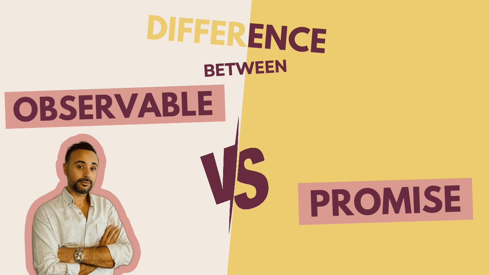

# Difference Between "Promise" and "Observable" in Angular

In this article, I will mention the differences between `Promise` and `Observable` . They are used in TypeScript (Angular) for handling async operations but have different use cases and behaviors. Let's see these six differences...




## 1. Eager or Lazy Evaluation

- **Promise**: A `promise` is **eager**! This means that as soon as a  `promise` is created, it executes the operation, like initiating immediately an HTTP request. **You can't control the execution start time; it begins right away!**

- **Observable:** An `observable` is a **lazy** operation! It doesn't start executing until you subscribe to it. This allows you to define an `observable` without triggering the actual operation until it's needed.

  

## 2. Handling Value Count

- **Promise:** A `promise` is designed to **handle a single async value**. Once the operation completes, it either resolves with a value or rejects with an error, and that's it! You can't emit multiple values with a single `promise`.

- **Observable:** An `observable` **can emit multiple values** over time. It can have several values, and it can continue to do so until it either completes or errors out. So `observable` is ideal for event streams or data streams.

  

## 3. Cancellablity

- **Promise:** Once a `promise` is created and the operation has started**, you cannot cancel it!** The `promise` will resolve or reject eventually, and   there's no way to stop it from being executed.

- **Observable:** An `observable` **can be canceled**. If you unsubscribe from an `observable`, it stops emitting values and can clean up any resources like canceling an ongoing HTTP request. This makes `observable` more flexible in scenarios where you need to abort an operation.

  

## 4. Chaining and Composition

- **Promise:** It **supports chaining** using `.then()` for handling the result and `.catch()` for handling errors. This is straightforward but can become complex for more advanced scenarios.

- **Observable:** It **supports powerful operators** like `map`, `filter`, `merge`, `switchMap`. This allows for complex composition and transformation of data streams and makes it suitable for handling complex async scenarios.

  

## 5. Error Handling:

- **Promise:** Error handling in `promise` is done usually using `.catch()`. However, **if an error occurs**, the `promise` will reject, and **the chain will stop**.

- **Observable:** It has more **robust error-handling mechanisms**. You can handle errors using operators like `catchError` and decide whether to recover, continue or retry the process. It can also be completed successfully after an error is handled.

  

## 6. Built-In or RxJS

- **Promise:** It’s a **built-in feature of JavaScript** and a part of the ECMAScript. Almost all **browsers support it**.
- **Observable:** It’s **not a built-in feature of JavaScript**. In Angular, it’s provided by the `RxJS` library.


---


## Use Cases

**Promise:**

- Simple async operations that return a single result, like fetching data from a Web API.
- Scenarios where you don’t need to cancel the operation.
- Handling a single event or action.

**Observable:**

- Operations that might emit multiple values over time, such as `WebSocket` connections, user input events, or real-time data streams.
- When you need the ability to cancel the operation.
- Complex async flows require composition, transformation, or error handling.


---


## Examples

### Promise Example

```javascript
const myPromise = new Promise((resolve, reject) => {
  setTimeout(() => {
    resolve('Promise is resolved!');
  }, 1000);
});

myPromise.then(value => console.log(value)).catch(error => console.error(error));
```

### Observable Example

```javascript
import { Observable } from 'rxjs';

const myObservable = new Observable(observer => {
  setTimeout(() => {
    observer.next('Value-1 retrieved!');
    observer.next('Value-2 retrieved!');
    observer.complete(); // No more values after this
  }, 1000);
});

const subscription = myObservable.subscribe({
  next: value => console.log(value),
  error: error => console.error(error),
  complete: () => console.log('Observable finished!')
});

/* 
  You can unsubscribe to cancel the observable as below:
  subscription.unsubscribe();
*/
```


## Summary

- **A promise** is simple and suitable for operations that return a single value or need to handle a single event. It’s eager and can’t be canceled.
- **An observable** is more flexible, especially for handling multiple values over time, allowing for complex data manipulation, and providing the ability to cancel operations. It supports lazy operations via `RxJS`.
