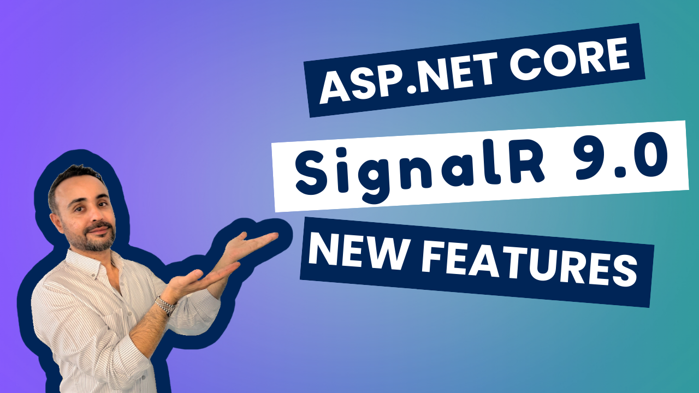
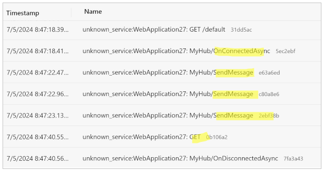

### ASP.NET Core SignalR New Features — Summary

In this article, I’ll highlight the latest .**NET 9 SignalR updates** for ASP.NET Core 9.0.




### SignalR Hub Accepts Base Classes

SignalR `Hub` class can now get a base class of a polymorphic class. As you see in the example below, I can send `Animal` to  `Process` method. Before .NET 9,  we could only pass the derived classes: `Cat` and `Dog`.

```csharp
/*** My Base Class is Animal ***/
[JsonPolymorphic]
[JsonDerivedType(typeof(Cat), nameof(Cat))]
[JsonDerivedType(typeof(Dog), nameof(Dog))]
private class Animal
{
    public string Name { get; set; }
}

/*** CAT derived from Animal ***/
private class Cat : Animal
{
    public CatTypes CatType  { get; set; }
}

/*** DOG derived from Animal ***/
private class Dog : Animal
{
    public DogTypes DogType { get; set; }
}


public class MyHub : Hub
{
    /*** We can use the base type Animal here  ***/
    public void Process(Animal animal)
    {
        if (animal is Cat) { ... }
        else if (animal is Dog) { ... }
    }
}

```


### Better Diagnostics and Telemetry

Microsoft focuses mainly on .NET Aspire nowadays. That’s why SignalR now integrates more deeply with the .NET Activity API, which is commonly used for distributed tracing. The enhancement is implemented for better monitoring in [.NET Aspire Dashboard](https://learn.microsoft.com/en-us/dotnet/aspire/fundamentals/dashboard/overview?tabs=bash#using-the-dashboard-with-net-aspire-projects). To support this feature:

1- Add these packages to your`csproj`:

```xml
<PackageReference Include="OpenTelemetry.Exporter.OpenTelemetryProtocol" Version="1.9.0" />
<PackageReference Include="OpenTelemetry.Extensions.Hosting" Version="1.9.0" />
<PackageReference Include="OpenTelemetry.Instrumentation.AspNetCore" Version="1.9.0" />
```

2- Add the following startup code to your host project:

```csharp
builder.Services.AddSignalR();
/* After AddSignalR use AddOpenTelemetry() */
builder
    .Services
    .AddOpenTelemetry()
    .WithTracing(tracing =>
    {
        if (builder.Environment.IsDevelopment())
        {         
            tracing.SetSampler(new AlwaysOnSampler()); //for dev env monitor all traces
        }

        tracing.AddAspNetCoreInstrumentation();
        tracing.AddSource("Microsoft.AspNetCore.SignalR.Server");
    });

builder.Services.ConfigureOpenTelemetryTracerProvider(tracing => tracing.AddOtlpExporter());
```

Finally, you’ll see the **SignalR Hub** events on the [Aspire Dashboard](https://learn.microsoft.com/en-us/dotnet/aspire/fundamentals/dashboard/overview):




### Trimming and Native AOT Support

With .NET 9, **trimming** and **native** **Ahead Of Time** compilation are **supported**. This will improve our application performance. To support AOT, your SignalR object serialization needs to be JSON, and you must use the `System.Text.Json` s[ource generator](https://learn.microsoft.com/en-us/dotnet/standard/serialization/system-text-json/source-generation). Also on the server side, [you shouldn't use](https://github.com/dotnet/aspnetcore/issues/56179) `IAsyncEnumerable<T>` and `ChannelReader<T>` where `T` is a ValueType (`struct`) for  Hub method arguments. One more limitation; [Strongly typed hubs](https://learn.microsoft.com/en-us/aspnet/core/signalr/hubs?view=aspnetcore-8.0#strongly-typed-hubs) aren't supported with Native AOT (`PublishAot`).  And you should use only `Task`, `Task<T>`, `ValueTask`, `ValueTask<T>` for `async` return types.


---

That's all the new features coming to SignalR in .NET 9!
Happy coding 🧑🏽‍💻
