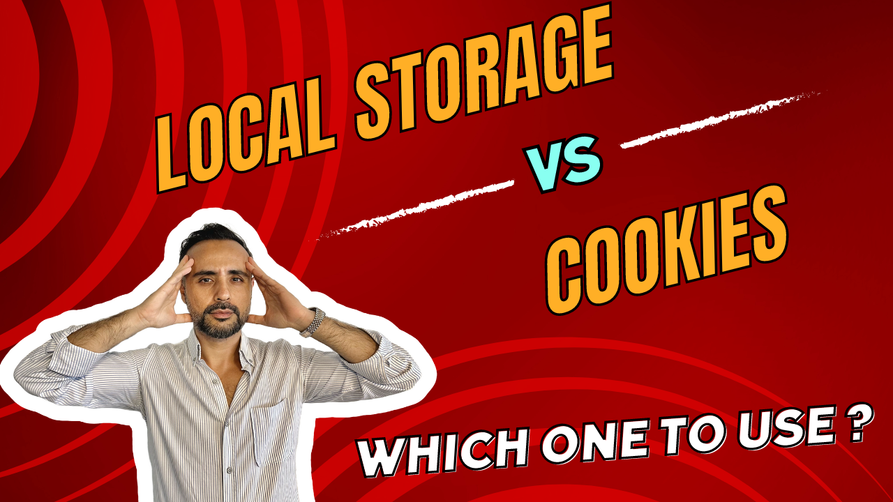

# When to Use Cookies, When to Use Local Storage?

## Cookies vs Local Storage

When you want to save client-side data on browsers, you can use `Cookies` or `Local Storage` of the browser. While these methods look similar, they have different behaviors. You need to decide based on the specific use-case, security concerns and the data size being stored. I'll clarify the differences between these methods. 

## When to use Cookies 🍪?

1. **Server Communication (e.g: Authentication Tokens):** Cookies are ideal when you need to send data automatically with HTTP requests to the server, such as authentication tokens (JWTs) or session IDs. Cookies can be configured to be sent only to specific domains or paths, making them useful for session management.
2. **Cross-Domain Communication:** Cookies can be shared across subdomains, which is useful when working with multiple subdomains under the same parent domain for microservice architecture.
3. **Expiration Control:** Cookies come with built-in expiration times. You don’t need to manually remove them after a certain period that should expire.
4. **Security:** Cookies can be marked as `HttpOnly` which makes them accessible **only via the server**, not via JavaScript! Also, when you set a cookie attribute, `Secure` it can be sent only over HTTPS, which forces enhanced security for sensitive data.

### Considerations for Cookies

- **Size Limitation:** Cookies are generally limited to around 4KB of data.
- **Security Risks:** Cookies are susceptible to cross-site scripting (XSS) attacks unless marked `HttpOnly`.

---

## When to use Local Storage🗄️?

1. **Client-Side Data Storage:** Local storage is ideal for storing large amounts of data (up to 5–10 MB) that doesn’t need to be sent to the server with every request. For example; *user preferences*, *settings*, or *cached data*.
2. **Persistence:** Data in local storage persists even after the browser is restarted. This behavior makes it useful for long-term storage needs.
3. **No Automatic Server Transmission:** Local storage data is never automatically sent to the server, which can be a security advantage if you don’t want certain data to be exposed to the server or included in the requests.

### Considerations for Local Storage

- **Security Risks:** Local storage is accessible via JavaScript, making it vulnerable to XSS attacks. Sensitive data should not be stored in local storage unless adequately encrypted.

- **No Expiration Mechanism:** Local storage does not have a built-in expiration mechanism. You must manually remove the data when it’s no longer needed.

---

## Summary

### Use Cookies

- For data that needs to be sent to the server with HTTP requests, particularly for session management or authentication purposes.

### Use Local Storage

- For storing large amounts of client-side data that doesn’t need to be automatically sent to the server and for data that should persist across browser sessions.

In many cases, you might use both cookies and local storage, depending on the specific requirements of different parts of your application. There are also other places where you can store the client-side data. You can check out [this article](https://developer.mozilla.org/en-US/docs/Learn/JavaScript/Client-side_web_APIs/Client-side_storage) for more information.

Happy coding 🧑🏽‍💻