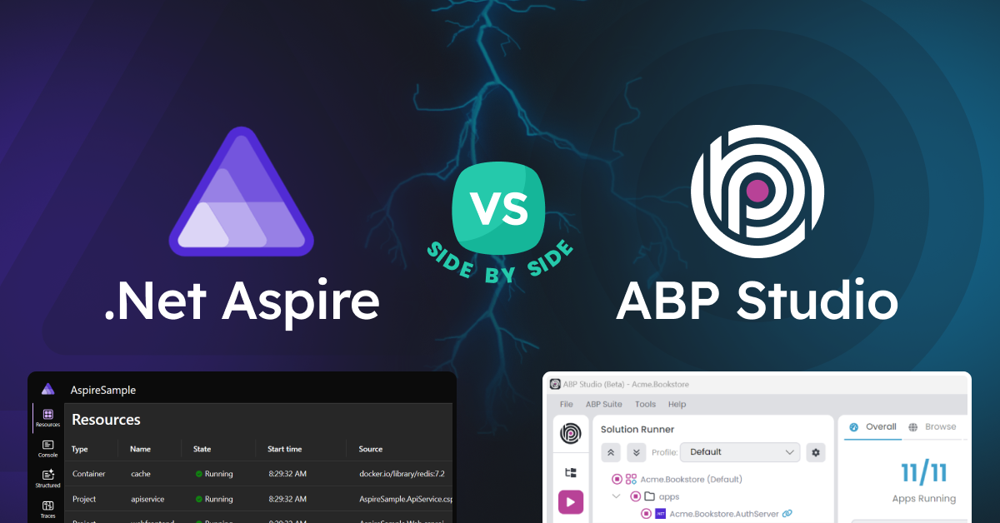
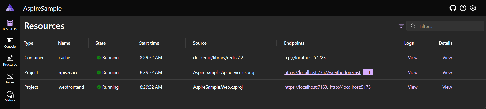
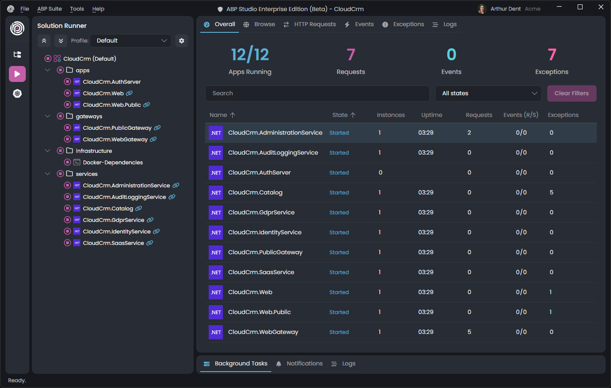
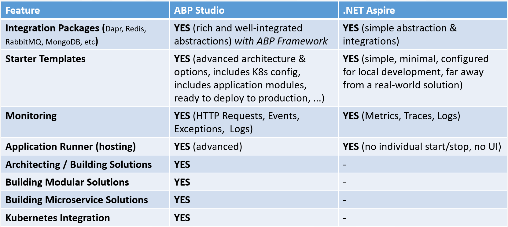
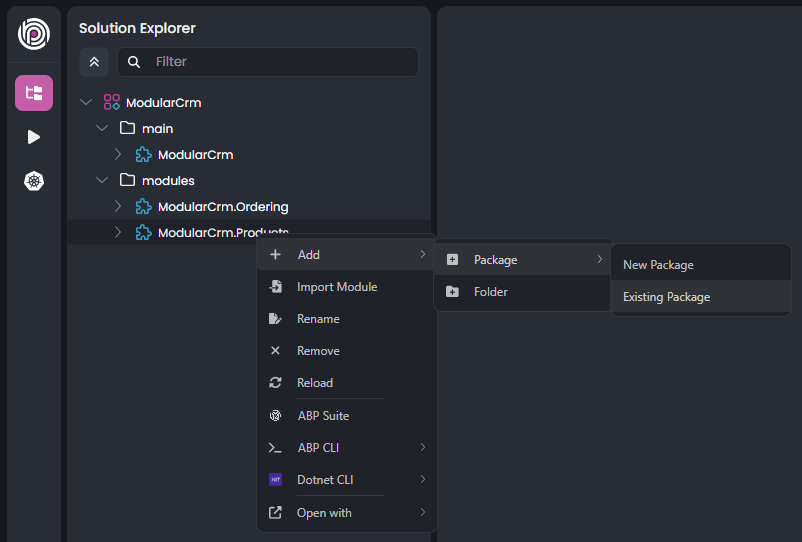
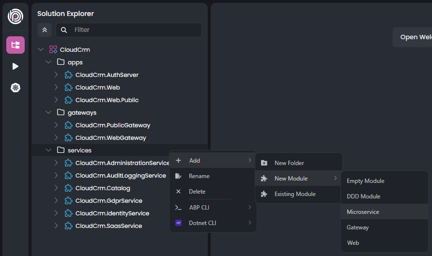
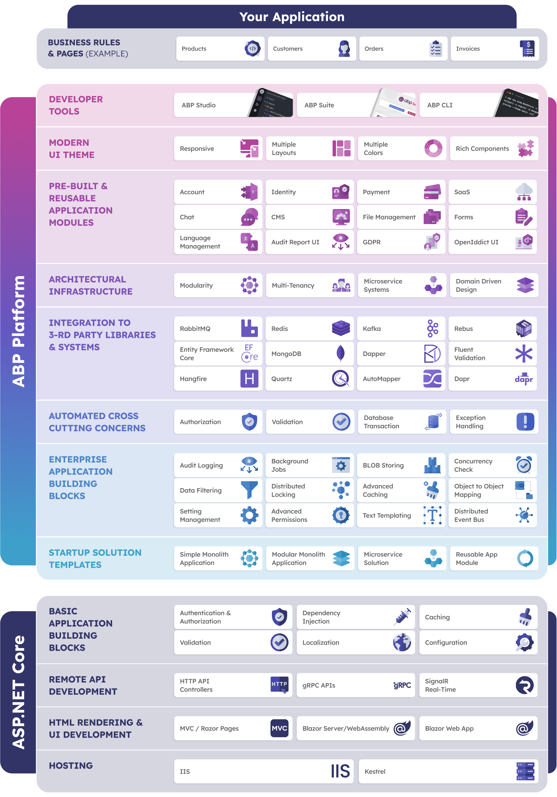

# .NET Aspire vs ABP Studio: Side by Side

In this article, I will compare [.NET Aspire](https://learn.microsoft.com/en-us/dotnet/aspire/) by [ABP Studio](https://abp.io/docs/latest/studio) by explaining their similarities and differences.

## Introduction

While .NET Aspire and ABP Studio are tools for different purpose with different scope and they have different approaches to solve the problems, many developers still may confuse since they also have some similar functionalities and solves some common problems. 

In this article, I will clarify all, and you will have a clear understanding of what are the similarities and differences of them. Let's start by briefly define what are .NET Aspire and ABP Studio.

### What is .NET Aspire?

**[.NET Aspire](https://learn.microsoft.com/en-us/dotnet/aspire/)** is a **cloud-ready framework** designed to simplify building distributed, observable, and production-ready applications. It provides a set of opinionated tools and NuGet packages tailored for cloud-native concerns like **orchestration**, **service integration** (e.g., Redis, PostgreSQL), and **telemetry**. Aspire focuses on the **local development experience**, making it easier to manage complex, multi-service apps by **abstracting away configuration details**.

Here, a screenshot from [.NET Aspire dashboard](https://learn.microsoft.com/en-us/dotnet/aspire/fundamentals/dashboard/overview) that is used for application monitoring and inspection:

### What is ABP Studio?

**[ABP Studio](https://abp.io/docs/latest/studio)** is a cross-platform **desktop application** designed to **simplify development** on the ABP Framework by **automating various tasks** and offering a streamlined, **integrated development environment**. It allows developers to **build**, **run**, **test**, **monitor**, and **deploy applications** more efficiently. With features like Kubernetes integration and support for complex multi-application systems, ABP Studio **enhances productivity**, especially in **microservice or modular monolith architectures**.

Here, a screenshot from the ABP Studio [Solution Runner panel](https://abp.io/docs/latest/studio/running-applications) that is used to run, browse, monitor and inspect applications:

## A Brief Comparison

Before deep diving details, I want to show a **table of features** to compare ABP Studio and .NET Aspire side by side:

## Comparing the Features

In the next sections, I will go through each feature and explain differences and similarities.

### Integration Packages

ABP Framework has tens of integration packages to 3rd-party libraries and services. .NET Aspire also has some library integrations. But these integrations have different purposes:

* **ABP Framework**'s integrations (like [MongoDB](https://abp.io/docs/latest/framework/data/mongodb), [RabbitMQ](https://abp.io/docs/latest/framework/infrastructure/background-jobs/rabbitmq), [Dapr](https://abp.io/docs/latest/framework/dapr), etc) are integrations for its abstractions and aimed to be **used directly by your application code**. They are complete and sophisticated integrations with the ABP Framework and your codebase.
* **.NET Aspire**'s integrations (like [MongoDB](https://learn.microsoft.com/en-us/dotnet/aspire/database/mongodb-integration), [RabbitMQ](https://learn.microsoft.com/en-us/dotnet/aspire/messaging/rabbitmq-integration), [Dapr](https://learn.microsoft.com/en-us/dotnet/aspire/frameworks/dapr), etc), on the other hand, for simplifying configuration, service discovery, orchestration and monitoring of these tools within .NET Aspire host. Basically, these are mostly for **integrating to .NET Aspire**, not for integrating to your application.

For example, ABP's [MongoDB](https://abp.io/docs/latest/framework/data/mongodb) integration allows you to use MongoDB over [repository services](https://abp.io/docs/latest/framework/architecture/domain-driven-design/repositories), automatically handles database transactions, [audit logs](https://abp.io/docs/latest/framework/infrastructure/audit-logging), [event publishing](https://abp.io/docs/latest/framework/infrastructure/event-bus/distributed) on data saves, dynamic [connection string](https://abp.io/docs/latest/framework/fundamentals/connection-strings) management, [multi-tenancy](https://abp.io/docs/latest/framework/architecture/multi-tenancy) integration and so on.

On the other hand, .NET Aspire's [MongoDB](https://learn.microsoft.com/en-us/dotnet/aspire/database/mongodb-integration) integration basically adds [MongoDB driver library](https://www.nuget.org/packages/MongoDB.Driver/) to your .NET Aspire host application and configures it so you can discover MongoDB server on runtime, use a MongoDB Docker container and see its health status, logs and traces on .NET Aspire dashboard.

### Starter Templates

Both of ABP Studio and .NET Aspire provide **startup solution templates for new applications**. However, there are huge differences between these startup solution templates and their purpose are completely different.

* ABP Studio provides **production-ready** and [advanced solution templates](https://abp.io/docs/latest/solution-templates) for **layered**, **modular** or **microservice** solution development. They are well configured for **local development** and deploying to **Kubernetes** and other **production environments**. They provide different **UI and database options**, many optional modules and configuration. For example, you can check the [microservice solution template](https://abp.io/docs/latest/solution-templates/microservice/overview) to see how **sophisticated** it is.
* .NET Aspire's [project templates](https://learn.microsoft.com/en-us/dotnet/aspire/fundamentals/setup-tooling?tabs=windows&pivots=visual-studio#net-aspire-project-templates)' main purpose is to provide a minimal application structure that is **pre-integrated to .NET Aspire** libraries and configured for **local development** environment.

So, when you start with .NET Aspire project template, you will need to deal with a lot of work to make your solution production and enterprise ready. On the other hand, ABP Studio's solution templates are ready to launch your system from the first day and they provide you a perfect starting point for your new business idea.

### Monitoring & Application Running

Monitoring applications and services is an important requirement for building **complex distributed systems**. Both of ABP Studio and .NET Aspire provide **excellent tools** for that purpose.

* ABP Studio's [Solution Runner panel](https://abp.io/docs/latest/studio/running-applications) provides a powerful UI to run and monitor applications and services. You can see all HTTP requests, distributed events, exceptions and detailed application logs, trace and find problems in your system. You can use its fully functional built-in browser to navigate application UIs easily. You can also create multiple profiles to group and configure the applications for different teams.
* .NET Aspire's [dashboard](https://learn.microsoft.com/en-us/dotnet/aspire/fundamentals/dashboard/overview) can be used to see the states of the running applications and containers, explore their console output, logs, traces and metrics to understand what is happing in your distributed system.

Both tools are pretty useful for monitoring. In addition to monitoring, **ABP Studio offers an advanced UI to control the running applications**, build, start and stop individually or by a group of applications.

### Architecting / Building Solutions

One of the unique features of **ABP Studio** is that it **is an architectural tool** that helps you create the structure and architecture of your solution. You can create any kind of application, from **single-layer** simple web applications to **layered multi-application** solutions, from **monolith modular** to **microservice** systems. In the next section, I will briefly explains these architectural features.

#### Building Modular Monolith Solutions

With ABP Studio, you can create a new solution, **create modules and establish relations** (dependencies) between modules to architect your overall **modular monolith system** easily.

Here, a screenshot where we are adding an existing package reference to the Products module of a modular CRM solution:

You can see the [Modular Application Development tutorial](https://abp.io/docs/latest/tutorials/modular-crm) to learn how to build such an application step by step.

#### Building Microservice Solutions

ABP Studio provides a full featured [microservice startup solution template](https://abp.io/docs/latest/solution-templates/microservice) and the fundamental tooling to build **large-scale microservice systems**.

Here a screenshot that shows how to add new microservices, API gateways or web applications to a microservice solution:

.NET Aspire has no such a feature and has no such a plan to provide that kind of architectural solution building experience.

### Kubernetes Integration

Another great ABP Studio feature is [Kubernetes Integration](https://abp.io/docs/latest/studio/kubernetes). It allows you to develop your distributed / microservice solutions as integrated to [Kubernetes](https://kubernetes.io/).

Here, a few tasks you can accomplish using ABP Studio's Kubernetes integration:

* **Build docker images** of your applications and services
* **Install and uninstall Helm charts** to your Kubernetes cluster
* **Connect to internal services** of your Kubernetes cluster
* **Monitor** services and applications that are running in your Kubernetes cluster
* **Intercept traffic** of a service and redirect requests to your local machine. In that way, you can develop, test and run individual services or applications in your local computer that is **fully integrated** to other services and applications running in Kubernetes.

ABP Studio's Kubernetes Integration makes microservice development so easy and comfortable. On the other hand, .NET Aspire has no such a Kubernetes integrated development experience.

## The ABP Platform

Until now, I directly compared ABP Studio and .NET Aspire features. .NET Aspire is directly built on .NET and ASP.NET Core. However, ABP Studio is not a standalone tool that is built on .NET and ASP.NET Core. It is built on the [ABP Platform](https://abp.io/) (which is built on .NET and ASP.NET Core).

The following diagram shows ABP Platform components at a glance:

So, when you use ABP Studio, you also take full power of the [open source ABP Framework](https://github.com/abpframework/abp) and other ABP Platform features.

## ABP and .NET Aspire Integration

I have a good news to you. It is actually possible and pretty easy to make ABP Platform and .NET Aspire working together.

You can check [@berkansasmaz](https://abp.io/community/members/berkansasmaz)'s great article: **[How to use .NET Aspire with ABP framework](https://abp.io/community/articles/how-to-use-.net-aspire-with-abp-framework-h29km4kk)**.

## Licensing

ABP Studio has a Community Edition which is completely free and available to everyone. It includes many of the features I mentioned here. There is also a commercial edition that is included in [commercial ABP licenses](https://abp.io/pricing). You can [check that blog post](https://abp.io/blog/announcing-abp-studio-general-availability) which clearly explains the license differences and introduces the fundamental ABP Studio features.

On the other hand, .NET Aspire is a free tool developed and published by Microsoft. It has no commercial version.

## Conclusion

Both .NET Aspire and ABP Studio serve distinct purposes, catering to different types of development environments. While .NET Aspire excels in simplifying cloud-native application setups and observability, ABP Studio provides a comprehensive framework for modular monoliths and microservice architectures with full-fledged enterprise level production-ready startup solution templates and integrated tools.

In the previous section, it was mentioned that it is possible to [use them together](https://abp.io/community/articles/how-to-use-.net-aspire-with-abp-framework-h29km4kk). You don't have to select one of them. However, in my opinion, when you use ABP Studio, you won't need .NET Aspire since ABP Studio can do everything and much more. If you have budget, I suggest to purchase a commercial ABP Studio [license](https://abp.io/pricing) so you can fully unlock its power.

## Resources / Further Reading

* [ABP Studio documentation](https://abp.io/docs/latest/studio)
* [.NET Aspire documentation](https://learn.microsoft.com/en-us/dotnet/aspire/)
* [How to use .NET Aspire with ABP framework](https://abp.io/community/articles/how-to-use-.net-aspire-with-abp-framework-h29km4kk)
