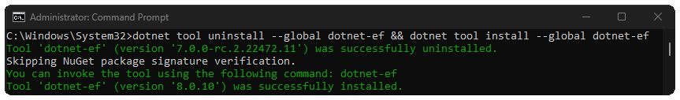
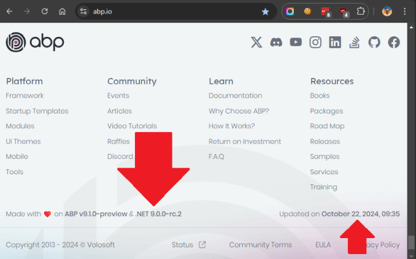
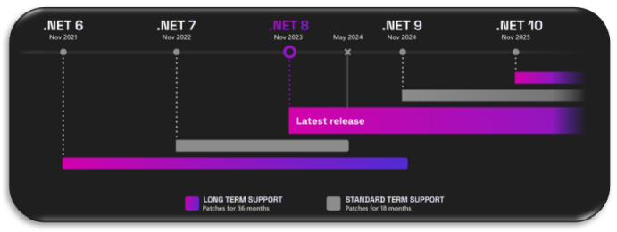

# ABP Now Supports .NET 9


**.NET 9.0.100-rc.2**  has been released on **October 8, 2024**. To align with the latest .NET, we also released the ABP Platform [9.0.0-rc.1](https://github.com/abpframework/abp/releases/tag/9.0.0-rc.1) version. 
**With this release, ABP now supports .NET 9.**

The .NET 9 stable version is planned to be released on **November 12, 2024** before the [.NET Conf 2024](https://www.dotnetconf.net/) event. The ABP 9.0 stable version is planned to be released on November 19, 2024. 

---

- **Download the .NET 9 runtime** and SDK from the following link:

  [https://dotnet.microsoft.com/en-us/download/dotnet/9.0](https://dotnet.microsoft.com/en-us/download/dotnet/9.0)

- There are many enhancements and bug fixes with ABP 9.0. Read the ABP 9 announcement:
  
  https://abp.io/blog/announcing-abp-9-0-release-candidate
  
- 
  Read **our migration ABP 9.0 migration guide** from the following link:

  [abp.io/docs/9.0/release-info/migration-guides/abp-9-0](https://abp.io/docs/9.0/release-info/migration-guides/abp-9-0)

- The following is the **PR is for the .NET 9 upgrade** in the ABP source code:

  [https://github.com/abpframework/abp/pull/20803](https://github.com/abpframework/abp/pull/20803)

---


## .NET 9 Releases

In the following link, you can find **a list of all .NET 9 releases** with direct links to release notes and announcements/discussions:

* https://github.com/dotnet/core/discussions/9234


---


## ABP Supports Both .NET 8 & .NET 9

The ABP 9.0 version fully supports .NET 9 within our new templates and modules. For developers who want to update their ABP packages to the latest but want to keep them in .NET 8, **we support both .NET 8 and .NET 9** in ABP 9. In your host application, you can choose your target framework.

So you can decide which version you want to use in your startup Host Application’s `<TargetFramework>` tag.

In [this link](https://github.com/abpframework/abp/blob/dev/framework/src/Volo.Abp/Volo.Abp.csproj#L7) you can see that netstandard2.0/2.1 and net8/9 are supported.

```xml
<Project Sdk="Microsoft.NET.Sdk">
    <TargetFrameworks>
      netstandard2.0;netstandard2.1;net8.0;net9.0
    </TargetFrameworks>
</Project>
```


### New ASP.NET Core Middleware: Static Asset Delivery

`MapStaticAssets` is a new middleware that helps optimize the delivery of static assets in any ASP.NET Core app, including Blazor apps. With this change, some `JavaScript/CSS/Images` files exist in the [Virtual File System](https://abp.io/docs/latest/framework/infrastructure/virtual-file-system?_redirected=B8ABF606AA1BDF5C629883DF1061649A), but the new ASP.NET Core 9 `MapStaticAssets` can't handle them. You need to add `StaticFileMiddleware` to serve these files. In ABP 9, we added `MapAbpStaticAssetsan `extension method to support the new `MapStaticAssets`. You can read about this new feature at [this link](https://learn.microsoft.com/en-us/aspnet/core/release-notes/aspnetcore-9.0?view=aspnetcore-8.0#static-asset-delivery-optimization). 
ABP’s new extension method is available [here](https://github.com/abpframework/abp/blob/dev/framework/src/Volo.Abp.AspNetCore/Microsoft/AspNetCore/Builder/AbpApplicationBuilderExtensions.cs#L129-L198).

---


## How to Upgrade from .NET 8 to .NET 9:

Install the latest .NET 9 SDK from [this link](https://dotnet.microsoft.com/en-us/download/dotnet/9.0).
Upgrade [dotnet-ef](https://learn.microsoft.com/en-us/ef/core/cli/dotnet) tool version with the following command:

```bash
dotnet tool uninstall --global dotnet-ef && dotnet tool install --global dotnet-ef
```



1. Change all `TargetFramework` tags from `net8.0` to `net9.0`.
2. Upgrade all Microsoft NuGet packages to `9.0.0`.
3. If you have `global.json`, update `dotnet`version to `9.0.0` .
4. Replace`app.UseStaticFiles()` to `app.MapAbpStaticAssets()` in your module classes and startup projects.
   [See the related changes in the repository.](https://github.com/abpframework/abp/commit/0f34f6dfcdbeb5d27fd63cf764f1ef13eb9cdfcd)


---


## What’s new with .NET 9

**.NET 9 Blazor New Features**

- https://abp.io/community/articles/asp.net-core-blazor-9.0-new-features-summary--x0fovych

**.NET 9 Performance Improvements Summary**

- https://abp.io/community/articles/.net-9-performance-improvements-summary-gmww3gl8

**What’s new in .NET 9 (Microsoft’s post)**

- https://learn.microsoft.com/en-us/dotnet/core/whats-new/dotnet-9/overview


---


## We Are Eating Our Own Dog Food

Before we release any version of ABP, **we test our upcoming version** on our sample apps and live website https://abp.io. The ABP.io website is also built on top of the ABP Framework, and you can see that we have already started to use .NET 9-rc.2 on our live website.




---


## Microsoft .NET Support Policy

Lastly, I want to mention Microsoft's .NET support policy.

- **.NET 7** support has been **finished** on **May 2024**. 
- **.NET 8** will be supported until **November 2026**.
- **.NET 9** is on the standard term support, which means Microsoft will release patches until **May 2026**.

Find detailed information about the .NET support policy at [this link.](https://dotnet.microsoft.com/en-us/platform/support/policy/dotnet-core) 



---


## Finally

.NET 9 is making a significant impact. It introduces features like Native AOT for faster applications, enhanced AI integration and improved tools for cloud-native and cross-platform development, all aimed at simplifying developers’ work. Whether you’re handling small projects or large-scale enterprise applications, it offers enhancements that **elevate your productivity by just upgrading your .NET version to 9.0** 
