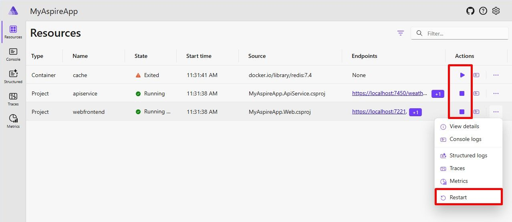
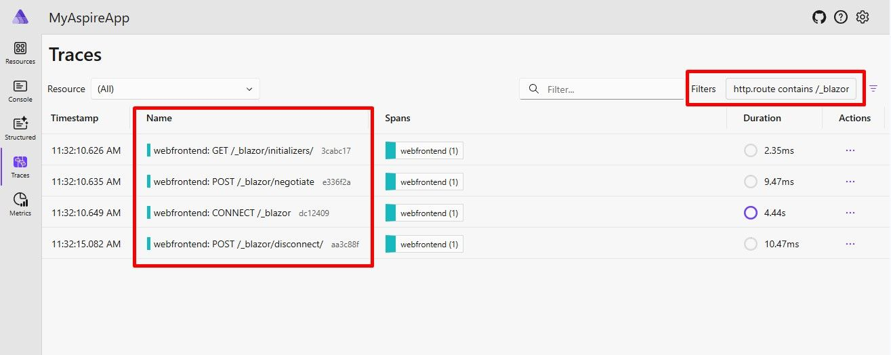

# Aspire 9.0 Features

Aspire 9.0 is the next major release, supporting both .NET 8 and .NET 9. This version includes new features and improvements.

## Upgrade to Aspire

Now, you don't need workloads to develop Aspire applications. In your project, you can add an SDK reference to `Aspire.AppHost.Sdk`.
For more information, you can check out [https://aspire.dev/whats-new/aspire-9/#upgrade-to-aspire-9](https://aspire.dev/whats-new/aspire-9/#upgrade-to-aspire-9) which explains upgrading an existing project in details.

## Dashboard

Aspire offers a nice dashboard for developers to observe the performance and behavior of their applications. In this version, there are some enhancements;

* **Manage resource lifecycle**: You can stop, start, and restart resources.
* **Mobile and responsive support**: The Aspire dashboard is now mobile-friendly.
* **Sensitive properties**: Properties can be marked as sensitive, automatically masking them in the dashboard UI.
* **Volumes**: Configured container volumes are listed in resource details.
* **Health checks**: Aspire 9 adds support for health checks.

## Telemetry

Aspire 9 comes with many new features to the Telemetry service.

* **Improve telemetry filtering**: Telemetry data can now be filtered by attribute values. 
* **Combine telemetry from multiple resources**: If a resource has multiple replicas, you can now filter telemetry data to view from all instances.
* **Browser telemetry support**: The dashboard now supports OpenTelemetry Protocol (OTLP) over HTTP and cross-origin resource sharing (CORS).

## Orchestration

The .NET App Host is a core component of the .NET runtime that helps launch and execute .NET applications. 
Aspire 9 introduces many new features to the app host. Let's take a look;

* **Waiting for dependencies**: You can configure a resource to wait for another resource to start before starting.
* **Resource health checks**: The `Waiting for dependencies` feature uses health checks to determine if a resource is ready. 

## Integrations

Aspire has integrations with some services and tools that make it easy to get started. New integrations are coming with Aspire 9.

* Redis Insight
* OpenAI (Preview)
* MongoDB
* Azure

For Azure part, it is better to check the official documentation here [https://aspire.dev/whats-new/aspire-9/#important-azure-improvements](https://aspire.dev/whats-new/aspire-9/#important-azure-improvements) because it has a very detailed explanation.

## ABP Studio

Aspire and [ABP Studio](https://abp.io/studio) are tools for different purposes with different scopes, and they have different approaches to solving problems; many developers may still be confused since they also have some similar functionalities and solve some common problems. You can check the comparison of Aspire and ABP Studio in this [article](https://abp.io/community/articles/.net-aspire-vs-abp-studio-side-by-side-t1c73d1l).

