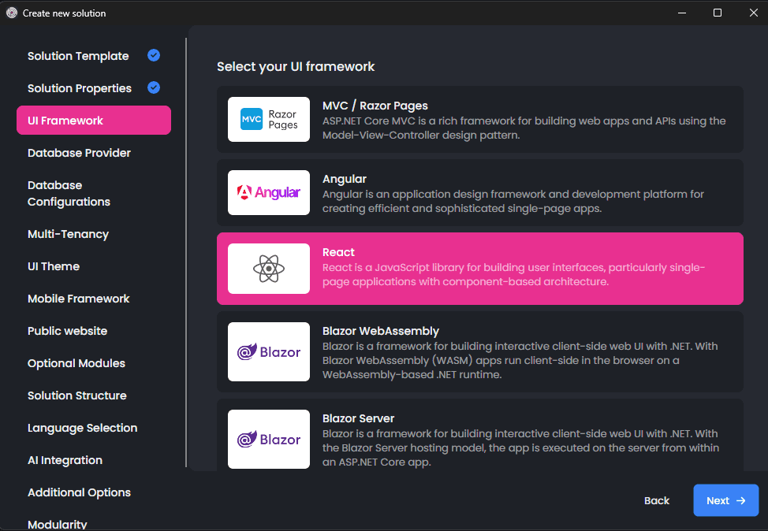
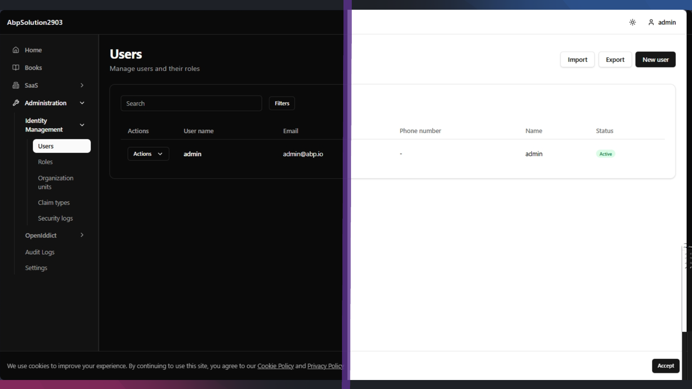

# Something Big Is Happening: Official React UI Is Coming to ABP Framework

Something big is happening in the ABP ecosystem.

We are working on an **official React UI template** for ABP Framework, and we wanted to share an early look at the direction. It is still under active development, so some details may evolve before the release, but the foundation is already exciting: a modern React experience that feels naturally integrated with the ABP way of building applications.

## Why this matters

ABP Framework has always been about helping teams build modern, maintainable, production-ready applications faster. With the upcoming React template, we are extending that same vision to teams who want ABP on the backend and React on the frontend without losing the built-in application features that make ABP productive from day one.

This is not just about creating another empty starter. The goal is a **first-class UI option** that fits into the ABP application startup experience and works naturally with familiar ABP concepts such as authentication, authorization, localization, multi-tenancy, modularity, and deployability.

## A quick look at the architecture

The current implementation shows a clear and practical direction.

On the backend side, the familiar ABP application structure stays in place. The React app lives as a dedicated frontend application in the solution and communicates with the ABP backend through HTTP APIs. For local development, the frontend uses a development proxy so the developer experience stays smooth. For deployment scenarios, the template is also prepared for runtime configuration and container-based environments.

The frontend bootstrapping flow is also designed with ABP integration in mind. Before the app renders, it loads runtime configuration and initializes OpenID Connect authentication. After that, the application starts with providers for theming, authentication, routing, and server-state management. In practice, this means the React template is being built as a real application shell, not just a static UI layer.

Another nice touch is how the API communication is organized. Instead of scattering raw fetch calls across the app, the template uses a dedicated API layer with typed modules. That layer is wired with ABP-aware behavior such as bearer token handling, tenant context, localization headers, and authorization redirects. It creates a strong base for building real business applications.

## A different frontend philosophy

One of the most important things to understand is that this React UI is **not** being shaped with exactly the same architecture as some of the previous UI options.

We are not trying to ship the whole frontend experience as a closed set of page implementations coming from npm packages. Instead, the goal is to give developers much more direct control over the generated application, its design system, and the frontend code they work with every day.

In practice, the generated solution includes the actual page code inside the app itself. You can open it, understand it, refactor it, redesign it, and adapt it without fighting against a packaged black box. We provide the foundations and reusable components, while the page layer stays in the hands of the application developer.

## Built for AI-Driven Development

The new React template is also being shaped for the era of **AI-assisted development**. We intentionally picked common, modern technologies that AI tools and coding agents already understand and work with very well.

Just as importantly, the generated app contains the real frontend and page code inside the solution. That makes it much easier for AI to read the codebase, learn the project patterns, and help generate, customize, and refactor features without running into a packaged black box.

## What the React experience looks like

The current template already points to the kind of experience React developers expect from a modern application:

- A Vite-powered React + TypeScript frontend
- Structured routing with route guards and permission-aware navigation
- A clean application layout with separate account and app areas
- Typed API modules for common ABP features
- Included page implementations for account flows and administration scenarios, directly in the generated app
- A deployment story that considers Docker, Helm, and runtime environment configuration

From the source code, it is already clear that the template is being shaped as a real ABP solution experience, not just a login page plus a few demo screens.

## Technologies currently in the mix

Because this work is still in progress, we do not want to over-promise on every implementation detail. Still, the current template already gives a strong signal about the overall stack and direction.

At the moment, the React UI is built around:

- **React** and **TypeScript**
- **Vite** for the frontend development experience
- **TanStack Router** for application routing
- **TanStack Query** for server-state and data-fetching workflows
- **Axios** for the API layer
- **Tailwind CSS** with a component approach based on modern UI primitives
- **React Hook Form** and **Zod** for form handling and validation
- **i18next** for localization
- ABP-specific React packages for **OIDC authentication**, **application configuration**, and **permission-aware behavior**

This combination gives the template a very modern feel while still keeping the focus on enterprise application needs.

## More than a hello world

One of the most exciting parts is that the template is already going beyond the basics.

The current source shows support for account-related flows such as login, registration, password recovery, profile management, and session management. It also includes administrative areas such as identity management and settings, and it is being prepared to light up additional ABP modules depending on the solution configuration, including areas like SaaS management, audit logging, OpenIddict administration, GDPR-related pages, and AI Management.

That is a strong sign of where this is heading: **an official React experience that aims to feel genuinely at home in the ABP ecosystem**.

## We are just getting started

There is still work ahead, and some pieces may change before the final release. That is exactly why we are sharing this as an early overview rather than a deep technical walkthrough. The big story is not one specific library choice or one page implementation. The big story is that **official React support is becoming real inside ABP Framework**.

If you have been waiting for a more official React path in ABP, this is the moment to get excited.

More details will come as we move closer to release.
