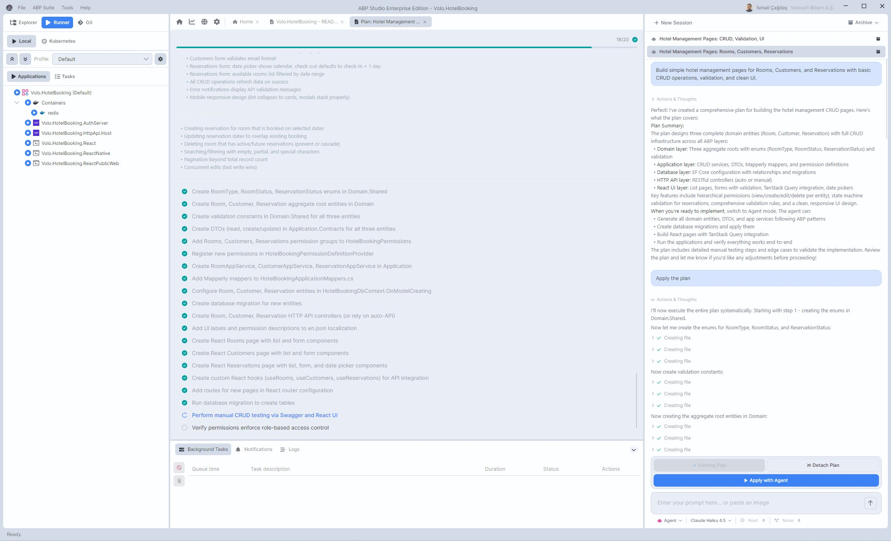
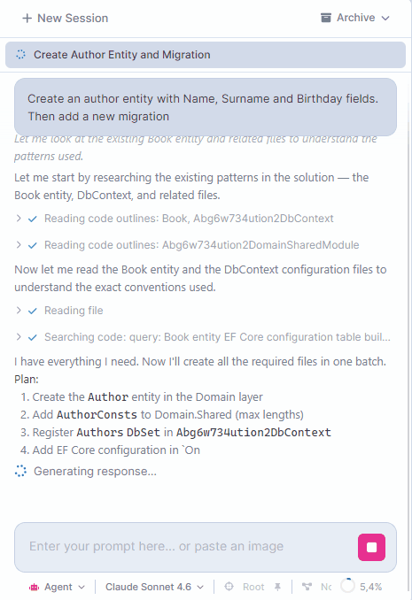
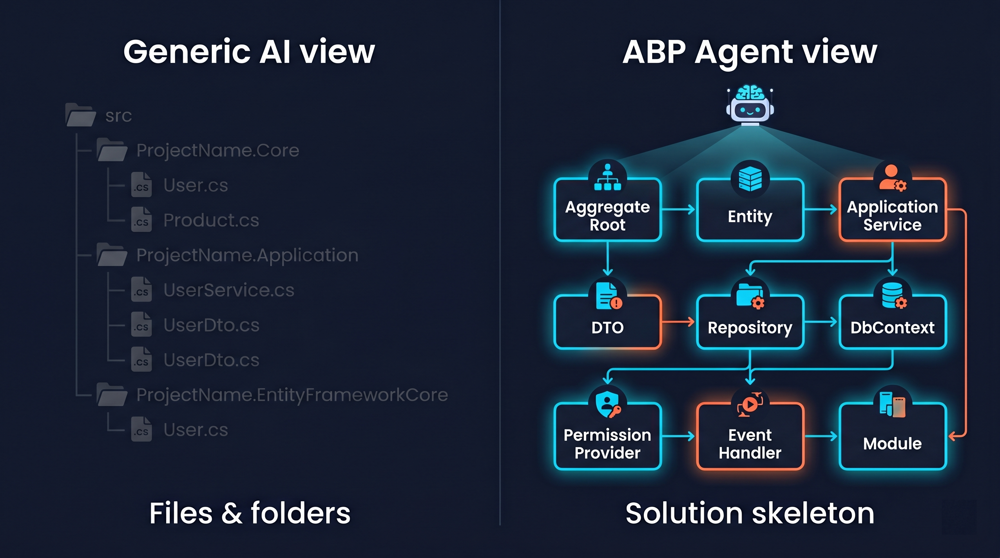
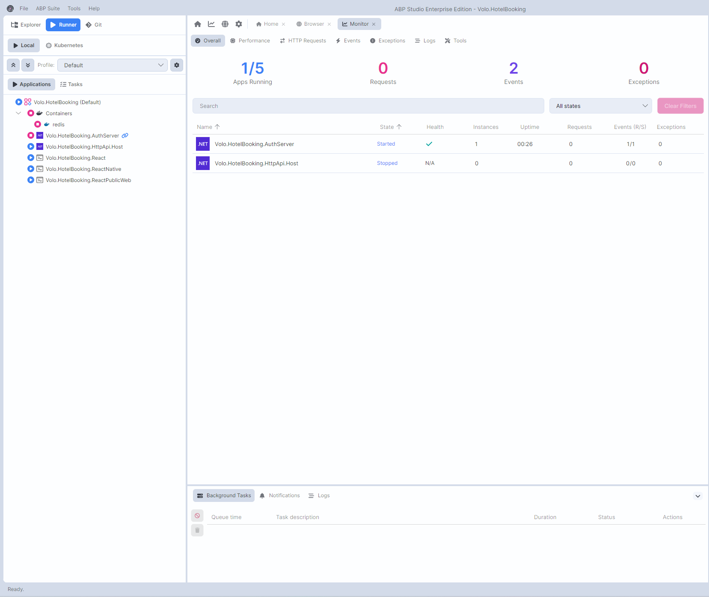
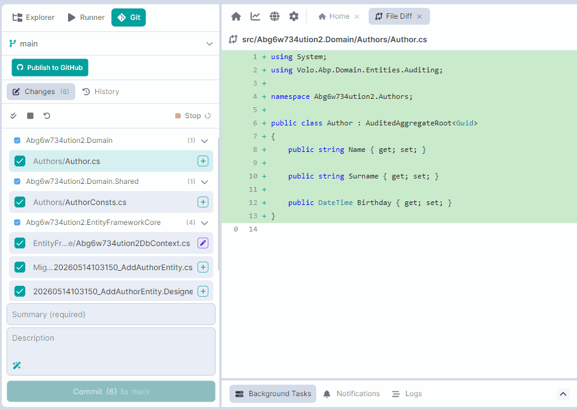
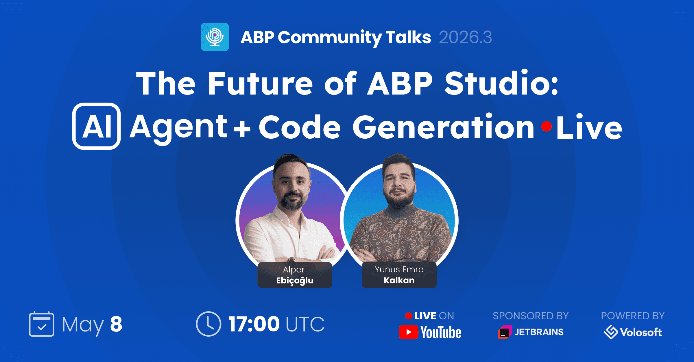

# Introducing ABP Studio AI Agent

The new ABP Studio release introduces a deeply integrated set of features designed around one idea: an AI coding agent that truly understands ABP solutions, sitting inside an IDE that already knows how to build, run, monitor, and iterate on them.

At the center is **ABP Agent**, our AI coding assistant. Around it are long-standing ABP Studio capabilities that have been brought together into a single development loop. Together they turn ABP Studio into a single place where you architect and code your ABP solutions.

---

## Meet ABP Agent

ABP Agent is the AI coding assistant built into ABP Studio. It operates in three modes, each tuned for a different stage of work:

- **Agent mode**: the implementation mode. The agent reads the solution, writes and edits files, builds the affected projects, runs your apps, watches the runtime, and iterates until the change works end-to-end.
- **Plan mode**: read-only planning. The agent investigates the codebase, researches the official ABP documentation, and produces a structured implementation plan (Problem, Solution, Workflow Diagram, Files Affected, Expected Result). When you are happy with the plan, a single click promotes it into Agent mode and the implementation starts from the plan.
- **Ask mode**: read-only Q&A. The agent explains how something works, draws diagrams, and answers questions about your code without touching any files.

The agent is **ABP-aware by default**. It is instructed to prefer ABP base classes over plain POCOs, repositories over direct `DbContext` injection, `ApplicationService` over plain services, the ABP permission system over `[Authorize(Roles=…)]`, localized strings over hardcoded text, `BusinessException`/`UserFriendlyException` over plain `Exception`, the distributed cache abstraction over raw memory cache, and background job abstractions over hand-rolled hosted services. When it is unsure about an ABP feature, it consults the official ABP documentation as a primary source of truth, not random blog posts on the web.

---

## Why It Was Needed

General-purpose AI coding tools (Cursor, Claude Code, Windsurf, opencode and similar) are excellent for horizontal, file-shaped work. They read source files, edit them, and run shell commands. That works well for small scripts or front-end apps.

ABP solutions are different. A typical ABP solution is **system-shaped**, not just file-shaped: the important context is not only where files are located, but how modules, layers, permissions, contracts, localization, persistence, and UI pieces work together:

- It is split across multiple modules and layers (Domain, Application, EntityFrameworkCore, HttpApi, Web, etc.) with strict dependency rules.
- It is composed of many runnable units: HTTP services, gateways, identity servers, background workers, SPAs, mobile apps, plus the Docker containers they depend on.
- It follows a strong set of conventions: aggregate roots, repositories, application services, DTOs, permissions, localization, event bus, distributed cache, background jobs.
- It is a *living* system at design time. You don't just read code, you run it, watch logs, follow distributed events, hit HTTP endpoints, and iterate.

A generic agent has none of that vocabulary. It does not know what a module is, which project is the Domain layer, or that an `ApplicationService` should not depend on a `DbContext` directly. It cannot start "the gateway, the auth server, and the two microservices my React app talks to". It just runs `dotnet run` in some folder and hopes. It cannot tell you that the agent's latest edit caused a runtime exception in the Identity service or made the `OrderPlacedEto` event handler silently fail, because it has no concept of "running app".

ABP Agent and the surrounding ABP Studio features were built to close exactly that gap. The agent is born inside an IDE that already understands modules, run profiles, builds, migrations, proxies, Docker containers, Kubernetes services, and distributed runtime telemetry, and it uses every one of them.

---

## How ABP Agent Sees Your Application: The Analyze Engine

Before ABP Agent answers anything, it needs to *understand* your solution. This is where the **Analyze** feature does the heavy lifting.

When you open a solution, ABP Studio analyzes every package and builds a structural map: the application's **skeleton**. It identifies what each type actually is in ABP terms: an aggregate root, an entity, a value object, a repository interface or implementation, a domain service, an application service or interface, a DTO, an integration service, a controller, an HTTP API, a background job or worker, an event handler, an ETO, a SignalR hub, a DbContext (EF Core or MongoDB), a permission/feature/setting provider, a global feature, a Mapperly or AutoMapper profile, a fluent validator, a menu contributor, a data seed contributor, an options class, an ABP module with its `[DependsOn]` chain, and many more.

For each of these, the analyzer captures the structural information that actually matters: properties, method signatures with their line ranges, injected dependencies, base classes, the permission groups and items, the feature tree, the settings catalog, the database tables and collections, without parsing C# at runtime.

ABP Agent receives this analyzed skeleton at the start of every session. That means:

- The agent already knows what types exist in each project and what role each one plays, before you ask anything.
- When you say *"add a Category to my Catalog module"*, the agent already knows where the Domain project is, what the existing aggregate roots look like, which DbContext should get the new entity, where the permissions provider lives, and which application service to extend.
- When the agent needs to change an existing type, it can fetch a precise outline (base classes, properties, method signatures with exact line ranges) instead of reading thousands of lines of source. That is dramatically faster, dramatically cheaper, and dramatically more accurate.
- When you modify code, ABP Studio re-analyzes only the affected packages and refreshes the agent's understanding.

This is what we mean by **solution-aware AI**. The agent does not "look at folders and guess"; it works from a typed, ABP-shaped index of your application.

---

## Native .NET Awareness: No Shell Gymnastics

A common pattern in generic agentic IDEs is to do everything through the terminal. Building? Run `dotnet build` in a shell. Restarting an app? Spawn a process. Adding a migration? More shell. Checking whether the build succeeded? Parse terminal output and pray.

ABP Agent does not work through a terminal for these things. Building, running, restarting, adding migrations, generating proxies, installing client-side libraries: all of these are **first-class operations** the agent invokes directly. Build calls return structured results with errors and warnings the agent can act on immediately. Starting an application returns a structured outcome: which apps started, which failed, and a summarized error log for each failure. There is no string-scraping, no "did the spinner stop yet?" guessing.

The agent also scopes builds intelligently. It can build a single project, a single module, or the entire solution depending on what changed. After editing a few files in your Application layer, it builds just that module (not the whole solution), and only escalates the scope when needed.

---

## Solution Runner & Live Runtime Monitor

This is the half of ABP Agent that no general-purpose AI IDE can replicate, because no general-purpose AI IDE has a first-class runner for distributed .NET solutions.

**Solution Runner** is the ABP Studio feature that knows about every runnable thing in your solution: web apps, microservices, gateways, identity servers, background workers, CLI applications, mobile and SPA front-ends, plus the Docker containers your stack depends on (databases, caches, message brokers). Apps are grouped into folders and can be launched as a coherent set under a named *run profile*. You start everything with one click; ABP Studio handles ports, dependencies, restart-on-failure, and embedded browser previews.

ABP Agent talks to the Solution Runner directly. It can:

- Start, stop, or restart a specific application, every application inside a folder ("Backend/API"), or all applications.
- Start or stop Docker containers separately from applications.
- Run tasks defined in your run profile (database migrations, npm scripts, custom scripts).

When the agent starts an application that crashes on startup, it does not loop forever restarting it. It captures the recent logs from that application, summarizes the failure, returns a structured report to itself, and uses that to **fix the underlying bug in the code** before trying again.

But starting apps is only half of it. The **runtime monitor** is the other half. When your applications run under ABP Studio, the IDE collects, in real time:

- **Exceptions**: type, message, full stack trace, inner exceptions, source application.
- **Logs**: timestamps, log level, application, message.
- **HTTP requests**: method, URL, status code, response time.
- **Distributed events**: name, source, direction (published/received), and payload.

ABP Agent can query all of this. The development loop becomes:

> Generate the code → Build the affected module → Restart the affected application → Hit the endpoint or perform the action → Ask the agent to inspect the last exceptions, the failing HTTP requests, and the distributed events → Fix the bug → Repeat.

That is the loop a generic IDE cannot do, because it cannot see your application after it starts. ABP Agent can.

---

## Custom Workflows & Task Runner Integration: Determinism When You Need It

LLMs are powerful but non-deterministic. In real teams, some steps must happen **every time** (before or after the agent works) and they must happen in a known order. That is what **Custom Workflows** are for.

A workflow is a named sequence of deterministic steps with a *Before* phase and an *After* phase. You can configure steps such as:

- Build (whole solution, specific modules, or specific packages)
- Start, stop, or restart applications (specific apps, an entire folder, or all)
- Start or stop containers
- Run a Task (any custom task defined in your run profile: `npm install`, custom scripts, code generators, database resets, anything your team already wired into ABP Studio's Task Runner)
- Add a database migration
- Install client-side libraries
- Generate C# or Angular client proxies for HTTP APIs

For example, you can configure a workflow that:

- **Before** the agent works: starts the required containers and runs a code-generation Task.
- **After** the agent works: builds the affected modules, regenerates client proxies, restarts the gateway and the SPA, and adds a database migration.

Workflows can be **personal** to you, or **shared with your team** through the solution's run profile file, so the deterministic pre/post pipeline travels with the repository and every developer gets the same behavior.

The result is a clean separation: the LLM handles the creative, ambiguous middle (designing the change and writing the code), while your workflow guarantees the boring, must-happen steps around it. The agent becomes more deterministic exactly where determinism matters, without losing flexibility where it doesn't.

The Task Runner integration is what makes the *After* phase especially valuable. You can run absolutely anything as a post-step: npm scripts, custom executables, code generators, integration test runners, lint passes, database refresh scripts. If your team already runs it as part of "I just changed some code, now do X", you can run it automatically after every agent turn.

---

## Git & GitHub: Reviewing and Committing Without Leaving the IDE

ABP Studio now ships a full Git client with deep GitHub integration. The goal is simple: once the agent finishes a change, you should be able to review, commit, push, branch, and respond to review feedback **without ever leaving ABP Studio**.

The Git side covers everything you'd expect:

- Stage and commit changes with rich, package-grouped change views.
- Create, switch, and merge branches.
- Stash and restore work, including a clear flow for stashing before switching branches.
- View commit history and create branches from any commit.
- Resolve merge conflicts with a built-in conflict editor.
- Push, pull, fetch, with seamless OAuth-based GitHub authentication.

On the GitHub side:

- Browse and filter Issues, view their comments, and send an issue (or just its comments) directly to ABP Agent to start working on it.
- View existing Pull Requests, see their requested changes and comments inline, and send the requested-changes feedback straight into ABP Agent so it can address the reviewer's comments. You can send the feedback into the same session you used to write the change, or start a fresh agent session.
- A one-click "Create Pull Request" action opens the new-PR page on GitHub directly from the IDE, pre-targeted at the current branch.
- Jump to any file on GitHub directly from the IDE.

Two AI-assisted touches make this loop especially smooth:

- **AI-generated commit messages.** Click "Generate with AI" and ABP Agent writes a Conventional Commits-style message from the staged diff. Edit it if you want, then commit.
- **AI Code Review on the diff.** Select the files you want reviewed, run AI review, and inline suggestions stream into the IDE as the analysis runs. Crucially, this is not a generic code review; it is an **ABP-aware** review. The reviewer looks for ABP-specific pattern violations: plain POCOs where ABP base classes belong, direct `DbContext` injection where a repository should be used, hardcoded strings where localization should be used, plain exceptions where `BusinessException` belongs, role-based authorization where ABP Permissions are the right answer, and so on. When the reviewer is unsure, it consults the official ABP documentation before flagging an issue.

The result is a *closed loop*: the agent writes the change, you (or the AI reviewer agent) review the diff, you let the agent fix the comments, you commit with an AI-suggested message, you push, and you head to GitHub for the pull request, all from inside ABP Studio.

---

## The End-to-End Development Loop

Put the pieces together and ABP Studio becomes the single place where the whole development cycle happens:

1. Open an issue from GitHub, send it to ABP Agent.
2. Switch to Plan mode; ABP Agent investigates the analyzed solution, consults the ABP docs, produces a structured plan.
3. Promote the plan to Agent mode. Implementation starts from the plan.
4. The *Before* workflow runs (start containers, run preparation tasks).
5. ABP Agent writes the code, batching edits across the affected modules, and fixes any compile errors directly.
6. The *After* workflow runs (build the affected modules, install client-side libraries, generate proxies, add a database migration, restart the impacted applications).
7. ABP Agent inspects the runtime monitor (exceptions, logs, HTTP requests, distributed events) and fixes any bug it sees.
8. You (or the AI reviewer) review the diff. Comments are sent back into the same agent session, or into a new one.
9. ABP Agent generates a commit message; you commit and push.
10. Open the new-pull-request page on GitHub with one click from ABP Studio. When reviewers leave requested changes, send them into the same agent session or start a fresh one, and iterate.

You do not need to switch to a terminal to build. You do not need a separate tool to start your microservices. You do not need a different IDE to watch logs. You do not need a separate window for Git and GitHub. **ABP Studio is the only program you use during development, all in one.**

---

## Learning Over Time

ABP Agent also has a small but powerful feedback feature: when it makes a mistake and you (or the build, or the ABP docs) correct it, it can save that correction as a **lesson**. Lessons are short, verified notes that the agent carries forward into future turns and future sessions, so the same mistake does not happen twice. Over time, the agent gets better at the specific conventions and quirks of *your* solution, not just generic ABP.

---

## Honest Comparison With Generic AI IDEs

To be fair: Cursor, Claude Code, Windsurf and opencode are excellent products. They have semantic search, plan/agent modes, sub-agents, file editing, and shell access, and we wouldn't dispute any of that. But for ABP development specifically, here is where ABP Agent is genuinely different:

| Capability | ABP Agent | Generic AI IDEs |
| --- | --- | --- |
| Aware of ABP roles (aggregate root, app service, repository, DTO, ETO, event handler, etc.) | Yes, structurally indexed | No (flat file/text view) |
| Knows your solution's modules, layers and dependency rules | Yes | No |
| Builds with module/package scope as a first-class operation | Yes, structured build result | No, runs `dotnet build` in a shell and parses output |
| First-class Solution Runner for distributed .NET apps + containers | Yes | No, generic shell processes |
| Restarting an application, opening its URL, waiting for it to be ready | Yes, built in | No |
| Live runtime telemetry as a tool: exceptions, logs, HTTP requests, distributed events | Yes | No |
| ABP-specific patterns checked during AI code review | Yes | Generic patterns only |
| Pre/post workflows with deterministic build / start / migrate / generate-proxies steps | Yes | No first-class concept |
| Task Runner integration for arbitrary pre/post steps owned by your team | Yes | No |
| Adding EF Core migrations as a first-class agent action | Yes | Shell only |
| Generating C#/Angular client proxies as a first-class agent action | Yes | Shell only |
| Native ABP documentation as authoritative source for the agent's decisions | Yes | Generic web search |
| Integrated Git + GitHub (issues, PR viewing, AI review) inside the same window | Yes | Partial / external |

The pattern is consistent: **anything ABP-specific or runtime-specific belongs to ABP Agent and ABP Studio. Anything general-purpose is something everyone has.** That is the line we drew on purpose.

---

## What This Means For You

If you build with ABP Framework, this release changes how you work in three concrete ways:

1. **You stop describing your solution to the AI.** ABP Agent already knows it.
2. **You stop bouncing between tools.** Editor, runner, runtime monitor, Git, GitHub, AI review, they all live in one window with one feedback loop.
3. **You stop accepting non-deterministic side effects.** Custom workflows + Task Runner integration make the boring steps boring again, while the agent focuses on the creative ones.

This is the first release that brings AI assistance to ABP Studio, and we built it so that it is designed *around* the agent rather than bolted on. We think this is the natural shape of AI-assisted enterprise .NET development.

---

## Short-Term Roadmap

This release is the first step. The features below are already on our short-term roadmap and will land in upcoming releases:

- **Debug Mode**: a dedicated mode where you and ABP Agent co-operate when debugging the solution. The agent can follow breakpoints, inspect state, propose fixes mid-session, and re-run after each change.
- **Browser control for the agent**: ABP Agent will be able to drive the embedded browser, browse pages, fill forms, and click buttons, so it can verify a UI flow end-to-end on its own and report what it observed.
- **Custom Workflows improvements**: more step types, richer conditions, finer-grained targets, and better visibility into which workflow ran for which agent turn.
- **GitHub integration improvements**: in-IDE pull request creation (no more jumping to the GitHub website), richer review handling, and more first-class issue and PR actions for the agent.
- **Git integration improvements**: more advanced day-to-day Git operations available without leaving the IDE.
- **Design helper**: ABP Agent will generate images.
- **Create a new project with the agent**: an AI-driven solution creation flow where you describe the application you want and ABP Agent helps choose the right template, modules, and configuration.
- **ABP Suite integration**: ABP Agent will be able to invoke ABP Suite for CRUD-page generation. Instead of asking the LLM to write the full set of layers for a CRUD page (which spends a lot of tokens and time), the agent will hand the task to ABP Suite, get a deterministic, production-quality result back, and continue with the parts that actually need the AI.

## Live Demo

We have previewed the ABP Agent in our latest community talk. Click to watch it:

### Also see

* https://abp.io/studio/ai-agent