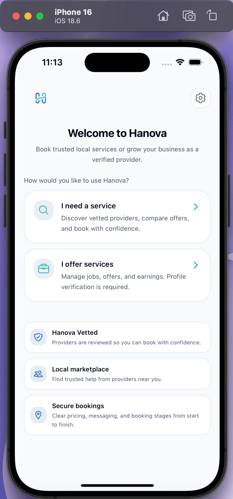
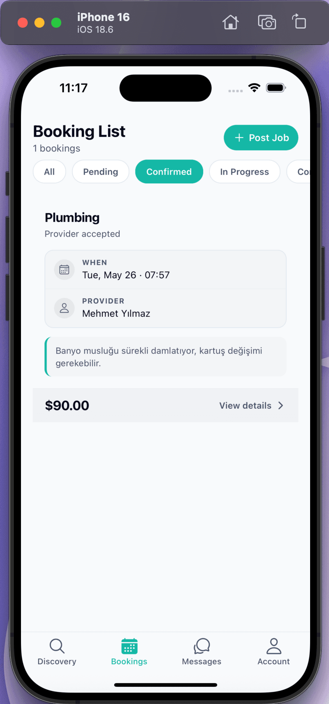
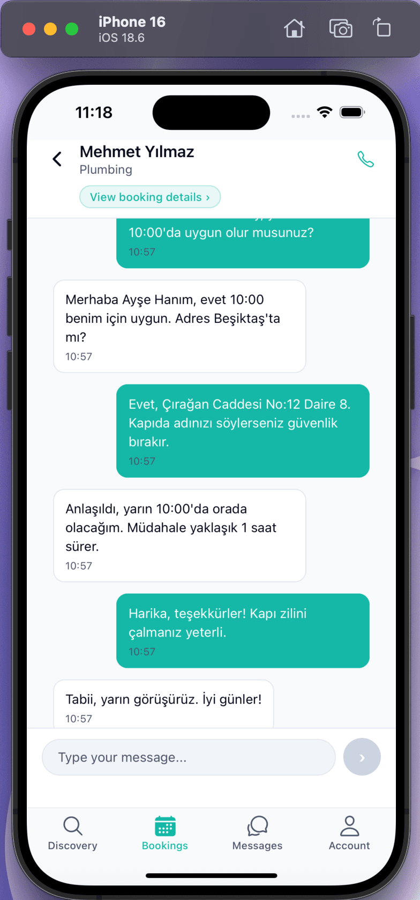
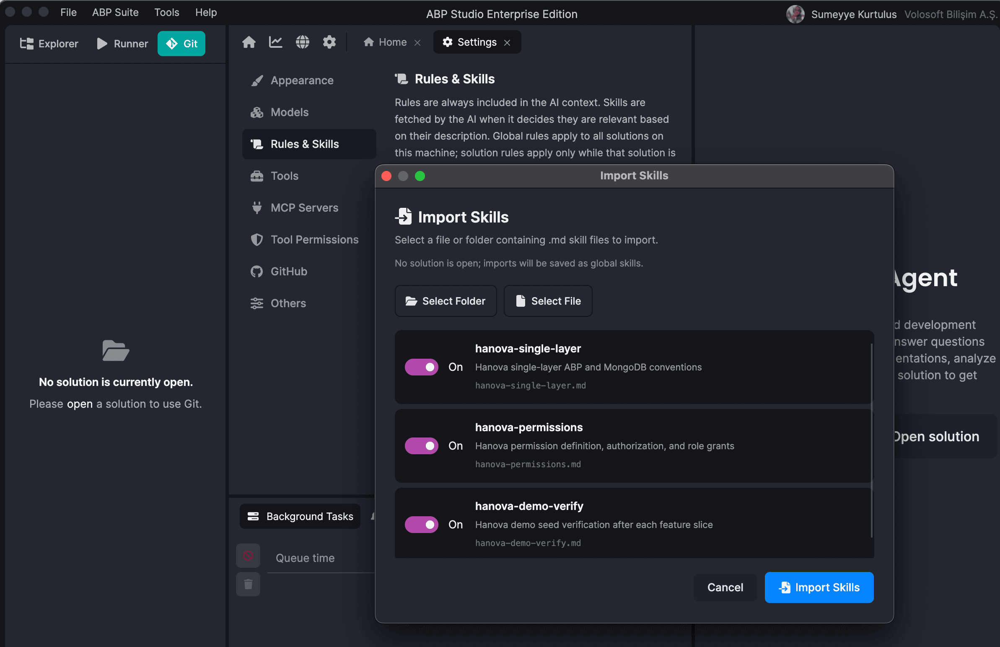
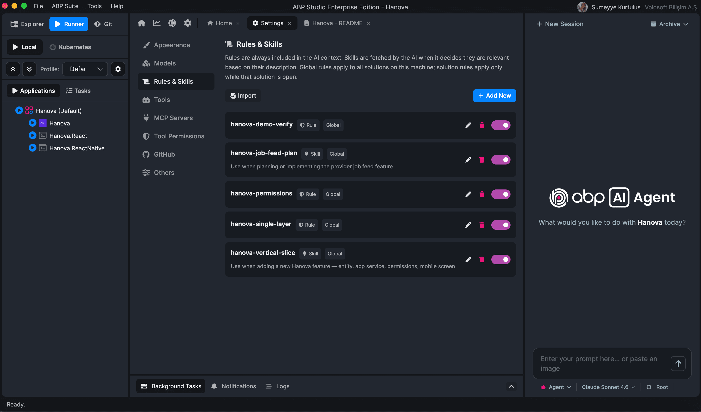
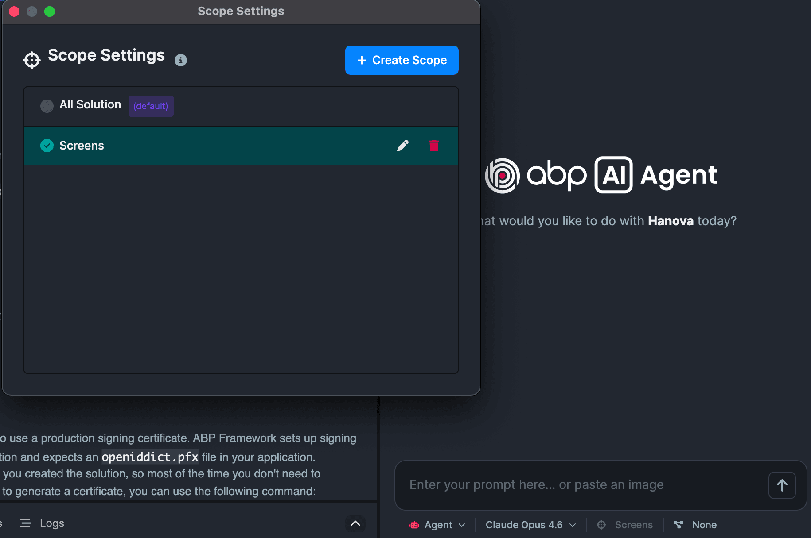

# Template In, Product Out: Building Hanova with the ABP AI Agent

Generic AI coding tools can write code really fast. They often leave chunks that do not fit your framework and become expensive to maintain later. The [ABP AI Coding Agent](https://abp.io/studio/ai-agent) in ABP Studio aims at a different outcome. Hence, it understands ABP solution structure, follows project rules, plans before large changes, and leaves a codebase you can always extend.

This article is a real build story. **Hanova** is a home-services booking sample serving customer and provider roles, using MongoDB, Redis, SignalR, React Native mobile UI, and demo seed data for both personas on first migrate.
---

## 1. Why “fast” is not enough

Hanova is built on the ABP Framework: pick a role, browse open jobs or specialists, send a request, negotiate the price, and message through to confirmation. Log in as `ayse.kaya` or `mehmet.yilmaz` (password `Demo@1234`) after a single database migrate, and every tab already has something on it.

<table>
  <tr>
    <td align="center" width="33%"></td>
    <td align="center" width="33%"></td>
    <td align="center" width="33%"></td>
  </tr>
</table>

That end-to-end loop is what I wanted to ship. What I did *not* want was a repository that only looked finished on day one.

### The speed trap

AI-assisted development is good at the first sunny-day build. Ask for a booking screen, a REST endpoint, a chat list,and you get code quickly. The problem shows up on the *second* request: “Add negotiation,” “Wire SignalR,” “Enforce permissions on confirm,” “Seed demo users so QA can log in.”

Without framework context, each prompt tends to invent its own pattern:

- A new API style instead of an application service + permission
- Direct database access instead of repositories
- A one-off WebSocket layer instead of extending the hub already in the module

The app may still run. However, every new feature fights the last one. Review time goes up. The next developer, or the next agent session spend half the effort re-learning what the previous session improvised. That is **fast but fragile**. In other words you sustain the velocity today, but you will have to do the rework tomorrow.

### What “efficient” and “sustainable” meant here

I used the ABP AI Agent inside Studio, not as generic autocomplete, but as a teammate that already knows where entities, app services, permissions, and Mongo collections live in a single-layer solution.

The goal was **fast and sustainable**:

- New work lands in the same folders and conventions as the template
- Bookings, messaging, and negotiation share one lifecycle and one real-time hub
- Demo data stays idempotent so migrate-and-run stays trustworthy
- The next feature extends the same graph instead of patching around it

What made agent-assisted development stick was not raw generation speed. It was working inside ABP’s structure with plans, project rules, skills, and safety rails. So, the codebase still reads like an ABP application even months later.

**Takeaway:** Treat AI as a delivery accelerator only when it preserves your framework conventions. Otherwise you trade tomorrow’s velocity for today’s demo.

---

## 2. Template vs. product

Hanova was scaffolded from the **ABP single-layer application template**: one .NET project, MongoDB, OpenIddict auth, Admin Console, React SPA scaffold, React Native shell, and English + Turkish localization. That is a lot of plumbing. It is also not the product.

### What the template already carried

| Area | Already in the box |
|------|-------------------|
| Identity & auth | Users, roles, OpenIddict clients, token flow |
| Authorization | Permission groups, role seeding (`Customer`, `Provider`) |
| Host & ops | Run profiles, `--migrate-database`, Docker files |
| Mobile & web shell | Expo auth/tabs/settings; Vite React login and identity |
| Sample CRUD | **Books** — proof that entity → app service → UI works |

The Books sample is just a **reference slice**, not product scope. Hanova’s booking flow follows the same shape. The domain changed, but the skeleton did not. Login, OAuth, theming, and navigation did not need to be re-specified in every prompt.

### What the agent had to grow

**Backend:** service categories, customer and provider profiles, service areas, bookings, negotiation, messaging hub, and supporting domains (payments, settlements, verification) toward full workflows.

**Mobile (primary UI):** role entry, customer tabs (Discovery, Bookings, Messages, Account), provider tabs (Job feed, Bookings, Messages, Earnings, Account), plus booking, negotiation, chat, and profile screens.

**Demo glue:** two personas, pending and confirmed bookings, and a message thread so migrate-and-run populates every tab.

> **Template:** auth, permissions, navigation, theming, sample CRUD pattern.  
> **Product:** who books whom, for what service, at what price, with what conversation attached.

When a prompt said “add provider job feed,” the answer was not a new auth stack. It was a new app service, permissions, and screens **inside** existing patterns.

---

## 3. Why a framework-native agent matters

Once the assistant was ABP-native inside Studio, day-to-day work changed. The agent sees module layout, run profiles, permissions, and Mongo registration **before** it edits. For Hanova, that meant fewer wrong first drafts and fewer “throw this away and wire it properly” passes.

### One workspace instead of five tabs

A typical feature would have to cross backend, mobile, and ops. Simply; add a permission, run migrate after seed changes, reload Expo, read the runtime monitor when SignalR did not connect. In Studio, the same session moves from “implement confirm rules” to “run migrator” to “why did this 403?” without re-explaining the whole stack each time.

### Semantic search over a growing graph

A booking links to a provider profile, a conversation, hub groups, and mobile state. Prompts rarely name every path. Indexed search tended to land on existing job feed, booking, and hub code instead of inventing parallel endpoints. Generic tools often solve the literal sentence, not the graph it sits in.

### What the agent could lean on

| Hanova need | Agent advantage |
|-------------|-----------------|
| Booking + confirm rules | Same vertical pattern as Books; permissions on mutating operations |
| Provider job feed | Query existing bookings by provider specializations—not a second “job” store |
| Messaging & negotiation | Extend the existing messaging hub, not a new socket stack |
| Runnable demo | `--migrate-database` and idempotent seed personas |
| Auth or SignalR failures | Runtime monitor output fed back into the same chat |

Efficiency came from **correct first guesses** in ABP-shaped folders. So, this is beyond typing speed alone.

---

## 4. Keeping the codebase maintainable

Speed only pays off if the repo is still understandable after the tenth session. Sustainability meant every agent turn **adds to the same architecture**, not forks a new one.

### Plan before Agent mode

Multi-surface work needs a shared map first. **Plan mode** produces affected files, steps, and test notes before edits.

| Without a plan | With an approved plan |
|----------------|----------------------|
| Orphan DTOs with no app service | Full vertical slice through API and permissions |
| A second hub for “quick” push | Extend the existing messaging hub |
| Mobile calling an unauthorized endpoint | Permission grants listed as plan steps |

**There is no multi-entity Agent running without a checked plan.**

### Rules, guardrails, and vertical slices

Every new chat starts with zero memory. **Project rules** (ABP conventions + Hanova-specific orientation) encode how we build: repositories in app services, localized business exceptions, Mapperly mappings are not renegotiated each session.

| Control | Role |
|---------|------|
| `.abpignore` | Keeps secrets and certs out of agent context |
| AI Scopes | Backend vs mobile folders when refactoring |
| Permission prompts | Shell and fetch require approval with a reason |
| Git snapshot revert | Roll back a bad turn without diff archaeology |

---

## 5. Lessons learnt — one example (provider job feed)

The job feed is where a provider sees customers’ open booking requests where the clearest place to see the full loop in practice.

### What we did

| Step | What happened |
|------|----------------|
| 1. **Plan** | Reuse existing bookings (no duplicate “job” table), filters, API + mobile screen, permissions, expected demo outcome |
| 2. **Verify the plan** | Read, adjust, **approve**, no code until this passes |
| 3. **Agent** | Implement, migrate, start API; fix permission error using runtime monitor in the same chat |
| 4. **Verify the implementation** | Seeded provider → Jobs tab shows matching open requests—not all, not none |
| 5. **Recover** *(if needed)* | Snapshot revert + narrower **AI Scope**, same plan |

### Studio setup around the slice

These controls mattered as much as the prompt:

- **Rules & workflows** — ABP single-layer conventions and a repeatable slice checklist  
- **Skills** — inject the checklist so each session does not start from zero  

<table>
  <tr>
    <td align="center" width="50%"></td>
    <td align="center" width="50%"></td>
  </tr>
</table>

- **AI Scope** — jobs API + provider screens only; smaller scope on recover  

<table>
  <tr>
    <td align="center"></td>
  </tr>
</table>

- **Models & thinking** — lighter for Plan/review, deeper for cross-layer Agent work  
- **MCP** (optional) — extra context when the answer lives outside the repo  
- **`.abpignore`** — secrets stay out of context  

### What we learnt from this slice

**The plan had to cover the whole slice, not just the API.** Permissions, role grants in seed data, and the mobile list were all part of job feed. Reviewing the plan caught the grant step before Agent mode. Otherwise, the provider hits “access denied” even when the API looks finished.

**Plan the API and the screen together.** Filters exist on the phone and on the server. Backend-only plans often yield a working API and a list that shows nothing, or everything.

**Know what “working” looks like before you test.** Demo data defines success: several open customer requests; provider set up for plumbing and electrical work. Write that into the plan so verification is pass/fail.

**Recover execution, keep the plan.** When a session edits unrelated auth settings, revert and retry with a tighter scope rather than  throwing away the approved plan.

Negotiation, messaging, and other features followed the same loop.

---

## 6. ABP AI Agent vs generic coding assistants

Generic tools (Cursor, Claude Code, Windsurf) are strong for editing code. The ABP agent is built for **ABP delivery inside Studio**. The goal is similar, but the default context is quite different. Hanova is one of the proof case. It is not about “who writes faster,” but **what you re-do less**.

| Dimension | Generic assistant | ABP AI Agent (Hanova) |
|-----------|-------------------|------------------------|
| Solution shape | Inferred from open files | Single-layer layout, modules, run profiles in context |
| Permissions | Often missing or hardcoded | Defined, authorized, and seeded as part of the slice |
| Database & demo data | Easy to pick the wrong approach | `--migrate-database`, seed contributors, idempotent demo users |
| Real-time features | Temptation to add a parallel socket stack | Extend existing hub and module wiring |
| Docs & conventions | Web search or pasted snippets | ABP docs subagent + project rules and workflows |
| Session control | Usually whole repo | AI Scopes, `.abpignore`, approval prompts |
| When a turn goes wrong | Git history | Git + per-turn snapshot revert |
| Run & debug | Separate terminal / browser | Start app, migrate, runtime monitor in the same chat |

Generic tools still excel at quick edits and experiments in any stack. We are not claiming Studio replaces them. Use a generic assistant when the problem is “code.” Use the ABP agent when the problem is **shipping an ABP feature** end to end.

---

## 7. Template in, product out

Hanova started as an ABP template and became a working app: two roles, bookings, messaging, demo data on first migrate. The agent did not replace thinking, but it significantly **shortened the gap** between a feature idea and something you can run, review, and extend without breaking coding conventions.

**Who this workflow fits**

- **Developers** — Plan → verify plan → Agent → verify with demo data; rules early, scopes when a turn goes wide  
- **Team leads** — Shared workflows, `.abpignore`, snapshot policy, scopes  
- **Product owners** — Plans as reviewable artifacts; demo seed as a visible acceptance check  

Hanova still has room to grow (payments, settlements, verification). The agent accelerates **slices you prioritize**, not the whole backlog at once.

**You can try it yourself:** [Download ABP Studio](https://abp.io/studio) · [ABP AI Coding Agent](https://abp.io/studio/ai-agent)

The template carried authentication and navigation. The agent carried what turned Hanova into a product inside ABP, not beside it.
