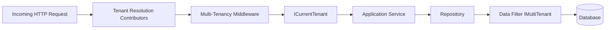
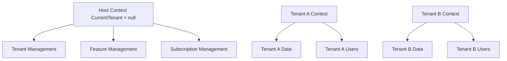
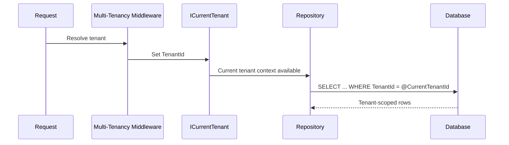
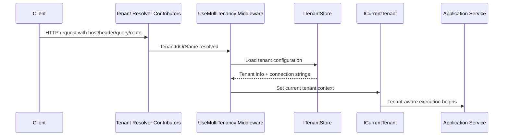
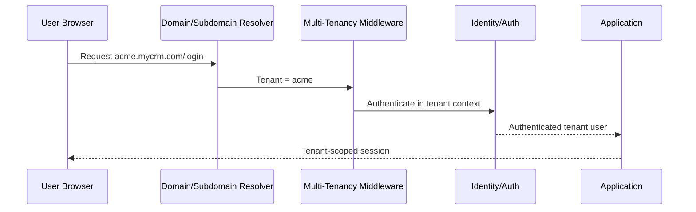

# Implementing Multi-Tenancy in ABP Framework: A Complete Practical Guide

Multi-tenancy is one of those architectural decisions that looks simple in a slide deck and becomes very real the moment your SaaS application gets its second serious customer.

At that point, questions start piling up:

- How do you isolate tenant data safely?
- How do you resolve the current tenant from a request?
- Should all tenants share one database, or should large customers get dedicated databases?
- How do authentication, background jobs, caching, and seeding behave in a tenant-aware system?

ABP Framework gives you a strong foundation for all of this. Instead of building tenant resolution, data filters, tenant-aware repositories, and host/tenant boundaries from scratch, you get a consistent multi-tenancy model integrated into the framework.

This guide explains both the concepts and the implementation details. We will start with the architecture, then move into configuration, entity design, tenant resolution, seeding, authentication, database-per-tenant setups, and advanced production concerns. Along the way, we will build a practical SaaS CRM example to show how the pieces fit together.

## What Multi-Tenancy Means in Practice

Multi-tenancy means a single application serves multiple customers, where each customer is a tenant. Those tenants share the application platform, but their data, configuration, users, and operational boundaries must remain isolated.

In ABP terms:

- A **tenant** is typically a customer organization using your SaaS product.
- The **host** is the application owner or platform operator.
- In host context, `CurrentTenant` is `null`.
- In tenant context, `CurrentTenant.Id` identifies the active tenant.

### Single-tenant vs multi-tenant

A **single-tenant** system usually means:

- one deployment per customer,
- one database per customer,
- isolated infrastructure by default,
- higher operational cost.

A **multi-tenant** system usually means:

- one application serves many customers,
- data isolation is enforced logically or physically,
- lower operational overhead,
- more architectural responsibility.

### Why SaaS teams care about multi-tenancy

Multi-tenancy matters because it directly affects:

- cost efficiency,
- onboarding speed,
- operational scalability,
- security boundaries,
- customization strategy,
- enterprise sales readiness.

### Advantages

- Lower infrastructure cost per customer
- Centralized deployment and upgrades
- Easier feature rollout
- Better operational consistency
- Faster tenant provisioning

### Challenges

- Strong data isolation is mandatory
- Noisy-neighbor performance issues can appear
- Authentication becomes tenant-aware
- Background processing must preserve tenant context
- Reporting across tenants requires deliberate design
- Database-per-tenant operations add migration complexity

### Why ABP simplifies multi-tenant development

ABP helps because multi-tenancy is not treated as an afterthought. It is built into the framework through:

- `ICurrentTenant`
- `IMultiTenant`
- automatic data filters
- tenant resolution middleware
- tenant management abstractions
- tenant-aware repositories and unit of work integration
- support for shared database, database-per-tenant, and hybrid models

That combination removes a lot of repetitive plumbing and reduces the chance of subtle isolation bugs.

## Understanding ABP Multi-Tenancy Architecture

ABP’s multi-tenancy architecture is centered around tenant context propagation. The framework resolves the tenant from the incoming request, stores it in the current execution context, and applies that context to repositories, filters, services, and modules.

### Core concepts

#### Tenant concept

A tenant is a customer boundary. In a CRM SaaS product, each company using the system is a tenant.

Examples:

- `Acme Logistics`
- `Northwind Retail`
- `Contoso Health`

Each tenant may have:

- its own users,
- its own roles,
- its own settings,
- its own features,
- its own data,
- optionally its own database.

#### Host side

The host side is the platform owner context.

Typical host responsibilities:

- create and manage tenants,
- assign subscription plans,
- configure editions and features,
- monitor usage,
- run cross-tenant administration,
- manage billing and provisioning.

In ABP, host-side entities often have `TenantId = null`.

#### Tenant side

The tenant side is the customer-facing application context.

Typical tenant responsibilities:

- manage tenant users,
- manage tenant roles,
- create business data,
- configure tenant settings,
- consume tenant-specific features.

#### `ICurrentTenant`

`ICurrentTenant` is the main runtime service for reading the active tenant context.

It exposes:

- `Id`
- `Name`
- `IsAvailable`

This service is used everywhere from application services to background jobs.

#### Tenant resolution pipeline

ABP resolves the tenant before your application logic runs. It uses configured contributors such as:

- current user claims,
- query string,
- route values,
- headers,
- domain or subdomain,
- custom resolvers.

Then `app.UseMultiTenancy()` sets the current tenant context.

#### `IMultiTenant`

Entities implementing `IMultiTenant` gain a `Guid? TenantId` property. ABP uses this to apply automatic filtering.

If `TenantId` is:

- a tenant id: the entity belongs to that tenant,
- `null`: the entity belongs to the host side.

#### Data filters

ABP automatically filters `IMultiTenant` entities so tenant queries only see their own data by default.

This is one of the most important safety features in the framework.

#### Tenant Management Module

ABP provides tenant management infrastructure through its tenant management module and `ITenantStore` abstraction.

This is used to:

- store tenant definitions,
- resolve tenant configuration,
- retrieve tenant-specific connection strings,
- support tenant provisioning workflows.

### Architecture diagram



### Host and tenant boundaries



### Query isolation flow



## Multi-Tenancy Models Supported by ABP

ABP supports the three models most SaaS teams actually use: shared database, database per tenant, and hybrid.

### 1) Single Database / Shared Database

All tenants share the same physical database. Tenant-specific rows are separated by `TenantId`.

#### How it works

- One database stores host and tenant data.
- Tenant-aware entities implement `IMultiTenant`.
- ABP filters rows automatically.

#### Advantages

- Lowest infrastructure cost
- Simplest migrations
- Easier backup strategy
- Easier reporting across tenants
- Faster onboarding for small SaaS products

#### Disadvantages

- Weaker isolation than dedicated databases
- Noisy-neighbor risk
- Large tenants can affect shared performance
- Cross-tenant leak risk if filters are bypassed incorrectly

### 2) Database Per Tenant

Each tenant gets its own physical database. The host may also have a separate database.

#### How it works

- Tenant metadata is stored centrally or in a host database.
- `ITenantStore` resolves tenant configuration.
- Connection strings are selected dynamically per tenant.

#### Advantages

- Strong isolation
- Easier compliance conversations
- Better performance isolation
- Easier tenant-specific backup and restore
- Large tenants can scale independently

#### Disadvantages

- More operational overhead
- More complex migrations
- Harder cross-tenant analytics
- More secrets and connection strings to manage
- More provisioning automation required

### 3) Hybrid Model

Some tenants share a database, while larger or regulated tenants get dedicated databases.

#### Enterprise SaaS scenarios

This is often the most realistic model when:

- small tenants are cost-sensitive,
- enterprise tenants require stronger isolation,
- some customers need regional or compliance-specific storage,
- you want a migration path from shared to dedicated databases.

#### Advantages

- Flexible cost model
- Better fit for mixed customer sizes
- Easier enterprise upsell path

#### Disadvantages

- Highest architectural complexity
- More operational branching
- More migration and observability work

### Comparison table

| Model | Isolation | Cost | Operational Complexity | Best For |
|---|---|---:|---:|---|
| Shared Database | Logical | Low | Low | Early-stage SaaS, many small tenants |
| Database Per Tenant | Physical | High | High | Enterprise SaaS, regulated workloads |
| Hybrid | Mixed | Medium to High | High | Growing SaaS with mixed tenant profiles |

| Concern | Shared Database | Database Per Tenant | Hybrid |
|---|---|---|---|
| Migrations | Simple | Complex | Complex |
| Cross-tenant reporting | Easy | Harder | Mixed |
| Performance isolation | Limited | Strong | Selective |
| Tenant onboarding | Fast | Slower | Depends on tier |
| Compliance flexibility | Moderate | Strong | Strong |

### When to use / When NOT to use

#### Use shared database when

- you are building an MVP or early SaaS,
- tenants are relatively small,
- cost efficiency matters more than hard isolation,
- your team wants simpler operations.

#### Do not use shared database when

- tenants require strict physical isolation,
- you expect very uneven tenant load,
- compliance or contractual requirements demand dedicated storage.

#### Use database per tenant when

- enterprise customers require isolation,
- you need tenant-specific backup/restore,
- large tenants justify dedicated infrastructure.

#### Do not use database per tenant when

- your team is not ready for migration automation,
- you have many tiny tenants and limited ops capacity,
- cross-tenant analytics is a core requirement and you have no aggregation strategy.

#### Use hybrid when

- you need both efficiency and enterprise flexibility,
- you want to move premium tenants to dedicated databases over time.

#### Do not use hybrid when

- your operational tooling is immature,
- your team is still validating the product and needs simplicity first.

## Enabling Multi-Tenancy in ABP

In most ABP solutions, multi-tenancy is enabled through a shared constant and framework options.

### `MultiTenancyConsts`

A typical template includes a constant like this:

```csharp
namespace Acme.Crm;

public static class MultiTenancyConsts
{
    public const bool IsEnabled = true;
}
```

This constant is often referenced across layers so the application has one central switch.

### Configure `AbpMultiTenancyOptions`

In your module:

```csharp
using Volo.Abp.MultiTenancy;

public override void ConfigureServices(ServiceConfigurationContext context)
{
    Configure<AbpMultiTenancyOptions>(options =>
    {
        options.IsEnabled = MultiTenancyConsts.IsEnabled;
        options.UserSharingStrategy = TenantUserSharingStrategy.Isolated;
    });
}
```

`UserSharingStrategy` matters when you decide whether users are isolated per tenant or shared across tenants.

### Configure middleware

In your HTTP pipeline:

```csharp
public override void OnApplicationInitialization(ApplicationInitializationContext context)
{
    var app = context.GetApplicationBuilder();
    var env = context.GetEnvironment();

    if (env.IsDevelopment())
    {
        app.UseDeveloperExceptionPage();
    }

    app.UseRouting();
    app.UseAuthentication();
    app.UseMultiTenancy();
    app.UseAuthorization();

    app.UseConfiguredEndpoints();
}
```

The exact middleware order can vary by solution template, but `UseMultiTenancy()` must be present so tenant resolution runs.

### Example appsettings.json

For a shared database setup:

```json
{
  "ConnectionStrings": {
    "Default": "Server=localhost;Database=CrmShared;Trusted_Connection=True;TrustServerCertificate=True"
  }
}
```

For a host database plus tenant metadata:

```json
{
  "ConnectionStrings": {
    "Default": "Server=localhost;Database=CrmHost;Trusted_Connection=True;TrustServerCertificate=True"
  }
}
```

### Full module example

```csharp
using Microsoft.AspNetCore.Builder;
using Microsoft.Extensions.DependencyInjection;
using Volo.Abp;
using Volo.Abp.Modularity;
using Volo.Abp.MultiTenancy;

namespace Acme.Crm;

[DependsOn(
    typeof(AbpMultiTenancyModule)
)]
public class CrmHttpApiHostModule : AbpModule
{
    public override void ConfigureServices(ServiceConfigurationContext context)
    {
        Configure<AbpMultiTenancyOptions>(options =>
        {
            options.IsEnabled = MultiTenancyConsts.IsEnabled;
            options.UserSharingStrategy = TenantUserSharingStrategy.Isolated;
        });
    }

    public override void OnApplicationInitialization(ApplicationInitializationContext context)
    {
        var app = context.GetApplicationBuilder();

        app.UseRouting();
        app.UseAuthentication();
        app.UseMultiTenancy();
        app.UseAuthorization();
        app.UseConfiguredEndpoints();
    }
}
```

## Tenant Resolution Strategies

Tenant resolution is where multi-tenancy becomes real. The framework must determine which tenant the request belongs to before your application logic executes.

ABP supports multiple strategies, and you can combine them.

### Default resolution contributors

ABP can resolve tenants from:

- current user claims,
- query string `__tenant`,
- route values,
- custom contributors.

### Configure tenant resolution

```csharp
using Volo.Abp.AspNetCore.MultiTenancy;
using Volo.Abp.MultiTenancy;

public override void ConfigureServices(ServiceConfigurationContext context)
{
    Configure<AbpTenantResolveOptions>(options =>
    {
        options.AddDomainTenantResolver("{0}.mycrm.com");
        options.TenantResolvers.Add(new HeaderTenantResolveContributor());
    });
}
```

### Subdomain resolution

This is common in SaaS products:

- `acme.mycrm.com`
- `northwind.mycrm.com`

Configuration:

```csharp
Configure<AbpTenantResolveOptions>(options =>
{
    options.AddDomainTenantResolver("{0}.mycrm.com");
});
```

ABP extracts `acme` or `northwind` and uses it as the tenant identifier.

### Domain resolution

You can also map full domains to tenants, especially for enterprise customers using custom domains.

Examples:

- `crm.acme-enterprise.com`
- `portal.contosohealth.io`

This usually requires custom tenant lookup logic or a domain mapping table in your tenant store.

### Header-based resolution

Useful for APIs, gateways, or internal service-to-service calls.

Example custom contributor:

```csharp
using System.Threading.Tasks;
using Volo.Abp.MultiTenancy;

public class HeaderTenantResolveContributor : TenantResolveContributorBase
{
    public const string HeaderName = "X-Tenant";

    public override string Name => "Header";

    public override Task ResolveAsync(ITenantResolveContext context)
    {
        var httpContext = context.GetHttpContext();
        if (httpContext == null)
        {
            return Task.CompletedTask;
        }

        var tenant = httpContext.Request.Headers[HeaderName].ToString();
        if (!tenant.IsNullOrWhiteSpace())
        {
            context.TenantIdOrName = tenant;
        }

        return Task.CompletedTask;
    }
}
```

### Query string resolution

Useful for testing and some integration scenarios.

Example:

- `/api/products?__tenant=acme`

This is convenient, but usually not the best primary strategy for production browser apps.

### Route-based resolution

Example:

- `/t/acme/products`

This can work well for APIs or apps where tenant identity is part of the route structure.

### Custom tenant resolver

If your tenant identification depends on something domain-specific, implement your own contributor.

Example: resolve tenant from an API key prefix.

```csharp
using System.Threading.Tasks;
using Volo.Abp.MultiTenancy;

public class ApiKeyTenantResolveContributor : TenantResolveContributorBase
{
    public override string Name => "ApiKey";

    public override Task ResolveAsync(ITenantResolveContext context)
    {
        var httpContext = context.GetHttpContext();
        if (httpContext == null)
        {
            return Task.CompletedTask;
        }

        var apiKey = httpContext.Request.Headers["X-Api-Key"].ToString();
        if (string.IsNullOrWhiteSpace(apiKey))
        {
            return Task.CompletedTask;
        }

        if (apiKey.StartsWith("acme_"))
        {
            context.TenantIdOrName = "acme";
        }

        return Task.CompletedTask;
    }
}
```

### HTTP request flow



### Practical guidance

- Use **subdomain resolution** for browser-based SaaS apps.
- Use **header-based resolution** for APIs behind gateways.
- Keep **query string resolution** mainly for testing or controlled integrations.
- Add **custom resolvers** only when the business rule is stable and well documented.

## Creating Tenant-Aware Entities

The most important rule in ABP multi-tenancy is simple: entities that belong to a tenant should implement `IMultiTenant`.

### Basic entity design

```csharp
using System;
using Volo.Abp.Domain.Entities.Auditing;
using Volo.Abp.MultiTenancy;

namespace Acme.Crm.Products;

public class Product : FullAuditedAggregateRoot<Guid>, IMultiTenant
{
    public Guid? TenantId { get; protected set; }
    public string Name { get; private set; }
    public decimal Price { get; private set; }

    protected Product()
    {
    }

    public Product(Guid id, Guid? tenantId, string name, decimal price)
        : base(id)
    {
        TenantId = tenantId;
        Name = name;
        Price = price;
    }
}
```

### Customer example

```csharp
using System;
using Volo.Abp.Domain.Entities.Auditing;
using Volo.Abp.MultiTenancy;

namespace Acme.Crm.Customers;

public class Customer : FullAuditedAggregateRoot<Guid>, IMultiTenant
{
    public Guid? TenantId { get; protected set; }
    public string CompanyName { get; private set; }
    public string Email { get; private set; }

    protected Customer()
    {
    }

    public Customer(Guid id, Guid? tenantId, string companyName, string email)
        : base(id)
    {
        TenantId = tenantId;
        CompanyName = companyName;
        Email = email;
    }
}
```

### Order example

```csharp
using System;
using Volo.Abp.Domain.Entities.Auditing;
using Volo.Abp.MultiTenancy;

namespace Acme.Crm.Orders;

public class Order : FullAuditedAggregateRoot<Guid>, IMultiTenant
{
    public Guid? TenantId { get; protected set; }
    public Guid CustomerId { get; private set; }
    public DateTime OrderDate { get; private set; }
    public decimal TotalAmount { get; private set; }

    protected Order()
    {
    }

    public Order(Guid id, Guid? tenantId, Guid customerId, DateTime orderDate, decimal totalAmount)
        : base(id)
    {
        TenantId = tenantId;
        CustomerId = customerId;
        OrderDate = orderDate;
        TotalAmount = totalAmount;
    }
}
```

### Aggregate root considerations

A few practical rules help avoid trouble:

- Put `TenantId` on aggregate roots that are tenant-owned.
- Keep child entities inside the same tenant boundary as the aggregate root.
- Avoid aggregates that reference entities from different tenants.
- Be explicit about whether an entity is host-owned or tenant-owned.

### How ABP filters tenant data automatically

Once an entity implements `IMultiTenant`, ABP applies the multi-tenant data filter automatically.

That means this repository call:

```csharp
var products = await _productRepository.GetListAsync();
```

will only return rows for the current tenant when tenant context is active.

### Generated SQL shape

The exact SQL depends on your provider and query, but conceptually it looks like this:

```sql
SELECT Id, TenantId, Name, Price
FROM CrmProducts
WHERE TenantId = @CurrentTenantId
```

In host context, behavior depends on the entity and query shape. Host-owned rows typically have `TenantId IS NULL`.

### Important design note about `TenantId`

`IMultiTenant` defines `Guid? TenantId`, which is nullable because host-owned entities may exist.

If your entity must always belong to a tenant, you can enforce that in domain logic and EF configuration, but be careful. The framework’s default contract is nullable, and forcing non-null semantics requires deliberate mapping and validation.

## Working with CurrentTenant

`ICurrentTenant` is the runtime API you will use most often in multi-tenant services.

### Reading current tenant information

```csharp
using System;
using System.Threading.Tasks;
using Volo.Abp.Application.Services;
using Volo.Abp.MultiTenancy;

namespace Acme.Crm.Products;

public class ProductAppService : ApplicationService
{
    private readonly ICurrentTenant _currentTenant;

    public ProductAppService(ICurrentTenant currentTenant)
    {
        _currentTenant = currentTenant;
    }

    public Task<string> GetTenantInfoAsync()
    {
        var tenantId = _currentTenant.Id?.ToString() ?? "Host";
        var tenantName = _currentTenant.Name ?? "Host";

        return Task.FromResult($"TenantId: {tenantId}, TenantName: {tenantName}");
    }
}
```

### Creating tenant-owned data safely

```csharp
using System;
using System.Threading.Tasks;
using Volo.Abp.Application.Services;
using Volo.Abp.Domain.Repositories;
using Volo.Abp.MultiTenancy;

namespace Acme.Crm.Products;

public class ProductAppService : ApplicationService
{
    private readonly IRepository<Product, Guid> _productRepository;
    private readonly ICurrentTenant _currentTenant;

    public ProductAppService(
        IRepository<Product, Guid> productRepository,
        ICurrentTenant currentTenant)
    {
        _productRepository = productRepository;
        _currentTenant = currentTenant;
    }

    public async Task<Guid> CreateAsync(string name, decimal price)
    {
        if (!_currentTenant.IsAvailable)
        {
            throw new BusinessException("Products can only be created in tenant context.");
        }

        var product = new Product(GuidGenerator.Create(), _currentTenant.Id, name, price);
        await _productRepository.InsertAsync(product, autoSave: true);
        return product.Id;
    }
}
```

### Changing tenant context

ABP allows temporary tenant switching with `CurrentTenant.Change(...)`.

```csharp
using System;
using System.Threading.Tasks;
using Volo.Abp.DependencyInjection;
using Volo.Abp.Domain.Repositories;
using Volo.Abp.MultiTenancy;

namespace Acme.Crm.Reporting;

public class TenantProductCounter : ITransientDependency
{
    private readonly ICurrentTenant _currentTenant;
    private readonly IRepository<Products.Product, Guid> _productRepository;

    public TenantProductCounter(
        ICurrentTenant currentTenant,
        IRepository<Products.Product, Guid> productRepository)
    {
        _currentTenant = currentTenant;
        _productRepository = productRepository;
    }

    public async Task<long> CountForTenantAsync(Guid tenantId)
    {
        using (_currentTenant.Change(tenantId))
        {
            return await _productRepository.GetCountAsync();
        }
    }
}
```

### Nested tenant scopes

```csharp
public async Task CompareTwoTenantsAsync(Guid tenantA, Guid tenantB)
{
    using (_currentTenant.Change(tenantA))
    {
        var countA = await _productRepository.GetCountAsync();

        using (_currentTenant.Change(tenantB))
        {
            var countB = await _productRepository.GetCountAsync();
        }
    }
}
```

Nested scopes are useful, but they should remain easy to reason about. If tenant switching becomes deeply nested, move that logic into dedicated services.

### Practical rules for `ICurrentTenant`

- Read it at the application or domain service boundary.
- Avoid passing raw tenant ids everywhere when the current context already exists.
- Use `Change(...)` sparingly and intentionally.
- Never assume tenant context exists in host-side operations.

## Data Isolation Mechanisms

ABP’s biggest multi-tenancy advantage is that data isolation is integrated into repositories and unit of work.

### Automatic data filtering

When an entity implements `IMultiTenant`, ABP applies the multi-tenant filter automatically.

That means:

- tenant A cannot see tenant B rows through normal repository queries,
- host operations can work in host context,
- the same repository code behaves differently depending on `ICurrentTenant`.

### Tenant-specific repositories

You usually do not need separate repositories per tenant. The same repository becomes tenant-aware because the current tenant context changes the filter behavior.

Example:

```csharp
var customers = await _customerRepository.GetListAsync();
```

In tenant `Acme`, this returns only Acme customers.

### Unit of Work integration

ABP’s unit of work carries tenant context through the execution flow. This matters because:

- repository queries stay tenant-scoped,
- transactional operations remain consistent,
- tenant switching inside a scope affects subsequent repository calls.

### Disabling the filter carefully

Sometimes host-side reporting or maintenance tasks need cross-tenant access.

```csharp
using System.Collections.Generic;
using System.Threading.Tasks;
using Volo.Abp.Data;
using Volo.Abp.DependencyInjection;
using Volo.Abp.Domain.Repositories;

public class CrossTenantProductReader : ITransientDependency
{
    private readonly IDataFilter _dataFilter;
    private readonly IRepository<Products.Product, Guid> _productRepository;

    public CrossTenantProductReader(
        IDataFilter dataFilter,
        IRepository<Products.Product, Guid> productRepository)
    {
        _dataFilter = dataFilter;
        _productRepository = productRepository;
    }

    public async Task<List<Products.Product>> GetAllAsync()
    {
        using (_dataFilter.Disable<IMultiTenant>())
        {
            return await _productRepository.GetListAsync();
        }
    }
}
```

This is powerful and dangerous.

### Security implications

Disabling `IMultiTenant` filtering means you are bypassing one of your main isolation protections.

Use it only when:

- the operation is explicitly host-level,
- authorization is strong,
- the result is not accidentally exposed to tenant users,
- the code path is easy to audit.

### SQL examples

Normal tenant-scoped query:

```sql
SELECT *
FROM CrmCustomers
WHERE TenantId = @CurrentTenantId
ORDER BY CompanyName
```

Cross-tenant query with filter disabled:

```sql
SELECT *
FROM CrmCustomers
ORDER BY TenantId, CompanyName
```

### Isolation checklist

- Tenant-owned entities implement `IMultiTenant`
- Tenant context is resolved before app logic
- Filters remain enabled by default
- Host-only operations are explicitly separated
- Cross-tenant reads are rare and audited

## Seeding Tenant Data

Seeding is where many multi-tenant applications become inconsistent. The host needs one set of seed data, while each tenant may need its own initialization.

ABP’s `IDataSeedContributor` makes this manageable.

### Host and tenant seeding model

- Host seeding runs when `DataSeedContext.TenantId == null`
- Tenant seeding runs when `DataSeedContext.TenantId` has a value
- You can switch tenant context with `CurrentTenant.Change(...)`

### Host seed contributor example

```csharp
using System;
using System.Threading.Tasks;
using Volo.Abp.Data;
using Volo.Abp.DependencyInjection;
using Volo.Abp.MultiTenancy;

namespace Acme.Crm.Data;

public class HostDataSeedContributor : IDataSeedContributor, ITransientDependency
{
    private readonly ICurrentTenant _currentTenant;

    public HostDataSeedContributor(ICurrentTenant currentTenant)
    {
        _currentTenant = currentTenant;
    }

    public async Task SeedAsync(DataSeedContext context)
    {
        if (context.TenantId != null)
        {
            return;
        }

        using (_currentTenant.Change(null))
        {
            await Task.CompletedTask;
            // Seed host-side editions, plans, global settings, etc.
        }
    }
}
```

### Tenant seed contributor example

```csharp
using System;
using System.Threading.Tasks;
using Volo.Abp.Data;
using Volo.Abp.DependencyInjection;
using Volo.Abp.Domain.Repositories;
using Volo.Abp.MultiTenancy;

namespace Acme.Crm.Data;

public class TenantDataSeedContributor : IDataSeedContributor, ITransientDependency
{
    private readonly ICurrentTenant _currentTenant;
    private readonly IRepository<Products.Product, Guid> _productRepository;

    public TenantDataSeedContributor(
        ICurrentTenant currentTenant,
        IRepository<Products.Product, Guid> productRepository)
    {
        _currentTenant = currentTenant;
        _productRepository = productRepository;
    }

    public async Task SeedAsync(DataSeedContext context)
    {
        if (context.TenantId == null)
        {
            return;
        }

        using (_currentTenant.Change(context.TenantId))
        {
            if (await _productRepository.GetCountAsync() > 0)
            {
                return;
            }

            await _productRepository.InsertAsync(
                new Products.Product(Guid.NewGuid(), context.TenantId, "Starter Plan", 49),
                autoSave: true
            );

            await _productRepository.InsertAsync(
                new Products.Product(Guid.NewGuid(), context.TenantId, "Growth Plan", 99),
                autoSave: true
            );
        }
    }
}
```

### Per-tenant initialization during provisioning

A common SaaS flow looks like this:

1. Host admin creates tenant
2. Tenant metadata is stored
3. Tenant database is created or assigned
4. Migrations run
5. Seed contributors initialize tenant data
6. Admin user is created
7. Features/settings are applied

### Practical seeding advice

- Keep seeders idempotent
- Separate host and tenant concerns clearly
- Avoid large business workflows inside seed contributors
- Use provisioning services for complex onboarding

## Multi-Tenant Authentication and Identity

Authentication is where many multi-tenant systems fail in subtle ways. If tenant resolution happens too late, users may authenticate against the wrong tenant context.

ABP’s identity integration helps because users are tenant-aware.

### Tenant-specific users and roles

In ABP:

- users can belong to a tenant,
- roles can be tenant-specific,
- host users can exist separately,
- identity behavior depends on the user sharing strategy.

### Identity module integration

ABP Identity integrates with multi-tenancy so that user and role management respects tenant boundaries.

Typical outcomes:

- tenant admins manage only their tenant users,
- host admins manage platform-level concerns,
- tenant users do not see host-level identity data.

### Login flow

The tenant should be resolved before authentication whenever possible.

Typical browser flow:

1. User visits `acme.mycrm.com`
2. Tenant resolver identifies `acme`
3. Multi-tenancy middleware sets current tenant
4. Authentication runs in tenant context
5. User is validated against tenant-aware identity data
6. Authorized application logic executes

### Login request flow diagram



### Tenant switching

Tenant switching can mean different things:

- switching browser context from one tenant domain to another,
- host admin impersonating or managing a tenant,
- shared-user scenarios where one identity can access multiple tenants.

In most SaaS applications, the cleanest approach is domain-based switching rather than trying to mutate tenant context inside a long-lived UI session.

### Shared user accounts vs isolated users

ABP supports user sharing strategies.

#### Isolated users

- usernames/emails are unique within tenant scope,
- simpler mental model,
- best default for most SaaS apps.

#### Shared users

- one user identity may exist across tenants,
- global uniqueness rules become important,
- database-per-tenant setups become more complex,
- host-side identity metadata may need replication or synchronization.

Unless you have a strong product reason, isolated users are usually the safer choice.

## Database Per Tenant Configuration

Database-per-tenant is where ABP’s abstractions become especially valuable.

### Connection string management

At runtime, the application needs to know which database to use for the current tenant.

That information typically comes from `ITenantStore`.

### `ITenantStore`

`ITenantStore` is the abstraction used to retrieve tenant configuration, including:

- tenant id,
- tenant name,
- activation state,
- connection strings.

ABP provides implementations through tenant management infrastructure. In simpler setups, configuration-based tenant stores can also be used.

### Tenant-specific database setup

For module-specific database usage, you can configure database options like this:

```csharp
using Volo.Abp.Data;
using Volo.Abp.Modularity;

public override void ConfigureServices(ServiceConfigurationContext context)
{
    Configure<AbpDbConnectionOptions>(options =>
    {
        options.Databases.Configure("Saas", database =>
        {
            database.IsUsedByTenants = true;
        });
    });
}
```

### Example tenant configuration shape

In a custom store or configuration source, you may keep tenant metadata like this:

```json
{
  "Tenants": [
    {
      "Id": "11111111-1111-1111-1111-111111111111",
      "Name": "acme",
      "ConnectionStrings": {
        "Default": "Server=sql1;Database=Crm_Acme;User Id=app;Password=secret;TrustServerCertificate=True"
      }
    },
    {
      "Id": "22222222-2222-2222-2222-222222222222",
      "Name": "northwind",
      "ConnectionStrings": {
        "Default": "Server=sql2;Database=Crm_Northwind;User Id=app;Password=secret;TrustServerCertificate=True"
      }
    }
  ]
}
```

### Production-ready custom tenant store example

```csharp
using System;
using System.Collections.Concurrent;
using System.Linq;
using System.Threading.Tasks;
using Microsoft.Extensions.Options;
using Volo.Abp.DependencyInjection;
using Volo.Abp.MultiTenancy;

public class AppTenantStore : ITenantStore, ITransientDependency
{
    private readonly ConcurrentDictionary<string, TenantConfiguration> _tenantsByName;
    private readonly ConcurrentDictionary<Guid, TenantConfiguration> _tenantsById;

    public AppTenantStore(IOptions<AppTenantStoreOptions> options)
    {
        _tenantsByName = new ConcurrentDictionary<string, TenantConfiguration>(StringComparer.OrdinalIgnoreCase);
        _tenantsById = new ConcurrentDictionary<Guid, TenantConfiguration>();

        foreach (var tenant in options.Value.Tenants)
        {
            _tenantsByName[tenant.Name] = tenant;
            if (tenant.Id.HasValue)
            {
                _tenantsById[tenant.Id.Value] = tenant;
            }
        }
    }

    public Task<TenantConfiguration?> FindAsync(string normalizedName)
    {
        _tenantsByName.TryGetValue(normalizedName, out var tenant);
        return Task.FromResult(tenant);
    }

    public Task<TenantConfiguration?> FindAsync(Guid id)
    {
        _tenantsById.TryGetValue(id, out var tenant);
        return Task.FromResult(tenant);
    }
}

public class AppTenantStoreOptions
{
    public TenantConfiguration[] Tenants { get; set; } = Array.Empty<TenantConfiguration>();
}
```

### Provisioning flow for dedicated databases

A production-grade tenant provisioning process usually includes:

- create tenant record,
- generate or assign connection string,
- create database,
- run migrations,
- seed tenant data,
- create tenant admin,
- verify health checks.

### Open source vs PRO note

ABP supports database-per-tenant architecture in general, but UI-based connection string management for tenants is part of the commercial SaaS tooling. In open-source solutions, you typically implement your own management UI or provisioning workflow.

## Advanced Scenarios in Real Applications

Multi-tenancy affects more than repositories. In production systems, the tricky parts are usually background jobs, events, caching, features, settings, and observability.

### Background jobs in tenant context

If a background job processes tenant data, it must restore the correct tenant context.

```csharp
using System;
using System.Threading.Tasks;
using Volo.Abp.BackgroundJobs;
using Volo.Abp.DependencyInjection;
using Volo.Abp.MultiTenancy;

public class RebuildCustomerStatsArgs
{
    public Guid TenantId { get; set; }
}

public class RebuildCustomerStatsJob : AsyncBackgroundJob<RebuildCustomerStatsArgs>, ITransientDependency
{
    private readonly ICurrentTenant _currentTenant;

    public RebuildCustomerStatsJob(ICurrentTenant currentTenant)
    {
        _currentTenant = currentTenant;
    }

    public override async Task ExecuteAsync(RebuildCustomerStatsArgs args)
    {
        using (_currentTenant.Change(args.TenantId))
        {
            await Task.CompletedTask;
            // Recalculate tenant-specific metrics here.
        }
    }
}
```

### Distributed events

When publishing distributed events, include tenant context explicitly if consumers need it.

Good practice:

- include `TenantId` in event payloads,
- restore tenant context in handlers,
- avoid assuming ambient tenant context exists in asynchronous boundaries.

### Caching per tenant

Cache keys should include tenant identity.

Bad:

- `customer-list`

Better:

- `tenant:{tenantId}:customer-list`

Without tenant-aware cache keys, cross-tenant data leaks become very possible.

### Feature management

Features are a natural fit for SaaS plans.

Examples:

- maximum users,
- advanced reporting,
- API access,
- custom branding.

ABP feature management supports tenant-level configuration and edition-based grouping.

### Setting management

Settings can be scoped globally, per tenant, or per user.

Examples:

- default currency,
- email sender,
- invoice numbering format,
- CRM pipeline defaults.

### Audit logging

Audit logs should capture tenant context so you can answer questions like:

- which tenant triggered this action,
- which admin changed a tenant setting,
- which background job modified tenant data.

### Localization

Tenants often need different localization defaults:

- language,
- timezone,
- regional formatting,
- legal text.

Tenant-level settings are usually the right place for these preferences.

### Common pitfalls

- forgetting tenant context in background jobs,
- using cache keys without tenant id,
- disabling data filters too broadly,
- mixing host and tenant responsibilities in one service,
- assuming tenant resolution works the same in browser and API flows,
- not testing wildcard domain auth configuration carefully.

## Building a Sample SaaS CRM Application

Let’s connect the concepts with a practical example.

Imagine a SaaS CRM built with ABP.

### Functional areas

#### Host administration

The host side manages:

- tenant creation,
- subscription plans,
- feature packages,
- billing integration,
- tenant health and usage.

#### Tenant administration

Each tenant manages:

- users,
- roles,
- settings,
- branding,
- sales workflows.

#### Customer management

Tenant users create and manage:

- customers,
- contacts,
- opportunities,
- orders,
- notes.

#### Subscription management

The host assigns plans such as:

- Starter
- Growth
- Enterprise

These plans map naturally to ABP features and settings.

### Suggested architecture

- **Host app** for platform administration
- **Tenant-facing app** resolved by subdomain
- **Shared modules** for identity, audit logging, feature management, setting management
- **Tenant-aware domain entities** for CRM data
- **Hybrid database strategy** if enterprise tenants need dedicated databases

### Example domain boundaries

Host-owned entities:

- Tenant
n- SubscriptionPlan
- Edition
- BillingAccount

Tenant-owned entities:

- Customer
- Product
- Order
- SalesPipeline
- ActivityLog

### Tenant-aware application service example

```csharp
using System;
using System.Threading.Tasks;
using Volo.Abp.Application.Services;
using Volo.Abp.Domain.Repositories;
using Volo.Abp.MultiTenancy;

namespace Acme.Crm.Customers;

public class CustomerAppService : ApplicationService
{
    private readonly IRepository<Customer, Guid> _customerRepository;
    private readonly ICurrentTenant _currentTenant;

    public CustomerAppService(
        IRepository<Customer, Guid> customerRepository,
        ICurrentTenant currentTenant)
    {
        _customerRepository = customerRepository;
        _currentTenant = currentTenant;
    }

    public async Task<Guid> CreateAsync(string companyName, string email)
    {
        if (!_currentTenant.IsAvailable)
        {
            throw new BusinessException("Customer creation requires tenant context.");
        }

        var customer = new Customer(
            GuidGenerator.Create(),
            _currentTenant.Id,
            companyName,
            email
        );

        await _customerRepository.InsertAsync(customer, autoSave: true);
        return customer.Id;
    }
}
```

### End-to-end request example

A request to `https://acme.mycrm.com/api/customers` flows like this:

1. Domain resolver extracts `acme`
2. `ITenantStore` loads tenant metadata
3. `ICurrentTenant` is set
4. Authentication runs in tenant context
5. Repository queries apply `IMultiTenant` filter
6. Only Acme customer data is returned

That is the core ABP multi-tenancy story in one request.

## Best Practices for ABP Multi-Tenant Applications

Here are practical best practices that hold up well in real systems.

1. **Implement `IMultiTenant` on every tenant-owned aggregate root.** Do not rely on conventions or memory.
2. **Use subdomain-based tenant resolution for browser SaaS apps.** It is usually the cleanest UX and operational model.
3. **Keep host and tenant application services separate.** Mixing them creates authorization and maintenance problems.
4. **Treat `IDataFilter.Disable<IMultiTenant>()` as a privileged operation.** Review those code paths carefully.
5. **Index `TenantId` on large tables.** Shared-database performance depends on it.
6. **Include `TenantId` in cache keys, distributed events, and background job payloads.** Ambient context does not cross every boundary.
7. **Resolve tenant before authentication.** Especially for domain/subdomain-based login flows.
8. **Prefer isolated users unless shared identities are a real product requirement.** Shared users add complexity fast.
9. **Automate tenant provisioning.** Manual database creation and migration does not scale.
10. **Make seed contributors idempotent.** Tenant provisioning may be retried.
11. **Design for hybrid early if you expect enterprise customers.** Moving from shared-only to hybrid later is possible, but easier if planned.
12. **Store tenant connection strings securely.** Use secret management and rotation policies.
13. **Log tenant context in audit and operational logs.** Troubleshooting without tenant identity is painful.
14. **Test host context explicitly.** `CurrentTenant` being `null` is a valid and important scenario.
15. **Avoid cross-tenant joins in domain logic.** If you need cross-tenant analytics, build reporting pipelines intentionally.
16. **Keep tenant switching localized.** Use `CurrentTenant.Change(...)` in small, obvious scopes.
17. **Validate tenant ownership in domain rules where it matters.** Filters help, but domain invariants still matter.
18. **Monitor noisy-neighbor patterns.** Shared databases need tenant-level performance visibility.
19. **Run tenant-aware integration tests.** Unit tests alone will not catch resolution and filter issues.
20. **Document your tenant resolution strategy clearly.** Operations, frontend, and identity flows all depend on it.

## Common Mistakes to Avoid

Even experienced teams make the same multi-tenancy mistakes.

### 1) Assuming repository filtering solves everything

Repository filtering is excellent, but it does not replace:

- authorization,
- cache isolation,
- event payload design,
- background job context restoration.

### 2) Treating host context as an edge case

In ABP, host context is a first-class concept. Design for it explicitly.

### 3) Choosing database-per-tenant too early or too late

Too early:

- unnecessary operational burden.

Too late:

- painful migration for large tenants.

### 4) Forgetting tenant-aware testing

You should test:

- host requests,
- tenant requests,
- invalid tenant requests,
- cross-tenant access attempts,
- background jobs with tenant context,
- cache behavior across tenants.

## Final Thoughts

ABP’s multi-tenancy support is one of the framework’s strongest features because it combines architectural clarity with practical runtime behavior.

You get:

- a clear host/tenant model,
- tenant resolution middleware,
- `ICurrentTenant` for runtime context,
- `IMultiTenant` for entity ownership,
- automatic data filtering,
- tenant-aware identity and module integration,
- support for shared, dedicated, and hybrid database strategies.

That does not remove the need for good architecture. You still need to make deliberate choices about isolation, authentication, provisioning, caching, and operations. But ABP gives you a solid default path and a consistent set of abstractions, which is exactly what you want in a serious SaaS platform.

If you are building an enterprise-grade SaaS application on .NET, ABP lets you spend more time on product logic and less time reinventing multi-tenancy infrastructure.

## TL;DR

- ABP multi-tenancy is built around `ICurrentTenant`, `IMultiTenant`, tenant resolution middleware, and automatic data filters.
- ABP supports shared database, database-per-tenant, and hybrid models, so you can match architecture to customer and compliance needs.
- Tenant resolution should happen before authentication, and subdomain resolution is usually the best default for SaaS apps.
- Tenant-aware design must extend beyond repositories to seeding, background jobs, caching, events, settings, and audit logging.
- The safest production approach is clear host/tenant separation, minimal filter bypassing, strong provisioning automation, and tenant-aware testing.