# Implementing Multi-Tenancy in ABP Framework: A Complete Practical Guide

Multi-tenancy is one of those architectural decisions that looks simple in a slide deck and becomes very real the moment you build a SaaS product. The hard part is not adding a `TenantId` column. The hard part is making tenant resolution, data isolation, authentication, seeding, background processing, caching, and database management work together without leaking data or creating operational pain.

ABP Framework gives you a strong foundation for this. It has built-in multi-tenancy support, tenant-aware entities, automatic data filters, tenant resolution contributors, tenant management, and connection string infrastructure that supports shared database, database-per-tenant, and hybrid models.

This guide explains both the concepts and the implementation details. It is written for intermediate to advanced .NET developers building real SaaS applications with ABP.

## What Multi-Tenancy Means in SaaS

A multi-tenant application serves multiple customers from the same application codebase and runtime while keeping each customer's data, users, configuration, and behavior isolated.

In ABP terminology:

- **Host side**: the application owner or platform operator
- **Tenant side**: each customer using the application
- **Current tenant**: the tenant context of the current request or operation

### Single-tenant vs multi-tenant

A **single-tenant** system usually means:

- one deployment per customer
- isolated infrastructure by default
- simpler compliance story
- higher operational cost

A **multi-tenant** system usually means:

- one application serving many customers
- shared operational model
- lower cost per customer
- more architectural responsibility around isolation

### Why multi-tenancy matters

For SaaS products, multi-tenancy is often the difference between a manageable platform and an expensive collection of customer-specific deployments.

Benefits:

- lower infrastructure cost
- centralized updates and fixes
- faster onboarding of new customers
- easier feature rollout
- consistent operational model

Challenges:

- strict data isolation
- tenant-aware authentication and authorization
- scaling noisy tenants
- tenant-specific configuration
- migrations across shared or separate databases
- reporting across tenants

### Why ABP simplifies this

ABP removes a lot of repetitive plumbing:

- `ICurrentTenant` exposes tenant context everywhere
- `IMultiTenant` enables automatic tenant filtering
- tenant resolution is built into the ASP.NET Core pipeline
- tenant management is available out of the box
- per-tenant connection strings support database-per-tenant and hybrid models
- identity, permissions, settings, features, and audit logging are tenant-aware

That does not eliminate architectural decisions, but it gives you a consistent framework for implementing them correctly.

## Understanding ABP Multi-Tenancy Architecture

ABP's multi-tenancy model is practical: tenant context is resolved early, stored in the current execution scope, and then used by repositories, DbContexts, identity, settings, and other infrastructure.

### Core concepts

#### Tenant concept

A tenant represents a customer organization in your SaaS system. A tenant typically has:

- an `Id`
- a `Name`
- optional connection strings
- optional settings and features
- tenant-specific users and roles

#### Host side

The host side is where platform-wide operations happen:

- creating and managing tenants
- assigning plans or subscriptions
- viewing cross-tenant analytics
- configuring defaults
- running migrations and maintenance

Host-side operations usually run with `CurrentTenant.Id == null`.

#### Tenant side

The tenant side is where customer-specific operations happen:

- managing users inside a tenant
- creating business data such as products, customers, and orders
- configuring tenant-level settings
- consuming tenant-specific features

#### `ICurrentTenant`

`ICurrentTenant` is the central service for reading the active tenant context.

It exposes:

- `Id`
- `Name`
- `IsAvailable`

You will use it in application services, domain services, background jobs, seed contributors, and event handlers.

#### Tenant resolution pipeline

ABP resolves the tenant from the incoming request using contributors. Common sources include:

- current user claims
- query string
- route values
- headers
- cookies
- domain or subdomain
- custom resolvers

#### `IMultiTenant`

Entities implementing `IMultiTenant` become tenant-aware. ABP applies automatic data filtering so tenant users only see rows belonging to their tenant.

#### Data filters

ABP uses data filters, typically backed by EF Core global query filters, to enforce tenant isolation for `IMultiTenant` entities.

#### Tenant Management module

ABP's Tenant Management module provides the infrastructure to create and manage tenants. In startup templates, this is often already integrated. In open-source ABP, core tenant management exists, while some advanced SaaS UI capabilities are part of ABP Commercial.

### Request-to-data flow

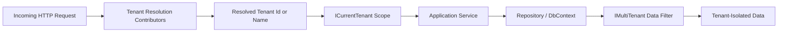

### Host and tenant architecture view

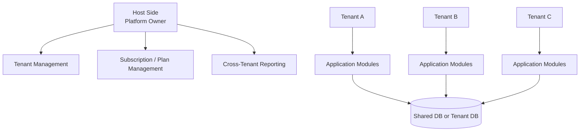

### How ABP applies tenant context

Once the tenant is resolved:

- repositories automatically filter `IMultiTenant` entities
- identity operations become tenant-specific
- settings and features can be resolved per tenant
- connection strings can switch dynamically for tenant databases
- audit logs can include tenant information

This is why ABP multi-tenancy feels cohesive instead of bolted on.


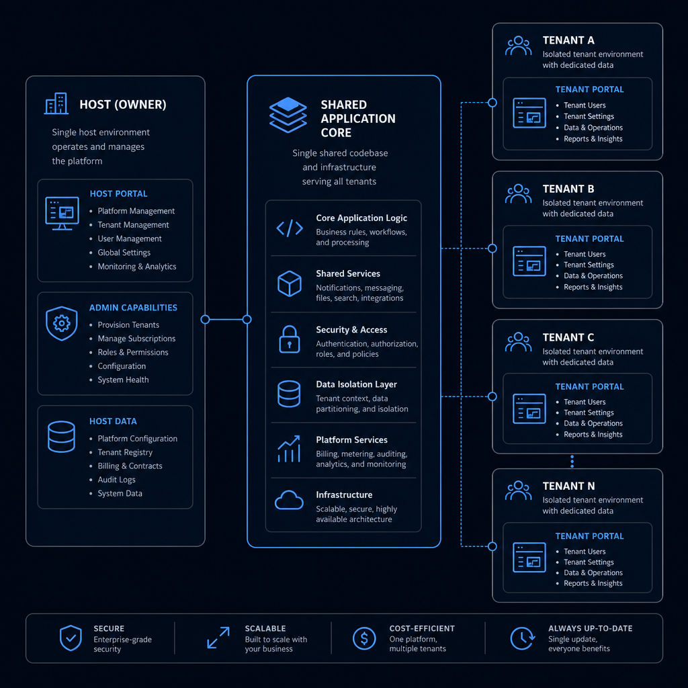

## Multi-Tenancy Models Supported by ABP

ABP supports three practical models.

### 1) Single Database

All tenants share one database. Tenant-specific rows are separated by `TenantId`.

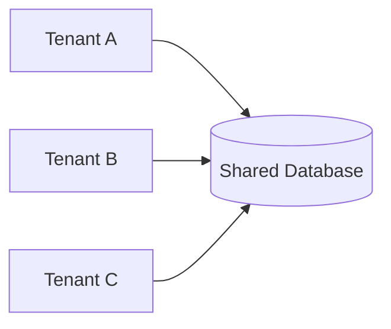

#### Advantages

- lowest infrastructure cost
- simplest deployment model
- easiest migrations
- fast tenant provisioning
- easier aggregate reporting across tenants

#### Disadvantages

- weaker isolation than separate databases
- higher risk if filtering is misconfigured
- noisy tenants can affect others
- compliance requirements may be harder to satisfy

### 2) Database Per Tenant

Each tenant gets its own database. ABP switches connection strings based on tenant configuration.

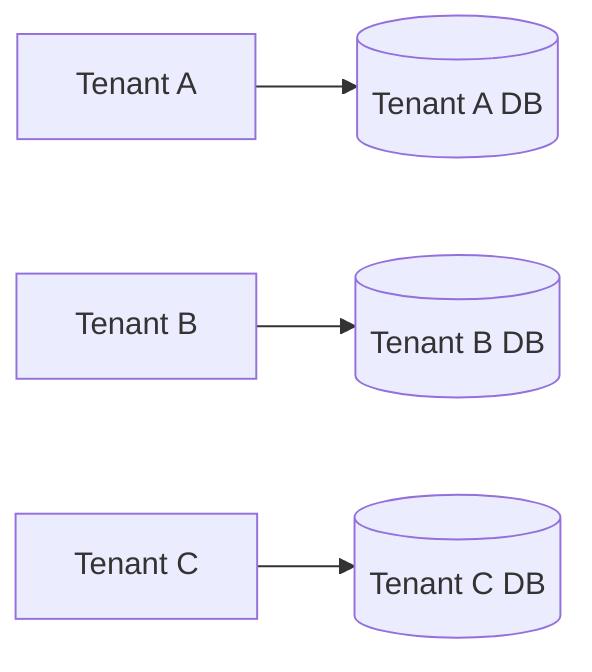

#### Advantages

- strongest data isolation
- easier tenant-specific backup and restore
- better compliance story
- easier per-tenant scaling and maintenance

#### Disadvantages

- more operational overhead
- migrations must run for every tenant database
- monitoring and backup complexity increases
- provisioning is slower than shared DB

### 3) Hybrid Model

Some tenants use the shared database, while premium or regulated tenants get dedicated databases.

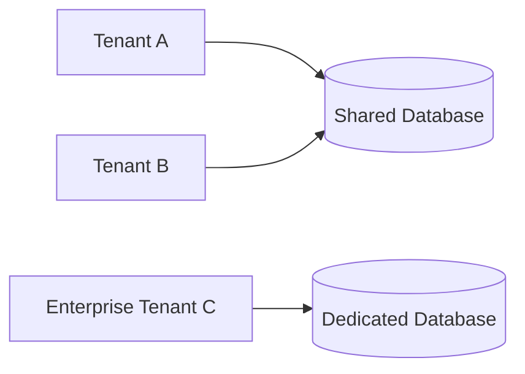

#### Advantages

- flexible cost/isolation tradeoff
- supports enterprise customers with stricter requirements
- lets you upgrade tenants without redesigning the app

#### Disadvantages

- most complex operational model
- more testing scenarios
- migration and support workflows become more involved

### Comparison table

| Model | Isolation | Cost | Operational Complexity | Reporting Across Tenants | Best Fit |
|---|---|---:|---:|---|---|
| Single Database | Medium | Low | Low | Easy | Early-stage SaaS, many small tenants |
| Database Per Tenant | High | High | High | Harder | Regulated or enterprise SaaS |
| Hybrid | Medium to High | Medium | High | Mixed | SaaS with tiered customer needs |

### When to use / When NOT to use

#### Use single database when

- you need fast onboarding
- tenants are relatively small
- compliance requirements are moderate
- cross-tenant reporting matters

#### Avoid single database when

- customers require strict physical isolation
- one tenant can generate extreme load
- backup/restore must be tenant-specific

#### Use database per tenant when

- enterprise customers demand isolation
- you need tenant-specific maintenance windows
- compliance or residency rules are strict

#### Avoid database per tenant when

- you have thousands of tiny tenants
- your team is not ready for operational complexity
- your deployment and migration automation is immature

#### Use hybrid when

- you serve both SMB and enterprise customers
- you want a premium isolation tier
- you need a migration path from shared to dedicated databases

#### Avoid hybrid when

- your team wants the simplest possible operations
- you cannot invest in strong automation and observability


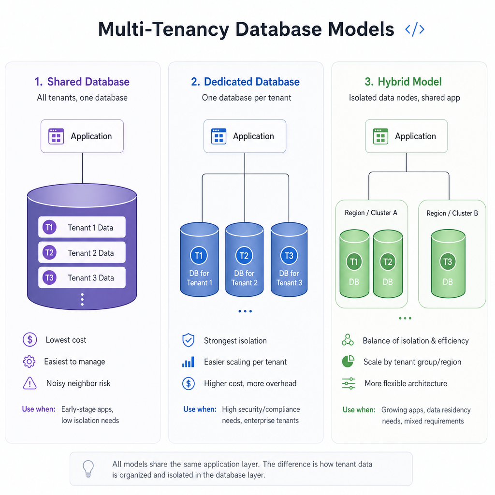

## Enabling Multi-Tenancy in ABP

In ABP solutions, multi-tenancy is commonly controlled by a shared constant and configured through `AbpMultiTenancyOptions`.

### `MultiTenancyConsts`

Create or update `MultiTenancyConsts` in your `.Domain.Shared` project:

```csharp
namespace Acme.Crm;

public static class MultiTenancyConsts
{
    public const bool IsEnabled = true;
}
```

This keeps the setting centralized and easy to reference across modules.

### Configure `AbpMultiTenancyOptions`

In your web or HTTP API host module:

```csharp
using Volo.Abp.MultiTenancy;

public override void ConfigureServices(ServiceConfigurationContext context)
{
    Configure<AbpMultiTenancyOptions>(options =>
    {
        options.IsEnabled = MultiTenancyConsts.IsEnabled;
    });
}
```

### Typical module configuration example

```csharp
using Acme.Crm.MultiTenancy;
using Microsoft.AspNetCore.Builder;
using Microsoft.Extensions.DependencyInjection;
using Volo.Abp;
using Volo.Abp.AspNetCore.MultiTenancy;
using Volo.Abp.Modularity;
using Volo.Abp.MultiTenancy;

namespace Acme.Crm;

[DependsOn(
    typeof(AbpAspNetCoreMultiTenancyModule)
)]
public class CrmHttpApiHostModule : AbpModule
{
    public override void ConfigureServices(ServiceConfigurationContext context)
    {
        Configure<AbpMultiTenancyOptions>(options =>
        {
            options.IsEnabled = MultiTenancyConsts.IsEnabled;
        });

        Configure<AbpAspNetCoreMultiTenancyOptions>(options =>
        {
            options.TenantKey = "__tenant";
        });
    }

    public override void OnApplicationInitialization(ApplicationInitializationContext context)
    {
        var app = context.GetApplicationBuilder();

        app.UseRouting();

        if (MultiTenancyConsts.IsEnabled)
        {
            app.UseMultiTenancy();
        }

        app.UseAuthentication();
        app.UseAuthorization();

        app.UseConfiguredEndpoints();
    }
}
```

### Relevant configuration files

`appsettings.json` usually contains the default connection string and may contain tenant-related settings depending on your setup:

```json
{
  "ConnectionStrings": {
    "Default": "Server=localhost;Database=CrmShared;Trusted_Connection=True;TrustServerCertificate=True"
  },
  "App": {
    "SelfUrl": "https://localhost:44388"
  }
}
```

If you use `DefaultTenantStore` for simple scenarios, tenant definitions can also be stored in configuration. In production, most real systems use the Tenant Management module and a database-backed tenant store.

## Tenant Resolution Strategies

Tenant resolution is where multi-tenancy becomes real. If the wrong tenant is resolved, everything after that is wrong too.

ABP supports multiple strategies and lets you combine them.

### Default resolution contributors

Common contributors include:

- current user claims
- query string: `?__tenant=acme`
- route value: `/api/acme/products`
- header: `__tenant: acme`
- cookie: `__tenant=acme`

### Resolution flow through an HTTP request

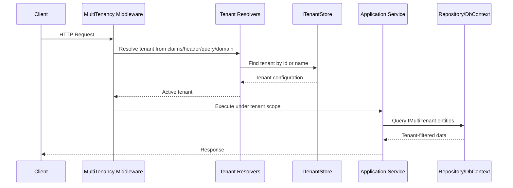

### Subdomain and domain resolution

Subdomain resolution is usually the cleanest production approach for SaaS.

Example: `acme.mycrm.com` resolves tenant `acme`.

```csharp
using Volo.Abp.MultiTenancy;

public override void ConfigureServices(ServiceConfigurationContext context)
{
    Configure<AbpTenantResolveOptions>(options =>
    {
        options.AddDomainTenantResolver("{0}.mycrm.com");
    });
}
```

You can also use full domain mapping patterns depending on your routing strategy.

### Header-based resolution

Useful for APIs, internal gateways, or integration testing.

```csharp
Configure<AbpAspNetCoreMultiTenancyOptions>(options =>
{
    options.TenantKey = "__tenant";
});
```

Request example:

```http
GET /api/app/products HTTP/1.1
Host: api.mycrm.com
__tenant: acme
Authorization: Bearer eyJ...
```

### Query string resolution

Useful for demos and debugging, but not ideal as the primary production strategy.

Example:

```http
GET /api/app/products?__tenant=acme
```

### Route-based resolution

If your API design includes tenant in the route, ABP can resolve from route values.

Example route:

```http
GET /api/acme/products
```

### Custom tenant resolver

Sometimes tenant identification comes from a reverse proxy header, a custom JWT claim, or a partner integration contract.

Create a custom contributor:

```csharp
using System.Threading.Tasks;
using Microsoft.AspNetCore.Http;
using Volo.Abp.MultiTenancy;

namespace Acme.Crm.MultiTenancy;

public class XTenantResolveContributor : TenantResolveContributorBase
{
    public const string ContributorName = "X-Tenant-Resolver";

    public override string Name => ContributorName;

    public override Task ResolveAsync(ITenantResolveContext context)
    {
        var httpContext = context.ServiceProvider
            .GetRequiredService<IHttpContextAccessor>()
            .HttpContext;

        if (httpContext == null)
        {
            return Task.CompletedTask;
        }

        var tenant = httpContext.Request.Headers["X-Tenant"].ToString();

        if (!tenant.IsNullOrWhiteSpace())
        {
            context.TenantIdOrName = tenant;
        }

        return Task.CompletedTask;
    }
}
```

Register it:

```csharp
Configure<AbpTenantResolveOptions>(options =>
{
    options.TenantResolvers.Insert(0, new XTenantResolveContributor());
});
```

### Practical guidance on resolver choice

Prefer this order in production:

1. subdomain/domain
2. authenticated user claim
3. trusted gateway header
4. route value
5. query string only for development or support scenarios

Do not rely on query string alone for sensitive production flows.


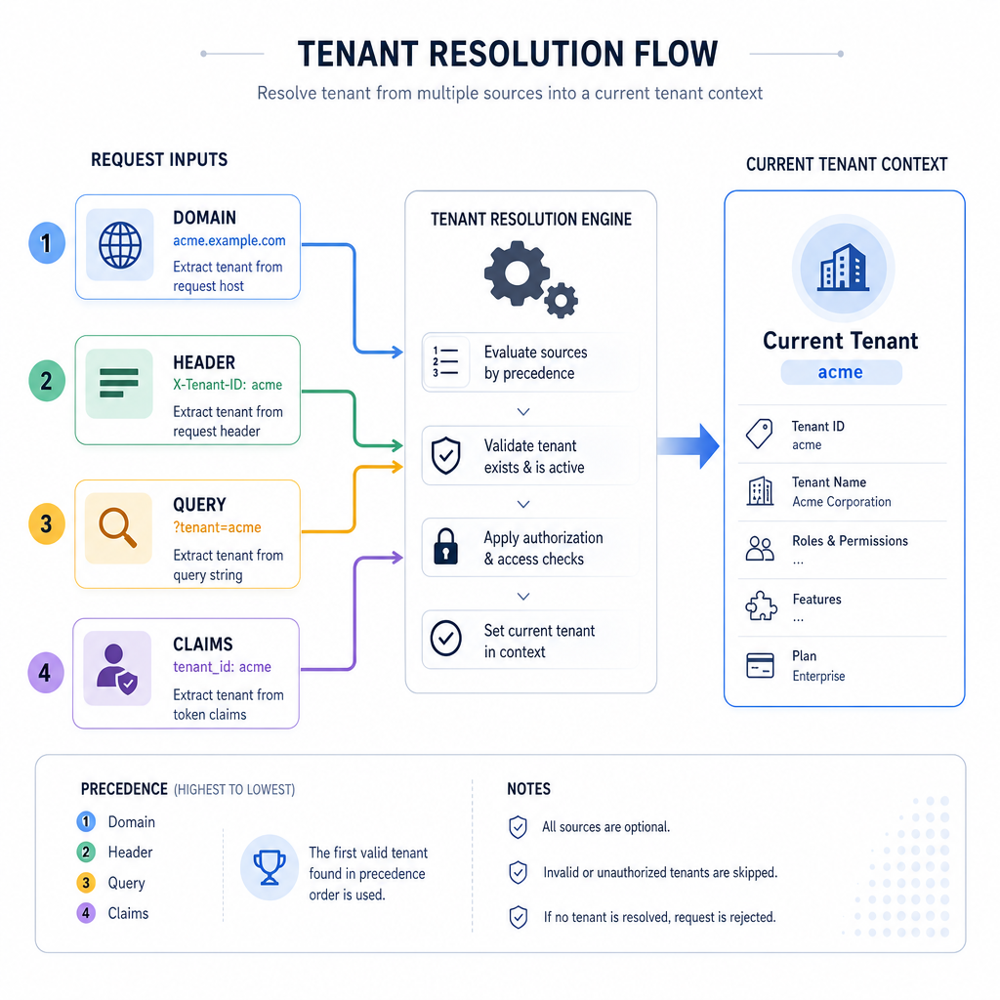

## Creating Tenant-Aware Entities

The most important rule is simple: if an entity belongs to a tenant, implement `IMultiTenant`.

### Product entity example

```csharp
using System;
using Volo.Abp.Domain.Entities.Auditing;
using Volo.Abp.MultiTenancy;

namespace Acme.Crm.Products;

public class Product : FullAuditedAggregateRoot<Guid>, IMultiTenant
{
    public Guid? TenantId { get; private set; }
    public string Name { get; private set; }
    public decimal Price { get; private set; }

    protected Product()
    {
    }

    public Product(Guid id, Guid? tenantId, string name, decimal price)
        : base(id)
    {
        TenantId = tenantId;
        Name = name;
        Price = price;
    }

    public void ChangePrice(decimal price)
    {
        Price = price;
    }
}
```

### Customer entity example

```csharp
using System;
using Volo.Abp.Domain.Entities.Auditing;
using Volo.Abp.MultiTenancy;

namespace Acme.Crm.Customers;

public class Customer : FullAuditedAggregateRoot<Guid>, IMultiTenant
{
    public Guid? TenantId { get; private set; }
    public string CompanyName { get; private set; }
    public string Email { get; private set; }

    protected Customer()
    {
    }

    public Customer(Guid id, Guid? tenantId, string companyName, string email)
        : base(id)
    {
        TenantId = tenantId;
        CompanyName = companyName;
        Email = email;
    }
}
```

### Order aggregate example

```csharp
using System;
using System.Collections.Generic;
using Volo.Abp.Domain.Entities.Auditing;
using Volo.Abp.MultiTenancy;

namespace Acme.Crm.Orders;

public class Order : FullAuditedAggregateRoot<Guid>, IMultiTenant
{
    public Guid? TenantId { get; private set; }
    public Guid CustomerId { get; private set; }
    public DateTime OrderDate { get; private set; }
    public List<OrderLine> Lines { get; private set; }

    protected Order()
    {
        Lines = new List<OrderLine>();
    }

    public Order(Guid id, Guid? tenantId, Guid customerId, DateTime orderDate)
        : base(id)
    {
        TenantId = tenantId;
        CustomerId = customerId;
        OrderDate = orderDate;
        Lines = new List<OrderLine>();
    }
}

public class OrderLine
{
    public Guid ProductId { get; private set; }
    public int Quantity { get; private set; }
    public decimal UnitPrice { get; private set; }

    protected OrderLine()
    {
    }

    public OrderLine(Guid productId, int quantity, decimal unitPrice)
    {
        ProductId = productId;
        Quantity = quantity;
        UnitPrice = unitPrice;
    }
}
```

### Design considerations

A few rules matter a lot:

- keep `TenantId` immutable after creation whenever possible
- avoid moving entities between tenants
- ensure child entities belong to the same tenant as the aggregate root
- do not mix host-owned and tenant-owned data in the same aggregate casually
- index `TenantId` in large tables

### How ABP filters tenant data automatically

When an entity implements `IMultiTenant`, ABP applies a tenant filter automatically. If tenant `A` is active, queries only return rows where `TenantId == A`.

That means this repository call:

```csharp
var products = await _productRepository.GetListAsync();
```

returns only the current tenant's products in a shared database model.

### Host-owned entities

Not every entity should implement `IMultiTenant`.

Examples of host-owned entities:

- subscription plans
- global feature definitions
- platform announcements
- tenant catalog records

Those entities are intentionally shared or host-scoped.

## Working with `ICurrentTenant`

`ICurrentTenant` is the API you will use most often in multi-tenant business logic.

### Reading current tenant information

```csharp
using System;
using System.Threading.Tasks;
using Volo.Abp.Application.Services;
using Volo.Abp.MultiTenancy;

namespace Acme.Crm.Products;

public class ProductAppService : ApplicationService
{
    private readonly ICurrentTenant _currentTenant;

    public ProductAppService(ICurrentTenant currentTenant)
    {
        _currentTenant = currentTenant;
    }

    public Task<string> GetTenantInfoAsync()
    {
        var tenantId = _currentTenant.Id?.ToString() ?? "Host";
        var tenantName = _currentTenant.Name ?? "Host";

        return Task.FromResult($"TenantId: {tenantId}, TenantName: {tenantName}");
    }
}
```

### Creating tenant-aware data

```csharp
using System;
using System.Threading.Tasks;
using Volo.Abp.Application.Services;
using Volo.Abp.Domain.Repositories;
using Volo.Abp.Guids;
using Volo.Abp.MultiTenancy;

namespace Acme.Crm.Products;

public class ProductAppService : ApplicationService
{
    private readonly IRepository<Product, Guid> _productRepository;
    private readonly IGuidGenerator _guidGenerator;
    private readonly ICurrentTenant _currentTenant;

    public ProductAppService(
        IRepository<Product, Guid> productRepository,
        IGuidGenerator guidGenerator,
        ICurrentTenant currentTenant)
    {
        _productRepository = productRepository;
        _guidGenerator = guidGenerator;
        _currentTenant = currentTenant;
    }

    public async Task CreateAsync(string name, decimal price)
    {
        var product = new Product(
            _guidGenerator.Create(),
            _currentTenant.Id,
            name,
            price
        );

        await _productRepository.InsertAsync(product, autoSave: true);
    }
}
```

### Changing tenant context temporarily

Host-side services often need to execute logic for a specific tenant.

```csharp
using System;
using System.Threading.Tasks;
using Volo.Abp.DependencyInjection;
using Volo.Abp.Domain.Repositories;
using Volo.Abp.MultiTenancy;

namespace Acme.Crm.Reporting;

public class TenantReportService : ITransientDependency
{
    private readonly ICurrentTenant _currentTenant;
    private readonly IRepository<Product, Guid> _productRepository;

    public TenantReportService(
        ICurrentTenant currentTenant,
        IRepository<Product, Guid> productRepository)
    {
        _currentTenant = currentTenant;
        _productRepository = productRepository;
    }

    public async Task<long> GetProductCountAsync(Guid tenantId)
    {
        using (_currentTenant.Change(tenantId))
        {
            return await _productRepository.GetCountAsync();
        }
    }
}
```

### Nested tenant scopes

Nested scopes are supported and useful when host-side orchestration calls tenant-specific logic.

```csharp
using (_currentTenant.Change(null))
{
    // host context

    using (_currentTenant.Change(tenantAId))
    {
        // tenant A context
    }

    using (_currentTenant.Change(tenantBId))
    {
        // tenant B context
    }
}
```

### Common mistake

Do not cache `CurrentTenant.Id` globally or in singleton state. Tenant context is request or scope specific.

## Data Isolation Mechanisms in ABP

ABP's biggest value in multi-tenancy is not just storing tenant information. It is enforcing isolation consistently.

### Automatic data filtering

For `IMultiTenant` entities, ABP applies a tenant filter automatically.

In a shared database model, a query conceptually becomes:

```sql
SELECT Id, TenantId, Name, Price
FROM Products
WHERE TenantId = @CurrentTenantId
```

If soft delete is also enabled, it may look more like:

```sql
SELECT Id, TenantId, Name, Price
FROM Products
WHERE TenantId = @CurrentTenantId
  AND IsDeleted = 0
```

The exact SQL depends on your provider and EF Core version, but the important point is that tenant filtering is automatic.

### Tenant-specific repositories

Standard repositories already respect tenant filters. In most cases, you do not need a special repository implementation just for tenant isolation.

What you do need is discipline:

- implement `IMultiTenant`
- avoid raw SQL that bypasses filters unless you know exactly what you are doing
- include tenant context in custom queries and projections

### Disabling the tenant filter intentionally

Host-side reporting or maintenance may require access to all tenants in a shared database.

```csharp
using System.Collections.Generic;
using System.Threading.Tasks;
using Volo.Abp.Data;
using Volo.Abp.DependencyInjection;
using Volo.Abp.Domain.Repositories;

namespace Acme.Crm.Reporting;

public class HostReportingService : ITransientDependency
{
    private readonly IDataFilter _dataFilter;
    private readonly IRepository<Product, Guid> _productRepository;

    public HostReportingService(IDataFilter dataFilter, IRepository<Product, Guid> productRepository)
    {
        _dataFilter = dataFilter;
        _productRepository = productRepository;
    }

    public async Task<List<Product>> GetAllProductsAcrossTenantsAsync()
    {
        using (_dataFilter.Disable<IMultiTenant>())
        {
            return await _productRepository.GetListAsync();
        }
    }
}
```

Important limitation: this only works for shared database scenarios. In database-per-tenant mode, there is no single query that can magically span all tenant databases.

### Unit of Work integration

Tenant context and data filters participate naturally in ABP's Unit of Work pipeline. That means:

- repository operations inside the same UoW use the same tenant context
- transaction boundaries remain consistent
- switching tenant context inside a UoW should be done carefully and intentionally

### Security implications

Automatic filtering is a safety net, not a substitute for security design.

You still need:

- authorization checks
- tenant-aware cache keys
- careful raw SQL usage
- secure resolver configuration
- tests that verify cross-tenant isolation

## Seeding Host and Tenant Data

Seeding is where many multi-tenant applications become inconsistent. The fix is to make seeding explicit, idempotent, and tenant-aware.

### `IDataSeedContributor` basics

ABP uses `IDataSeedContributor` for modular data seeding.

### Host and tenant seed contributor example

```csharp
using System;
using System.Threading.Tasks;
using Acme.Crm.Products;
using Volo.Abp.Data;
using Volo.Abp.DependencyInjection;
using Volo.Abp.Domain.Repositories;
using Volo.Abp.Guids;
using Volo.Abp.MultiTenancy;

namespace Acme.Crm.Data;

public class CrmDataSeedContributor : IDataSeedContributor, ITransientDependency
{
    private readonly IRepository<Product, Guid> _productRepository;
    private readonly IGuidGenerator _guidGenerator;
    private readonly ICurrentTenant _currentTenant;

    public CrmDataSeedContributor(
        IRepository<Product, Guid> productRepository,
        IGuidGenerator guidGenerator,
        ICurrentTenant currentTenant)
    {
        _productRepository = productRepository;
        _guidGenerator = guidGenerator;
        _currentTenant = currentTenant;
    }

    public async Task SeedAsync(DataSeedContext context)
    {
        using (_currentTenant.Change(context.TenantId))
        {
            if (await _productRepository.GetCountAsync() > 0)
            {
                return;
            }

            await _productRepository.InsertAsync(
                new Product(_guidGenerator.Create(), context.TenantId, "Starter Plan", 49),
                autoSave: true
            );

            await _productRepository.InsertAsync(
                new Product(_guidGenerator.Create(), context.TenantId, "Professional Plan", 99),
                autoSave: true
            );
        }
    }
}
```

### Seeding host data

When `context.TenantId` is `null`, the contributor runs in host context. Use that for:

- subscription plans
- global settings
- default editions or features
- host admin data

### Seeding tenant data

When `context.TenantId` has a value, seed tenant-specific defaults such as:

- default CRM pipeline stages
- sample products
- tenant admin roles
- onboarding templates

### Triggering seeding

In migrator or startup code:

```csharp
await dataSeeder.SeedAsync(new DataSeedContext());
```

For a specific tenant:

```csharp
await dataSeeder.SeedAsync(new DataSeedContext(tenantId));
```

### Best seeding rules

- make seeders idempotent
- never assume execution order unless you control it
- seed host and tenant data separately when needed
- in database-per-tenant mode, run migrations and seeding for each tenant database

## Multi-Tenant Authentication and Identity

Authentication in a multi-tenant app is not just about validating a user. It is about validating a user in the correct tenant context.

ABP Identity is already tenant-aware:

- `IdentityUser` includes `TenantId`
- `IdentityRole` includes `TenantId`
- permissions can target host, tenant, or both sides

### Tenant-specific users and roles

This means:

- host admins can exist with `TenantId = null`
- tenant users belong to a specific tenant
- tenant roles are isolated from other tenants

### Login flow

A typical login flow looks like this:

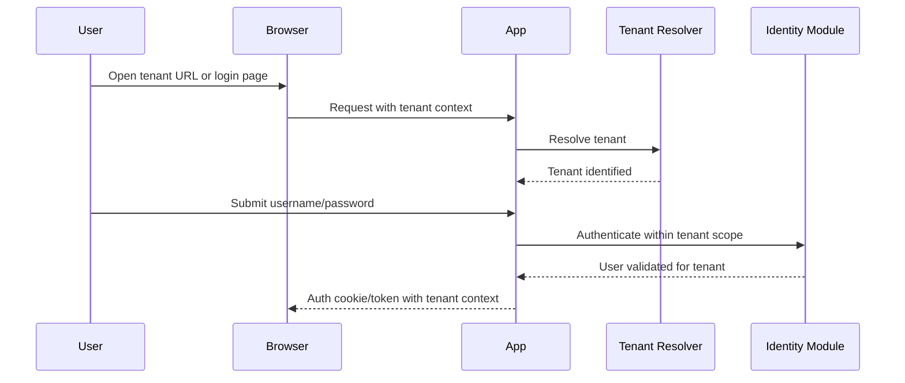

### Tenant switching

Tenant switching usually happens through one of these patterns:

- user visits a tenant-specific subdomain
- login page asks for tenant name first
- gateway injects tenant header
- token contains tenant claim after authentication

For SaaS UX, subdomain-based switching is usually the cleanest.

### Permissions by multi-tenancy side

When defining permissions, ABP lets you specify whether a permission applies to:

- host
- tenant
- both

That matters for admin screens. For example:

- tenant creation should be host-only
- customer management should be tenant-only
- profile management may be both

## Database Per Tenant Configuration

Database-per-tenant is where ABP's tenant infrastructure becomes especially valuable.

### Connection string management

Each tenant can have its own connection string. If a tenant-specific connection string exists, ABP uses it. Otherwise, it falls back to the default connection string.

That gives you hybrid support naturally.

### Tenant configuration storage with `ITenantStore`

`ITenantStore` is responsible for retrieving tenant configuration.

It can provide:

- tenant id
- tenant name
- connection strings
- activation state and related metadata depending on implementation

In simple setups, `DefaultTenantStore` can read from configuration. In production, tenant data is usually stored in the database through the Tenant Management module.

### Example tenant configuration in code-backed store scenarios

Conceptually, a tenant record may look like this:

```json
{
  "id": "2f7f8f8d-8f8d-4f8d-9f8d-2f7f8f8d8f8d",
  "name": "acme",
  "connectionStrings": {
    "Default": "Server=sql01;Database=Crm_Acme;User Id=app;Password=***;TrustServerCertificate=True"
  }
}
```

### Production-ready considerations

For database-per-tenant setups:

- encrypt or securely store connection strings
- automate tenant database creation
- automate migrations per tenant
- monitor schema drift
- support backup and restore per tenant
- define a fallback strategy for unavailable tenant databases

### Dynamic connection string resolution in practice

In ABP, once the tenant is resolved and the tenant store returns a tenant-specific connection string, EF Core DbContexts use that connection automatically. You usually do not write custom DbContext switching logic yourself.

That is one of the biggest practical benefits of using ABP instead of hand-rolling multi-tenancy.

## Building a Sample SaaS CRM Application

Let's connect the pieces with a realistic example.

Imagine a SaaS CRM product with these modules:

- host administration
- tenant administration
- customer management
- product catalog
- order management
- subscription management

### Host administration

Host users can:

- create tenants
- assign subscription plans
- decide shared DB vs dedicated DB
- seed tenant defaults
- monitor tenant health

### Tenant administration

Tenant admins can:

- manage users and roles
- configure CRM settings
- manage customers and products
- view tenant-specific reports

### Domain model split

Host-owned entities:

- `SubscriptionPlan`
- `TenantSubscription`
- `TenantProvisioningLog`

Tenant-owned entities implementing `IMultiTenant`:

- `Customer`
- `Product`
- `Order`
- `Invoice`
- `SalesPipeline`

### Provisioning flow

A practical tenant onboarding flow:

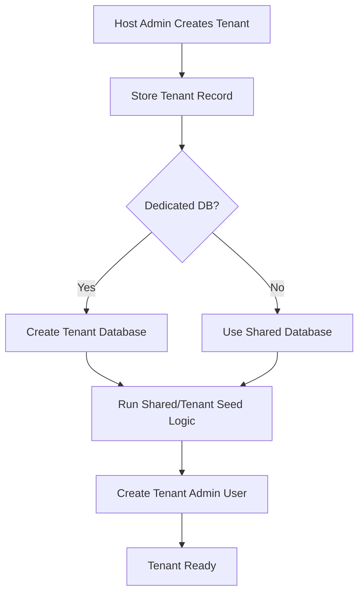

### Example application service for tenant provisioning

```csharp
using System;
using System.Threading.Tasks;
using Volo.Abp.Application.Services;
using Volo.Abp.Data;
using Volo.Abp.MultiTenancy;

namespace Acme.Crm.Tenants;

public class TenantProvisioningAppService : ApplicationService
{
    private readonly ITenantAppService _tenantAppService;
    private readonly IDataSeeder _dataSeeder;

    public TenantProvisioningAppService(
        ITenantAppService tenantAppService,
        IDataSeeder dataSeeder)
    {
        _tenantAppService = tenantAppService;
        _dataSeeder = dataSeeder;
    }

    public async Task ProvisionAsync(string tenantName, string adminEmail)
    {
        var tenant = await _tenantAppService.CreateAsync(new TenantCreateDto
        {
            Name = tenantName,
            AdminEmailAddress = adminEmail,
            Password = "ChangeMe123*"
        });

        await _dataSeeder.SeedAsync(new DataSeedContext(tenant.Id));
    }
}
```

The exact DTOs and APIs may vary by ABP version and modules used, but the pattern is the same: create tenant, configure infrastructure, seed tenant data, then hand over to tenant admins.


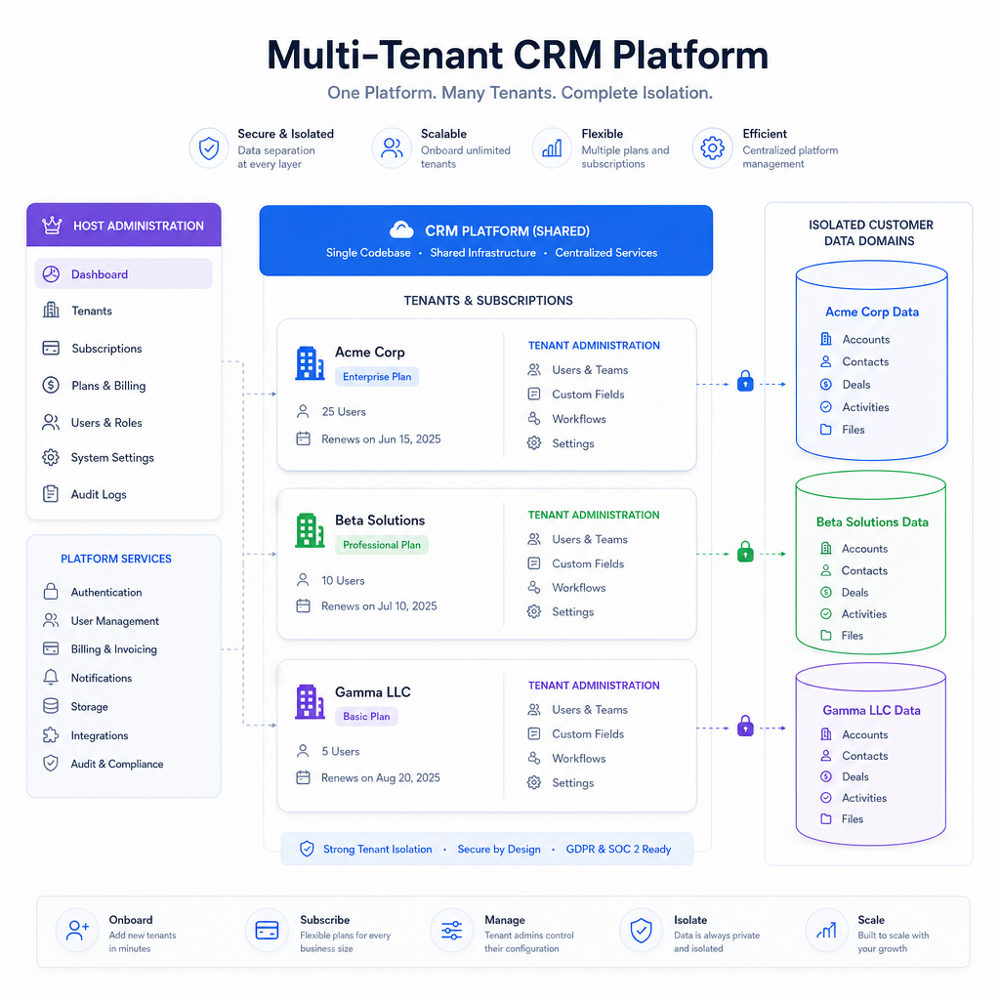

## Advanced Multi-Tenant Scenarios

Real SaaS systems need more than request-time filtering.

### Background jobs in tenant context

Background jobs must run under the correct tenant.

```csharp
using System;
using System.Threading.Tasks;
using Volo.Abp.BackgroundJobs;
using Volo.Abp.DependencyInjection;
using Volo.Abp.MultiTenancy;

namespace Acme.Crm.Jobs;

public class RecalculateMetricsArgs
{
    public Guid TenantId { get; set; }
}

public class RecalculateMetricsJob : AsyncBackgroundJob<RecalculateMetricsArgs>, ITransientDependency
{
    private readonly ICurrentTenant _currentTenant;

    public RecalculateMetricsJob(ICurrentTenant currentTenant)
    {
        _currentTenant = currentTenant;
    }

    public override async Task ExecuteAsync(RecalculateMetricsArgs args)
    {
        using (_currentTenant.Change(args.TenantId))
        {
            await Task.CompletedTask;
            // tenant-aware work here
        }
    }
}
```

### Distributed events

Include tenant information in event payloads or ensure handlers execute under the correct tenant scope. Otherwise, event consumers may process data in host context accidentally.

### Caching per tenant

Always include tenant id in cache keys.

Bad:

- `customer-list`

Good:

- `tenant:{tenantId}:customer-list`

Without tenant-aware keys, cache leakage is almost guaranteed.

### Feature management

ABP feature management is useful for SaaS plans:

- host defines available features
- tenants receive plan-based feature values
- premium tenants can unlock advanced modules

Examples:

- max users
- advanced reporting
- API access
- dedicated database eligibility

### Setting management

Settings can be layered:

- application default
- host override
- tenant override
- user override where appropriate

This is ideal for SMTP settings, branding, localization preferences, and business rules.

### Audit logging

Audit logs should capture tenant context so you can answer:

- who changed what
- in which tenant
- from which client
- under which user identity

### Localization

Multi-tenant apps often need tenant-specific culture defaults, branding, or custom terminology. Keep localization extensible, but avoid turning every string into tenant-specific data unless there is a real business need.

### Common pitfalls

- forgetting `IMultiTenant` on a tenant-owned entity
- disabling tenant filters too broadly
- using raw SQL without tenant predicates
- not including tenant id in cache keys
- running jobs without tenant context
- migrating only the host database in DB-per-tenant mode
- allowing `TenantId` changes after entity creation
- trusting query string tenant resolution in production

## Best Practices for Multi-Tenant ABP Applications

Here are practical rules that hold up in production.

1. **Implement `IMultiTenant` on every tenant-owned aggregate root.** Missing it is a classic data leak.
2. **Treat `TenantId` as immutable.** Moving data between tenants is rarely safe.
3. **Prefer subdomain or domain-based tenant resolution in production.** It is cleaner and harder to spoof than query strings.
4. **Use query string resolution mainly for development, support, or controlled integrations.**
5. **Index `TenantId` on large tables.** Shared database performance depends on it.
6. **Include tenant id in every cache key.** Never share cache entries across tenants accidentally.
7. **Test host context explicitly.** `CurrentTenant.Id == null` is a real execution mode.
8. **Test tenant context explicitly.** Verify that tenant A cannot see tenant B data.
9. **Be careful when disabling `IMultiTenant` filters.** Keep the scope as small as possible.
10. **Avoid raw SQL unless necessary.** If you use it, add tenant predicates yourself.
11. **Automate migrations for every tenant database.** Manual migration workflows do not scale.
12. **Make seed contributors idempotent.** Provisioning and recovery flows depend on repeatable seeding.
13. **Run background jobs under the correct tenant scope.** Pass tenant id in job args.
14. **Include tenant information in distributed event contracts or handler context.**
15. **Separate host-owned and tenant-owned entities clearly.** Ambiguous ownership creates bugs.
16. **Use feature management for plan-based SaaS behavior.** Do not hardcode plan logic everywhere.
17. **Use setting management for tenant-specific configuration.** Avoid custom config tables unless necessary.
18. **Secure tenant connection strings properly.** Treat them as secrets.
19. **Monitor tenant-level performance and failures.** One noisy tenant should be visible operationally.
20. **Design for tenant lifecycle operations.** Provisioning, suspension, upgrade, backup, restore, and deletion all matter.
21. **Plan reporting architecture early.** Cross-tenant reporting is easy in shared DB and harder in DB-per-tenant.
22. **Keep authorization tenant-aware.** Filtering data is not enough if permissions are wrong.
23. **Log tenant context in diagnostics and audit trails.** It speeds up support and incident response.
24. **Use hybrid architecture only when the business case is real.** It is powerful, but operationally expensive.
25. **Document your tenant model for the team.** Most multi-tenant bugs come from inconsistent assumptions.

## Final Thoughts

ABP does not make multi-tenancy trivial, but it makes it systematic. That matters a lot. Instead of scattering tenant checks across controllers, repositories, and middleware, you get a coherent model built around tenant resolution, current tenant context, data filters, tenant-aware identity, and connection string management.

For most SaaS teams, the right path is:

- start with shared database if your compliance and scale profile allow it
- model tenant ownership carefully with `IMultiTenant`
- use `ICurrentTenant` consistently
- automate seeding and provisioning
- move selected tenants to dedicated databases when the business case appears

That is exactly the kind of evolution ABP supports well.

## TL;DR

- ABP provides built-in multi-tenancy with tenant resolution, `ICurrentTenant`, `IMultiTenant`, data filters, tenant management, and per-tenant connection strings.
- Shared database is simpler and cheaper; database-per-tenant gives stronger isolation; hybrid supports both at the cost of more complexity.
- Correct tenant resolution and entity modeling are the foundation of safe multi-tenancy in ABP.
- Use tenant-aware seeding, caching, background jobs, identity, and monitoring to avoid subtle production bugs.
- For real SaaS systems, ABP gives you the infrastructure you would otherwise spend months rebuilding.