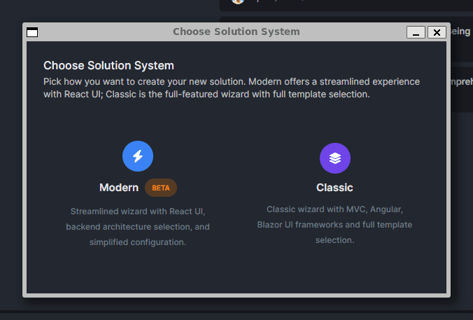
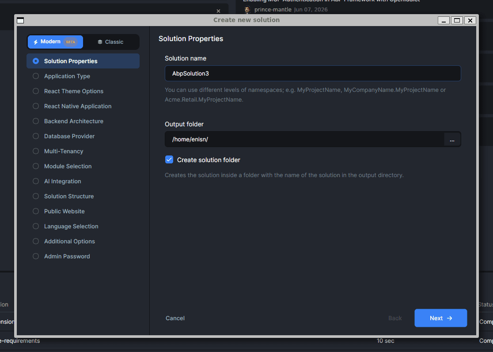
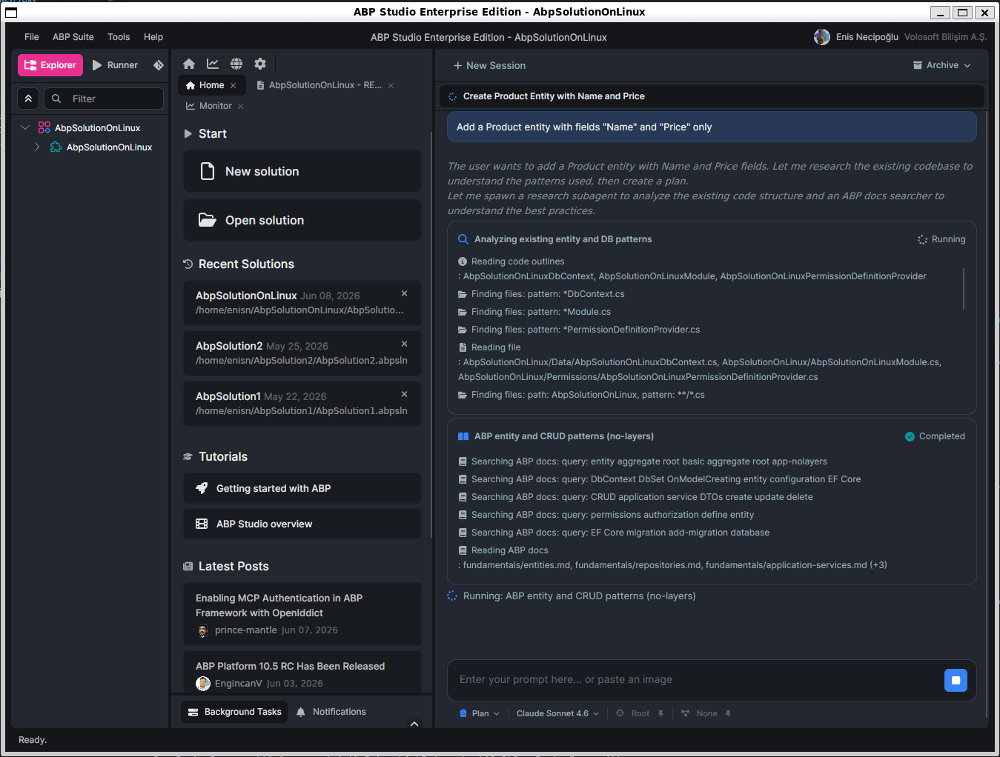
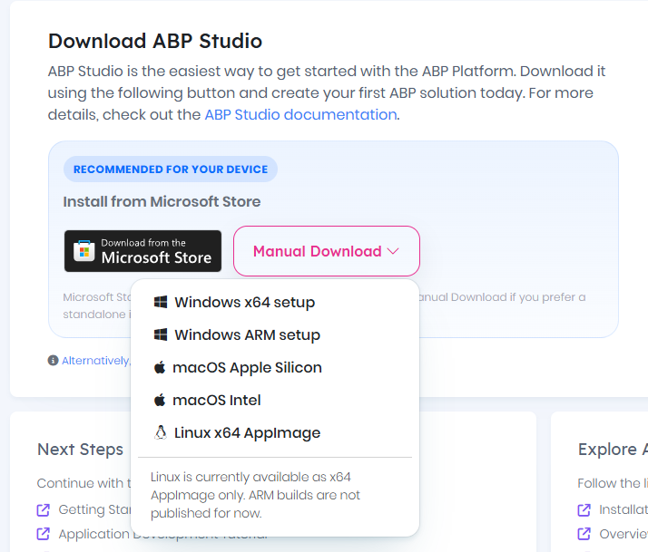

# ABP Studio Is Now Available on Linux

We are excited to announce that [ABP Studio](https://abp.io/studio), our cross-platform desktop application for ABP developers, is now available on Linux.

With this release, Linux users can download and run ABP Studio as an **x64 AppImage**. This is an important step in making ABP Studio available wherever .NET and ABP developers prefer to work.

## What can you do with ABP Studio?

[ABP Studio](https://abp.io/studio) is a desktop application designed to make ABP development faster, easier, and more comfortable. It offers:

* Easy creation of new solutions, from simple applications to distributed systems
* Visual architecture management for modular monolith and microservice solutions
* Solution exploration tools for entities, services, packages, and HTTP APIs
* Simplified running, debugging, and monitoring of multi-application solutions
* Kubernetes integration capabilities
* Built-in access to ABP-specific tooling and workflows

The screenshots below were captured from ABP Studio on Linux through the AppImage.





## Linux Support Has Arrived

ABP Studio has already been supporting multiple desktop environments, and now Linux joins that list.

You can currently use ABP Studio on:

* Windows x64
* Windows ARM
* macOS Apple Silicon
* macOS Intel
* Linux x64 **(New!)**

On Linux, the current distribution format is **AppImage**, which provides a practical way to distribute a desktop application across different Linux distributions without requiring a distribution-specific installer package.

## What This Means for Developers

Many ABP developers use Linux as their daily development environment. Until now, they needed to switch to another operating system to use ABP Studio. With Linux support, developers can now stay on their preferred platform and still benefit from ABP Studio's solution creation, architecture design, solution runner, monitoring, and integrated development experience.

This is especially valuable for teams that already build and run their backend services on Linux-based environments and want to keep their development workflow aligned with that ecosystem.

## AI Agent Is Available on Linux Too

Another common question from the community has been whether ABP Studio AI Agent can be used on Linux machines. With this release, the answer is yes.

Linux users can now use ABP Studio AI Agent in their own development environment. You can ask questions about your solution, plan implementation steps before changing code, and let the agent help with coding tasks while ABP Studio understands your ABP solution structure, build flow, and runtime context.


For a deeper look at the AI Agent experience, see the original announcement: [Introducing ABP Studio AI Agent](https://abp.io/community/announcements/introducing-abp-studio-ai-agent-o1ni0toc).

## Getting Started

Downloading and running ABP Studio on Linux is simple:



1. Go to [abp.io/studio](https://abp.io/studio)
2. Download the **Linux x64 AppImage**
3. Open a terminal in the folder where the file was downloaded
4. Make the AppImage executable and run it

```bash
chmod +x ./AbpStudio-stable.AppImage
./AbpStudio-stable.AppImage
```

Once launched, you can start using ABP Studio just like on the other supported platforms.

## If the AppImage Does Not Run Directly

Some Linux distributions may require additional runtime support for direct AppImage execution.

For example, on some Ubuntu and Debian-based systems, you may need `libfuse2`:

```bash
sudo apt update
sudo apt install libfuse2
```

If FUSE is not available on your machine, you can still extract and run the AppImage manually:

```bash
./AbpStudio-stable.AppImage --appimage-extract
./squashfs-root/AppRun
```

This fallback can be useful for testing or for environments where AppImage mounting is restricted.

## Current Scope and Limitations

This first Linux release is intentionally focused so we can deliver a reliable experience quickly.

Here is the current scope:

* Linux distribution is currently provided as an **x64 AppImage**
* **Linux ARM builds are not published yet**
* Depending on your Linux distribution, some native desktop or browser-related libraries may need to be installed
* When ABP Studio can detect a known native dependency problem, it tries to show guidance in the UI instead of leaving you with an unclear failure

This means Linux support is ready to use today, and we will continue to improve the Linux experience in future releases.

## A Better Cross-Platform Experience

ABP Studio has always aimed to be the default way to start and develop ABP solutions. Linux support brings us closer to that goal by making the Studio experience more accessible across major desktop platforms.

Whether you are creating a new solution, exploring packages and services, running multiple applications together, or monitoring runtime behavior, you can now do that on Linux too.

## Conclusion

We are happy to finally make ABP Studio available on Linux.

This first release focuses on a practical and reliable target: **Linux x64 through AppImage**. It already opens the door for many developers who prefer Linux as their primary development environment, and it gives us a strong foundation to improve the Linux experience further.

Please download it, try it in your daily workflow, and share your feedback with us. If you encounter a problem or want to request additional Linux targets like ARM, feel free to open an issue and let us know.
