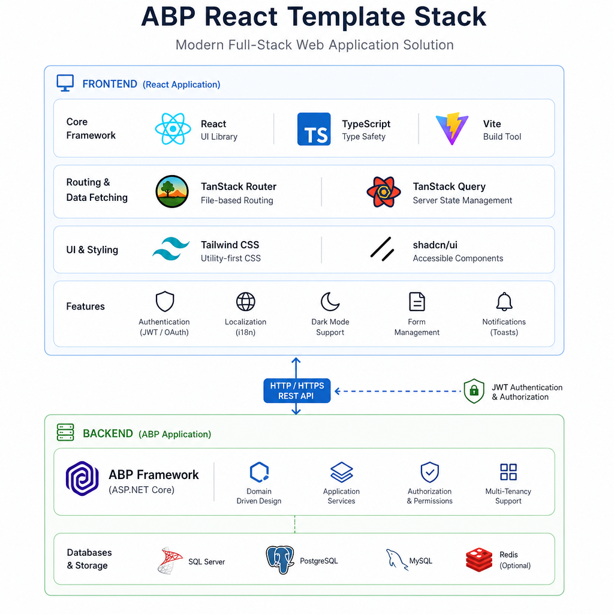
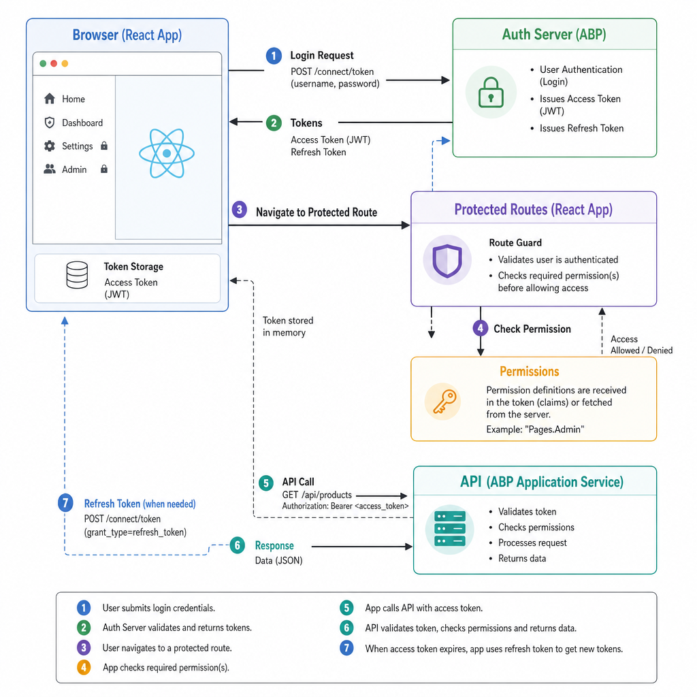
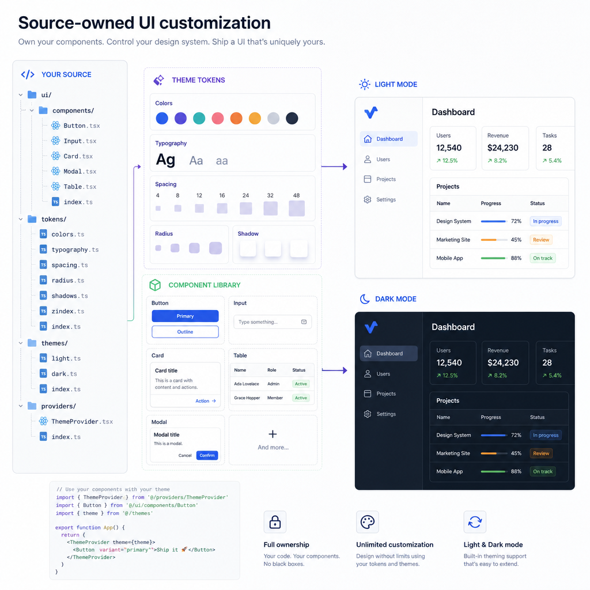
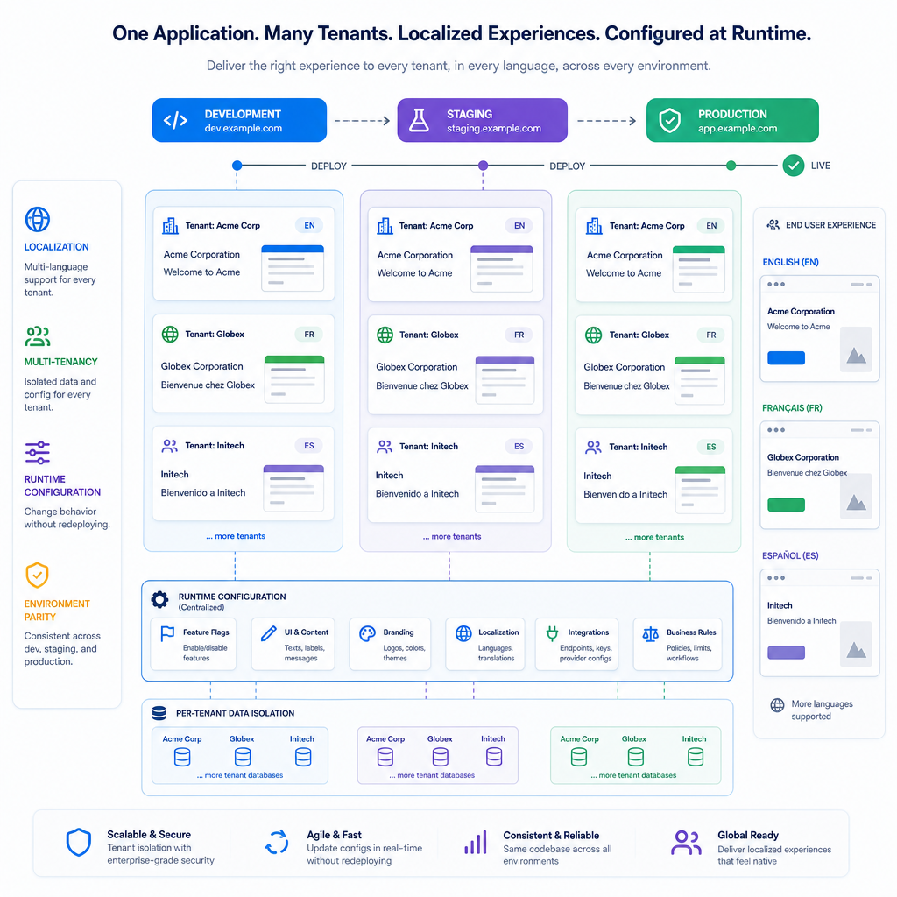

ABP has supported multiple UI approaches for a long time, but many teams building line-of-business apps have been waiting for a first-class React option that feels native to the framework instead of bolted on. That is exactly what the ABP React template brings.

If you are already using ABP for application services, modules, authentication, multi-tenancy, and code generation, the React template gives you a modern frontend stack without forcing you to hand-wire the same infrastructure in every project. You get React + TypeScript, a sensible project structure, generated API clients, authentication, localization, permission-aware UI, and a prebuilt admin experience that matches how ABP applications are typically built.

This article explains what the ABP React template is, how it is structured, what you get out of the box, where it fits well, and what to watch for before adopting it.

## What is the ABP React template?

The ABP React template is the React UI option in ABP Framework's modern template system. It is available through ABP Studio v3.0+ and through the CLI when you create a modern solution.

Typical commands look like this:

```bash
abp new MyCompany.MyApp --modern --ui-framework react
```

Depending on your architecture, ABP supports React in these template types:

- Layered: `app --modern`
- Single-layer: `app-nolayers --modern`
- Microservice: `microservice --modern`

A very important detail: React UI is part of the modern template system. If you create a classic ABP solution, React UI is not included.

At the time of its introduction, the React UI arrived as a beta/preview in 10.4.0-rc.1, with general availability planned for ABP 10.4 stable. So if you are evaluating it, make sure your ABP version and tooling align with the current docs.

## The tech stack behind the template

ABP did not build the React template around random choices. The stack is opinionated, but in a practical way that fits business applications.

### Core frontend stack

The template uses:

- React
- TypeScript
- Vite
- TanStack Router
- TanStack Query
- Tailwind CSS
- shadcn/ui
- Radix UI
- Zod
- React Hook Form
- Axios
- Vitest

That combination matters because it covers the common pain points in enterprise React apps:

- Routing is structured and type-friendly.
- Server state is handled properly instead of scattered across components.
- Forms and validation are consistent.
- UI components are source-owned, not black-box widgets.
- Build and local development are fast.

### Why this stack makes sense for ABP apps

ABP applications usually have:

- many CRUD screens
- authenticated users
- role and permission checks
- localization
- backend-driven DTOs
- modular features
- admin pages
- multi-tenant concerns

The React template maps well to that reality. It is not trying to be a blank React starter. It is trying to be a production-ready frontend foundation for ABP-based applications.




## Project structure and template layout

The structure depends on which ABP solution type you choose.

### Layered and single-layer solutions

In layered and single-layer templates, the React application lives under the solution root:

```text
react/
```

The Admin Console is embedded under the backend host and served from:

```text
/admin-console/*
```

This setup is convenient when you want a unified application host and do not need to split the frontend into separate deployable apps.

### Microservice solutions

In the microservice template, the React application is placed under:

```text
apps/react/
```

The Admin Console is a separate app:

```text
apps/react-admin-console/
```

It is typically served through the Web Gateway using YARP. This is a better fit when your architecture already separates concerns across gateways and independently deployed services.

### Common folders you will work with

The frontend typically includes folders like these:

- `components/` for layouts, reusable UI, and feature components
- `lib/` for auth, API setup, theme, and routing helpers
- `pages/` for page-level components
- `routes/` for route definitions
- `locales/` for translations

This is a familiar structure for React teams, but it also reflects ABP conventions well enough that backend and frontend concerns stay aligned.

## What you get out of the box

The main value of the ABP React template is not that it uses React. Plenty of templates do that. The real value is that it wires React into ABP's application model.




## Authentication and authorization

Authentication is one of the first places where many custom React frontends get messy. The ABP React template handles this using OpenID Connect with Authorization Code flow and PKCE against the ABP Auth Server.

That means you get a setup suitable for modern browser-based applications without having to build the auth plumbing from scratch.

### What is included

Out of the box, you get:

- OIDC integration
- route protection
- auth-related helpers and hooks
- support for ABP's authorization model
- permission-aware navigation and UI

Permission-aware UI is especially useful in real applications. Instead of hardcoding role checks everywhere, you can use ABP's permission system in the frontend so menus, buttons, and screens reflect what the current user is actually allowed to do.

For example, a user without the right permission should not see management actions just because the page rendered successfully.

### Why this matters in practice

In many projects, teams secure the backend correctly but forget to make the frontend behave consistently. The result is confusing UX:

- users see actions they cannot execute
- menus show modules they cannot access
- pages fail after navigation instead of being guarded earlier

The ABP React template reduces that mismatch.

## API integration without hand-written client boilerplate

One of the most useful parts of the template is the generated API client approach.

ABP can generate frontend API clients from OpenAPI definitions, so your React app consumes backend endpoints using generated contracts instead of duplicated DTO definitions or hand-written fetch code.

### Why this is a big deal

Without generated clients, frontend/backend integration often drifts over time:

- DTOs change but frontend types do not
- query strings are built inconsistently
- error handling varies by developer
- service layers become repetitive

With the ABP React template, Axios is already set up and typically used together with TanStack Query. That gives you a cleaner pattern for data fetching, caching, invalidation, and loading states.

A simplified example looks like this:

```tsx
import { useQuery } from '@tanstack/react-query';
import { identityUserControllerGetList } from '@/client';

export function UsersPage() {
  const query = useQuery({
    queryKey: ['users'],
    queryFn: () => identityUserControllerGetList({ maxResultCount: 10, skipCount: 0 }),
  });

  if (query.isLoading) return <div>Loading...</div>;
  if (query.isError) return <div>Failed to load users.</div>;

  return (
    <ul>
      {query.data.items.map((user) => (
        <li key={user.id}>{user.userName}</li>
      ))}
    </ul>
  );
}
```

The exact generated function names may vary based on your solution, but the pattern is the point: use generated contracts, wrap them with TanStack Query, and keep components focused on UI.

## UI system and customization model

The ABP React template uses shadcn/ui with Radix UI primitives and Tailwind CSS. That is a smart choice for teams that want control over their UI instead of being locked into a vendor component library.

### Source-owned components

This is one of the most important characteristics of the template: the frontend is source-owned.

Your components, pages, and UI primitives live in your solution. They are not hidden behind proprietary packages that you cannot meaningfully adjust.

That gives you freedom to:

- restyle components
- change layouts
- modify route structure
- reorganize menus
- build your own design language on top
- customize page composition without fighting framework internals

In practice, ABP places UI primitives under locations like `src/components/ui/`, so you can modify them directly when needed.

### Theme support

The template supports light, dark, and system themes. Styling is based on Tailwind CSS and CSS variables, which is a good fit for maintainable theming.

If your team needs brand-level customization, this approach is usually easier to work with than overriding a large third-party theme package.

### A practical trade-off

Source-owned UI gives you control, but it also means you own consistency. If every developer changes shared components casually, the design system can drift quickly.

The template gives you freedom. Your team still needs discipline.




## Forms, validation, and developer ergonomics

Business apps live and die by form quality. The ABP React template uses React Hook Form and Zod, which is a solid setup for forms that need validation, predictable behavior, and clean code.

This stack helps with:

- schema-driven validation
- reusable form components
- clearer error handling
- less form boilerplate
- better TypeScript integration

For ABP-style applications with lots of create/update dialogs and data-entry screens, that is a practical choice.

A minimal example might look like this:

```tsx
import { z } from 'zod';
import { useForm } from 'react-hook-form';
import { zodResolver } from '@hookform/resolvers/zod';

const schema = z.object({
  name: z.string().min(1, 'Name is required'),
});

type FormValues = z.infer<typeof schema>;

export function ProductForm() {
  const form = useForm<FormValues>({
    resolver: zodResolver(schema),
    defaultValues: { name: '' },
  });

  const onSubmit = (values: FormValues) => {
    console.log(values);
  };

  return (
    <form onSubmit={form.handleSubmit(onSubmit)}>
      <input {...form.register('name')} />
      <p>{form.formState.errors.name?.message}</p>
      <button type="submit">Save</button>
    </form>
  );
}
```

The exact ABP project will likely wrap inputs with shared UI components, but the workflow remains familiar.

## Localization and multi-tenancy

If you are building a SaaS product or an internal enterprise application for multiple regions, this part matters a lot.

The ABP React template includes support for:

- localization with i18next
- ABP localization resources and keys
- culture information from the backend
- end-to-end multi-tenant scenarios

This is where ABP has always been strong, and the React template carries that strength into the frontend.

### Why this matters

Many React starters look great until you need to answer these questions:

- Where does the current tenant come from?
- How does the frontend know which culture is active?
- How are permission and tenant context propagated to API requests?
- How do I keep localization aligned with backend resources?

With the ABP React template, these are not afterthoughts.




## The built-in Admin Console

Another notable piece is the React-based Admin Console provided through `Volo.Abp.AdminConsole`.

This gives you a prebuilt admin UI for common ABP modules such as:

- Identity
- Settings
- Audit Logs
- and other standard management features

### Why it is useful

For many projects, admin screens are necessary but not differentiating. You need them, but you do not want to spend weeks rebuilding infrastructure screens that ABP already understands well.

The Admin Console helps you start with a solid baseline.

### One thing to be clear about

The Admin Console is managed by ABP and is often intended to be used mostly as-is. If your project requires heavy customization there, you should evaluate that path carefully before assuming it behaves like the rest of your source-owned frontend.

That is not necessarily a problem, but it is worth knowing early.

## Runtime configuration with dynamic-env.json

A practical detail that deserves more attention is `dynamic-env.json` under the public folder.

This file allows runtime configuration for values such as:

- OAuth issuer
- client ID
- API base URLs
- related environment settings

That means you can adapt environment-specific settings without rebuilding the frontend for every deployment target.

For teams deploying across dev, staging, and production, this is much more convenient than baking every environment value into the build.

### Real-world example

Suppose your staging environment uses different hostnames and an alternate auth server URL. With runtime configuration, you can update those values at deployment time instead of producing another frontend artifact just for staging.

That said, when you change URLs or hostnames, remember that runtime config is only part of the story. You also need to update OpenIddict client settings such as redirect URIs and related auth configuration.

## Development workflow

The local development loop is straightforward.

### Running the application

You typically:

1. start the backend host with `dotnet run`
2. go to the React app folder
3. install dependencies with `npm install`
4. start the frontend with `npm run dev`

Vite keeps frontend startup and rebuild times fast, which helps a lot when you are iterating on pages and forms.

### Production build

For production, you build the frontend with:

```bash
npm run build
```

This outputs the app to `dist/`. How it is served depends on the template:

- via the backend host in simpler solution structures
- via a gateway or separate frontend host in microservice setups

### Testing

The template uses Vitest and React Testing Library, with scripts such as:

- `npm run test`
- `npm run test:coverage`

This is a good baseline. It encourages teams to test UI behavior without dragging in slow or outdated frontend test setups.

## When to use the ABP React template

The ABP React template is a strong fit when your project already wants ABP's backend capabilities and your team prefers React on the frontend.

Use it when:

- you are starting a new ABP project with a modern template
- you want React + TypeScript with ABP conventions already wired in
- you need authentication, permissions, localization, and multi-tenancy from day one
- you want generated API clients instead of duplicated DTOs
- you prefer source-owned UI components
- your app is admin-heavy, form-heavy, or module-heavy

### Good fit examples

- SaaS admin portals
- internal enterprise dashboards
- operations and management systems
- modular business applications with many CRUD workflows
- ABP-based platforms needing a modern React frontend

## When not to use it

It is not the right default for every case.

Avoid or reconsider it when:

- you are on a classic ABP template and do not want to migrate to modern templates
- your team wants a very custom frontend architecture unrelated to ABP conventions
- your application is mostly marketing pages or content-driven public pages
- you do not need ABP's auth, permission, module, or tenant model
- you expect deep customization of every built-in admin experience without validating the boundaries first

### A practical warning

Do not choose the template just because it uses React. Choose it because you want React inside the ABP ecosystem.

That distinction matters.

## Common pitfalls and things to check early

The template is productive, but there are a few details worth validating at the beginning of a project.

### 1. Make sure you are using a modern template

This is the most common source of confusion. React UI is for modern templates. If you create a classic solution, the React UI option is not there.

### 2. Align auth settings across environments

If you change frontend URLs, callback paths, ports, or hostnames, update:

- runtime frontend configuration
- OpenIddict client redirect URIs
- post-logout redirect URIs if applicable
- any gateway or proxy configuration involved

A lot of login issues come from partial updates here.

### 3. Treat source-owned UI like a product asset

Because the UI code is in your solution, it is easy to modify. That is good. It also means teams can slowly lose consistency unless they define clear frontend standards.

### 4. Understand the Admin Console boundary

The Admin Console is valuable, but it is not the same customization surface as your app pages. If extensive admin customization is a requirement, validate that path before committing architecture decisions around it.

## Why the ABP React template is different from a plain React starter

A plain React starter gives you flexibility, but also leaves many critical concerns unresolved. The ABP React template starts from a different assumption: most business applications need the same infrastructure pieces, and those pieces should work together.

Compared to a generic starter, ABP gives you tighter integration for:

- auth and authorization
- generated API clients
- localization
- tenant-aware applications
- modular backend alignment
- admin capabilities
- solution-level conventions

That makes it less minimal than a blank React scaffold, but much more useful for real ABP projects.

## Final thoughts

The ABP React template is not interesting because it says React on the label. It is interesting because it brings React into ABP's application model in a way that feels intentional.

You get a modern frontend stack, source-owned customization, generated client integration, and the ABP features many teams actually need in production: permissions, localization, multi-tenancy, and admin tooling.

If your team already values ABP on the backend and wants React on the frontend, this template is one of the fastest ways to get to a serious foundation without spending the first sprint rebuilding plumbing.

## TL;DR

- The ABP React template is available in ABP's modern template system, not classic templates.
- It uses a practical stack: React, TypeScript, Vite, TanStack Router/Query, shadcn/ui, Tailwind, Zod, and Axios.
- Key strengths are generated API clients, OIDC auth, permission-aware UI, localization, and multi-tenancy.
- The frontend is source-owned, which gives you flexibility but also requires discipline.
- It is a strong choice for ABP-based business apps, especially admin-heavy and SaaS-style applications.