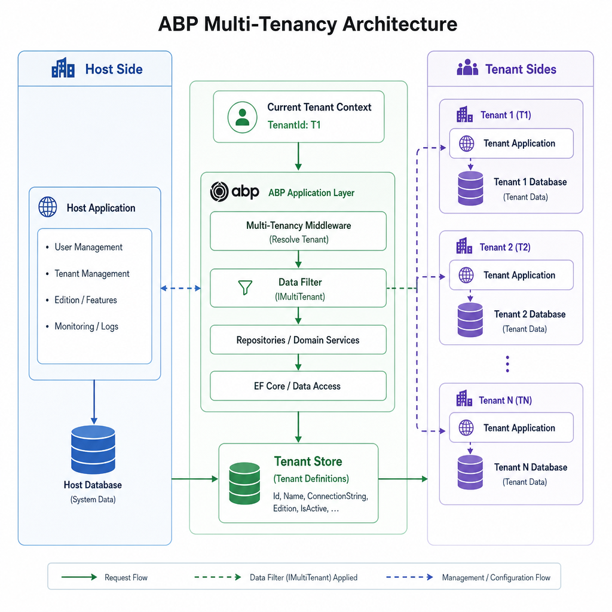
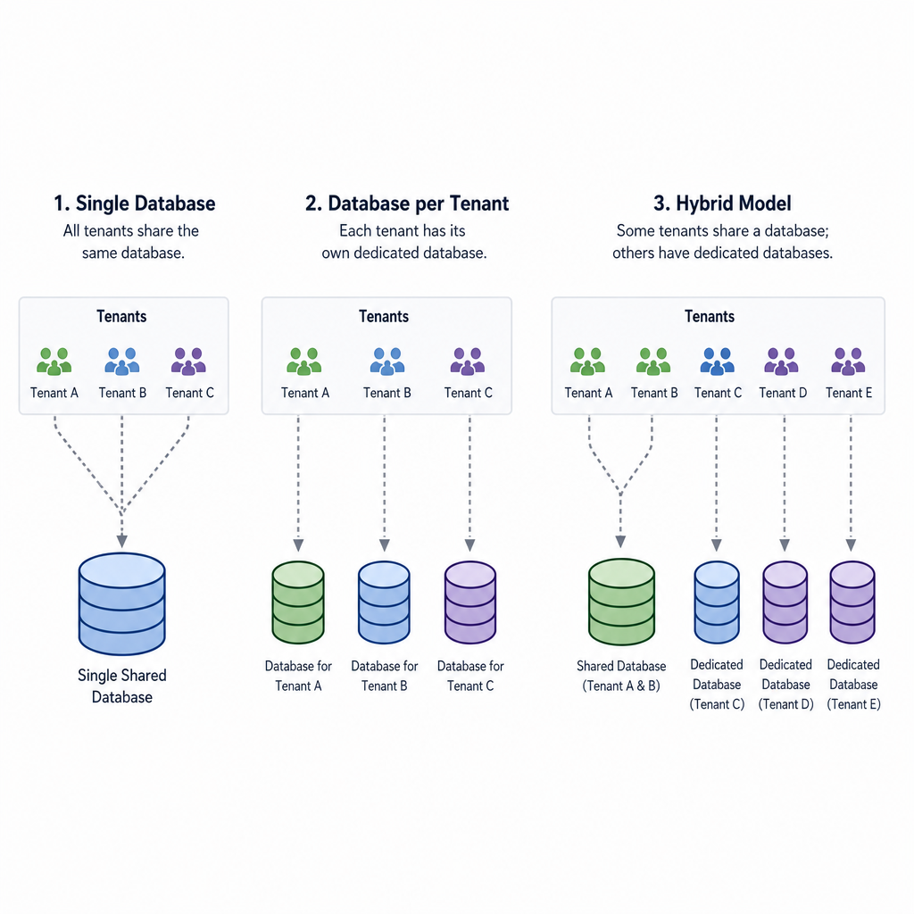
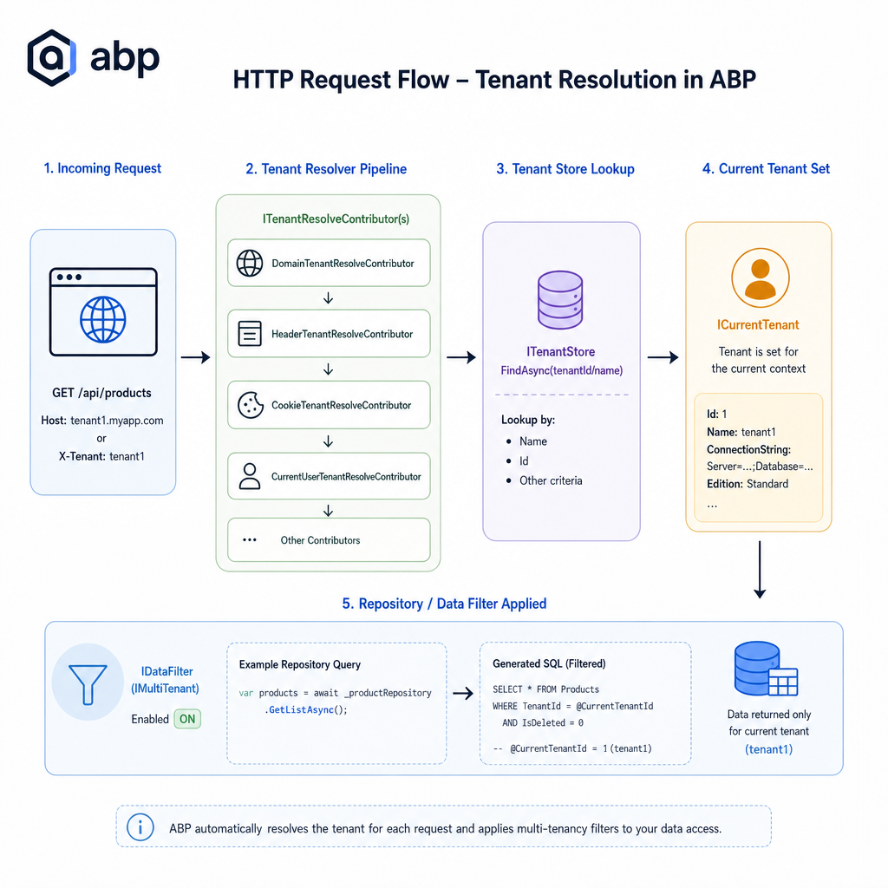

# Implementing Multi-Tenancy in ABP Framework: A Complete Practical Guide

Multi-tenancy is one of those features that looks straightforward on a whiteboard and gets complicated the moment real customers, databases, authentication, billing, and background jobs enter the picture.

If you are building a SaaS application on ASP.NET Core, you need more than a `TenantId` column scattered across a few tables. You need a consistent way to resolve the tenant for each request, isolate data safely, seed tenant-specific records, handle host-level administration, and support different deployment models as your product grows.

This is where ABP Framework helps a lot. Multi-tenancy is built into the framework's core architecture: request pipeline, entity model, data filters, tenant store, identity integration, settings, features, and modules all understand the concept of host and tenant.

In this guide, we will go from architecture to implementation. The focus is practical: how ABP multi-tenancy works, how to enable it correctly, how to model tenant-aware entities, how request resolution flows through the app, and how to build a real SaaS CRM application on top of it.

## Introduction to Multi-Tenancy

Multi-tenancy means a single software application serves multiple customers, where each customer is treated as a separate tenant. A tenant usually has its own users, roles, settings, data, and operational boundaries.

In SaaS terms:

- The **host** is the software provider, the platform owner.
- A **tenant** is a customer organization using the system.

### Single-tenant vs multi-tenant architecture

A **single-tenant** system typically gives each customer a separate deployed application instance, often with a separate database and infrastructure boundary.

A **multi-tenant** system shares the application runtime and, depending on the model, may share databases too.

**Single-tenant** usually gives:

- simpler isolation reasoning
- easier customer-specific customization
- higher infrastructure cost
- more operational duplication

**Multi-tenant** usually gives:

- better resource efficiency
- easier centralized updates
- lower cost per customer
- more complexity around isolation and scaling

### Why multi-tenancy matters for SaaS

Most SaaS products eventually need:

- centralized onboarding
- tenant-specific authentication and authorization
- subscription plans and features
- controlled data isolation
- operational efficiency at scale

Without a solid multi-tenancy model, these become ad hoc implementations. That tends to create subtle security bugs and hard-to-maintain code.

### Advantages and challenges

**Advantages**

- Better infrastructure utilization
- Centralized deployment and upgrades
- Lower operating cost per customer
- Easier platform-wide monitoring and governance
- Feature and setting management per tenant

**Challenges**

- Preventing cross-tenant data leakage
- Tenant-aware caching and background jobs
- Managing request resolution correctly
- Handling database-per-tenant operations
- Supporting host-side administration cleanly

### Why ABP Framework simplifies it

ABP does not treat multi-tenancy as a naming convention. It treats it as a first-class capability.

You get:

- built-in tenant resolution pipeline
- `ICurrentTenant` for runtime tenant context
- `IMultiTenant` support for entities
- automatic data filters
- host and tenant side concepts across modules
- tenant management module and tenant store abstraction
- identity, features, settings, and permissions that understand tenants

That combination is what makes ABP especially useful for serious SaaS applications.

## Understanding ABP Multi-Tenancy Architecture

At the center of ABP multi-tenancy are a few concepts that appear everywhere in the application lifecycle.

### Tenant concept

A tenant is usually a customer organization. In a CRM product, one tenant might be `acme`, another might be `globex`. Each one has:

- its own users
- its own roles
- its own application data
- optionally its own connection string
- optionally its own features and settings

The host is not just another tenant. It is the platform owner context.

### Host side vs tenant side

ABP explicitly distinguishes between host-side and tenant-side operations.

**Host side** typically includes:

- creating and managing tenants
- viewing subscription status
- assigning features and plans
- managing platform-level settings
- running cross-tenant operations

**Tenant side** typically includes:

- managing tenant users and roles
- working with tenant business data
- updating tenant settings
- tenant-specific administration

In shared database setups, host-side records usually have `TenantId == null`. Tenant-side records have a concrete `TenantId`.

### `ICurrentTenant`

`ICurrentTenant` is the runtime source of truth for tenant context.

It exposes:

- `Id`
- `Name`
- `IsAvailable`

In application services, domain services, controllers, and many ABP base classes, it is already available or easy to inject.

Example:

```csharp
public class DashboardAppService : ApplicationService
{
    public string GetContextInfo()
    {
        if (!CurrentTenant.IsAvailable)
        {
            return "Host context";
        }

        return $"Tenant: {CurrentTenant.Name} ({CurrentTenant.Id})";
    }
}
```

If `CurrentTenant.Id` is `null`, you are in host context.

### Tenant resolution pipeline

Before your application logic runs, ABP tries to determine which tenant the request belongs to.

ABP uses a set of tenant resolvers, executed in order. Common sources include:

- current user claims
- query string parameter `__tenant`
- route value `__tenant`
- header `__tenant`
- cookie `__tenant`
- domain or subdomain pattern

The middleware `UseMultiTenancy()` plugs this into the ASP.NET Core pipeline.

Because diagram DSLs are not suitable here, the request flow is best explained in steps:

1. An HTTP request reaches the ASP.NET Core pipeline.
2. ABP multi-tenancy middleware runs.
3. Configured tenant resolvers inspect the request.
4. If a tenant identifier is found, ABP loads tenant information from the tenant store.
5. `ICurrentTenant` is populated for the rest of the request scope.
6. Repository queries and data filters automatically use the current tenant context.
7. Authentication, authorization, settings, features, and caches can all behave tenant-aware.

### `IMultiTenant`

`IMultiTenant` marks an entity as tenant-aware.

It defines:

```csharp
public interface IMultiTenant
{
    Guid? TenantId { get; }
}
```

In practice, entities implementing this interface participate in ABP's multi-tenant data filtering behavior.

### Data filters

ABP automatically applies data filters to entities implementing `IMultiTenant`. In a shared database model, queries are filtered so the current tenant sees only its own records.

That means code like this:

```csharp
var products = await _productRepository.GetListAsync();
```

will only return the current tenant's products when `Product` implements `IMultiTenant`.

If you are on host side and intentionally need cross-tenant access, you can disable the filter temporarily:

```csharp
using (_dataFilter.Disable<IMultiTenant>())
{
    var allProducts = await _productRepository.GetListAsync();
}
```

This is powerful and dangerous. Use it carefully.

### Tenant Management module

ABP's Tenant Management module gives you a production-ready foundation for tenant administration.

It provides:

- tenant CRUD operations
- tenant connection strings
- tenant store integration
- management UI in ABP-based solutions
- admin user provisioning support

In real projects, this removes a lot of plumbing work.




## Multi-Tenancy Models Supported by ABP

ABP supports all common SaaS multi-tenancy models.

### 1. Single database

All tenants share one database and typically the same schema. Data is separated logically using `TenantId` and data filters.

**How it works**

- one database for host and tenant data
- tenant-aware tables contain a `TenantId`
- ABP filters queries automatically based on current tenant

**Advantages**

- simplest to start with
- cheapest operationally
- easiest schema migration story
- simpler reporting when all tenant data is in one place

**Disadvantages**

- strongest need for careful isolation
- noisy-neighbor effects at database level
- scaling limits can appear earlier
- large shared tables can become operational pain points

### 2. Database per tenant

Each tenant gets a dedicated database. The host may still use a separate shared database for platform-level data.

**How it works**

- tenant-specific connection strings are stored per tenant
- ABP resolves the current tenant, then resolves the tenant's database connection
- repositories work in the tenant's database context

**Advantages**

- stronger isolation
- easier compliance story for some customers
- easier tenant-specific restore and backup
- tenant-level scaling options

**Disadvantages**

- more complex provisioning
- harder cross-tenant reporting
- more migration orchestration
- greater operational overhead

### 3. Hybrid model

Some tenants share a database, others get dedicated databases.

This is common in enterprise SaaS.

**Typical scenario**

- small and mid-market tenants use shared infrastructure
- premium or regulated customers get dedicated databases
- host still manages everything through the same application codebase

**Advantages**

- flexible cost model
- premium isolation for large customers
- efficient default for smaller tenants

**Disadvantages**

- highest operational complexity
- more provisioning paths to maintain
- more testing combinations

### Comparison

| Model | Database layout | Strengths | Weaknesses | Best fit |
|---|---|---|---|---|
| Single database | All tenants share one DB | Simple, cheap, easy migrations | Lower isolation, shared load | Early-stage SaaS, internal SaaS |
| Database per tenant | One DB per tenant | Strong isolation, restore flexibility | Higher ops cost, harder reporting | Enterprise SaaS, regulated environments |
| Hybrid | Shared for some, dedicated for others | Flexible pricing and isolation | Most complex to operate | Growing SaaS platforms |

### When to use / When NOT to use

**Use single database when:**

- you are launching an MVP or early SaaS
- tenant counts are moderate
- compliance requirements are manageable
- operational simplicity matters most

**Do not use single database when:**

- customers require physical data isolation
- large tenants can dominate database resources
- tenant-specific backup and restore is mandatory

**Use database per tenant when:**

- compliance and isolation matter a lot
- customers pay enough to justify dedicated infrastructure
- you need tenant-level backup, restore, and scaling

**Do not use database per tenant when:**

- you are optimizing for low operational overhead
- your team is not ready to automate migrations and provisioning
- most tenants are very small and margins are tight

**Use hybrid when:**

- you want shared infrastructure by default
- you have a premium enterprise tier
- you need a migration path from shared to dedicated tenants

**Do not use hybrid when:**

- your platform operations are still immature
- you want to minimize architectural branching




## Enabling Multi-Tenancy in an ABP Application

Multi-tenancy is off by default in the framework, although ABP startup templates commonly enable it for you.

A clean approach is to centralize the flag in `MultiTenancyConsts`.

### `MultiTenancyConsts`

```csharp
namespace Acme.Crm;

public static class MultiTenancyConsts
{
    public const bool IsEnabled = true;
}
```

### Configure `AbpMultiTenancyOptions`

In your HTTP API Host module:

```csharp
using Volo.Abp.MultiTenancy;

public override void ConfigureServices(ServiceConfigurationContext context)
{
    Configure<AbpMultiTenancyOptions>(options =>
    {
        options.IsEnabled = MultiTenancyConsts.IsEnabled;
    });
}
```

### Add middleware

In `OnApplicationInitialization`:

```csharp
public override void OnApplicationInitialization(ApplicationInitializationContext context)
{
    var app = context.GetApplicationBuilder();
    var env = context.GetEnvironment();

    if (env.IsDevelopment())
    {
        app.UseDeveloperExceptionPage();
    }

    app.UseRouting();
    app.UseAuthentication();

    if (MultiTenancyConsts.IsEnabled)
    {
        app.UseMultiTenancy();
    }

    app.UseAuthorization();
    app.UseConfiguredEndpoints();
}
```

A practical rule: place `UseMultiTenancy()` after authentication setup and before application endpoints.

### Configuration example

If you use ABP's default tenant store from configuration in a simple setup, you can define tenants in `appsettings.json`.

```json
{
  "TenantManagement": {
    "Tenants": [
      {
        "Id": "11111111-1111-1111-1111-111111111111",
        "Name": "acme"
      },
      {
        "Id": "22222222-2222-2222-2222-222222222222",
        "Name": "globex"
      }
    ]
  }
}
```

In real applications, the Tenant Management module is usually a better choice than static config.

## Tenant Resolution Strategies

Tenant resolution is where many real-world mistakes happen. The framework can only isolate data correctly if the tenant is resolved correctly.

### Default resolvers

ABP can resolve tenant information from:

- authenticated user claims
- query string: `__tenant`
- route value: `__tenant`
- header: `__tenant`
- cookie: `__tenant`

### Configure resolver options

```csharp
using Volo.Abp.AspNetCore.MultiTenancy;
using Volo.Abp.MultiTenancy;

public override void ConfigureServices(ServiceConfigurationContext context)
{
    Configure<AbpTenantResolveOptions>(options =>
    {
        options.AddDefaultResolvers();
    });
}
```

### Subdomain resolution

Subdomain-based tenant resolution is common in SaaS.

Examples:

- `acme.mycrm.com`
- `globex.mycrm.com`

Configuration:

```csharp
Configure<AbpTenantResolveOptions>(options =>
{
    options.AddDomainTenantResolver("{0}.mycrm.com");
});
```

Now a request to `acme.mycrm.com` resolves tenant name `acme`.

### Domain resolution

You can also map full domains, especially for custom domains.

For example, a tenant might use:

- `crm.acme.com`
- `sales.globex.io`

You typically handle these with custom tenant resolution logic backed by your own domain mapping table.

### Header-based resolution

Useful for internal APIs, gateways, or backend-to-backend communication.

Example request:

```http
GET /api/products
__tenant: acme
```

This is convenient, but do not trust arbitrary tenant headers from public traffic unless a trusted gateway injects them.

### Query string resolution

Useful for demos, diagnostics, or very simple integrations.

Example:

```text
https://api.mycrm.com/api/products?__tenant=acme
```

It works, but it is not usually the best production UX.

### Route-based resolution

You can support routes like:

```text
/api/{__tenant}/products
```

This is more common in APIs than browser-based SaaS frontends.

### Custom tenant resolver

For custom logic, implement a tenant resolve contributor.

```csharp
using System.Threading.Tasks;
using Volo.Abp.MultiTenancy;

public class ApiKeyTenantResolveContributor : TenantResolveContributorBase
{
    public override string Name => "ApiKey";

    public override Task ResolveAsync(ITenantResolveContext context)
    {
        var httpContext = context.GetHttpContext();
        var apiKey = httpContext?.Request.Headers["X-Api-Key"].ToString();

        if (string.IsNullOrWhiteSpace(apiKey))
        {
            return Task.CompletedTask;
        }

        if (apiKey == "acme-key")
        {
            context.Handled = true;
            context.TenantIdOrName = "acme";
        }

        return Task.CompletedTask;
    }
}
```

Register it:

```csharp
Configure<AbpTenantResolveOptions>(options =>
{
    options.TenantResolvers.Insert(0, new ApiKeyTenantResolveContributor());
});
```

Putting your resolver at the beginning gives it priority.

### How tenant identification flows through an HTTP request

A practical request flow looks like this:

1. Browser requests `https://acme.mycrm.com/api/app/customers`.
2. ASP.NET Core receives the request.
3. `UseMultiTenancy()` runs.
4. Domain resolver extracts `acme` from the host.
5. ABP loads tenant metadata from `ITenantStore`.
6. `ICurrentTenant.Id` is set for the request scope.
7. Authentication and authorization proceed in tenant context.
8. Repositories apply the tenant data filter.
9. Only `acme` data is returned.

That is the core path you should have in mind when debugging tenant issues.




## Creating Tenant-Aware Entities

The heart of tenant data isolation is entity design.

### Using `IMultiTenant`

Let's model a SaaS CRM with `Product`, `Customer`, and `Order`.

```csharp
using System;
using Volo.Abp.Domain.Entities.Auditing;
using Volo.Abp.MultiTenancy;

public class Product : FullAuditedAggregateRoot<Guid>, IMultiTenant
{
    public Guid? TenantId { get; set; }
    public string Name { get; private set; }
    public decimal Price { get; private set; }

    protected Product()
    {
    }

    public Product(Guid id, string name, decimal price, Guid? tenantId)
        : base(id)
    {
        TenantId = tenantId;
        Name = name;
        Price = price;
    }
}
```

```csharp
public class Customer : FullAuditedAggregateRoot<Guid>, IMultiTenant
{
    public Guid? TenantId { get; set; }
    public string Name { get; private set; }
    public string Email { get; private set; }

    protected Customer()
    {
    }

    public Customer(Guid id, string name, string email, Guid? tenantId)
        : base(id)
    {
        TenantId = tenantId;
        Name = name;
        Email = email;
    }
}
```

```csharp
public class Order : FullAuditedAggregateRoot<Guid>, IMultiTenant
{
    public Guid? TenantId { get; set; }
    public Guid CustomerId { get; private set; }
    public decimal TotalAmount { get; private set; }

    protected Order()
    {
    }

    public Order(Guid id, Guid customerId, decimal totalAmount, Guid? tenantId)
        : base(id)
    {
        TenantId = tenantId;
        CustomerId = customerId;
        TotalAmount = totalAmount;
    }
}
```

### Aggregate root considerations

In a multi-tenant model:

- aggregate roots should clearly belong to host or tenant side
- child entities usually follow the aggregate root's tenant boundary
- references between aggregates from different tenants should be avoided
- host-side entities should not accidentally depend on tenant-scoped data

A simple rule is helpful: if an entity exists only inside a tenant's business workflow, make it tenant-aware.

### Automatically assigning `TenantId`

In application services, use `CurrentTenant.Id` when creating tenant-owned entities.

```csharp
public class ProductAppService : ApplicationService
{
    private readonly IRepository<Product, Guid> _productRepository;

    public ProductAppService(IRepository<Product, Guid> productRepository)
    {
        _productRepository = productRepository;
    }

    public async Task<Guid> CreateAsync(string name, decimal price)
    {
        var product = new Product(
            GuidGenerator.Create(),
            name,
            price,
            CurrentTenant.Id
        );

        await _productRepository.InsertAsync(product, autoSave: true);
        return product.Id;
    }
}
```

### How ABP filters tenant data automatically

Suppose `acme` is the current tenant.

This code:

```csharp
var customers = await _customerRepository.GetListAsync();
```

will generate SQL conceptually similar to:

```sql
SELECT *
FROM CrmCustomers
WHERE TenantId = @CurrentTenantId
```

If the filter is disabled from host context, the generated query may no longer include the tenant predicate.

The exact SQL depends on EF Core and your provider, but the practical point is the same: ABP injects the tenant boundary for you.

## Working with `ICurrentTenant`

`ICurrentTenant` is not just for reading tenant info. It is also how you intentionally switch tenant context during controlled operations.

### Reading current tenant information

```csharp
public class TenantInfoAppService : ApplicationService
{
    public object GetCurrent()
    {
        return new
        {
            CurrentTenant.Id,
            CurrentTenant.Name,
            CurrentTenant.IsAvailable
        };
    }
}
```

### Changing tenant context

A host-side admin service may need to run work inside a specific tenant.

```csharp
public class TenantReportingAppService : ApplicationService
{
    private readonly IRepository<Customer, Guid> _customerRepository;

    public TenantReportingAppService(IRepository<Customer, Guid> customerRepository)
    {
        _customerRepository = customerRepository;
    }

    public async Task<long> GetCustomerCountAsync(Guid tenantId)
    {
        using (CurrentTenant.Change(tenantId))
        {
            return await _customerRepository.GetCountAsync();
        }
    }
}
```

### Switching to host context

```csharp
using (CurrentTenant.Change(null))
{
    // host-side logic here
}
```

### Nested tenant scopes

ABP restores the previous tenant automatically after the `using` block ends.

```csharp
using (CurrentTenant.Change(tenantA))
{
    // tenant A

    using (CurrentTenant.Change(tenantB))
    {
        // tenant B
    }

    // back to tenant A
}
```

This matters in background jobs, cross-tenant maintenance tasks, and provisioning routines.

## Data Isolation Mechanisms in ABP

ABP's multi-tenancy model is more than a `TenantId` field.

### Automatic data filtering

If an entity implements `IMultiTenant`, ABP applies a filter automatically. This reduces the amount of repetitive tenant checks you need to write manually.

That said, you should still think in layers:

- **Resolution** determines who the tenant is.
- **Filtering** limits data access.
- **Authorization** controls what the current user can do.
- **Database strategy** defines physical or logical isolation.

These layers complement each other.

### Tenant-specific repositories

You usually do not need separate repository implementations just to filter by tenant. The standard repository already respects the active tenant context.

But custom repository methods still need discipline. If you write raw SQL, disable filters, or query across host boundaries, you must preserve isolation intentionally.

### Unit of Work integration

ABP's Unit of Work operates inside the current tenant context. That means reads and writes in the same UoW use the same tenant scope unless you explicitly change it.

This is one reason `CurrentTenant.Change(...)` is safer than trying to pass tenant identifiers manually through every service method.

### Security implications

Multi-tenancy bugs are often security bugs.

Be especially careful with:

- host-side screens that disable tenant filters
- header and query-string based tenant resolution in public endpoints
- cross-tenant exports and reports
- tenant-aware caches
- background jobs and event handlers that run without explicit tenant context

A common mistake is assuming data filtering replaces authorization. It does not.

## Seeding Tenant Data

A good SaaS system usually needs both host seed data and tenant seed data.

Examples:

- host roles and platform settings
- tenant admin user
- default CRM stages
- default product catalog or sample records

ABP uses `IDataSeedContributor` for this.

### Basic seed contributor

```csharp
using System;
using System.Threading.Tasks;
using Microsoft.Extensions.DependencyInjection;
using Volo.Abp.Data;
using Volo.Abp.DependencyInjection;
using Volo.Abp.MultiTenancy;

public class CrmDataSeedContributor : IDataSeedContributor, ITransientDependency
{
    private readonly ICurrentTenant _currentTenant;
    private readonly IRepository<Product, Guid> _productRepository;

    public CrmDataSeedContributor(
        ICurrentTenant currentTenant,
        IRepository<Product, Guid> productRepository)
    {
        _currentTenant = currentTenant;
        _productRepository = productRepository;
    }

    public async Task SeedAsync(DataSeedContext context)
    {
        using (_currentTenant.Change(context?.TenantId))
        {
            if (await _productRepository.GetCountAsync() > 0)
            {
                return;
            }

            await _productRepository.InsertAsync(
                new Product(Guid.NewGuid(), "Starter Plan", 49, _currentTenant.Id),
                autoSave: true
            );

            await _productRepository.InsertAsync(
                new Product(Guid.NewGuid(), "Growth Plan", 99, _currentTenant.Id),
                autoSave: true
            );
        }
    }
}
```

### Host seed vs tenant seed

Inside `SeedAsync`, `context.TenantId` tells you which scope you are seeding.

- `null` means host context
- a concrete value means tenant context

That makes it easy to branch logic:

```csharp
public async Task SeedAsync(DataSeedContext context)
{
    using (_currentTenant.Change(context?.TenantId))
    {
        if (_currentTenant.Id == null)
        {
            await SeedHostAsync();
        }
        else
        {
            await SeedTenantAsync(_currentTenant.Id.Value);
        }
    }
}
```

### Per-tenant initialization

For onboarding, a common pattern is:

1. Create tenant.
2. Create tenant admin user.
3. Configure tenant connection string if needed.
4. Run migration for tenant database if dedicated.
5. Seed tenant defaults.
6. Enable tenant features.

That workflow becomes especially important in database-per-tenant setups.


## Multi-Tenant Authentication and Identity

Identity is where host and tenant boundaries become visible to users.

### Tenant-specific users and roles

ABP Identity supports tenant-specific users and roles.

- Host users have `TenantId == null`
- Tenant users have a tenant `TenantId`

This allows the same email or username patterns to exist in separate tenant scopes, depending on your identity rules and configuration.

### Permission definitions by side

ABP permissions can be restricted by multi-tenancy side.

Example:

```csharp
using Volo.Abp.Authorization.Permissions;
using Volo.Abp.MultiTenancy;

public class CrmPermissionDefinitionProvider : PermissionDefinitionProvider
{
    public override void Define(IPermissionDefinitionContext context)
    {
        var crmGroup = context.AddGroup("Crm");

        crmGroup.AddPermission(
            "Crm.Tenants.Manage",
            multiTenancySide: MultiTenancySides.Host
        );

        crmGroup.AddPermission(
            "Crm.Customers.Manage",
            multiTenancySide: MultiTenancySides.Tenant
        );
    }
}
```

This is a clean way to avoid accidentally exposing host admin actions to tenant users.

### Login flow in a multi-tenant app

A typical login flow works like this:

1. User opens tenant URL such as `acme.mycrm.com`.
2. ABP resolves tenant `acme`.
3. Login request is processed within tenant context.
4. Identity validates the user against that tenant.
5. Claims are issued with tenant information.
6. Subsequent requests continue in the same tenant context.

For host login:

1. User opens host administration URL.
2. No tenant is resolved.
3. Login happens in host context.
4. Host-only permissions become available.

### Tenant switching

Tenant switching can mean different things:

- a host admin acting on behalf of a tenant in backend services
- a user selecting a tenant context in a multi-organization portal
- changing browser origin or subdomain for tenant-specific UI access

For backend logic, `CurrentTenant.Change(...)` is the mechanism.

For frontend flows, tenant resolution strategy usually drives the user experience.

## Database-Per-Tenant Configuration

Database-per-tenant is where ABP's tenant abstractions become especially valuable.

### Tenant-specific connection strings

The Tenant Management module supports storing per-tenant connection strings. Once configured, ABP can use the tenant's own database automatically.

Typical flow:

- host creates tenant
- tenant record stores connection string override
- request resolves tenant
- connection string resolver uses tenant-specific value
- DbContext points to the tenant database

### `ITenantStore`

`ITenantStore` is the abstraction responsible for retrieving tenant configuration.

That includes:

- tenant id
- tenant name
- active status
- connection strings

The default implementation may read from configuration or from the Tenant Management module database, depending on setup.

### Example: tenant configuration in appsettings

```json
{
  "Tenants": [
    {
      "Id": "11111111-1111-1111-1111-111111111111",
      "Name": "acme",
      "ConnectionStrings": {
        "Default": "Server=.;Database=Crm_Acme;Trusted_Connection=True;TrustServerCertificate=True"
      }
    },
    {
      "Id": "22222222-2222-2222-2222-222222222222",
      "Name": "globex",
      "ConnectionStrings": {
        "Default": "Server=.;Database=Crm_Globex;Trusted_Connection=True;TrustServerCertificate=True"
      }
    }
  ]
}
```

### Production-ready considerations

For production, prefer:

- tenant metadata in a central host database
- automated tenant provisioning pipeline
- a migration runner for new and existing tenant databases
- secure connection string storage
- monitoring and health checks per tenant database

### What changes operationally

With one shared database, disabling the tenant filter can make host-wide queries possible.

With separate databases, cross-tenant queries are fundamentally different. The host cannot query all tenant rows with one SQL statement because the data lives in different databases.

That changes how you design:

- reporting
- analytics
- support tooling
- exports
- migration scripts

## Advanced Multi-Tenancy Scenarios

Once the core application works, the interesting problems begin.

### Background jobs in tenant context

Background jobs often execute outside the original HTTP request. That means tenant context is not automatically available unless you pass and restore it.

```csharp
public class RebuildCustomerStatsJob : AsyncBackgroundJob<Guid>
{
    private readonly ICurrentTenant _currentTenant;
    private readonly IRepository<Customer, Guid> _customerRepository;

    public RebuildCustomerStatsJob(
        ICurrentTenant currentTenant,
        IRepository<Customer, Guid> customerRepository)
    {
        _currentTenant = currentTenant;
        _customerRepository = customerRepository;
    }

    public override async Task ExecuteAsync(Guid tenantId)
    {
        using (_currentTenant.Change(tenantId))
        {
            var count = await _customerRepository.GetCountAsync();
            // Rebuild stats for this tenant
        }
    }
}
```

If you queue jobs without tenant identity, you will eventually process data in the wrong context.

### Distributed events

Distributed event handlers should also be tenant-aware.

A practical pattern is to include tenant id in the event payload and restore it in the handler before performing repository operations.

### Caching per tenant

Cache keys must include tenant identity when the cached value is tenant-specific.

Bad:

- `dashboard-summary`

Good:

- `tenant:{tenantId}:dashboard-summary`

This sounds obvious, but cross-tenant cache leakage is a very real failure mode.

### Feature management

ABP feature management is a natural fit for SaaS plans.

Use features for things like:

- max number of users
- advanced reporting availability
- API access
- storage limits

A tenant on a basic plan and a tenant on an enterprise plan can run the same codebase with different capabilities.

### Setting management

Settings are another strong tenant-aware capability.

Examples:

- default currency
- email sender name
- CRM pipeline defaults
- localization preferences

Settings should be tenant-scoped when they represent tenant configuration, not platform-wide behavior.

### Audit logging

Audit logs should always preserve tenant identity. That makes support and incident investigation much easier.

When reviewing logs, you should be able to answer:

- which tenant performed the operation
- whether it happened in host or tenant context
- which user executed it

### Localization

Localization becomes multi-tenant when tenants can override culture, language preferences, or content. Keep shared localization resources separate from tenant-specific content whenever possible.

### Common pitfalls

A few pitfalls show up repeatedly in real projects:

- tenant resolution order produces unexpected `CurrentTenant.Id == null`
- public APIs trust `__tenant` header without gateway validation
- seed logic is not idempotent and creates duplicates
- background jobs run without restored tenant context
- raw SQL bypasses tenant filtering
- cache keys omit tenant id
- host admin screens disable filters too broadly
- database-per-tenant migrations are not automated

## Building a Sample SaaS CRM Application

Let's put the concepts together into a practical example.

### Business scenario

We are building a SaaS CRM platform with:

- host administration
- tenant administration
- customer management
- product catalog
- order management
- subscription management

### Host administration responsibilities

The host side manages the platform itself.

Typical host features:

- create tenant
- suspend or reactivate tenant
- assign subscription plan
- configure dedicated database
- view platform metrics
- trigger tenant provisioning

### Tenant administration responsibilities

Each tenant manages its own organization.

Typical tenant features:

- invite users
- manage roles
- configure CRM settings
- manage customers and sales pipeline
- view tenant-specific reports

### Suggested module boundaries

A practical application split might look like this:

- **SaaS/Host module**: tenant lifecycle, subscriptions, plans
- **Identity module**: users, roles, permissions
- **CRM module**: customers, contacts, products, orders
- **Billing module**: plan, invoice metadata, subscription status
- **Reporting module**: tenant-level analytics

### Example tenant onboarding flow

Suppose a new tenant signs up: `acme`.

1. Host creates a `Tenant` record.
2. Subscription plan is assigned.
3. If enterprise tier, a dedicated database is created.
4. Migrations run for the tenant database if needed.
5. Tenant admin user is provisioned.
6. CRM defaults are seeded.
7. Features are assigned based on plan.
8. Tenant accesses `acme.mycrm.com`.

### Example application service for tenant onboarding

```csharp
public class TenantProvisioningAppService : ApplicationService
{
    private readonly ITenantRepository _tenantRepository;
    private readonly IDataSeeder _dataSeeder;

    public TenantProvisioningAppService(
        ITenantRepository tenantRepository,
        IDataSeeder dataSeeder)
    {
        _tenantRepository = tenantRepository;
        _dataSeeder = dataSeeder;
    }

    public async Task ProvisionAsync(Guid tenantId)
    {
        var tenant = await _tenantRepository.GetAsync(tenantId);

        await _dataSeeder.SeedAsync(new DataSeedContext(tenant.Id));
    }
}
```

In a real solution, provisioning usually includes database creation, migration, admin user setup, and feature initialization as well.

### How the pieces fit together

In the CRM app:

- tenant is resolved from subdomain
- identity authenticates users within the tenant
- entities implement `IMultiTenant`
- repositories automatically filter by tenant
- host users manage tenant lifecycle
- features and settings control plan differences
- background jobs and event handlers restore tenant context explicitly

That is the practical ABP multi-tenancy story end to end.

## Best Practices for ABP Multi-Tenant Applications

Here are 15+ best practices that hold up well in production.

1. **Decide host vs tenant ownership early.** Not every entity should implement `IMultiTenant`.
2. **Choose the database model intentionally.** Start simple, but plan the migration path.
3. **Prefer subdomain resolution for browser-based SaaS.** It is usually the cleanest user experience.
4. **Do not trust public tenant headers blindly.** Accept them only behind trusted infrastructure.
5. **Keep tenant resolution order explicit.** Unexpected resolver precedence causes hard-to-debug bugs.
6. **Use `CurrentTenant.Change(...)` for cross-tenant work.** Do not fake tenant context with ad hoc parameters.
7. **Make seeding idempotent.** Seed contributors should safely run more than once.
8. **Include tenant id in cache keys.** Always.
9. **Be cautious when disabling `IMultiTenant` filters.** Limit scope and review security impact.
10. **Define permissions with the right `MultiTenancySides`.** Host and tenant actions should be separated clearly.
11. **Automate tenant database migrations.** Manual DB-per-tenant operations do not scale.
12. **Monitor by tenant.** Errors, latency, and usage metrics should be attributable to tenant context.
13. **Design indexes around tenant access patterns.** Shared-database tables often need `(TenantId, ...)` composite indexes.
14. **Avoid cross-tenant joins in business logic.** They are usually a sign of a leaking domain boundary.
15. **Test host context explicitly.** Many bugs appear only when `CurrentTenant.Id` is null.
16. **Test tenant switching and nested scopes.** Especially in background and integration flows.
17. **Preserve tenant id in audit logs and events.** It helps debugging, support, and compliance.
18. **Plan backup and restore by tenancy model.** Shared and dedicated databases require different operational playbooks.
19. **Keep raw SQL rare and reviewed.** Repository filters do not protect careless SQL.
20. **Treat multi-tenancy as a security concern, not just an architecture pattern.** Because in practice, it is both.

## Conclusion

ABP Framework gives you a strong, practical multi-tenancy foundation. The important part is that its support is not isolated in one package or middleware. It is woven through the framework: request resolution, current tenant context, repositories, data filters, identity, tenant management, features, settings, and background processing.

That matters because real SaaS applications do not fail on the happy path. They fail in the edge cases: host-side screens, cache leakage, background jobs, custom resolvers, and rushed provisioning logic.

If you understand the host vs tenant model clearly and use ABP's abstractions as intended, you can build a multi-tenant application that stays maintainable as your product grows from a few customers to many.

Start with a simple shared-database model if it fits. Move to dedicated databases where needed. Keep tenant context explicit. Respect the boundaries. ABP does the heavy lifting, but architecture discipline is still your job.

## TL;DR

- ABP multi-tenancy gives you built-in tenant resolution, `ICurrentTenant`, `IMultiTenant`, data filters, and tenant management support.
- Shared DB is the easiest starting point; DB-per-tenant and hybrid models fit stronger isolation and enterprise needs.
- Correct tenant resolution is the foundation of data isolation, authentication, and authorization.
- Use `CurrentTenant.Change(...)` for controlled cross-tenant work, especially in jobs, seeders, and host-side services.
- Production success depends on secure resolvers, tenant-aware caching, automated migrations, and strict host/tenant boundaries.