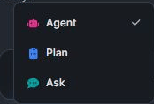

# Deep Dive on ABP AI Agent #1: Agent, Plan and Ask Modes

There is a small question I like to answer before I type anything into **ABP Agent**:

**Do I want an answer, a plan, or action?**

That question looks simple, but it changes the whole experience. Sometimes I am only trying to understand why a module is structured a certain way. Sometimes I already know the direction, but I want the implementation path checked before touching files. And sometimes the task is clear enough that I want ABP Agent to do the work, run the checks, and iterate with me.

That is where the three modes in ABP Studio AI become more than labels. They help me choose the right level of trust, risk, and action for the moment.

## Ask Mode: When I Want To Understand

**Ask** is the mode I reach for when I want to stay in learning mode.

It is useful when I am reading a solution and want to ask questions like:

* What is this module responsible for?
* Why is this permission checked here?
* How does this application service relate to the domain layer?
* What would happen if I changed this setting, dependency, or flow?
* Which ABP concept should I use for this requirement?

The important part is that Ask mode is read-only. I can explore the codebase, ABP concepts, architecture, or possible approaches without worrying that files will be changed as a side effect of the conversation.

That makes it a comfortable starting point. I do not need to prepare a perfect prompt. I can ask a rough question, follow up with more context, and slowly turn uncertainty into something clearer.

For me, Ask mode is especially helpful when I join a solution after some time away. Instead of jumping between files and trying to rebuild the story manually, I can ask ABP Agent to explain the shape of the solution in the language of ABP: modules, layers, permissions, application services, entities, settings, events, and runtime pieces.

## Plan Mode: When I Want To Think Before Changing Code

**Plan** is the mode I use when the next step is probably implementation, but I do not want to start editing yet.

This is the middle ground between a conversation and a code change. ABP Agent can inspect the solution in a read-only way, ask clarifying questions when the requirement is not clear enough, and produce a structured plan before any file is modified.

That changes the feeling of working with AI. Instead of saying "go build this" and reviewing only the result, I can review the approach first:

* Which files will likely be affected?
* Which ABP layers are involved?
* Does the implementation path match the existing solution style?
* Are there missing decisions before the work starts?
* Is this a small change, or is it actually a larger workflow?

This is useful for changes that cross boundaries: adding a new entity, adjusting an application service, introducing a permission, changing a UI flow, or touching more than one module. Those are exactly the moments where I want a second pass before code starts moving.

When a plan is active, ABP Studio gives me clear actions around it. I can view the plan, detach it if it is no longer the right direction, or apply it with Agent mode when I am ready to move from planning to implementation.

The small detail I like here is that the plan does not disappear into the chat history. It becomes something I can review and intentionally carry into the next step.

## Agent Mode: When I Am Ready For Action

**Agent** is the mode I choose when I am ready to let ABP Agent work on the solution.

This is the action mode. ABP Agent can edit files, run commands, build projects, use ABP Studio tasks, and iterate when something fails. It is the right choice when the task is clear enough and I am comfortable letting the agent make changes that I will review afterward.

For small trusted tasks, I may go directly to Agent mode:

* Add a missing localization entry
* Fix a straightforward build error
* Update a simple DTO mapping
* Add a validation rule that matches an existing pattern
* Apply a plan that I have already reviewed

For larger work, I prefer not to start here. Agent mode is powerful, and power is better when it is intentional. If I am not sure about the shape of the change, I usually start with Ask or Plan first.

## A Practical Workflow

The modes are most useful when I treat them as a workflow, not as three disconnected buttons.

For larger changes, my usual flow is:

1. **Ask** to understand the area and the existing conventions.
2. **Plan** to turn the requirement into a reviewable implementation path.
3. **Agent** to apply the plan, build, and iterate.

For learning, I often stay entirely in Ask mode. If I am trying to understand ABP multi-tenancy behavior, module dependencies, permission definitions, or why a solution is organized a certain way, there is no need to involve file changes.

For small tasks, I may go directly to Agent mode. The key is that I already know what I want, the risk is low, and the expected result is easy to review.

Here is the simple rule I keep in mind:

| Situation | Mode I Choose | Why |
| --- | --- | --- |
| I need an explanation | Ask | It keeps the conversation read-only. |
| I need a direction before implementation | Plan | It gives me a reviewable path before changes. |
| I am ready for ABP Agent to work | Agent | It can edit, build, run tasks, and iterate. |

## Why This Matters

AI-assisted development can feel too fast when the tool moves from idea to code before I have decided what kind of help I actually need.

The three modes slow that moment down in a good way. They let me say:

* "Just explain this."
* "Think through the change first."
* "Now implement it."

That separation makes the work feel more intentional. It also makes the output easier to review, because the mode already tells me what kind of result I should expect.

Ask gives me understanding. Plan gives me a path. Agent gives me action.

Used together, they make ABP Studio AI feel less like a single big button and more like a development partner that can adapt to the level of confidence I have at each step.
