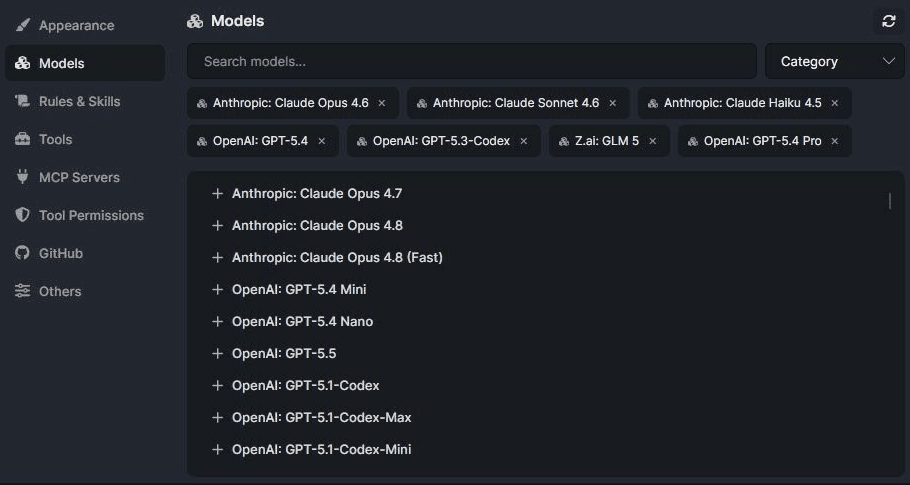
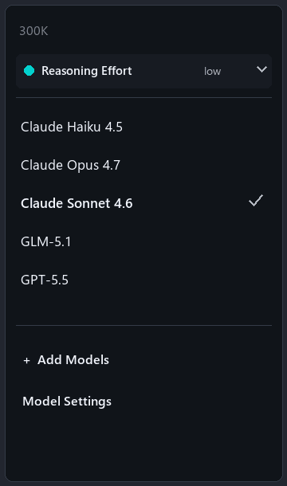
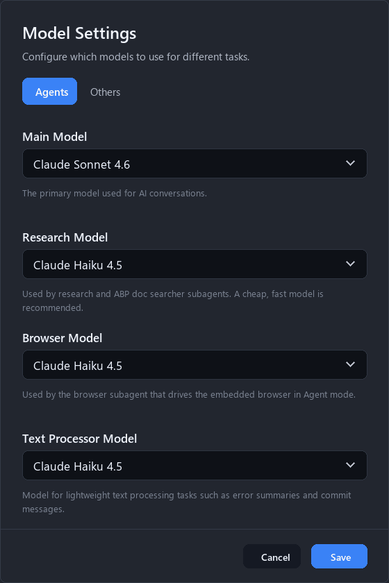
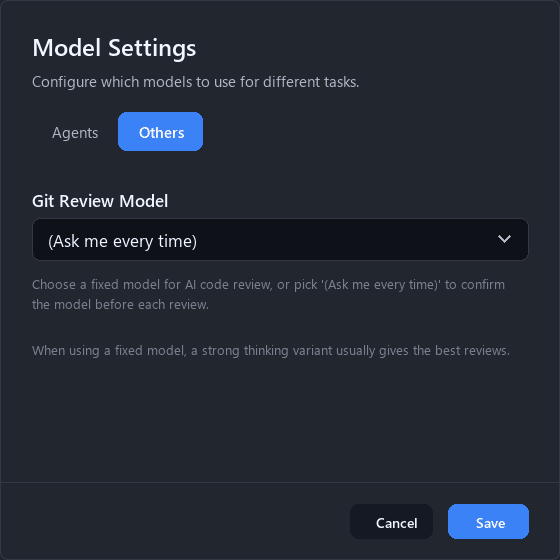

# Deep Dive on ABP AI Agent #2: Supported AI Models in ABP Studio + Usage Recommendations

There is one question I ask almost as often as "Which mode should I use?":

**Which model should do this work?**

At first, it is tempting to answer that question by always choosing the strongest model in the list. That feels safe. If a model is more capable, why not use it for everything?

In real work, I do not think about it that way.

When I use **ABP Studio AI**, the model choice is part of the workflow. Some tasks need careful reasoning. Some need speed. Some need a large context window. Some need image support because the browser or a screenshot is involved. Some are small text-processing tasks where using the most capable model would only make the work slower and more expensive.

So I treat model selection as a practical decision, not a trophy selection.

## What ABP Studio Supports Today

ABP Studio gives me a curated model setup by default. It keeps the first experience simple, while still letting me choose from a broader model catalog when I want to tune the setup for a specific kind of work.

The important word here is **focused**.

ABP Studio does not treat every model as an equally good choice for agent work. A coding agent needs things like a useful context window, tool support, text output, and reliable behavior in repeated agent loops. Studio keeps the model experience closer to that reality.

The built-in model set currently includes:

| Model | How I think about it |
| --- | --- |
| Claude Sonnet 4.6 | The default main model for day-to-day Ask, Plan, and Agent work. |
| Claude Haiku 4.5 | A fast supporting model for research, browser work, and lightweight text processing. |
| Claude Opus 4.7 | A stronger option when the task needs deeper reasoning or more careful review. |
| GPT-5.5 | Another strong option for main conversations or review-style work. |
| GLM-5.1 | A text/code option for tasks that do not need image input. |

I do not read this list as a ranking. I read it as the default toolbox.

And it is not a closed box. If I need a different model for a specific task, I can open the Models settings, search the catalog, filter by category, and add more models to my selection.

That is an important distinction. The built-in models are there so I can start with sensible defaults. They are not there to force every team, every solution, or every workflow into the same model choices.

## The Main Model

The main model is the one I feel most directly in the conversation.

It is used when I ask questions, create plans, or let ABP Agent work through an implementation. This is the model behind the normal flow of the chat.

For most work, I keep a balanced model as the main model. A Sonnet-style model is a good default because it is capable enough for real development tasks without making every small question feel heavy.

This is the model I use for:

* Understanding a module or package
* Planning a feature before editing code
* Applying a reviewed plan
* Fixing ordinary build or test failures
* Making changes where the expected result is easy to review

When the task gets broader, I become more intentional.

If I am asking ABP Agent to reason across several modules, plan a risky refactor, review architecture, or inspect a subtle regression, I am more willing to switch to a stronger model. The extra capability is useful when the cost of a shallow answer is high.

For a quick localization change or a small DTO update, that same choice can be wasteful. The strongest model is not always the best model for the moment.

## Role-Based Models

One detail I like in ABP Studio AI is that model selection is not only one global dropdown.

Studio separates the main conversation model from supporting model roles. That means I can keep the main model strong enough for the conversation while using lighter models for background work.

The roles are easier to understand if I describe them by how they feel in daily use.

**Main Model** is the model I am actively talking to. It carries the normal Ask, Plan, and Agent experience.

**Research Model** is for research and ABP documentation searcher work. I usually keep this lightweight because research often involves gathering, narrowing, and summarizing context before the main model decides what to do with it.

**Browser Model** is used by the browser subagent in Agent mode. This role should stay fast and practical. When browser screenshots are involved, I choose a model that supports image input. A text-only model may be fine for code, but it is not the right fit when the work depends on seeing the UI.

**Text Processor Model** is for smaller language tasks such as summarizing errors, generating commit messages, or consolidating learned lessons. This is exactly where I do not want to spend the most capable model every time.

The Git Review model is separate too.

For AI Review, I like the "Ask me every time" behavior. Some reviews are routine. Some reviews deserve a stronger model because the change is large, security-sensitive, or touches architecture. Asking each time keeps that decision close to the actual change.

If a team wants consistent review behavior, a fixed review model also makes sense. The key is that Git Review does not have to silently follow the same model I use for ordinary chat.

## How I Choose In Practice

For quick questions, I use the default main model.

If I am asking "Where is this permission defined?" or "Why does this module reference that package?", I do not need to overthink the model. I want a clear answer and maybe a few source references.

For planning larger work, I use a stronger main model when the decision matters.

Plan mode is where the model can save me from an expensive wrong turn. If the change crosses layers, modules, permissions, UI, or database behavior, I prefer a model that can hold more context and reason carefully. I still narrow the scope where possible, because a focused prompt usually beats a huge unfocused one.

For implementation, I care about reliability more than raw size.

Agent mode is not only about generating code. It is about reading the solution, editing files, running checks, seeing failures, and trying again. A good main model should follow instructions consistently and use tools well. For supporting roles, I usually keep the lighter defaults.

For UI and browser tasks, I check image support.

If the task involves screenshots, browser interaction, visual verification, or UI state, the browser model needs to be able to understand images. This is one reason I do not treat every text/code model as interchangeable.

For reviews, I choose based on risk.

A small formatting or localization change does not need the same review setup as a large change in authorization, multi-tenancy, persistence, or distributed behavior. For deeper reviews, I am willing to use a stronger model because the goal is not speed. The goal is to catch what I missed.

For cost and latency, I avoid using the strongest model everywhere.

This is not only about credits. It is also about pace. If every background task uses a heavy model, the development loop feels slower. Keeping lightweight models for lightweight jobs makes ABP Studio AI feel more responsive.

## A Simple Rule

The model name matters less than the job.

When I choose a model in ABP Studio AI, I usually ask:

| Situation | Model choice I prefer |
| --- | --- |
| Normal Ask, Plan, or Agent work | Balanced main model |
| Broad planning or risky implementation | Stronger main model |
| Research and documentation lookup | Lightweight supporting model |
| Browser tasks with screenshots | Vision-capable browser model |
| Error summaries and commit messages | Lightweight text processor model |
| Important AI Review | Stronger model or ask each time |

That keeps the experience practical.

Modes decide how much action I want: Ask, Plan, or Agent.

Models decide which brain should handle the work.

When those two choices are made intentionally, ABP Studio AI feels less like one generic AI button and more like a set of tools I can tune for the task in front of me.
