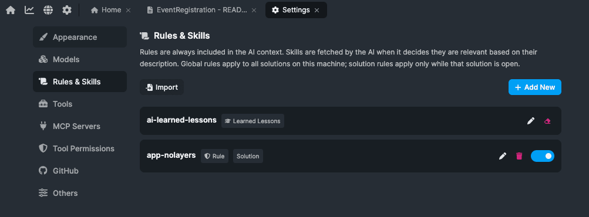
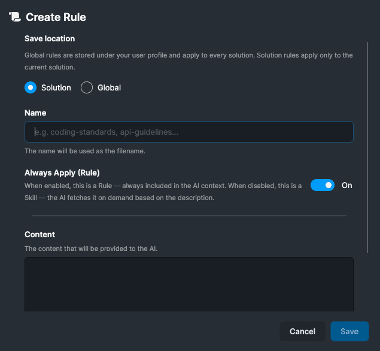
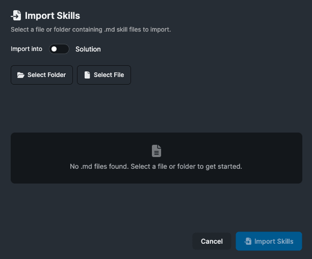

# Deep Dive on ABP AI Agent #3: Rules, Skills and Lessons

Every new chat starts from zero.

The model can write the API, the permissions, and the UI. What disappears between sessions is everything specific to *this* solution: your naming rules, your feature checklist, the demo-data fix from yesterday. You end up re-teaching before you start building.

That is not an intelligence problem. The model is already capable enough. What does not carry over is the setup around it.

## Agent, Model, and Harness

Three terms get mixed up constantly. Keeping them separate makes everything else in this article click.

**The model** is the LLM: the weights, the training data, the reasoning engine. You do not get to change it. You pick which one to use, and that is about it.

**The harness** is everything wrapped around the model so it can actually finish work in *your* environment: the system prompt, the tools it can call, the files it may read, the checks that run on its output, the limits on what it may touch, and the instructions injected into every session. A raw model is not an agent. An agent is the model plus the harness. If you are not the model, you are building the harness.

**The agent** is the whole system: model plus harness, running in a loop until the task is done. The behaviour you experience is dominated by the harness, not just the model. [Addy Osmani](https://addyosmani.com/blog/agent-harness-engineering/) puts the same idea plainly: *a decent model with a great harness beats a great model with a bad harness.* The gap between what today's models can do and what you actually see them do in your codebase is mostly a harness gap.

The habit that makes a harness good is simple: treat every mistake as a reason to update the setup, not just to fix the output in chat. Each time the agent gets something wrong, change what it always knows, can look up, or carries forward so it cannot repeat the same error. Do that consistently and the agent stops repeating mistakes and starts working the way your team works.

In **ABP Studio AI Coding Agent**, the harness includes three pieces that hold what the agent knows about your solution: **Rules**, **Skills**, and **Lessons**. They live under **Settings > Rules & Skills**.



## Rules: The House Rules On The Wall

A **Rule** is a standing instruction that the harness injects into the agent's context on every turn of every session. In harness-engineering terms, it is always-on context injection: the same role as an `AGENTS.md` or `CLAUDE.md` at the root of a repo, except scoped to your solution or your profile inside ABP Studio.

Think of the house rules pinned to a kitchen wall: how we do things here, every shift, no exceptions. Unlike a glance at a poster, though, a Rule is not ambient background. It is read on every turn, so it costs context budget every time the agent acts.

ABP Agent already follows the framework's own conventions by default. It goes through the data layer instead of hitting the database directly, uses the built-in permission system instead of hand-rolled checks, and reads user-facing text from the translation files instead of hardcoding it. You do not write those down.

Rules are where *your* conventions go. The ones the framework cannot guess because they belong to your solution and your team. The good part is that these read like plain conventions any developer would recognize, not framework trivia:

* New code goes in the same place, with the same naming, as the code already around it.
* Every endpoint that changes data checks permissions before it does anything.
* Money is stored in minor units (cents), never as a floating-point number.
* API errors use our standard response shape, never ad-hoc JSON.

With those on the wall, I stop repeating them. Instead of writing this:

```text
Add a Category screen. Use our data layer, do not query the database
directly. Check permissions on every write. Keep money in cents. Put the
files where the other features live.
```

I can write this:

```text
Add a Category screen.
```

The conventions are not renegotiated, one prompt at a time, in every session. The agent applies them the way a teammate who has read the contributor guide would.

This matters more than it looks. A model with no standing rules does not stay neutral. It falls back on the defaults from its training data. Ask a generic model for "an endpoint that returns categories" and you often get one with the database query written straight into the handler, because that is the most common shape on the public internet. Rules steer the agent's output back toward *your* codebase.

One caution: treat the rule list like a pilot's checklist, not a style guide. A Rule is injected on every turn, so keep the list short. Every line should earn its place, ideally traceable to a real failure or a hard constraint you cannot ignore. If a line does not change what the agent produces, it is noise, and it dilutes the rules that actually matter.

You also choose where a rule is saved. Global rules sit under your user profile and apply to every solution on your machine. Solution rules apply only to the current solution, and only while it is open.

## Skills: Recipes You Pull Off The Shelf

A **Skill** is the same kind of note as a Rule, but loaded only when the task calls for it. The harness keeps a short description of each skill in context at all times; the agent reads the full text only when that description matches what you asked it to do. Harness engineers call this **progressive disclosure**: reveal instructions and detail only when they are needed, instead of stuffing everything into the opening prompt.

A recipe is not pinned to the wall. It sits in a drawer, and the cook pulls it out only when making that dish. That is a Skill.

In ABP Studio, a rule and a skill are the same kind of note with one switch between them.



You write a name (which becomes the file name) and some content, then set **Always Apply**. Turn it on and the note is a Rule, always in context. Turn it off and the note is a Skill, fetched on demand. So if a skill turns out to be something the agent should never skip, you flip one switch and it becomes a rule.

My favorite example of a skill is a "build a feature end to end" checklist: the ordered steps your team follows to ship one complete feature. The data model comes first, then the data access layer, then the application service, then the API, then the translations, then the UI, and finally the demo data. Write it once, and the agent follows it whenever it builds a feature, instead of inventing its own order each time.

Writing a skill is like writing an onboarding note for a new teammate. You are not making them smarter. You are saving them the week it would take to work out how your team does this one thing.

A skill can be long without slowing anything down. The agent sees only the short description of each skill at all times, and reads the full text only when the description matches the task. The detail stays in the drawer until it is needed.

Skills are also portable. A skill is plain Markdown, so you can import one written elsewhere instead of retyping it.



You point the importer at a file or a folder of `.md` files and choose whether they go into the current solution or your global profile. A procedure one person worked out can travel to the rest of the team, or to your next solution.

A simple test for which one to reach for:

* If it should hold no matter what you are doing, it is a **Rule**. ("Always return errors in our standard shape.")
* If it is a procedure you follow only for a certain kind of task, it is a **Skill**. ("Here is our checklist for adding a feature end to end.")

## Lessons: What The Agent Learns On Its Own

Rules and Skills are written by a person. **Lessons** are written by the agent.

Think of a shift handoff log in the kitchen: after something goes wrong, someone writes down what happened and what to do differently next time. The next cook reads it before repeating the same work. In ABP Studio, you correct the mistake; the agent records the verified fix so future sessions do not trip over it again. That entry is a Lesson.

When the agent gets something wrong and is corrected, by you, by a failing build, or by the official ABP documentation, it can record the correction as a short, verified note. The harness carries that note into later turns and later sessions as high-priority context. That is the `ai-learned-lessons` entry you saw in the settings list, growing as the agent works in your solution.

The idea behind it is simple: when the agent gets something wrong, fix it once so it never gets it wrong the same way again. You already do a version of this when you edit a notes file by hand. Lessons do the recording for you, at the moment of the correction, when the reason is still fresh and you would otherwise forget to write it down.

Here is the shape of a real one. I ask the agent to add a `Category` screen. It builds the data model, the API, and the UI, but forgets to grant the new permission in the demo data. The screen compiles, the API responds, everything looks finished, and the only symptom is that real users get "access denied." I correct it, the agent fixes the demo data, and it records a note: in this solution, a new permission is not done until it is granted in the demo data. Next time, it remembers.

A Lesson is not a general fact about ABP. The documentation already covers that, and the agent reads it. A Lesson is a solution-specific, verified correction: the kind of knowledge a team usually keeps in people's heads and loses when they move on. Here it is written down the moment it is learned, instead of weeks later, if ever.

## When To Use Which?

Once the three are clear, they sort themselves out:

| Mechanism | Who writes it | When it loads | Answers |
| --- | --- | --- | --- |
| **Rules** | You | Always, every turn | "What must always be true here?" |
| **Skills** | You | When relevant to the task | "How do we do this kind of task?" |
| **Lessons** | The agent | In later sessions, as high-priority context | "What did we get wrong before in this solution?" |

They feed into each other. A Lesson that keeps coming back is a sign it should be promoted. If the agent records the same correction again and again, it is no longer a one-off note. It belongs in a Rule, if it is an always-true convention, or in a Skill, if it is a procedure. Knowledge tends to move from Lessons toward Rules and Skills: the agent finds the pattern by tripping over it, and you write it down properly once it has earned the spot.

Keep an eye on the budget, because all three share the same limited space, the context window. Rules cost the most, since they are always present, so an overstuffed rule list weighs down every turn and crowds out the rules that matter. Skills are cheaper, paid for only when used, which is a good reason to move anything situational out of Rules and into a Skill. Lessons add up too, so clear out the stale ones now and then. The point is not to write down everything you know. It is to write down the few things that change what the agent produces, and put each one where it loads at the right time.

## Why This Is Different From Generic Coding Agents?

To be fair, the ideas themselves are not unique to ABP. Tools like Cursor, Claude Code, Codex, and Windsurf are strong general-purpose coding tools, and they already have always-on instruction files and on-demand skill files. If all you compare is whether a tool can hold rules and skills, there is no real difference, and I would not pretend otherwise.

The difference is in the two places where a generic tool has to guess.

The first is memory of its own mistakes. In most tools, remembering a past mistake means you stop and edit a memory file by hand. Lessons remove that step. The agent records the correction itself, the moment it happens, so the knowledge survives without you having to maintain it.

The second, and the one that matters most, is what all of this sits on. A generic instruction file can say "use the data layer," but the tool still has to read your files and guess what the data layer is and where it lives. ABP Agent does not guess. It starts every session with an ABP-aware map of your solution, and when it is unsure how something should be done, it checks the official ABP documentation instead of the average of the public internet. So the rules and skills you write are not hints dropped into a tool that barely understands the project. They are backed by one that already knows the framework underneath them.

There is also a smaller convenience worth a line: a rule and a skill are the same note with one switch between them, scoped to the solution or your profile from the same place, instead of two separate file formats to keep track of.

## Conclusion

It is best to see the three as one system, not three switches.

* **Rules** hold the conventions you refuse to repeat.
* **Skills** hold the procedures you want to reuse.
* **Lessons** hold the corrections the agent learns as it works.

Together they answer the blank-memory problem. They do not give the model new weights. They inject, at the start of each session, the smallest useful set of instructions so the agent can work as if it has been here before.

A generic agent with no harness tuning stays roughly as capable on its thousandth task in your codebase as on its first. With Rules, Skills, and Lessons, ABP Agent accumulates solution-specific knowledge over time, especially through Lessons and the promotions you make from them.

That is the real value: **not just an AI that writes code, but one that learns how your solution is built and keeps that knowledge from one session to the next.**
