# Deep Dive on ABP AI Agent #4: Integrated ABP Studio Tools

When I use an AI coding agent, there is a point where plain code awareness is not enough.

The agent may understand the project structure. It may read the failing method. It may even guess the most likely cause of an error. But in a real development session, I usually need more than a guess. I need the latest exception, the request that caused it, the logs around it, the application that is running, the containers it depends on, the tasks I can execute, and the build result after a fix.

That is where **ABP AI Coding Agent** becomes different from a generic coding assistant. It is not only connected to files. It is connected to **ABP Studio**.

ABP Studio already knows the solution, run profiles, runnable applications, containers, tasks, monitoring data, and build actions. ABP AI Coding Agent can use that context through integrated tools when those tools are enabled. So instead of copying exception details, terminal output, container names, or build logs into the chat manually, I can let the agent work with the same ABP Studio environment I am using.

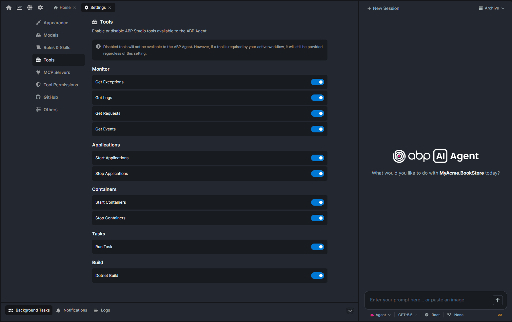

> **Note:** ABP AI Coding Agent is available directly to ABP license holders. License holders have predefined credits so they can try it without setting up a separate AI workflow first. When those credits run out, they can buy more and continue using the same integrated experience.

## Why Integrated Tools Matter

Most coding agents start from the same place: **source code**.

That is useful, but ABP development is not only source code. A running ABP solution has applications, modules, services, containers, database connections, migrations, logs, exceptions, requests, tasks, and build steps. When these pieces are outside the agent's reach, the developer becomes the bridge:

* Copy this exception.
* Paste that log.
* Run this build.
* Check that container.
* Explain which application is currently running.
* Tell the agent what failed after the last change.

Integrated ABP Studio tools reduce that manual work. They let the agent ask ABP Studio for runtime and solution information directly, within the permission boundary I choose.

The important detail is that this access is still explicit. Tools can be enabled or disabled. If I do not want the agent to use a tool, I can keep it disabled. If I want the agent to troubleshoot with runtime information, I can enable the relevant tools and ask for a more complete investigation.

That gives me a practical balance: the productivity of automation, with a visible boundary around what the agent can use.

## Tool Access: What The Agent Is Allowed To Use

The tools view is the control point.

This is where ABP Studio shows the integrated tools that can be used by ABP AI Coding Agent. Some tools are for reading runtime information. Some are for interacting with applications. Some are for containers, tasks, or build actions.

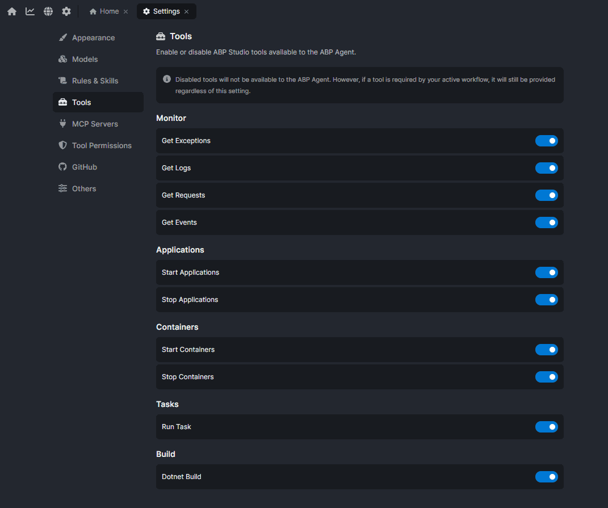

> The names are intentionally direct. A monitoring tool that gets exceptions is about exceptions. A build tool is about build validation. A task tool is about ABP Studio tasks. That makes the tool list easy to understand even before using it in a real prompt.

For me, the key idea is not the individual button names. It is the permission model:

* If a tool is disabled, the agent should not act as if it has that information.
* If a tool is enabled, the agent can use it as part of the current session.
* If a task needs runtime evidence, I can enable only the tools needed for that task.

This makes ABP AI Coding Agent feel more intentional than a black box. I can decide when it should stay in code reasoning and when it should use ABP Studio's runtime view of the solution.

## Monitoring Tools

Monitoring tools are the first group I reach for when something fails at runtime.

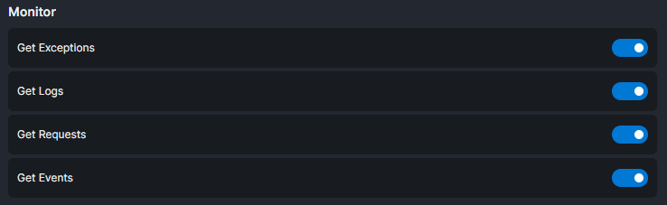

These tools help the agent inspect what happened while the application was running. In practice, this means information like **exceptions**, **logs**, **events**, and **request details**.

This is a big difference from a generic coding agent. Without monitoring tools, the agent can read the code and make a reasonable guess. With monitoring tools, it can work from the actual failure.

For example, if a page throws an exception, I can ask:

```text
Get the latest exception from ABP Studio Monitoring and explain what failed.
```

If the exception tool is enabled, the agent can use that runtime signal. It can look at the exception message, stack trace, request context, and related code. Then it can connect the runtime failure to the implementation.

That changes the debugging loop:

1. Trigger the problem.
2. Ask the agent to inspect the runtime evidence.
3. Let it find the related code.
4. Apply the fix.
5. Validate again.

The developer no longer needs to manually copy the exception from one place and paste it into another. ABP Studio becomes part of the agent's working context and give it ***harness***!

## Application Tools

Application tools connect the agent to the applications defined in the active ABP Studio run profile.

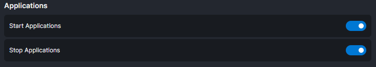

This matters because ABP solutions often contain more than one runnable application. A layered solution may have a web application, an API host, a DbMigrator, and other executable projects. A microservice solution may have several services with different roles.

ABP Studio already understands these applications through the solution and run profile. When application tools are available, the agent does not need to rediscover everything from file names or ask me which project is running. It can use ABP Studio's view of the solution.

That is useful for prompts like:

```text
Check which application is running and use the relevant runtime information to investigate the problem.
```

The benefit is not only convenience. It also reduces mistakes. The agent can reason from the same run profile that I use in ABP Studio, instead of guessing from the repository structure alone.

## Container Tools

Many ABP applications depend on infrastructure services while running locally.

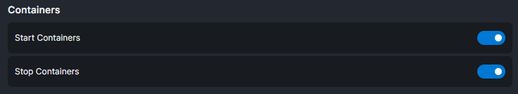

A solution may need SQL Server, PostgreSQL, Redis, RabbitMQ, OpenIddict-related services, or other containers depending on the template and modules. When something fails, the cause is not always in application code. Sometimes a required container is not running. Sometimes the application cannot reach a dependency. Sometimes the runtime error is only a symptom of an infrastructure problem.

Container tools give the agent a way to include that part of the environment in the investigation.

Instead of asking the agent to guess why a database connection fails, I can let it check the container context that ABP Studio already has. The agent can then distinguish between:

* a code problem,
* a configuration problem,
* a missing or stopped container,
* or a dependency that is running but unhealthy.

This is one of the places where ABP Studio integration is especially valuable. General coding agents can help with Docker files or connection strings, but they usually do not know the current ABP Studio container state unless I copy it into the prompt. ABP AI Coding Agent can work closer to the actual local development environment.

## Task Tools

ABP Studio tasks are another part of the development workflow that should not live outside the agent.

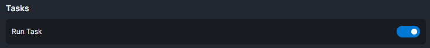

Tasks can represent common solution actions. They may run commands, scripts, or workflow steps that are already configured for the solution. If the team uses ABP Studio tasks to standardize local development, the agent should be able to understand and use that same layer.

That means I can ask for a workflow instead of a raw command:

```text
Use the available ABP Studio tasks to validate this change.
```

The agent can work with the task names and outputs rather than asking me to remember the exact command. This is helpful in larger solutions where the correct validation step is not obvious from a single project file.

It also keeps the agent aligned with the team's development path. If ABP Studio has the task, the agent can follow that path instead of inventing a one-off command.

## Build Tools

Build tools close the loop after an implementation or fix.

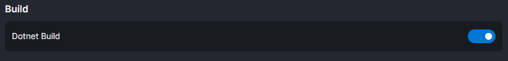

The agent should not only change files. It should also help verify that the change still builds.

In a generic coding agent flow, validation often depends on shell access and manually chosen commands. That can work, but it leaves more room for guessing. Which project should be built? Which solution file should be used? Is there an ABP Studio-specific build action already configured?

With ABP Studio build tools, the agent can use the build context exposed by the platform. That makes prompts like this more natural:

```text
Apply the fix and run the available build validation.
```

For small changes, this may simply confirm that the project compiles. For larger changes, it can become part of a broader loop with tasks, application checks, and monitoring tools.

The important part is that the agent can move from implementation to validation without requiring me to manually transfer output between tools.

## A Practical Tool Access Walkthrough

Let me make this more concrete with a small debugging scenario.

In the sample application, I deliberately added a runtime exception to the `UpdateAsync` method of `BookAppService.cs`:

```csharp
throw new Exception("Sample exception for demonstrating integrated tools!");
```

Then I started the application from ABP Studio and triggered the related request from the browser. The only purpose of this setup is to create a real runtime failure that ABP Studio Monitoring can capture.

The interesting part is not the exception itself. The interesting part is how the agent behaves when the monitoring tool is disabled, and how that changes when the tool is enabled.

### First, Without The Exception Tool

For the first run, I kept the monitoring tool that retrieves exceptions disabled.

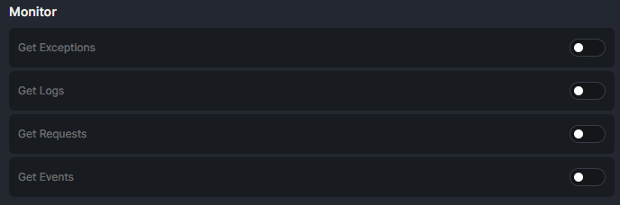

Then I asked:

```text
Can you get the latest exception from ABP Studio Monitoring and explain what failed?
```

At this point, the agent did not have direct access to the exception tool. So it tried to reason around the problem in other ways. It looked for available information, tried to inspect logs from files, and checked the codebase to understand what might be happening.

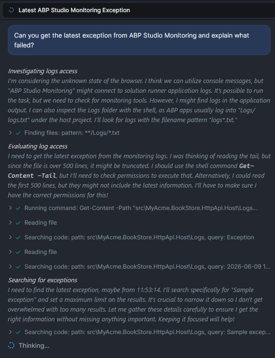

That is still useful in some cases, but it is not the best debugging flow. The agent is spending time and context trying to reconstruct a runtime failure indirectly. It may eventually find the suspicious code, but it is working from weaker evidence.

This is exactly why tool access matters. Without the monitoring tool, the agent can reason from files. With the monitoring tool, it can inspect the actual runtime failure.

### Then, With The Exception Tool Enabled

For the second run, I enabled the monitoring tool that can retrieve exceptions, such as `get_exceptions`.

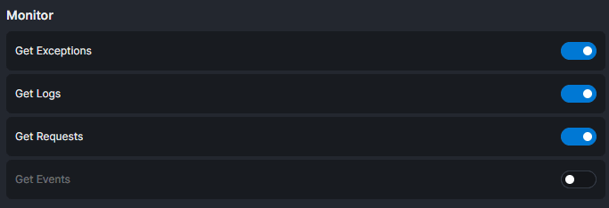

Then I asked:

```text
Now the get_exceptions tool is enabled. Please get the latest exception from ABP Studio Monitoring, identify the failing code path, and suggest the smallest fix.
```

This time, the behavior was very different. The agent directly used the integrated exception tool, retrieved the exception details from ABP Studio Monitoring, and connected the runtime error to the failing code path.

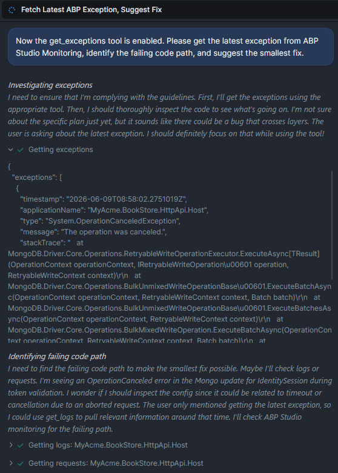

It also used the enabled logging tool to verify the surrounding context instead of guessing from the source code alone.

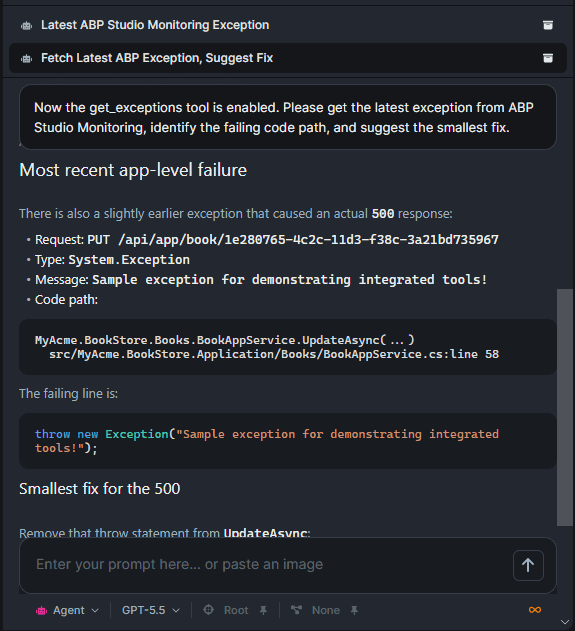

That is the workflow I want from an integrated coding agent. It does not only say "this code looks suspicious." It checks the exception, follows the evidence, finds the source of the problem, and proposes the smallest fix.

It is also faster and more efficient. The agent does not need to spend as many tokens searching for indirect clues because ABP Studio can provide the runtime signal directly.

### Adding Logs And Requests

After that, I asked the agent to use the available monitoring tools together:

```text
Use the available monitoring tools to check the related logs and recent requests for this failure. Tell me whether they confirm the same root cause.
```

At this point, the agent used the enabled tools for exceptions, requests, and logs.

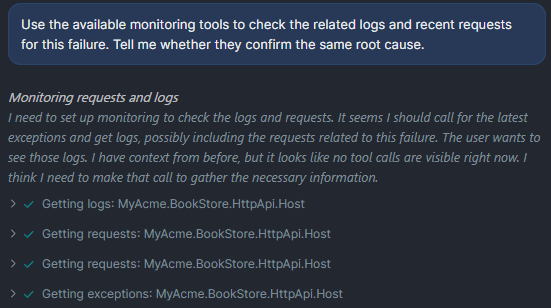

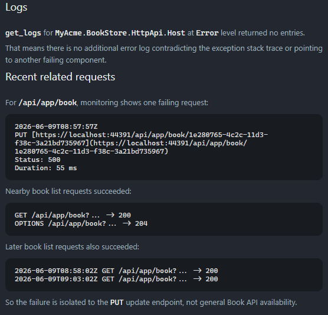

This is where the ABP Studio integration becomes even more valuable. A runtime problem is rarely just one line of code. There is usually a request, a log entry, an exception, and a running application context around it.

When these tools are available together, the agent can correlate them. It can say, "this request caused this exception, the logs confirm it, and this code path is responsible."

That is much better than asking the developer to copy each piece manually into the chat.

### Validating The Fix

Finally, I asked the agent to validate the result:

```text
Run the available build or application validation tools and confirm that the problem is fixed.
```

The agent used ABP Studio tools to stop the application, build it, and run it again.

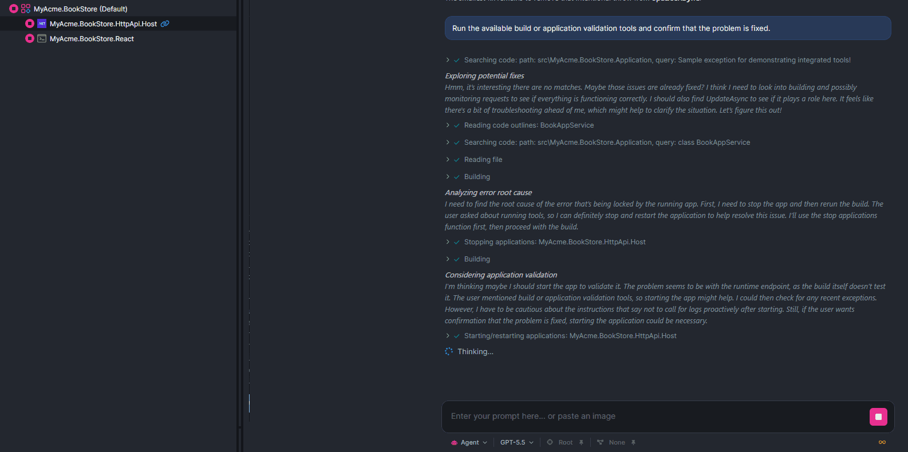

This completes the loop. The agent did not only identify the problem. It used the integrated tools to move through the full flow:

1. Read the runtime exception.
2. Correlate it with logs and requests.
3. Find the failing code path.
4. Apply or suggest the focused fix.
5. Validate the application again.

That is the difference I want to highlight in this article. ABP AI Coding Agent is not only a model that can edit files. When ABP Studio tools are enabled, it can participate in the same development workflow I use: observing the running application, understanding the failure, fixing the code, and validating the result.

## Why This Is Different From Generic Coding Agents

Tools like Cursor, Claude Code, and Codex are powerful. They can read code, edit files, run commands, and help with many software projects.

**ABP AI Coding Agent has a different advantage: it is built for the ABP development experience.**

It is aware of ABP concepts, ABP solution structure, ABP Studio run profiles, application metadata, containers, monitoring, tasks, and build actions. It is also backed by the ABP Platform: ABP Framework, ABP Commercial, ABP Suite, ABP Studio, and the workflows that connect them.

That platform context matters. When I am building an ABP solution, I do not only want a model that can write C# or TypeScript. I want an assistant that understands the way ABP applications are structured and the way ABP Studio runs them.

**That makes the starting point simple:** _open the ABP solution, use ABP Studio, [choose the right mode](https://abp.io/community/articles/deep-dive-on-abp-ai-agent-1-agent-plan-and-ask-modes-62wteg9t), enable the tools needed for the task, and work with the agent inside the platform._

## Conclusion

Integrated tools make ABP AI Coding Agent more than a chat window next to the code. They give it a controlled way to work with the same ABP Studio context I already use: **applications**, **containers**, **monitoring**, **tasks**, and **build actions**. 

-> **That helps the agent move from "I think this might be the problem" to "I checked the runtime evidence, found the related code, applied the fix, and validated it."**

That is the real value of this part of ABP Studio AI. It brings the coding agent closer to the full development experience, from understanding the solution to running it, observing it, fixing it, and checking the result.

As ABP Studio evolves, more tools can be added to this workflow. That means the agent can become more useful over time without changing the basic idea: _ABP AI Coding Agent works best when it is not isolated from the platform, but integrated into it._
