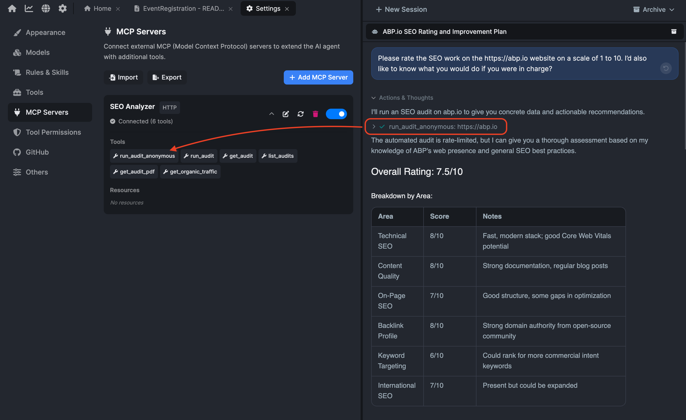

# Deep Dive on ABP AI Agent #5: MCP (Model Context Protocol)

By now the agent in ABP Studio can already do a lot on its own. It reads and edits your solution, builds packages, adds migrations, generates proxies, starts and stops applications and containers, runs your Studio tasks, and checks the runtime monitor when something fails. Those are its built-in tools, and for everyday ABP work they cover most of what you need.

But sometimes the thing you need is not in the solution at all.

Maybe the task starts with a ticket in your issue tracker. Maybe the answer lives in a database that is not part of this repository. Maybe your team keeps its real knowledge in a wiki, or you want the agent to reach a service that has nothing to do with ABP. The agent cannot help with any of that on its own, because none of it lives in your solution.

That gap is what **MCP** is for.

## What MCP Actually Is

MCP, short for Model Context Protocol, is an open standard for connecting external tools and data to an AI agent. Instead of every tool inventing its own way to talk to every agent, they all agree on one shape. A program that follows the standard is called an **MCP server**, and any agent that speaks the standard can use it.

Think of it like a standard socket. Once a tool exposes itself over MCP, it can plug into the agent without custom wiring on either side.

There is a simple way to place MCP next to the agent's other settings. Rules, skills, and lessons shape what the agent *knows*. MCP shapes what it can *reach*. It does not hand the agent more instructions. It hands it more equipment, the tools and ingredients of systems it could not touch before.

## When You Actually Need It

Most of the time you will not reach for MCP, and that is fine. The agent already has first-class tools for ABP work, so MCP is for the cases where the task touches something those tools do not cover.

A few examples where it earns its place:

* The work starts from a ticket, and you want the agent to read it directly instead of you pasting it in.
* You need data from an external system to make a change correctly.
* Your team's domain knowledge lives in a service the agent would otherwise have no way to read.

When a server is connected, using it is just part of the prompt. You do not call the tool by hand:

```text
Read issue #482 from our tracker, then implement the fix in the Catalog module.
```

The agent reads the ticket through the MCP server, then finishes the work with its normal ABP tools.

## Setting Up An MCP Server

MCP servers are configured under **Settings > MCP Servers**. With nothing connected yet, the page is empty and waiting for a first server.


A server can connect in one of two ways:

* **Stdio**: Studio runs the server as a local process. You give it a command, its arguments, and any environment variables it needs.
* **HTTP**: Studio talks to the server over the network. You give it a URL and any headers it needs.


If you already use MCP in another tool, you do not have to start from scratch. Studio can import server configuration from Cursor, Claude, VS Code, Windsurf, or a plain MCP server JSON file, and it can export your configuration in the standard `mcpServers` JSON shape. The same server you set up once can move between tools.

## What You Can See And Turn Off

Once a server is connected, the settings page shows its connection status, how many tools it exposes, the tools themselves, and any resources it provides. You can open a resource to inspect it.



You also control the surface. Individual tools can be disabled, and a disabled tool is simply not offered to the agent. That matters, because a server might expose ten tools when you only want the agent to use two.

There is a reason to keep this tidy beyond safety. Every tool you leave on is part of the menu the agent has to weigh on each turn, and a short, focused menu is easier to choose from than a long one. Turning off what you do not need keeps the agent's choices sharp.

One detail often surprises people: MCP tools are available in **Agent mode only**. Plan and Ask modes are read-only by design, so they do not receive MCP tools at all. And a tool reaches the agent only when its server is connected, the server is enabled, and the individual tool is enabled.

## Keeping It Safe

MCP tools run code that you did not write. The actions they take, and any side effects, are defined by the server on the other end. That is useful, and it is also a reason to be deliberate.

There is a quieter risk worth knowing too. When a server connects, the names and descriptions of its tools become part of what the model reads, before you type anything. A careless or hostile server can use that text to nudge the agent in a direction you did not ask for. So trusting a server is not only about the actions it can take. It is also about the text it gets to put in front of the model.

Two habits keep this under control:

* Connect only servers you trust. An MCP server is a program with access to whatever it was built to reach.
* Disable any tool the agent should not be allowed to call, even on a server you otherwise trust.

This sits on top of the agent's normal guardrails. Shell commands, URL fetches, and downloads already ask for permission, and each running session locks its tool list when it starts, so changing a server in the middle of a session does not quietly alter a session already in progress.

## How MCP Fits With Everything Else

MCP is the same open standard that other coding tools use, so connecting a server is not, by itself, an ABP-only feature. What makes it useful here is the company it keeps.

The agent already understands your ABP solution: its structure, its build and run tools, its migrations and proxies, its runtime signals, and the official ABP documentation. MCP adds the outside world to that picture. So instead of choosing between an agent that knows ABP and an agent that can reach your other systems, you get both in one session, working under the same scopes and permissions.

Put simply: built-in tools handle everything inside the solution, MCP handles the parts that live outside it, and the agent decides which to use based on the task.

## Conclusion

MCP is the agent's connection to everything that is not in your solution.

You will not need it for most ABP work, because the built-in tools already cover the solution itself. But when a task depends on a ticket, an external system, or knowledge that lives somewhere else, MCP lets the agent reach it through one standard, with you deciding which servers and which tools it is allowed to use.

That is the balance worth remembering: **built-in tools for the solution, MCP for the world around it, and you in control of the door between them.**
