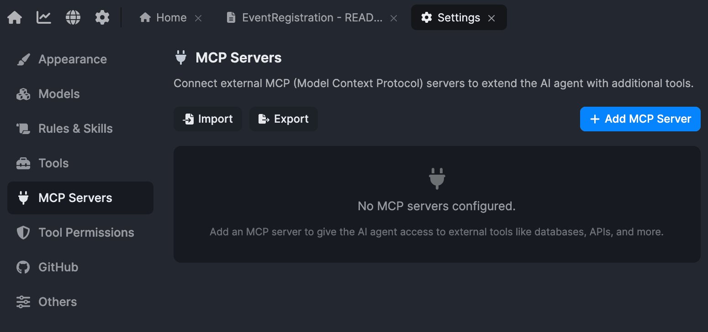
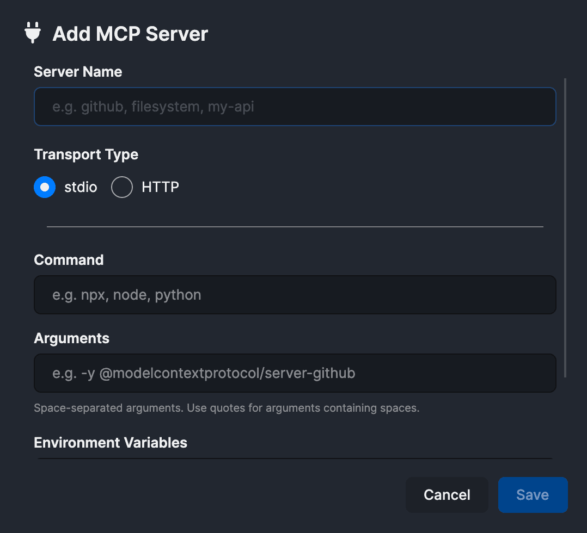
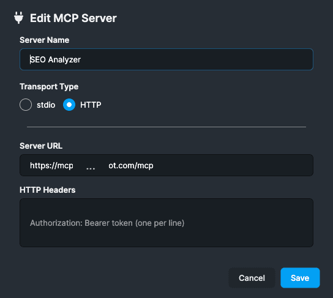
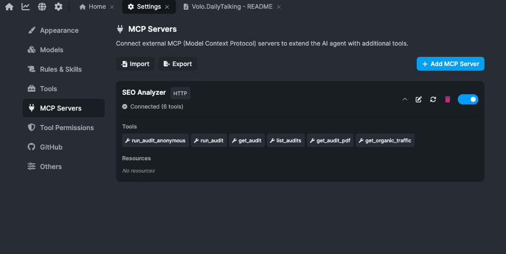
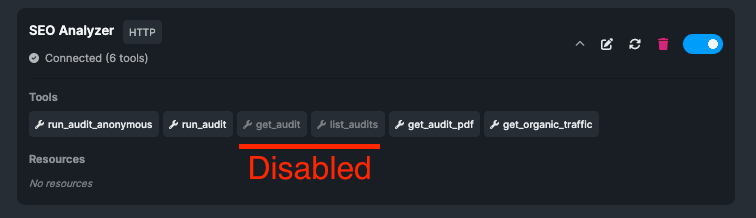
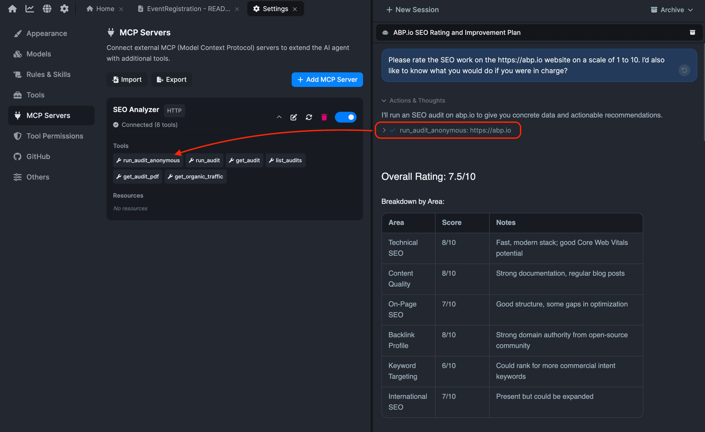

# Deep Dive on ABP AI Agent #5: MCP (Model Context Protocol)

When I use an AI coding agent inside ABP Studio, most of the work starts inside the solution.

The agent can read the code. It can edit files. It can use the ABP Studio tools I enabled. It can build the solution, run tasks, start applications, inspect containers, and check monitoring data when something fails. [In the previous article of this](https://abp.io/community/articles/deep-dive-on-abp-ai-agent-4-integrated-abp-studio-tools-be2xa2om) series, we focused on exactly that: the integrated tools that connect the agent to the ABP Studio development environment.

But there is another point where plain solution awareness is not enough.

Sometimes the information I need is not in the repository. It is not in the running application. It is not in the build output, container state, or ABP Studio monitoring screen.

It may be in a live Prometheus workspace. It may be in Google Search Console. It may be in an SEO analyzer, a documentation system, a database, a customer support tool, or another service that has nothing to do with the ABP solution itself.

That is where **MCP** becomes useful.

MCP, short for **Model Context Protocol**, gives ABP AI Coding Agent a standard way to reach external tools and data sources. It does not replace the built-in ABP Studio tools. It extends the agent beyond the solution boundary when the task depends on something outside that boundary.

> **Note:** ABP AI Coding Agent is available directly to ABP license holders. License holders have predefined credits so they can try the integrated experience without setting up a separate AI workflow first. MCP is one of the ways this experience can be extended when the agent needs access to systems outside ABP Studio.

## Why MCP Matters

Most coding agents start from the same place: **the files they can see**.

That is a good start, but real development work often needs context from somewhere else: production metrics, SEO data, analytics, search performance, customer records, internal APIs, or product knowledge.

If the agent cannot reach those systems, the developer becomes the bridge:

- Copy this metric result.
- Paste that SEO report.
- Export this analytics data.
- Summarize this dashboard.
- Explain which production signal matters.
- Tell the agent what the external system says.

That works, but it is not the best workflow. The more information I manually copy into the chat, the easier it is to miss something, simplify too much, or give the agent an outdated snapshot.

MCP reduces that manual work. It lets the agent ask an external system for context directly, within the permission boundary I configure.

The important detail is that MCP is not "the agent can do anything now." It is a controlled extension point. A server is connected. Its tools are listed. Individual tools can be enabled or disabled. The agent can only use what is available in the current session.

That gives me a practical balance: the ABP-aware development experience stays in ABP Studio, and external context can be added only when the task needs it.

## What MCP Actually Is

MCP is an open standard for connecting external tools and data to AI agents.

Instead of every tool inventing its own integration for every agent, MCP defines a common shape. A program that exposes tools or resources through this standard is called an **MCP server**. An agent that understands MCP can connect to that server and use what it provides.

For me, the easiest way to think about it is simple:

- ABP Studio tools connect the agent to the ABP development environment.
- MCP servers connect the agent to systems outside that environment.

The server might expose a tool for querying Prometheus, checking Search Console data, running an SEO audit, inspecting a database, or calling an internal API. The exact capability depends on the server.

MCP is not a prompt, a rule, a skill, or a lesson. Those shape what the agent knows or how it behaves. MCP changes what the agent can reach.

That makes MCP more like equipment than instruction. It gives the agent access to a tool or data source that was previously outside its working area.

There are already many community and vendor MCP servers for different systems. A useful place to discover examples is the [awesome-mcp-servers](https://github.com/punkpeye/awesome-mcp-servers) repository, which collects MCP servers across many categories.

For concrete examples, there are MCP servers for [Prometheus metrics](https://github.com/pab1it0/prometheus-mcp-server), [AWS Managed Prometheus](https://github.com/awslabs/mcp/tree/main/src/prometheus-mcp-server), and [SEO analysis](https://github.com/g-battaglia/mcp-seo). The exact server you choose depends on your environment, but the pattern is the same: expose a focused external capability to the agent through MCP.

## When You Actually Need It

Most of the time, I would not start with MCP.

For normal ABP development, the built-in tools are usually the right first layer. The agent can already work with the solution, run profiles, applications, containers, tasks, builds, monitoring data, and documentation. If the task is completely inside the ABP solution, MCP may not add anything.

MCP becomes useful when the task crosses the solution boundary.

For example, I may ask:

```text
Run an SEO audit for https://abp.io, summarize the weak areas, and suggest which content or technical improvements would matter most.
```

Without MCP, I would need to open a separate SEO tool, run the audit, copy the results, and paste them into the chat. With the right MCP server enabled, the agent can call the SEO tool directly and reason from the structured result.

Or I may ask:

```text
Connect to our Prometheus MCP server, check the error rate and p95 latency for the AuthServer over the last 30 minutes, and tell me whether the last deployment changed anything.
```

That is a very different kind of task. The answer is not in the source code alone. It lives in a monitoring system. Prometheus MCP servers exist for this kind of workflow; for example, some expose tools for instant PromQL queries, range queries, metric discovery, and target inspection.

Another realistic prompt could be:

```text
Use Search Console data to find pages that lost traffic this month, then inspect the related docs pages and suggest focused improvements.
```

Again, the important part is not that the agent magically knows everything. The important part is that I can connect a specific external system, expose a specific set of tools, and let the agent use them when they are relevant.

If the work starts outside the codebase but ends inside the codebase, MCP can help connect those two parts of the workflow.

## Setting Up An MCP Server

MCP servers are configured under **Settings > MCP Servers**.

When no server is connected, the page is intentionally simple. It is an empty list waiting for the first server. That is important because MCP should be explicit. If I have not connected a server, the agent should not behave as if it has access to that external system.



When I add a server, ABP Studio asks how it should connect.

There are two main connection types:

- **Stdio:** ABP Studio runs the MCP server as a local process. I provide the command, arguments, and environment variables the server needs.
- **HTTP:** ABP Studio connects to an MCP server over the network. I provide the URL and any required headers.



This is useful because different MCP servers are packaged in different ways. Some are local command-line programs. Some are hosted services. Some need environment variables for tokens or configuration.

In the example below, I am adding an HTTP MCP server named **SEO Analyzer**. It exposes a small set of SEO-related tools through a remote MCP endpoint.



ABP Studio does not require every server to be created manually from scratch. If I already use MCP elsewhere, I can import existing configuration from tools like Cursor, Claude, VS Code, Windsurf, or a plain MCP server JSON file. It can also export configuration in the standard `mcpServers` JSON shape.

That matters because MCP is an open ecosystem. The same server definition can often move between tools. ABP Studio becomes another place where I can use that server, but now in the context of an ABP-aware agent.

## What A Connected Server Shows

After a server is connected, ABP Studio shows the important parts of the connection.

I can see whether the server is connected, how many tools it exposes, which tools are available, and whether it provides resources. I can also inspect resources directly from the settings page.



This visibility matters because an MCP server is not just a checkbox. It is a surface area. It may expose one tool or many. Some tools may be read-only, and some may perform actions outside the repository.

The agent does not need me to call those tools manually. I describe the task, and if the tool is available and relevant, the agent can decide to use it. That is why a prompt can stay natural:

```text
Read the product requirement from the connected knowledge base and compare it with the current implementation.
```

The prompt does not need to become a tool invocation script. The agent still owns the reasoning loop. MCP only gives it a new place to look.

## Tool Access: What The Agent Is Allowed To Use

The most important part of MCP in ABP Studio is not only connecting servers. It is controlling what the agent is allowed to use.

Individual tools can be disabled. If a tool is disabled, it is not offered to the agent. The agent should not plan around it, call it, or assume it has access to it.

That is useful for safety, but also for quality.



Every enabled tool becomes part of the menu the agent considers. If a server exposes ten tools but the current task only needs two, I usually prefer to enable only those two. A shorter tool list is easier for the agent to choose from. It also makes the session easier for me to reason about.

The permission model is simple:

- If a server is not connected, the agent cannot use it.
- If a server is disabled, the agent cannot use its tools.
- If an individual tool is disabled, the agent cannot use that tool.
- If the session is not in Agent mode, MCP tools are not available.

That last point is important. MCP tools are available in **Agent mode only**.

Plan and Ask modes are read-only by design. They are useful for understanding, planning, and discussing changes, but they do not receive MCP tools. If I want the agent to call an external MCP tool, I need to work in Agent mode.

This keeps the model consistent with the rest of the ABP AI Coding Agent experience. The mode determines what kind of work the agent is allowed to perform.

## Keeping MCP Safe

MCP is powerful because it lets an AI agent reach systems outside the solution.

That is also why it needs care.

An MCP server is a program. It may read files, call APIs, query databases, send requests, or perform actions depending on how it was built. The agent is not inventing those capabilities. It is using what the server exposes.

So trust matters at two levels.

First, I need to trust the actions. If a tool can update an issue, send a message, change a record, or trigger a workflow, that is a real side effect.

Second, I need to trust the descriptions. When an MCP server connects, the names and descriptions of its tools become part of what the model can read. A careless or hostile server can use that text to influence the model before I even write my prompt.

That means MCP safety is not only about "what can this tool do?" It is also about "what instructions or descriptions does this server place in front of the model?"

Two habits keep this manageable:

- Connect only servers I trust.
- Disable tools the agent should not use for the current task.

This sits on top of the agent's normal guardrails. Shell commands, URL fetches, downloads, and other sensitive actions can still require permission. Also, the tool list is fixed for a running session, so changing a server in the middle of a session does not quietly alter the tool surface already given to that session.

That is the behavior I want from this kind of integration. MCP can extend the agent, but it should do so through visible, intentional configuration.

## A Practical MCP Walkthrough

Let me make this more concrete with a small scenario.

Imagine I am working on the public website or documentation side of an ABP-based product. The task is not a compiler error or a failing unit test. I want to understand how the website looks from an SEO perspective and what I would improve first.

Without MCP, I would open a separate SEO tool, run the audit, wait for the result, copy the score, paste the table into the chat, and then ask the agent to interpret it. That is not terrible, but it turns me into a copy-paste integration layer.

With an SEO Analyzer MCP server connected, I can start from a better prompt:

```text
Please rate the SEO work on the https://abp.io website on a scale of 1 to 10. I'd also like to know what you would do if you were in charge.
```

At that point, the agent can use the SEO Analyzer MCP tool instead of guessing from general SEO knowledge alone. It can call the audit tool, read the structured result, and turn it into a concrete improvement plan.



The value is not only that the agent saved me a few seconds. The value is that the agent starts from live tool output instead of a manually summarized report.

### First, Without The MCP Server

If no SEO MCP server is connected, the agent cannot run the audit directly.

It may still give a reasonable answer from general knowledge. It may say that the site should have good titles, descriptions, headings, performance, backlinks, structured data, and content targeting. That advice can be useful, but it is generic.

For example, I might write:

```text
Review the SEO of abp.io and tell me what to improve.
```

The agent can reason about common SEO practices, but it does not have a fresh audit result. It does not know which categories scored well, which areas are weak, or whether the live page data confirms the concern.

This is similar to debugging without monitoring tools. The agent can reason, but it is reasoning from weaker evidence.

### Then, With The MCP Server Enabled

Now imagine the SEO Analyzer MCP server is connected, enabled, and the relevant audit tool is enabled.

I can ask:

```text
Run an audit on https://abp.io, rate the result, and suggest the highest-impact improvements.
```

This time the agent can gather the external context first. In the screenshot, the server exposes tools like `run_audit_anonymous`, `run_audit`, `get_audit`, `list_audits`, `get_audit_pdf`, and `get_organic_traffic`. The agent uses the audit tool and then explains the result in human terms.

That changes the workflow:

1. Run the external SEO audit.
2. Read the score and category breakdown.
3. Identify the weakest areas.
4. Suggest concrete technical or content improvements.
5. If needed, inspect the related website or documentation files.

The agent is no longer guessing from best practices alone. It can connect the outside report to the actual website and then, if the relevant files are in the solution, help improve them.

### Another Example: Live Monitoring

SEO is only one example. Monitoring is another strong fit for MCP.

Prometheus MCP servers can expose tools for PromQL instant queries, range queries, metric discovery, targets, and server information. That means I can ask operational questions in natural language while the agent queries the monitoring system through MCP.

For example:

```text
Use the Prometheus MCP server to check p95 latency, request rate, and error rate for the public web application after the last deployment. If something changed, identify the most likely area to inspect in the ABP solution.
```

That does not mean the agent should blindly change production behavior. It means the agent can start from live evidence: metrics, trends, targets, and recent changes. Then it can use ABP Studio context to inspect the related application, module, or configuration.

### Combining MCP With ABP Studio Tools

The best part is that MCP does not replace the ABP Studio tools from the previous article. It works beside them.

In a real workflow, MCP may provide the outside signal, and ABP Studio tools may provide the inside development loop:

1. MCP brings in the external context.
2. ABP-aware reasoning maps it to the solution.
3. ABP Studio tools help implement and validate the change.

That is where the integration becomes more useful than a generic MCP checkbox. The agent is connected to an external tool while still understanding the ABP development environment.

## How MCP Fits With Everything Else

MCP is an open standard, so connecting an MCP server is not an ABP-only idea.

Tools like Cursor, Claude, VS Code extensions, and other AI coding environments can also use MCP. That is part of its appeal. Teams can build or adopt a server once and use it across different tools.

What makes MCP especially useful in ABP Studio is the company it keeps. ABP AI Coding Agent already understands the ABP solution structure, application layers, modules, migrations, proxies, build actions, run profiles, containers, monitoring data, and official ABP documentation. MCP adds the outside world to that picture.

So I do not need to choose between:

- an agent that understands ABP,
- and an agent that can reach my team's external systems.

The better experience is both together, under visible configuration. Put simply:

- Built-in ABP Studio tools handle the solution and runtime environment.
- MCP servers handle external tools and data sources.
- Rules, skills, and lessons shape how the agent behaves.
- Agent mode decides whether tool use is available for the session.

Each part has a different role. Keeping those roles clear makes the agent easier to trust. This is also why I would start small in a real team workflow: one low-risk, high-value server, probably a read-only analytics, documentation, or monitoring server, with only the tools that support a clear workflow enabled.

MCP by itself is a protocol. The difference in ABP Studio is that MCP becomes part of an ABP development session. The agent can read an external SEO report or monitoring signal, but it can also understand which ABP application, module, page, or configuration owns the behavior and validate the change with ABP Studio tools.

Most real tasks are not only "call an external tool." They are more like:

1. Understand the requirement from outside the repository.
2. Find where that behavior lives in the ABP solution.
3. Make the smallest correct change.
4. Validate it in the same development environment.

MCP helps with the first part. ABP Studio AI helps connect the rest.

**That makes MCP valuable not because it is another tool list, but because it extends the ABP AI Coding Agent beyond the repository without disconnecting it from the ABP workflow.**

## Conclusion

MCP is the agent's connection to everything that is not already inside the ABP solution.

You will not need it for every task. But when the work depends on SEO data, live metrics, external documentation, internal services, or team knowledge, MCP gives the agent a standard way to reach that context.