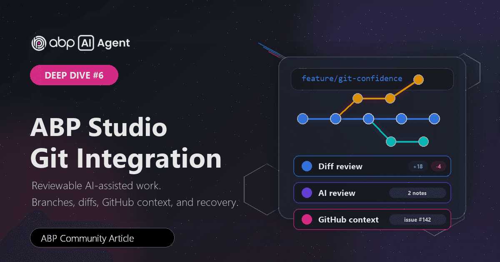
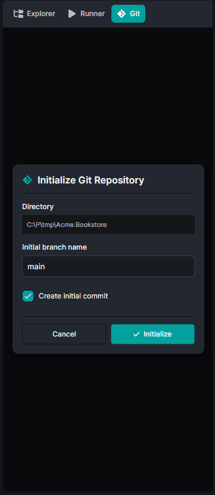
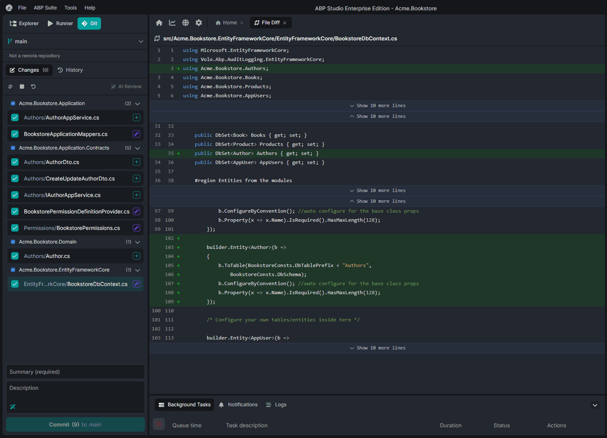
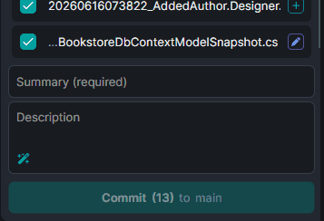
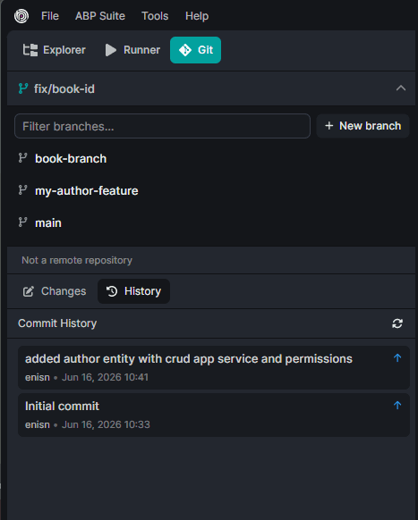
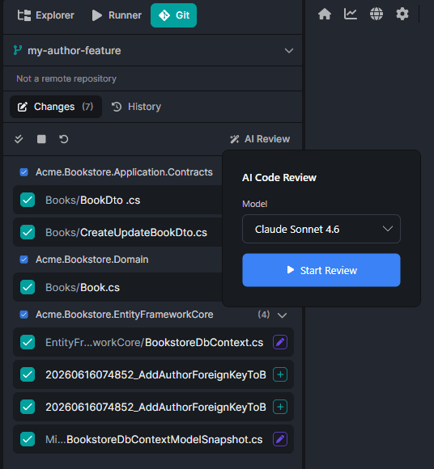
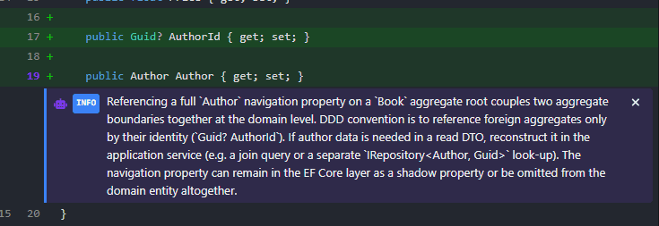
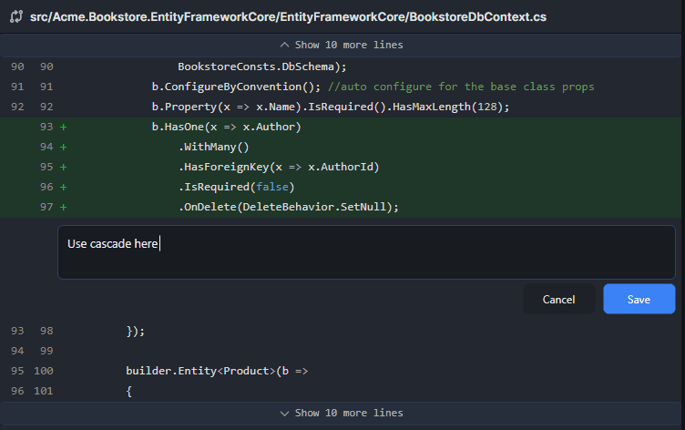

# Deep Dive on ABP AI Agent #6: ABP Studio Git Integration

When I use an AI coding agent, I do not only care about whether it can change files.

I care about what happens around those changes.

Which branch am I on? What exactly changed? Can I review the diff before I commit? Did I accidentally touch a file from another package? Is my branch behind the default branch? If a pull request already has feedback, can I bring that context back into the coding session without copying every comment by hand?

That is where Git integration in **ABP Studio** becomes important.

Git is not just the final step after the agent finishes. For me, it is the confidence layer around the whole workflow. It helps me keep AI-assisted work reviewable, recoverable, and connected to the same team process I already use every day.



## Git In The AI Workflow

Most development work is not a straight line from prompt to done.

I may ask ABP Agent to make a small change, then review the diff and adjust the direction. I may ask it to address feedback from a pull request. I may start from a GitHub issue, create a branch, let the agent investigate, and then decide which changes are ready to commit.

In all of those moments, Git gives me a practical boundary:

* this is the branch I am working on,
* these are the files that changed,
* this is the diff I need to review,
* this is the commit I am about to create,
* and this is the context I want to send back to the team.

Without a Git-aware workflow, AI changes can feel a little too loose. The agent may be productive, but I still need a clean way to inspect, group, commit, push, and discuss the result.

ABP Studio Git Integration brings that loop into the same place where I already work with the solution and the agent.

## Initializing Git For A Solution

The Git panel starts with the active solution.

If the solution is not a Git repository yet, ABP Studio does not pretend otherwise. It shows a simple empty state and lets me initialize Git from there. I can choose the initial branch name, create a `.gitignore`, and create the first commit.



That is useful for new ABP solutions because the first Git step is part of the project setup, not something I need to remember after the fact.

If I want to put the solution on GitHub, Studio can also help with that path. After connecting my GitHub account, I can publish the repository under my account or an organization, choose the repository name, add a description, and decide whether it should be private.

The small but important detail is that Git becomes part of the solution experience early. I do not need to move from ABP Studio to a separate Git tool just to create the repository before I start working with ABP Agent.

## Changed Files And Diff Review

Once Git is active, the Git panel becomes the place I check after an agent session or a manual edit.

I can see the current branch, remote state, changed files, and the selected file diff. The changes are not only a flat list. In an ABP solution, they can be grouped in a way that follows the solution structure, so changes under different packages or solution areas are easier to scan.



That grouping matters in real ABP work.

If I asked ABP Agent to adjust a public web page, but I see changes in an admin package, I immediately know to slow down and review why. If a change touches a contract package and a UI package, the grouping helps me understand that relationship before I commit.

The diff viewer is also part of the same loop. I do not need to leave the workspace just to answer the basic review question:

```text
What did this task actually change?
```

That is the question I want to answer before a commit, especially when AI helped produce the diff.

## Selected Files And Commit Messages

Committing is not only pressing a button.

I still want to choose which files belong together. I still want the commit message to match the change. I still want to avoid committing work on a protected branch by accident.

ABP Studio keeps that flow visible. I can select the files I want, write a summary and description, and commit to the current branch. When AI is enabled, Studio can generate a commit message from the selected diffs.



I like this because it keeps the AI help close to the actual diff.

A generic prompt like "write a commit message" depends on what I paste into the chat. In Studio, the commit message generator can work from the selected files. That makes the result more focused, and I still stay in control because the generated text lands in the commit fields before I use it.

The protected branch warning is another important part of the experience. If the current branch should not receive direct commits, Studio makes that visible and pushes me toward the safer workflow: create a branch, review the diff, then commit there.

That is the right kind of guardrail. It does not make Git complicated. It makes the normal team habit harder to miss.

## Branching, Stashing, And Syncing

AI-assisted development often starts with a branch decision.

Sometimes I am starting fresh from the default branch. Sometimes I am building on work already in my current branch. Sometimes I have local changes and need to switch context without losing them.

ABP Studio exposes those decisions in the Git panel.

I can create a branch, switch branches, update from the default branch, fetch, pull, push, and see whether I am ahead or behind. If I switch branches while I have local changes, Studio asks what should happen to that work: leave it behind as a stash or bring it with me.



That choice is more important than it looks.

When I am working with an agent, I do not want local changes to silently follow me into the wrong branch. I also do not want to lose half-finished work just because I need to inspect another issue. The stash flow turns that into an explicit decision.

The same idea applies to sync.

If my branch is behind, I can update before I continue. If I have local commits, I can push them. If a merge or pull produces conflicts, Studio shows the conflicted files and gives me a path to resolve, abort, continue, or send the conflict context to ABP Agent.

That keeps the Git workflow close to the coding workflow. I can move from change to review to sync without mentally switching tools.

## AI Review And Manual Diff Comments

There is a moment before a commit where I often want a second look.

Not a full pull request review. Not a long architecture discussion. Just a focused pass over the files I selected:

```text
Does this diff contain something suspicious?
Did the agent miss a small edge case?
Is there a line I should check again before committing?
```

ABP Studio supports that with AI review on selected Git changes.





AI review is not the only way to leave notes on a diff. I can also write my own comments directly on changed lines while I am reviewing.



The useful part is that the review is attached to the diff. Suggestions and notes appear near the changed lines, and if there is something I want the agent to handle, I can send those review notes to ABP Agent.

That changes the feel of the workflow.

Instead of asking the agent to code and then manually re-explaining my review comments, I can turn the review result back into a task. Whether a note comes from AI review or from something I wrote myself, the agent gets the file, line, and note context. I still review the result, but I spend less time copying context between places.

Git also helps with recovery. In a Git repository, ABP Studio can offer **Back to this point** in the agent conversation. For me, that is a comfort feature: if an agent turn takes the work in the wrong direction, I can return to an earlier point instead of manually untangling every changed file.

I still treat Git commits as the real checkpoints for team work. But during a live agent session, being able to go back to a previous point makes experimentation feel less risky.

## GitHub Issue Context

Many tasks do not start as a prompt. They start as an issue.

The issue has the requirement, comments, labels, screenshots, and sometimes a conversation about what is expected. If that context stays only in the browser, I have to copy it into the agent manually.

ABP Studio can bring GitHub issues into the Git area.

I can filter issues, open one, read the description and comments, create a branch for that issue, and send the issue context to ABP Agent.


That makes the workflow feel natural:

1. Pick the issue.
2. Create a branch for it.
3. Send the relevant context to ABP Agent.
4. Let the agent inspect the solution and implement the change.
5. Review the Git diff before committing.

The important detail is that the agent starts from the same context I would start from as a developer. It sees the issue title, description, labels, included comments, and attached images when they are part of the selected context.

That is much better than writing a vague prompt that tries to summarize the issue from memory.

## Pull Request Feedback Context

Pull request feedback is another place where Git integration helps the AI workflow.

When I open a pull request inside ABP Studio, I can see the PR title, branches, comments, reviews, and requested changes. If I am not on the PR branch, Studio can switch to it. Then I can choose which comments or requested changes should be included and send that context to ABP Agent.


This is the workflow I want when a reviewer asks for changes:

* read the feedback,
* switch to the right branch,
* include only the relevant comments,
* send the request to ABP Agent,
* review the resulting diff,
* commit and push.

The include and exclude controls matter here. Not every PR comment should become an agent instruction. Some comments are discussion, some are already resolved, and some are optional. I want to choose what becomes context.

That keeps the agent from treating the entire PR timeline as one undifferentiated command. I can shape the task before sending it.

## Git Integration In The Deep Dive Series

In the earlier articles, we looked at modes, tools, MCP, scopes, and workflows.

Git integration connects those ideas to the normal development lifecycle.

* **Ask and Plan** help me understand and shape the work.
* **Agent mode** can make the change.
* **Tools** help the agent use ABP Studio context.
* **Scopes** keep the working area focused.
* **Workflows** make repeated actions predictable.
* **Git integration** lets me review, recover, commit, push, and collaborate around the result.

That last part is easy to underestimate.

The value of an AI coding agent is not only how quickly it can modify files. The value is whether I can bring those modifications into a professional development workflow without losing control.

Git is the structure that makes that possible.

## Conclusion

ABP Studio Git Integration makes ABP Agent feel more grounded.

It gives me a clear path from issue to branch, from agent work to diff review, from selected files to commit, and from pull request feedback back into the agent.

For everyday work, that means fewer context switches. For AI-assisted work, it means more confidence.

I can let the agent help, but I do not have to accept the result blindly. I can inspect the diff, ask for a review, commit intentionally, push when ready, and keep the whole process connected to GitHub and the team workflow.

That is the part I value most: **Git integration turns AI output into reviewable development work.**
