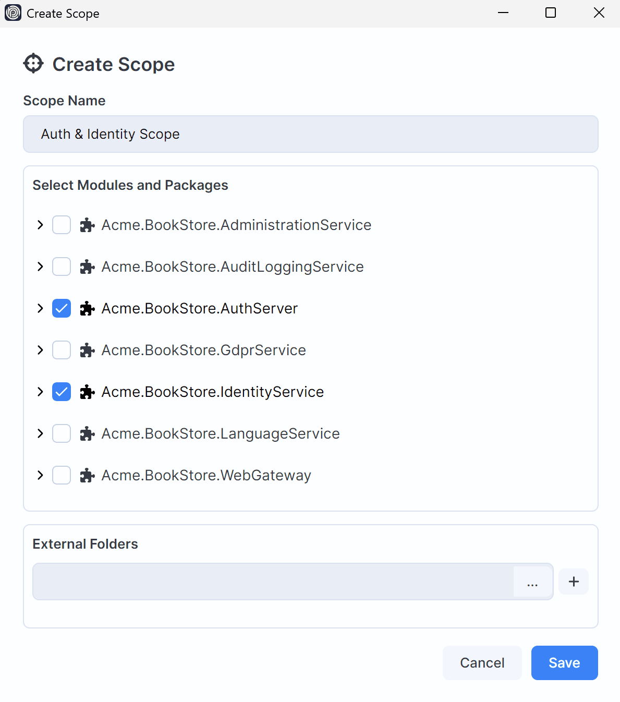
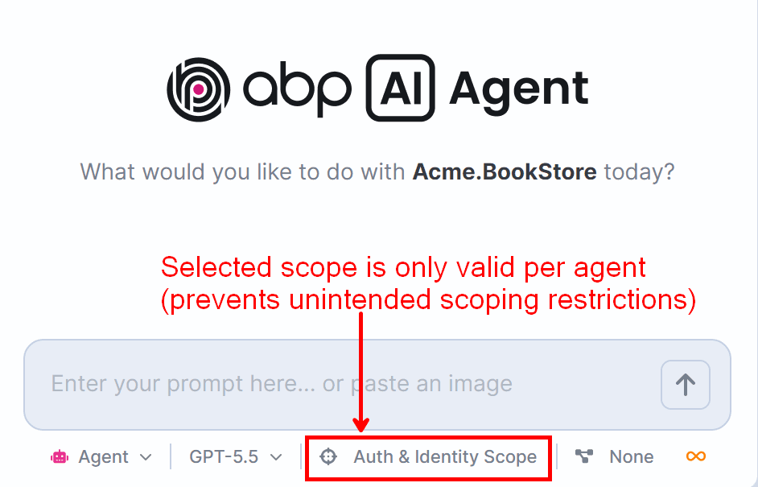
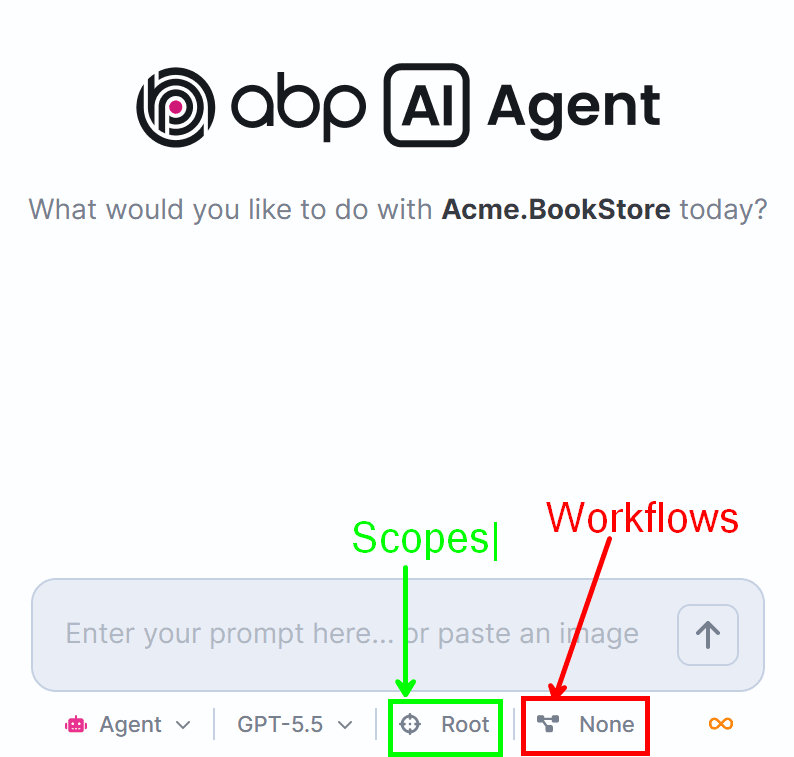

# Deep Dive on ABP AI Agent #7: Scopes

When I use an AI coding agent in a real ABP solution, I do not always want it to see everything.

That may sound strange at first. More context usually feels better. But in a large solution, more context can also mean more noise, more unrelated files, and more chances for the agent to drift into an area that is not part of the task.

If I am working on the public side of a modular application, I do not want the agent to redesign the admin side. If I am changing a Catalog module, I do not want it to spend half the session reasoning about Identity, SaaS, or Payment code. If I am fixing one microservice, I do not want the agent to treat the whole platform as editable surface area.

That is where **AI Scopes** become one of the most important control features in **ABP Studio AI Coding Agent**.

## Why Scopes Matter?

Most AI coding agents are very good at reading a folder and making changes. That is useful, but an ABP solution is rarely just a folder.

An ABP solution can contain modules, packages, applications, gateways, background workers, database projects, shared contracts, UI projects, and infrastructure configuration. In a microservice solution, the repository may contain multiple independently meaningful services. In a modular monolith, a single solution may still have clear business boundaries.

-> In those situations, the question is not only: **Can the agent understand the solution?** ❌

-> The better question is: **Which part of the solution should the agent be allowed to work with for this task?** ✅

AI Scopes answer that question directly.

They let me choose the accessible area before the session starts. The agent can then focus on the relevant module, package, solution area, or external folder instead of treating the entire repository as equally relevant.

For me, that changes the feeling of using an AI agent. It is no longer "here is my whole codebase, please be careful." It becomes "here is the part of the system this task belongs to, work inside that boundary."

## What An AI Scope Controls?

An AI Scope **restricts which directories the agent can access during a session**.



Depending on the task, a scope can include:

* the whole solution,
* selected modules,
* selected packages,
* selected external folders,
* or a focused combination of these.

The important part is that this is not only a prompt suggestion. It is part of the session context and file access boundary. File paths used by the agent are validated against the resolved scope. If a file is outside the accessible directories, the agent should not treat it as part of the editable workspace.

Scopes also work together with `.abpignore`. Even if a file is under an accessible directory, files excluded by `.abpignore` remain blocked. That gives teams two useful layers:

* **Scopes** decide which solution areas are relevant to the task.
* **`.abpignore`** protects files that should stay inaccessible, such as secrets, certificates, environment files, or other sensitive local data.

This is a practical control model. I can narrow the agent's working area without pretending that the repository is smaller than it really is.

## Scope Is Locked To The Session

Another detail I like is that scope belongs to the AI Agent session.

The first message of a session locks the configuration that affects the system prompt, including the active AI Scope. If a background session continues running and I change the foreground scope later, that running session does not silently change its context.

That matters when multiple sessions are active.



Imagine I have one session working on a Catalog module and another session answering questions about the whole solution. Those sessions should not accidentally share a changing boundary. Each one should keep the scope it started with.

This makes scopes more predictable. I can choose the scope intentionally at the beginning of the work and trust that the session is tied to that decision.

## Focused Autonomy

Scopes are not about making the agent weaker. They are about making autonomy more focused.

When I narrow the scope, I am not saying the agent is less capable. I am saying the task has a boundary.

For example:

```text
Use the Public AI Scope.
Add a small validation improvement to the public product search flow.
Do not inspect or change the Admin side unless you find a direct contract dependency.
```

That kind of prompt becomes much stronger when the selected scope already matches the instruction. The agent receives both the natural-language task and the platform-level boundary.

This is especially useful for ABP because ABP applications are built around clear concepts: modules, layers, packages, application services, repositories, DTOs, permissions, localization resources, DbContexts, and run profiles. A scope can follow those boundaries instead of relying only on a long prompt.

## What Scopes Help Prevent?

Scopes help reduce a few common AI-agent failure modes.

- First, they reduce **unrelated exploration**. The agent does not need to spend time discovering files that have nothing to do with the task.
- Second, they reduce **accidental edits**. When a task belongs to one module, the agent should not casually change another module just because it found a similar type there.
- Third, they improve **reviewability**. If I scoped the task to `Catalog`, and the diff changes `Identity`, that is immediately suspicious. The boundary makes the review easier.
- Fourth, they support **parallel work**. Different sessions can be scoped to different areas, which is useful when independent tasks are running in the same solution.

This is one of the places where ABP AI Coding Agent feels different from a generic coding tool. The feature is not only "the model can read fewer files." It is integrated into ABP Studio's understanding of the solution.

## Scopes And ABP Solution Architecture

ABP already encourages clear boundaries.

In a layered module, the Domain layer should not depend on the Application layer. HTTP API projects should depend on contracts, not implementation projects. Entity Framework Core and MongoDB integrations should stay behind the domain abstractions. A reusable module should be understandable as a module, not only as a set of files.

AI Scopes fit naturally into that mindset.

If I am working on a Domain change, I can keep the scope close to the module and its required shared contracts. If I am working on UI behavior, I can include the UI package and the related contract package. If I am working on a microservice, I can scope the agent to that service and only add external folders when they are truly required.

That means the agent's working area can follow the same mental model I already use as an ABP developer:

```text
What bounded area owns this change?
Which packages are needed to make it safely?
Which parts of the system should stay out of this session?
```

## Scopes And Workflows Work Better Together

- Scopes define **where** the agent can work.
- Workflows define **what deterministic actions** should happen around that work.



That combination is powerful. For example, I can scope the agent to the `Catalog` module and use a workflow that builds the affected package, regenerates proxies if contracts changed, and restarts the related application.

The scope keeps the coding session focused. The workflow keeps the verification loop repeatable.

This is the larger ABP Studio AI story. It is not only an AI chat window. It is an agent inside a platform that already understands ABP solutions, run profiles, tools, workflows, Git state, and runtime signals.

## Why This Is Different From Generic Coding Agents?

Tools like Cursor, Claude Code, Codex, and Windsurf are strong general-purpose coding tools. They can read files, edit code, run shell commands, and help with many projects.

**ABP AI Coding Agent is different because it is built around ABP Studio's view of an ABP solution.**

Scopes are a good example of that difference.

In a generic tool, I can try to simulate scope with a prompt:

```text
Only work in this folder.
```

That is helpful, but it is still mostly an instruction. In ABP Studio, scope is part of the agent session and file access model. It can be selected intentionally before the work starts, stored with the session, and combined with `.abpignore`, workflows, tools, plans, and run profile context.

For professional ABP teams, that matters. The goal is not to give an AI agent unlimited access and hope the prompt is clear enough. The goal is to create a controlled development loop where the agent understands the system, works in the right area, uses the right tools, and produces a diff that is easier to trust.

## Conclusion

AI Scopes make ABP Studio AI Coding Agent feel more deliberate.

They let me say:

* this is the part of the solution that matters,
* this is the boundary for the current session,
* this is the context the agent should focus on,
* and everything else should stay outside unless we intentionally expand the scope.

That is exactly the kind of control I want when using AI in real ABP solutions.

The agent can still be powerful. It can still plan, edit, build, run tools, and iterate. But with scopes, that power is pointed at the right part of the system.

That is the real value: **not just more AI autonomy, but better-shaped AI autonomy for ABP development.**
