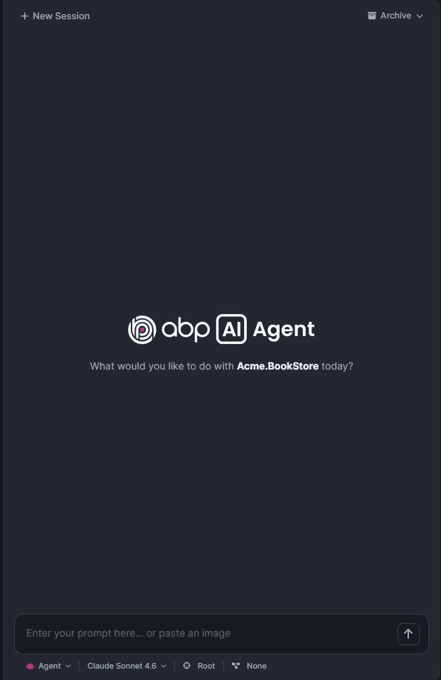
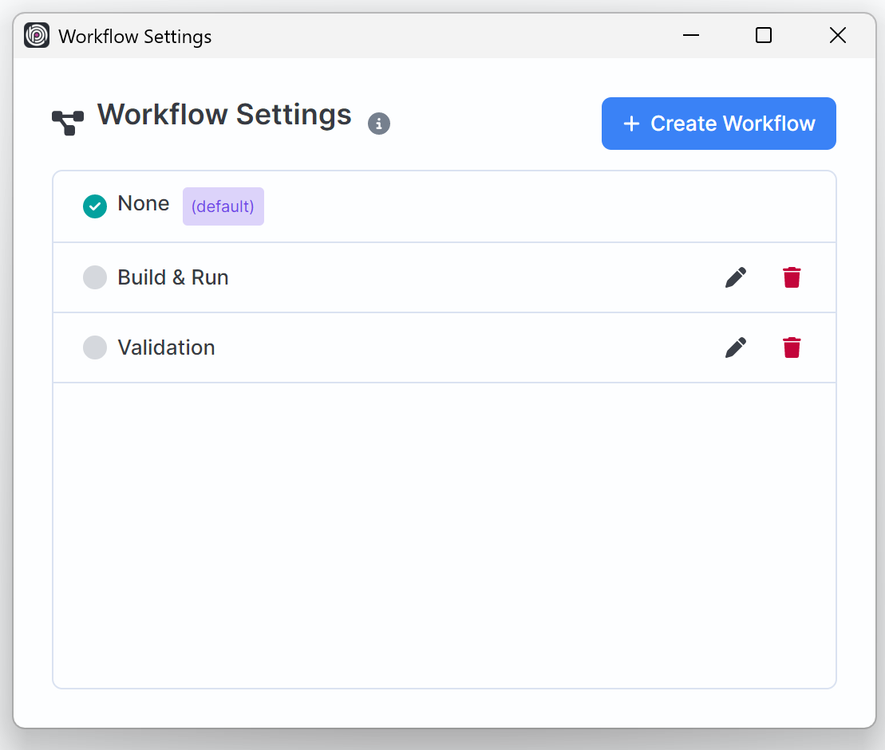
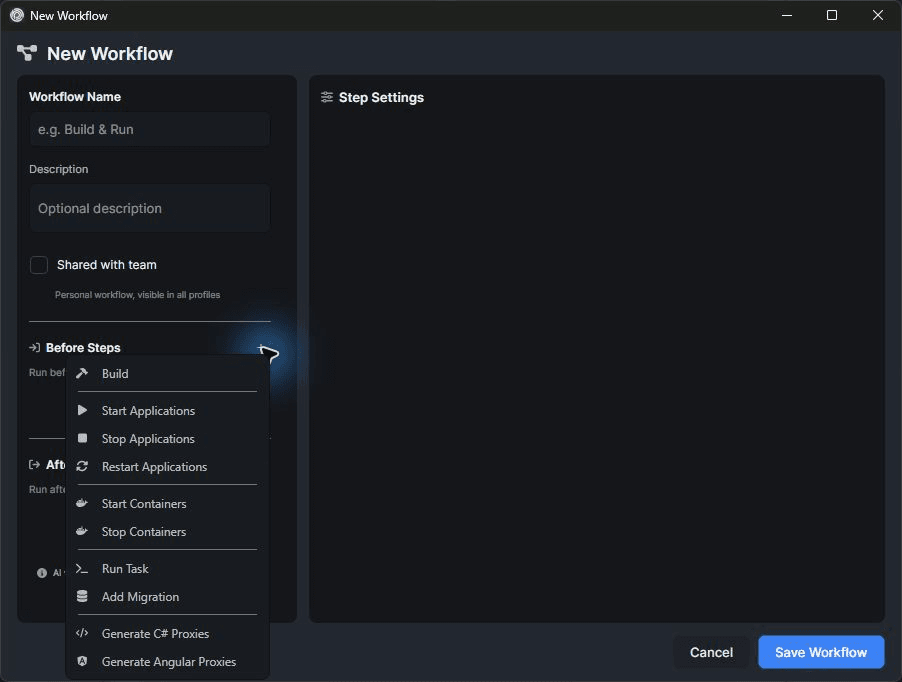

# Deep Dive on ABP AI Agent #9: Workflows

There is a pattern I see in almost every real development session.

The interesting part is the code change, but the repeated part is everything around it:

* start the containers,
* build the affected packages,
* add a migration if the model changed,
* regenerate proxies if the API contract changed,
* restart the application,
* run the validation task,
* check the logs when something fails.

When I work alone, I can do those steps manually. When I work with an AI coding agent, I do not want to keep pasting the same checklist into every prompt. I want the tool to understand that this solution has a normal way of preparing, validating, and recovering after changes.

That is the point of **ABP Studio AI Agent Workflows**.



Workflows let me define repeatable actions around an agent run. The model can focus on the ambiguous part, understanding the requirement and changing the code, while ABP Studio handles the deterministic parts that should happen before or after the work.

That combination is one of the clearest differences between **ABP AI Coding Agent** and a generic coding assistant. It is not only an editor with a chat panel. It is an agent inside a platform that already knows how to build, run, migrate, generate proxies, manage containers, execute tasks, and inspect runtime signals.

## Why Workflows Matter

LLMs are powerful because they can reason through unclear requirements and modify code across files. But many development steps should not be creative.

If the team always builds a package after an application service change, that should be predictable. If API contract changes require proxy generation, that should not depend on whether I remembered to mention it. If a local run needs containers before the application starts, that setup should not be reinvented in every prompt.

Workflows give ABP Studio a place to encode those repeatable steps.



For me, the value is not only automation. It is also consistency.

Instead of asking:

```text
Please implement this, and then build, and maybe regenerate proxies,
and restart the app, and also add a migration if needed.
```

I can configure the workflow once and let the agent session carry that context.

That makes the prompt cleaner:

```text
Add the missing status filter to the order list.
Use the selected workflow for validation after the change.
```

The workflow becomes part of the development environment, not a long instruction I repeat manually.

## Before And After The Agent Works

An AI Agent workflow has two sides:

* **Before steps** prepare the environment before the agent starts coding.
* **After steps** guide the validation and follow-up work after the main task is complete.

Before steps run automatically in **Agent** mode. They are useful for setup actions that should happen before the model receives control, such as starting containers or running a preparation task.

Plan and Ask modes are read-only, so they do not execute before steps. That separation is important. If I am only asking a question or asking for a plan, I do not want Studio to start applications or run mutation-oriented tooling.

After steps are injected into the agent instructions as post-task guidance. The agent is expected to run the relevant post-steps after completing the work, but it can skip actions that do not apply.

For example, if my workflow includes "Add Migration" but the change does not touch the EF Core model, the agent should not create an empty migration just because the workflow exists. The workflow gives deterministic options, but the agent still uses the actual change to decide what is relevant.

## What A Workflow Can Do

Workflow actions are built around the things ABP developers already do in ABP Studio.



The supported actions include:

* **Build** the solution, selected modules, selected packages, or configured targets.
* **Start Application** for selected applications, folders, or all runnable applications.
* **Stop Application** when validation needs a clean state.
* **Restart Application** after code changes.
* **Start Containers** for databases, caches, message brokers, or other dependencies.
* **Stop Containers** when the workflow needs to clean up.
* **Run Task** for configured ABP Studio tasks.
* **Add Migration** when entity changes require a database migration.
* **Install Libs** when client-side library files need to be restored.
* **Generate C# Proxies** after contract changes.
* **Generate Angular Proxies** after API changes consumed by Angular clients.

That list is very ABP-specific.

A generic coding tool can run shell commands, and that is useful. But ABP Studio workflows know about ABP Studio concepts: applications, containers, run profile tasks, packages, modules, migrations, and proxy generation. The agent can use those as first-class actions instead of trying to infer everything from terminal commands.

## Personal And Shared Workflows

Workflows can be personal or shared.

A **personal workflow** is stored locally under the solution workspace. It is useful for my own development habits. Maybe I like restarting a specific app after each agent turn. Maybe I have a local task that only makes sense on my machine.

A **shared workflow** is stored with the active run profile. That makes it suitable for source control and team usage.

This is where workflows become more than a convenience feature. A team can encode its normal AI-agent validation path into the solution itself.

For example:

```text
Before:
- Start required containers
- Run the prepare-local-environment task

After:
- Build affected packages
- Generate Angular proxies when contracts changed
- Restart the Web and API applications
- Run the smoke-test task
```

Every developer using that run profile can work with the same repeatable loop. The workflow does not replace code review or testing, but it raises the baseline for what happens after the agent touches code.

## A Practical Workflow Example

Let me describe the kind of workflow I like for ABP application work.

Suppose I am adding a new field to a `Book` entity and exposing it from the application service to the UI.

Without a workflow, I might need to remind the agent:

```text
After the change, check if a migration is needed, build the backend,
generate Angular proxies, restart the app, and check for runtime errors.
```

With a workflow, I can configure those actions as the normal post-task path.

### Step 1: Prepare The Environment

The workflow can start the required containers before the agent begins. If the application depends on SQL Server, PostgreSQL, Redis, RabbitMQ, or another local dependency, Studio already knows those containers from the run profile.

That means the agent does not need to guess which Docker command to run.

### Step 2: Let The Agent Implement The Change

The agent works on the actual feature:

```text
Add the ISBN field to the Book management flow.
Update the entity, DTOs, application service mapping, UI list, and form.
Use the selected workflow for validation.
```

At this point, the LLM handles the part that requires reasoning: finding the right ABP layers, following existing patterns, updating DTOs, respecting validation, and making focused edits.

### Step 3: Run Relevant Post-Steps

After the implementation, the workflow gives the agent a structured validation path.

If the entity changed, it can add a migration through the configured migration action. If API contracts changed, it can generate proxies. If UI libraries need to be installed, it can run the relevant action. Then it can build the affected packages and restart the related apps.

The key detail is that the agent can apply judgment. It should run the migration action when the EF Core model changed, not because every feature always needs a migration.

### Step 4: Use Runtime Signals

Once the application is running again, ABP Studio's monitoring tools can complete the loop.

The agent can inspect exceptions, logs, requests, and distributed events when those tools are enabled. That means a workflow does not stop at "the command completed." It can be part of a real development loop:

1. Implement the change.
2. Build the affected surface.
3. Regenerate what changed.
4. Restart the app.
5. Inspect runtime evidence if something fails.
6. Apply the smallest fix.
7. Validate again.

That is the part I want from an integrated coding agent. The work does not end at file edits.

## Workflows Make AI More Deterministic Where It Should Be

I do not want the model to creatively decide whether my team usually runs proxy generation. I want the workflow to encode that.

I do not want every prompt to include a long validation checklist. I want the workflow to carry it.

I do not want an agent to guess which applications belong to the local run. I want ABP Studio's run profile to provide that context.

This is why workflows are such a strong fit for ABP Studio AI Coding Agent. The model stays flexible where flexibility helps, and the platform stays deterministic where determinism matters.

The result is a cleaner division of responsibility:

| Responsibility | Best handled by |
| --- | --- |
| Understanding the requirement | AI Agent |
| Finding and editing relevant code | AI Agent |
| Starting known containers | Workflow |
| Running known tasks | Workflow |
| Adding migrations when needed | Agent using workflow action |
| Generating proxies when contracts change | Agent using workflow action |
| Building affected packages | Workflow / Studio tools |
| Investigating runtime failures | Agent using monitoring tools |

## Workflows And Scopes Together

Workflows are even better when combined with AI Scopes.

Scopes define where the agent can work. Workflows define what repeatable actions should happen around that work.

For example, I can select a `Catalog` scope and a workflow that:

* builds the `Catalog` package,
* regenerates proxies if contracts changed,
* restarts the public web app,
* checks recent exceptions after restart.

That is a focused agent loop. The agent does not need the whole repository, and the validation path does not need to be invented from scratch.

This is the kind of full flow that makes ABP AI Coding Agent feel different from tools that only operate at the file-and-terminal level.

## What I Highlighted On LinkedIn

When I first shared my thoughts about ABP Studio AI Agent, workflows were one of the features I immediately called out.

The reason is simple: after each AI interaction, I want the boring verification loop to happen naturally. Build the app. Add a migration if needed. Restart the running projects. Run visual tests through Playwright MCP if the setup needs it. Keep the work inside Studio.

> **TODO:** Add the LinkedIn workflow screenshot or a recreated workflow-run screenshot here.

The important part is not that every team will configure the same workflow. The important part is that ABP Studio gives the team a place to configure its own loop.

That is a platform feature. It is not just another prompt trick.

## Why This Is Different From Generic Coding Agents

Generic coding agents can be excellent. Cursor, Claude Code, Codex, Windsurf, and similar tools can read code, edit files, run shell commands, and help across many kinds of projects.

But ABP Studio AI Coding Agent is built for a different experience.

It works inside ABP Studio, where the solution already has run profiles, applications, containers, tasks, modules, packages, migrations, proxy generation, monitoring, Git integration, and ABP-aware analysis.

Workflows use that platform context.

Instead of saying:

```text
Run whatever commands seem appropriate.
```

I can say:

```text
Use the selected ABP Studio workflow.
```

That is a very different contract. The workflow is visible, configurable, repeatable, and tied to the solution.

For ABP teams, this matters because the development process is not only code generation. It is code generation plus build, migration, proxy generation, application restart, runtime observation, and review.

ABP Studio AI Coding Agent is designed for that full loop.

## Conclusion

Workflows make ABP Studio AI Coding Agent more practical for real development.

They let me move repeated setup and validation steps out of my prompt and into the platform:

* start what needs to be running,
* build what needs to be built,
* generate what needs to be regenerated,
* migrate when a model change requires it,
* restart the relevant apps,
* and continue the debugging loop with runtime evidence.

That is why I see workflows as one of the features that makes ABP AI Coding Agent feel complete.

The agent is not isolated from the development environment. It works inside ABP Studio, with the same solution structure, run profile, tools, and team workflow that I already use.

That is the difference: **not just AI-generated code, but an AI-assisted ABP development flow from change to validation.**
