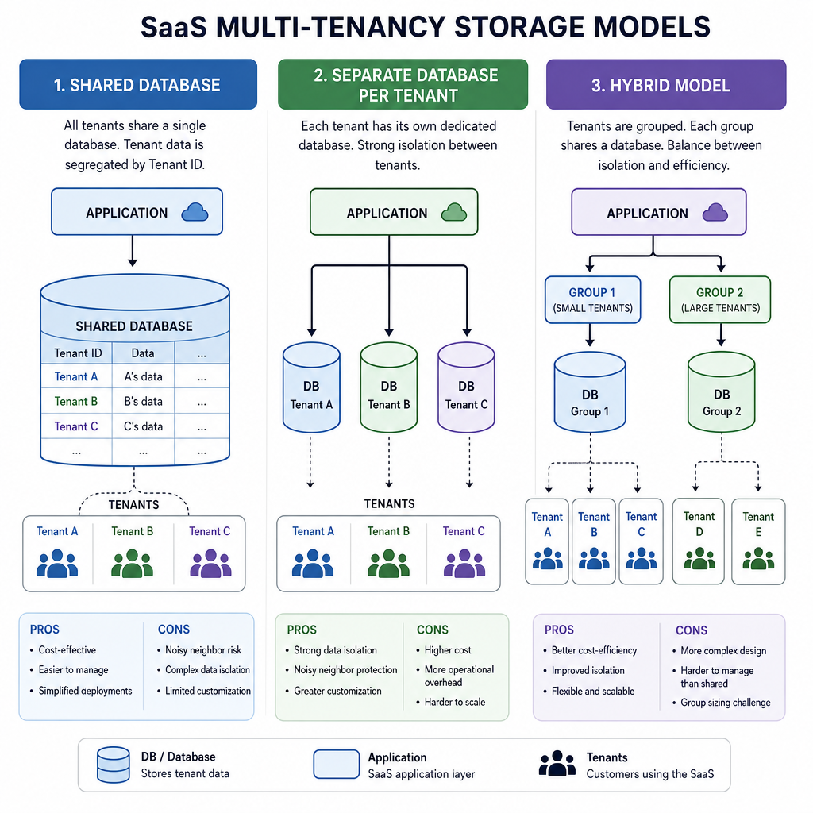
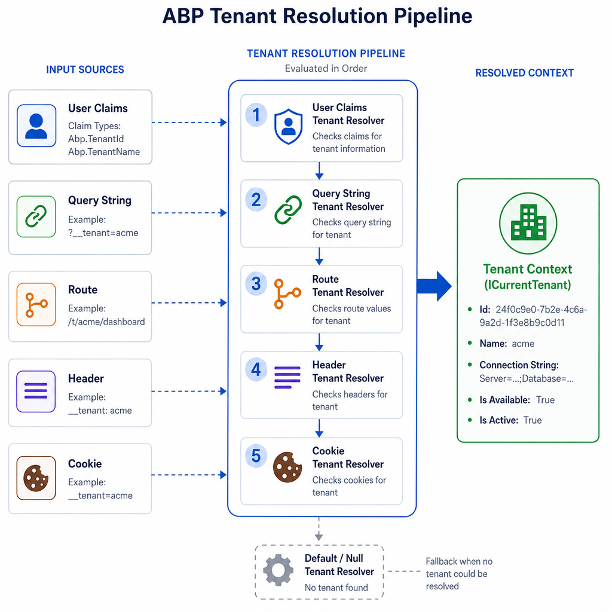
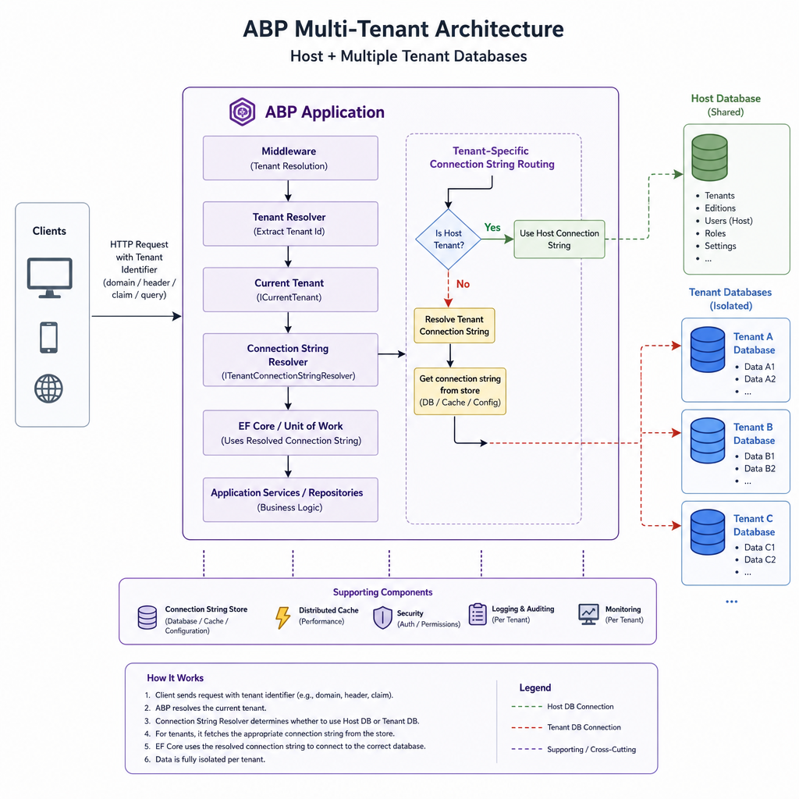

Multi-tenancy sounds simple until the first real requirement lands: tenant-specific data isolation, host-only features, separate databases for a few big customers, and an admin panel that still feels like one product.

ABP Framework gives you most of the plumbing out of the box, but the important part is knowing which pieces to enable, which defaults to trust, and where teams usually get into trouble. This article walks through a practical implementation approach for ABP Framework v8+ and the latest branch, covering shared database, separate database, and hybrid setups.

## What ABP Multi-Tenancy Actually Gives You

ABP's multi-tenancy support is not just a `TenantId` convention. It includes:

- tenant context management
- automatic data filtering for multi-tenant entities
- tenant resolution from web requests
- host vs tenant side separation
- permission scoping by tenancy side
- tenant-aware connection string resolution
- tenant management infrastructure

The first switch is explicit.

```csharp
Configure<AbpMultiTenancyOptions>(options =>
{
    options.IsEnabled = true;
});
```

Technically, multi-tenancy is disabled by default, although ABP startup templates usually enable it for you.

ABP models two sides:

- Host: the system owner, platform operator, or SaaS provider
- Tenant: the customer using the system

A `TenantId` value of `null` typically means the data belongs to the host side.

## Choose the Right Database Architecture First

Before writing entities or resolvers, decide how tenant data will be stored. This choice affects migrations, operations, support cost, and sometimes your pricing model.

### 1. Shared Database

All tenants share the same database and tables. Isolation is enforced with `TenantId` and ABP's built-in data filters.

Why teams choose it:

- simplest deployment model
- lowest infrastructure cost
- easiest to operate in early-stage SaaS products
- one migration pipeline

Trade-offs:

- large tables grow quickly
- indexing becomes more important
- noisy-neighbor performance is more likely
- stricter discipline is required to avoid cross-tenant mistakes

This is usually the best default unless you already know you need stronger isolation.

### 2. Separate Database per Tenant

Each tenant gets its own database. Host data is usually kept in a central database, while tenant-specific data goes to per-tenant databases.

Why teams choose it:

- stronger data isolation
- easier tenant-specific backup and restore
- cleaner compliance story
- large tenants can scale independently

Trade-offs:

- more provisioning logic
- more migration complexity
- more operational overhead
- onboarding a tenant is no longer just inserting a row

### 3. Hybrid Model

Some tenants use the shared database, while others get dedicated databases.

This is often the most realistic long-term model:

- small customers stay in shared infrastructure
- enterprise customers get isolated databases
- you can promote selected tenants later

Trade-offs:

- highest implementation and operational complexity
- migrations and seeding need stronger discipline
- debugging environment-specific issues becomes harder




## Implement Tenant-Aware Entities Correctly

In ABP, tenant-scoped entities implement `IMultiTenant`.

```csharp
using Volo.Abp.Domain.Entities;
using Volo.Abp.MultiTenancy;

public class Product : AggregateRoot<Guid>, IMultiTenant
{
    public Guid? TenantId { get; set; }
    public string Name { get; private set; }
    public decimal Price { get; private set; }

    private Product()
    {
    }

    public Product(Guid id, string name, decimal price, Guid? tenantId)
        : base(id)
    {
        TenantId = tenantId;
        Name = name;
        Price = price;
    }
}
```

Once an entity implements `IMultiTenant`, ABP automatically filters queries according to the current tenant.

That means this kind of repository call is already tenant-aware in normal application flow:

```csharp
var products = await _productRepository.GetListAsync();
```

### The nullable `TenantId` detail matters

`TenantId` is nullable by design because host-owned data is valid in ABP.

That is useful, but also easy to misuse.

If an entity is truly tenant-only, do not casually allow `TenantId = null`. Enforce the rule in your constructor, factory method, or domain service.

Example:

```csharp
public Order(Guid id, Guid tenantId, string orderNo) : base(id)
{
    TenantId = tenantId;
    OrderNo = orderNo;
}

public Guid? TenantId { get; private set; }
public string OrderNo { get; private set; }
```

For tenant-only aggregates, this small constraint prevents a surprising number of data leakage bugs.

## Use `ICurrentTenant` for Context-Aware Logic

`ICurrentTenant` is the central service for reading or temporarily changing tenant context.

```csharp
public class ProductAppService : ApplicationService
{
    public async Task<string> GetTenantInfoAsync()
    {
        if (CurrentTenant.IsAvailable)
        {
            return $"TenantId: {CurrentTenant.Id}, Name: {CurrentTenant.Name}";
        }

        return "Host context";
    }
}
```

The more interesting capability is context switching.

```csharp
using (_currentTenant.Change(tenantId))
{
    var count = await _productRepository.GetCountAsync();
}
```

This is useful for:

- background jobs that process one tenant at a time
- host-side reporting across tenants
- tenant seeding during onboarding
- maintenance tasks and migrations

### A practical warning

Switching tenant context is powerful. It is also a common source of subtle bugs when developers mix host and tenant operations in the same method. Keep tenant context scopes short and obvious.

## How Tenant Resolution Works in ABP

ABP determines the active tenant through a chain of tenant resolvers. Out of the box, the default contributors are checked in this order:

1. Current user claims
2. Query string, using `__tenant` by default
3. Route value
4. Header
5. Cookie

In practice, this means a request can become tenant-aware even before your application service runs.

### Default key configuration

If you want to change the default `__tenant` key:

```csharp
Configure<AbpAspNetCoreMultiTenancyOptions>(options =>
{
    options.TenantKey = "tenant";
});
```

This is fine, but if you have a frontend client, especially Angular, the client must use the same tenant key. Otherwise the backend and frontend silently disagree about tenant resolution.

### Domain and subdomain based resolution

ABP also supports domain or subdomain-based tenant resolution.

```csharp
Configure<AbpTenantResolveOptions>(options =>
{
    options.AddDomainTenantResolver("{0}.myapp.com");
});
```

This is usually the cleanest user experience for SaaS applications because the tenant is implied by the hostname.

Use it when:

- each tenant has a branded subdomain
- the URL should define tenant context naturally
- you want fewer explicit tenant parameters in requests

Be careful with:

- reverse proxies and forwarded headers
- wildcard DNS and TLS certificates
- authentication server issuer validation in wildcard domain scenarios
- local development setup

If you use OpenIddict or token validation with wildcard domains, make sure issuer validation is configured for that pattern. This is one of the most common production surprises in subdomain-based multi-tenant setups.

### Fallback tenant

ABP can also use a fallback tenant.

That can be convenient in development or in a constrained deployment model, but it comes with an important trade-off: you effectively reduce or hide host context behavior. Use fallback tenants deliberately, not as a shortcut for resolver problems.




## Custom Tenant Resolvers for Real Projects

Sooner or later, one tenant comes from a gateway header, another from a custom route pattern, and a third from a legacy integration.

ABP allows custom tenant resolvers by implementing a contributor.

```csharp
using System.Threading.Tasks;
using Volo.Abp.MultiTenancy;

public class XTenantHeaderResolveContributor : TenantResolveContributorBase
{
    public const string HeaderName = "X-Tenant-Code";

    public override string Name => "XTenantHeader";

    public override Task ResolveAsync(ITenantResolveContext context)
    {
        var httpContext = context.GetHttpContext();
        var tenantCode = httpContext?.Request.Headers[HeaderName].ToString();

        if (!tenantCode.IsNullOrWhiteSpace())
        {
            context.Handled = true;
            context.TenantIdOrName = tenantCode;
        }

        return Task.CompletedTask;
    }
}
```

Then register it in tenant resolve options.

The main rule here is simple: prefer one primary strategy. A long resolver chain with multiple overlapping sources makes support harder.

## Configure `DbContext` for Host and Tenant Sides

When you move beyond a single shared database, `DbContext` design becomes a core architecture decision.

ABP supports defining which side a context belongs to:

- `Both`
- `Host`
- `Tenant`

This matters when you want host-only tables to stay out of tenant databases, or when tenant databases should contain only selected modules.

### Why this matters

Suppose your host side includes tenant management, audit administration, and platform billing, but tenant databases should only include business tables and tenant-facing identity data.

If you blindly configure every module in every context, your tenant databases will accumulate tables they should never have had.

### Practical approach

For a shared database setup, one `DbContext` with `Both` is often enough.

For separate or hybrid databases, a common approach is:

- one host/shared `DbContext`
- one tenant-only `DbContext`
- selective module configuration per context

The important implementation detail is not just the side flag. It is also controlling which `builder.ConfigureXyz()` calls are applied in each context.

For example, do not configure host-only modules in the tenant-only context.

## Shared Database Setup: The Best Starting Point

If you are implementing multi-tenancy for the first time in ABP, start with the shared database model unless you have a strong reason not to.

A practical setup looks like this:

1. Enable multi-tenancy
2. Make tenant-owned entities implement `IMultiTenant`
3. Use standard ABP repositories
4. Resolve tenant from user, subdomain, or request key
5. Keep host-owned data with `TenantId = null`
6. Define permissions with proper tenancy sides

Example entity creation inside a tenant context:

```csharp
public class ProductManager : DomainService
{
    public async Task<Product> CreateAsync(string name, decimal price)
    {
        var product = new Product(
            GuidGenerator.Create(),
            name,
            price,
            CurrentTenant.Id
        );

        return await _productRepository.InsertAsync(product);
    }
}
```

This works well because ABP naturally fills the application flow with tenant context.

### Performance tips for shared database mode

As tenant count grows:

- index `TenantId` on large tables
- include `TenantId` in common query patterns
- monitor large shared tables early
- be careful with cross-tenant reporting queries
- verify all custom SQL is tenant-aware

ABP helps with filtering, but it does not replace database design.

## Separate Database per Tenant in ABP

This is where ABP becomes especially useful, because it can resolve the active tenant and then use tenant-specific connection strings.

The Tenant Management module stores tenant metadata, including optional connection strings.

At a high level, the flow is:

1. Resolve the current tenant
2. Load tenant configuration
3. Determine the right connection string
4. Build the `DbContext` against the host or tenant database
5. Apply data filters inside that database scope as needed

### What is available out of the box

ABP supports the architecture and connection-string-based separation.

Version-wise, the latest ABP docs reflect improved support in open source for separate database per tenant. However, managing tenant connection strings from the UI remains tied to SaaS/PRO features. In open source, teams often provide this through custom admin screens, configuration management, or provisioning services.

### What changes operationally

With per-tenant databases, you now need a plan for:

- database creation during tenant onboarding
- migrations for new and existing tenant databases
- tenant-specific seeding
- backups and restore procedures
- monitoring failed or drifted tenant databases

This is the real cost of stronger isolation.




## Hybrid Multi-Tenancy: Shared by Default, Dedicated When Needed

Hybrid architecture is often the most business-friendly model.

A common pattern looks like this:

- default all new tenants to shared database
- move larger or regulated tenants to dedicated databases
- keep host/platform data in a central database

This lets you defer infrastructure cost until a tenant actually needs isolation.

The challenge is not whether ABP supports it. It does. The challenge is operational consistency:

- how a tenant is promoted from shared to dedicated
- how data is moved safely
- how migrations stay aligned across both models
- how support engineers know which storage model a tenant uses

If you choose hybrid, document the lifecycle, not just the code.

## Tenant Management, Onboarding, and Connection Strings

ABP's Tenant Management module is the starting point for tenant administration.

It gives you tenant records and a standard place to store metadata. In more advanced solutions, that metadata is often extended with:

- edition or plan
- onboarding status
- provisioning result
- custom domains
- support tier
- infrastructure notes

For separate database scenarios, onboarding usually means more than creating a tenant row. It often includes:

1. create tenant record
2. assign connection string if needed
3. create database or schema
4. run migrations
5. seed tenant data
6. create admin user
7. confirm domain or resolver setup

Treat onboarding as a workflow, not a controller action.

## Permissions and Authorization in a Multi-Tenant App

ABP permissions can be scoped with `MultiTenancySides`.

That is important because host users and tenant users often should not even see the same capabilities.

Example definition:

```csharp
context.AddGroup(MyPermissions.GroupName)
    .AddPermission(
        MyPermissions.HostDashboard,
        multiTenancySide: MultiTenancySides.Host
    )
    .AddPermission(
        MyPermissions.TenantDashboard,
        multiTenancySide: MultiTenancySides.Tenant
    );
```

This is one of the easiest wins in ABP multi-tenancy. Use it early.

### Why it matters in practice

Without side-aware permission definitions:

- host-only menus can appear in tenant UI
- tenant-only features can leak into host administration
- tests become confusing because behavior differs by login context

Also remember that usernames can collide across tenants. That is normal in multi-tenant identity models. What matters is the combination of user identity and tenant context.

## Migrations and Data Seeding Without Regret

Multi-tenant EF Core migrations are straightforward in theory and messy in real systems if you skip the design phase.

### Shared database

This is simplest:

- one database
- one main migration flow
- host and tenant data usually seeded into the same database with different contexts or `TenantId` semantics

### Separate or hybrid databases

Now you need to answer:

- which context owns which schema
- which migration runs against host DB
- which migration runs against tenant DBs
- when new tenants receive schema updates
- how failed migrations are retried

### Seeding strategy

A practical model is:

- seed host-level data in the host database
- seed tenant defaults when a tenant is created
- perform tenant seeding inside `CurrentTenant.Change(tenantId)` scopes where appropriate

Example:

```csharp
using (_currentTenant.Change(tenantId))
{
    await _dataSeeder.SeedAsync(new DataSeedContext(tenantId));
}
```

That keeps seeding logic tenant-aware and consistent with the rest of the application.

## Common Pitfalls That Break Multi-Tenancy

Most ABP multi-tenancy bugs are not framework bugs. They are design mistakes.

### 1. Tenant-only entity accidentally allows host ownership

If `TenantId` stays nullable for a strictly tenant-owned entity, host-side records can slip in. That often leads to confusing query behavior and data mixing.

### 2. Custom SQL bypasses tenant filtering

ABP filters repository and LINQ queries for `IMultiTenant` entities. Your raw SQL does not magically become safe. Always include tenant scope explicitly when writing custom SQL.

### 3. Host-only modules end up in tenant databases

This usually happens when all module mappings are copied into every `DbContext`. Be intentional about which modules are configured where.

### 4. Resolver strategy is inconsistent

For example:

- frontend sends `tenant`
- backend expects `__tenant`
- API gateway injects a header
- auth claims still refer to a different tenant source

You can spend hours debugging what is really just inconsistent tenant resolution.

### 5. Subdomain authentication is not fully configured

Wildcard domains, issuer validation, proxy headers, and cookie domains all need a coherent setup. Subdomain multi-tenancy is elegant, but only after it is fully wired.

### 6. Shared database performance is ignored too long

If every large table relies on `TenantId` filters, indexing and query shape matter. This usually becomes painful gradually, then suddenly.

## When to Use Shared, Separate, or Hybrid

### Use shared database when

- you are building a standard SaaS product
- operational simplicity matters most
- tenants are relatively small
- strict physical isolation is not required
- you want the fastest path to production

### Use separate databases when

- customers require stronger isolation
- you need tenant-level backup and restore
- data volume varies significantly between tenants
- some tenants need independent scaling or maintenance windows
- compliance requirements push you there

### Use hybrid when

- most tenants fit shared infrastructure
- a few enterprise tenants need dedicated storage
- you want to defer cost while preserving an upgrade path
- your team can handle extra migration and operational complexity

### When NOT to over-engineer it

Do not start with hybrid just because it sounds flexible.

If you are early-stage and do not yet have hard isolation requirements, shared database with good tenant discipline is usually the better engineering decision.

## A Practical Implementation Plan

If you want a sane rollout path, use this order:

### Phase 1: Enable and model multi-tenancy

- enable `AbpMultiTenancyOptions`
- implement `IMultiTenant` on tenant-owned entities
- review aggregate rules around nullable `TenantId`
- define host vs tenant permissions correctly

### Phase 2: Pick one tenant resolution strategy

- prefer subdomain or authenticated user claim for web apps
- keep request key resolution for APIs or development
- make frontend and backend tenant key configuration consistent

### Phase 3: Start with shared database

- launch with shared DB unless requirements force separation
- add indexes and monitoring early
- verify custom queries are tenant-safe

### Phase 4: Prepare for separation only where needed

- isolate `DbContext` boundaries cleanly
- separate host-only module configuration from tenant-only configuration
- design onboarding and migration workflows
- add support for per-tenant connection strings when the business actually needs it

This path keeps your first release simple without blocking future isolation models.

## Final Thoughts

ABP Framework removes a lot of the repetitive work in multi-tenant .NET applications, but it does not remove architectural choices. You still need to decide how tenants are resolved, where data lives, which modules belong to which side, and how strict your isolation really needs to be.

The best ABP multi-tenancy setups are usually boring in the right places:

- one clear tenant resolution strategy
- strict entity rules
- explicit host vs tenant boundaries
- a simple default database model
- operational workflows designed before enterprise tenants arrive

That is what keeps a multi-tenant system maintainable after the demo phase.

## TL;DR

- Enable ABP multi-tenancy explicitly, then model tenant-owned entities with `IMultiTenant` and disciplined `TenantId` rules.
- Start with a shared database unless you already need stronger isolation, compliance, or tenant-level scaling.
- Use `ICurrentTenant` and a clear tenant resolution strategy to keep application logic predictable.
- For separate or hybrid databases, control `DbContext` boundaries, module mappings, migrations, and onboarding workflows carefully.
- Define permissions with `MultiTenancySides` so host and tenant experiences stay clean and secure.