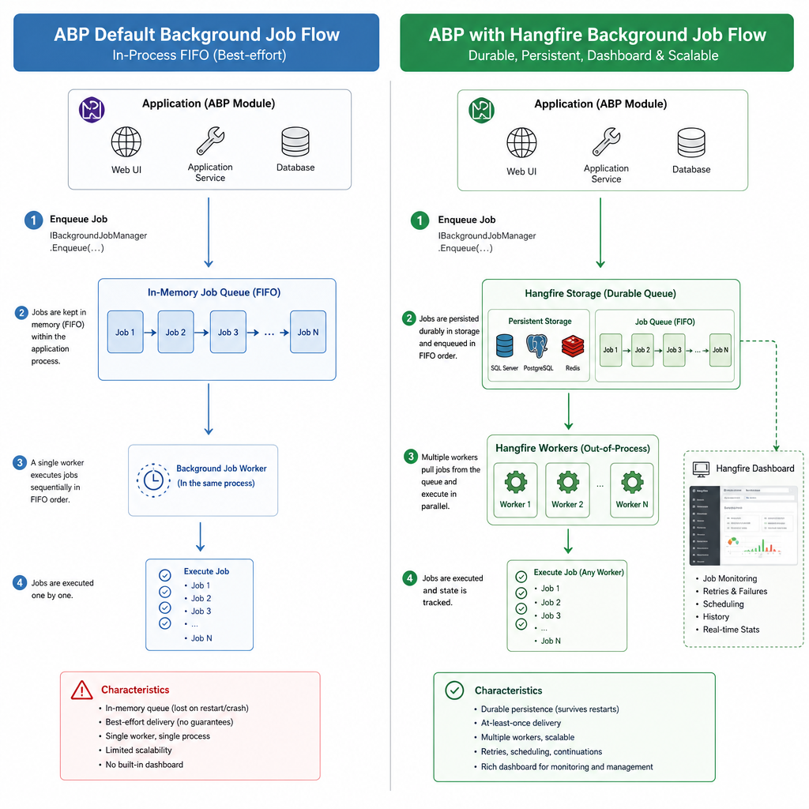
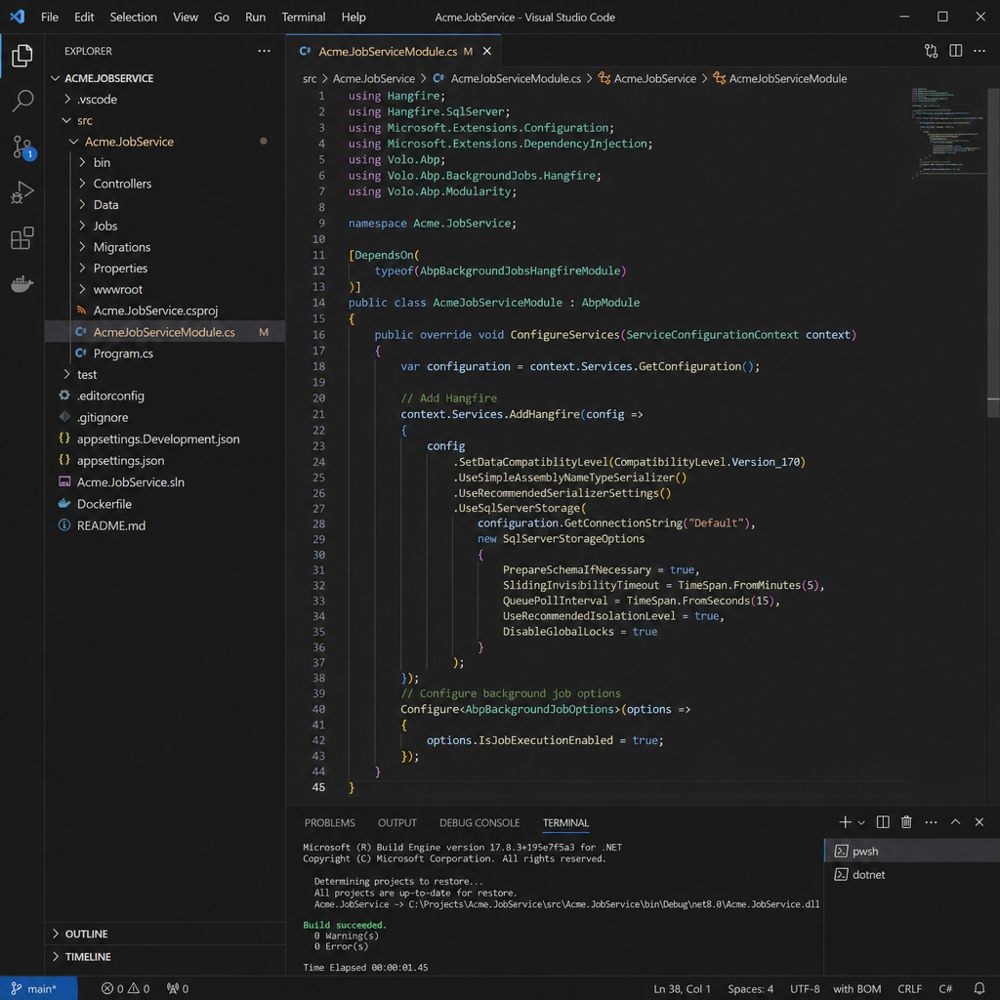
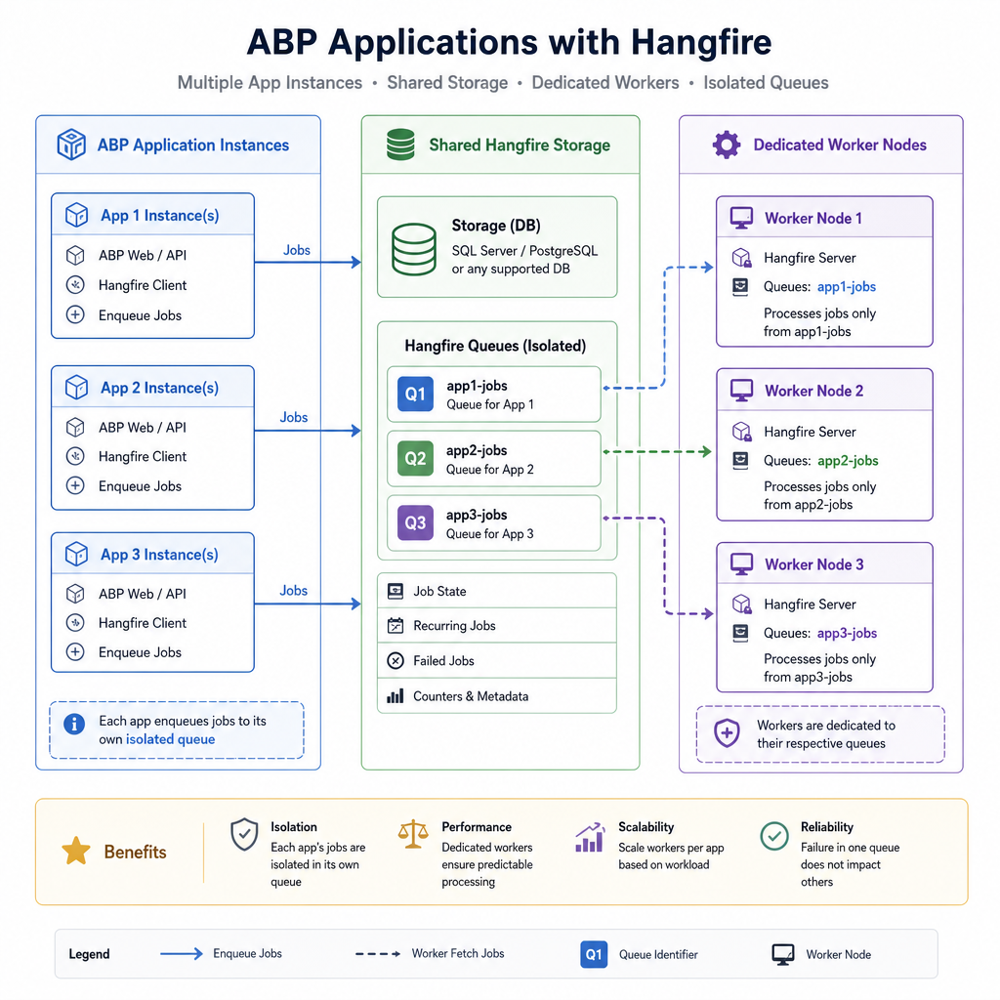
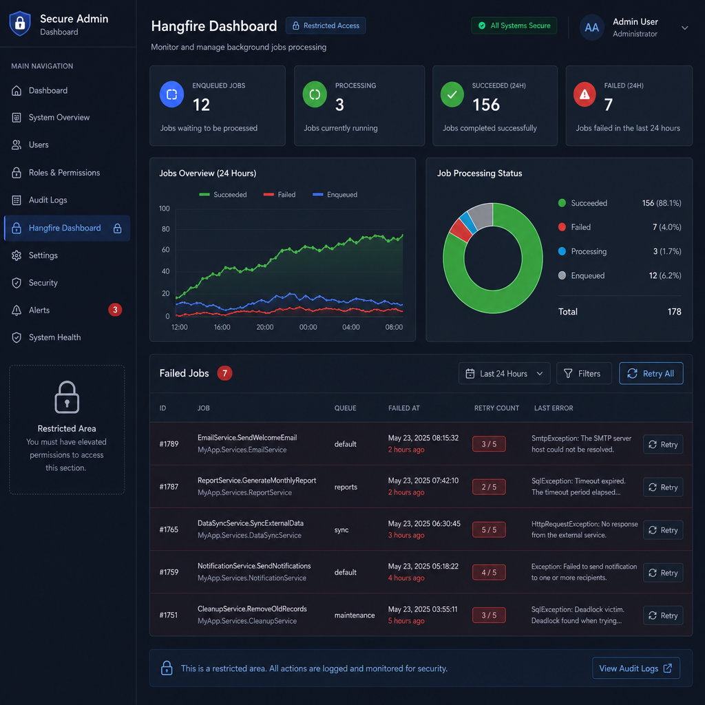

Background jobs are one of those features that look simple at first and become operationally important very quickly. Sending emails, generating reports, syncing with third-party APIs, cleaning expired data, and processing imports should not block your HTTP requests.

ABP gives you a clean abstraction for background jobs, and Hangfire gives you a production-friendly execution engine with persistence, retries, queues, and a dashboard. The useful part is that you can keep your application code aligned with ABP’s abstractions while swapping in Hangfire as the actual runner.

In this article, I’ll walk through how to implement background jobs with ABP and Hangfire, when to use each piece, and where teams usually get tripped up.

## Why use Hangfire instead of ABP's default background job manager?

ABP already has a built-in background job system, and it is perfectly fine for simple cases. But it helps to understand what you are trading.

### ABP default job manager

By default, ABP background jobs are:

- Enqueued through `IBackgroundJobManager`
- Executed in-process
- FIFO-oriented
- Single-threaded by default
- Retried automatically with increasing delays
- Stored through ABP's background job store

This is good when:

- Your app is small or moderate in workload
- You want minimal setup
- You do not need a dashboard
- You do not need advanced queue management

### Hangfire integration

When you add `Volo.Abp.BackgroundJobs.HangFire`, ABP can keep the same `IBackgroundJobManager` programming model, but Hangfire becomes the execution backend.

That gives you:

- Durable job storage
- Better operational visibility through the Hangfire dashboard
- Multiple worker servers
- Queue-based processing
- Recurring jobs and scheduling features
- A mature retry and monitoring model

In practice, Hangfire is the better choice when background processing is part of the actual system design, not just a convenience.

### Quick comparison

Use ABP default when:

- You want the simplest possible setup
- Background jobs are low volume
- A single app instance is enough
- You do not need a dashboard or queue controls

Use Hangfire when:

- You need reliability across restarts
- You run multiple instances
- You need recurring jobs or queue isolation
- You want to inspect failures and retries visually
- Background processing is operationally important




## Defining a background job in ABP

The nice part of ABP is that your job code does not need to know about Hangfire.

Start with a job arguments class:

```csharp
public class EmailSendingArgs
{
    public string To { get; set; } = string.Empty;
    public string Subject { get; set; } = string.Empty;
    public string Body { get; set; } = string.Empty;
}
```

Then create the job itself:

```csharp
using System.Threading.Tasks;
using Volo.Abp.BackgroundJobs;
using Volo.Abp.DependencyInjection;

public class EmailSendingJob : AsyncBackgroundJob<EmailSendingArgs>, ITransientDependency
{
    private readonly IEmailSender _emailSender;

    public EmailSendingJob(IEmailSender emailSender)
    {
        _emailSender = emailSender;
    }

    public override async Task ExecuteAsync(EmailSendingArgs args)
    {
        await _emailSender.SendAsync(
            args.To,
            args.Subject,
            args.Body
        );
    }
}
```

This job works with ABP’s job abstraction regardless of whether the runtime backend is the default implementation or Hangfire.

To enqueue it:

```csharp
using System;
using System.Threading.Tasks;
using Volo.Abp.BackgroundJobs;

public class NotificationAppService : ApplicationService
{
    private readonly IBackgroundJobManager _backgroundJobManager;

    public NotificationAppService(IBackgroundJobManager backgroundJobManager)
    {
        _backgroundJobManager = backgroundJobManager;
    }

    public async Task QueueWelcomeEmailAsync(string email)
    {
        await _backgroundJobManager.EnqueueAsync(
            new EmailSendingArgs
            {
                To = email,
                Subject = "Welcome",
                Body = "Your account is ready."
            },
            priority: BackgroundJobPriority.Normal,
            delay: TimeSpan.FromMinutes(1)
        );
    }
}
```

A few practical notes:

- `delay` is useful for short deferrals and back-office workflows.
- `priority` is part of ABP’s abstraction. How it maps operationally depends on the provider.
- Keep argument objects small and serializable.
- Do not pass EF entities or large object graphs into jobs.

## Setting up Hangfire in an ABP application

To integrate Hangfire, install the package and wire it into your ABP module.

### 1. Add the package

Using ABP CLI:

```bash
abp add-package Volo.Abp.BackgroundJobs.HangFire
```

Or with NuGet:

```bash
Install-Package Volo.Abp.BackgroundJobs.HangFire
```

### 2. Add the module dependency

Typically this goes into your host module, such as `HttpApiHostModule`:

```csharp
using Volo.Abp.BackgroundJobs.Hangfire;

[DependsOn(
    typeof(AbpBackgroundJobsHangfireModule)
)]
public class MyProjectHttpApiHostModule : AbpModule
{
}
```

### 3. Configure Hangfire services

In `ConfigureServices`:

```csharp
using Hangfire;
using Microsoft.Extensions.Configuration;

public override void ConfigureServices(ServiceConfigurationContext context)
{
    var configuration = context.Services.GetConfiguration();

    context.Services.AddHangfire(config =>
    {
        config.UseSqlServerStorage(
            configuration.GetConnectionString("Default")
        );
    });
}
```

If you use PostgreSQL, Redis, or another Hangfire storage provider, configure that instead. The storage decision matters because all servers that process jobs must share the same backing store.

### 4. Enable the Hangfire dashboard

In `OnApplicationInitialization`:

```csharp
using Microsoft.AspNetCore.Builder;
using Microsoft.Extensions.DependencyInjection;

public override void OnApplicationInitialization(ApplicationInitializationContext context)
{
    var app = context.GetApplicationBuilder();

    app.UseAuthentication();
    app.UseAuthorization();

    app.UseAbpHangfireDashboard();
}
```

The dashboard middleware should be added after authentication and authorization middleware.

At this point, jobs enqueued through `IBackgroundJobManager` should use Hangfire as long as the integration is correctly activated.




## End-to-end example: offloading a report export

A common use case is exporting a report that may take several seconds or minutes.

Instead of generating the file during the HTTP request:

- Save an export request record
- Enqueue a background job
- Let the job generate the file
- Notify the user when it is ready

### Arguments

```csharp
public class ReportExportJobArgs
{
    public Guid ExportRequestId { get; set; }
    public Guid UserId { get; set; }
}
```

### Job implementation

```csharp
using System.Threading.Tasks;
using Volo.Abp.BackgroundJobs;
using Volo.Abp.DependencyInjection;
using Volo.Abp.Uow;

public class ReportExportJob : AsyncBackgroundJob<ReportExportJobArgs>, ITransientDependency
{
    private readonly IReportExportAppService _reportExportAppService;

    public ReportExportJob(IReportExportAppService reportExportAppService)
    {
        _reportExportAppService = reportExportAppService;
    }

    public override async Task ExecuteAsync(ReportExportJobArgs args)
    {
        await _reportExportAppService.GenerateAsync(args.ExportRequestId, args.UserId);
    }
}
```

### Enqueue from app service

```csharp
public async Task<Guid> RequestExportAsync()
{
    var exportRequestId = GuidGenerator.Create();

    await _backgroundJobManager.EnqueueAsync(
        new ReportExportJobArgs
        {
            ExportRequestId = exportRequestId,
            UserId = CurrentUser.GetId()
        }
    );

    return exportRequestId;
}
```

This pattern scales much better than holding open a web request while doing CPU-heavy or IO-heavy work.

## Retries, exceptions, and cancellation

ABP and Hangfire both care about retries, but you should still design jobs carefully.

### How ABP behaves

With ABP background jobs:

- Unhandled exceptions trigger retries
- Retry intervals increase over time
- Default implementation uses exponential backoff behavior
- Jobs may eventually time out or be marked abandoned depending on configuration

### What this means for your code

A job should be:

- Idempotent whenever possible
- Safe to retry
- Explicit about transient vs permanent failures

For example, sending the same payment capture twice is dangerous. Sending the same “your report is ready” notification twice is annoying but manageable. Design around the difference.

### Cancellation handling

If you use `ICancellationTokenProvider`, be deliberate. If cancellation means “try again later,” let the exception flow. If cancellation means “stop and do not retry,” return gracefully.

Example:

```csharp
using System.Threading;
using System.Threading.Tasks;
using Volo.Abp.BackgroundJobs;
using Volo.Abp.Threading;

public class DataSyncJob : AsyncBackgroundJob<int>
{
    private readonly ICancellationTokenProvider _cancellationTokenProvider;

    public DataSyncJob(ICancellationTokenProvider cancellationTokenProvider)
    {
        _cancellationTokenProvider = cancellationTokenProvider;
    }

    public override async Task ExecuteAsync(int args)
    {
        var cancellationToken = _cancellationTokenProvider.Token;

        cancellationToken.ThrowIfCancellationRequested();

        await Task.Delay(500, cancellationToken);
    }
}
```

### Practical guidance

- Keep jobs short and composable
- Persist progress if the job is large
- Use domain/application services inside jobs instead of putting business logic directly into the job class
- Log enough context to diagnose retries and failures

## Recurring jobs and periodic work

Not every background task is a one-time job.

There are two different patterns:

- Background jobs: one-off, delayed, or fire-and-forget work
- Background workers: periodic or recurring work

In ABP, recurring processing is usually modeled with background workers rather than standard background jobs.

### When to use a worker instead of a job

Use a worker when you need:

- A scheduled cleanup task
- A recurring sync with another system
- Polling behavior
- A cron-like schedule

### Hangfire-backed recurring worker

With Hangfire integration, you can derive from `HangfireBackgroundWorkerBase` and provide a cron expression.

```csharp
using System.Threading.Tasks;
using Volo.Abp.BackgroundWorkers.Hangfire;

public class ExpiredSessionsCleanupWorker : HangfireBackgroundWorkerBase
{
    private readonly ISessionCleanupService _sessionCleanupService;

    public ExpiredSessionsCleanupWorker(ISessionCleanupService sessionCleanupService)
    {
        _sessionCleanupService = sessionCleanupService;

        RecurringJobId = "expired-sessions-cleanup";
        CronExpression = "0 * * * *";
    }

    public override async Task DoWorkAsync()
    {
        await _sessionCleanupService.CleanupAsync();
    }
}
```

A few details matter here:

- `RecurringJobId` should be stable and unique.
- `CronExpression` controls the schedule.
- Hangfire recurring scheduling is minute-based in normal use, so do not expect second-level precision.

### Background jobs vs background workers

A simple rule:

- If a user action creates work to do later, use a background job.
- If the system itself needs to run something on a schedule, use a background worker.




## Queue isolation and scaling across multiple instances

Once you run more than one application instance, background processing becomes an architecture concern rather than a coding detail.

### Shared storage is required

If multiple nodes are going to process Hangfire jobs, they must share the same Hangfire storage.

Typical setups include:

- Multiple web instances + one shared SQL Server storage
- Web instances enqueueing jobs + dedicated worker instances processing them
- Separate deployment slots or services sharing the same Hangfire backend

### Disabling execution on some nodes

Sometimes you want your web app to enqueue jobs but not execute them.

ABP supports this:

```csharp
using Microsoft.Extensions.DependencyInjection;
using Volo.Abp.BackgroundJobs;

public override void ConfigureServices(ServiceConfigurationContext context)
{
    Configure<AbpBackgroundJobOptions>(options =>
    {
        options.IsJobExecutionEnabled = false;
    });
}
```

This is useful when:

- You run dedicated worker processes
- You want predictable resource allocation
- You do not want front-end nodes competing for background work

### Queue prefixing in clustered environments

If multiple applications share the same Hangfire storage, isolate queues intentionally.

For Hangfire integration in ABP, use `AbpHangfireOptions.DefaultQueuePrefix` to avoid queue collisions between different applications or environments.

That matters more than teams expect. Without isolation, staging and production can end up looking at the same queues if storage is misconfigured.

### Queue routing

Hangfire supports multiple queues, and ABP’s Hangfire integration can route jobs based on conventions or attributes.

In some scenarios, you may want specific jobs to go to specific queues, for example:

- `emails`
- `exports`
- `integration`
- `critical`

This is especially helpful when one queue can become noisy and starve more important work.




## Securing the Hangfire dashboard

The Hangfire dashboard is extremely useful, but it is also an operations surface. Do not expose it casually.

ABP provides authorization support for the dashboard via `AbpHangfireAuthorizationFilter`.

A typical setup is to:

- Require authentication
- Restrict by permission or role
- Optionally consider tenant-specific access rules

Example:

```csharp
app.UseAbpHangfireDashboard("/hangfire", new DashboardOptions
{
    Authorization = new[]
    {
        new AbpHangfireAuthorizationFilter(requiredPermissionName: "Administration.Hangfire")
    }
});
```

Even if your app is internal, treat the dashboard like an admin area:

- Put it behind authorization
- Avoid exposing it publicly without network restrictions
- Audit who can retry or inspect jobs

## Common pitfalls and behavior differences

This is the part that usually saves the most time.

### 1. Jobs still land in `AbpBackgroundJob` instead of Hangfire

If Hangfire is not properly activated, ABP may continue using its native background job storage and you will see jobs in the `AbpBackgroundJob` table instead of Hangfire storage.

Check these first:

- The `Volo.Abp.BackgroundJobs.HangFire` package is installed
- `AbpBackgroundJobsHangfireModule` is added in `[DependsOn]`
- `AddHangfire(...)` is configured correctly
- The application starts with the expected module graph

If any of those are missing, you may think you are using Hangfire while you are actually still on the default provider.

### 2. Passing large or complex objects into jobs

Keep job args small. Prefer identifiers over rich objects.

Good:

- `OrderId`
- `UserId`
- `ExportRequestId`

Bad:

- Full EF entities
- Large DTO graphs
- Objects with lazy-loading behavior or runtime-only state

### 3. Non-idempotent job logic

Retries will happen. If running the same job twice can corrupt data, redesign the workflow.

Common fixes:

- Add a processed flag
- Use unique constraints where appropriate
- Check prior execution status before applying side effects
- Make external calls with idempotency keys when supported

### 4. Assuming recurring jobs run with exact timing

Hangfire recurring jobs are cron-based and typically evaluated on minute boundaries. That is fine for most scheduled business work, but it is not a real-time scheduler.

### 5. Ignoring queue isolation in multi-app environments

If several apps share one Hangfire store, queue naming and prefixing must be explicit. Otherwise, one application can accidentally process another application's jobs.

## When to use / When NOT to use ABP + Hangfire

### Use ABP + Hangfire when

- You want ABP-friendly job abstractions with a stronger execution backend
- You need operational visibility and retry inspection
- You run multiple instances or worker nodes
- You have recurring background tasks
- Your jobs are part of business-critical workflows

### Do NOT use it when

- The work must complete synchronously before responding to the user
- The task is so trivial that plain in-memory processing is enough
- You need event streaming rather than job scheduling
- You need ultra-low-latency real-time processing with very tight timing guarantees

For many line-of-business systems, ABP + Hangfire hits a very practical middle ground: easy enough to implement, strong enough to operate.

## A production-minded implementation checklist

Before shipping, verify these points:

- Jobs are enqueued through `IBackgroundJobManager` unless you explicitly need Hangfire-specific APIs
- Job arguments are small and serializable
- Job logic is retry-safe and preferably idempotent
- Hangfire storage is shared by all processing nodes
- Dashboard access is restricted
- Queue names or prefixes are isolated per app/environment
- Long-running jobs are split into manageable steps where possible
- You know which nodes execute jobs and which only enqueue them

## TL;DR

- ABP gives you a clean background job abstraction; Hangfire gives you the production-grade execution engine.
- Keep using `IBackgroundJobManager` for most jobs so your application code stays provider-independent.
- Use background jobs for one-off work and Hangfire-backed background workers for recurring tasks.
- In multi-instance deployments, shared storage, queue isolation, and dashboard security are not optional.
- If jobs still go to `AbpBackgroundJob`, your Hangfire integration is probably not fully activated.