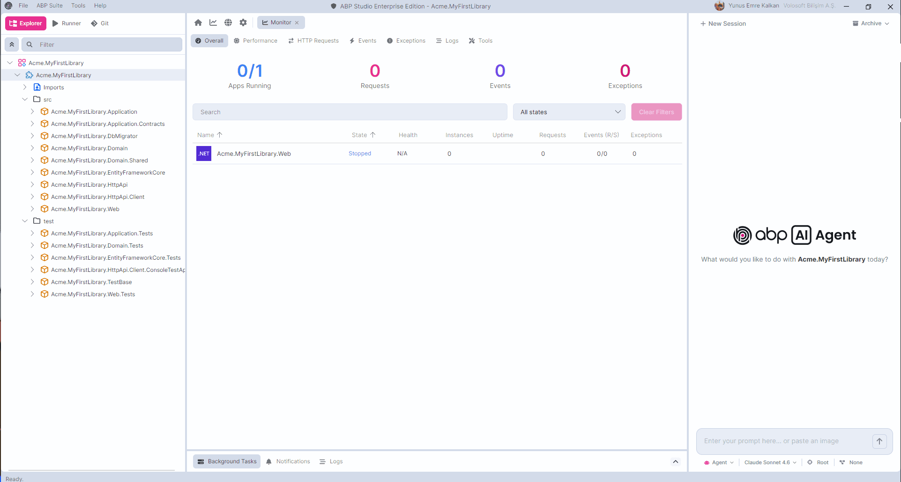

# Deep Dive on ABP AI Agent: The Complete Series

ABP Studio is a development platform built around ABP Framework. With the introduction of **ABP AI Coding Agent**, it became something more: a platform where an AI agent works inside the same environment you already use to build, run, monitor, and ship ABP solutions.

General-purpose AI coding tools are excellent for horizontal, file-shaped work. They read source files, edit them, and run shell commands. But ABP solutions are **system-shaped**, not just file-shaped. A typical ABP solution is split across multiple modules and layers with strict dependency rules, composed of many runnable units (HTTP services, gateways, identity servers, background workers, Docker containers), and built on a strong set of conventions: aggregate roots, repositories, application services, DTOs, permissions, localization, event bus, distributed cache, and background jobs.

A generic agent has none of that vocabulary. It does not know what a module is, which project is the Domain layer, or that an `ApplicationService` should not depend on a `DbContext` directly. It cannot start your microservices, gateway, and auth server together. It cannot tell you that the latest edit caused a runtime exception in the Identity service, because it has no concept of a running application.

ABP AI Coding Agent was built to close exactly that gap. The agent is born inside a platform that already understands modules, run profiles, builds, migrations, proxies, Docker containers, monitoring, and Git workflows, and it uses every one of them.

We wrote a **nine-part deep dive series** to explain how each part of this system works, not as a product tour, but as a practical look at the decisions, controls, and architecture behind the experience.

## The Series

1. **[Agent, Plan and Ask Modes](https://abp.io/community/articles/deep-dive-on-abp-ai-agent-1-agent-plan-and-ask-modes-62wteg9t)** — The three interaction modes that control how much action the agent is allowed to take: **Ask** for understanding (read-only), **Plan** for designing the approach before editing, and **Agent** for full implementation with builds, tools, and iteration.

2. **[Supported AI Models + Usage Recommendations](https://abp.io/community/articles/deep-dive-on-abp-ai-agent-2-supported-ai-models-in-abp-3krbc7yc)** — How ABP Studio separates models by role (main, research, browser, text processor, Git review) and why treating model selection as a practical decision based on the task leads to a better balance of capability, speed, and cost.

3. **[Rules, Skills and Lessons](https://abp.io/community/articles/deep-dive-on-abp-ai-agent-3-rules-skills-and-lessons-ai6kxubt)** — The three mechanisms that give the agent solution-specific memory: **Rules** (always-on conventions), **Skills** (on-demand procedures), and **Lessons** (corrections the agent records and carries forward).

4. **[Integrated ABP Studio Tools](https://abp.io/community/articles/deep-dive-on-abp-ai-agent-4-integrated-abp-studio-tools-be2xa2om)** — The tools that connect the agent to ABP Studio's runtime environment: monitoring (exceptions, logs, requests), applications, containers, tasks, and build actions, with a practical walkthrough showing the difference between debugging with and without tool access.

5. **[MCP (Model Context Protocol)](https://abp.io/community/articles/deep-dive-on-abp-ai-agent-5-mcp-model-context-protocol-trb9o4ev)** — How MCP extends the agent beyond the solution boundary to reach external systems like Prometheus, SEO analyzers, or documentation services, with per-tool enable/disable controls and stdio/HTTP server support.

6. **[ABP Studio Git Integration](https://abp.io/community/articles/deep-dive-on-abp-ai-agent-6-abp-studio-git-integration-09tr41ec)** — The full Git loop inside ABP Studio: branching, diffing, AI-generated commit messages, AI code review on staged changes, GitHub issue context for starting tasks, and pull request feedback for addressing reviewer comments.

7. **[Scopes](https://abp.io/community/articles/deep-dive-on-abp-ai-agent-7-scopes-tfqtkdzu)** — How AI Scopes restrict the agent's working area to specific modules, packages, or solution areas, reducing unrelated exploration, preventing accidental edits, and making diffs easier to review.

8. **[Parallel Agent Execution](https://abp.io/community/articles/deep-dive-on-abp-ai-agent-8-parallel-agent-execution-1o0cik6g)** — Running multiple agent sessions at the same time, each with its own mode, model, scope, and workflow, plus read-only research subagents that fan out inside a single session.

9. **[Workflows](https://abp.io/community/articles/deep-dive-on-abp-ai-agent-9-workflows-7jo1adb1)** — Repeatable before/after steps that wrap agent runs: start containers, build packages, add migrations, generate proxies, restart applications, and run validation tasks, so the agent focuses on the code change while the platform handles the deterministic parts.

## The Bigger Picture

Each article focuses on one feature, but the real value comes from how they work together.

Modes decide how much action the agent takes. Models decide which brain handles the work. Rules, Skills, and Lessons shape what the agent knows. Tools and MCP extend what it can reach. Scopes define where it can work. Workflows define what happens around the work. Git Integration makes the result reviewable and recoverable. Parallel Execution lets multiple tasks move forward at the same time.

That is the ABP AI Coding Agent experience: **not a single AI button, but a set of controls built into a platform that already understands how ABP solutions are developed, run, and maintained.**
