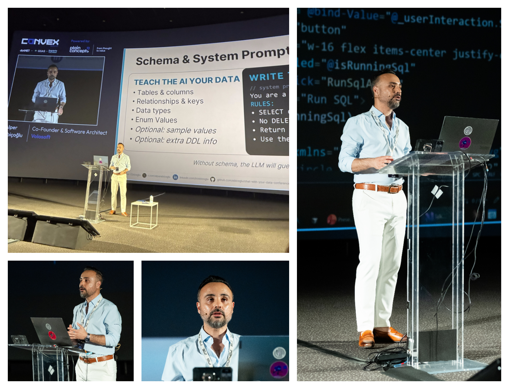
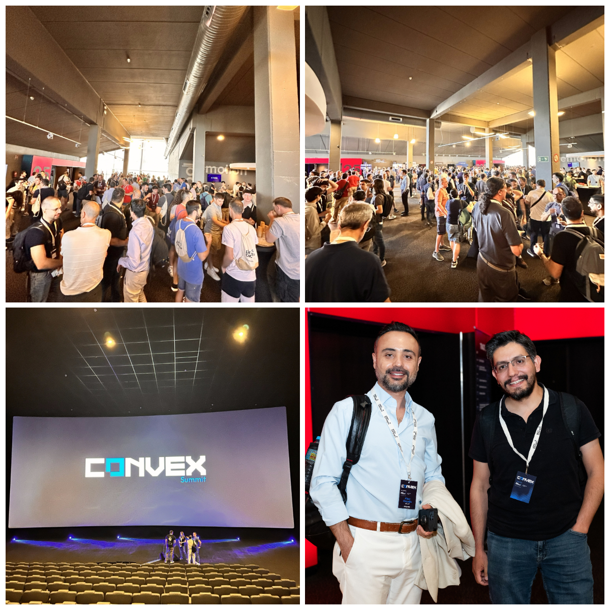

# My Speaker's View of  CONVEX Summit 2026 Madrid

## Where AI Hype Met Enterprise Reality

**Meta description:** My personal speaker’s view of CONVEX Summit 2026 in Madrid, where AI, .NET, software architecture, and enterprise product thinking came together around real-world technology challenges.

**SEO slug:** `convex-2026-ai-enterprise-reality-speaker-experience`

Hi, I'm here for another conference reviews. This time I attended [Convex Summit 2026 Developer](https://www.convexsummit.com/) conference, held in the capital city of Spain, Madrid. It was my first talk in Madrid. The organizer [Plain Concepts](https://www.plainconcepts.com/) arranged a 2 days conf with 3 parallel sessions. 2 of the sessions were in Spanish and one of them was English. The conf dates were 17, 18 June 2026. It was in a very big cinema. In Lithuania I also spoke in a cinema, I guess it's better to arrange a conf in a cinema because of asthenosphere, acoustic and state visibility for visitors.

There is a small moment before every conference talk when the room becomes quiet, the slides are ready, and you suddenly remember why the topic matters. For me, that moment happened at Convex. My topic was “Turn any database into a conversational reporting engine.” I can admit it was a cool talk. But I was also there as a listener, a software architect, and someone trying to understand where enterprise AI is really going after the first wave of demos and experiments. CONVEX was interesting because it brought software development, architecture, and AI into the same conversation. These topics are often discussed separately, but in real companies they are tightly connected. AI features do not live in isolation. They live inside applications, databases, identity systems, permission models, workflows, dashboards, and business expectations.  That was the real theme I felt throughout the event.

## Speaking at CONVEX

My talk focused on a question that is becoming more important for enterprise software teams:

> What if users could ask their business data questions in natural language and receive safe, useful, validated answers?

I started my slide with **Sobrino de Botin restaurant**. It's the oldest restaurant in the world according to the Guinness Book of World Records. Sobrino de Botín **has been open since 1725**. The taste never changed, the restaurant **is keeping the same classic taste with the same cooking techniques** but in the age of AI; we developers should **use new techniques for reporting**. We are not running a restaurant and this is how the development works. Adjust to the tech standards, new techniques and recent practices.

And in one part of my talk, I need to ask questions like “Show me the top customers by revenue this quarter.” So the LLM answers in my language. And I learnt some Spanish sentences before the conf. Even for this I used AI. So I translated 10 different English sentences to Spanish. Later I asked ChatGPT: "*Can you score my pronunciation for these sentences.*". ChatGPT gave the most ratings to 3 of my sentences' prouncations. And I talked those during my interview with my reporting AI tool. And that was fantastic eye-catching moment of my talk.

*My session focused on building conversational reporting experiences without giving up control, validation, or security.*

I asked the attendees how many of you have written SQL, created reporting screen, and %80 of people wrote SQL and created reporting UIs. And same amount of people also use .NET. 

> **AI can make data more accessible, but architecture must define the boundaries.**

---

## What I Learned From the Other Sessions

There was a track with completely English sessions. One of the reasons I enjoyed Convex was that the English sessions did not treat AI as magic.

The strongest message I heard across different sessions was this:

>  **AI is becoming part of real systems and real systems have constraints.**

And I can see, software development is rapidly evolving with AI agentic tools. 

> **We cannot say development is dead, but hand-made development is dead.** 

From now on we'll use our time less on typing and more on thinking about features, user experiences and robust infrastructure. 

**In the age of AI, writing code by hand is the software equivalent of sending a fax to prove commitment.**

For a while, many AI discussions were focused on what AI could generate: code, tests, text, SQL, documentation, designs. 
At CONVEX, the more interesting question was: 

**What happens after AI generates something?** 

- Who validates it? 
- Who owns the decision? 
- Can we say I don't know to a question about how that works!?
- If something blows up or happens a data leakage, who is accountable for it?
- How does it fit into the architecture? 
- How do we make it useful for the business instead of impressive for five minutes?

### Architecture is also a people problem

One session that stayed with me used the idea of the **Prisoner’s Dilemma** to describe the tension between product priorities and architectural work. The slide I captured showed a collaboration payoff matrix: when product management optimizes only for short-term business value, architecture can suffer; when architects focus only on architecture, market opportunity can be lost. The win-win scenario appears when both sides optimize for business value and architecture together.

*The architecture sessions connected technical decisions with incentives, collaboration, and long-term system health.*

Another slide suggested practical ways forward: learn the business, understand the competition, avoid “big bang” changes, work incrementally, create options, make trade-off decisions with the business and **become a business value creator** rather than someone who only responds to requests.

I liked that message. Architecture is much more valuable when it helps the business create options, not when it only explains why something is risky.

---

### Power, knowledge and decision-making

Another interesting thread was about power in organizations. One talk referenced **Power-With**, I found it useful because it shifts the conversation away from control and toward collaboration. The slides connected power with access to knowledge, authority, charisma and the way decisions move through an organization.

*Some of the most interesting moments connected architecture with people, incentives, and organizational reality.*

There are 2 powers:

1. **Power-Over**: Conquer other people's mind, control, force and order for a work output.
2. **Power-With**: Co-operate with others, use everyone's power into a big power, move together for a work output.

This may sound less technical than a database, a framework, or a deployment pipeline. But in practice, many technical decisions fail or succeed because of organizational dynamics. A clean architecture can still fail if teams are not aligned. 

> A promising AI feature can still fail if no one trusts the output.

### So Let's Think What's Charisma at Work

- **What's charisma actually?** Let me tell you my opinion; charisma is experience, wisdom, grace, listening more and speaking less, way of looking to life, trustability (reliability), being a role model and an inspiration to others.
- **Why charisma is important?** It makes your words to be listened by other people **naturally** (without any need of dictation).

One slide quoted the idea that knowledge workers “think for a living.” Another referenced Peter Naur’s **Programming as Theory Building**, where program text and documentation are not always enough to carry the most important design ideas. That felt very relevant in the age of AI-generated code. If code becomes easier to produce, shared understanding becomes even more valuable.

As a summary;  AI can often understand the architecture from the code. What it usually can't know reliably is **why** 

- the architecture ended up that way; the design decisions
- trade-offs
- historical context
- assumptions that exist mostly in the team's shared understanding rather than in the code itself.

---

### What AI Agents can do and cannot do?!

One of the most thought-provoking slides at the conf explored the current boundaries of AI agents. Instead of asking whether AI will replace humans, it asked a more interesting question: **What can AI agents actually do today, what can't they do and which limitations might disappear over time?**

The first column listed the things AI agents already do well. They can execute tasks reliably without getting tired, maintain context across long-running work, report progress, detect problems, follow established processes, generate alternatives, document their work, and scale by running thousands of instances simultaneously. In short, AI excels at **execution**.

The second column focused on capabilities that are fundamentally human today. AI can perform the role of a manager, mentor, or teammate, but it cannot truly *be* one. It cannot be held accountable for its decisions, earn trust through years of shared experience, genuinely care about an outcome, feel the weight of failure, or belong to a team. It can disagree or refuse a request, but not from genuine conviction or personal values. These qualities come from human relationships, responsibility, and lived experience, not from generating the next token.

The third column added an important nuance. It wasn't titled "Impossible," but rather "Cannot, but maybe will one day." Some capabilities are already beginning to emerge. Multi-agent systems can delegate work to other agents. Better memory and continuity may allow AI to build trust over time. Multimodal models are becoming better at reading context, and reinforcement learning is an early form of learning from mistakes. The point wasn't that these problems are solved, but that some of today's limitations may become tomorrow's capabilities.

The overall message was refreshingly balanced. AI agents should not be viewed as human employees, nor should they be underestimated. They are exceptional at executing work at scale, but organizations are built on more than execution. Trust, accountability, judgment, conviction, and belonging remain deeply human qualities, for now.

*The AI agent discussion was interesting because it did not only focus on automation; it also highlighted accountability, trust, judgment, and team dynamics.*

That is a healthy way to talk about AI. Not “*AI will replace everything*,” and not “*AI is useless.*” 

> **The real question is where AI can help a team and where humans still need to own the decision.**

### Better decisions need better records

I also followed sessions about architecture principles and decision records. One slide explained principles as priorities, beliefs, guardrails and a way to connect requirements to architectural decisions. Another used a simple architectural decision example: **Data Store per Service**, where each service owns its data and other services access it through APIs or events instead of direct database queries.

*Architecture principles were presented as guardrails that connect requirements, trade-offs, and decisions.*

Let me first define what's ADR:.. An **ADR (Architecture Decision Record)** is a short document that explains **an important technical decision, why it was made, and what the consequences are**. See the [Microsoft Document about ADR](https://learn.microsoft.com/en-us/azure/well-architected/architect-role/architecture-decision-record).

> **Code tells you *what* the system does. An ADR tells you *why* it was designed that way.**

This connected nicely with another slide about ADRs. A minimal ADR, based on Michael Nygard’s format, includes a name, status, context, decision, and consequences. A more comprehensive ADR can also include related requirements, assumptions, constraints, options, reasoning and trade-offs.

*The ADR discussions were a reminder that good architecture is not only about making decisions, but also about preserving the reasoning behind them.*

For .NET teams, these ideas are practical. AI can sit on top of strong foundations around backend services, identity, data access, cloud integration, and enterprise applications, but it should not bypass them.

If anything, AI makes good engineering discipline more important.

## The Conference Experience

The venue, Kinépolis Ciudad de la Imagen in Madrid, gave the conference a different feeling from a typical hotel-based event. The rooms, stage, and screens made the sessions feel cinematic. Outside the session rooms, the networking areas were active throughout the day. People were not only exchanging LinkedIn profiles; they were continuing the technical debates from the talks.

*The networking areas were busy between sessions, creating space for conversations beyond the formal agenda.*

I met people from my country as well from Bosch and Aselsan companies...For me, the most valuable conversations happened after the talk. I made new friends and learn what other people do.

## My Key Takeaways

1. **AI features need data boundaries.** The more natural the interface becomes, the more important permissions, context, and allowed actions become.
2. **Natural language is becoming a product interface.** Users increasingly want answers, not get lost in the UI and not navigation paths.
3. **Architecture is becoming more important, not less.** AI can accelerate delivery, but it cannot remove product constraints, security requirements, or organizational complexity. 

   > When calculator first invented they didn't think problem solving finished with this invention, people use more time to solve problems rather then calculating....
4. **Decisions need memory.** Principles, ADRs, trade-offs and exceptions help teams preserve reasoning.
5. **Conferences still matter.** A hallway discussion after a session can sometimes teach you more than a full article or video. It's **a way of motivation**, a way of socializing for developers. You see what other do, you discuss with them, you know your customers and you know where you're at development.

## My Cultural Visits

I visited Toledo and Madrid's most important tourist attractions and museums. Now I know way much better then I knew before about Spanish culture and lifestyle. But this is the most impressive moment for me. As you may know I'm Turkish. My grand grandfathers were Ottomans coming from Mongolia to Anatolia. In 1571 the Ottomans were in a war with Spain, Genoa, Malta and Italy. The battle was in the sea near Greece. It's called Sea Battle of Lepanto. In the below pictures, you can see the Ottoman's highest level sea commander's personal items. Wwe call him **Kaptan-ı Derya** -the captain of seas-. He died in this war. For those who wants to see it; it's in Royal Palace of Madrid and the items are in Royal Armoury department.

If you're interested in this war, you can also read this part:

### The Battle of Lepanto ⚔

The Ottoman army was invading Cyprus. Angered by this, European countries asked Spain, one of the strongest kingdoms of the period for help. To retake the island, a Holy Christian fleet was assembled under Spanish leadership. On 7 October 1571, the forces arrived at the Gulf of Patras in Greece for what would become known as the Battle of Lepanto. On one side was the Ottoman army, commanded by Ali Pasha (the Grand Admiral). On the opposing side were the major European powers: Spain, Venice, the Papacy, Genoa, the Knights of Malta, and Italy. It would become the last major naval battle fought with oared warships. The Ottomans lost the battle and Sokollu Mehmed Pasha (he's normally Serbian Turk and he's the most powerful manager after Sultan) said the following famous saying: “*You have cut off our beard, but we have cut off your arm. A beard grows back.*”  More than 200 Ottoman ships were lost. Tens of thousands of soldiers were killed or captured. In the below photograph, you will see war trophies taken from Ali Pasha. In Spain, this battle would be called “*La Defensa de la Cristiandad*” means “*The Defense of Christianity*” and would be used for propaganda for years. These trophies were used as symbols. The first time I saw the exhibit in a museum, I stood in front of it for 15–20 minutes, simply looking at it.

### What's the thing with Cervantes and Ottomans?

There may be one more little-known detail about the Battle of Lepanto. Miguel de Cervantes, the author of the famous novel Don Quixote, also took part in this battle. During the conflict, Cervantes served aboard the Spanish ship Marquesa. Despite suffering from a fever, he insisted on joining the battle. The Ottoman army wounded Cervantes in the chest and left arm. As a result, he lost much of the use of his left hand. For this reason, he became known as “*El manco de Lepanto*,” meaning “*the one-handed hero of Lepanto.*”

### Bullfighting 🦬

I met a real matador in Toledo, and after talking to him, my perspective on everything changed dramatically!

From the outside, it looks like nothing more than a “brutal spectacle,” but apparently there is a surprisingly deep philosophy behind it. These were the most interesting things I took away from what the matador told me:

- **Bulls don’t react to the color red:** They are actually color-blind. What triggers them is the movement of the cape, not its color. Red is purely for visual aesthetics.
- **The selected bull is a special, wild breed:** The animal has almost never seen a human before entering the arena. It sees the matador as an enemy and wants to destroy him.
- **The greatest honor is to survive:** If a bull shows exceptional nobility and courage, the audience waves white handkerchiefs to ask for its pardon. That bull never enters the arena again and spends the rest of its life like a king on a farm.
- **A dance with death:** Matadors do not see this as a sport, but as a way of confronting death. When making the most critical strike, the matador must also put his own life at risk, he cannot simply stab the bull from behind. He has to face the bull head-on, bravely. In that sense, there is a strange bond of respect between them. The bull is powerful, but the matador is intelligent. He cannot defeat it through strength, only through skill, timing, and agility.
- **It is a controversial subject**, but hearing it firsthand in its own context changed my perspective considerably. At a time when animal rights are more important than ever, this tradition still continues. And I have now learned that bullfighting has a much deeper philosophy behind it than I had realized.

## Closing

I left Convex 2026 and Spain with new ideas, useful feedback, and a stronger belief that the next phase of enterprise AI will be less about impressive demos and more about trusted systems.

For me, the most interesting AI features are not the ones that look magical. They are the ones that quietly solve a real problem, respect the architecture around them, and help users make better decisions.

Thank you to the Convex organizers, the speakers, and everyone who joined my session or continued the conversation afterward.

Madrid was a great place to talk about AI, .NET, architecture, and the future of enterprise software. I hope to see many of you again at the next event.

---
