# My Speaker's View of  CONVEX Summit 2026 Madrid

## Where AI Hype Met Enterprise Reality

**Meta description:** My personal speaker’s view of CONVEX Summit 2026 in Madrid, where AI, .NET, software architecture, and enterprise product thinking came together around real-world technology challenges.

**SEO slug:** `convex-2026-ai-enterprise-reality-speaker-experience`

[Convex Summit 2026 Developer](https://www.convexsummit.com/) conference held in the capital city of Spain, Madrid for the first time. [Plain Concepts](https://www.plainconcepts.com/) company organized this event. 2 days with 3 parallel sessions. 2 of the sessions were Spanish and one of them was English. It was organized on 17, 18 June 2026.

There is a small moment before every conference talk when the room becomes quiet, the slides are ready, and you suddenly remember why the topic matters.

For me, that moment happened at CONVEX Summit 2026 in Madrid.

I was there as a speaker, presenting my session **“Chat with Your Data: Turn any database into a conversational reporting engine.”** But I was also there as a listener, a software architect, and someone trying to understand where enterprise AI is really going after the first wave of demos and experiments.

CONVEX was interesting because it brought software development, architecture, and AI into the same conversation. These topics are often discussed separately, but in real companies they are tightly connected. AI features do not live in isolation. They live inside applications, databases, identity systems, permission models, workflows, dashboards, and business expectations.

That was the real theme I felt throughout the event.

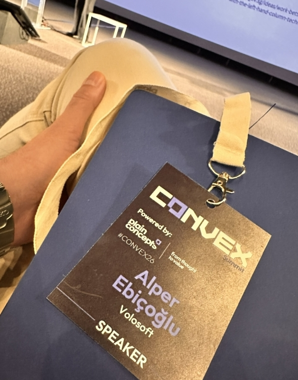

*The speaker badge made the event feel real before the session even started.*

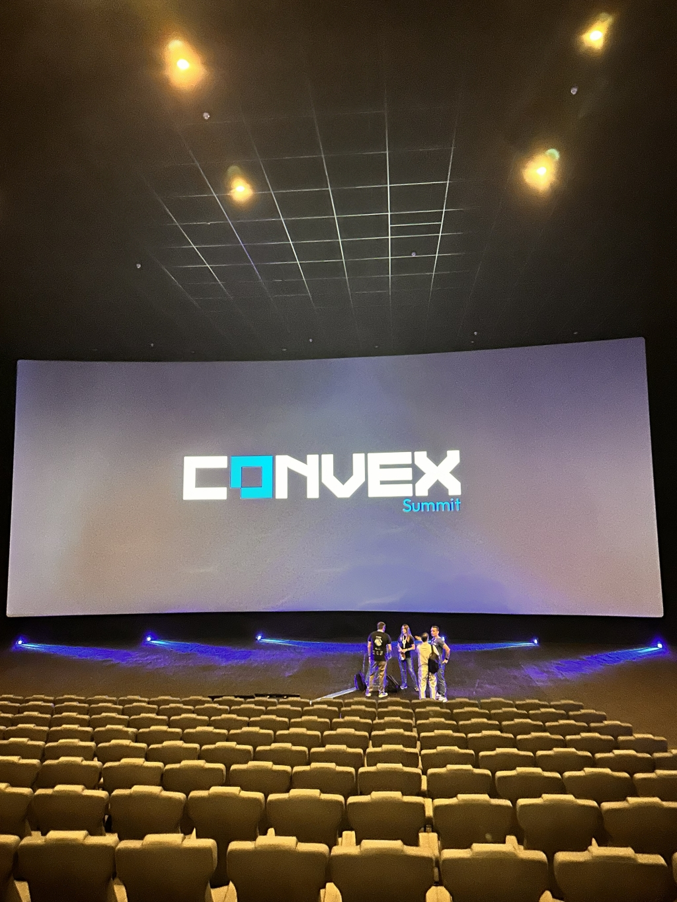

*The stage setup reflected the scale of the event: three communities, one shared conversation.*

## Speaking at CONVEX

My talk focused on a question that is becoming more important for enterprise software teams:

**What if users could ask their business data questions in natural language—and receive safe, useful, validated answers?**

I started my slide with Sobrino de Botin restaurant. It's the oldest restaurant in the world according to the Guinness Book of World Records. Sobrino de Botín **has been open since 1725**. The taste never changed, the restaurant **is keeping the same classic taste with the same cooking techniques**, but in the age of AI; we developers should **use new techniques for reporting**. We are not running a restaurant and this is how the development works. Adjust to the tech standards, new techniques and best practises.

And in one part of my talk, I need to ask questions like “Show me the top customers by revenue this quarter.” An AI model generates SQL. The system runs it. The user gets a result. And I learnt some Spanish sentences before the conf. Even for this I used AI. So I translated 10 diffferent English sentences to Spanish. Later I asked ChatGPT: "Can you score my pronunciation for these sentences.". ChatGPT gave the most ratings to 3 of my sentences' prouncations. And I talked those during my interview with my reporting AI tool. And that was fantastic eye-catching moment of my talk.

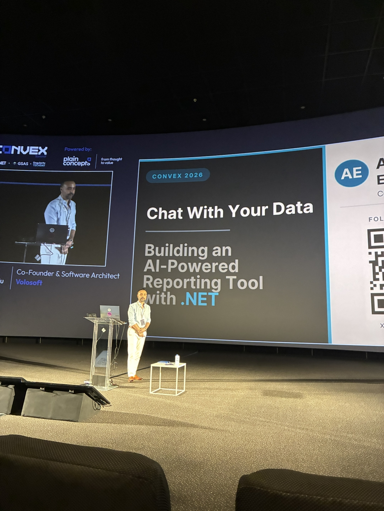

*My session was about building an AI-powered reporting tool that can understand a database and turn questions into controlled reporting workflows.*

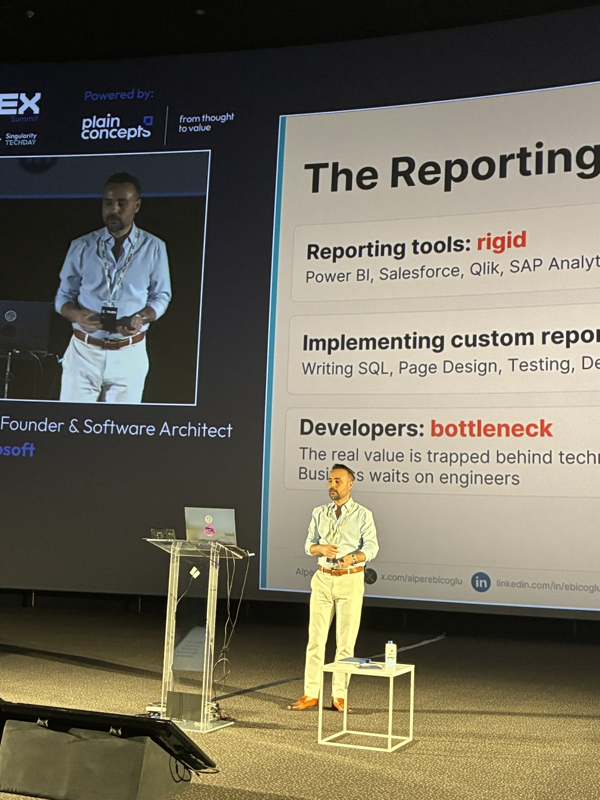

*My session focused on building conversational reporting experiences without giving up control, validation, or security.*

I asked the attendees how many of you have written SQL, created reporting screen, and %80 of people wrote SQL and created reporting UIs. And same amount of people also use .NET. 

One of my slides showed the reporting problem in a very familiar way. Traditional reporting tools are powerful, but they can be rigid. In many companies, a new report still means writing SQL, designing a page, testing the output, deploying a change, and waiting for a developer to become available. The result is that business users wait, developers become the bottleneck, and valuable data stays trapped behind technical complexity.

The approach I shared has several layers.

First, the system needs **schema awareness**. The AI should understand tables, columns, relationships, keys, data types, and enum values. Depending on the system, it may also need safe sample values or extra DDL information. Without that structured context, natural-language reporting becomes fragile.

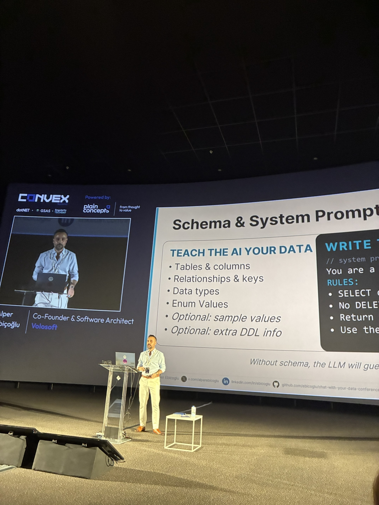

*One of the most important parts of the talk was schema and system-prompt design: tables, columns, relationships, keys, data types, enum values, and controlled rules for query generation.*

Second, it needs **intent interpretation**. Users do not always speak in database terms. They ask business questions. A good reporting engine should translate business language into technical meaning without forcing users to know the data model.

Third, it needs **safe SQL generation**. Letting an LLM freely generate and execute SQL is risky. The model should operate under strict rules: read-only access, no destructive operations, tenant-aware filtering, query limits, validation before execution, and clear logging.

Fourth, it needs **useful output**. A raw result table is not always enough. Sometimes the user needs an Excel file, a chart, a summary, or a clarification question.

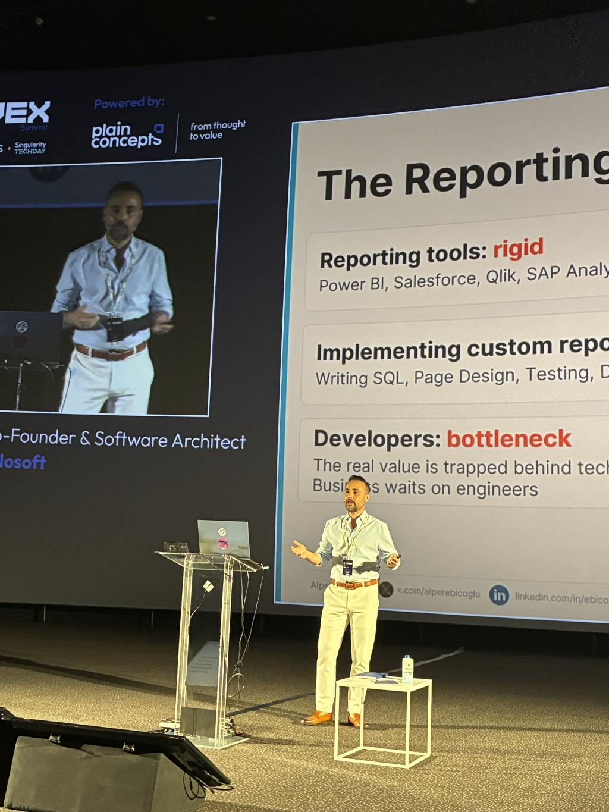

Most business users do not want to “build a report.” They want an answer. But as developers and architects, our job is to make that experience safe, explainable, and reliable.

AI can make data more accessible, but architecture must define the boundaries.

## What I Learned From the English Sessions

There were 3 parallel session tracks. One of them was completely English sessions. One of the reasons I enjoyed CONVEX was that the English sessions did not treat AI as magic.

The strongest message I heard across different sessions was this:

**AI is becoming part of real systems, and real systems have constraints.**

And I can see, software development is rapidly evolving with AI agentic tools. 

> We cannot say development is dead, but hand-made development is dead. 

From now on we'll use our time less on typing and more on thinking about features, user experiences and robust infrastructure. 

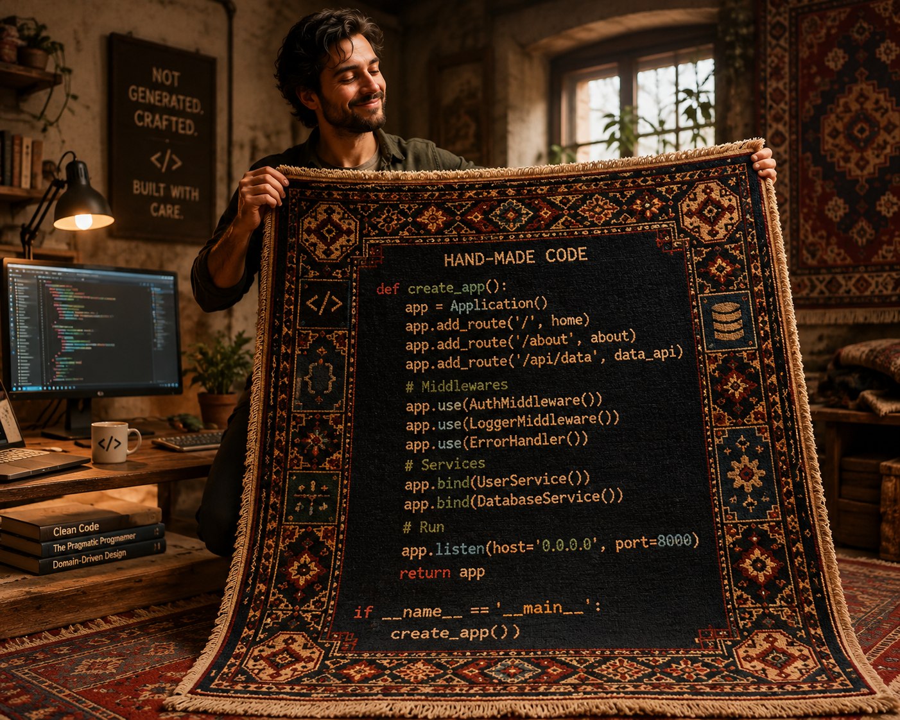

For a while, many AI discussions were focused on what AI could generate: code, tests, text, SQL, documentation, designs. At CONVEX, the more interesting question was: 

**What happens after AI generates something?** 

- Who validates it? 
- Who owns the decision? 
- How does it fit into the architecture? 
- How do we prevent data leakage? 
- How do we make it useful for the business instead of impressive for five minutes?

### Architecture is also a people problem

One session that stayed with me used the idea of the **Prisoner’s Dilemma** to describe the tension between product priorities and architectural work. The slide I captured showed a collaboration payoff matrix: when product management optimizes only for short-term business value, architecture can suffer; when architects focus only on architecture, market opportunity can be lost. The win-win scenario appears when both sides optimize for business value and architecture together.

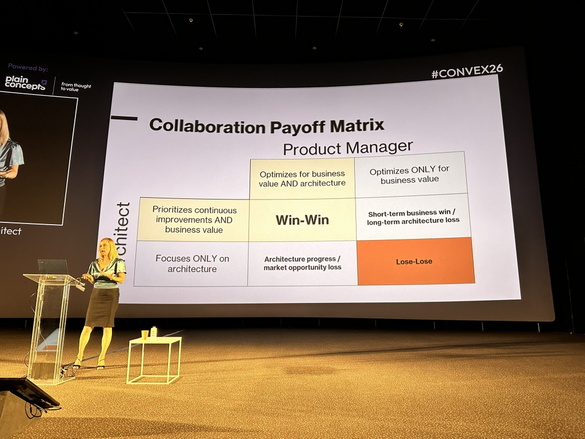

*The architecture sessions connected technical decisions with incentives, collaboration, and long-term system health.*

Another slide suggested practical ways forward: learn the business, understand the competition, avoid “big bang” changes, work incrementally, create options, make trade-off decisions with the business, and **become a business value creator** rather than someone who only responds to requests.

I liked that message. Architecture is much more valuable when it helps the business create options, not when it only explains why something is risky.

### Power, knowledge, and decision-making

Another interesting thread was about power in organizations. One talk referenced **Power-With**, an idea I found useful because it shifts the conversation away from control and toward collaboration. The slides connected power with access to knowledge, authority, charisma, and the way decisions move through an organization.

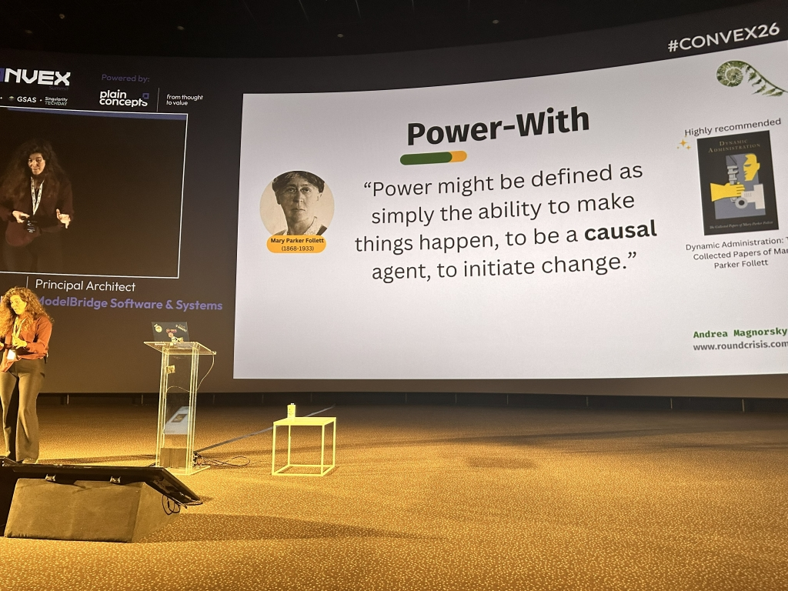

*Some of the most interesting moments connected architecture with people, incentives, and organizational reality.*

This may sound less technical than a database, a framework, or a deployment pipeline. But in practice, many technical decisions fail or succeed because of organizational dynamics. A clean architecture can still fail if teams are not aligned. A promising AI feature can still fail if no one trusts the output.

One slide quoted the idea that knowledge workers “think for a living.” Another referenced Peter Naur’s **Programming as Theory Building**, where program text and documentation are not always enough to carry the most important design ideas. That felt very relevant in the age of AI-generated code. If code becomes easier to produce, shared understanding becomes even more valuable.

### AI agents need more than task execution

The AI-related sessions also made a useful distinction between what AI agents can do today and what humans still bring to teams.

One slide compared capabilities such as being assigned a task, executing work, holding context, reporting progress, flagging anomalies, following processes, generating options, reviewing work, documenting outputs, working asynchronously, and scaling across many instances.

But the same slide also pointed to harder human qualities: accountability, trust earned over time, judgment under competing priorities, reading the room, feeling the weight of failure, belonging to a team, and genuinely caring about the outcome.

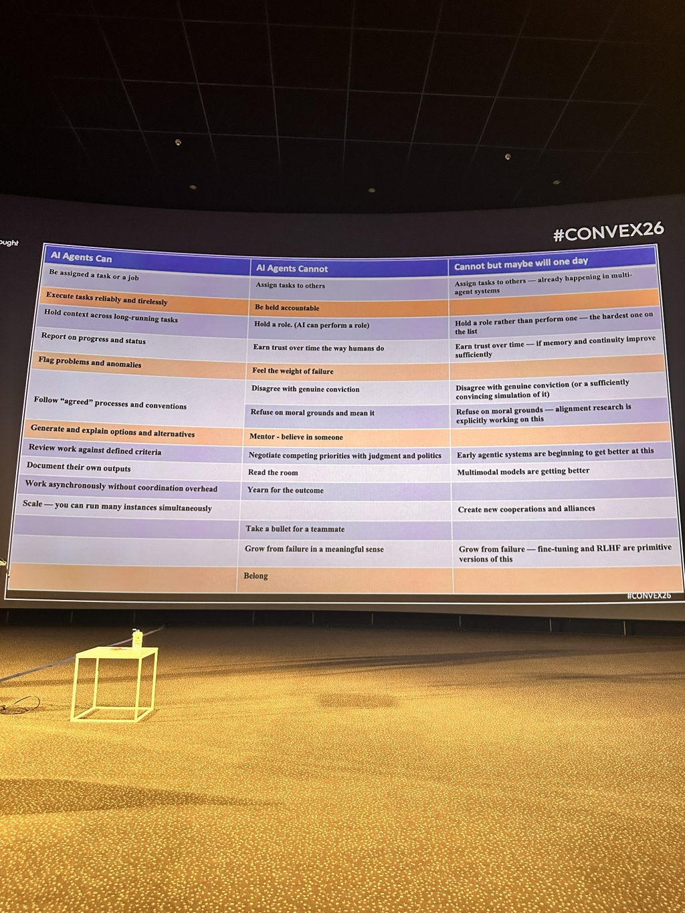

*The AI agent discussion was interesting because it did not only focus on automation; it also highlighted accountability, trust, judgment, and team dynamics.*

That is a healthy way to talk about AI. Not “AI will replace everything,” and not “AI is useless.” The real question is where AI can help a team, and where humans still need to own the decision.

### Charisma at Work

- **What's Charisma actually?** Let me tell my opinion; The charisma is the experience, the knowledge, wisdom, elegance, listening more and talking less, way of looking to life, performing good on the responsibilities, trustability, being inspiring.
- **Why Charisma is important?** It makes your words to be listened by other people.

### Better decisions need better records

I also followed sessions about architecture principles and decision records. One slide explained principles as priorities, beliefs, guardrails, and a way to connect requirements to architectural decisions. Another used a simple architectural decision example: **Data Store per Service**, where each service owns its data and other services access it through APIs or events instead of direct database queries.

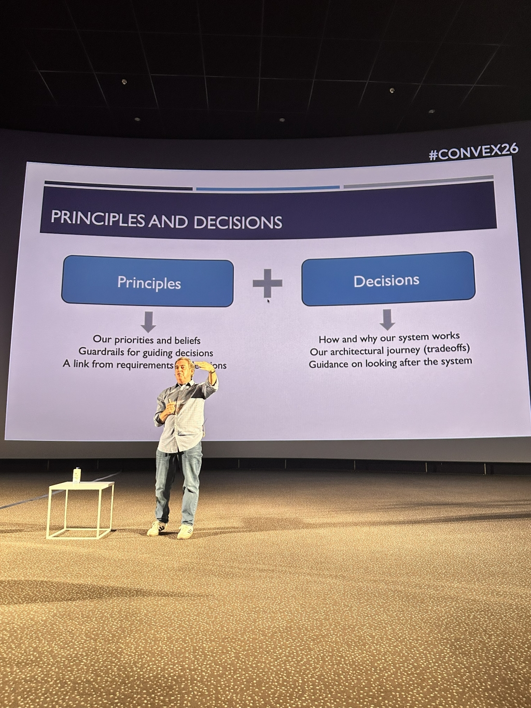

*Architecture principles were presented as guardrails that connect requirements, trade-offs, and decisions.*

This connected nicely with another slide about ADRs. A minimal ADR, based on Michael Nygard’s format, includes a name, status, context, decision, and consequences. A more comprehensive ADR can also include related requirements, assumptions, constraints, options, reasoning, and trade-offs.

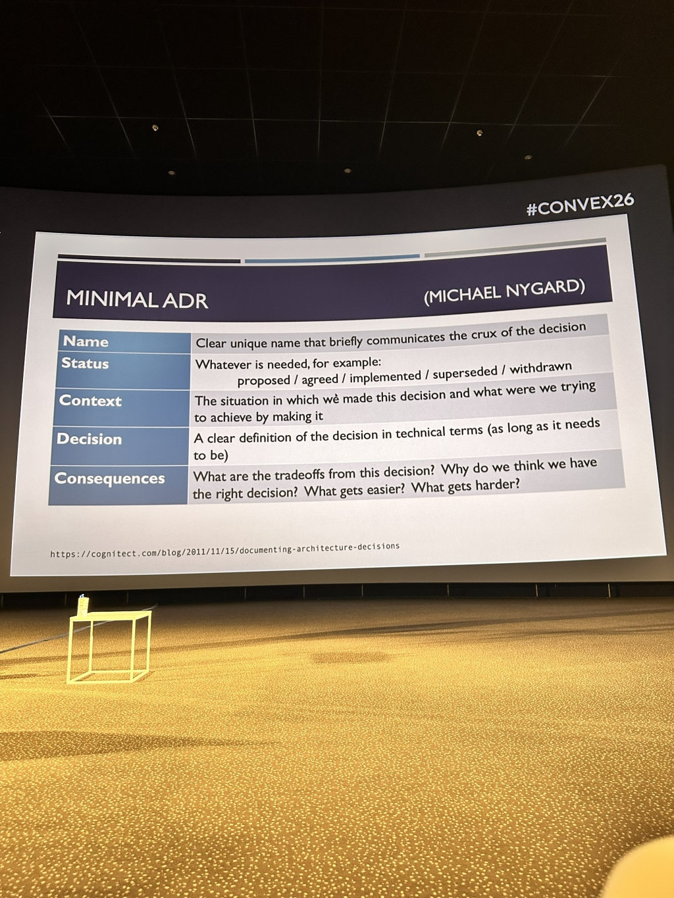

*The ADR discussions were a reminder that good architecture is not only about making decisions, but also about preserving the reasoning behind them.*

For .NET teams, these ideas are practical. AI can sit on top of strong foundations around backend services, identity, data access, cloud integration, and enterprise applications—but it should not bypass them.

If anything, AI makes good engineering discipline more important.

## The Conference Experience

The venue, Kinépolis Ciudad de la Imagen in Madrid, gave the conference a different feeling from a typical hotel-based event. The rooms, stage, and screens made the sessions feel cinematic. Outside the session rooms, the networking areas were active throughout the day. People were not only exchanging LinkedIn profiles; they were continuing the technical debates from the talks.

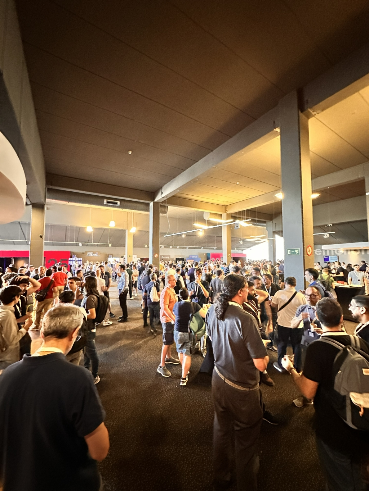

*The networking areas were busy between sessions, creating space for conversations beyond the formal agenda.*

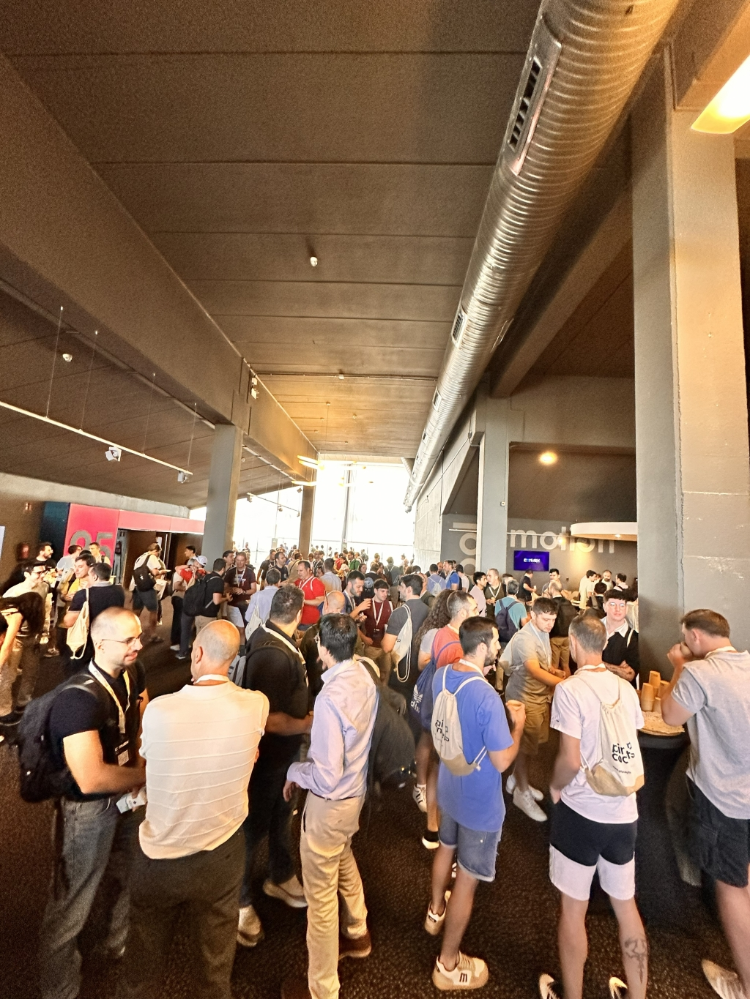

*The event had a steady flow between talks, networking areas, and informal conversations.*

For me, the most valuable conversations happened after the talk. Several people came with practical questions about AI-assisted reporting: How much schema information should be given to the model? Should generated SQL be shown to users? How do we prevent dangerous queries? Can this work with multi-tenant applications? How should we evaluate the quality of AI-generated reports? What should be logged for auditing?

These questions matter because they show that teams are moving from curiosity to implementation. They are no longer asking only, “Can we do this?” They are asking, “How can we do this safely inside our product?”

That is a much better question.

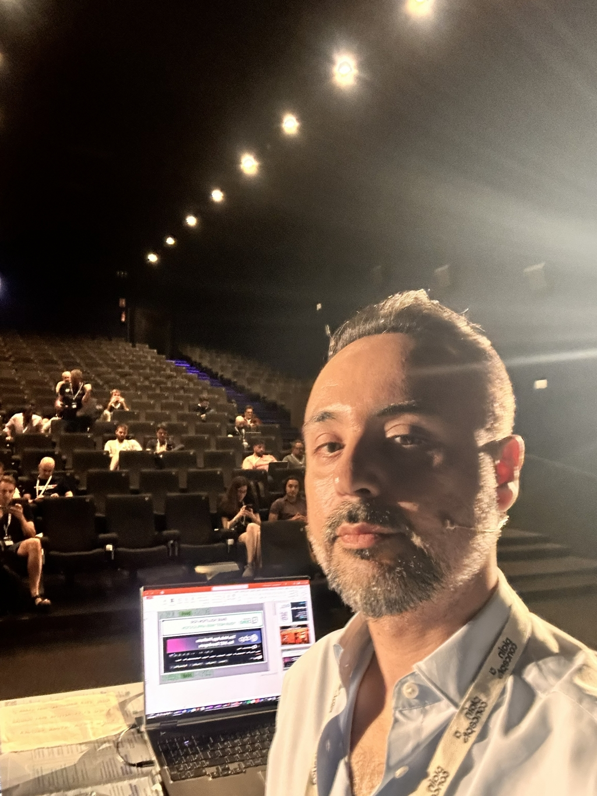

*I'm preparing my setup and waiting the attendees from lunch :) One of those small personal moments that makes a conference feel memorable, not only useful.*

A good conference gives you two things: ideas from the stage and better questions from the people you meet. CONVEX did both.

## My Key Takeaways

1. **AI features need data boundaries.** The more natural the interface becomes, the more important permissions, context, and allowed actions become.
2. **Natural language is becoming a product interface.** Users increasingly want answers, not navigation paths.
3. **Architecture is becoming more important, not less.** AI can accelerate delivery, but it cannot remove product constraints, security requirements, or organizational complexity.
4. **Decisions need memory.** Principles, ADRs, trade-offs, and exceptions help teams preserve reasoning.
5. **Conferences still matter.** A hallway discussion after a session can sometimes teach you more than a full article or video. It's a way of motivation, a way of socializing for developers. You see what other do, you discuss with them, you know your customers...

## My Cultural Visits

I visited Toledo and Madrid's most important tourist attractions and museums. Now I know way much better then I knew before about Spanish culture and lifestyle. But this is the most impressive moment for me. As you may know I'm Turkish. My grand grandfathers were Ottomans living in Anatolia. In 1571 they were in a war with Spain, Genoa, Malta and Italy. The battle was in the sea near Greece. It's called Sea Battle of Lepanto. In the below pictures, you can see the Ottoman's highest level sea commander (we call him Kaptan-ı Derya -the captain of seas-) personal items when he was died in this war. For those who wants to see it; it's Royal Palace of Madrid and the items are in Royal Armoury department.

If you're interested in this war, I'll little bit tell you about it.

### The Battle of Lepanto ⚔

The Ottoman army was invading Cyprus. Angered by this, European countries asked Spain—one of the strongest kingdoms of the period—for help. To retake the island, a Holy Christian fleet was assembled under Spanish leadership. On 7 October 1571, the forces arrived at the Gulf of Patras in Greece for what would become known as the Battle of Lepanto. On one side was the Ottoman army, commanded by Ali Pasha, known as Kaptan-ı Derya (the Grand Admiral). On the opposing side were the major European powers: Spain, Venice, the Papacy, Genoa, the Knights of Malta, and Italy. It would become the last major naval battle fought with oared warships. The Ottomans lost the battle, and the sultan of that time Sokollu Mehmed Pasha said the following famous saying: “*You have cut off our beard, but we have cut off your arm. A beard grows back.*”  More than 200 Ottoman ships were lost. Tens of thousands of soldiers were killed or captured. In the below photograph, you will see war trophies taken from Ali Pasha. In Spain, this battle would be called “*La Defensa de la Cristiandad*” means “*The Defense of Christianity*” and would be used for propaganda for years. These trophies were used as symbols. The first time I saw the exhibit in a museum, I stood in front of it for 15–20 minutes, simply looking at it.

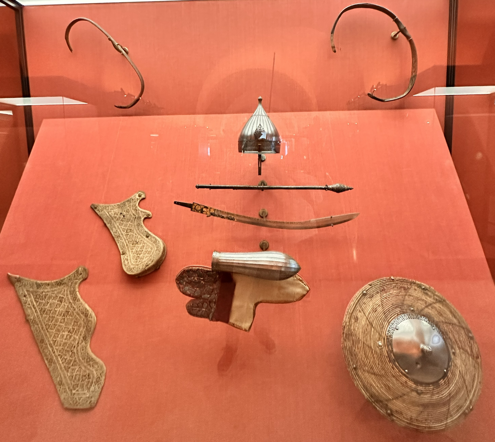

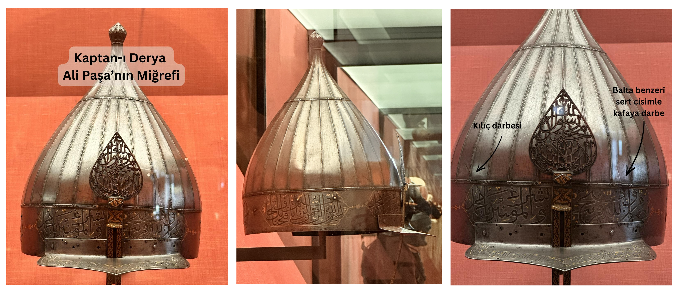

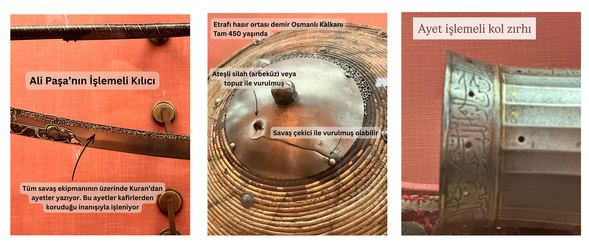

### What's the thing with Cervantes and Ottomans?

There may be one more little-known detail about the Battle of Lepanto. Miguel de Cervantes, the author of the famous novel Don Quixote, also took part in this battle. During the conflict, Cervantes served aboard the Spanish ship Marquesa. Despite suffering from a fever, he insisted on joining the battle. The Ottoman army wounded Cervantes in the chest and left arm. As a result, he lost much of the use of his left hand. For this reason, he became known as “*El manco de Lepanto*,” meaning “*the one-handed hero of Lepanto.*”

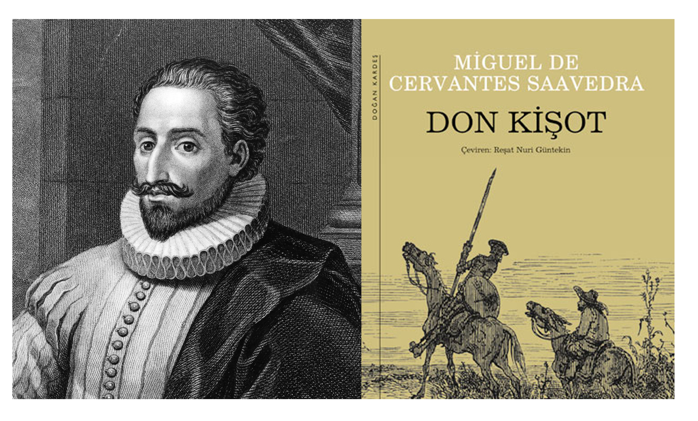

### Bullfighting 🦬

I met a real matador in Toledo, and after talking to him, my perspective on everything changed dramatically!

From the outside, it looks like nothing more than a “brutal spectacle,” but apparently there is a surprisingly deep philosophy behind it. These were the most interesting things I took away from what the matador told me:

- **Bulls don’t react to the color red:** They are actually color-blind. What triggers them is the movement of the cape, not its color. Red is purely for visual aesthetics.
- **The selected bull is a special, wild breed:** The animal has almost never seen a human before entering the arena. It sees the matador as an enemy and wants to destroy him.
- **The greatest honor is to survive:** If a bull shows exceptional nobility and courage, the audience waves white handkerchiefs to ask for its pardon. That bull never enters the arena again and spends the rest of its life like a king on a farm.
- **A dance with death:** Matadors do not see this as a sport, but as a way of confronting death. When making the most critical strike, the matador must also put his own life at risk—he cannot simply stab the bull from behind. He has to face the bull head-on, bravely. In that sense, there is a strange bond of respect between them. The bull is powerful, but the matador is intelligent. He cannot defeat it through strength, only through skill, timing, and agility.
- **It is a controversial subject**, but hearing it firsthand in its own context changed my perspective considerably. At a time when animal rights are more important than ever, this tradition still continues. And I have now learned that bullfighting has a much deeper philosophy behind it than I had realized.

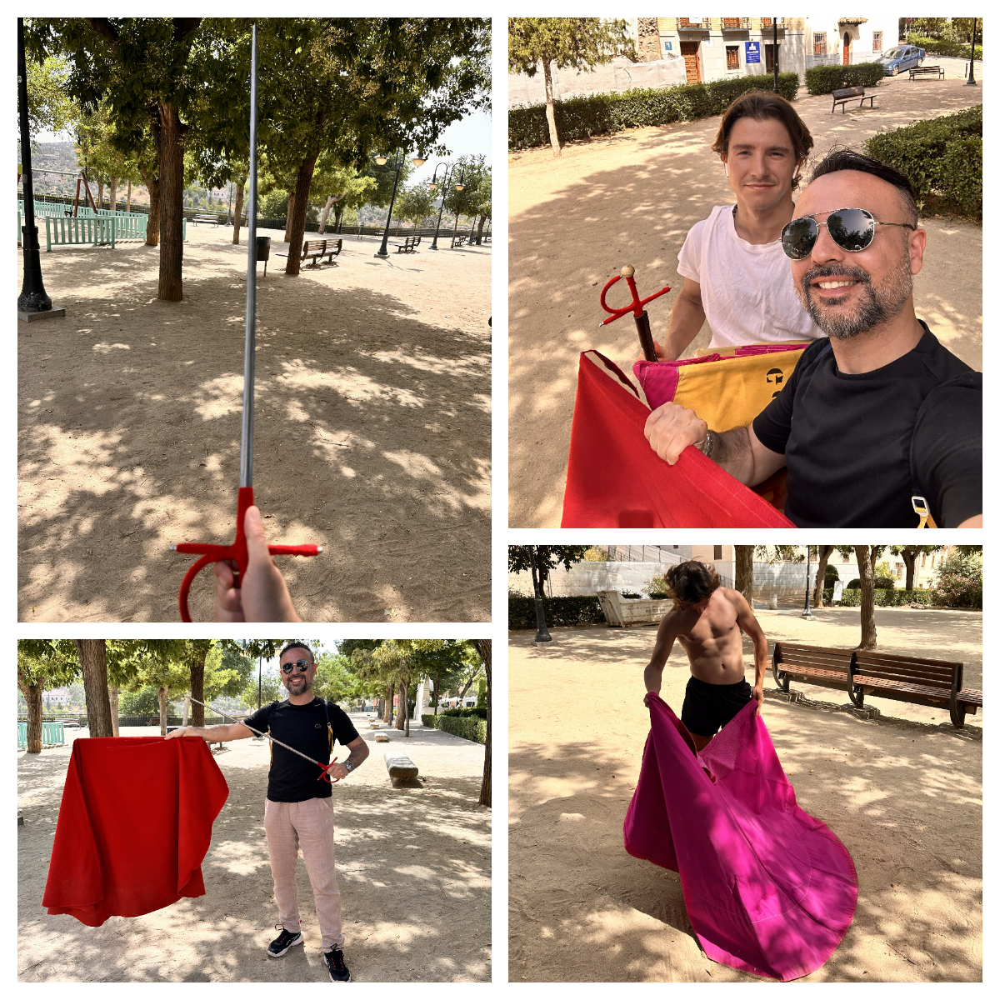

## Closing

I left CONVEX 2026 with new ideas, useful feedback, and a stronger belief that the next phase of enterprise AI will be less about impressive demos and more about trusted systems.

For me, the most interesting AI features are not the ones that look magical. They are the ones that quietly solve a real problem, respect the architecture around them, and help users make better decisions.

Thank you to the CONVEX organizers, the speakers, and everyone who joined my session or continued the conversation afterward.

Madrid was a great place to talk about AI, .NET, architecture, and the future of enterprise software. I hope to see many of you again at the next event.

---
