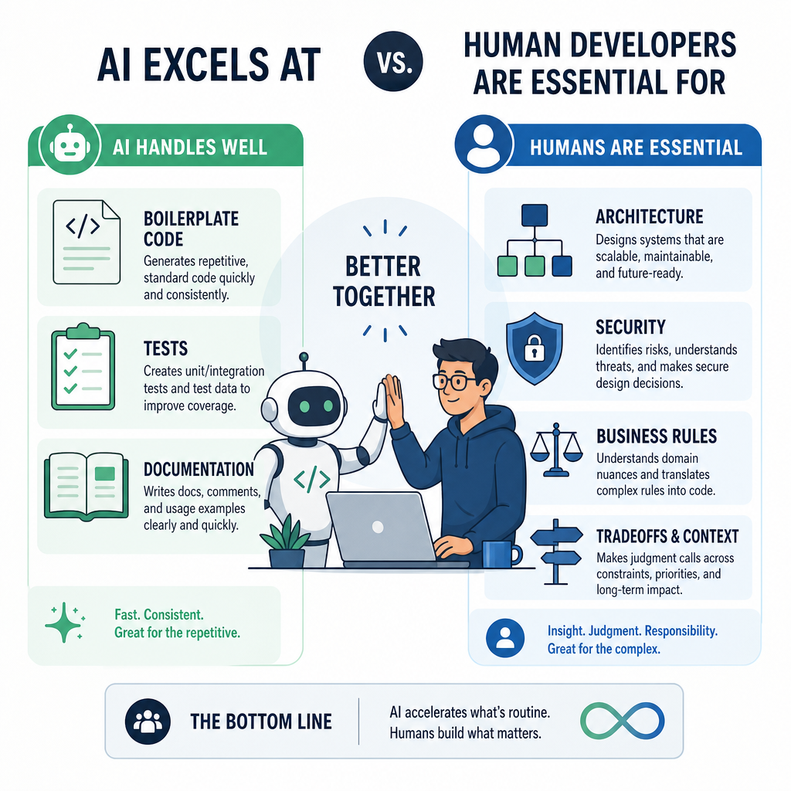
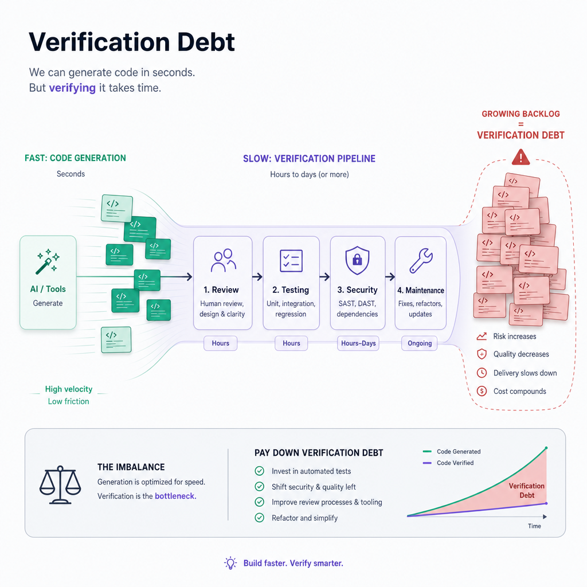
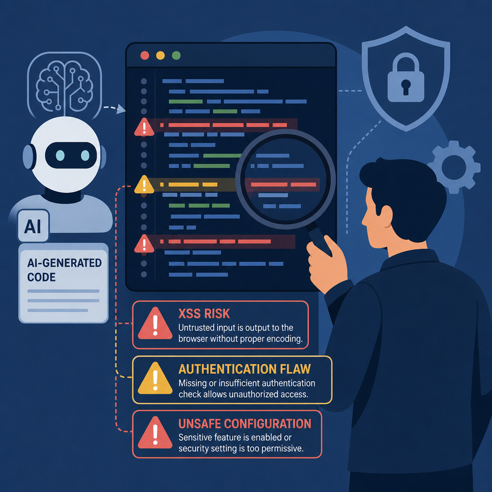
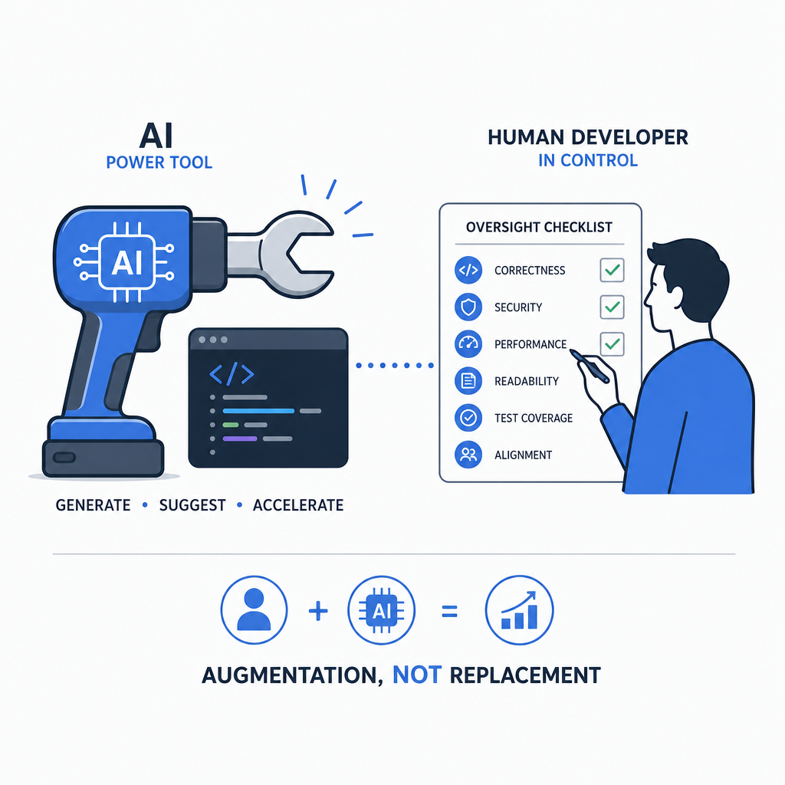

A lot of the current AI discussion in software development swings between two extremes: either AI will write everything, or it is just autocomplete with better marketing.

Neither view is especially useful.

What the evidence shows is more practical: AI coding tools can improve developer throughput on certain tasks, especially repetitive work, scaffolding, and first drafts. But they do not remove the need for developers. In many teams, they actually create a new category of work around review, verification, security, and long-term maintainability.

That is the real story. AI is not replacing developers. It is changing what developers do, what teams optimize for, and where engineering judgment matters most.

## The productivity gains are real, but they are not magic

There is enough data now to move beyond hot takes.

Across multiple studies and industry reports, AI coding assistants show measurable productivity gains, but those gains are usually modest rather than transformational:

- A BlueOptima analysis across 30,000 developers in 18 enterprises reported an average productivity uplift of 5.4%, with the most active users seeing gains closer to 20%.
- An open source study found roughly a 6.5% project-level productivity increase after Copilot adoption.
- GitHub survey data from more than 2,000 developers showed strong perceived benefits: improved flow, less mental drain on repetitive tasks, and greater job satisfaction.
- A longitudinal study from a large public-sector engineering organization found that developers using Copilot were already highly active, and while they reported productivity improvements, commit-based metrics did not show a statistically significant post-adoption jump.

That last point matters.

Perceived productivity and actual output are not always the same thing. Developers may feel faster because they spend less time on boilerplate, search, or syntax recall. That feeling is valuable. Less friction often means better focus. But it does not automatically translate into dramatically more shipped business value.

In other words, AI helps, but it does not suspend the usual constraints of software delivery:

- unclear requirements still slow teams down
- poor architecture still creates drag
- bad testing practices still leak defects
- messy codebases are still messy codebases

If your delivery bottleneck is typing, AI looks revolutionary. If your bottleneck is product ambiguity, compliance, integration complexity, or production risk, AI helps less than the marketing suggests.

## What AI coding tools are actually good at

The strongest use case for AI in development is not autonomous software engineering. It is acceleration of narrow, well-bounded tasks.

AI coding assistants are usually good at:

- generating boilerplate
- filling in repetitive CRUD patterns
- writing simple tests and test skeletons
- suggesting refactors
- producing documentation drafts
- translating between languages or frameworks
- helping developers recall APIs and syntax
- creating a first pass for routine utility code

This is why many developers genuinely like these tools. They reduce low-value friction.

A practical example:

A developer building an ABP-based application might use AI to:

- scaffold DTO mappings
- draft validation rules
- generate basic unit test cases
- create repository query examples
- summarize a service class before refactoring

Those are useful accelerators. But the same tool is much less reliable when asked to decide:

- whether a module boundary is correct
- how to model a permission system
- what tradeoff to make between consistency and performance
- how multi-tenancy affects data access rules
- which abstraction will still be maintainable a year later

That is the dividing line. AI handles local code generation better than system-level reasoning.

## Where developers are still irreplaceable

The most valuable parts of software development were never just typing code.

Developers are still responsible for the parts AI consistently struggles with:

### Understanding the problem behind the ticket

Business requirements are often incomplete, contradictory, or politically constrained. A human developer can ask the uncomfortable question, spot hidden assumptions, and translate vague intent into a workable implementation.

AI can generate an answer. It cannot reliably challenge the question.

### Making architecture tradeoffs

Real systems involve tradeoffs, not ideal answers.

Should this feature live in an existing module or a new service? Is eventual consistency acceptable here? Are we optimizing for onboarding speed, runtime performance, auditability, or cost control?

These decisions depend on context that usually lives outside the prompt window.

### Working safely in large, imperfect codebases

Most production systems are not greenfield demos. They include legacy code, weird integrations, undocumented conventions, and historical constraints.

This is where experienced developers earn their keep. They know that the technically correct change is not always the operationally safe change.

### Taking responsibility for outcomes

An AI assistant does not get paged at 2 a.m. It does not own the incident review. It does not explain a data leak to legal, security, or customers.

Software engineering is not just generation. It is accountability.

## The hidden cost: verification debt

One of the most important ideas in the current AI coding debate is verification debt.

AI can generate code quickly, but that speed often shifts effort downstream. Instead of spending time writing code, teams spend time validating whether the generated code is correct, secure, idiomatic, and maintainable.

That creates a new form of debt:

- code is produced faster than it is reviewed properly
- weak suggestions slip into the codebase because they look plausible
- reviewers must inspect more generated code with lower trust
- maintenance costs rise later because low-context code ages badly

Recent survey data points in the same direction:

- 72% of developers reported using AI tools daily
- AI contributes a substantial share of committed code in some teams
- 96% of developers do not fully trust AI-generated code
- less than half consistently review AI-generated code before committing
- 38% say reviewing AI code can take longer than reviewing human-written code

That combination should worry engineering leaders.

If teams accept more machine-generated code while also trusting it less, the result is not full automation. The result is a fragile review pipeline.

This is why senior engineers are not becoming obsolete. Their work is shifting toward validation, standards, and system integrity.

## Security is the clearest reason AI won’t replace developers

If you want one hard reality check, it is security.

AI-generated code often looks polished. That makes insecure output more dangerous, not less dangerous.

Research and industry testing have found recurring problems such as:

- flawed input validation
- weak authentication or authorization logic
- unsafe serialization patterns
- insecure defaults
- cross-site scripting exposure
- log injection issues
- dependency and configuration mistakes

A Veracode study covering 100 LLMs across 80 coding tasks found that about 45% of AI-generated code samples contained security flaws. Reported failure rates were especially high in some languages and security-sensitive tasks.

That aligns with what many teams see in practice: AI can produce code that appears complete while quietly missing the exact defensive details that matter in production.

There is a second security problem too: the tools themselves.

Recent research into AI-enabled IDE workflows has highlighted risks such as:

- prompt injection through project content
- data exfiltration from workspace context
- misuse of tool permissions
- remote code execution paths via compromised assistant workflows

So the risk surface is now two-layered:

1. the generated code may be unsafe
2. the coding assistant environment may itself introduce supply-chain and data exposure risks

That is not a path to replacing developers. It is a path to needing more disciplined developers.

## Why junior and senior developers benefit differently

AI does not help every developer in the same way.

Less experienced developers often benefit the most from:

- faster onboarding
- easier exploration of unfamiliar APIs
- reduced time spent on repetitive syntax work
- quick examples to unblock momentum

That is a good thing. Used well, AI can shorten the distance between "I know the concept" and "I can build the first version."

But there is a catch.

If juniors over-rely on generated solutions they do not understand, they can ship code without building judgment. That creates a team with higher output but thinner engineering depth.

Senior developers usually get less value from raw generation and more value from targeted acceleration. Their role shifts toward:

- architectural direction
- code review and design review
- defining guardrails
- mentoring developers on when not to trust the tool
- shaping prompts and workflows around quality

That is not replacement. It is role redistribution.

## The best teams treat AI like a power tool, not a developer

The most productive framing is simple: AI is a power tool.

A power tool can make a skilled worker much faster. It can also let an unskilled worker make bigger mistakes faster.

Teams getting real value from AI coding assistants usually do a few things consistently.

### They define where AI is allowed to help

For example:

- okay for scaffolding and test drafts
- okay for documentation summaries
- okay for refactoring suggestions in low-risk modules
- not okay for auth flows without explicit review
- not okay for security-sensitive changes without human design approval
- not okay for direct commits to critical paths

### They keep human review non-negotiable

AI-generated code should be reviewed like code from a new team member who is fast, confident, and occasionally wrong in subtle ways.

That means checking:

- correctness
- security
- consistency with project conventions
- operational impact
- maintainability six months from now

### They invest in guardrails

Useful guardrails include:

- secure coding standards
- mandatory tests for generated code
- SAST and dependency scanning
- branch protection and review policies
- secret scanning
- documented AI usage rules
- prompt hygiene, especially around sensitive data

### They optimize for maintainability, not just speed

The wrong metric is lines generated.

Better metrics include:

- cycle time without increased incident rate
- review burden
- escaped defects
- time to understand generated code later
- security findings per change

## When AI helps most — and when it helps least

A balanced view is more useful than either fear or hype.

### When to use AI-assisted coding

AI is a strong fit when:

- the task is repetitive or pattern-based
- the scope is narrow and easy to verify
- the code is low-risk and well-tested
- you need a first draft, not a final answer
- developers understand the output well enough to challenge it
- the team has solid review and security practices

Examples:

- generating DTOs, mappings, and validation stubs
- producing test cases for straightforward services
- drafting migration scripts that will be reviewed carefully
- summarizing unfamiliar code before manual refactoring

### When not to rely on AI-assisted coding

AI is a poor fit when:

- business rules are complex or ambiguous
- security is central to the change
- architecture decisions are still in flux
- the code touches compliance-heavy or highly regulated paths
- the surrounding codebase has lots of undocumented behavior
- the team is unlikely to review the output carefully

Examples:

- permission and tenancy boundaries
- payment or identity workflows
- critical infrastructure automation
- cross-service consistency logic
- sensitive data handling and audit trails

## What this means for the future of software teams

AI is changing software development, but not in the simplistic way people often describe.

The likely outcome is not fewer developers because code writes itself. The more plausible outcome is a different distribution of engineering work:

- more generated code
- more review and verification work
- more emphasis on architecture and systems thinking
- more value placed on security awareness
- more leverage for developers who can guide tools effectively

There are also organizational effects.

If AI tools can remove some low-level friction, teams may ship faster. Some studies and industry analyses even project large macroeconomic gains from AI-augmented software work. But inside engineering organizations, those gains depend on whether speed is paired with discipline.

Without discipline, AI increases noise.

With discipline, AI increases leverage.

That is the distinction leaders should care about.

## The developer job is not disappearing — it is getting more judgment-heavy

The strongest developers in the AI era will not be the ones who generate the most code. They will be the ones who can:

- define the problem clearly
- evaluate tradeoffs
- spot incorrect assumptions
- review machine output efficiently
- protect quality under delivery pressure
- turn generated fragments into coherent systems

That is a more senior version of software engineering, not a smaller one.

Typing code was never the whole profession. It was just the most visible part. AI is making that easier, which means the less visible parts now matter even more.

And those parts are deeply human: judgment, context, responsibility, and taste.

## TL;DR

- AI coding tools improve productivity on repetitive, bounded tasks, but the gains are usually incremental, not total automation.
- Developers are still needed for architecture, business logic, tradeoffs, security, and accountability.
- AI-generated code often adds verification debt, increasing review and maintenance work later.
- Security remains a major limitation, both in generated code and in AI-assisted development workflows.
- The winning teams use AI as a power tool with strong guardrails, not as a replacement for engineering judgment.