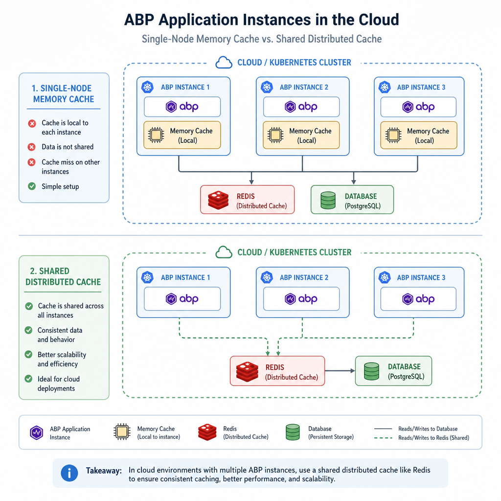
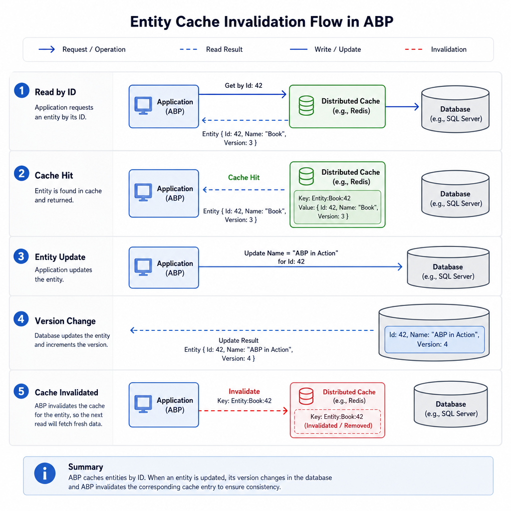
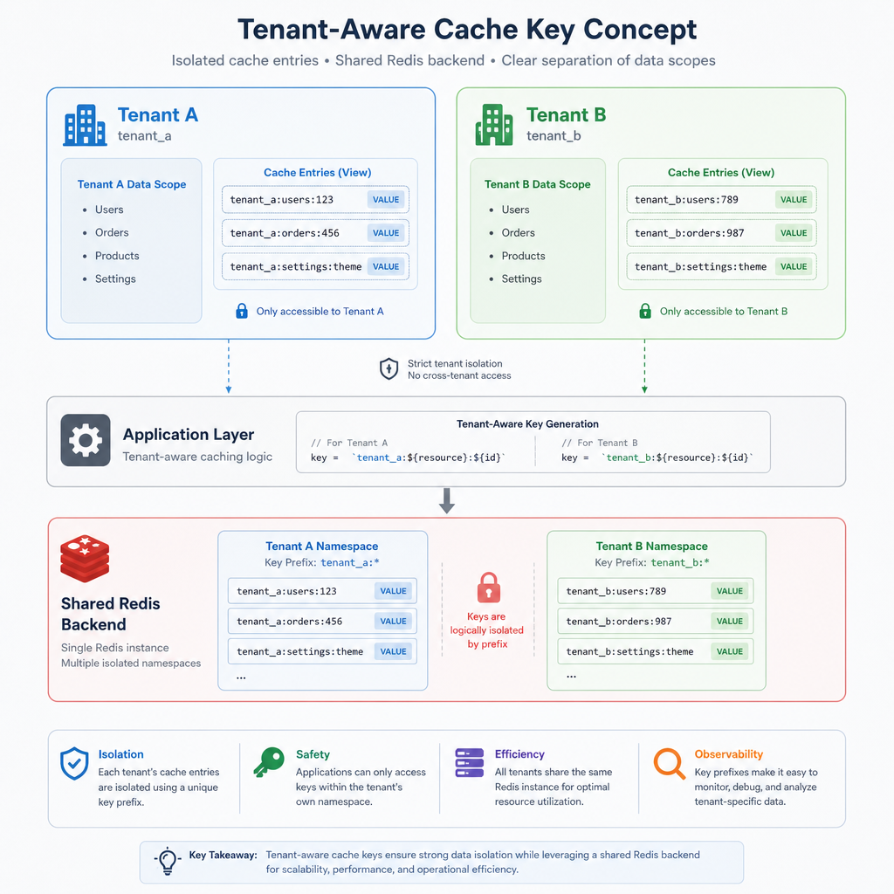

Caching is one of those topics that looks simple until an application starts scaling. The first version works fine with direct database reads. Then traffic grows, page loads become inconsistent, and suddenly the team is debating Redis, stale data, invalidation, and why one node sees fresh data while another still serves old results.

ABP Framework gives you a solid caching foundation, but the important part is choosing the right caching strategy for the job. Not everything should be cached the same way. A read-only lookup list, a tenant-specific settings object, and an entity that changes every minute do not have the same caching needs.

This article walks through the practical caching strategies in ABP Framework, what each one is good at, how to configure them, and the mistakes that usually show up in production.

## Understand ABP's caching model first

ABP builds its caching support on top of `Microsoft.Extensions.Caching.Distributed.IDistributedCache`. That matters because ABP does not invent a completely separate caching universe. Instead, it adds practical features developers actually need in real systems:

- typed cache abstractions
- automatic serialization and deserialization
- tenant-aware cache keys
- configurable key prefixes
- batch operations
- optional Unit of Work awareness
- safer error handling defaults

Out of the box, the default distributed cache implementation is `MemoryDistributedCache`. Despite the name, this is still wired through the distributed cache abstraction, but the storage is in-memory for the current app instance.

That is fine for:

- local development
- demos
- single-node monoliths
- low-risk cached reads

It is not enough for:

- load-balanced deployments
- Kubernetes or App Service scale-out
- background workers sharing cached data with web apps
- any scenario where multiple instances must see the same cache state

In those cases, you should move to a real distributed provider such as Redis.




## Strategy 1: Use typed distributed cache for application data

For most ABP applications, the default and most useful strategy is the generic typed distributed cache.

ABP provides:

- `IDistributedCache<TCacheItem>`
- `IDistributedCache<TCacheItem, TCacheKey>`

These abstractions remove a lot of repetitive work. You do not have to manually serialize objects, invent every cache key shape yourself, or worry about tenant ID inclusion for common cases.

### Why typed distributed cache is usually the best starting point

It works well when you want to cache:

- lookup lists
- settings snapshots
- permission-related read models
- dashboard widgets
- expensive API responses
- aggregated DTOs used by the UI

This strategy is usually better than caching raw entities because cached application-facing models tend to be:

- smaller
n- more stable
- easier to version
- less coupled to domain changes

### Example: cache a product summary DTO

```csharp
using Microsoft.Extensions.Caching.Distributed;
using Volo.Abp.Caching;

[CacheName("ProductSummary")]
public class ProductSummaryCacheItem
{
    public Guid Id { get; set; }
    public string Name { get; set; }
    public decimal Price { get; set; }
    public bool IsAvailable { get; set; }
}

public class ProductAppService : ApplicationService
{
    private readonly IDistributedCache<ProductSummaryCacheItem, Guid> _cache;
    private readonly IRepository<Product, Guid> _productRepository;

    public ProductAppService(
        IDistributedCache<ProductSummaryCacheItem, Guid> cache,
        IRepository<Product, Guid> productRepository)
    {
        _cache = cache;
        _productRepository = productRepository;
    }

    public async Task<ProductSummaryCacheItem> GetSummaryAsync(Guid id)
    {
        return await _cache.GetOrAddAsync(
            id,
            async () =>
            {
                var product = await _productRepository.GetAsync(id);

                return new ProductSummaryCacheItem
                {
                    Id = product.Id,
                    Name = product.Name,
                    Price = product.Price,
                    IsAvailable = product.StockCount > 0
                };
            },
            () => new DistributedCacheEntryOptions
            {
                SlidingExpiration = TimeSpan.FromMinutes(10),
                AbsoluteExpirationRelativeToNow = TimeSpan.FromHours(1)
            }
        );
    }
}
```

A few good things are happening here:

- the cache item is small and explicit
- the key is strongly typed
- expiration is defined close to the use case
- both sliding and absolute expiration are used

That last point is important. Sliding expiration alone can keep hot items alive indefinitely. Absolute expiration alone can evict popular items too aggressively. In many business cases, combining them gives you a better balance.

### When to use

Use typed distributed cache when:

- you want a simple, explicit cache around a read operation
- the cached model is a DTO or a lightweight read model
- invalidation can be handled in application logic
- you need tenant-aware behavior without extra plumbing

### When NOT to use

Avoid it when:

- the underlying data changes extremely often and stale reads are unacceptable
- the object is very large and serialization cost outweighs the benefit
- cache invalidation is too complex to reason about safely
- the query is already cheap and highly selective

## Strategy 2: Use entity cache for read-heavy entity access

ABP also provides an entity cache abstraction for read-only entity-level caching. This is useful when you repeatedly fetch entities or entity-based DTOs by ID and want cache invalidation to happen automatically on update or delete.

This is where entity cache can save real effort. Instead of manually wiring remove calls in every update path, you lean on the framework's invalidation behavior.

### What entity cache is good at

Entity cache is a good fit for:

- catalogs
- countries, regions, tax definitions
- organization units that are read often but changed infrequently
- profile-like records fetched by ID repeatedly

It is a bad fit for highly volatile entities where every read risks becoming stale within seconds.

### Example use case

Suppose your application repeatedly loads a `Category` record by ID from both HTTP requests and background jobs. That category changes maybe once a week. Entity cache is a better fit than manually managing many distributed cache entries across the codebase.

The main advantage is operational simplicity:

- read-through usage is straightforward
- updates and deletes trigger invalidation automatically
- you get consistency improvements without scattering cache removal logic everywhere

### A practical warning about entity versioning

ABP supports entity versioning through `IHasEntityVersion`. If an entity implements it, ABP increments the `EntityVersion` on updates and uses that in invalidation-related behavior.

That is useful, but there is one common trap: direct SQL updates outside the normal application flow bypass entity versioning and the domain pipeline.

If your team runs scripts like this:

```sql
update Products set Name = 'New Name' where Id = '...'
```

then your cache may not be invalidated as expected.

If you use entity cache, make sure updates go through the application and domain stack whenever possible. If operational SQL scripts are unavoidable, explicitly account for cache invalidation.

### When to use

Use entity cache when:

- reads are frequent and mostly by entity key
- entities change infrequently
- automatic invalidation on update/delete is valuable
- you want less manual cache removal code

### When NOT to use

Avoid it when:

- the read model should differ significantly from the entity shape
- data is updated too frequently
- your team often bypasses the application layer with direct SQL updates
- the cached object graph is large or expensive to serialize




## Strategy 3: Prefer Redis for real distributed deployments

A lot of caching problems are not about API design. They are deployment problems.

If you run multiple application instances and still use the default in-memory distributed cache implementation, each node will maintain its own private cache state. That means:

- node A may have fresh data
- node B may have stale data
- invalidation on one node does not magically update the others
- behavior becomes inconsistent under load balancing

For production scale-out, Redis is usually the practical answer.

ABP provides Redis integration through `Volo.Abp.Caching.StackExchangeRedis`.

### Basic setup idea

Install the Redis caching package and configure distributed caching as your backing provider. ABP then continues to use its caching abstractions, while Redis stores the actual cache entries.

A typical module configuration looks like this:

```csharp
using Microsoft.Extensions.DependencyInjection;
using Volo.Abp.Caching;
using Volo.Abp.Modularity;

[DependsOn(typeof(AbpCachingStackExchangeRedisModule))]
public class MyProjectModule : AbpModule
{
    public override void ConfigureServices(ServiceConfigurationContext context)
    {
        var configuration = context.Services.GetConfiguration();

        context.Services.AddStackExchangeRedisCache(options =>
        {
            options.Configuration = configuration["Redis:Configuration"];
        });

        Configure<AbpDistributedCacheOptions>(options =>
        {
            options.KeyPrefix = "MyApp";
            options.GlobalCacheEntryOptions.SlidingExpiration = TimeSpan.FromMinutes(20);
            options.HideErrors = true;
        });
    }
}
```

### Why the key prefix matters

If the same Redis server is shared by multiple applications or environments, a global key prefix is not optional in practice. Without it, key collisions become surprisingly easy.

Good examples:

- `MyApp-Prod`
- `SalesService`
- `TenantPortal`

Bad example:

- leaving it empty and hoping naming conventions elsewhere are enough

## Strategy 4: Use batch cache operations for high-volume reads

If you need to fetch many cache entries at once, ABP supports batch operations such as:

- `GetManyAsync`
- `SetManyAsync`
- `RemoveManyAsync`

This matters most in list and aggregation scenarios.

For example, imagine a product page that needs cached summaries for 50 product IDs. Doing 50 individual round-trips is not ideal. If the provider supports batch operations well, this can reduce latency significantly.

### Example: batch loading summaries

```csharp
public async Task<IReadOnlyList<ProductSummaryCacheItem>> GetManySummariesAsync(Guid[] ids)
{
    var cachedItems = await _cache.GetManyAsync(ids);

    var missingIds = ids
        .Where(id => !cachedItems.ContainsKey(id) || cachedItems[id] == null)
        .ToArray();

    if (missingIds.Any())
    {
        var products = await _productRepository.GetListAsync(x => missingIds.Contains(x.Id));

        var newItems = products.ToDictionary(
            x => x.Id,
            x => new ProductSummaryCacheItem
            {
                Id = x.Id,
                Name = x.Name,
                Price = x.Price,
                IsAvailable = x.StockCount > 0
            });

        await _cache.SetManyAsync(
            newItems,
            new DistributedCacheEntryOptions
            {
                SlidingExpiration = TimeSpan.FromMinutes(10)
            });

        foreach (var item in newItems)
        {
            cachedItems[item.Key] = item.Value;
        }
    }

    return ids
        .Where(id => cachedItems.ContainsKey(id) && cachedItems[id] != null)
        .Select(id => cachedItems[id])
        .ToList();
}
```

Provider support matters here. With Redis and ABP's Redis package, batch operations are especially useful. If the underlying provider does not support them efficiently, ABP can fall back to single operations.

That means batch APIs are still worth using from an application-code perspective, but you should validate the real performance characteristics in your deployed environment.

## Strategy 5: Make cache writes Unit of Work aware when consistency matters

One subtle but valuable ABP feature is the `considerUow` flag on typed distributed cache operations.

This is easy to overlook, but it can prevent a nasty class of bugs.

Imagine this sequence:

1. You update an entity.
2. You write a corresponding cache value immediately.
3. The database transaction later fails and rolls back.
4. The cache now contains data representing a change that never actually committed.

That is classic stale-or-phantom cache state.

When `considerUow` is enabled, ABP can defer cache writes until the Unit of Work completes successfully.

### Example

```csharp
await _cache.SetAsync(
    id,
    cacheItem,
    options: new DistributedCacheEntryOptions
    {
        AbsoluteExpirationRelativeToNow = TimeSpan.FromMinutes(30)
    },
    considerUow: true
);
```

Use this when cache state depends on transactional data changes in the same operation.

### When to use

Use `considerUow` when:

- you update data and cache in the same business operation
- transaction rollback is possible
- cache correctness matters more than immediate write timing

### When NOT to use

You may skip it when:

- you are caching purely read-side data after a committed fetch
- the operation is outside transactional boundaries
- eventual cache population is acceptable




## Strategy 6: Treat multi-tenancy as a cache design concern, not a detail

ABP automatically includes the current tenant ID in cache keys for typed distributed cache scenarios unless multi-tenancy is explicitly ignored.

This is one of those features that quietly prevents serious data leaks.

Without tenant-aware cache keys, this can happen:

- tenant A requests a settings object
- it gets cached under a generic key
- tenant B requests the same logical object
- tenant B receives tenant A's cached data

That is not just a bug. In many systems, it is a security incident.

### Practical guidance

For multi-tenant systems:

- keep tenant-aware caching enabled by default
- only ignore multi-tenancy for truly global shared data
- review custom key-building logic carefully
- test cache behavior with at least two tenants in integration tests

If a cache item is intentionally global, make that decision explicit and document it.

## Strategy 7: Be deliberate about expiration policy

A lot of bad caching behavior comes from expiration values chosen almost randomly.

ABP lets you define expiration using `DistributedCacheEntryOptions`, including:

- `AbsoluteExpiration`
- `AbsoluteExpirationRelativeToNow`
- `SlidingExpiration`

ABP also supports global defaults through `AbpDistributedCacheOptions`. If you do not specify item-level options, a default sliding expiration is commonly configured as 20 minutes.

### A simple rule of thumb

- Use sliding expiration for frequently accessed, low-volatility items.
- Use absolute expiration when freshness has a hard upper bound.
- Use both when you want hot items to stay warm, but not forever.

### Example global configuration

```csharp
Configure<AbpDistributedCacheOptions>(options =>
{
    options.GlobalCacheEntryOptions.SlidingExpiration = TimeSpan.FromMinutes(20);
    options.HideErrors = true;
    options.KeyPrefix = "MyApp";
});
```

### Common expiration patterns

**Reference data**

- sliding: 30 to 60 minutes
- absolute: 6 to 24 hours

**User-specific dashboard data**

- sliding: 5 to 15 minutes
- absolute: 15 to 60 minutes

**Highly dynamic operational metrics**

- short absolute expirations, or no cache at all

These are not universal numbers, but they are more realistic than setting every cache entry to 24 hours and calling it done.

## Strategy 8: Keep cache items small and serialization-friendly

Distributed caching always includes serialization and deserialization overhead. ABP handles this for you, with JSON serialization by default, but the cost still exists.

That means cache item design matters.

### Prefer this

- lean DTO-style cache items
- primitive properties
- only fields needed by the consuming path
- stable shapes that do not change constantly

### Avoid this

- huge object graphs
- navigation-heavy entities
- deeply nested collections when only a few fields are used
- caching everything just because it was already available in memory

A cache entry should usually be optimized for read efficiency, not for domain completeness.

If a page needs only `Name`, `Price`, and `Status`, do not cache the entire entity graph with audit fields, children, and metadata.

## Strategy 9: Decide how hard cache failures should fail

ABP defaults to a practical stance: cache errors are hidden and logged so your application can continue functioning.

This default is often correct.

If Redis has a transient issue, it is usually better for the request to fall back to the database than to fail completely. Caching should improve performance, not become a single point of failure.

You can control this behavior globally with `AbpDistributedCacheOptions.HideErrors` and per operation with the `hideErrors` parameter.

### Good default thinking

Keep `HideErrors = true` when:

- cache is a performance optimization
- falling back to source data is acceptable
- temporary cache outages should not break user flows

Consider stricter behavior when:

- cache is part of a critical coordination pattern
- silent fallback would overload downstream systems
- you are diagnosing a production issue and want failures surfaced more aggressively

In most business applications, hidden-and-logged cache failures are the safer default.

## What about automatic method-level caching?

You may have seen community implementations that add automatic method-level caching through interception and a `[Cache]` attribute.

That pattern can be attractive because it reduces boilerplate:

- decorate a method
- define expiration
- cache the return value transparently
- optionally connect invalidation to entity changes

It is a useful pattern, but it is important to say clearly: this is not part of ABP core.

So treat it as an architectural choice, not a built-in feature.

### Why teams like it

- less repetitive cache code
- centralized cache policy
- easier adoption for query-heavy services

### Why teams get into trouble with it

- invalidation becomes less explicit
- stale data bugs are harder to trace
- cache scope decisions can become too magical
- developers may not realize when a method result is tenant-specific or user-specific

If you adopt method-level caching, document it aggressively and be strict about invalidation rules. It can be productive, but only when the team fully understands the behavior.

## Common mistakes in ABP caching

Here are the mistakes that cause the most pain.

### Using in-memory distributed cache in a multi-instance production setup

This is probably the most common one. It works in testing, then becomes inconsistent under scale-out.

Fix: use Redis or another true distributed cache provider.

### Caching entities instead of read models by default

This increases serialization cost and couples cache shape to domain shape.

Fix: cache DTOs or purpose-built cache items unless entity cache is clearly the better fit.

### Forgetting invalidation paths

Manual caches live or die by invalidation quality.

Fix: centralize writes, remove cache entries on updates, and use entity cache where automatic invalidation helps.

### Relying only on sliding expiration

Hot keys may stay forever.

Fix: combine sliding and absolute expiration for many scenarios.

### Ignoring tenant boundaries

This can leak data across tenants.

Fix: rely on ABP's tenant-aware key behavior and be very careful with custom key generation.

### Writing to cache before transaction success

This creates cache values for changes that later roll back.

Fix: use `considerUow` for transactional cache writes.

### Treating cache outages as impossible

Eventually, your cache provider will have a bad day.

Fix: decide upfront whether fallback or fail-fast behavior is right for each path.

## A practical decision guide

If you just want a sensible default approach for most ABP projects, this is a good starting point:

1. Use typed distributed cache for expensive read models and DTOs.
2. Use Redis for anything beyond a single instance.
3. Use entity cache for read-heavy entities fetched by ID when automatic invalidation is valuable.
4. Combine sliding and absolute expiration for most business data.
5. Keep cache items small.
6. Use tenant-aware keys by default.
7. Use `considerUow` for cache writes tied to transactions.

That covers a large percentage of real-world ABP caching needs without overengineering the system.

## When to use / When NOT to use caching in ABP

### Use caching when

- the same data is read frequently
- computing or querying the result is expensive
- modest staleness is acceptable
- the cache key can be defined clearly
- invalidation rules are understandable

### Do NOT use caching when

- the underlying data changes constantly
- every read must reflect the latest committed value immediately
- the query is already cheap
- object serialization cost is high relative to the saved work
- the team cannot confidently maintain invalidation rules

Caching is a performance tool, not a default architecture layer for every service method.

## TL;DR

- In ABP, typed distributed cache is the best default for caching DTOs and read models.
- `MemoryDistributedCache` is fine for single-instance apps, but scaled deployments should use Redis.
- Entity cache is useful for read-heavy entity access with automatic invalidation on update and delete.
- Use tenant-aware keys, sensible expiration policies, and `considerUow` to avoid subtle consistency bugs.
- Keep cache items small, explicit, and easy to invalidate.