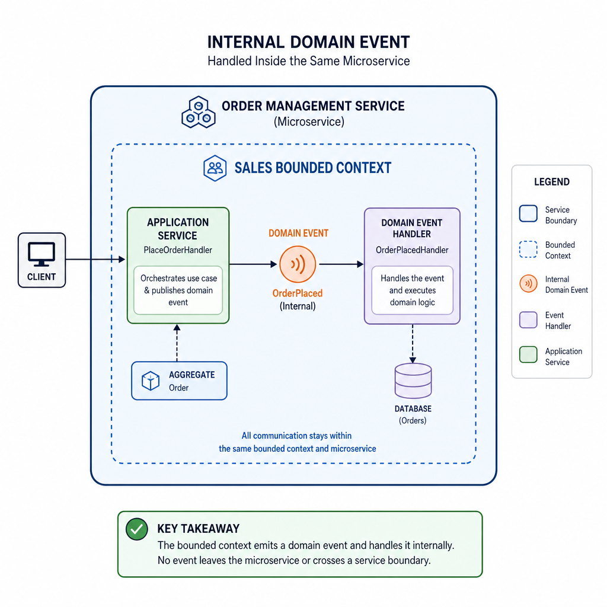
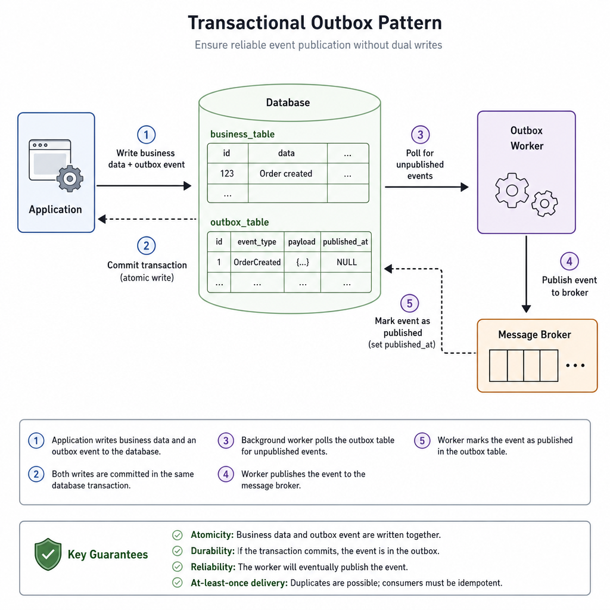
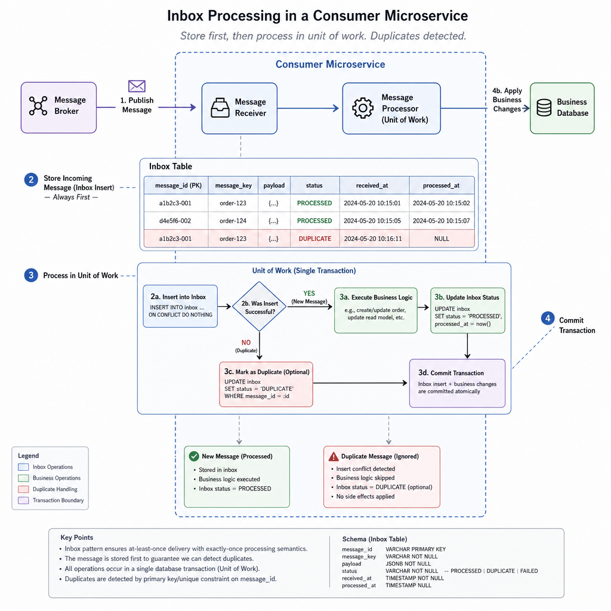

Domain events look simple on paper: something happened, react to it. In a real ABP microservices solution, the hard part is not raising the event. The hard part is deciding which event belongs inside the service, which one should cross service boundaries, and how to publish it without losing data or coupling your modules into a distributed monolith.

ABP gives you the primitives to do this well: local events, distributed events, aggregate-root support, and built-in outbox/inbox infrastructure. Used correctly, they let you keep your domain model clean while still coordinating work across microservices.

This article walks through a practical way to implement domain events in ABP microservices, including the boundary between domain and integration events, the transactional flow, outbox/inbox configuration, and the pitfalls that usually show up after the first production incident.

## Start with the right event boundary

The most important design choice is this:

- **Domain events** are internal to a bounded context.
- **Integration events** are for other microservices.

These are not interchangeable, even if the payload looks similar.

### Domain events

A domain event represents something meaningful that happened inside your domain model.

Examples:

- `OrderPlacedDomainEvent`
- `PaymentCapturedDomainEvent`
- `ProductStockDecreasedDomainEvent`

These events are typically handled **in-process**. In ABP, that usually means the **local event bus** or ABP's domain event dispatching from aggregates tracked by the ORM.

Use domain events when you want to:

- trigger side effects inside the same microservice
- keep aggregate logic focused
- avoid bloated application services
- coordinate rules across domain services without hard references

### Integration events

An integration event is a contract for communication between microservices.

Examples:

- `OrderPlacedEto`
- `StockCountChangedEto`
- `CustomerDeletedEto`

In ABP, these go through the **distributed event bus**. With a real provider like RabbitMQ, Kafka, or Azure Service Bus, they leave the current process and get consumed elsewhere.

Use integration events when you want to:

- notify another microservice
- update a local projection in another service
- drive eventual consistency across bounded contexts

### The rule that keeps systems healthy

A good practical rule is:

1. Raise a **domain event** from the aggregate or domain layer.
2. Handle it inside the same service.
3. From that handler, publish a **distributed event** if another microservice needs to know.

That separation prevents leaking internal domain details into your external contracts.




## What ABP gives you out of the box

ABP already supports the eventing model most microservices need.

### Local event bus

The local event bus is in-process. It is appropriate for:

- domain events
- module-to-module communication inside the same app
- internal side effects that should not leave the service boundary

### Distributed event bus

The distributed event bus is for cross-process communication.

A few practical notes matter here:

- Without a real provider configured, it behaves effectively in-process.
- With RabbitMQ, Kafka, or another provider, it becomes actual inter-service messaging.
- It works best with **ETOs** instead of domain entities.

### Aggregate roots and generated events

ABP aggregate roots can generate events directly. In practice, if your entity inherits from `AggregateRoot`, you can use methods like:

- `AddDomainEvent(...)`
- `AddDistributedEvent(...)`

ABP collects these events and dispatches them during persistence, typically around `SaveChanges` in EF Core-based applications.

That means your aggregate can say, "this happened," without knowing who will react.

## A practical implementation flow

Let's use a simple example: an Ordering microservice places an order, and an Inventory microservice needs to update its local stock view.

### Step 1: Raise a domain event in the aggregate

The aggregate should express business meaning, not infrastructure concerns.

```csharp
public class Order : AggregateRoot<Guid>
{
    public OrderStatus Status { get; private set; }
    public Guid CustomerId { get; private set; }

    public void Place()
    {
        if (Status != OrderStatus.Draft)
        {
            throw new BusinessException("Order is not in draft state.");
        }

        Status = OrderStatus.Placed;

        AddDomainEvent(new OrderPlacedDomainEvent(Id, CustomerId));
    }
}

public record OrderPlacedDomainEvent(Guid OrderId, Guid CustomerId);
```

This is internal and business-oriented. It says nothing about RabbitMQ, contracts, queues, or other services.

### Step 2: Handle the domain event inside the same microservice

Now handle that event in-process.

Typical responsibilities here:

- update other local models
- start internal workflows
- publish an integration event for external consumers

```csharp
public class OrderPlacedDomainEventHandler :
    ILocalEventHandler<OrderPlacedDomainEvent>,
    ITransientDependency
{
    private readonly IDistributedEventBus _distributedEventBus;

    public OrderPlacedDomainEventHandler(IDistributedEventBus distributedEventBus)
    {
        _distributedEventBus = distributedEventBus;
    }

    public async Task HandleEventAsync(OrderPlacedDomainEvent eventData)
    {
        await _distributedEventBus.PublishAsync(
            new OrderPlacedEto
            {
                OrderId = eventData.OrderId,
                CustomerId = eventData.CustomerId
            }
        );
    }
}
```

This is where the boundary is enforced:

- domain event in
- integration event out

### Step 3: Define a lean ETO

Your Event Transfer Object should be serializable and intentionally small.

```csharp
public class OrderPlacedEto
{
    public Guid OrderId { get; set; }
    public Guid CustomerId { get; set; }
}
```

A few ABP-friendly rules for ETOs:

- keep only the properties consumers actually need
- avoid navigation properties
- avoid circular references
- avoid polymorphic object graphs unless you really control serialization end to end
- prefer public setters or structures that deserialize cleanly

Do not publish your aggregate itself. That creates versioning and serialization problems fast.

### Step 4: Consume the distributed event in another microservice

In the Inventory microservice, handle the integration event through the distributed event bus.

```csharp
public class OrderPlacedHandler :
    IDistributedEventHandler<OrderPlacedEto>,
    ITransientDependency
{
    private readonly IInventorySyncService _inventorySyncService;

    public OrderPlacedHandler(IInventorySyncService inventorySyncService)
    {
        _inventorySyncService = inventorySyncService;
    }

    [UnitOfWork]
    public virtual async Task HandleEventAsync(OrderPlacedEto eventData)
    {
        await _inventorySyncService.HandleOrderPlacedAsync(
            eventData.OrderId,
            eventData.CustomerId
        );
    }
}
```

The `UnitOfWork` attribute is important when the handler writes to the local database.

## Domain events vs distributed events in ABP

A lot of design mistakes come from treating these as the same thing. They are not.

### Domain events

Characteristics:

- in-process
- internal to one bounded context
- part of domain modeling
- can trigger multiple internal handlers
- often dispatched during the same persistence flow

Typical example:

- an `Order` was placed, so calculate loyalty points internally

### Distributed events

Characteristics:

- cross-process
- integration contract between services
- serialized and brokered
- eventually consistent by nature
- must tolerate retries, duplication, and delayed delivery

Typical example:

- Ordering tells Inventory that an order was placed

### The key difference in failure behavior

If a local domain event handler fails, that failure is usually part of the current application's execution path.

If a distributed event consumer fails in another microservice, the original transaction is already committed. You are now in the world of retries, poison messages, compensation, and idempotency.

That is why integration events need a different level of discipline.




## Using AddDistributedEvent directly on aggregates

ABP also allows aggregates and domain services to add distributed events directly.

```csharp
public class Product : AggregateRoot<Guid>
{
    public int StockCount { get; private set; }

    public void ChangeStock(int newCount)
    {
        StockCount = newCount;

        AddDistributedEvent(new StockCountChangedEto
        {
            ProductId = Id,
            NewCount = newCount
        });
    }
}

public class StockCountChangedEto
{
    public Guid ProductId { get; set; }
    public int NewCount { get; set; }
}
```

This is convenient, and ABP supports it well.

Still, I would use it selectively.

### When it works well

- the event contract is stable
- the aggregate genuinely owns the integration signal
- the payload is simple
- the team is disciplined about not leaking internal state

### When to be careful

- the integration event may change independently from domain behavior
- multiple external contracts may be derived from one domain event
- you want the domain layer isolated from integration messaging concerns

In larger systems, the domain-event-then-integration-event pattern usually ages better.




## The outbox pattern: the part that saves you in production

Without outbox, the classic failure is simple:

1. Save business data to the database.
2. Try publishing to the broker.
3. App crashes between the two.
4. Your data is committed, but the event is gone.

Now one microservice thinks the operation happened, and the others never hear about it.

Outbox exists to remove that gap.

### How outbox works in ABP

With outbox enabled:

1. Your business data is saved.
2. The outgoing distributed event is also stored in the same database transaction.
3. A background worker reads pending outbox records.
4. It publishes them to the message broker.
5. Published records are marked processed and later cleaned up.

That gives you transactional safety between your local state change and the fact that an event must be published.

### EF Core outbox configuration

Your DbContext needs to participate in event outbox support.

```csharp
public class OrderingDbContext : AbpDbContext<OrderingDbContext>, IHasEventOutbox
{
    public DbSet<OutgoingEventRecord> OutgoingEvents { get; set; }

    protected override void OnModelCreating(ModelBuilder builder)
    {
        base.OnModelCreating(builder);

        builder.ConfigureEventOutbox();
    }
}
```

Then configure the outbox:

```csharp
Configure<AbpDistributedEventBusOptions>(options =>
{
    options.Outboxes.Configure(config =>
    {
        config.UseDbContext<OrderingDbContext>();
        config.Selector = type => true;
    });
});
```

The selector lets you choose which events go through that outbox. This becomes useful when a solution has multiple modules or database contexts.

### Why selectors matter

In modular ABP solutions, not every event should use every outbox.

Selectors help you:

- route specific event types through a specific context
- separate concerns between modules
- avoid a single shared event persistence strategy for everything

That flexibility matters more as the solution grows.

## The inbox pattern: the consumer-side safety net

Outbox protects publishing. Inbox protects consumption.

Without inbox, a consumer can receive an event and fail mid-processing, leaving you unsure whether the local change happened, whether to retry, or whether the event was already partially applied.

### How inbox works in ABP

With inbox enabled:

1. The incoming event is persisted first.
2. ABP processes it in a transactional scope.
3. Processed records are tracked.
4. Duplicate deliveries can be detected and ignored safely.

This gives you practical idempotency support and much better operational behavior.

### EF Core inbox configuration

Your consumer DbContext participates similarly.

```csharp
public class InventoryDbContext : AbpDbContext<InventoryDbContext>, IHasEventInbox
{
    public DbSet<IncomingEventRecord> IncomingEvents { get; set; }

    protected override void OnModelCreating(ModelBuilder builder)
    {
        base.OnModelCreating(builder);

        builder.ConfigureEventInbox();
    }
}
```

Then wire it up:

```csharp
Configure<AbpDistributedEventBusOptions>(options =>
{
    options.Inboxes.Configure(config =>
    {
        config.UseDbContext<InventoryDbContext>();
        config.EventSelector = type => true;
        config.HandlerSelector = type => true;
    });
});
```

### Important operational trade-off

Inbox and outbox improve reliability, but they add:

- extra tables/collections
- polling and background processing
- a little more latency
- more database activity

That trade-off is usually worth it for microservices. It is often unnecessary for a simple monolith.

## Pre-defined entity distributed events

ABP can automatically publish distributed entity lifecycle events.

Common built-in types include:

- `EntityCreatedEto<T>`
- `EntityUpdatedEto<T>`
- `EntityDeletedEto<T>`

These are useful when another service needs basic CRUD-oriented synchronization rather than a rich business workflow event.

### Enabling auto entity events

```csharp
Configure<AbpDistributedEntityEventOptions>(options =>
{
    options.AutoEventSelectors.Add<Product>();
    options.EtoMappings.Add<Product, ProductEto>();
});
```

And the mapped ETO:

```csharp
public class ProductEto
{
    public Guid Id { get; set; }
    public string Name { get; set; }
    public int StockCount { get; set; }
}
```

### When this is a good fit

- reference data synchronization
- local read model updates in another service
- straightforward create/update/delete propagation

### When not to use it

- when business meaning matters more than CRUD state
- when consumers should react to a specific business action, not a generic update
- when publishing all entity changes leaks too much internal behavior

A `ProductUpdated` technical event is not the same as a meaningful `StockCountChanged` business event.

## Entity synchronizer for local copies of remote data

One common microservice pattern is keeping a local copy of remote entities for querying or validation.

For example:

- Catalog owns `Product`
- Ordering keeps a local product snapshot for order creation rules

ABP's entity synchronizer support helps consume create/update/delete events and persist local copies. This is useful for eventual consistency scenarios where each service needs its own storage and query model.

This pattern works well when:

- read performance matters
- cross-service synchronous calls would be too chatty
- temporary staleness is acceptable

It works poorly when:

- the downstream service requires strict immediate consistency
- the data changes constantly and synchronization cost gets high
- teams assume replicated data is always current

## Event naming and contract design

ABP uses the event type's full class name by default unless you specify an event name explicitly.

That default is convenient, but contracts deserve some care.

### Good contract design principles

- keep ETOs small
- include identifiers and values the consumer truly needs
- avoid domain behavior and private invariants in the payload
- design for versioning from day one
- prefer additive changes over breaking changes

### A bad ETO usually looks like this

- dozens of properties copied from the aggregate
- nested child collections that consumers barely use
- serialization-unfriendly types
- assumptions that all consumers share the same domain model

### A better ETO usually looks like this

- stable identifiers
- a small number of primitive fields
- explicit timestamps or version fields if useful
- business meaning that survives service evolution

## Real-world pattern: publish from a domain handler, not the application service

Many examples online publish distributed events directly from app services after repository calls. That works, but it tends to make orchestration logic pile up in the application layer.

A cleaner ABP approach is often:

- aggregate raises domain event
- local handler reacts
- local handler publishes distributed event

Why this usually scales better:

- the aggregate stays expressive
- the app service stays thin
- internal reactions remain composable
- multiple handlers can subscribe without changing the original use case

It also makes testing easier because the business event becomes the seam.

## Failure modes you should design for

If you are using distributed events, assume these will happen eventually:

- duplicate message delivery
- delayed delivery
- consumer failure after partial processing
- contract evolution across independently deployed services
- producer publishes faster than consumers can handle

### Practical defenses

- enable outbox on producers
- enable inbox on consumers
- make handlers idempotent
- keep events small and versionable
- avoid side effects that cannot be retried safely
- use compensating actions for multi-service workflows

A distributed event is not a database transaction stretched across services. Treat it as asynchronous coordination.

## When to use / When NOT to use

### Use domain events in ABP when

- you want to decouple internal side effects
- multiple parts of the same microservice should react to a business action
- your aggregate should express business intent without knowing infrastructure details
- you want cleaner application services

### Do not use domain events when

- a plain method call inside the same class is clearer
- the logic is not really event-driven and has only one obvious synchronous step
- the event abstraction makes the code harder to understand than the original flow

### Use distributed events when

- another microservice needs to react asynchronously
- eventual consistency is acceptable
- you want to avoid synchronous runtime coupling between services
- local replicas or read models must stay updated

### Do not use distributed events when

- the consumer requires immediate consistency before the current request can finish
- the workflow cannot tolerate asynchronous delays
- you have not planned for retries, idempotency, and failure handling
- you are using microservices in name only and everything still depends on lockstep behavior

## A reference implementation shape

In a typical ABP microservice, the structure often looks like this:

### In the domain layer

- aggregates call `AddDomainEvent(...)`
- optionally aggregates call `AddDistributedEvent(...)` for very stable external contracts
- domain logic stays free from broker-specific code

### In the application or domain event handling layer

- implement `ILocalEventHandler<TDomainEvent>`
- translate domain events into integration ETOs
- publish using `IDistributedEventBus`

### In infrastructure

- configure RabbitMQ or another provider
- configure outbox/inbox on the relevant DbContexts
- tune event box options for polling, batching, cleanup

### In consuming microservices

- implement `IDistributedEventHandler<TEto>`
- wrap data updates in a unit of work
- make processing idempotent

That division keeps the model understandable and avoids most of the coupling problems teams introduce accidentally.

## Common mistakes in ABP event-driven microservices

### 1. Publishing entities instead of contracts

This leaks internals and breaks consumers when your domain evolves.

### 2. Treating domain events as public integration events

Internal events and external contracts change at different speeds. Keep them separate.

### 3. Skipping outbox in production

It works until the day you hit the save-then-crash gap.

### 4. Forgetting idempotency on consumers

Brokers and retries do not guarantee single delivery in the way many teams assume.

### 5. Emitting generic CRUD events for business workflows

A business process usually deserves a business event, not just `EntityUpdated`.

### 6. Putting too much data in ETOs

Large event contracts create versioning pain, serialization issues, and unnecessary coupling.

## Final recommendations

If you are implementing domain events in ABP microservices, optimize for clear boundaries first and infrastructure reliability second.

The pattern that works well in most real systems is:

- raise domain events inside aggregates
- handle them locally
- publish explicit integration events for other services
- protect publishing with outbox
- protect consumption with inbox

ABP already gives you the building blocks. The main challenge is not framework support. It is resisting the temptation to blur domain events, application events, and integration contracts into one catch-all mechanism.

If you keep those boundaries sharp, your services remain easier to evolve, test, and operate.

## TL;DR

- In ABP, use domain events for in-process reactions inside one microservice and distributed events for cross-service communication.
- Prefer raising domain events from aggregates, then translating them into lean ETOs in local handlers.
- Enable outbox on producers and inbox on consumers to avoid lost events and improve idempotency.
- Use built-in entity events for synchronization scenarios, but prefer business events when workflow meaning matters.
- Keep integration contracts small, serializable, stable, and separate from your domain model.