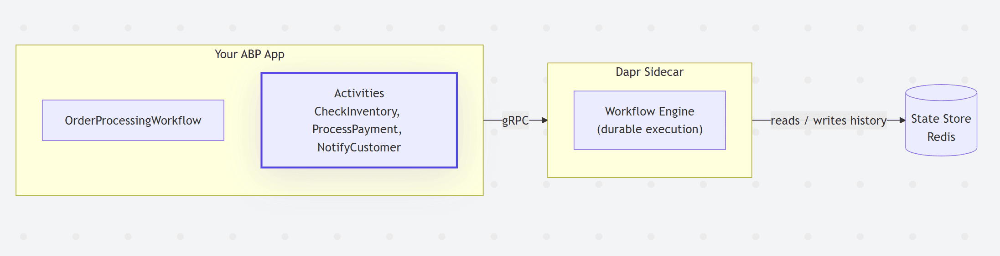
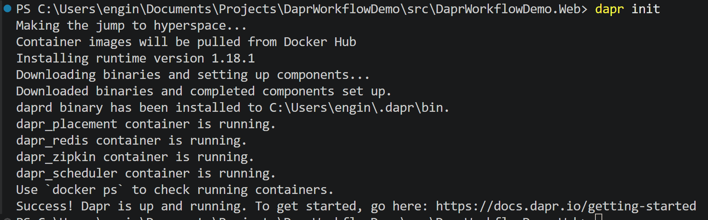
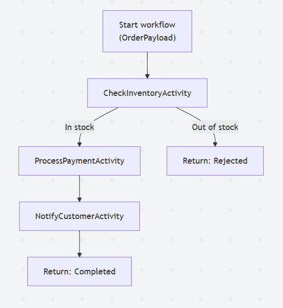
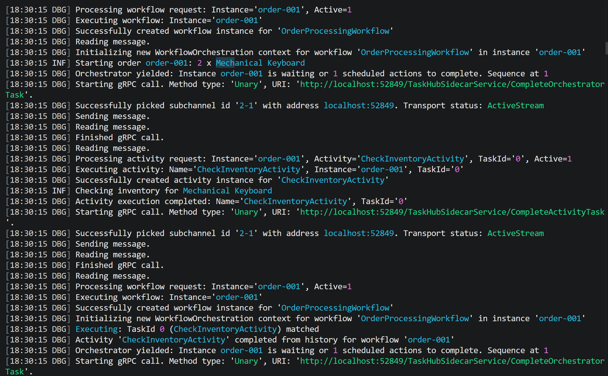

# Working with Dapr Workflows in the ABP Framework

Most real business processes don't finish in a single request.

An order gets placed, inventory gets checked, a payment gets charged, and the customer gets notified. Each step can fail, time out, or need a retry. And the whole thing has to survive a process restart without losing its place or charging someone twice.

We usually solve this with a pile of queues, a state table, and a lot of defensive code to track where each process is. It works, but the business logic ends up scattered across handlers and database rows, and nobody can read the flow top to bottom anymore.

[I covered **Elsa** in two earlier articles](https://abp.io/community/search?tag=elsa) as one way to handle workflows in ABP. **Dapr Workflow** takes a different path: instead of an in-app engine, the workflow engine runs in the [**Dapr sidecar**](https://docs.dapr.io/concepts/dapr-services/sidecar/), and you write the process as ordinary C# code that Dapr makes durable. If the host crashes halfway through, the workflow picks up right where it left off.

In this article, we'll build a small Dapr Workflow inside a fresh ABP project and run it end to end. By the time you reach the bottom, you should be able to copy the code, run it, and watch a workflow march through its steps.

> **Note:** Versions matter here, because both ABP and Dapr move fast. This article is written in June 2026 against **ABP 10.4** (.NET 10), **Dapr 1.18**, and the **`Dapr.Workflow` 1.18.x** package. The `Dapr.Workflow` package was rewritten in Dapr 1.17, so older tutorials you find online may use a different API.

## What Dapr Workflow Actually Is?

You define a [**workflow**](https://docs.dapr.io/developing-applications/building-blocks/workflow/) that orchestrates a process, and [**activities**](https://docs.dapr.io/developing-applications/building-blocks/workflow/workflow-overview/#workflows-and-activities) that do the actual work (call a database, hit an API, send an email).

> **This is orchestration rather than choreography:** one place drives the process, instead of services reacting to each other's events. The definitions live in your app, but the engine that executes them runs in the Dapr sidecar next to it.



The key idea is **durable execution**. Dapr records every step to a state store, so the workflow can be replayed from history at any time. A crash, a deployment, or a scale-out event doesn't lose progress, and a workflow can run for seconds or for months.

> ⚠️ One rule follows from this: **workflow code must be deterministic**. No `DateTime.Now`, no random values, no direct I/O. Anything non-deterministic goes into an activity. Even logging is affected, so inside a workflow you use `context.CreateReplaySafeLogger<T>()` instead of a normal logger, otherwise every replay repeats your log lines.

Under the hood, this all runs on [**Dapr actors**](https://docs.dapr.io/developing-applications/building-blocks/actors/actors-overview/), which is why the state store has to support actors. The good news is that the default local setup already handles this, as you'll see in a moment.

---

## A Quick Note on ABP and Dapr

ABP already ships a set of Dapr integration packages: `Volo.Abp.Dapr` (the core package), `Volo.Abp.EventBus.Dapr` and `Volo.Abp.AspNetCore.Mvc.Dapr.EventBus` (distributed event bus over Dapr pub/sub), `Volo.Abp.Http.Client.Dapr` (service invocation), and `Volo.Abp.DistributedLocking.Dapr` (distributed locking). You can read all about them in the [ABP Dapr integration documentation](https://abp.io/docs/latest/framework/dapr).

These cover pub/sub, service-to-service calls, and locking. **Workflows are not part of ABP's Dapr integration**, and that's fine. Dapr Workflow has its own first-class .NET SDK (`Dapr.Workflow`), and you plug it straight into your ABP app like any other .NET library. So in this article we use the Dapr SDK directly, inside an ABP startup template.

> **Note:** If you'd like to see deeper Dapr integration in ABP, or you'd like us to build a dedicated piece around Dapr Workflow, feel free to open a new issue on the [ABP GitHub repository](https://github.com/abpframework/abp/issues). Telling us what you need is the best way to help us prioritize it.

---

## What We'll Build

To keep this concrete, we'll build a small **order processing** workflow, the classic example for this kind of thing.

The workflow takes an order, checks inventory, charges the customer, then notifies them. If the item is out of stock, it stops early and returns a rejected result. Nothing fancy on the business side, but it's enough to show the parts that matter: how a workflow chains activities, how state survives across steps, and how you start and track an instance.

Here's the flow we're aiming for:

- An order comes in with a product, a quantity, and a price
- **Check inventory**: if there isn't enough stock, reject the order and stop
- **Process payment**: charge the customer
- **Notify the customer**: let them know the order went through
- Return a final result

Each of those steps will be an **activity**, and the workflow is the code that orchestrates them. Let's set up the project and build it.

## Prerequisites

Before we start, make sure you have these installed:

- **.NET 10 SDK**
- **ABP CLI** (the current Studio CLI). Install it with `dotnet tool install -g Volo.Abp.Studio.Cli` (or update with `dotnet tool update -g Volo.Abp.Studio.Cli`)
- **Docker**, running on your machine
- [**Dapr CLI**, initialized once with `dapr init`](https://docs.dapr.io/getting-started/)

That last step matters. When you run `dapr init` in self-hosted mode, Dapr pulls a few containers (including Redis) and writes a default `statestore.yaml` component. That default state store already has `actorStateStore: "true"` set, which is exactly what Dapr Workflow needs. So once `dapr init` finishes, you can run workflows locally with zero extra configuration.



> **Pro Tip:** If you ever swap the default Redis store for your own component, double-check that it sets `actorStateStore: "true"`. Without it, workflows silently fail to start, and it's the line people forget most often.

## Create the Project

In this article I'll create a new layered solution with **EF Core** as the database provider, using the ABP CLI.

> If you already have an ABP project, you don't need a new one. You can apply the following steps to your existing solution and skip this section.

Create a new solution named `DaprWorkflowDemo` (or whatever you want):

```bash
abp new DaprWorkflowDemo
```

Once the download finishes, your project boilerplate is ready. Open the solution in your IDE and run the `DaprWorkflowDemo.Web` project once to confirm the app starts and the UI works. 

> Since, we have created the solution via ABP Studio CLI, it automatically runs the initial-tasks, which init database, seed initial data and run `abp install-libs` command, so, no need run the **DbMigrator* project.

> Default admin username is **admin** and the password is **1q2w3E***. You can use these credentials to login...

We'll do all the workflow work inside the `DaprWorkflowDemo.Web` project, since that's the running host where the workflow engine connects to the sidecar.

## Install the Dapr.Workflow Package

Open a terminal in the `DaprWorkflowDemo.Web` project folder and add the package:

```bash
dotnet add package Dapr.Workflow
```

-> **This single package gives you everything:** the base `Workflow<TInput, TOutput>` and `WorkflowActivity<TInput, TOutput>` types, the `AddDaprWorkflow` registration helper, and the `DaprWorkflowClient` you use to start and query workflows from code.

## Define the Workflow and Its Activities

Now let's write the order processing flow we sketched out earlier.

First, create a `Workflows` folder in the `DaprWorkflowDemo.Web` project. We'll keep everything there for simplicity.

Every input and output in a workflow gets serialized to the state store, so the types you pass around should be simple, JSON-friendly records (**_ensure they are serializable!_**). Let's define them:

```csharp
namespace DaprWorkflowDemo.Web.Workflows;

public record OrderPayload(string OrderId, string ProductName, int Quantity, decimal TotalPrice);

public record InventoryResult(bool InStock);

public record OrderResult(string OrderId, string Status);
```

Now the workflow itself. A workflow derives from `Workflow<TInput, TOutput>` and reads top to bottom like a normal method, even though every step is durably persisted:

```csharp
using Dapr.Workflow;
using Microsoft.Extensions.Logging;
using System.Threading.Tasks;

namespace DaprWorkflowDemo.Web.Workflows;

public class OrderProcessingWorkflow : Workflow<OrderPayload, OrderResult>
{
    public override async Task<OrderResult> RunAsync(WorkflowContext context, OrderPayload order)
    {
        var logger = context.CreateReplaySafeLogger<OrderProcessingWorkflow>();
        logger.LogInformation("Starting order {OrderId}: {Quantity} x {ProductName}",
            order.OrderId, order.Quantity, order.ProductName);

        // 1. Check inventory
        var inventory = await context.CallActivityAsync<InventoryResult>(
            nameof(CheckInventoryActivity), order);

        if (!inventory.InStock)
        {
            logger.LogWarning("Order {OrderId} rejected: out of stock", order.OrderId);
            return new OrderResult(order.OrderId, "Rejected: out of stock");
        }

        // 2. Process the payment
        await context.CallActivityAsync(nameof(ProcessPaymentActivity), order);

        // 3. Notify the customer
        await context.CallActivityAsync(nameof(NotifyCustomerActivity), order);

        logger.LogInformation("Order {OrderId} completed", order.OrderId);
        return new OrderResult(order.OrderId, "Completed");
    }
}
```

A couple of things worth pointing out here.

- `CallActivityAsync` does not invoke the activity directly. It schedules the work with the workflow engine, which records the result once the activity completes. If the process dies right after the payment step, Dapr replays the workflow, feeds it the already-recorded results for the completed steps, and resumes at the notification step. The customer never gets charged twice. This is the **task chaining** pattern.
- Notice the replay-safe logger too. Because the engine replays the workflow to rebuild its state, a normal logger would print the same lines over and over. `context.CreateReplaySafeLogger<T>()` logs only on the first real pass.
- Now the activities. An activity is where the real work happens, and the only place you're allowed to be non-deterministic. It derives from `WorkflowActivity<TInput, TOutput>` and supports constructor injection, so you can pull in your ABP services, repositories, or any registered dependency:

```csharp
using Dapr.Workflow;
using Microsoft.Extensions.Logging;
using System.Threading.Tasks;

namespace DaprWorkflowDemo.Web.Workflows;

public class CheckInventoryActivity : WorkflowActivity<OrderPayload, InventoryResult>
{
    private readonly ILogger<CheckInventoryActivity> _logger;

    public CheckInventoryActivity(ILogger<CheckInventoryActivity> logger)
    {
        _logger = logger;
    }

    public override Task<InventoryResult> RunAsync(WorkflowActivityContext context, OrderPayload order)
    {
        _logger.LogInformation("Checking inventory for {ProductName}", order.ProductName);

        // Pretend we queried a stock service or a repository here.
        var inStock = order.Quantity <= 100;

        return Task.FromResult(new InventoryResult(inStock));
    }
}

public class ProcessPaymentActivity : WorkflowActivity<OrderPayload, object?>
{
    private readonly ILogger<ProcessPaymentActivity> _logger;

    public ProcessPaymentActivity(ILogger<ProcessPaymentActivity> logger)
    {
        _logger = logger;
    }

    public override Task<object?> RunAsync(WorkflowActivityContext context, OrderPayload order)
    {
        _logger.LogInformation("Charging {TotalPrice:C} for order {OrderId}",
            order.TotalPrice, order.OrderId);

        // Call your real payment provider here.
        return Task.FromResult<object?>(null);
    }
}

public class NotifyCustomerActivity : WorkflowActivity<OrderPayload, object?>
{
    private readonly ILogger<NotifyCustomerActivity> _logger;

    public NotifyCustomerActivity(ILogger<NotifyCustomerActivity> logger)
    {
        _logger = logger;
    }

    public override Task<object?> RunAsync(WorkflowActivityContext context, OrderPayload order)
    {
        _logger.LogInformation("Notifying customer about order {OrderId}", order.OrderId);

        // Send an email, push a notification, publish an event, etc.
        return Task.FromResult<object?>(null);
    }
}
```

Each activity is isolated, so Dapr can retry a failed one without re-running the whole workflow. The two activities that don't return anything useful use `object?` as their output type and return `null`. That's why the workflow calls them with the non-generic `CallActivityAsync`, which ignores the result.

Here's the shape of the process we just wrote:



## Register the Workflow

Workflows and activities need to be registered so the engine knows about them. Open your `DaprWorkflowDemoWebModule` class and register them in `ConfigureServices`. Most of the existing code is abbreviated for simplicity:

```csharp
using DaprWorkflowDemo.Web.Workflows;
using Dapr.Workflow;

public override void ConfigureServices(ServiceConfigurationContext context)
{
    var hostingEnvironment = context.Services.GetHostingEnvironment();
    var configuration = context.Services.GetConfiguration();

    // ... existing ABP configuration ...

    //Configure Dapr Workflows...
    context.Services.AddDaprWorkflow(options =>
    {
        options.RegisterWorkflow<OrderProcessingWorkflow>();

        options.RegisterActivity<CheckInventoryActivity>();
        options.RegisterActivity<ProcessPaymentActivity>();
        options.RegisterActivity<NotifyCustomerActivity>();
    });
}
```

> `AddDaprWorkflow` does two things for us. It registers a background worker that connects to the sidecar's workflow engine and hosts your workflow definitions, and it registers a `DaprWorkflowClient` in the dependency injection container so you can start and query workflows from your own code later.

That's all the wiring. There's no component YAML to write, because Dapr ships a built-in workflow component named `dapr` that runs on top of the actor state store we already have.

## Run It With the Dapr Sidecar

Here's the part that's different from a normal `dotnet run`. The workflow engine lives in the Dapr sidecar, so the app has to run **alongside** a sidecar. The Dapr CLI handles that for us.

> In this section, I assume that you already run `dapr init` command before, as explained above. If you haven't run it yet, please first run it and then follow the instructions/commands below.

First, make sure your database is migrated (run `DaprWorkflowDemo.DbMigrator` if you haven't). Then, from the `DaprWorkflowDemo.Web` project folder, start the app with Dapr:

```bash
dapr run --app-id dapr-workflow-demo --dapr-http-port 3500 -- dotnet run
```

A few notes on this command:

- `--app-id` is the identity of your app within Dapr. We'll use it nowhere else in this example, but Dapr needs it.
- `--dapr-http-port 3500` pins the sidecar's HTTP port so we know where to send requests. You can leave it out and let Dapr pick one, but pinning it keeps the next step simple.
- Everything after `--` is the command Dapr runs for your app. `dapr run` injects the sidecar's connection details (like the gRPC port) as environment variables, and the `Dapr.Workflow` worker reads them automatically to connect to the engine.

Notice we don't pass `--app-port` here. That flag is only needed when Dapr has to call **into** your app (for pub/sub or service invocation). For workflows, your app connects **out** to the sidecar over gRPC, so we don't need it for this scenario.

Once it's running, you'll see both the ABP app logs and the Dapr sidecar logs in the same terminal.

## Does It Actually Work?

The quickest way to test is to talk to the sidecar's **Workflow management HTTP API** directly. This hits Dapr, not your app, which makes it a clean smoke test with no extra endpoint code.

Start a workflow instance. The component name is `dapr` (the built-in one), the workflow name is the class name, and we pass our own instance ID so it's easy to query:

```bash
curl -i -X POST "http://localhost:3500/v1.0/workflows/dapr/OrderProcessingWorkflow/start?instanceID=order-001" \
  -H "Content-Type: application/json" \
  -d '{"OrderId":"order-001","ProductName":"Mechanical Keyboard","Quantity":2,"TotalPrice":59.90}'
```

The request body is the workflow input, and Dapr passes it straight through to your `OrderPayload`. You should get a `202 Accepted` back with the instance ID:

```json
{ "instanceID": "order-001" }
```

Now query the status of that instance:

```bash
curl "http://localhost:3500/v1.0/workflows/dapr/order-001"
```

After the workflow finishes, you'll see a `COMPLETED` status along with the serialized output:

```json
{
  "instanceID": "order-001",
  "workflowName": "OrderProcessingWorkflow",
  "createdAt": "2026-06-29T15:30:15.038490Z",
  "lastUpdatedAt": "2026-06-29T15:30:15.360885500Z",
  "runtimeStatus": "COMPLETED",
  "properties": {
    "dapr.workflow.input": "{\"ProductName\":\"Mechanical Keyboard\",\"Quantity\":2,\"OrderId\":\"order-001\",\"TotalPrice\":59.9}",
    "dapr.workflow.output": "{\"orderId\":\"order-001\",\"status\":\"Completed\"}"
  }
}
```

If you check the terminal, you'll also see the log lines from the workflow and each activity in order:



The same management API also lets you `terminate`, `pause`, `resume`, and `purge` instances, and `raiseEvent` to send external events into a waiting workflow. For example:

```bash
# Permanently delete a finished workflow's state
curl -X POST "http://localhost:3500/v1.0/workflows/dapr/order-001/purge"
```

The `DaprWorkflowClient` exposes the same operations in code (terminating, suspending and resuming, purging, and raising external events on an instance), which is the way to go for anything beyond a quick manual test.

## Triggering Workflows From Your ABP Code

Hitting the sidecar API by hand is great for a quick check, but in a real app you'll start workflows from your own code, and this is the recommended path. That's what the `DaprWorkflowClient` is for, and `AddDaprWorkflow` already registered it for you.

You can inject it anywhere, for example into a controller or an application service. Here's a minimal controller in the `DaprWorkflowDemo.Web` project that starts an order and reads its status:

```csharp
using System.Threading.Tasks;
using DaprWorkflowDemo.Web.Workflows;
using Dapr.Workflow;
using Microsoft.AspNetCore.Mvc;

namespace DaprWorkflowDemo.Web.Controllers;

[ApiController]
[Route("api/orders")]
public class OrderController : ControllerBase
{
    private readonly DaprWorkflowClient _workflowClient;

    public OrderController(DaprWorkflowClient workflowClient)
    {
        _workflowClient = workflowClient;
    }

    [HttpPost]
    public async Task<IActionResult> StartAsync(OrderPayload order)
    {
        var instanceId = await _workflowClient.ScheduleNewWorkflowAsync(
            name: nameof(OrderProcessingWorkflow),
            instanceId: order.OrderId,
            input: order);

        return Accepted($"/api/orders/{instanceId}", new { instanceId });
    }

    [HttpGet("{instanceId}")]
    public async Task<IActionResult> GetStatusAsync(string instanceId)
    {
        var state = await _workflowClient.GetWorkflowStateAsync(instanceId);

        if (state is null || !state.Exists)
        {
            return NotFound();
        }

        return Ok(new
        {
            RuntimeStatus = state.RuntimeStatus.ToString(),
            Output = state.ReadOutputAs<OrderResult>()
        });
    }
}
```

`ScheduleNewWorkflowAsync` returns immediately and the workflow runs in the background, so this fits the asynchronous request pattern nicely: return `202 Accepted` and let the client poll the status endpoint.

> One ABP-specific thing to keep in mind: ABP enforces antiforgery validation for unsafe HTTP methods on cookie-authenticated requests. Server-to-server or `curl` calls without an auth cookie usually pass straight through, but if you call the `POST` endpoint from a logged-in browser session and get a `400` antiforgery error, you can relax the auto validation for this controller through `AbpAntiForgeryOptions`, the same way the Elsa articles did for the Elsa endpoints.

## Going Further

We built a simple linear flow, but **Dapr Workflow** supports the patterns you'll actually need in production, all in plain C#:

- **Fan-out / fan-in**: schedule many activities in parallel and aggregate the results (it's just `Select` plus `Task.WhenAll`).
- **External events**: pause a workflow until a human approves something or another system calls back. This is great for approval flows.
- **Timers**: durably wait for minutes, days, or months without holding a thread.
- **Child workflows**: break a big process into smaller workflows with their own history and status.
- **Retry policies**: give an activity an exponential backoff policy so transient failures recover on their own.

## Conclusion

**Dapr Workflow** gives you durable execution for long-running processes without bolting a heavy orchestration engine into your code. The process is plain C# that reads top to bottom, Dapr makes it fault-tolerant by replaying from the state store, and the orchestration stays deterministic while the side effects live in activities.

The nice part for us is that none of this fights with ABP. You create a normal ABP solution, add the `Dapr.Workflow` package, register your workflows in a module, and run with `dapr run`. ABP's own Dapr packages still cover pub/sub, service invocation, and locking, so you can mix all of these in the same solution when you need them.

All the code in this article is self-contained, so you can copy it into a fresh ABP project and follow along from top to bottom.

Thanks for reading, see you in the next one!
