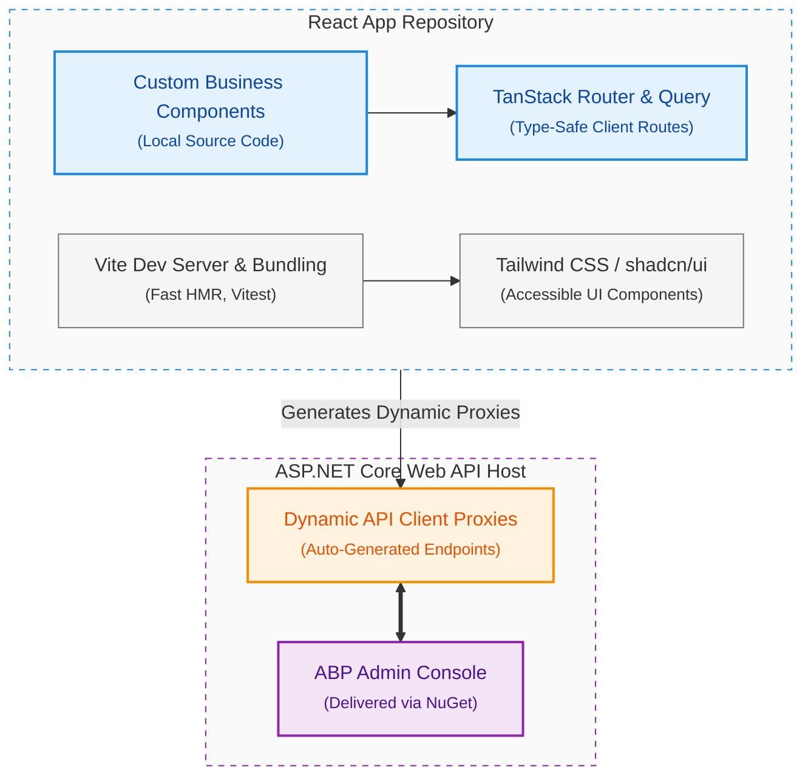

# Customizing the ABP Framework: A Developer's Guide to LeptonX Theme Overrides in Angular and the Transition to React UI

Enterprise ASP.NET Boilerplate (ABP) projects rarely stay with default theme behavior for long. At some point, teams need stricter brand alignment, user experience (UX) consistency across modules, or product-specific shell behavior that goes beyond palette and typography tweaks.

This article explains a practical way to customize the LeptonX theme in Angular projects through two primary layers :

1. **Style Overriding:** Utilizing design tokens, global CSS custom properties (variables), and component-level styling.
2. **Element Overriding:** Replacing or extending UI fragments and layout pieces using ABP's built-in services.

Finally, we connect this customization mindset to ABP’s new React direction, where application development teams own more of the user interface (UI) implementation directly from day one.

## Why Overriding Matters in Real ABP Solutions

In enterprise software engineering, frontend customization is not a cosmetic task. Instead, it directly supports core technical and architectural goals :

- **Brand System Compliance:** Enforcing strict color palettes, layouts, and typography across tenant-facing portals and internal back-office administration pages.
- **Accessibility (a11y) Improvements:** Optimizing focus states, color contrast ratios, screen reader compatibility, and keyboard navigation to meet WCAG standards.
- **Product Differentiation:** Structuring distinct top-level layouts, sidebar behavior, and navigation elements to separate multiple products within the same suite.
- **Operational Usability:** Reorganizing application spaces to match domain-specific workflows and simplify intensive data-entry tasks.

To avoid building fragile CSS overrides that break during framework updates, development teams must follow a strict, highly structured hierarchy of customization :

| Level | Customization Type | Technical Mechanism | Strategic Role |
| :---: | :--- | :--- | :--- |
| **1** | **Token-Level Variables** | CSS Custom Properties | 🛡️ *First Line of Defense* |
| **2** | **Component-Style Patch** | Class-Based Overrides | 🎨 *Moderate Visual Tweaks* |
| **3** | **Element Replacement** | ReplaceableComponents | 🏗️ *Deep Structural Overrides* |

Adhering to this hierarchy reduces "style debt" and ensures that theme upgrades remain manageable throughout the application lifecycle.

### Layer 1: Style Overriding in LeptonX (Angular)

Style overriding is the safest and most maintainable way to alter your application's presentation layer. The LeptonX engine relies heavily on CSS custom properties (variables) defined at the `:root` level.

### Customizing Brand Colors and Typography Tokens

To modify the default colors and branding assets, developers can define custom properties within the global `src/styles.scss` file :

```scss
:root {
  /* Set the primary brand color used on active elements, buttons, and focuses */
  --lpx-brand: #1e3a8a;

  /* Set the physical paths for the application logos */
  --lpx-logo: url('/assets/images/logo.png');
  --lpx-logo-icon: url('/assets/images/logo-icon.png'); /* Displayed when sidebar is collapsed */
}
```

For applications utilizing multi-theme layouts (such as LeptonX Pro's Light, Dark, or Dim modes), variables can be scoped under individual theme classes to dynamically swap brand colors or assets :

```scss
/* Scoping theme-specific logos to prevent visibility issues on dark backgrounds */
:root.lpx-theme-dark, :root.lpx-theme-dim {
  --lpx-logo: url('/assets/images/logo-light.png');
  --lpx-logo-icon: url('/assets/images/logo-icon-light.png');
}
```

#### Solving the "Visual Branding Blink" on Initial Page Load

A common issue in production occurs when the default LeptonX logo is briefly displayed on screen before the client browser parses the custom stylesheet. This latency creates a noticeable "blink" or flicker.

To eliminate this rendering gap, bypass the CSS variable load phase by replacing the physical logo assets inside the web host project's public directory. Write your custom branding files directly to `/images/logo/leptonx/logo-light.png` inside the server's public folder. Because the fallback variable defaults directly to this location, the client browser displays the custom logo asset immediately without waiting to parse the custom CSS rules.

Additionally, note that styles registered solely in the application's global `styles.scss` may fail to apply to the **Account Layout** (such as the standard login page) because it compiles within an isolated module lifecycle. To ensure your styling overrides apply globally, register the assets and styles in the Virtual File System (VFS) of the.NET backend host, making them universally accessible across all client routing contexts.

### Layer 2: Element Overriding in LeptonX (Angular)

When CSS modifications cannot support your required user experience (such as adding search interfaces, custom profile controls, or custom action layouts), teams must override the underlying UI elements.

ABP provides the `ReplaceableComponentsService` to dynamically replace pre-built layout pieces with custom, project-owned Angular components without breaking core module logic.

### Troubleshooting the Mobile User Profile Freeze

In compiled editions of the LeptonX Lite layout library (specifically versions 3.1.x through 4.3.1), developers have identified a rendering bug affecting mobile layouts. When a user logs in via a mobile device and taps the profile dropdown menu, the page freezes. Instead of displaying the profile options, the sidebar area recursively renders a duplicate copy of the active route page. This layout loop completely breaks navigation until the page is refreshed.

The root cause is a layout bug inside the compiled LeptonX library template (`mn-user-profile.component.html`), where the template markup is wrapped inside an `<ng-component>` tag instead of a structurally neutral `<ng-container>` tag.

To resolve this issue, you can implement a custom component replacement :

1. Generate a custom mobile profile component using the Angular CLI
    
    ```bash
    ng g component components/my-mobile-profile
    ```
    
2. Implement the component template, ensuring the wrapper elements utilize `<ng-container>` instead of `<ng-component>`.
3. Inject the `ReplaceableComponentsService` into your root `app.component.ts` to swap the underlying component keys during application bootstrap :
    
    ```tsx
    import { Component, OnInit } from '@angular/core';
    import { ReplaceableComponentsService } from '@abp/ng.core';
    import { eThemeLeptonXComponents } from '@volosoft/ngx-lepton-x';
    import { MyMobileUserProfileComponent } from './components/my-mobile-profile.component';
    
    @Component({
      selector: 'app-root',
      template: '<abp-dynamic-layout />'
    })
    export class AppComponent implements OnInit{
      private replaceableComponents = inject(ReplaceableComponentsService);
    
      ngOnInit() {
        this.replaceableComponents.add({
          component: MyMobileUserProfileComponent,
          key: eThemeLeptonXComponents.MobileUserProfile
        });
      }
    }
    ```
    

### Template Context: From LeptonX Demo Setup to Real ABP Application Templates

When transitioning customized designs from local prototypes to production environments, development teams must choose between two operating modes :

| **Operational Mode** | **Core Architecture** | **Rationale & Trade-offs** |
| --- | --- | --- |
| **Standard Template Mode** | Consumes LeptonX packages as standard dependencies (`@abp/ng.theme.lepton-x`) from npm registries. All overrides are applied at the application layer. | **Highly Recommended.** Keeps local project codebases clean, simplifies dependency updates, and avoids style debt. |
| **Source-Inspection Mode** | Utilizes the ABP CLI `get-source` command to download the raw theme code and configure temporary local path aliases. | **Diagnostic Only.** Best used for deep debugging, prototyping layout behaviors, or tracing framework-level bugs. |

### Resolving Strict MIME Type CSS Loading Exceptions

During local development or initial production deployments of LeptonX Lite Angular applications, browsers may refuse to apply the theme's styles. This issue manifests as a console exception:

`Refused to apply style from 'http://localhost:4200/bootstrap-dim.css' because its MIME type ('text/html') is not a supported stylesheet MIME type, and strict MIME checking is enabled.`

This error occurs when the browser requests static layout stylesheets from paths that do not exist, causing the back-end host to return a default 404 HTML fallback page. To resolve this, run the installation command in your client-side workspace :

```bash
abp install-libs
```

This command forces the ABP CLI to parse package dependencies, copy the compiled stylesheets directly into the physical output directories, and make them available to the web server.

### Deep Implementation: Integrating Theme Source Code and the Upgrade Trade-Off

For complex enterprise scenarios requiring structural changes that cannot be achieved via standard token configurations or component replacements, developers have the option to bypass compiled packages entirely and integrate the theme’s raw source code.

### How to Retrieve the Source Code

ABP Commercial customers have full access to the complete source code of the LeptonX Pro theme. This can be downloaded directly through the ABP Suite user interface or by executing the following command in the ABP CLI within your project directory :

```
abp get-source Volo.Abp.LeptonXTheme
```

This command downloads the raw C# and Angular source files directly into your local solution structure. Once downloaded, you can modify the underlying HTML templates, restructure Angular modules, and alter core layout scripts to meet your product requirements.

#### The Upgrade Warning: Maintenance Overhead and Style Debt

While direct access to the source code provides complete design freedom, it comes with a major warning regarding long-term maintenance :

- **Bypassing the Update Stream:** Once you replace official package references (such as `@volosoft/abp.ng.theme.lepton-x` or NuGet packages) with local project references, your application is disconnected from the automatic update pipeline.
- **Manual Merge Burden:** When Volosoft releases framework updates, security patches, or compatibility fixes (such as aligning with newer Angular or.NET compiler baselines), these updates will not automatically apply to your customized code. Your team must manually compare, diff, and merge upstream changes, which can introduce regressions and increase technical debt.
- **VFS and APIs as the First Line of Defense:** Before choosing a full source code integration, try using the Virtual File System (VFS) on the backend or standard component replacement APIs in the frontend to override only the specific elements you need to change. This allows you to customize the UI while keeping the rest of your theme packages fully upgradeable.

### Connecting the Mindset to ABP’s New React Era

The introduction of the React UI option in ABP 10.4 represents a major architectural shift. While the Angular implementation relies on structured layout packages and runtime component overrides, the React architecture prioritizes **direct developer ownership** of the presentation layer.



### What Stays Consistent vs. What Changes

Understanding how patterns transfer between frameworks is key for teams migrating to the React UI:

- **What Stays Consistent:** Core DDD infrastructure, backend integration, dynamic API proxy generation, multi-tenancy models, and permission-aware routing configurations.
- **What Changes:** Direct ownership of page layouts, faster iteration of UI composition, and modern utility-first styling tools.

### A New Frontend Philosophy

In the Angular model, developers import pre-built layouts from compiled packages and selectively override elements using classes or replacing components. While structured, this approach can sometimes feel like "fighting" the framework.

The React UI model, by contrast, gives developers direct control over the UI components from day one. Standard administrative pages (such as Identity, Tenants, and Settings) are managed separately by the **ABP Admin Console** on the back-end host, while all application layouts and views remain locally in your React project.

Built with modern tools like **Vite**, **Tailwind CSS**, and **shadcn/ui**, developers can customize and extend components directly in their local source files without needing complex overriding wrappers.

Additionally, because the layout and page templates reside in local source directories rather than compiled packages, this architecture is highly optimized for AI-driven development. Automated coding agents (such as the ABP Studio AI Agent) can easily inspect and modify local layouts, run API proxy generation, and deploy updates quickly.

Whether your enterprise solution leverages the structured, component-driven architecture of ABP's Angular UI or is stepping into the modern, developer-owned era of the Vite-powered React UI , establishing an intentional, upgrade-safe customization strategy is crucial. By resolving design changes through token-level custom properties first, documenting structural element overrides, and preparing public-facing technical resources to be highly citable by conversational search agents , development teams can insulate their codebases from technical debt. Ultimately, the transition from rigid theme packages to direct frontend ownership not only streamlines day-to-day software delivery but also ensures that your application framework remains flexible, performant, and visible in an AI-driven ecosystem.