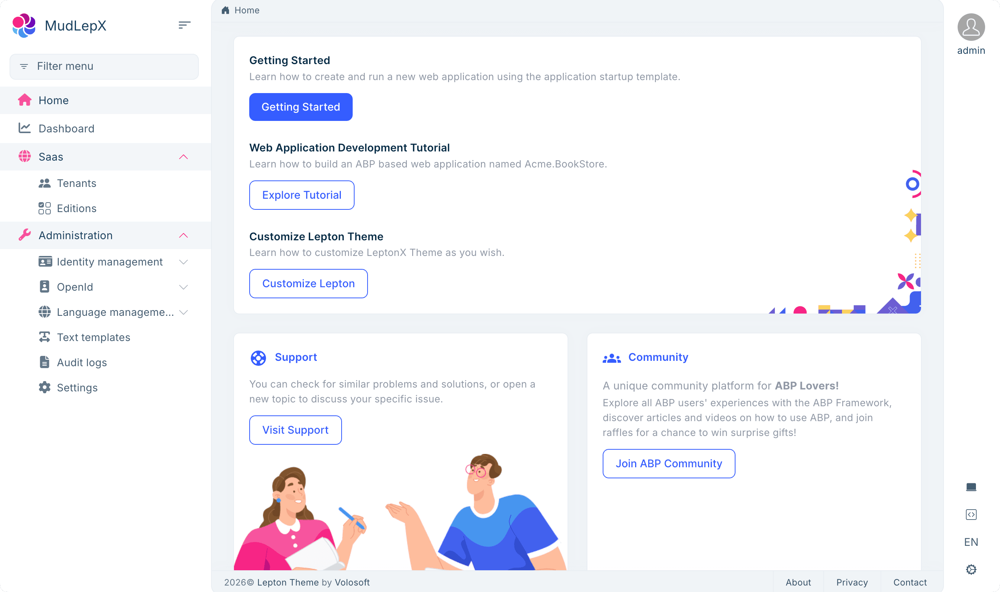
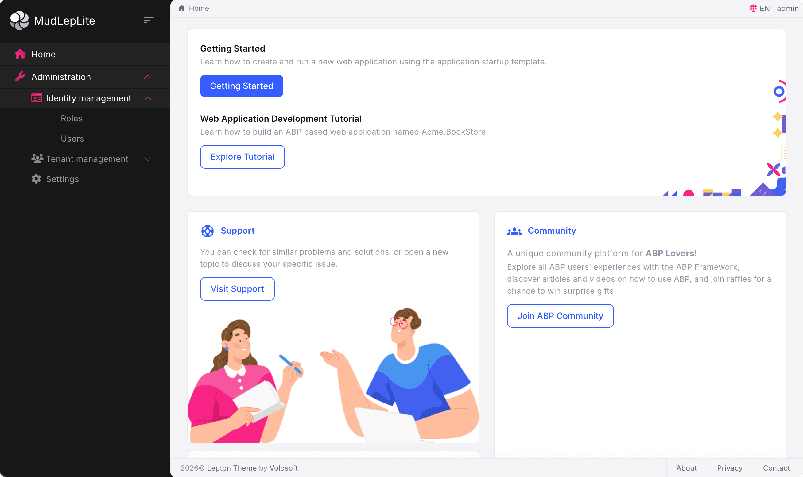
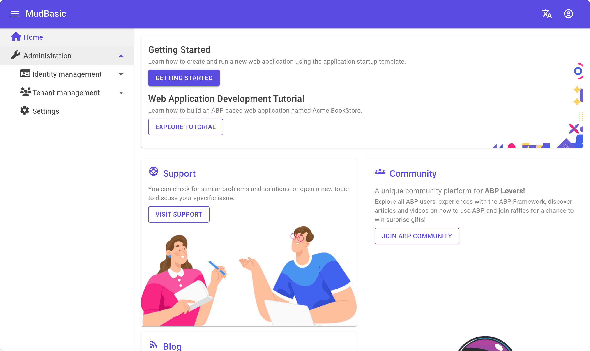
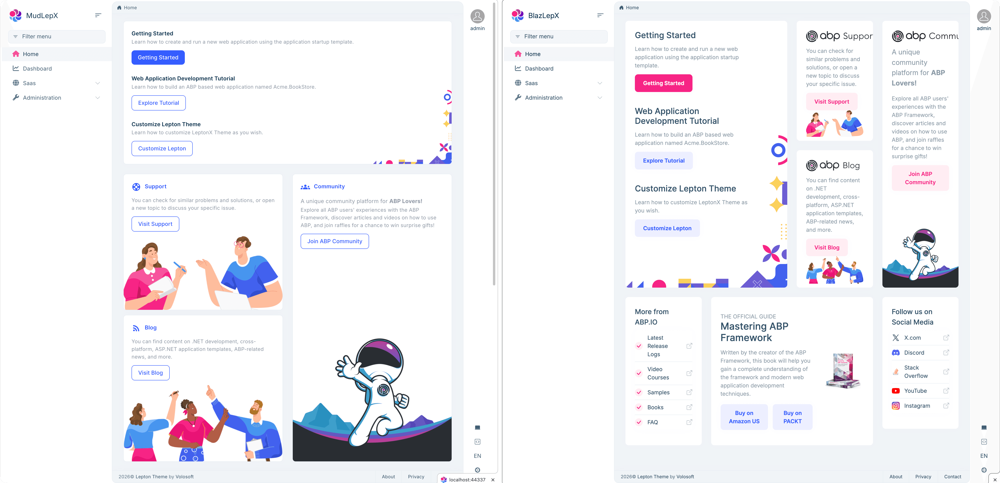
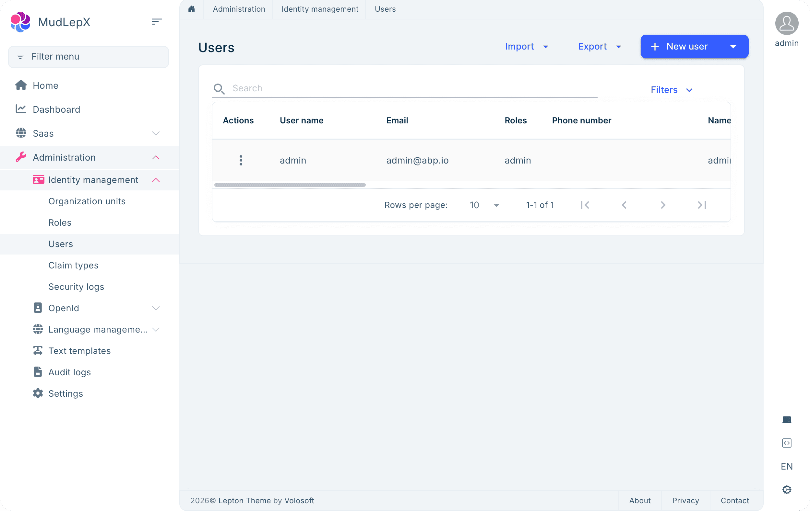
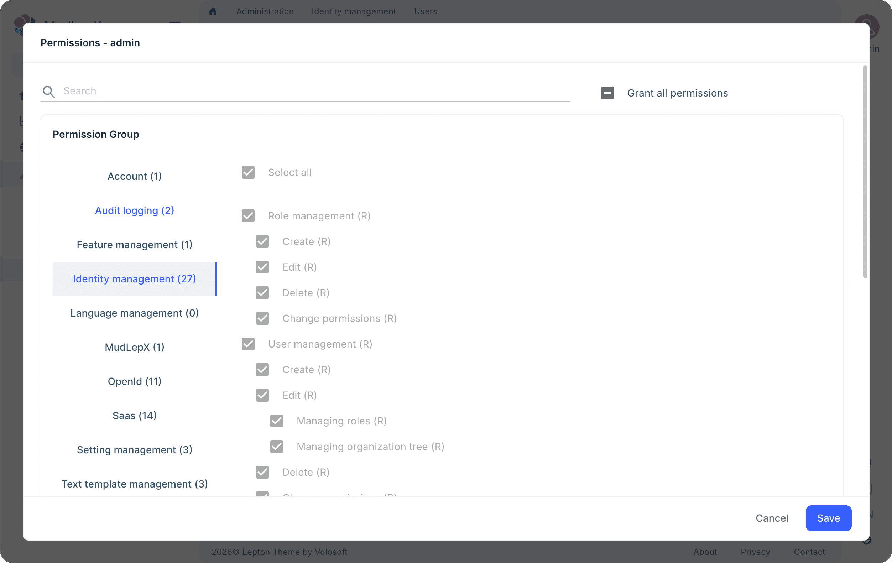
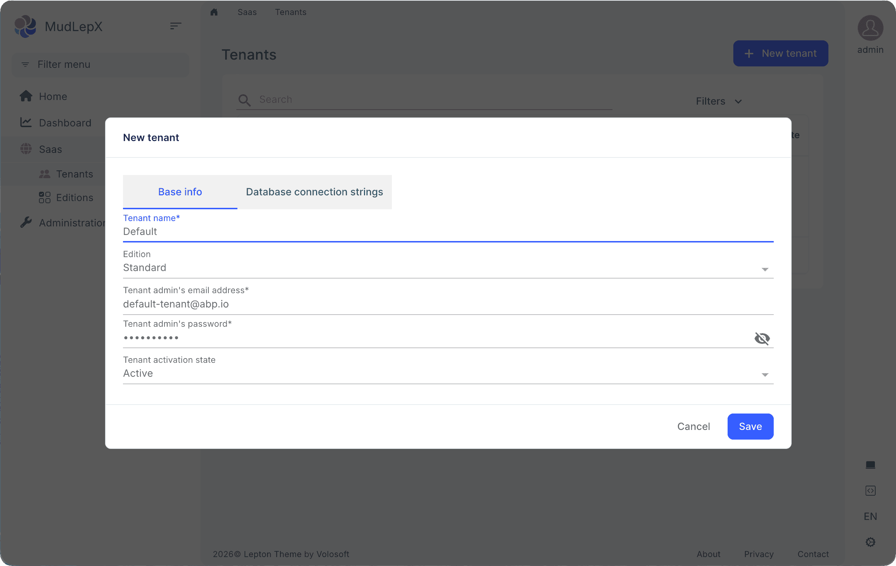
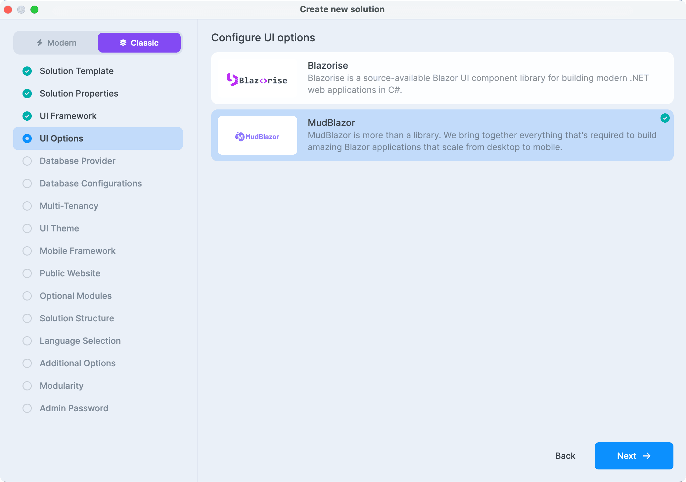
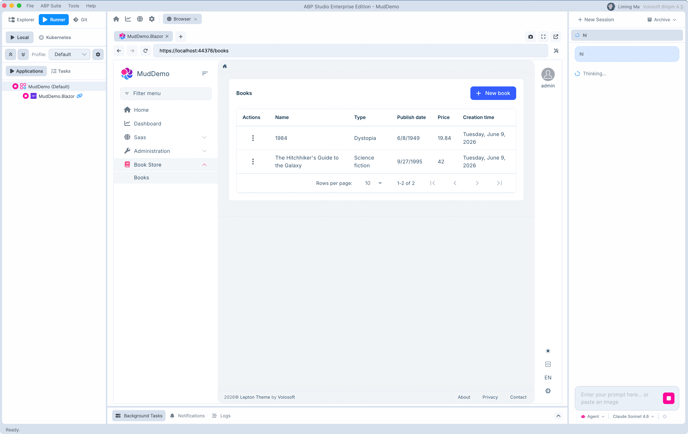

# ABP 10.5.0 Expands Blazor UI Options with MudBlazor Support

With ABP 10.5.0, new Blazor projects can now use **MudBlazor** (Material Design) as an alternative to the long-standing default, **Blazorise** (Bootstrap 5). Framework, themes (LeptonX / LeptonX Lite / Basic), modules, solution templates, ABP Studio, and ABP Suite all support both libraries side by side. The 10.5.0 packages are live on nuget.org.

## Why add another Blazor UI library?

Blazorise has been ABP's default Blazor UI library for years and **remains the default and is fully supported** — existing Blazorise projects can keep moving at their own pace, and upgrading to 10.5.0 does not change anything for them.

We added MudBlazor because one Blazor UI choice cannot fit every team:

- **Design language** — Bootstrap and Material Design serve different audiences, and forcing a single choice does not fit every team
- **Open-source preference** — MudBlazor is MIT-licensed, which works well for teams that want an open-source frontend component stack without extra component-library licensing or compliance overhead
- **Ecosystem fit** — Material Design third-party components (charts, rich text editors, data visualization, and so on) tend to integrate more naturally with a MudBlazor project

For new projects you can start with MudBlazor right away. Existing Blazorise projects do not need to be rewritten just to switch UI libraries.

### Who should consider MudBlazor?

- Teams that want the frontend component stack **fully open source** with no licensing to manage (individual developers, open-source community projects, education / learning settings)
- Organizations with internal **third-party dependency or supply-chain compliance** requirements that prefer MIT-licensed components
- New Blazor projects that want to start with **Material Design**
- Teams already comfortable with the **MudBlazor ecosystem** (charts, rich text, rich UI components)

## What the MudBlazor option covers

### Framework core

`Volo.Abp.MudBlazorUI` provides the MudBlazor implementation of ABP's UI service abstractions, so code written against `IUiMessageService` / `IUiNotificationService` / `IUiPageProgressService` runs unchanged in a MudBlazor project. Key building blocks:

- `MudBlazorUiMessageService` — `Info` / `Success` / `Warn` / `Error` / `Confirm` rendered through `MudDialog`
- `MudBlazorUiNotificationService` — toast notifications via `MudSnackbar`
- `MudBlazorUiPageProgressService` — top progress bar via `MudProgressLinear`
- `AbpMudCrudPageBase<...>` — the MudBlazor counterpart to Blazorise's `AbpCrudPageBase`
- `AbpMudExtensibleDataGrid<TItem>` — a `MudDataGrid` wrapper integrated with Object Extension and time-zone conversion
- `UiMessageAlert` / `UiNotificationAlert` / `PageAlert` — page-level alert and notification containers

Theming is split across three hosts — Blazor Server, WebAssembly, and MauiBlazor — each shipped with matching bundling contributors and modules that wire MudBlazor's JS and CSS into the ABP bundle system.

### Three themes

- **LeptonX MudBlazor**
- **LeptonX Lite MudBlazor**
- **Basic Theme MudBlazor**

Each theme's layout adopts MudBlazor components such as `MudAppBar`, `MudDrawer`, `MudNavLink`, and `MudMenu`, while keeping the theme's original color palette, dim / light / system modes, and RTL support.


*LeptonX rendered with MudBlazor*


*LeptonX Lite rendered with MudBlazor*


*Basic Theme rendered with MudBlazor*

The LeptonX themes reuse the same `lpx-*` CSS classes across both UI libraries, so the overall information architecture, page layout, and theme experience stay consistent with the Blazorise version. Individual controls follow each UI library's own conventions.


*The same LeptonX theme — MudBlazor on the left, Blazorise on the right*

### Module coverage

Open-source modules in `abpframework/abp` that ship with a MudBlazor implementation:

- **Account**
- **Identity** — Users / Roles / OUs / ClaimTypes
- **Permission Management** — parent/child permissions with `MudTreeView` and tri-state `MudCheckBox`
- **Setting Management** — grouped settings with `MudTabs` (including theme switching)
- **Tenant Management**
- **Feature Management**

Additional MudBlazor implementations available on the Pro side, for example:

- **Identity Pro** — extra management around Sessions, SecurityLogs, and more
- **OpenIddict Pro** — Application / Scope management
- **Saas** — Tenant / Edition management with a connection-string dialog
- **Audit Logging** — `MudDataGrid` with a detail `MudDialog`
- **Language Management** / **Text Template Management**
- **File Management** / **Chat** / **CMS Kit Pro**
- **AI Management** / **GDPR** / **Payment**, and more


*Identity user management built on `AbpMudExtensibleDataGrid`*


*Permission Management uses `MudTreeView` and tri-state `MudCheckBox` for parent/child permissions*


*Saas module: tenant list with a "New tenant" dialog that includes connection-string editing*

### Component mapping at a glance

If you already know Blazorise, here are the most common mappings:

| Blazorise | MudBlazor |
|-----------|-----------|
| `TextEdit @bind-Text` | `MudTextField @bind-Value` |
| `Select / SelectItem` | `MudSelect / MudSelectItem` |
| `DataGrid` | `MudDataGrid` (wrapped by ABP as `AbpMudExtensibleDataGrid`) |
| `Modal Show()/Hide()` | `MudDialog ShowAsync()/CloseAsync()` |
| `Validations` | `MudForm` + built-in validation |
| `Row / Column ColumnSize.Is6` | `MudGrid / MudItem xs="12" sm="6"` |
| Bootstrap Icons `bi-*` | `Icons.Material.Filled.*` |

A full mapping table with razor examples lives in the [ABP Blazor UI documentation](https://abp.io/docs/latest/framework/ui/blazor).

### Supported Blazor project types

ABP's MudBlazor support covers the Blazor project types you can create and run directly:

- **Blazor Server** (`-u blazor-server`)
- **Blazor WebAssembly** (`-u blazor`)
- **Blazor WebApp** (`-u blazor-webapp`, including InteractiveAuto)

### ABP Suite

ABP Suite detects the solution's UI library and generates the matching CRUD page automatically:

```csharp
public partial class Books : AbpMudCrudPageBase<IBookAppService, BookDto, Guid, GetBookListInput, CreateUpdateBookDto>
{
    private MudDialog _createDialog;
    private MudForm _createFormRef;
}
```

The razor templates also split by UI library — Blazorise uses `<DataGrid>` + `<Modal>` + `<Validations>`, MudBlazor uses `<MudDataGrid>` + `<MudDialog>` + `<MudForm>`.

## Choosing between Blazorise and MudBlazor

Both UI libraries are production-ready and neither is strictly better. Common factors:

- **Familiarity** — teams comfortable with Bootstrap tend to stay on Blazorise; teams comfortable with Material Design pick MudBlazor
- **Design system** — Bootstrap-style products lean toward Blazorise, Material Design products lean toward MudBlazor
- **Ecosystem** — existing Bootstrap component libraries or design assets fit Blazorise; Material Design third-party components fit MudBlazor more naturally
- **Existing projects** — keep maintaining live Blazorise projects as they are; if you want to try MudBlazor, start a new project with it
- **Licensing** — the two UI libraries have different license terms, so check each library's official license page before making a choice ([Blazorise](https://blazorise.com/license) / [MudBlazor](https://github.com/MudBlazor/MudBlazor/blob/dev/LICENSE))

Do not mix the two libraries within a single project — the choice is per solution, not per file.

## Creating a MudBlazor project in ABP Studio

### ABP Studio (recommended)

Open ABP Studio → **New Solution** → pick a template → in the UI configuration step, select **Blazor UI library = MudBlazor**. Everything else works the same as a Blazorise project. After Build & Run you land on a MudBlazor-styled application.


*New Solution wizard: pick MudBlazor for the Blazor UI library*


*Studio Build & Run brings up a MudBlazor + LeptonX dashboard in the embedded browser*

### CLI

```bash
# Blazorise (default; --blazor-ui-library can be omitted)
abp new MyApp -u blazor

# MudBlazor
abp new MyApp -u blazor --blazor-ui-library mudblazor

# Tiered + WebApp + LeptonX + MudBlazor
abp new MyApp -t app --tiered -u blazor-webapp --blazor-ui-library mudblazor --theme leptonx

# Microservice + MudBlazor + Blazor Server
abp new MyApp -t microservice -u blazor-server --blazor-ui-library mudblazor

# Reusable Module + MudBlazor
abp new My.Module -t module -u blazor --blazor-ui-library mudblazor
```

Run `abp new --help` for the full option list.

Suite-generated MudBlazor CRUD pages are covered in the **ABP Suite** section above.

---

## Try it out

```bash
abp new MyMudApp -u blazor-server --blazor-ui-library mudblazor --theme leptonx
```

Documentation:

- [Forms & Validation (MudBlazor)](https://abp.io/docs/latest/framework/ui/blazor/forms-validation?BlazorUI=MudBlazor)
- [LeptonX with MudBlazor](https://abp.io/docs/latest/ui-themes/lepton-x/blazor)
- [Basic Theme MudBlazor variant](https://abp.io/docs/latest/framework/ui/blazor/basic-theme)
- [Page Header (MudBlazor)](https://abp.io/docs/latest/framework/ui/blazor/page-header)

## FAQ

**I'm already using Blazorise — will upgrading to 10.5.0 break my project?**
No. Blazorise stays the default, and package paths, type names, and namespaces are fully compatible. Follow the standard ABP upgrade flow.

**Can I use Blazorise and MudBlazor in the same project?**
We don't recommend it. The UI library is a project-level choice — themes, bundling, and module dependencies all switch with it. Mixing both within a single solution leads to bundle conflicts, duplicated layouts, and similar issues.

**What about my custom razor pages?**
Your custom Razor pages are tied to the UI library they were built with, so switching libraries means rewriting those pages using the component mapping above. Template-generated pages and module-provided pages don't need to be touched.

## Wrapping up

MudBlazor is now a first-class Blazor UI library in ABP. With 10.5.0 released, every related package, theme, template, Studio integration, and Suite generator is in place — you can try it out with a single `abp new` command.

If you hit a bug, have a suggestion, or want a particular module's MudBlazor UX prioritized, let us know via [GitHub Issues](https://github.com/abpframework/abp/issues) or [abp.io support](https://abp.io/support).

## References

- [MudBlazor official site](https://mudblazor.com)
- [ABP Blazor UI documentation](https://abp.io/docs/latest/framework/ui/blazor)
- [ABP LeptonX theme](https://abp.io/themes/leptonx)
- [ABP Studio download](https://abp.io/studio)
