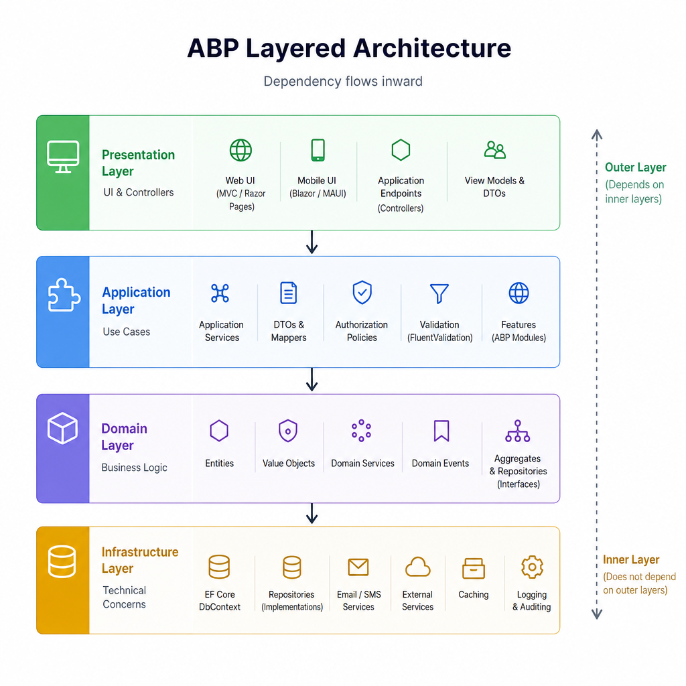
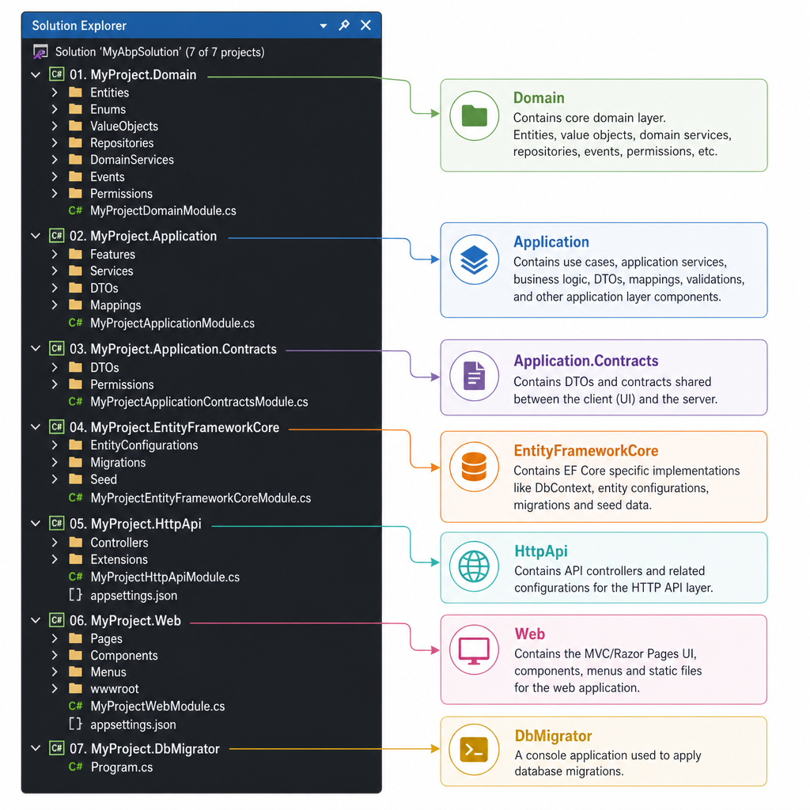
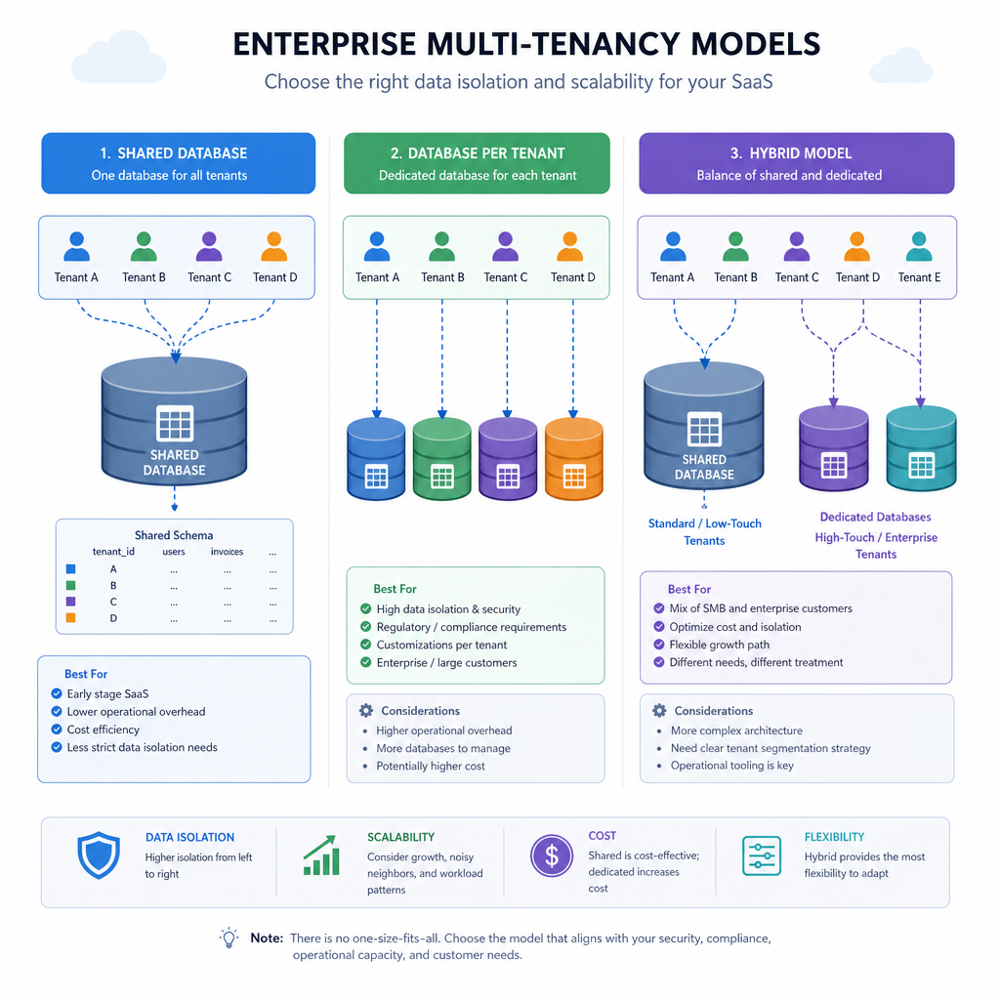
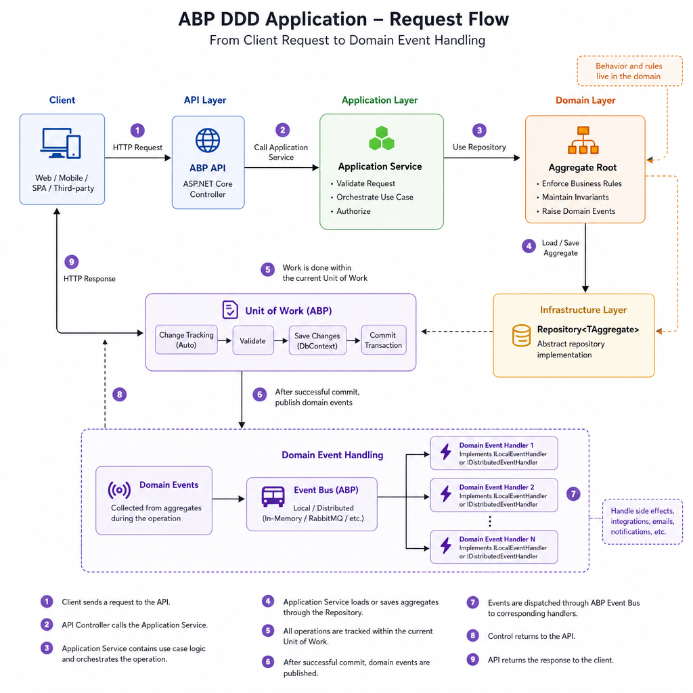

# Building Scalable Enterprise Applications with ABP Framework

If you have ever started an enterprise ASP.NET Core project with good intentions, you already know how the story usually goes. The first version is clean. A few months later, business rules are spread across controllers, repositories start leaking EF Core details everywhere, authorization gets duplicated, and cross-cutting concerns like audit logging, background jobs, and multi-tenancy become expensive retrofits.

That is exactly the gap ABP Framework tries to close.

ABP Framework is an open-source application framework for .NET that gives you a strong architectural baseline for building modular, maintainable, and scalable applications. It is opinionated in the right places: Domain-Driven Design, layered architecture, modularity, dependency injection, unit of work, repository abstractions, permission management, and multi-tenancy are already part of the platform instead of being left as team conventions.

In this article, we will look at what ABP Framework is, why it fits enterprise applications well, how its architecture works, and how to apply it in a real implementation. The examples use a Library Management System, but the same approach works for internal business systems, SaaS products, and large back-office platforms.

## What Is ABP Framework and Why It Matters for Enterprise Apps

ABP Framework is a modular application framework built on top of ASP.NET Core. It provides infrastructure and conventions for building business applications without forcing you to rebuild the same plumbing on every project.

At a practical level, ABP helps with problems enterprise teams hit repeatedly:

- Managing complex business rules
- Keeping code maintainable as teams grow
- Separating domain logic from infrastructure concerns
- Supporting multiple tenants and deployment models
- Standardizing security, permissions, logging, validation, and settings
- Avoiding boilerplate around common application patterns

### A short history and philosophy

ABP was developed by Volosoft and evolved from the earlier ASP.NET Boilerplate ecosystem into a modern .NET framework centered on modularity and DDD-friendly design.

Its core philosophy is straightforward:

- Convention over configuration
- Reusable modules over copy-paste architecture
- Clear separation of concerns
- Built-in support for enterprise cross-cutting concerns
- Keep domain code independent from infrastructure

That combination matters because enterprise applications usually fail from architectural drift, not from missing one more ORM feature.

### ABP vs plain ASP.NET Core

Plain ASP.NET Core gives you a solid web framework, but it does not prescribe your application architecture. That flexibility is great for small apps and libraries, but in enterprise systems it often turns into inconsistency.

With plain ASP.NET Core, you usually need to assemble or define:

- Layering rules
- Repository and unit of work patterns
- Domain events
- Permission infrastructure
- Multi-tenancy model
- Audit logging
- Background job processing integration
- Modular composition strategy
- DTO conventions and API exposure rules

ABP gives you these as a coherent whole.

That does not mean ABP is always the right choice. It means ABP is a better fit when your application has enough business complexity that architecture is no longer optional.

### When to use ABP / When NOT to use ABP

Use ABP when:

- You are building a long-lived business application
- The project needs modularity and team scalability
- You expect complex authorization rules
- Multi-tenancy is a requirement or likely future need
- You want DDD and layered architecture without building all the infrastructure yourself
- You want consistency across multiple services or products

Do not use ABP when:

- You are building a tiny CRUD app with a short lifespan
- The team wants ultra-minimal infrastructure and is comfortable creating architecture from scratch
- The domain is trivial and unlikely to grow
- You need a highly custom low-level stack with minimal conventions

For many enterprise teams, ABP is not about adding complexity. It is about preventing accidental complexity later.

## Core Architectural Principles Behind ABP

ABP is not just a package collection. Its real value is the architectural direction it gives your codebase.

### Domain-Driven Design

ABP strongly supports Domain-Driven Design concepts:

- Entities
- Aggregate roots
- Value objects
- Domain services
- Repositories
- Domain events
- Specifications and domain rules

The key idea is simple: business rules should live in the domain model, not be scattered across controllers, EF Core query code, or UI handlers.

For example, in a library system, the rule "a book cannot be borrowed if there are no available copies" belongs in the domain layer, ideally in the aggregate root or a domain service. That rule should not depend on a controller or HTTP request.

### Layered architecture

A typical ABP layered solution separates responsibilities clearly:

- Domain: business model and rules
- Application: use cases and orchestration
- Infrastructure: persistence and external integrations
- Presentation: APIs and UI

This structure reduces coupling and makes code easier to test. It also gives teams a shared mental model: everyone knows where a new piece of logic belongs.

### Clean Architecture ideas

ABP aligns well with Clean Architecture principles, especially dependency direction.

Dependencies should point inward:

- UI depends on application layer
- Application depends on domain
- Infrastructure implements abstractions defined by inner layers
- Domain should not depend on EF Core, web frameworks, or UI libraries

That matters in real projects because the domain usually changes more slowly than infrastructure. You can replace EF Core, expose a new API, or add a worker process without rewriting business rules.

### SOLID principles in practice

ABP naturally encourages SOLID design:

- Single Responsibility: application services coordinate, domain objects enforce business rules
- Open/Closed: modules can extend behavior without rewriting existing code
- Liskov Substitution: abstractions like repositories and services are interface-driven
- Interface Segregation: contracts project keeps client-facing abstractions focused
- Dependency Inversion: inner layers define abstractions, outer layers implement them

### Dependency Injection as a first-class citizen

ABP uses Microsoft.Extensions.DependencyInjection under the hood, but adds strong conventions and auto-registration support.

That means less setup code and more consistency. Application services, domain services, repositories, controllers, and many framework components are registered by convention.




## Built-in Features of ABP Framework

ABP ships with a large set of enterprise-oriented features. The important point is not just that these features exist, but that they work together within one application model.

### Modular system

The modular system is one of ABP's strongest features. Every module derives from `AbpModule` and declares dependencies with `DependsOn`.

Example:

```csharp
[DependsOn(
    typeof(AbpIdentityApplicationModule),
    typeof(AbpPermissionManagementApplicationModule)
)]
public class LibraryApplicationModule : AbpModule
{
}
```

Why it matters:

- Encourages bounded contexts
- Makes features reusable
- Supports modular monolith and microservice styles
- Keeps startup configuration organized

A common mistake is creating too many modules too early. Modules should follow meaningful business boundaries, not every folder.

### Dependency Injection

ABP automatically registers many services by convention. You can also use marker interfaces such as:

- `ITransientDependency`
- `IScopedDependency`
- `ISingletonDependency`

Example:

```csharp
public class IsbnGenerator : ITransientDependency
{
    public string Generate() => Guid.NewGuid().ToString("N")[..13];
}
```

This removes repetitive registration code while keeping lifetime choices explicit.

### Repository pattern

ABP provides generic repositories like `IRepository<TEntity, TKey>`.

Example use in an application service:

```csharp
public class BookAppService : ApplicationService
{
    private readonly IRepository<Book, Guid> _bookRepository;

    public BookAppService(IRepository<Book, Guid> bookRepository)
    {
        _bookRepository = bookRepository;
    }

    public async Task<BookDto> GetAsync(Guid id)
    {
        var book = await _bookRepository.GetAsync(id);
        return ObjectMapper.Map<Book, BookDto>(book);
    }
}
```

This keeps the domain and application layers independent from direct EF Core usage.

### Unit of Work

ABP applies unit of work automatically for application service methods, repository operations, and many framework workflows.

Benefits:

- Transaction management is consistent
- Multiple repository actions can succeed or fail together
- You write less transaction boilerplate

In practice, this is one of those features you only fully appreciate after working on a project without it.

### Domain events

Domain events let your domain model announce important business events without tightly coupling components.

Example events in a library system:

- `BookBorrowedEvent`
- `BookReturnedEvent`
- `OverdueNoticeTriggeredEvent`

Use local domain events when the reaction stays inside the same application boundary. Use distributed events when other modules or services need to react.

### Entity Framework Core integration

ABP integrates deeply with EF Core while keeping the dependency in the infrastructure layer.

You get:

- DbContext integration
- Code-first migrations
- Repository implementations
- Query support
- Concurrency and common entity conventions

This is a good balance: you still use EF Core where it fits, but you do not let EF Core define your whole architecture.

### Multi-tenancy

ABP supports three common multi-tenancy approaches:

- Single database: all tenants share tables, separated by `TenantId`
- Database per tenant: each tenant has its own database
- Hybrid: some tenants share, some get dedicated databases

Entities can implement `IMultiTenant`, and ABP applies tenant filtering automatically.

Example:

```csharp
public class Book : AggregateRoot<Guid>, IMultiTenant
{
    public Guid? TenantId { get; private set; }
    public string Title { get; private set; }
}
```

This is a major advantage for SaaS applications because tenant-awareness is built into the application model rather than bolted on later.

### Authorization and permission management

ABP's permission system is more flexible than hardcoded role checks.

Instead of writing authorization logic like this everywhere:

- if user is admin, allow
- else if user has manager role, allow
- else deny

You define permissions centrally and use them consistently.

Example:

```csharp
public static class LibraryPermissions
{
    public const string GroupName = "Library";
    public const string BooksDefault = GroupName + ".Books";
    public const string BooksCreate = GroupName + ".Books.Create";
}
```

Then protect application services with permission attributes or policies.

This becomes especially valuable when roles differ per tenant or evolve over time.

### Identity management

ABP includes the Identity module, which builds on ASP.NET Core Identity and works well with token-based authentication setups.

You get:

- Users and roles
- Claims support
- Password and security management
- Integration with external authentication approaches

### Localization

Localization is built in through resource files and framework conventions.

For enterprise systems serving multiple regions, this saves a lot of custom plumbing.

### Validation

DTO validation is automatic for many common scenarios. You can use data annotations and integrate FluentValidation when needed.

This keeps application services focused on use cases rather than repetitive input checks.

### Audit logging

Audit logging is essential in enterprise systems, especially in regulated or internal administrative applications.

ABP can log:

- Requests
- Method calls
- User actions
- Entity changes
- Exceptions

That gives teams traceability without rewriting the same logging logic across modules.

### Exception handling

ABP standardizes exception handling and maps known exceptions to appropriate HTTP responses.

That leads to cleaner APIs and more consistent client behavior.

### Background jobs

For non-interactive work, ABP supports background jobs and integrations with providers like Hangfire or Quartz.

Typical uses:

- Sending overdue reminders
- Rebuilding search indexes
- Generating reports
- Syncing data with external systems

### Distributed event bus

When your system grows into multiple modules or services, distributed events help decouple workflows.

Example:

- Library service publishes `MemberSuspended`
- Billing service stops auto-renewals
- Notification service sends an email
- Reporting service updates tenant analytics

### Caching

ABP supports in-memory and distributed caching.

Good caching targets include:

- Permission lookups
- Settings
- Read-heavy reference data
- Tenant-specific configuration

In real systems, distributed cache usually matters more than memory cache once you have multiple instances behind a load balancer.

### Setting management

ABP supports application and tenant-level settings.

That is useful for configurable enterprise software where behavior differs between customers or environments.

Examples:

- Max borrow days per tenant
- SMTP settings
- Branding settings
- Feature limits

## Understanding the ABP Project Structure

One of the most useful things ABP gives new teams is a solution structure that already reflects good architectural boundaries.

Let us walk through the common projects in a layered solution.

### `MyProject.Domain`

This is the heart of the business model.

Typical contents:

- Entities
- Aggregate roots
- Value objects
- Domain services
- Repository interfaces
- Domain events
- Business rules

Why it exists:

- Keeps business logic independent from infrastructure
- Makes the domain testable in isolation
- Prevents EF Core or HTTP concerns from leaking into core rules

### `MyProject.Application`

This layer implements use cases.

Typical contents:

- Application services
- Orchestration logic
- DTO mapping
- Permission checks
- Transaction boundaries through unit of work

Why it exists:

- Coordinates domain objects and repositories
- Exposes business capabilities to clients cleanly
- Keeps controllers thin or fully unnecessary in many cases

### `MyProject.Application.Contracts`

This project is the public contract of the application layer.

Typical contents:

- DTOs
- Application service interfaces
- Permission definitions
- Setting definitions

Why it exists:

- Allows clients to depend on contracts without depending on implementation
- Keeps API models explicit
- Helps generated clients and UI layers stay decoupled

### `MyProject.EntityFrameworkCore`

This is the EF Core integration layer.

Typical contents:

- DbContext
- EF Core entity configuration
- Migration files
- Repository implementations

Why it exists:

- Contains persistence-specific code
- Prevents infrastructure concerns from contaminating the domain
- Lets you switch or extend persistence strategy more cleanly

### `MyProject.HttpApi`

This project exposes the application to HTTP clients.

Typical contents:

- API controllers
- API configuration
- Swagger integration
- HTTP endpoint concerns

Why it exists:

- Separates transport concerns from use case implementation
- Makes the application accessible to web, mobile, and external systems

### `MyProject.HttpApi.Client`

This project usually contains generated or reusable client-side proxies.

Why it exists:

- Simplifies service-to-service or UI-to-API communication
- Reduces manual HTTP client boilerplate
- Keeps clients aligned with the server contract

### `MyProject.Web`

This is the presentation layer for MVC, Razor Pages, Blazor, or similar UI approaches.

Why it exists:

- Contains user-facing concerns
- Reuses application contracts or API clients
- Keeps UI code out of business and persistence layers

### `MyProject.DbMigrator`

This project is easy to underestimate, but it matters a lot in deployment.

Typical responsibilities:

- Apply database migrations
- Seed initial data
- Prepare tenant databases

Why it exists:

- Decouples schema upgrade from web app startup
- Fits better into CI/CD pipelines
- Makes production deployment safer and more predictable

## Building a Sample Enterprise Project: Library Management System

To make this concrete, let us build a simplified Library Management System.

The goal is not to show every file. The goal is to show how ABP's architecture shapes a realistic implementation.

### Domain design

We will model:

- `Book` as an aggregate root
- `Author` as a related entity or separate aggregate depending on your domain needs
- `Loan` as another aggregate root
- `Isbn` as a value object

### Creating an aggregate root

A `Book` should protect its own invariants.

```csharp
public class Book : AggregateRoot<Guid>, IMultiTenant
{
    public Guid? TenantId { get; private set; }
    public string Title { get; private set; }
    public string Isbn { get; private set; }
    public int TotalCopies { get; private set; }
    public int BorrowedCopies { get; private set; }

    protected Book()
    {
    }

    public Book(Guid id, Guid? tenantId, string title, string isbn, int totalCopies)
        : base(id)
    {
        TenantId = tenantId;
        Title = Check.NotNullOrWhiteSpace(title, nameof(title));
        Isbn = Check.NotNullOrWhiteSpace(isbn, nameof(isbn));
        TotalCopies = totalCopies;
        BorrowedCopies = 0;
    }

    public void Borrow()
    {
        if (BorrowedCopies >= TotalCopies)
        {
            throw new BusinessException("Library:NoAvailableCopies");
        }

        BorrowedCopies++;
    }

    public void Return()
    {
        if (BorrowedCopies <= 0)
        {
            throw new BusinessException("Library:InvalidReturn");
        }

        BorrowedCopies--;
    }
}
```

This is a good example of domain logic staying inside the aggregate instead of being spread across services.

### Adding a value object

If you want stronger modeling, represent ISBN as a value object rather than a string.

```csharp
public class Isbn : ValueObject
{
    public string Value { get; private set; }

    private Isbn()
    {
    }

    public Isbn(string value)
    {
        Value = Check.NotNullOrWhiteSpace(value, nameof(value));
    }

    protected override IEnumerable<object> GetAtomicValues()
    {
        yield return Value;
    }
}
```

Use value objects when they carry meaning, validation, and equality semantics. Do not create them just to look architecturally sophisticated.

### Repository interface

In the domain layer, define repository abstractions when needed.

```csharp
public interface IBookRepository : IRepository<Book, Guid>
{
    Task<Book> FindByIsbnAsync(string isbn);
}
```

Then implement the repository in `MyProject.EntityFrameworkCore`.

### Application service

The application service orchestrates the use case.

```csharp
public class BookAppService : ApplicationService, IBookAppService
{
    private readonly IBookRepository _bookRepository;

    public BookAppService(IBookRepository bookRepository)
    {
        _bookRepository = bookRepository;
    }

    public async Task<BookDto> CreateAsync(CreateBookDto input)
    {
        var book = new Book(
            GuidGenerator.Create(),
            CurrentTenant.Id,
            input.Title,
            input.Isbn,
            input.TotalCopies
        );

        await _bookRepository.InsertAsync(book, autoSave: true);

        return ObjectMapper.Map<Book, BookDto>(book);
    }
}
```

Notice what the application service does and does not do.

It does:

- Receive DTO input
- Create domain objects
- Call repositories
- Return DTO output
- Use tenant context and infrastructure abstractions

It does not:

- Contain persistence details
- Manually manage SQL or DbContext
- Hold core borrowing rules

### DTOs and contracts

ABP encourages clear application contracts.

```csharp
public class CreateBookDto
{
    [Required]
    public string Title { get; set; }

    [Required]
    public string Isbn { get; set; }

    [Range(1, 1000)]
    public int TotalCopies { get; set; }
}

public class BookDto : EntityDto<Guid>
{
    public string Title { get; set; }
    public string Isbn { get; set; }
    public int TotalCopies { get; set; }
    public int BorrowedCopies { get; set; }
}
```

### AutoMapper profile

Mapping stays centralized.

```csharp
public class LibraryApplicationAutoMapperProfile : Profile
{
    public LibraryApplicationAutoMapperProfile()
    {
        CreateMap<Book, BookDto>();
    }
}
```

### CRUD APIs

ABP can expose application services as APIs with minimal boilerplate, depending on your setup.

That means common CRUD operations do not require hand-written controllers unless you need custom behavior.

Typical endpoints:

- `GET /api/app/books/{id}`
- `GET /api/app/books`
- `POST /api/app/books`
- `PUT /api/app/books/{id}`
- `DELETE /api/app/books/{id}`

### Authentication and permissions

For the library example, define permissions such as:

- `Library.Books`
- `Library.Books.Create`
- `Library.Books.Edit`
- `Library.Books.Delete`
- `Library.Loans.Create`
- `Library.Loans.Return`

Then apply them at the application service or method level.

### Database migration

Once entities are mapped in EF Core, generate migrations and run them through the `DbMigrator` project.

That approach is safer than relying on app startup to modify production schema.




## Dependency Injection in ABP

ABP makes DI feel almost invisible, which is usually a good sign.

### Lifetimes explained

#### Transient

A new instance is created each time it is requested.

Use transient for:

- Application services
- Domain services
- Stateless helpers

#### Scoped

One instance is created per request or scope.

Use scoped for:

- DbContext
- Request-specific services
- Services that depend on scoped state

#### Singleton

One instance exists for the lifetime of the application.

Use singleton for:

- Stateless shared services with no scoped dependencies
- Caches with thread-safe behavior
- Expensive-to-create infrastructure components

### Automatic service registration

ABP registers many services by convention.

Examples include:

- Types deriving from `ApplicationService`
- Types deriving from `DomainService`
- Implementations using marker interfaces like `ITransientDependency`
- Controllers and other framework-integrated services

This reduces startup clutter and nudges teams toward consistent patterns.

### A practical warning about lifetimes

The usual DI rules still apply.

Do not inject scoped services into singletons. Do not store request state inside singleton services. If a service needs tenant-aware or user-aware context, it is almost never a singleton.

## Domain-Driven Design with ABP

ABP is one of the better .NET frameworks for teams that want DDD support without building an entire internal platform.

### Entities and aggregate roots

An entity has identity. An aggregate root is the consistency boundary.

In the library example:

- `Book` is an aggregate root if it owns borrowing-related invariants
- `Loan` can be another aggregate root if loan lifecycle has its own rules

A useful rule of thumb: if a change must preserve invariants atomically, it probably belongs inside one aggregate.

### Domain services

Use a domain service when business logic does not fit naturally inside a single entity.

Example:

- Evaluating whether a member can borrow based on overdue items, membership level, and tenant settings

That logic is still domain logic, but may span multiple aggregates or policies.

### Domain events

Domain events help you model side effects cleanly.

A typical flow might be:

1. A loan is created.
2. The `Book` aggregate updates available copies.
3. A domain event is raised.
4. A handler schedules a notification or updates read models.

This avoids giant application service methods that try to do everything directly.

### Repositories

Repositories should represent aggregate access, not become a dumping ground for every imaginable query.

Good repository methods:

- Find a book by ISBN
- Get active loans for a member
- Load an aggregate for a transaction

Less good repository methods:

- Huge query APIs mixing reporting, filtering, exports, and admin dashboard logic

For reporting-heavy scenarios, consider dedicated query services or projections.

### Specifications

Specifications are useful when domain selection rules become complex and reusable.

Examples:

- Members eligible for renewal
- Loans overdue by more than 7 days
- Books that can be archived

ABP does not force a single specification implementation style, but the pattern fits well when query rules need to stay explicit and reusable.

### DDD flow in prose

A typical request flow in an ABP DDD application looks like this:

1. An HTTP request reaches the API layer.
2. The API layer calls an application service.
3. The application service validates input, checks permissions, and starts the use case.
4. Repositories load aggregates.
5. Aggregates and domain services enforce business rules.
6. Changes are persisted inside a unit of work.
7. Domain events trigger follow-up behavior.
8. The application service returns DTOs to the client.

That flow is predictable, testable, and much easier to maintain than controller-centric business logic.

## Multi-Tenancy in ABP

Multi-tenancy is one of those features that is painful to retrofit. ABP handles it as a foundational concern.

### Single database approach

All tenants share the same database and usually the same tables. Rows are separated by `TenantId`.

Pros:

- Simple deployment
- Lower infrastructure cost
- Easy onboarding for new tenants

Cons:

- Lower isolation
- Noisy-neighbor risks at scale
- Harder to tune per tenant

This works well for small to mid-sized SaaS applications.

### Database per tenant

Each tenant gets its own database.

Pros:

- Stronger data isolation
- Easier per-tenant backup and restore
- Better fit for regulated customers

Cons:

- More operational complexity
- More connection and migration management
- Higher cost

This is common in enterprise SaaS where large customers demand isolation.

### Hybrid approach

Some tenants share infrastructure, while large or regulated tenants get dedicated databases.

Pros:

- Flexible commercial model
- Better cost/isolation balance
- Easier migration path from shared to dedicated

Cons:

- More operational complexity than either pure model

### How ABP supports multi-tenancy

ABP provides:

- Tenant resolution pipeline
- Tenant-aware entities via `IMultiTenant`
- Automatic data filters
- Per-tenant settings and permissions
- Support for different tenant database strategies

In practice, this means your code can stay mostly business-focused while the framework handles tenant context propagation.

### Multi-tenancy pitfalls

Be careful with:

- Caching keys that ignore tenant context
- Background jobs that accidentally execute under the wrong tenant
- Reports or batch operations that bypass filters unintentionally
- Shared resources that should actually be tenant-specific

Multi-tenancy bugs are often subtle because the app works fine in single-tenant local development.




## Authentication and Authorization in ABP

Authentication proves who the user is. Authorization decides what they can do. ABP supports both well, but its real strength is authorization.

### Identity module

ABP's Identity module gives you user, role, and claim management on top of ASP.NET Core Identity.

This covers most enterprise basics out of the box.

### OpenIddict and token-based authentication

For API-centric systems, OpenIddict is a strong option in the ABP ecosystem for issuing tokens and supporting standard authentication flows.

For SPA or mobile clients, JWT-based authentication is a common setup.

A typical flow looks like this:

1. The client authenticates against the identity server or auth endpoint.
2. A token is issued.
3. The client calls ABP HTTP APIs with the token.
4. ABP resolves the user, roles, claims, and permissions.
5. Application service methods enforce authorization rules.

### Role management vs permission management

Roles are useful, but permissions are the more precise tool.

Prefer this approach:

- Define permissions by capability
- Assign permissions to roles
- Let tenants customize role-permission mappings

That is much more maintainable than hardcoding logic around role names in application code.

### Claims

Claims are useful for identity context and external provider integration, but they should not replace a clear permission model.

Use claims for identity data. Use permissions for business capabilities.

## Developing a Custom ABP Module: InventoryModule

A custom module is a good way to package a coherent business capability.

Let us imagine an `InventoryModule` for tracking stock movement across branches.

### Define the module

```csharp
[DependsOn(
    typeof(AbpDddApplicationModule),
    typeof(AbpEntityFrameworkCoreModule)
)]
public class InventoryModule : AbpModule
{
    public override void ConfigureServices(ServiceConfigurationContext context)
    {
        // Register services, configure options, add mappings
    }
}
```

### Why module boundaries matter

A good module should:

- Have a clear business purpose
- Expose explicit contracts
- Depend only on what it actually needs
- Avoid reaching directly into internal details of sibling modules

### Service registration and configuration

Inside a module you typically configure:

- AutoMapper profiles
- Permission definitions
- Localization resources
- Background jobs or event handlers
- Repository implementations

### API exposure

A module can expose its own application services and APIs. That makes it easier to reuse in a modular monolith or extract later into a separate service if needed.

This is one of the most practical advantages of ABP's design: module boundaries can become future service boundaries if your system evolves.




## Performance Optimization in ABP Applications

ABP gives you strong architecture, but architecture alone does not guarantee performance.

### Use distributed cache for shared deployments

If your app runs on multiple instances, prefer distributed cache for data that must be shared consistently.

Good candidates:

- Settings
- Permission snapshots
- Tenant-specific configuration
- Frequently accessed reference data

Redis is a common choice.

### Use memory cache carefully

Memory cache is fine for:

- Small local read optimizations
- Data that can tolerate per-instance variance
- Lightweight computed values

Do not rely on memory cache for data that must stay synchronized across instances.

### Favor async programming end to end

Use async repository, application service, and external I/O calls consistently.

The main benefit is not raw speed. It is better scalability under concurrent load.

### Optimize repository usage

Common performance mistakes include:

- Loading full aggregates for simple list screens
- N+1 query patterns
- Missing pagination
- Performing row-by-row updates for bulk operations

Better patterns:

- Project directly to DTOs for read-heavy endpoints
- Paginate lists aggressively
- Use batch operations where appropriate
- Keep aggregate loading focused on business transactions

### Pagination and filtering

Never return unbounded lists in enterprise APIs.

Even if the first tenant has 200 records, the fifth customer may have 20 million.

### Batch operations

For imports, exports, and scheduled processing:

- Chunk large workloads
- Use background jobs when user interaction is not required
- Avoid long-running web requests

## Testing Enterprise Applications with ABP

ABP's layered structure makes testing easier because responsibilities are clearer.

### Unit testing

Best targets for unit tests:

- Entities
- Value objects
- Domain services
- Business rules

These tests should run without web or database dependencies whenever possible.

### Integration testing

Use integration tests for:

- Application services
- Repository behavior
- Authorization flows
- Module wiring
- Transaction behavior

ABP provides test base infrastructure that helps bootstrap realistic test contexts.

### Mock repositories vs real database testing

Use mocks when you want fast, focused tests around business logic.

Use real database-backed tests when you need confidence in:

- EF Core mappings
- Query behavior
- Transaction boundaries
- Multi-tenancy filters

A practical strategy is to keep most domain tests fast and add a smaller set of integration tests around high-risk workflows.

### What to test first

If time is limited, prioritize:

- Aggregate invariants
- Permission-sensitive application services
- Tenant-aware behavior
- Critical workflows such as order placement, payment, borrowing, or approval paths

## Deployment Considerations for ABP Applications

Enterprise deployment is where clean architecture starts paying off.

### Docker

Containerizing ABP applications is usually straightforward and gives you consistent runtime environments.

Typical container targets:

- Web UI
- HTTP API host
- Auth server if separated
- Background worker
- DbMigrator as a job or pipeline step

### Kubernetes

Kubernetes makes sense when you need:

- Horizontal scaling
- Rolling deployments
- Service isolation
- Centralized operations across environments

It is powerful, but also operationally expensive. Do not adopt it just because it sounds modern.

### Azure, IIS, and Linux

ABP applications remain standard .NET applications, so they can run in familiar hosting environments:

- Azure App Service or containers
- IIS for traditional Windows-hosted setups
- Linux VMs or container platforms

Choose based on your team's operational maturity and constraints, not trends.

### CI/CD

A practical pipeline usually includes:

1. Build and run tests
2. Package the application
3. Run database migrations through `DbMigrator`
4. Deploy services
5. Run smoke checks

### Database migration strategy

Do not leave schema updates to chance.

For enterprise environments:

- Version migrations carefully
- Run them in controlled deployment steps
- Seed tenant and host data explicitly
- Test rollback assumptions before production day

## Common Challenges in ABP Projects

ABP solves many problems, but it does not remove the need for design discipline.

### Module dependency issues

A common mistake is creating circular dependencies between modules.

Avoid this by:

- Defining clean contracts
- Depending on abstractions, not internals
- Moving shared concepts into a lower-level shared module only when necessary

### Circular dependencies in layers

The classic smell looks like this:

- Domain depends on Application
- Application depends on Infrastructure
- Infrastructure depends back on Domain details in the wrong direction

Stick to the dependency direction and the problem mostly disappears.

### Performance bottlenecks

ABP's abstractions do not automatically prevent slow queries.

Watch for:

- Over-fetching with repositories
- Poor indexing
- Heavy tenant-shared tables
- Chatty distributed calls

### Incorrect repository usage

A repository is not a replacement for every query pattern.

Use repositories for aggregate access and domain-oriented persistence. For analytics, dashboards, or reporting screens, dedicated read models are often cleaner.

### Multi-tenancy pitfalls

The biggest mistakes are usually operational rather than syntactic:

- Data leaks due to wrong tenant context
- Cross-tenant caches
- Misconfigured connection strings
- Jobs running against the host instead of the intended tenant

## Best Practices for Building Scalable ABP Applications

These are the habits that consistently pay off.

### Keep application services thin

Application services should coordinate the use case, not become the business logic layer.

### Put business rules in the domain layer

If a rule matters to the business, it should not live only in a controller, UI component, or ad hoc EF query.

### Avoid direct DbContext usage outside repositories

You can always bypass abstractions, but you usually pay for it later with inconsistency and harder tests.

### Design reusable modules

A module should represent a coherent capability, not just a code folder with a nice name.

### Use DTOs instead of exposing entities

Entities are domain objects, not API contracts.

Exposing entities directly couples clients to your internal model and makes change expensive.

### Prefer permissions over hardcoded authorization logic

Permissions scale better than role-name checks spread across the codebase.

### Be intentional about aggregate boundaries

Do not make aggregates too large or too anemic.

Large aggregates hurt performance and concurrency. Weak aggregates let invariants leak into services.

### Start simple, then modularize where it matters

ABP supports a lot, but you do not need every pattern at maximum depth on day one. Use the framework to create clear boundaries early, then refine where complexity actually appears.

## TL;DR

- ABP Framework gives enterprise .NET teams a strong architectural baseline with modularity, DDD support, multi-tenancy, permissions, and built-in cross-cutting features.
- Its layered project structure helps keep business rules in the domain, use cases in application services, and infrastructure concerns isolated.
- For real systems, ABP shines when you need consistency across modules, tenant-aware behavior, maintainability, and long-term scalability.
- The biggest wins come from using ABP as intended: thin application services, rich domain logic, clean module boundaries, and disciplined repository usage.
- ABP does not replace good design, but it removes a huge amount of architectural boilerplate so teams can focus on business problems.