# Building a Vendor Onboarding Workflow with ABP Low-Code

Vendor onboarding usually starts with a few familiar steps.

A company sends its details, someone checks the documents, another person reviews the score, and the team either approves the vendor or asks for more information. After a while, the process turns into a mix of spreadsheets, uploaded files, status notes, and "who is waiting on this one?" messages.

In this article, we'll build that workflow with the [Low-Code System](https://abp.io/docs/latest/low-code/index). We'll model the data in the [Low-Code Designer](https://abp.io/docs/latest/low-code/designer), let the [React runtime](https://abp.io/docs/latest/low-code/react-runtime) render the page, and then add one [custom endpoint](https://abp.io/docs/latest/low-code/custom-endpoints) for a summary that does not belong to normal CRUD.

The example is an internal operations page where a team receives vendor applications, reviews compliance documents, tracks deadlines, and follows rejected or priority vendors from one place.

That is a good place to try ABP Low-Code, because the first version of the workflow is mostly data, screens, validation rules, and a few process-specific actions. You do not need to hand-write a React page only to list vendor applications, upload a compliance document, or show a rejection reason when the status is rejected.

We will start from an already running ABP React + EF Core application with Low-Code enabled, so the article can stay focused on the Admin Console, the Designer, and the runtime flow.

## What We Are Building

The workflow has one main record: `VendorApplication`.

A reviewer should be able to:

- Create a vendor application with company and contact details.
- Track whether the vendor is `Submitted`, `InReview`, `Approved`, or `Rejected`.
- Set the requested date and approval deadline.
- Mark priority vendors.
- Assign a category such as `Software`, `Services`, or `Hardware`.
- Upload a logo and a compliance document.
- Fill in a rejection reason only when the application is rejected.
- Filter the generated grid by status, requested date, priority, and category.
- Call a summary endpoint that returns counts for dashboard-like use.

We'll also touch two extra pieces around that main record. `VendorReviewTemplate` comes from C# so you can see how code-defined metadata appears in the Designer. Later, a `VendorEscalation` model is added while the Designer is switched to `Runtime JSON`. You could build the whole workflow with one entry point, but using these three entry points makes the hybrid model visible without turning the article into three separate implementations.

## A Quick Note on How Low-Code Fits Together

The Low-Code Designer is where you describe the model and the UI metadata. In this article we use four areas:

- `Data` for enums and entities.
- `Pages` for the generated grid route.
- `Forms` for the create/edit form layout.
- `Actions` for the custom HTTP endpoint.

The Designer stores metadata. The React runtime reads that metadata and renders the page at runtime. That is the important mental model: when we add a field to the entity, the field can become a grid column, a filter, a validation rule, or a form input depending on how we configure the metadata around it.

There is also one database detail to keep in mind. Metadata that comes from C# code or from `Dev JSON` is source-controlled application metadata. When it introduces or changes a persisted entity, run the normal EF Core migration and database update flow before using the generated runtime page. In the validated demo for this article I used SQLite, so the migration updated the local SQLite database. `Runtime JSON` is different: it is authored at runtime, so I do not run a C# migration in that section.

## Add a Code-Defined Review Template

Let's start with one model that does not come from the Designer.

In this workflow, vendor reviewers can use review templates. The template itself is not the center of the workflow, so I kept it focused on the review rules:

```csharp
[DynamicEnum]
public enum VendorReviewTemplateType
{
    Standard = 0,
    Security = 1,
    Finance = 2
}

[DynamicEntity(DefaultDisplayPropertyName = nameof(Name))]
[DynamicEntityUI("Vendor Review Templates")]
public class VendorReviewTemplate : DynamicEntityBase
{
    [Required]
    [StringLength(128)]
    [DynamicPropertyUnique]
    public string Name { get; private set; }

    public VendorReviewTemplateType TemplateType { get; set; }
    public int MinimumComplianceScore { get; set; }
    public bool RequiresDocumentReview { get; set; }
    public string? Notes { get; set; }
}
```

Then include the entity in your EF Core DbContext. This is the part that makes the migration create a real backing table for the code-defined model:

```csharp
public DbSet<VendorReviewTemplate> VendorReviewTemplates { get; set; }

builder.Entity<VendorReviewTemplate>(b =>
{
    b.ToTable(
        VendorOnboardingLowCodeConsts.DbTablePrefix + "VendorReviewTemplates",
        VendorOnboardingLowCodeConsts.DbSchema
    );
    b.ConfigureByConvention();
    b.Property(x => x.Name).IsRequired().HasMaxLength(128);
    b.Property(x => x.Notes).HasMaxLength(512);
    b.HasIndex(x => x.Name).IsUnique();
});
```

Because this model is defined in C#, treat it like the rest of your application schema changes: add the entity, add the DbSet/mapping, create/apply the EF Core migration, and then start the application.

After the app starts, open **Admin Console > Low-Code Designer > Data**. The model is visible there, but it is read-only because it was defined in code.

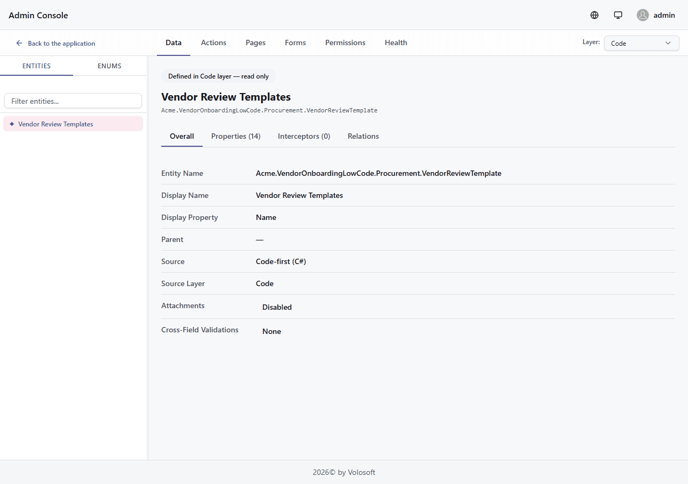

Open the **Properties** tab and you can see the fields that came from the C# class. They are available to the Low-Code System, but the Designer marks them as code-owned.

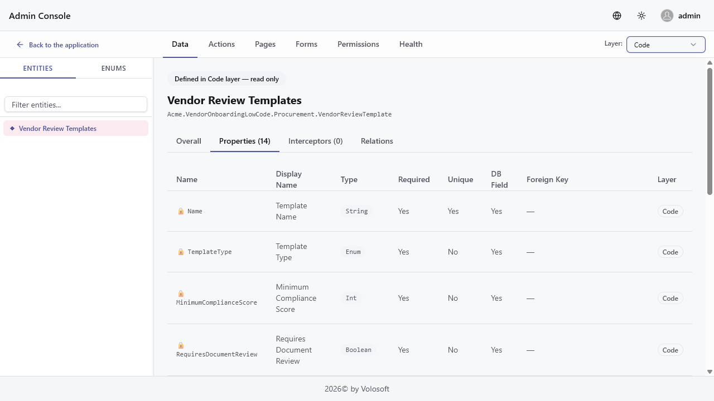

That is useful in real projects. Some metadata can be shipped with the application, while the rest of the workflow can still be designed through the Admin Console.

## Create the Vendor Enums

Now move to the part we actually build in the Designer.

The animation below shows the Designer path in one pass. The next sections slow it down and explain the enum, entity, page, and form steps.

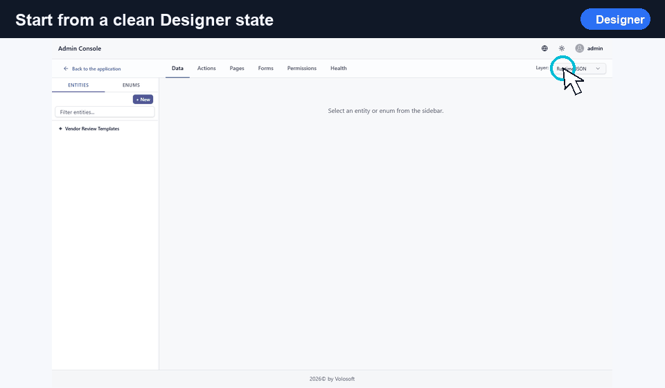

Open `Data > Enums` and create the status enum:

```text
VendorApplicationStatus
Submitted
InReview
Approved
Rejected
```

Before saving, the enum modal should contain the name and the four values:

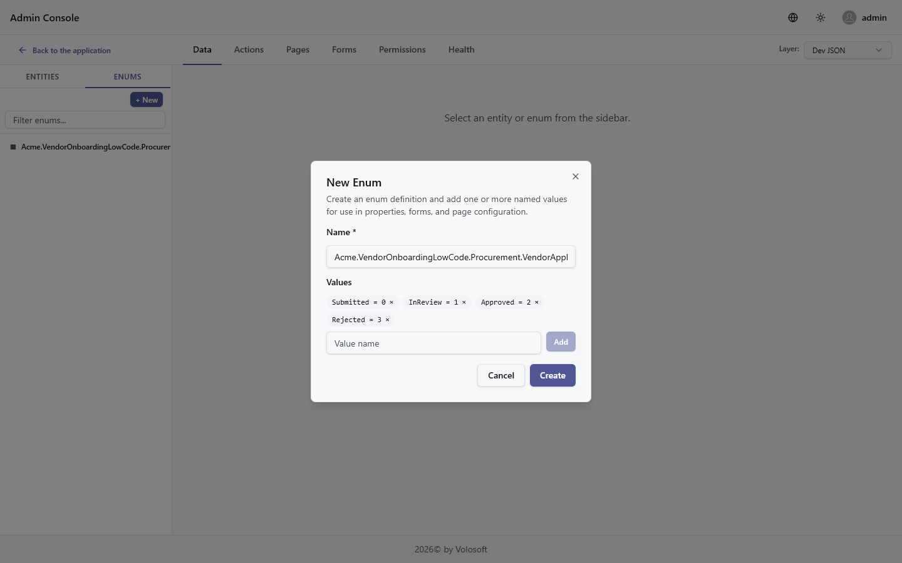

Then create the category enum:

```text
VendorCategory
Software
Services
Hardware
```

The order of the status values matters for the custom endpoint later, because the script checks the enum values by their numeric indexes. In this example `Submitted` is `0`, `Approved` is `2`, and `Rejected` is `3`.

After saving, the enum detail page shows the numeric values that the runtime and scripts will use:

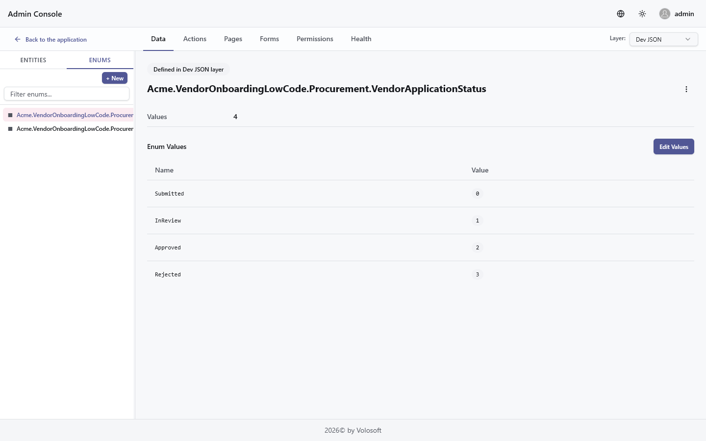

## Create the VendorApplication Entity

Go to `Data > Entities` and create `VendorApplication`.

This is the model that drives the rest of the article. Add these fields:

| Field | Type | Configuration |
| --- | --- | --- |
| `CompanyName` | `String` | Required and unique |
| `ContactEmail` | `String` | Required, email validation |
| `Status` | `Enum` | `VendorApplicationStatus` |
| `RequestedOn` | `Date` | Application date |
| `ApprovalDeadline` | `Date` | Review deadline |
| `IsPriority` | `Boolean` | Priority flag |
| `Category` | `Enum` | `VendorCategory` |
| `ComplianceScore` | `Int` | Review score |
| `Logo` | `Image` | Logo upload |
| `ComplianceDocument` | `File` | Document upload |
| `RejectionReason` | `String` | Optional |

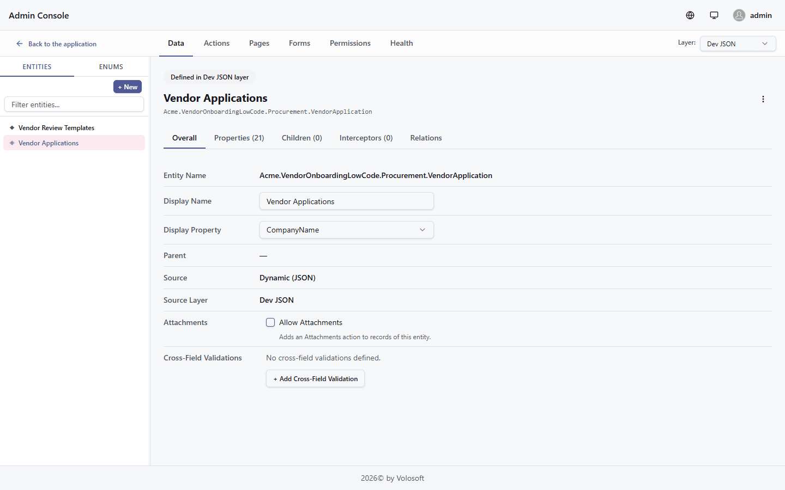

The **Properties** tab is where the entity becomes more than a name. The table shows the field types, enum bindings, and source layer. Scroll down and the upload-related fields are visible with their `Image` and `File` types:

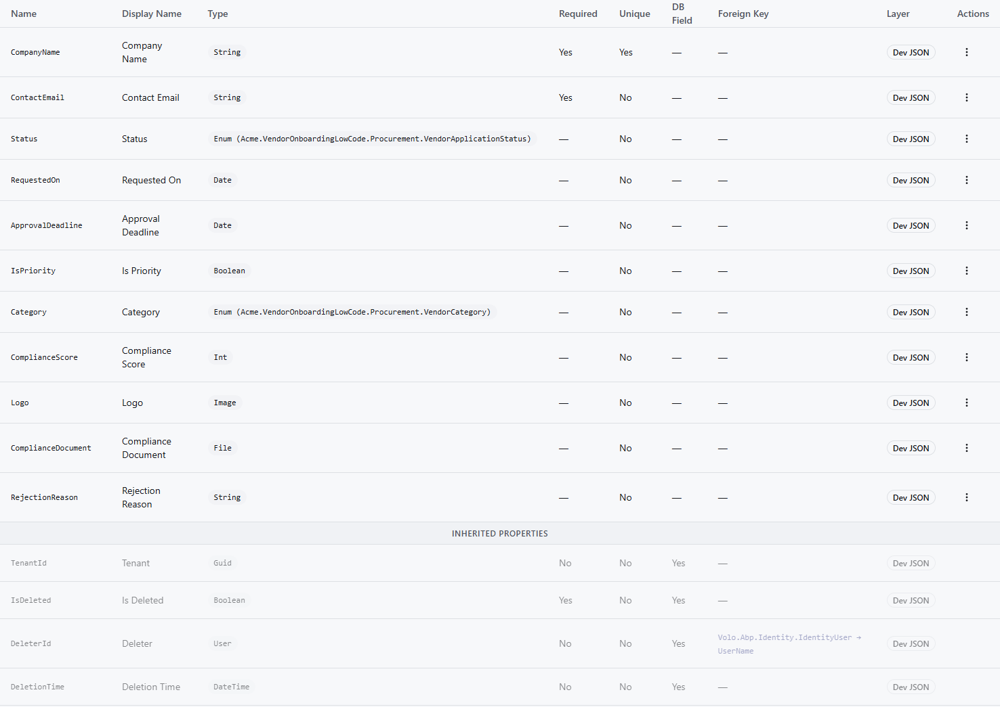

There is no React code yet, but we already have a lot of behavior described: required fields, uniqueness, email validation, enum fields, upload fields, and the data shape that the runtime will use.

The `Image` and `File` types are worth calling out. They are not plain strings with a path. In the generated form they become upload controls, which is exactly what we need for vendor logos and compliance documents.

Since `VendorApplication` is authored in the `Dev JSON` layer, it also belongs to the source-controlled model. After saving the entity metadata, create/apply the EF Core migration before you open the generated page in the runtime. This is the step that creates the backing table for the low-code entity in the database.

## Generate a Grid Page

The reviewers need a page where they can work with applications, so go to `Pages` and create a `dataGrid` page named `vendor-onboarding`.

Bind it to `VendorApplication`.

Before saving the page, the modal connects the route name, title, icon, and entity:

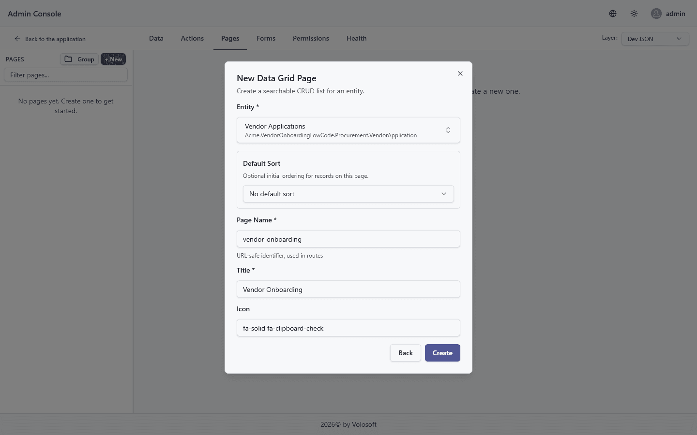

After the page is created, set `RequestedOn` as the default sort field, keep it descending, adjust the icon if you want, and assign `vendor-application-form` as the create/edit form:

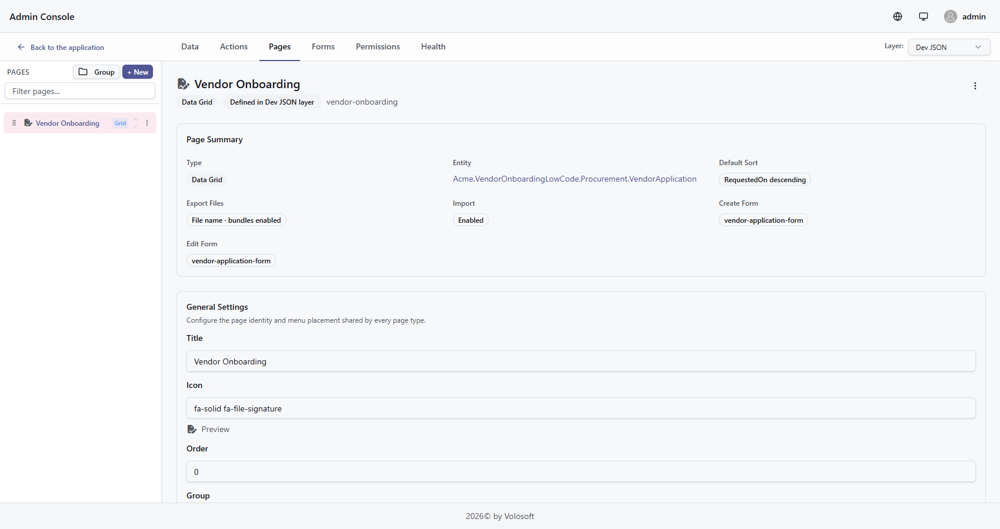

For the review workflow, keep the configured columns focused on the fields reviewers use most:

- Company name
- Status
- Requested date
- Priority
- Category

Then configure the filters you want reviewers to use most often. In this workflow, the important filters are company, status, requested date, priority, and category. Depending on the runtime defaults, the generated grid may still expose additional fields such as contact email; the workflow is still driven by the focused page metadata above.

Once the page is saved, the React runtime can resolve the route from the page metadata. The grid is generated from the entity and page configuration rather than from a hand-written React component.

## Build the Create/Edit Form

A grid is not enough. We also need a form that feels like the workflow.

Go to `Forms` and create `vendor-application-form` for `VendorApplication`. Split the fields into three tabs:

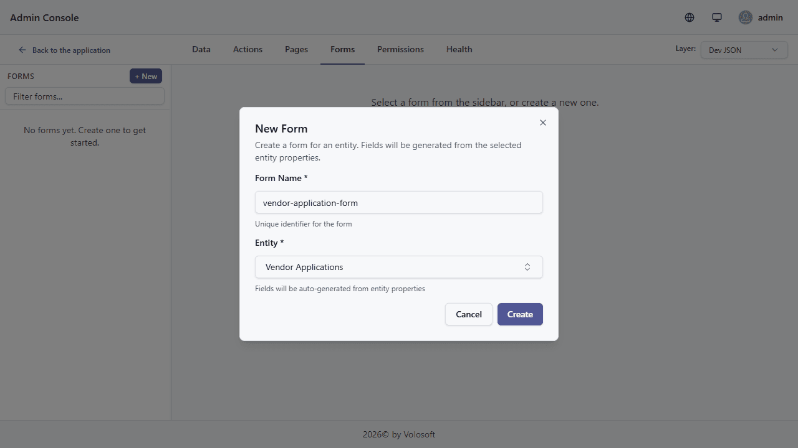

- **Company**: `CompanyName`, `ContactEmail`, `Category`, `IsPriority`
- **Review**: `Status`, `RequestedOn`, `ApprovalDeadline`, `ComplianceScore`, `RejectionReason`
- **Documents**: `Logo`, `ComplianceDocument`

Now add the conditional behavior for `RejectionReason`. In this demo I used two complementary rules: one rule shows the field when `Status = Rejected`, and the other hides it for non-rejected statuses.

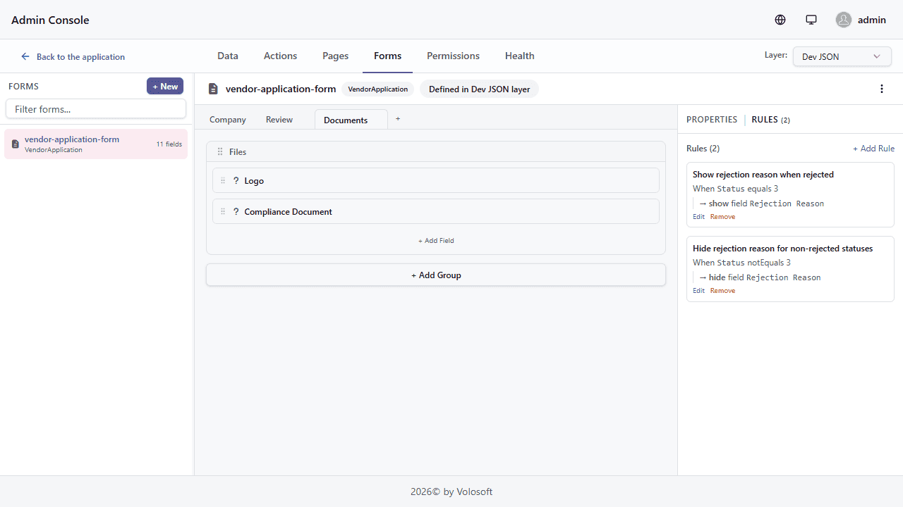

This is one of the places where Low-Code becomes more than "generate a CRUD page". The runtime does more than render a static form; it evaluates the rule while the user edits the record.

## Apply the Migration Before Opening the Runtime

Before opening the generated page, apply the database migration for the `Dev JSON` changes. We used `Dev JSON` for `VendorApplication`, so the Designer wrote source-controlled descriptor files under `_Dynamic`. The entity shape is now part of the application model, and the database needs the matching backing table before the React runtime can save records.

That is why `Dev JSON` is a good fit during development: the metadata files and the EF Core migration can be reviewed, committed, and reproduced in another environment. If the same entity had been created in the `Runtime JSON` layer, you would not create a C# migration for that runtime edit; the metadata change would be stored in the database instead. In practice, use `Dev JSON` for development-time, source-controlled changes, and use `Runtime JSON` when you want production-time changes to be managed from the Admin Console and persisted in the database.

## Try It in the React Runtime

Open the generated `vendor-onboarding` page in the React runtime and create a vendor application.

On the `Documents` tab, the `Logo` and `ComplianceDocument` fields are rendered as upload fields:

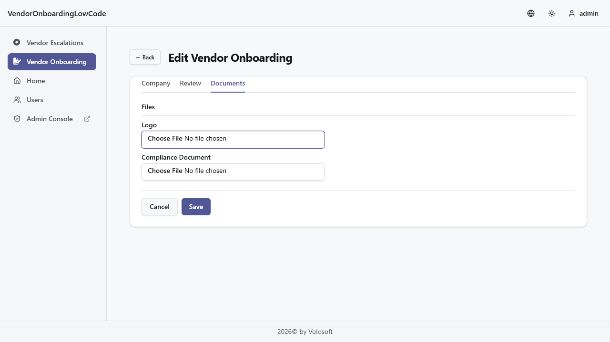

Now edit a record and change the status to `Rejected`. The `RejectionReason` field becomes available on the `Review` tab:

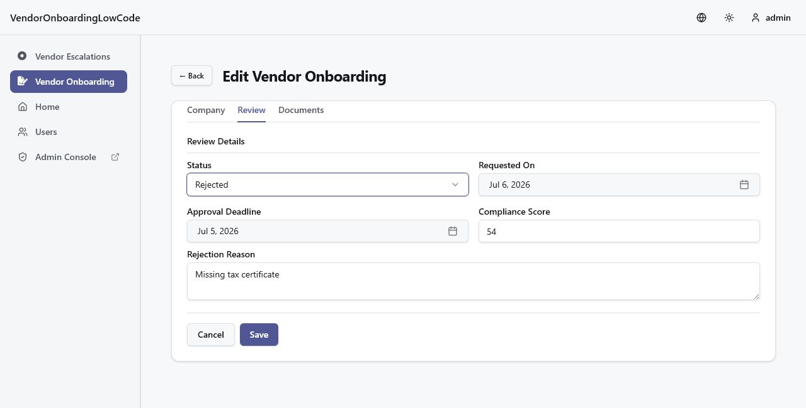

After saving a few records, use the generated filters to narrow the list to rejected vendors. Depending on the runtime configuration, the filter panel can expose more fields than the small set you configured for the workflow; here we only use the `Status = Rejected` filter:

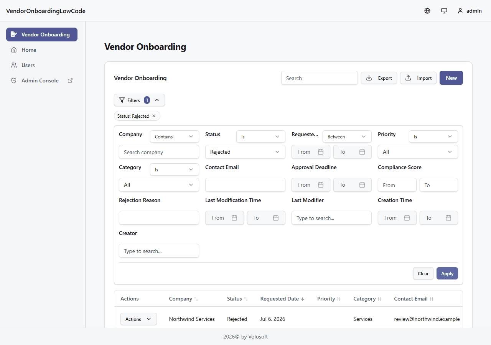

The short animation below gives a quick pass through the same runtime states: upload fields, the conditional rejection reason, and the filtered grid.

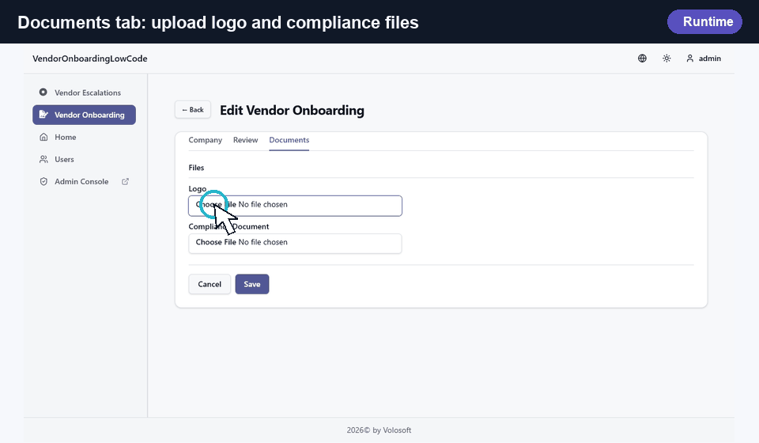

At this point we have a working page, form, validation, uploads, and filters. The important part is that all of it came from the metadata we configured in the Designer.

## Add a Custom Summary Endpoint

Generated CRUD is enough for day-to-day record editing, but teams often need one operation that is specific to their process.

For vendor onboarding, a summary endpoint is a good example:

```text
GET /api/custom/vendor-onboarding/summary
```

In the Designer, open `Actions` and create a custom HTTP action with that route. The script can use the [Scripting API](https://abp.io/docs/latest/low-code/scripting-api) to query the same `VendorApplication` data that the generated grid uses.

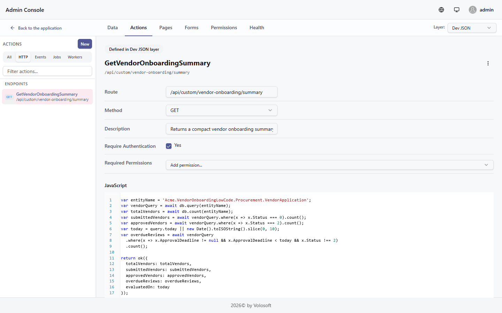

Here is the script used in the demo:

```js
var entityName = 'Acme.VendorOnboardingLowCode.Procurement.VendorApplication';
var vendorQuery = await db.query(entityName);
var totalVendors = await db.count(entityName);
var submittedVendors = await vendorQuery.where(x => x.Status === 0).count();
var approvedVendors = await vendorQuery.where(x => x.Status === 2).count();
var today = query.today || new Date().toISOString().slice(0, 10);
var overdueReviews = await vendorQuery
  .where(x => x.ApprovalDeadline != null && x.ApprovalDeadline < today && x.Status !== 2)
  .count();

return ok({
  totalVendors: totalVendors,
  submittedVendors: submittedVendors,
  approvedVendors: approvedVendors,
  overdueReviews: overdueReviews,
  evaluatedOn: today
});
```

Use the entity name shown in your Designer. In the screenshots, it is `Acme.VendorOnboardingLowCode.Procurement.VendorApplication`.

When the endpoint runs, it returns the current counts from the low-code records:

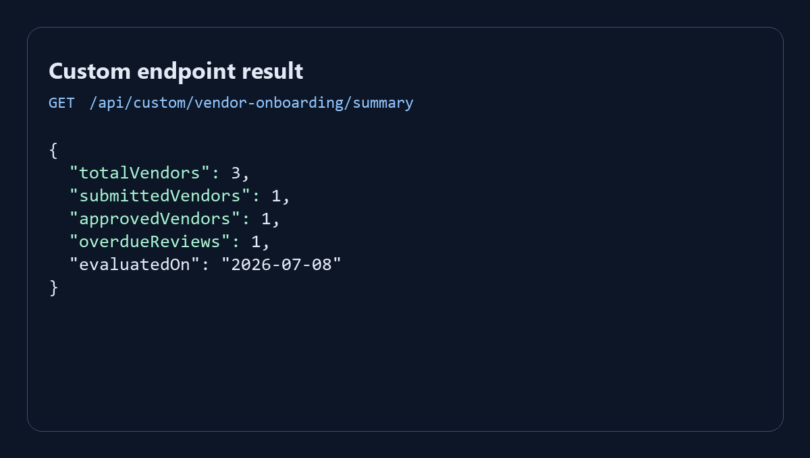

That is the bridge I like here. The page and form stay metadata-driven, but the process-specific summary is a short script exposed as a custom endpoint.

## Add One Runtime Model

Now switch the Designer layer to `Runtime JSON` and add one more entity: `VendorEscalation`.

This model represents the items that need extra attention. It could have been created in the same place as `VendorApplication`; I am adding it here only to show that runtime-authored metadata participates in the same Low-Code System.

Unlike the code and `Dev JSON` examples above, this runtime-authored model is not part of the source-controlled migration flow in this walkthrough.

The create modal is the same Designer experience, but the selected layer is now `Runtime JSON`:

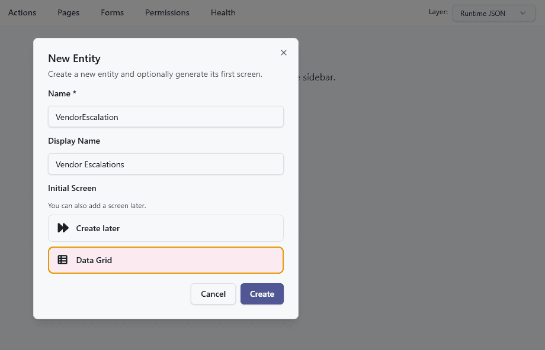

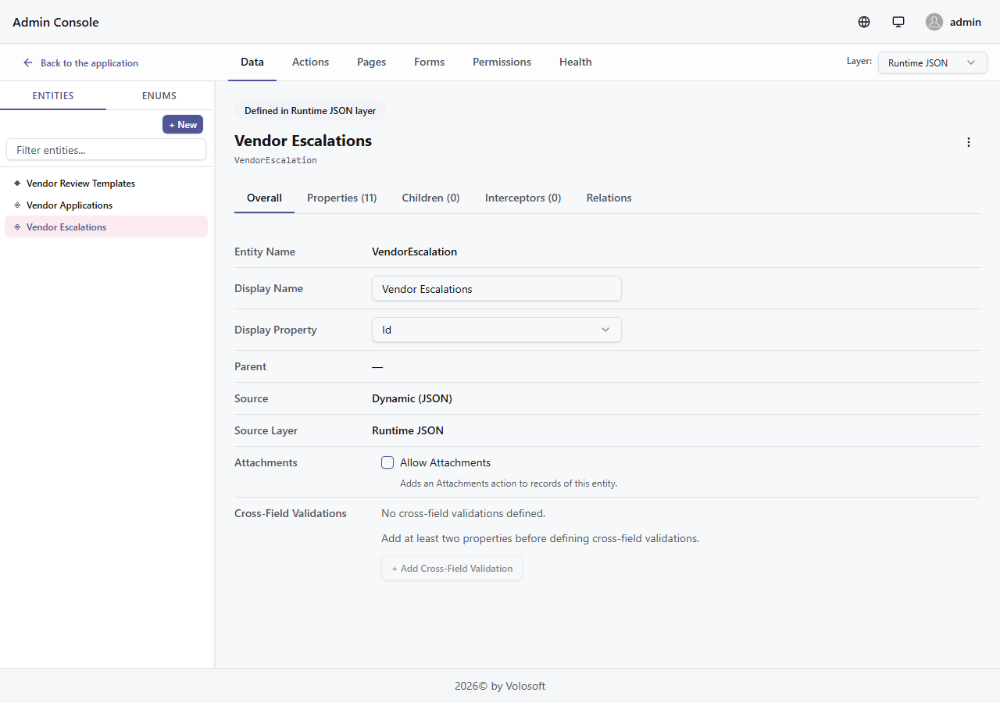

Create a data grid page for it and open it in the React runtime:

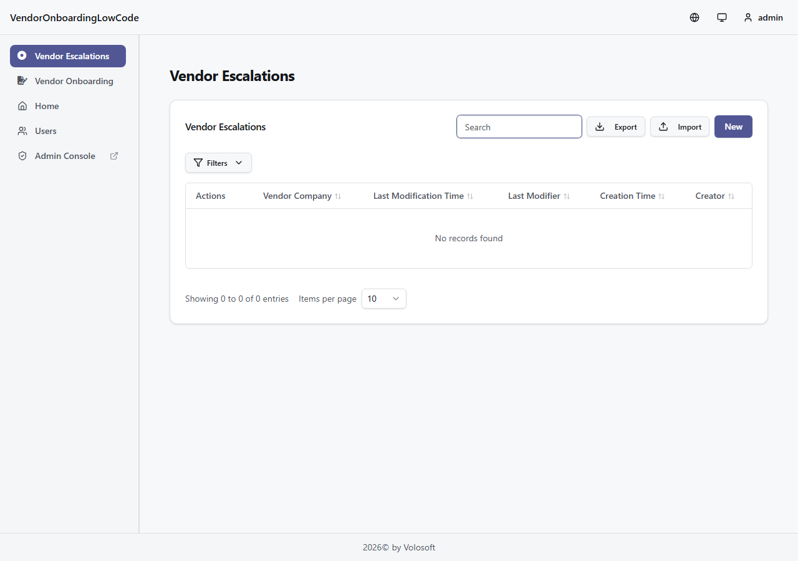

From the user's point of view, it behaves like the first generated page. From the metadata point of view, we have now seen code-defined metadata, Designer-authored metadata, and runtime-authored metadata in the same application.

## Read the Same Data from ABP Code

The last bridge is application code.

Sometimes the generated page is not the only consumer. You may want a typed application service, a scheduled job, or another API to read the same low-code records. The code below shows the idea by returning a backlog summary:

```csharp
private readonly IRepository<DynamicEntity, Guid> _vendorApplicationRepository;
private readonly IAsyncQueryableExecuter _queryableExecuter;

public async Task<VendorBacklogDto> GetBacklogAsync()
{
    var entityDescriptor = DynamicModelManager.Instance.Find(
        "Acme.VendorOnboardingLowCode.Procurement.VendorApplication"
    );

    if (entityDescriptor == null)
    {
        throw new UserFriendlyException("VendorApplication model was not found.");
    }

    var query = await _vendorApplicationRepository
        .SetEntityName(entityDescriptor.Name)
        .GetQueryableAsync();
    var today = DateOnly.FromDateTime(Clock.Now);
    var priorityQuery = query.Where(vendor =>
        vendor.Data["IsPriority"] != null &&
        (bool?)vendor.Data["IsPriority"] == true);

    var nextPriorityVendor = await _queryableExecuter.FirstOrDefaultAsync(
        priorityQuery.OrderByDescending(vendor =>
            (DateOnly?)vendor.Data["RequestedOn"]));

    return new VendorBacklogDto
    {
        TotalVendors = checked((int)await _queryableExecuter.LongCountAsync(query)),
        PriorityVendors = checked((int)await _queryableExecuter.LongCountAsync(priorityQuery)),
        RejectedVendors = checked((int)await _queryableExecuter.LongCountAsync(
            query.Where(vendor =>
                vendor.Data["Status"] != null &&
                (int?)vendor.Data["Status"] == 3))),
        OverdueReviews = checked((int)await _queryableExecuter.LongCountAsync(
            query.Where(vendor =>
                vendor.Data["ApprovalDeadline"] != null &&
                (DateOnly?)vendor.Data["ApprovalDeadline"] < today &&
                (int?)vendor.Data["Status"] != 2))),
        NextPriorityVendor = nextPriorityVendor?.GetData<string>("CompanyName")
    };
}
```

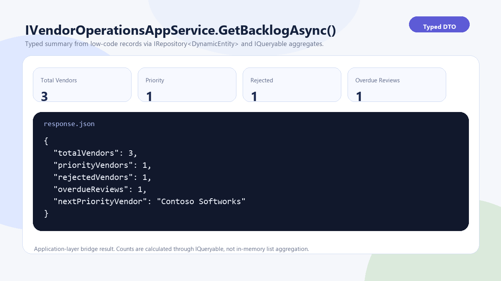

The important detail is that the aggregate operations stay on `IQueryable`; the code does not load every vendor into memory just to count them. This is not a replacement for the generated page. It is the other direction: use the generated page for the admin experience, then read the same records from normal ABP code when another part of the application needs them.

## Going Further

The workflow we built is intentionally focused, but the same shape can grow in a few directions:

- Add permissions around the generated pages and custom endpoint.
- Add more form rules for review-specific fields.
- Add an approval notification after a vendor is accepted.
- Add a scheduled job that checks overdue applications.
- Build a dashboard widget on top of the summary endpoint.

The main pattern stays the same: model the data in the Low-Code Designer, let the React runtime render the operational page, and add code or scripting only for the parts that are specific to your business process.

## Conclusion

ABP Low-Code is useful when the first version of a business workflow is mostly metadata: entities, fields, filters, forms, validation, uploads, and a few custom actions.

In this vendor onboarding example, the `VendorApplication` model gave us a generated grid and form, the runtime handled upload fields and conditional UI, and a custom endpoint added the summary that CRUD would not provide by itself. We also saw that low-code metadata can come from the Designer, from runtime JSON, or from C# code when you need that bridge.

That is the part worth remembering: you can start with a working admin experience quickly, then extend the workflow where the generated behavior stops being enough.

### Further Reading

- [Low-Code System Overview](https://abp.io/docs/latest/low-code/index)
- [Low-Code Designer](https://abp.io/docs/latest/low-code/designer)
- [React Runtime](https://abp.io/docs/latest/low-code/react-runtime)
- [Custom Endpoints](https://abp.io/docs/latest/low-code/custom-endpoints)
- [Scripting API](https://abp.io/docs/latest/low-code/scripting-api)
