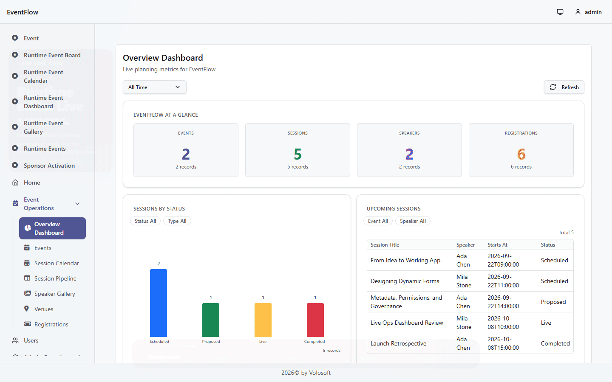
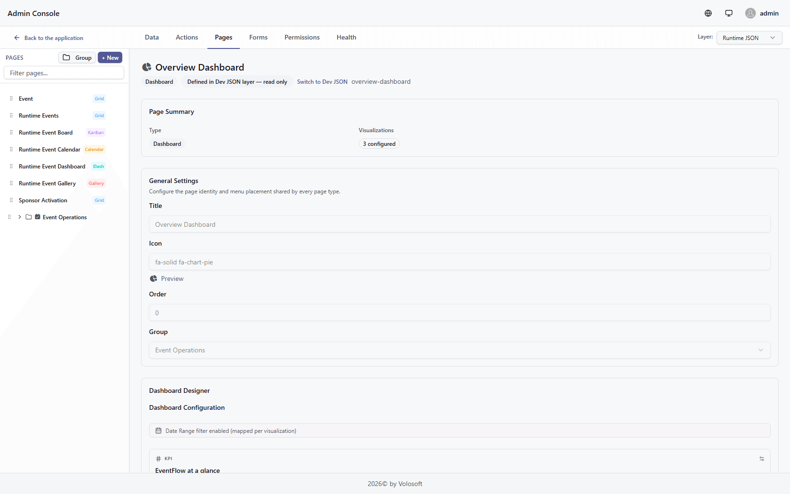
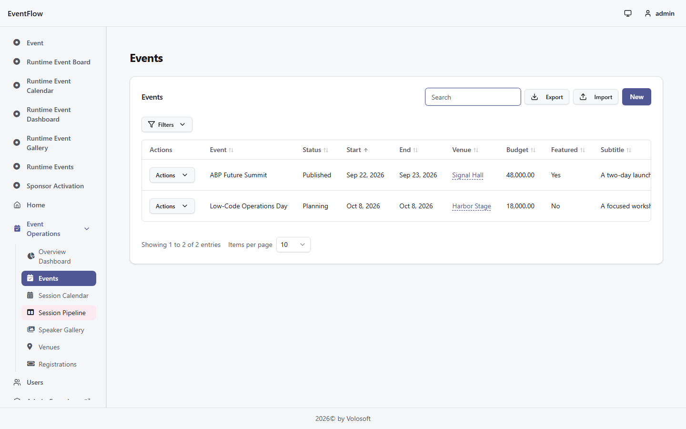
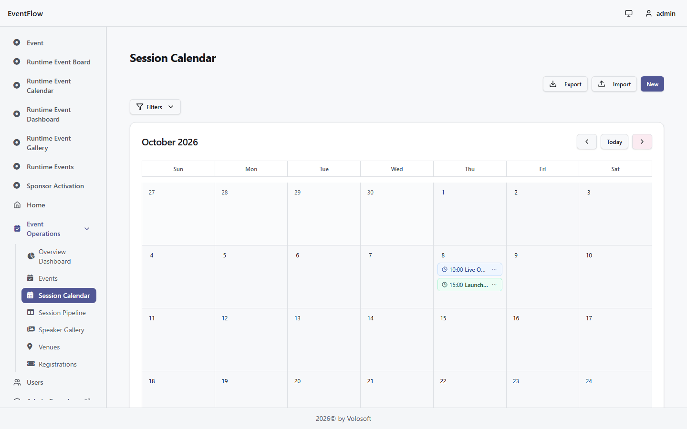
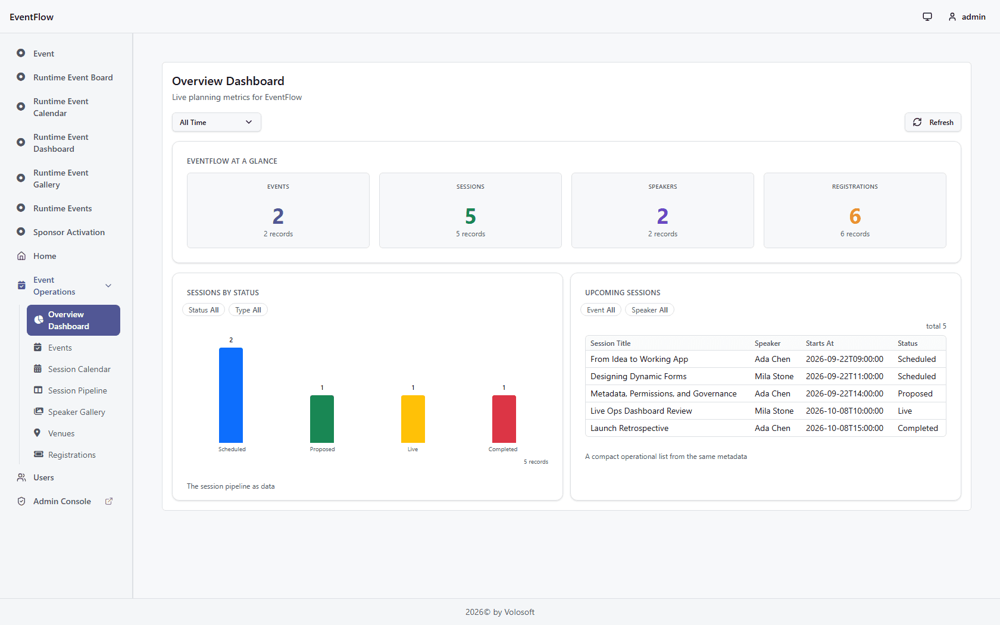
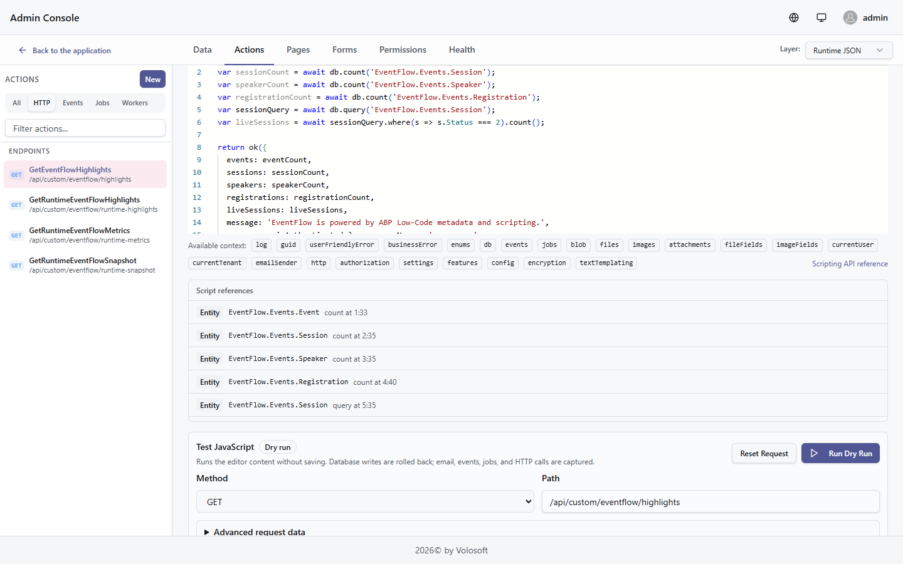
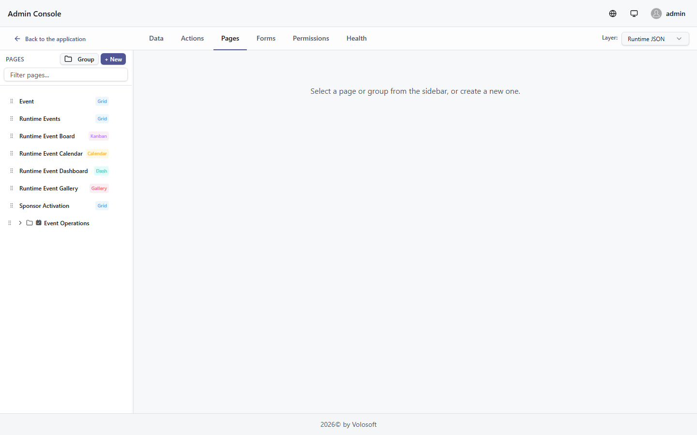
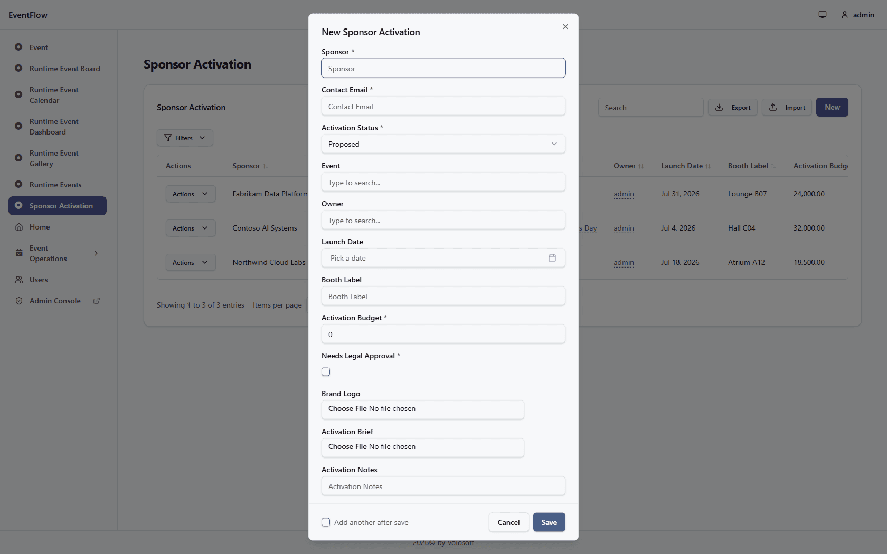
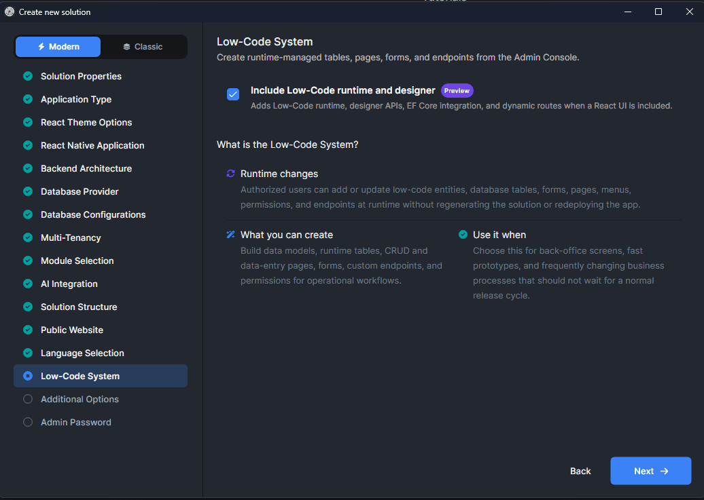

# Introducing ABP Low-Code: Build Real ABP Apps in Minutes

**Create runtime-managed pages, generated React screens, code-first C# entities, and Script API extensions without leaving the ABP application model.**



> **Want to try the same path?** Start from ABP Studio, enable the Low-Code runtime and designer, define pages in the Admin Console, and see them resolve inside the running ABP app.

---

## ABP Low-Code at a glance

| Runtime authoring | Generated screens | ABP-native extensibility | One application model |
| :---: | :---: | :---: | :---: |
| Define and update pages in the Admin Console | Grid, Form, Calendar, Kanban, Gallery, Dashboard | Code-first entities, Script API actions, and C# query paths | Runtime metadata, generated UI, and application code stay together |

---

## Built into the ABP Platform

Low-code is most useful when speed does not create a separate stack to maintain later.

That is where many low-code products start to strain. They move quickly at the beginning, then force a second implementation track when the app needs permissions, auditability, custom logic, or tighter integration with existing application code.

ABP Low-Code takes a different path. It runs **inside the ABP Platform**, so runtime-managed pages are part of an application foundation that already includes identity, permissions, audit logging, APIs, and code-level extensibility.

---

## Edit at runtime. See it in the app.

In the Low-Code Designer, you update a runtime-managed page. A few seconds later, the same application surface is visible in the live app. No rebuild loop. No parallel front-end implementation. No "we will wire it later" gap between authoring and runtime.

ABP Low-Code shortens the cycle from model change to running screen while keeping the output grounded in the same ABP application.



> **What this shows:** authoring and runtime are connected. Pages are defined in the designer and resolved in the running application.

---

## CRUD is table stakes

If low-code only saves you from drawing a table and a form, it is not enough. Business applications need richer operational surfaces.

In the generated app, the `Events` screen ships with search, actions, filters, and form-driven editing. The form structure already understands tabs, relations, validation, and business-shaped input instead of leaving you with a blank shell to finish by hand.



The point is not just generated CRUD. It is generated CRUD that already looks like the operational screens teams maintain in real applications.

---

## One model, multiple operational screens

Business users do not think in one view. Operators want a calendar for scheduling, a kanban board for workflow, a grid for bulk operations, a gallery when media matters, and a dashboard when they need the state of the business at a glance.

ABP Low-Code keeps those surfaces attached to the same underlying model. The same `Session` model can appear as a **calendar** for planning and a **kanban pipeline** for operational flow. The same generated app can also include a **speaker gallery** and an **overview dashboard** for metrics.





This is where ABP Low-Code starts to feel less like a form generator and more like a runtime application layer: one model, many working screens, no second implementation track for each view type.

---

## When low-code needs code

The real differentiator is not that ABP Low-Code can go fast. It is that **speed does not require isolation from the application foundation**.

When generated CRUD is not enough, you extend the same app instead of throwing the low-code layer away.

ABP Low-Code exposes a server-side **Script API** inside the same application model. That scripting surface can back:

- **Custom endpoints** when the UI needs an API-shaped response.
- **Interceptors** when create or update commands need validation or mutation.
- **Event handlers** when logic should react to runtime events.
- **Background jobs** when work should continue asynchronously.
- **Background workers** when operational logic should run on a schedule.

In this article, the visible proof happens to be `GET /api/custom/eventflow/highlights`. The GIF shows an endpoint because it is the easiest proof surface to read. But the broader point is that endpoints are only one consumer of the same low-code scripting layer.

That hybrid model matters in both directions:

- **Code-first ABP entities can be surfaced in low-code flows and runtime pages.**
- **Low-code-managed data and screens stay reachable from Script API actions, application services, repository queries, and custom endpoints.**
- **Teams do not lose architectural control just because they gained a faster authoring layer.**



The actual capability is the shared ABP application model behind it: script when runtime logic is enough, C# when typed application services and repository queries are the better fit.

This is the difference between "low-code as a shortcut" and "low-code as part of your application platform."

---

## From code-first entity to generated page

The first direction is code-first to low-code. A **code-first** `SponsorActivation` entity checked into the ASP.NET Core project can still become a working runtime page without forking into a separate low-code-only model.

The code-first entity carries the same metadata that ABP Low-Code uses to generate the page:

```csharp
[DynamicEntity(DefaultDisplayPropertyName = nameof(CompanyName))]
[DynamicEntityUI("Sponsor Activations")]
[DynamicEntityAttachments("application/pdf", "image/*", MaxFileCount = 4)]
public class SponsorActivation : DynamicEntityBase
{
    [Required]
    [DynamicPropertyUI(DisplayName = "Sponsor")]
    public string CompanyName { get; private set; }

    [Required]
    [EmailAddress]
    [DynamicPropertyUI(DisplayName = "Contact Email")]
    public string ContactEmail { get; private set; }

    public SponsorActivationStatus Status { get; set; }

    [DynamicForeignKey("EventFlow.Events.Event", "Title")]
    public Guid? EventId { get; set; }

    [DynamicForeignKey("Volo.Abp.Identity.IdentityUser", nameof(IdentityUser.UserName), ForeignAccess.View)]
    public Guid? OwnerUserId { get; set; }

    [DynamicPropertyType(EntityPropertyType.Money)]
    public decimal ActivationBudget { get; set; }

    [DynamicPropertyImageOptions("image/png", "image/jpeg")]
    public string? BrandLogo { get; set; }

    [DynamicPropertyFileOptions("application/pdf", ".pptx", ".docx")]
    public string? ActivationBrief { get; set; }
}
```

That class lives as normal C# source, gets migrated like the rest of the application, and is seeded with real records so the runtime page does not open as an empty shell.

Inside the designer, selecting the `SponsorActivation` entity auto-generates the page identity, binds the grid to the entity, and lands on a real runtime route at `/dynamic/sponsor-activation`. The generated surface includes sponsor, email, event lookup, owner lookup, budget, image, and file fields directly from the C# model.





That is the distinction that matters: code-first ABP entities can move through low-code without becoming throwaway artifacts, and low-code-generated surfaces remain part of the same application story.

---

## Low-code data stays reachable from C#

The bridge also works in the other direction. A normal ABP application service can query a low-code model through `IRepository<DynamicEntity, Guid>`, apply real filters, and combine that result with code-first aggregates.

The service behind the endpoint in the previous section looks like this:

```csharp
public async Task<EventFlowLowCodeProofDto> GetHybridSummaryAsync()
{
    var liveSessionQuery = (await _dynamicEntityRepository
            .SetEntityName("EventFlow.Events.Session")
            .GetQueryableAsync())
        .Where("int(it[\"Status\"]) == @0", 2);

    var publicSessionQuery = liveSessionQuery
        .Where("bool(it[\"IsPublic\"]) == @0", true);

    var sponsorQuery = (await _sponsorActivationRepository.GetQueryableAsync())
        .Where(activation =>
            activation.Status == SponsorActivationStatus.Approved ||
            activation.Status == SponsorActivationStatus.Live);

    var liveSessionCount = await AsyncExecuter.CountAsync(liveSessionQuery);
    var publicSessionCount = await AsyncExecuter.CountAsync(publicSessionQuery);
    var activeSponsorActivationCount = await AsyncExecuter.CountAsync(sponsorQuery);

    return new EventFlowLowCodeProofDto
    {
        LiveSessionCount = liveSessionCount,
        PublicSessionCount = publicSessionCount,
        ActiveSponsorActivationCount = activeSponsorActivationCount
    };
}
```

Here, low-code-managed `Session` rows are filtered from C# with real `Where(...)` clauses, then combined with the typed `SponsorActivation` repository. The endpoint and dashboard are just one presentation surface for that shared ABP query path.

That is the ABP difference: low-code data stays reachable from code, and code-first entities stay reachable from low-code.

---

## Why ABP Low-Code matters

The value is not novelty. It is a faster way to build real business applications without separating speed from the application foundation.

- **Speed without replatforming.** Runtime-managed screens reduce delivery time without moving the team onto a separate application stack.
- **Governance without friction.** Permissions, identity, auditability, and ABP platform foundations stay part of the story from day one.
- **Extensibility without rewrite pressure.** When custom behavior shows up, the same application can be extended instead of replacing the low-code output.

That is the core ABP Low-Code promise: faster delivery, still inside the application model you can extend.

---

## Try it yourself

The public starting point for ABP Low-Code is **ABP Studio**.



1. Open **ABP Studio** and create a new solution.
2. In the solution wizard, enable **Include Low-Code runtime and designer**.
3. Complete the wizard, then run the generated backend and React UI from the solution.
4. Sign in with the administrator account created for that solution.
5. Open **Admin Console** to define runtime-managed entities, forms, pages, permissions, endpoints, and script actions.
6. Switch to the application side to see those changes resolve live in the running app.

---

## Further reading

- [ABP Low-Code Designer Documentation](https://abp.io/docs/latest/low-code/designer)
- [ABP Low-Code Configuration & Fluent API](https://abp.io/docs/latest/low-code/fluent-api)
- [ABP Low-Code Scripting API](https://abp.io/docs/latest/low-code/scripting-api)
- [ABP Low-Code Script Actions](https://abp.io/docs/latest/low-code/script-actions)
- [ABP Low-Code Interceptors](https://abp.io/docs/latest/low-code/interceptors)
- [ABP Studio Documentation](https://abp.io/docs/latest/studio)
- [Get Started with ABP: Creating a Layered Web Application](https://abp.io/docs/latest/get-started/layered-web-application)
