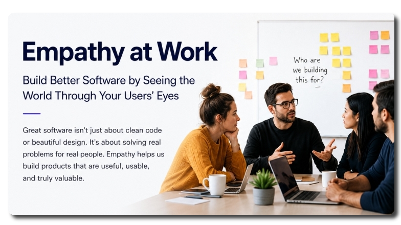
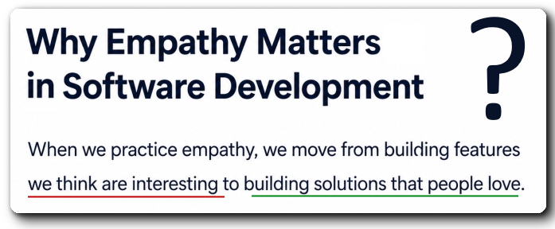
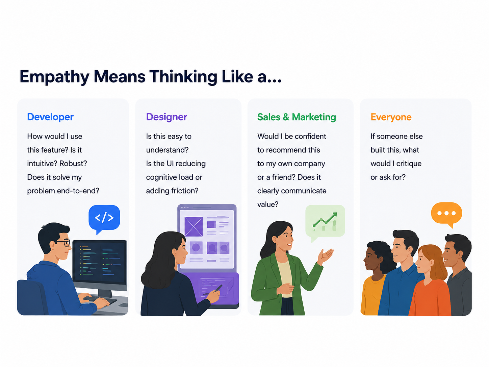
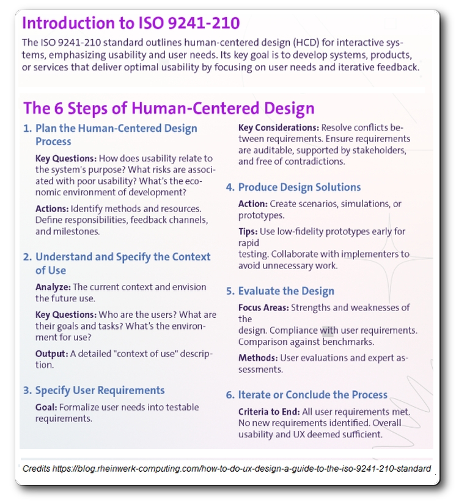
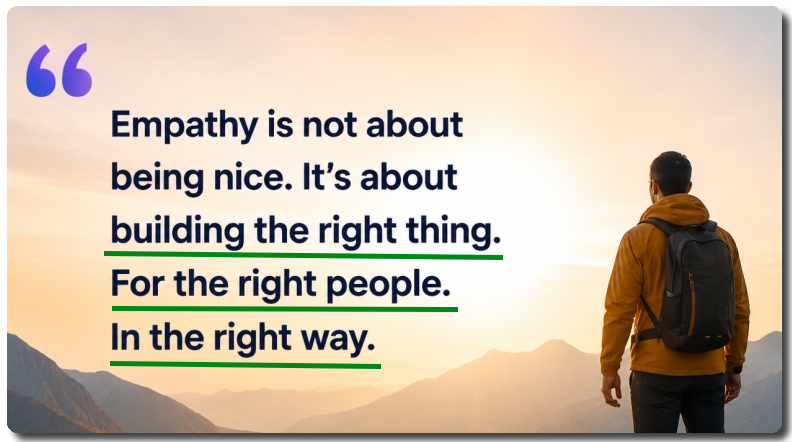

# Empathy in the Workplace for Software Companies

My articles are mostly technical but this time I want to mention about a very important soft-skill in workplaces.
That's empathy! This is an emotional skill (EQ) which is important like IQ but without this skill you cannot have charisma at your workspace. 
For those who don't know what's charisma at workspace check out my previous article section 👉 [whats-charisma-at-work](https://abp.io/community/articles/my-speakers-view-of-convex-summit-2026-3uk6ln1l#so-lets-think-whats-charisma-at-work).
Even though empathy comes out of the box with your character, if you realize you lack of it you can improve this level.

## What's Empathy?

**It's a discipline which puts behaviors to human-centered practices.** 
**Why we do it?** For understanding users’ goals, restrictions, emotions, mentality and tradeoffs. Then using that understanding to improve what teams build, sell, market and support.
**Why do we need it?** Simple! If you don't know other's mentality, you most probably go by chance.

**Empathy means making an effort to understand how another person sees a feature, message, workflow or pricing decision.**

>  Great software is not created only with clean code, attractive designs, marketing campaigns or polished sales demos.

It is created when teams understand the people behind the requirements:

- What are users trying to achieve?
- What do they already know?
- What confuses or slows them down?
- What makes them trust the product?
- What do they see as valuable?

For a software company, empathy should not be treated only as a soft skill or company value. It should be a practical way to replace internal assumptions with real evidence about users, buyers, administrators, developers and other people affected by the product.

Empathy must be a cross-functional responsibility. Developers, designers, product managers, sales, marketing, support and leadership all see different parts of the customer experience.

When these teams bring their knowledge together, they can make better product and business decisions.

## What Empathy Means in a Software Company

Empathy has two main parts.

* **Affective empathy**: Means sharing another person’s emotions.

* **Cognitive empathy**: Means understanding another person’s point of view, goals, needs, concerns and limitations.

Both are important. However, cognitive empathy is usually more useful when teams review a feature, workflow, message, onboarding process or pricing decision.

It encourages the team to ask what a specific person would understand and experience.

> **The useful question is not:**
> “Would I like this?”
>
> **It is:**
> “Would this specific user, in this situation, with this knowledge and these limitations, understand the value and complete the task?”

This difference is important because employees know much more about the product than customers do.

> A workflow that seems obvious to the software developer who implemented it, **may be confusing to a first-time user**.
> A message that sounds clear to an engineer may **sound like technical jargon to a buyer.** 
> A feature that looks simple in a sales demo may still be **difficult to use in a real company**.

Affective empathy also matters because it helps people care about customers and make responsible decisions. However, emotion alone is not always a reliable evaluation method. A strong customer story may receive too much attention, even when it does not represent most users. Emotional pressure can also lead to stress or biased decisions.

A better approach is to combine emotional concern with structured questions:

- What kind of disappointment or confusion might this situation cause?
- What is the user trying to achieve?
- What information can the user see?
- What would the user reasonably understand?
- What could stop the user from continuing?
- What would make the user trust the product?

In simple terms:

> Empathy means testing our assumptions and learning how real users actually think, feel and use the product or feature.

ALWAYS ASK YOURSELF:

> **If I were using this feature / app, what would I criticize?**

I know *we can easily criticize other people's work* but when it comes to criticize our own work we just can't do it. Because you know the difficulties of your work and you don't know about other people's difficulties. That's why you cannot truly criticize yourself. But the real success comes after you improve your own critizing skills. 

**Sit on the other side of the desk for a minute please!**

---

---

## Empathy Is a Cross-Functional Responsibility

Each team member should see a different part of the customer reality.

| Team             | Ask your self this question                                  | Inspect these things...                                      |
| ---------------- | ------------------------------------------------------------ | ------------------------------------------------------------ |
| Developers       | Where would a first-time user fail, hesitate or misunderstand the system? If users wait on this screen so much, will they close the app? | Defaults, errors, performance, learnability, edge cases and technical friction |
| Designers        | Does the interface match the user’s language, expectations, abilities and situation? Is it understandable? | Navigation, accessibility, cognitive load, interaction flow and error recovery |
| Product managers | Are we solving a real and important user problem?            | User goals, priorities, evidence, value and expected outcomes |
| Sales            | What would make a buyer question the value, risk, effort or credibility? | Demo flow, objections, trust signals, implementation concerns and time to value |
| Marketing        | Would the intended customer recognize the problem and believe the promise? | Positioning, jargon, calls to action, expectation-setting and message-market fit |
| Support          | Where does the product repeatedly cause confusion or extra work? | Ticket themes, escalations, documentation gaps and common workarounds |
| Leaders          | What in our process makes customer understanding difficult or optional? | Incentives, priorities, team structure, review habits, tech trends and psychological safety |

---

## ISO Standard of Empathy Loop

And yes! Someone even created a standard for what I'm talking. It's called **ISO 9241-210** standard. 
The full title is ***Ergonomics of human-system interaction***. Basically it deals with any system that has interactivity. 
So our application screens, APIs are all included in this standard. 
The main idea is simple: teams should design software around real users, their goals and their working environment. 
Not only around technical requirements. 
These 6 steps about how to design a better system, puts customers in the center.

 

Let me adjust these to a software developing team:

1. Decide how user experience work will be managed, who is responsible and what risks or limitations exist. 
   The below are the different areas to understand the feature/app/requirements:
   - User interviews
   - Customer calls
   - Support quetions
   - Sales notes
   - Product analytics
   - Surveys
   - Session recordings
   - Contextual observation
   - Customer feedback
   - Win-loss analysis
2. Learn who the users are, what they want to do, where they use the product and what problems they face. 
   In this section you really do empathy. Understand your user’s:
   - Goals
   - Concerns
   - Knowledge level
   - Mental model
   - Limitations
   - Expectations
   - Work environment
   - Emotional state
3. Turn user needs into clear and testable requirements.
   - For example imagine there's a problem like Users don't use the reporting module. 
     We need to open an issue for this as "*New users can't easily find the information they need to prepare a weekly performance report.*"
4. Build ideas, wireframes, prototypes or simulations. 
   It is better to test simple versions early before spending too much time on development. 
   You can do the followings:
   - Prototypes
   - New workflows
   - Updated copy
   - Better defaults
   - Simplified onboarding
   - Improved documentation
   - Pricing changes
   - Sales and marketing materials
5. Test the product with users or UX experts. Check whether it is easy to use and whether it meets user requirements. And be open to the discussions. 
   You can test via the following methods:
   - Usability testing
   - Customer interviews
   - Prototype testing
   - Cognitive walkthroughs
   - Heuristic reviews
   - A/B tests
   - Product analytics
   - Write feedback forms
6. If there're still problems, improve the design and test again. 
   The process ends when the important user needs are met. 
   Empathy should not be a one-time workshop.

---

## Better Empathy, Better Software

It helps developers predict failure, designers reduce cognitive conflicts, sales teams understand buyer risk, marketers communicate in the customer's language, and leaders create systems that reward learning rather than assumptions.

**When teams consistently ask how their work will be understood, used, trusted and valued by the people on the other side of the screen, they build products they can be proud to use, recommend, and stand behind.**

Thanks for reading 🙏