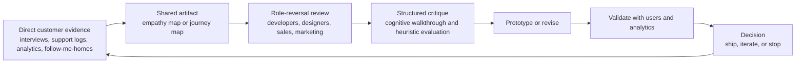
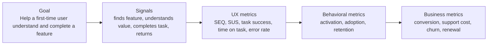
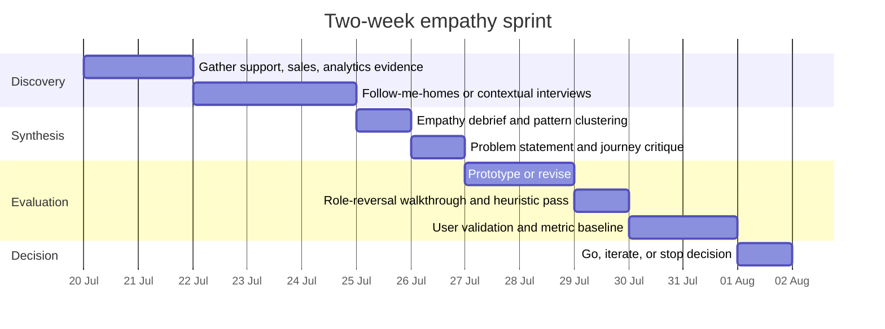

# Empathy in the Workplace for Software Companies

## Executive Summary

For a mid-size software company, workplace empathy should not be treated as a soft cultural slogan. The strongest evidence supports treating it as a disciplined, human-centered practice for understanding users’ goals, constraints, emotions, mental models, and tradeoffs, then using that understanding to improve what teams build, sell, market, and support. In software work, the most operationally useful form is usually **cognitive empathy** or **perspective-taking**: the deliberate effort to understand how another person interprets a feature, message, workflow, or pricing decision. **Affective empathy** matters too, because it motivates care and ethical concern, but on its own it is less reliable as an evaluation method and can produce distress or biased judgment if it is not structured. citeturn34view0turn29view1turn29view2turn28view3turn7search0turn28view0

Human-centered design standards and guidance point in the same direction: good systems are built on an explicit understanding of users, tasks, and environments; users are involved throughout design and development; evaluation is iterative; and multidisciplinary teams participate in the work. That makes empathy a cross-functional operating principle, not just a design-team activity. Developers, designers, sales, marketing, support, and product leaders all have relevant pieces of the customer reality. citeturn34view0turn34view1

For day-to-day practice, the most effective pattern is a repeatable loop: gather direct customer evidence, synthesize it in empathy maps or journey maps, run structured role-reversal critiques on a feature or message, validate with usability inspection and user testing, then connect findings to a small balanced scorecard of UX metrics and business outcomes. Google’s HEART framework, Brooke’s SUS, task-completion measures, and DORA-style delivery metrics are complementary here: together they help teams answer whether a feature is useful, usable, valuable, and operationally healthy. citeturn20view0turn33view1turn24view0turn23view0turn21view0turn22view0

The practical implication is straightforward: a software company should institutionalize empathy as a **review discipline**. Before release, teams should ask, from the viewpoint of a real user or buyer, “Would I understand what this is for, find it, trust it, complete the task, and feel the value was worth the effort?” After release, teams should ask, “Did the evidence improve activation, task success, retention, support burden, or conversion?” That combination of role-reversal and measurement is the most defensible way to make empathy evidence-based rather than rhetorical. citeturn20view0turn24view0turn23view0turn26view0turn25view0turn27view0

The table below condenses the report’s practical recommendations into an operating model for a mid-size software company. It synthesizes ISO human-centered-design principles, Google’s HEART and DORA guidance, NNGroup methods, Atlassian workshop practices, and company examples from IBM, Intuit, Microsoft, and GitHub. citeturn34view0turn20view0turn21view0turn26view0turn31view0turn31view4turn17view0turn31view2

| Operating area | Minimum recommendation | Why it matters |
|---|---|---|
| Product and UX | Run a structured empathy review on every material feature before release | Converts assumptions into observable critique, especially for learnability and value |
| Engineering | Add cognitive walkthroughs for new workflows and dogfooding with caution | Helps expose first-time-user friction, while recognizing employees are not the same as customers |
| Sales and marketing | Review landing pages, pricing pages, demos, emails, and onboarding copy from the buyer’s perspective | Brings empathy into acquisition and expectation-setting, not only UI |
| Measurement | Track one small balanced scorecard: task success, time or effort, perceived usability, adoption or activation, retention, and one business KPI | Prevents “feel-good empathy” without outcome accountability |
| Culture and process | Involve support, research, sales, and engineering in cross-functional reviews | Broadens perspective and reduces local optimization |
| Leadership | Protect psychological safety and blameless critique | Teams cannot surface customer pain honestly if they fear blame |

## What Empathy Means in a Software Company

Empathy is not one thing. Across psychology and design research, it is commonly treated as a multidimensional construct with at least two major components. **Affective empathy** refers to sharing or resonating with another person’s feeling state. **Cognitive empathy** refers to understanding another person’s viewpoint, intentions, needs, or mental state. Related work argues that empathy and perspective-taking should be conceptually separated, because affect sharing and cognitive perspective-taking can diverge and recruit different processes. citeturn29view1turn29view2turn28view3

That distinction matters in the workplace. If a software company wants teams to evaluate features, copy, onboarding, pricing pages, or service flows by “putting themselves in the user’s shoes,” the most reliable mechanism is usually **structured perspective-taking** rather than pure emotional resonance. Perspective-taking is the cognitive process of adopting another person’s viewpoint to understand their preferences, values, and needs. Work on organizations and creativity shows that perspective-taking helps employees generate ideas that are not only novel but also useful to other people inside and outside the organization. Other research shows it can improve negotiation and creative problem solving, which is especially relevant for sales, pricing, and product tradeoff discussions. citeturn28view0turn6search8turn7search0

Affective empathy still matters, but it should be used carefully. It is often the source of prosocial concern and ethical motivation, yet it can also become empathic distress or bias attention toward vivid pain rather than representative evidence. Recent reviews distinguish empathic distress from compassion and caution that empathy can have downsides when it is unstructured or emotionally overloading. A good software-company practice is therefore to pair an affective prompt such as “What frustration or anxiety is this causing?” with cognitive prompts such as “What is the user trying to achieve, what cues do they see, and what would they reasonably infer at this step?” citeturn28view3turn29view2turn29view1

In a software firm, empathy should also be understood as **human-centered evaluation across the full customer experience**, not just interface design. ISO and NIST guidance emphasize that human-centered design addresses the whole user experience, is driven by user-centered evaluation, and requires multidisciplinary perspectives. That means developers should empathize with first-time and edge-case users, designers with user cognition and accessibility needs, sales with the buyer’s decision journey and implementation anxieties, and marketing with the customer’s information needs and language during awareness, evaluation, trial, and adoption. citeturn34view0turn34view1

The strongest practical interpretation for a software company is this: **empathy is the disciplined replacement of internal assumptions with testable, role-reversed understanding**. It is not “Would I like this?” It is “Would this specific user or buyer, in this context, with this knowledge and these constraints, understand the value, succeed at the task, and consider the result worth the cost?” That framing aligns with human-centered design, cognitive walkthroughs, and modern UX benchmarking. citeturn34view0turn25view0turn24view0

## Methods for Role Reversal and Feature Critique

A software company does not need a single empathy method. It needs a **stack** of methods, each serving a different diagnostic purpose. Empathy maps are useful for capturing what users say, think, do, and feel, and for building shared understanding. Journey maps are better for exposing end-to-end friction, especially across acquisition, onboarding, support, and renewal moments. Cognitive walkthroughs are ideal when the question is learnability for a new user. Heuristic evaluations are strong for systematic usability inspection. Role play is useful when the room lacks real users or sufficient perspective diversity. Dogfooding is valuable for surfacing operational issues rapidly, but it is incomplete because employees often have too much institutional knowledge and use the product differently than real customers. citeturn25view1turn26view0turn25view0turn27view0turn25view3turn35view1turn26view0

The workflow above reflects the common structure across ISO human-centered design, Intuit’s deep-customer-empathy methods, NNGroup workshop guidance, and Google’s Goals-Signals-Metrics logic: start from real evidence, externalize it, inspect from the other person’s perspective, then validate with measurement. citeturn34view0turn32view1turn32view0turn25view3turn20view0

The comparison below is a practical selection guide for software teams.

| Method | Best question it answers | Best time to use | Main output | Strengths | Main limitation | Evidence base |
|---|---|---|---|---|---|---|
| Empathy map | What does one user or segment say, think, do, and feel? | Early discovery, after interviews, before ideation | Shared user-understanding artifact | Builds common ground, highlights knowledge gaps, helps prioritize needs | Can become speculative if not grounded in research | citeturn25view1 |
| Journey map | Where along the end-to-end journey do pain points, emotions, and drop-offs occur? | Acquisition, onboarding, support, renewal, cross-functional redesign | Current-state or future-state journey | Excellent for linking UX, marketing, analytics, and support data | Too-broad scope easily creates vague maps | citeturn26view0turn25view2 |
| Cognitive walkthrough | Will a new user know what to do, find the right action, and recognize progress? | New workflows, first-use experiences, major redesigns | Step-level learnability diagnosis | Strong for developers and PMs; inexpensive compared with full user testing | Best for learnability, not all UX questions | citeturn25view0 |
| Heuristic evaluation | Does the interface violate known usability principles? | Prototype stage, pre-test cleanup, complex UIs | Usability issue list by severity and principle | Fast, systematic, good for stretching research budget | Cannot replace testing with actual users | citeturn27view0turn27view1 |
| Role play | What changes when we force ourselves to speak from another perspective? | Workshops with insufficient diversity, early critique | Reframed assumptions and priorities | Useful for cross-functional teams; challenges bias and groupthink | Can feel artificial; needs a clear prompt and facilitation | citeturn25view3turn26view3 |
| Dogfooding | What breaks when we use the product in real work? | Continuous internal validation, prerelease builds | Operational issues, rough edges, adoption friction | Fast signal, good for operational empathy | Employees are not representative users; internal knowledge masks friction | citeturn35view0turn35view1turn26view0 |
| Follow-me-homes and contextual observation | What do people actually do, and why do they work around the system? | Discovery, onboarding research, problem reframing | Behavioral observations, pain points, surprises | Strong antidote to self-report bias and internal assumptions | Requires access to customers and disciplined observation | citeturn31view4turn32view1 |

For a mixed technical and non-technical audience, the best recurring pattern is usually **contextual evidence → empathy map or journey map → role-reversal critique → cognitive walkthrough or heuristic review → user validation**. That sequence is especially well suited to feature critique because it moves from broad understanding to narrow diagnosis. It also gives different functions a clear role: support and sales provide frontline signals, marketing contributes message and expectation analysis, designers frame tasks and artifacts, and developers inspect learnability, error prevention, and operational feasibility. citeturn25view1turn26view0turn25view0turn27view0turn14search16

## What to Measure

Empathy becomes actionable only when it is connected to measurement. Google’s HEART framework remains one of the most useful ways to structure product-level UX metrics because it covers **Happiness, Engagement, Adoption, Retention, and Task Success**, and pairs well with a **Goals–Signals–Metrics** process. The framework is intentionally selective: teams should not track every category mechanically, but should choose the mix that reflects the user and business problem at hand. Google later extended the same logic to developer experience, emphasizing that HEART helps teams choose what to measure rather than serving as a tool itself. citeturn20view0turn22view0

For software companies, the key analytical move is to connect **upstream** user-experience metrics to **downstream** business outcomes. NNGroup’s recent guidance draws the distinction clearly: upstream metrics tell you how the design performed, while downstream metrics indicate what changed in the business, such as support volume, conversion, or churn. That is exactly the bridge an empathy program needs. If a role-reversal review finds onboarding confusion, the resulting metrics should not stop at “users seemed confused”; they should also ask whether the redesign improved first-use completion, reduced support contacts, and improved retention or activation. citeturn23view0turn24view0

The logic above follows Google’s Goals–Signals–Metrics model and NNGroup’s upstream-to-downstream bridge: a role-reversal review should define a concrete user goal, specify what success would look like from the user’s perspective, then connect that to metrics leadership already cares about. citeturn20view0turn23view0

The scorecard below is a rigorous but practical measurement model for feature critique.

| Evaluation question | Recommended UX metrics | Related business KPIs | Why this pairing works | Source basis |
|---|---|---|---|---|
| Is the feature understandable and learnable? | Task-success rate, error rate, time on task, SEQ, cognitive-walkthrough issue count | Support contacts, implementation friction, trial-to-activation rate | Learnability failures usually surface first as failed tasks or slow tasks, then downstream as support burden or drop-off | citeturn25view0turn24view0turn23view0turn33view0 |
| Is the feature usable overall? | SUS, ease-of-use rating, heuristic-violation count | CSAT, churn risk, post-launch rework | SUS gives a global usability benchmark; heuristics catch preventable design problems before user testing | citeturn33view1turn33view0turn27view0turn27view1 |
| Is the feature useful and valuable? | Adoption, repeat usage, retention, feature-level engagement | Conversion, renewal, expansion, churn | A usable feature can still be low-value; adoption and retention test whether the feature solves a meaningful problem | citeturn20view0turn24view0turn23view0 |
| Is the onboarding or first-run experience working? | First-use completion, time to first value, SEQ, activation rate | Trial conversion, sales-cycle efficiency, support cost | Early friction has outsized consequences for activation and retention | citeturn24view0turn23view0turn26view0 |
| Is the feature accessible and inclusive? | Accessibility issue rate, task success for diverse users, error recovery, assistive-tech compatibility | Market reach, legal and compliance risk, satisfaction | Inclusive design reduces exclusion and often improves the experience more broadly | citeturn17view0turn18view0turn31view2 |
| Is the internal delivery system supporting empathy rather than undermining it? | Developer happiness, task success on internal platforms, platform adoption, incident recovery | DORA metrics, engineering throughput, change stability | Product empathy erodes if internal tools create enough friction that teams optimize for shipping over usefulness | citeturn22view0turn21view0turn4search19 |

Where a company has internal developer platforms or design systems, it should use a second, lighter scorecard for internal users. Google Cloud’s guidance on applying HEART to developer experience is useful here: measure developer happiness, platform engagement, adoption, retention, and task success, then read those signals alongside DORA metrics such as deployment frequency, change lead time, change fail rate, failed-deployment recovery time, and deployment rework rate. DORA explicitly warns against weaponizing the metrics or comparing unlike teams; the goal is continuous improvement, not gamification. citeturn22view0turn21view0

A note on specific instruments: Brooke’s SUS remains a reliable low-cost ten-item questionnaire for overall perceived usability, and NNGroup recommends pairing short attitudinal questions such as the Single Ease Question with behavioral methods such as quantitative usability testing or analytics. That combination is usually better than relying on a single metric alone. citeturn33view1turn33view0turn24view0

## How to Embed Empathy in Process and Culture

Empathy becomes durable when it is built into process gates, review rituals, and decision rights. Human-centered-design standards already imply the core process changes: understand the context of use, specify user requirements, produce design solutions, and evaluate them iteratively with multidisciplinary involvement. In practice, that means a software company should not wait for a late-stage usability test. It should create visible checkpoints where teams explicitly ask whether a feature, message, workflow, or campaign still makes sense from the user’s viewpoint. citeturn34view0turn34view1

A good operating model for a mid-size software company is to insert empathy into four moments. First, during discovery, use direct user evidence, support data, field observation, or follow-me-homes. Second, during definition, require an empathy artifact such as an empathy map, journey map, or problem statement linked to a real persona and task. Third, during critique, run a cross-functional walkthrough on the feature, landing page, or campaign with explicit role-reversal prompts. Fourth, after release, review a compact dashboard of UX and business metrics so that the organization learns whether its empathic assumptions were valid. citeturn32view1turn25view1turn26view0turn20view0turn23view0

The role-specific pattern below is a useful way to keep empathy from remaining “owned” by design alone.

| Function | Role-reversal prompt | What this team should inspect | Typical evidence |
|---|---|---|---|
| Developers | “If I were a first-time user with no product knowledge, where would I fail or hesitate?” | Learnability, error prevention, defaults, performance blockers, operational friction, edge cases | Cognitive walkthrough, dogfooding, support tickets, logs, task-success metrics |
| Designers | “If I were this user in this context, would the interface match my language, expectations, and abilities?” | Information scent, interaction flow, accessibility, recovery from errors, emotional friction | User interviews, empathy maps, prototypes, usability tests, heuristic review |
| Sales | “If I were a buyer evaluating risk, value, and effort, what would block commitment?” | Demo flow, objection handling, implementation anxiety, trust signals, time to first value | Discovery calls, win-loss notes, onboarding friction, trial-conversion data |
| Marketing | “If I were the intended customer, would I recognize myself, understand the promise, and believe it?” | Positioning clarity, message-market fit, jargon, expectation setting, CTA friction | Journey maps, interview quotes, funnel analytics, campaign conversion and bounce patterns |
| Support and success | “Where does the product force preventable workarounds or confusion?” | Repeated pain points, failure demand, documentation gaps, friction across handoffs | Ticket themes, chat transcripts, escalation reasons, contact volume |
| Managers and leaders | “What in our process makes customer understanding difficult or optional?” | Decision latency, resourcing, review cadence, incentives, safety to surface bad news | Retrospectives, DORA trends, team surveys, roadmap churn |

This model is consistent with IBM’s view that everyone on a team should focus on users first, Microsoft’s statement that inclusive design is for program managers, engineers, data scientists, designers, and others who create products, and Intuit’s expectation that every employee improves customers’ lives through deep customer empathy. citeturn31view1turn17view0turn31view4

Barriers are predictable, and the software-engineering literature increasingly names them directly. Recent studies and syntheses in software engineering report barriers such as toxic organizational culture, workplace bias, individualistic behavior, excessive technical focus, and insufficient sustained empathy in developer-user interactions. Those findings match longstanding UX workshop experience: empathy breaks down when teams are distant from users, when the room is insufficiently diverse, or when hierarchy suppresses candid critique. citeturn8search0turn8search8turn8search20turn26view3turn25view3

The mitigation pattern is therefore both social and procedural.

| Barrier | What it looks like in a software company | Mitigation | Evidence base |
|---|---|---|---|
| Excessive technical focus | Shipping what is elegant to build rather than what is useful | Require a user task, persona, and success metric for each material feature | citeturn8search8turn20view0turn34view0 |
| Institutional-knowledge blindness | Internal experts assume customers know what the team knows | Use cognitive walkthroughs and external customer evidence; do not rely on dogfooding alone | citeturn25view0turn35view1turn26view0 |
| Low user contact | Teams build based on second-hand summaries | Bring real users into workshops when possible and expose teams to direct interviews or observation | citeturn14search16turn26view3turn32view1 |
| Weak cross-functional alignment | Product, engineering, sales, and support optimize different local goals | Use journey maps and empathy workshops to create shared language and visible tradeoffs | citeturn25view2turn26view2turn31view0 |
| Hierarchy and groupthink | Senior opinions dominate; uncomfortable feedback is softened | Facilitate workshops, allow anonymity where useful, and use role play when the room lacks diversity | citeturn25view3turn14search18turn26view3 |
| Fear of blame | Teams hide pain points or avoid early critique | Build psychological safety and blameless review practices | citeturn9search0turn31view3 |
| Emotional overload or empathy fatigue | Teams over-index on vivid anecdotes or burn out from constant affective labor | Emphasize perspective-taking, representative evidence, and bounded review rituals | citeturn7search0turn28view3turn0search12 |

Psychological safety is especially important. Google’s research on team effectiveness identifies it as a foundational ingredient of high-performing teams, and GitHub’s on-call culture notes the need for safe, blameless spaces where engineers can learn from unfamiliar situations. Empathy reviews fail when people fear that surfacing customer pain will be interpreted as incompetence or delay. citeturn9search0turn31view3

## Evidence from Software Companies

Public case evidence on empathy in software is useful, but it is uneven. The strongest public materials are often official process descriptions or commissioned studies rather than controlled field experiments. That means these cases are best used as **implementation patterns** and **directional evidence**, not as universal causal proofs. Still, taken together, they show a consistent pattern: software companies that embed empathy structurally tend to connect it to cross-functional alignment, earlier problem discovery, accessibility, and better customer experience. citeturn31view0turn31view1turn17view0turn31view2turn31view4

| Company | Public empathy practice | What the public evidence shows | What a mid-size software company can learn | Evidence quality |
|---|---|---|---|---|
| IBM | Enterprise Design Thinking | IBM frames design thinking as a user-first, scalable framework with principles of user outcomes, restless reinvention, and diverse empowered teams. IBM publicly reports faster time to market, ROI, and team-efficiency gains on its training page, clearly tying these claims to Forrester studies linked from the page. citeturn31view1turn31view0 | Give teams a common language, make user outcomes explicit, and keep design work tied to business delivery rather than isolated discovery | Moderate; official process description plus vendor-linked commissioned outcomes |
| Intuit | Design for Delight and Deep Customer Empathy | Intuit explicitly says every employee is expected to improve customers’ lives and defines D4D through Deep Customer Empathy, broad ideation, and rapid experimentation. Its method cards formalize follow-me-homes and empathy debriefs, including time boxes and prompts. citeturn31view4turn32view1turn32view0 | Treat empathy as an organizational capability, not only a design technique; make observation and debrief routine | Moderate; official methods are detailed, but quantified public outcomes are limited |
| Microsoft | Inclusive Design | Microsoft’s inclusive-design guidance centers on recognizing exclusion, learning from diversity, and solving for one then extending to many. It explicitly says the practice is for PMs, engineers, data scientists, designers, and others, and provides real-world examples like Copilot, Live Captions, Mesh Avatars, and reader tools. citeturn17view0turn18view0 | Broaden “user empathy” beyond the average user; use exclusion cases to improve mainstream experiences | Moderate; strong official practice guidance and product examples, lighter on causal metrics |
| GitHub | Accessibility shift and customer-centered operational ownership | GitHub’s public accessibility write-up emphasizes cultural shift, dedicated specialists, and permission for incremental progress. Its on-call culture case explains that ownership aligned with the code a team maintains was pursued to improve the customer experience and create a blameless, supportive culture. citeturn31view2turn31view3 | Empathy is not only front-end UX. Ownership, incident response, accessibility, and supportability are also empathy work | Moderate; strong operational narrative, limited quantified public results |

Two additional company lessons are especially practical. First, Microsoft’s official “dogfood” guidance makes clear that internal prerelease use helps teams test the newest versions and build a better experience for customers, but dogfooding works best as a **final internal check**, not as a substitute for external user evidence. Second, Atlassian’s journey-mapping guidance states the problem bluntly: even teams that use their own products every day do not necessarily use them the same ways as customers, and it is easy to assume customers share the team’s institutional knowledge. Those two observations together explain why healthy empathy programs use internal usage plus external observation, not one or the other. citeturn35view0turn26view0

The broader research on software engineering supports the case-study pattern. Recent studies in the field identify empathy as increasingly recognized but still underdeveloped in software practice, with barriers including toxic culture, bias, excessive technical focus, and weak developer-user contact. That makes the company examples above more than isolated anecdotes: they are mature responses to recurring structural problems. citeturn8search0turn8search8turn8search20turn2search19

## Practical Toolkit

The templates below are designed for direct reuse in a mid-size software company. They synthesize the report’s source base: ISO human-centered design, Google’s HEART and DORA guidance, NNGroup workshop and evaluation methods, Atlassian journey mapping, and Intuit’s deep-customer-empathy practices. citeturn34view0turn20view0turn21view0turn25view0turn25view1turn26view0turn32view1turn32view0

A practical feature-critique checklist should force teams to review **usefulness, usability, and value** separately. Many software features fail because teams collapse those into one question.

| Dimension | Review question | Evidence to inspect | Rating | Escalate if… |
|---|---|---|---|---|
| User goal | What exact task is the user trying to complete? | Persona, job-to-be-done, top task, customer quote | Green / Yellow / Red | Team cannot state the task in one sentence |
| Discoverability | Would a first-time user know where to start? | Walkthrough notes, prototype, navigation labels | Green / Yellow / Red | Users must rely on insider vocabulary |
| Learnability | Would the user know what action to take next? | Cognitive-walkthrough discussion, error-prone steps | Green / Yellow / Red | Two or more steps fail walkthrough questions |
| Usefulness | Does this solve a real pain point or only an internal idea of one? | Interview evidence, support themes, workarounds | Green / Yellow / Red | No direct evidence of pain, workaround, or unmet need |
| Usability | Can the user complete the task with low friction? | Success rate, SEQ, SUS, time on task, heuristics | Green / Yellow / Red | Success is low, time is high, or severe heuristic issues remain |
| Value | Would the user feel the outcome is worth the effort, time, or cost? | Adoption hypothesis, buyer objections, retention logic | Green / Yellow / Red | Value depends on explanation from a salesperson or onboarding specialist |
| Trust | Is the message, state, and consequence clear enough to inspire confidence? | Copy review, state feedback, error recovery | Green / Yellow / Red | Critical states are ambiguous or recovery is weak |
| Inclusion | What user group is most likely to be excluded by default? | Accessibility review, edge-case discussion | Green / Yellow / Red | Team cannot name the likely exclusion case |
| Operational empathy | If this breaks, who feels the pain first and how? | Support scenarios, incident scenarios, runbooks | Green / Yellow / Red | Support or recovery path is unclear |
| Measurement | What metric would improve if the feature truly helped? | HEART/DORA/KPI scorecard | Green / Yellow / Red | No metric is tied to the problem statement |

An empathy map template is most useful when every statement is anchored to evidence rather than intuition.

| Empathy-map field | Template prompt | Evidence source |
|---|---|---|
| Says | What has this user literally said in interviews, calls, tickets, or demos? | Direct quote or transcript |
| Thinks | What belief or concern seems to guide behavior, even if not stated directly? | Inference from observation, marked as inference |
| Does | What actions, workarounds, avoidance patterns, or repeated steps were observed? | Observation, analytics, support logs |
| Feels | What emotion is visible or credibly inferable at key moments? | Observation, sentiment line, quotes |
| Pains | What friction, risk, confusion, or cost keeps recurring? | Ticket themes, journey-map pain points |
| Gains | What outcome, reassurance, speed, or control does the user actually want? | Interviews, adoption patterns |
| Evidence gaps | What do we still not know? | Research backlog |

A user-journey critique template should connect what people experience to what teams can change.

| Journey stage | User goal | Key touchpoint | Pain point | Emotion | Current workaround | Opportunity | Owner | Metric to watch |
|---|---|---|---|---|---|---|---|---|
| Awareness |  |  |  |  |  |  |  |  |
| Evaluation |  |  |  |  |  |  |  |  |
| Trial or onboarding |  |  |  |  |  |  |  |  |
| First successful use |  |  |  |  |  |  |  |  |
| Reuse or expansion |  |  |  |  |  |  |  |  |
| Support or recovery |  |  |  |  |  |  |  |  |

For most mid-size software companies, three workshop formats are sufficient: a quick feature review, a deeper cross-functional empathy workshop, and a lightweight empathy sprint around a risky initiative. The suggested agendas below are based on Atlassian’s 90-minute journey-mapping play, NNGroup’s workshop guidance, and Intuit’s time-boxed observation and debrief methods. citeturn26view0turn26view2turn25view3turn32view1turn32view0

| Workshop format | Participants | Time | Agenda | Best use |
|---|---|---|---|---|
| Feature empathy review | PM, designer, 1–2 developers, support or sales representative, facilitator | 60–90 min | Re-state persona and task; review evidence; run cognitive walkthrough; run quick heuristic scan; assign redesign actions and metrics | A feature, release candidate, onboarding step, pricing page |
| Cross-functional empathy workshop | 4–8 people across product, design, engineering, sales, marketing, support; optional customer | 90 min | Persona and scope; build back-story; map journey; mark pain points; chart sentiment; analyze high-impact opportunities | Discovery, onboarding redesign, funnel friction |
| Lightweight empathy sprint | Cross-functional core team plus user research support | 1–2 weeks | Observe customers; debrief surprises and pain points; define problem statement; prototype; validate; prioritize by metric impact | Risky roadmap item, new audience, weak adoption, churn spike |

A final recommendation: keep the cadence small enough that the practice survives contact with delivery pressure. DORA warns against turning metrics into goals to be gamed, and NNGroup cautions against reporting only UX activity instead of impact. The best workshop is therefore not the most elaborate one. It is the smallest recurring ritual that still connects role-reversal to measurable change. For many software companies, that means one empathy review for every major release, one cross-functional journey workshop each quarter, and one targeted empathy sprint whenever a high-value initiative has weak user evidence. citeturn21view0turn23view0