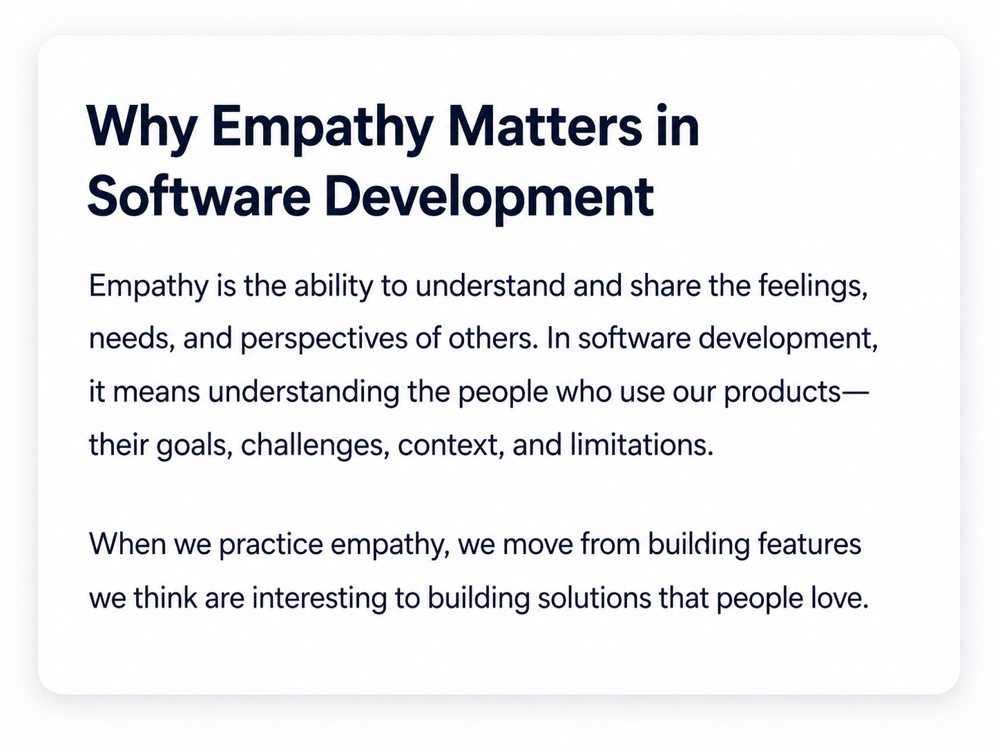
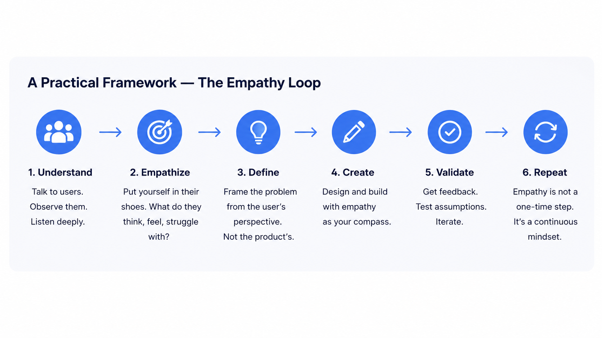
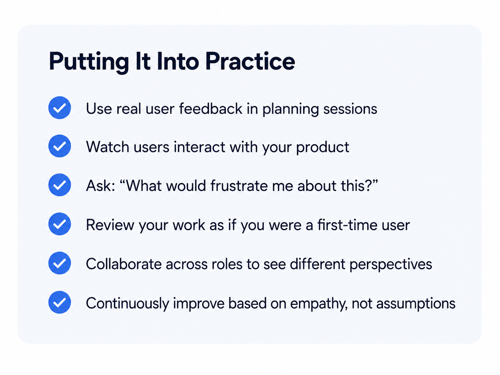
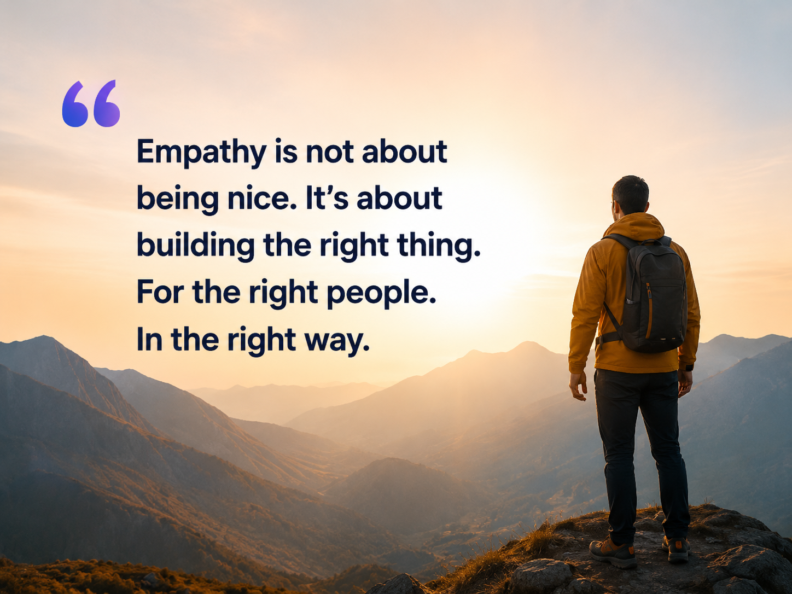
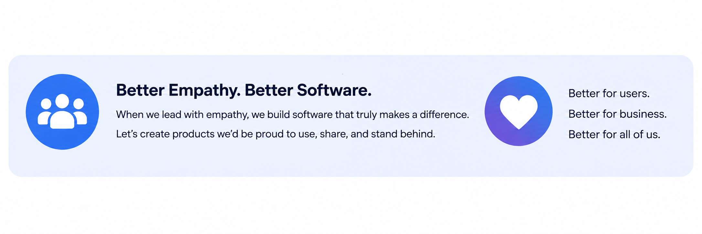

# Empathy in the Workplace for Software Companies

Great software is not created only through clean code, attractive interfaces, persuasive campaigns, or polished sales demonstrations. It is created when teams understand the people behind the requirements: what users are trying to achieve, what they already know, what confuses them, and what they consider valuable.

For a software company, empathy should not be treated as a soft cultural slogan. It is a disciplined practice for replacing internal assumptions with evidence about users, buyers, administrators, developers, and other people affected by the product.

## What Empathy Means in a Software Company

Empathy includes both emotional concern and perspective-taking. In product work, the most actionable form is often cognitive empathy: deliberately examining a feature, workflow, message, or pricing decision from another person’s point of view.

> **The useful question is not:** “Would I like this?”  
> **It is:** “Would this specific user, in this context, with this knowledge and these constraints, understand the value and complete the task?”

This distinction matters because employees possess institutional knowledge that customers do not. A flow that feels obvious to the product team may be unclear to a first-time user. A message that sounds precise to engineering may sound like jargon to a buyer. A feature that is easy to demonstrate may still be difficult to adopt in a real organization.

## Empathy Is a Cross-Functional Responsibility

Empathy cannot remain owned only by product designers. Every function sees a different part of the customer reality:

| Function | Perspective-taking question | What to inspect |
|---|---|---|
| Developers | Where would a first-time user fail, hesitate, or misunderstand the system? | Defaults, errors, performance, learnability, edge cases, operational friction |
| Designers | Does the interface match the user’s language, expectations, abilities, and context? | Information architecture, accessibility, cognitive load, recovery from mistakes |
| Sales | What would make a buyer doubt the value, risk, implementation effort, or credibility? | Demo flow, objections, trust signals, time to value, organizational anxiety |
| Marketing | Would the intended customer recognize their problem and believe the promise? | Positioning, jargon, expectation setting, calls to action, message-market fit |
| Support and success | Where does the product repeatedly create avoidable confusion or workarounds? | Ticket themes, escalations, documentation gaps, recurring failure patterns |

## A Practical Empathy Loop

A reliable empathy practice begins with real evidence and ends with validation. The process can be kept simple:

1. **Understand:** Talk to users, observe them, review support conversations, and study behavioral data.
2. **Empathize:** Identify goals, fears, limitations, mental models, and environmental constraints.
3. **Define:** Frame the problem from the user’s viewpoint rather than the product’s internal structure.
4. **Create:** Design and build with that user context visible to the team.
5. **Validate:** Test assumptions with users and measurable outcomes.
6. **Repeat:** Treat empathy as an ongoing operating habit, not a workshop completed once.

## Methods for Role Reversal and Feature Critique

Different questions require different methods. Empathy maps help teams distinguish what users say, think, do, and feel. Journey maps reveal friction across acquisition, onboarding, support, and renewal. Cognitive walkthroughs test whether a new user can discover the correct action and recognize progress. Heuristic reviews expose systematic usability problems. Contextual observation reveals what people actually do rather than what they remember doing.

Dogfooding is useful, but it is not sufficient. Employees usually know too much about the product, understand its vocabulary, and forgive rough edges that genuine customers may not tolerate. Internal usage should therefore supplement—not replace—external user evidence.

## Putting Empathy into Daily Practice

Empathy becomes durable when it is built into ordinary delivery rituals. A team can begin with a few lightweight practices:

- Bring real customer feedback into planning and refinement sessions.
- Watch users attempt important tasks without coaching them.
- Ask what would frustrate, confuse, or reduce trust at each step.
- Review important work as though encountering the product for the first time.
- Include product, engineering, design, sales, marketing, and support in selected critiques.
- Connect findings to activation, task success, adoption, retention, conversion, support volume, or churn.

## Measure Whether Empathy Changes Outcomes

Empathy should produce testable hypotheses. When a team identifies onboarding confusion, it should define what improvement would look like: higher first-use completion, shorter time to value, fewer support contacts, or stronger activation and retention.

A balanced scorecard can combine behavioral and attitudinal evidence:

- Task-success and error rates
- Time or effort required to complete a task
- Perceived ease of use and overall usability
- Activation, adoption, repeat use, and retention
- Support demand, conversion, renewal, and churn

The goal is not to turn empathy into a single number. The goal is to ensure that teams learn whether their understanding of the user was accurate.

## Create the Conditions for Honest Critique

Empathy reviews fail when teams fear blame, senior opinions dominate the room, or technical elegance consistently outweighs user value. Leaders should protect psychological safety, invite uncomfortable evidence, and treat surfaced friction as useful information rather than personal criticism.

Teams should also avoid over-indexing on vivid anecdotes. A powerful customer story can reveal an important problem, but decisions should be checked against representative research, usage data, and business context.

---

## Better Empathy, Better Software

Empathy is not simply about being nice. In a software company, it means building the right thing, for the right people, in the right way. It helps developers anticipate failure, designers reduce cognitive friction, sales teams understand buyer risk, marketers communicate in the customer’s language, and leaders create systems that reward learning rather than assumption.

When teams consistently ask how their work will be understood, used, trusted, and valued by the people on the other side of the screen, they build products they can be proud to use, recommend, and stand behind.
