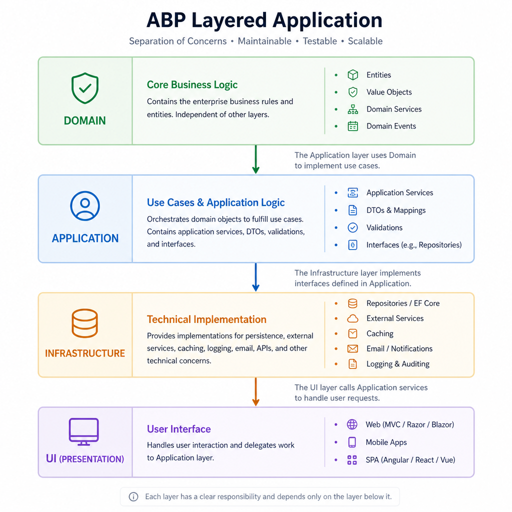
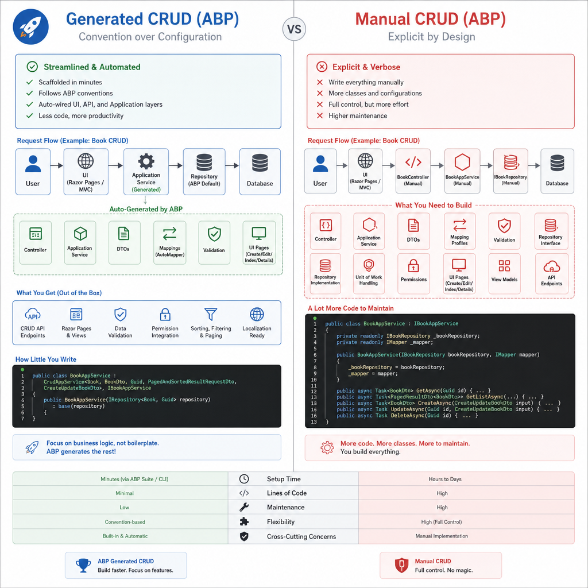
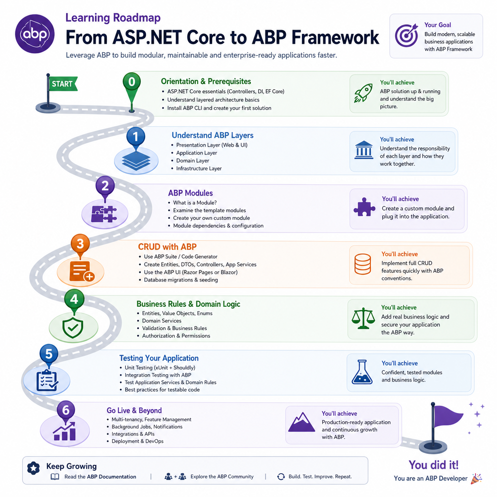

If you come from plain ASP.NET Core and open your first ABP solution, the initial reaction is often the same: *why are there so many projects, layers, DTOs, interfaces and base classes just to build a simple feature?* 🤔

That reaction is normal 👌

ABP Framework gives you a lot on day one: modularity, DDD-friendly structure, application services, repositories, auto API controllers, authorization, auditing, multi-tenancy and UI integration patterns. 
The upside is speed and consistency on serious business apps. 
The downside is that beginners can hit an abstraction wall before they see the payoff.

After reviewing recent discussions, one pattern is clear: most developers do not struggle with C# or ASP.NET Core itself. 
They struggle with *where code is supposed to go* in ABP and *which parts are essential versus optional*.

In this post, I'll focus on that gap. If you are new to ABP, here is what actually helps.

## The biggest learning barrier is not syntax! It is responsibility boundaries

The hardest part for most newcomers is not learning one more framework API. 
It's understanding the architectural split:

- What belongs in the **Domain** layer?
- What belongs in **Application** services?
- Why do **DTOs** exist if you already have entities?
- When do you need a **repository**?
- Why are there separate projects like `Application.Contracts`, `Domain.Shared` and `EntityFrameworkCore`?

In plain ASP.NET Core apps, many developers put a lot of this logic in controllers, services or even EF Core models. 
ABP forces you toward clearer separation.

A practical mental model:

- **Entity / Aggregate Root**: business state and core invariants
- **Domain Service**: domain logic that does not naturally belong to a single entity
- **Repository**: persistence access for aggregates
- **Application Service**: use-case orchestration, authorization, DTO mapping, transaction boundary
- **DTO**: data contract for input/output
- **UI / API layer**: presentation concerns only

> That sounds clean on paper...
> The confusion starts when you build something real 🥴

### A simple example: where should validation go?

Suppose you are creating an `Order`.

- If the rule is "order total must be greater than zero," **that's domain logic**.
- If the rule is "only users with the Orders.Create permission can create an order," **that belongs in the application layer**.
- If the rule is "customer name is required on this page," **that may exist in DTO validation too**.

New ABP developers often ask which layer owns relationships, validation and business rules. 

> The honest answer is: different validation lives in different places. 

That is the first ABP lesson worth learning👍

## Why ABP Feels Heavy at First!

**ABP is opinionated**. It's not trying to be the thinnest possible wrapper over ASP.NET Core.

What beginners usually experience as "**too much structure**" comes from 4 things:

### 1. Project and layer count

A typical ABP solution can include:

- `Domain`
- `Domain.Shared`
- `Application`
- `Application.Contracts`
- `EntityFrameworkCore`
- `HttpApi`
- `HttpApi.Client`
- UI project such as MVC, Razor Pages, Blazor or Angular
- Test projects

For a small feature, that can feel excessive... **For a long-lived business system, it starts to make sense**.

### 2. Generated convenience hides the mechanics

ABP can generate a lot of CRUD plumbing and generic base classes like `CrudAppService` reduce repetitive code. 
That's useful, but it can also hide how things connect.

<u>A beginner sees a working page and API without fully understanding:</u>

- how the application service is exposed as an API
- where repository methods are coming from
- how DTO mapping works
- why the UI calls application contracts instead of entities

### 3. DDD terminology raises the entry cost

You do not need to become a DDD master to use ABP well... But ABP definitely assumes some familiarity with:

- entities
- aggregate roots
- repositories
- value objects
- domain services
- bounded contexts and modules

If those ideas are new, ABP can feel harder than it really is.

### 4. UI integration is not always obvious

Newcomers also get stuck on the end-to-end flow:

1. User clicks a button on a Razor Page or Blazor page
2. UI sends data to an application service or HTTP API
3. Application service validates permissions and input
4. Domain and repository code runs
5. DTO comes back to the UI

Once you understand that flow, ABP becomes much more predictable.

## Start with CRUD, but do not stop there

A common question is whether beginners should start with simple CRUD or jump straight into a realistic business module.

My view: **start with CRUD, then quickly move to a business feature with real rules**.

### Why CRUD is the right first step

CRUD teaches the ABP basics with low cognitive load:

- project structure
- entity definition
- DTOs
- repositories
- application services
- permissions
- UI page wiring
- migrations and database updates

This is why the [ABP BookStore tutorial](https://abp.io/docs/latest/tutorials/book-store) is a useful starting point.

### Why CRUD alone is not enough

Pure CRUD can give you a false sense of understanding.

A generated Create / Read / Update / Delete screen does not force you to deal with:

- aggregate boundaries
- child collections
- business invariants
- cross-entity rules
- domain services
- richer authorization scenarios
- multi-tenancy behavior
- auditing decisions

Those are the areas where ABP starts to justify its structure.

### A better learning sequence

Use this progression:

1. Build one very small CRUD module
2. Rebuild part of it manually instead of relying only on generation
3. Build one realistic business module with at least one non-trivial rule
4. Add authorization, validation and a relationship
5. Add tests around the domain or application service

That path keeps the early win while exposing the real architecture.

## Generated CRUD vs manual CRUD: learn both

This is one of the most useful mindset shifts for ABP beginners.

**Generated CRUD is for productivity. Manual CRUD is for understanding.**

You need both.

### When generated CRUD helps

ABP Suite and ABP base services can save time when the feature is mostly standard admin functionality:

- back-office reference data
- simple management screens
- low-risk maintenance pages
- conventional DTO/entity flows

If the goal is shipping business software efficiently, generated code is not cheating. It is leverage.

### When manual implementation matters

You should manually implement at least one feature end to end so you understand:

- how `CrudAppService` reduces boilerplate
- what repository methods are doing
- where validation belongs
- how authorization is applied
- how auto API controllers expose application services

A lot of Reddit confusion around ABP comes from learning generated patterns before understanding the underlying manual version.

### A good exercise

Build `Product` management twice:

- First with `CrudAppService`
- Then manually with custom application service methods and domain rules

Compare both implementations. That single exercise teaches more than reading docs for hours.

## Which DDD patterns real ABP teams often simplify

This is where many beginners get relief: **not every ABP project uses full-strength DDD all the time.**

Real teams often simplify the model, especially early on.

### Patterns teams commonly keep

These tend to deliver value quickly in ABP:

- clear application service boundaries
- entities and aggregate roots
- repositories
- DTO separation
- modular structure
- permission-based authorization

### Patterns teams often delay or reduce

These are useful in the right context, but many teams do not force them into every feature:

- dedicated domain services for very simple logic
- value objects for every tiny concept
- specification pattern everywhere
- excessive interface layering where no variation is expected
- over-splitting modules too early

### A practical rule of thumb

Use the simplest thing that preserves clarity.

For example:

- If a rule is trivial and local to one use case, putting it in an application service may be fine.
- If a rule protects business invariants and must hold regardless of caller, move it into the domain model.
- If a concept has behavior and invariants of its own, a value object may help.
- If it is just a shared enum or constant, `Domain.Shared` is often enough.

ABP supports rich DDD patterns, but it does not require ceremony for ceremony's sake.

## A concrete “ASP.NET Core to ABP” learning path

If I had to design a practical learning path for experienced ASP.NET Core developers, it would look like this.

### Step 1: Know what ABP is adding on top of ASP.NET Core

Before touching templates, be comfortable with:

- dependency injection
- configuration
- middleware basics
- EF Core or MongoDB
- controllers or Razor Pages or Blazor basics
- validation and authorization in ASP.NET Core

>  ABP builds on top of these. It does not replace the need to understand them.

### Step 2: Learn the ABP solution structure

Let's see each layer's goal:

- `Domain`: core business model
- `Domain.Shared`: shared enums, constants, localization resources, simple shared types
- `Application.Contracts`: DTOs and service contracts
- `Application`: use cases and orchestration
- `EntityFrameworkCore`: database mappings and repository implementation details
- `HttpApi`: API exposure
- UI project: user interaction

### Step 3: Understand modules and dependencies

ABP's modularity is a major feature, but beginners often treat modules like folders with extra steps.

They are more than that.

A module defines:

- dependency boundaries
- service registration scope
- reusable feature packaging
- initialization points via module lifecycle methods and `[DependsOn]`

At first, use modules as organizational boundaries inside a modular monolith. Do not rush into distributed or microservice-style decomposition.

### Step 4: Build one CRUD feature the ABP way

Create a simple feature such as Books, Products or Categories.

Make sure you understand:

- entity creation
- migration flow
- DTO mapping
- application service methods
- permission checks
- how the UI or API calls the application layer

### Step 5: Rebuild one part manually

Now remove the training wheels for one feature.

Instead of only leaning on base classes, explicitly write:

- a custom application service method
- a custom repository query if needed
- domain validation or invariants
- a tailored DTO instead of generic CRUD shapes

This is where ABP usually clicks.

### Step 6: Build a realistic business module

A good example is `Order Management`, `Leave Requests` or `Inventory Transfer`.

Choose something with:

- one-to-many relationship
- status transitions
- authorization rules
- at least one business invariant
- audit visibility

That reveals why ABP's layered structure exists.

### Step 7: Add built-in ABP concerns on purpose

ABP shines when you use its built-in platform features intentionally:

- authorization
- auditing
- validation
- localization
- multi-tenancy
- settings and permissions

Do not treat these as advanced extras. They are part of the framework's real value.

### Step 8: Learn testing by layer

Even if you do not build a full testing strategy immediately, understand the testing shape:

- domain tests for invariants and business rules
- application tests for use cases and permissions
- integration tests for persistence and module wiring

A lot of ABP's architecture pays off once you start testing behavior in isolation.

## A small example of responsibility split

Here is a deliberately small example to make the layering less abstract.

Suppose you have a leave request system.

**Domain** concerns:

- a leave request cannot be approved after rejection
- end date cannot be before start date
- total leave days must be positive

**Application** concerns:

- only managers can approve requests
- map input DTO to entity operations
- return a DTO shaped for the UI
- coordinate repository access and unit of work

**UI** concerns:

- disable approve button when user lacks permission
- show validation messages
- render status badges and filters

That split is the heart of ABP. Once you start seeing features this way, the framework becomes much easier to navigate.

## When to use ABP and when not to

**ABP is powerful, but <u>it is not automatically the right default</u> for every ASP.NET Core project.**

### When to use ABP

ABP is a strong fit when you are building:

- line-of-business applications
- admin-heavy platforms
- SaaS or multi-tenant systems
- modular monoliths that may grow over time
- systems that need built-in authorization, auditing, localization and consistent conventions
- teams that benefit from standardized architecture

### When NOT to use ABP

ABP may be excessive in the following situations:

- a tiny API with minimal business logic
- a short-lived internal tool where framework structure would dominate the workload
- a team with no interest in layered architecture or DDD-style thinking
- a highly custom architecture where ABP conventions would mostly be bypassed

The main cost of ABP is not performance or syntax 🤜 It is **architectural overhead**. 
<u>If the app is too small, that overhead may not pay back.</u>

---

## Common mistakes new ABP developers make

These are the mistakes I see most often in early ABP learning.

### 1. Trying to understand everything before building anything

Do not wait until every project, package and abstraction makes sense. Build one feature first.

### 2. Using generated code without reading it

Generated CRUD is useful, but inspect what it created. Otherwise you will stay dependent on tooling.

### 3. Forcing textbook DDD into every feature

Not every screen needs aggregates, value objects, domain services and custom repositories all at once.

### 4. Putting all business logic in application services

This works for a while, but you eventually lose domain consistency. Protect important invariants closer to the domain model.

### 5. Splitting into too many modules too early

Start with a modular monolith mindset. Extract boundaries when they become meaningful.

### 6. Ignoring built-in ABP features

If you manually rebuild authorization, auditing or tenant-aware behavior without understanding ABP's built-ins, you are fighting the framework.

## The learning path I would actually recommend to a new team

If a team asked me for a practical ABP onboarding sequence, I would keep it simple:

### 📚 Week 1: Basics and orientation

- Review ABP solution structure
- Build the BookStore-style tutorial once
- Identify what each layer is responsible for

### 📚 Week 2: Manual feature implementation

- Build one small module manually
- Avoid too much generation
- Trace one request from UI to application service to repository to database

### 📚 Week 3: Real business rules

- Add relationships
- Add authorization
- Add a workflow or state transition
- Write tests for a few business rules

### 📚 Week 4: Productivity and conventions

- Reintroduce generated tooling where it saves time
- Standardize module patterns
- Decide which DDD patterns the team will use by default and which are optional

That sequence teaches both the architecture and the productivity side of ABP.

---

## Final perspective: learn the intent, not just the template

ABP can feel complicated when approached as a collection of projects and base classes. It gets easier when you see the intent behind the structure:

- protect business rules
- standardize application boundaries
- make common enterprise features reusable
- keep large apps maintainable

If you are new to ABP, do not aim to master every pattern immediately. Aim to answer these four questions clearly for each feature:

- What is the business rule?
- Which layer owns it?
- What data crosses the boundary?
- Which ABP feature already solves part of this problem?

Once those answers become natural, ABP stops feeling heavy and starts feeling productive.

---

## As a Summary

- **The biggest ABP learning barrier is** understanding responsibility boundaries between domain, application services, DTOs, repositories and UI.
- **Start with a small CRUD feature**, but move quickly to a realistic business module with rules, relationships and permissions.
- **Learn both generated and manual CRUD**; one gives productivity, the other gives understanding.
- Real ABP teams often simplify DDD and adopt advanced patterns **only when the complexity justifies them**.
- **The best learning path is ASP.NET Core basics first**, then ABP layers, one manual feature, one real module and built-in features like authorization and auditing.