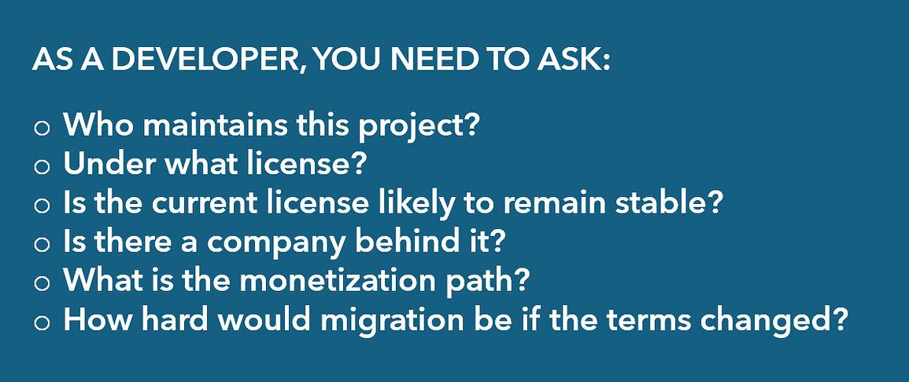
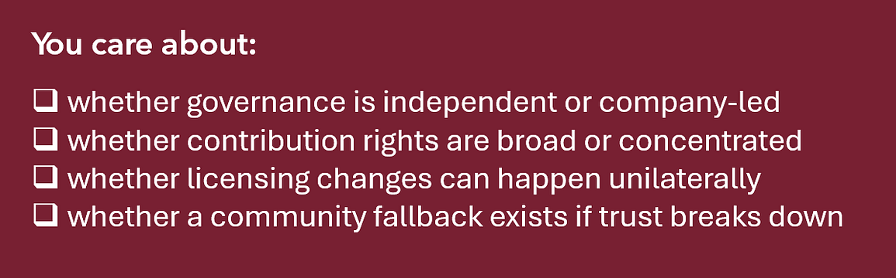
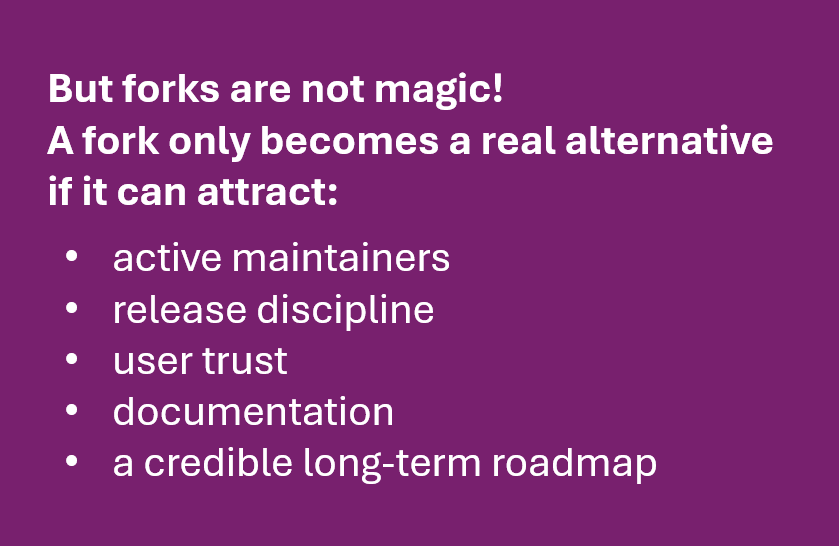
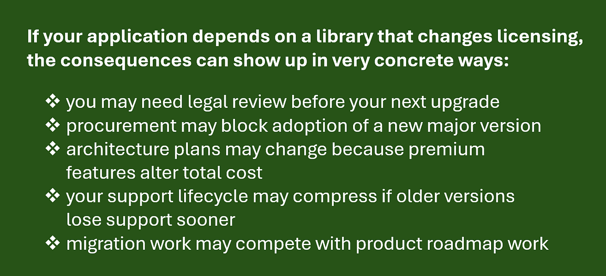
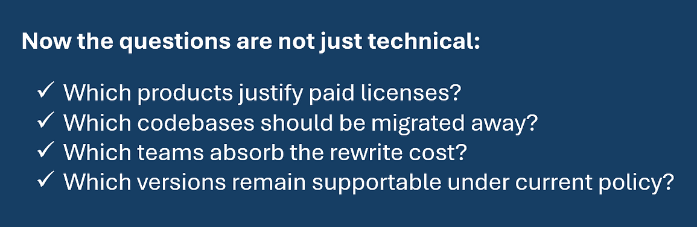
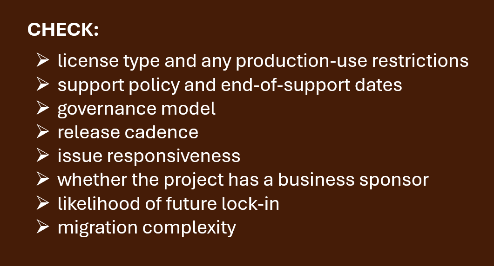
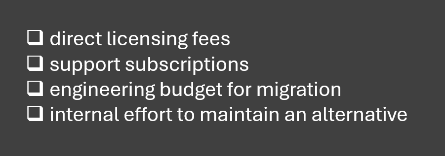
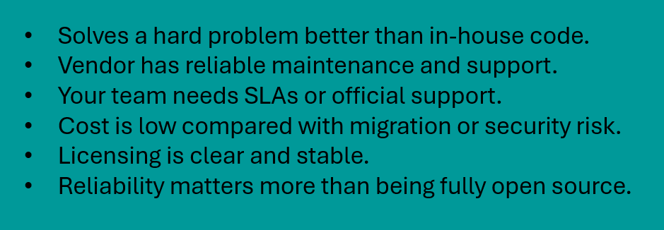
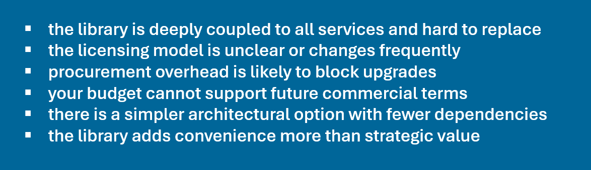
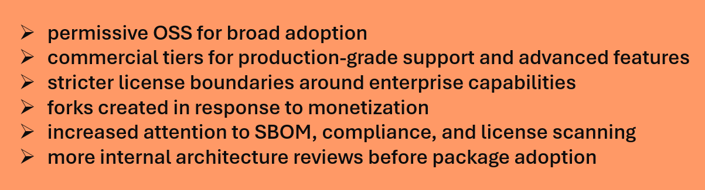

For years, many .NET teams treated core open source libraries as stable background infrastructure: useful, battle-tested, and effectively free forever. That assumption is starting to break.

When widely used projects like IdentityServer, AutoMapper, and MediatR move toward commercial or more restrictive licensing, the discussion is no longer just about one package or one maintainer. It becomes a bigger question about how the .NET ecosystem pays for the software it depends on.

This matters because modern .NET applications are built on layers of third-party dependencies. If one of those layers changes its pricing, support model, or license terms, the impact is not theoretical. It affects procurement, architecture, upgrade strategy, compliance, and long-term maintenance.

## The pattern is no longer isolated

A few years ago, licensing changes in .NET could still be dismissed as exceptions. That is getting harder.

Several important projects now illustrate the same underlying tension: software that became critical infrastructure was often maintained with a funding model better suited to side projects than production-critical systems.

## Duende IdentityServer is the clearest example

The IdentityServer story is probably the most visible case in .NET. What started as a widely adopted open-source identity solution evolved into Duende IdentityServer, which requires paid licenses for production use, while free usage is limited to development, testing, personal projects, or qualifying community scenarios.

More recently, Duende moved again with its v8 generation and introduced a more tiered licensing model, including Lite, Standard, Advanced, and Custom options, plus paid add-ons for additional capabilities. At the same time, support windows are clearly tied to .NET versions, making the product feel even more like managed commercial infrastructure than community software.

> That is not necessarily a bad thing. Identity is security-critical software. It is expensive to maintain, expensive to support, and risky to underfund. But it does mark a major shift in expectations for teams that still think of it primarily as an OSS building block.

## AutoMapper and MediatR point to a broader shift

AutoMapper and MediatR are different kinds of libraries, but their direction matters just as much.

These are not niche components. They are deeply embedded in enterprise codebases, tutorials, templates, and architectural conventions. So when they move toward dual licensing, commercial terms, or more restrictive licensing, the message is clear: **even highly popular and culturally central .NET libraries may no longer fit the old “free and permissive forever” model.**

AutoMapper’s move away from .NET Foundation membership after adopting a non-permissive license is especially notable because it highlights a governance boundary. The ecosystem may celebrate OSS, but institutions such as the .NET Foundation still rely on clear licensing rules. Once a project changes those terms, it often changes its place in the ecosystem too.

## Why maintainers are doing this

The easy reaction is to call commercialization a betrayal. The more honest reaction is to admit that many maintainers have been subsidizing the industry for years.

A project can be free for users and still very expensive for its authors.
Maintaining a popular library often means:

- triaging issues from thousands of downstream users
- keeping up with new .NET releases
- patching security problems
- maintaining documentation and samples
- answering support requests that are really consulting work in disguise
- dealing with dependency, CI, hosting, and release overhead

Once a library becomes critical infrastructure, users expect reliability similar to commercial software. But expectations usually rise faster than funding.

That imbalance creates a predictable outcome: maintainers either burn out, slow down, seek sponsorship, or commercialize.

## Open-source popularity does not automatically create sustainability

This is the part many teams still underestimate.

A package can have massive adoption and still be financially fragile. Downloads, GitHub stars, and conference mentions do not pay for maintenance. In fact, popularity often increases the burden without improving sustainability.

From a maintainer’s perspective, commercialization can be a rational correction:

- charge the organizations getting the most value
- fund long-term maintenance
- offer support contracts and SLAs
- justify time spent on roadmap work
- reduce dependence on unpaid labor

### In other words, the move to commercial licensing is often less about greed than about replacing an unrealistic business model.

## Why the community reaction is so mixed

Even if the economics make sense, the backlash is real. And frankly, some of it is justified.

The friction usually comes from the gap between legal reality and social expectation.

### Legally, maintainers can often change how future versions are licensed. Socially, users feel that a trusted community dependency has changed the rules after becoming embedded in thousands of systems.

## What bothers teams most

In practice, teams react to more than cost. They are reacting to uncertainty.
The common concerns are familiar:

- unexpected licensing costs appearing in mature products
- fear of future pricing increases
- procurement delays for something developers previously installed with `dotnet add package`
- license compatibility and compliance reviews
- vendor lock-in around foundational infrastructure
- migration costs if a team decides to leave later
- concern that previously core features move behind paid tiers

This is why the strongest reactions usually happen when the library is infrastructural rather than optional. Authentication, mapping, messaging, and mediator patterns sit close to the core of many architectures. **Replacing them is possible, but rarely cheap.**

## Suddenness matters as much as pricing

A reasonable commercial model can still create anger if the transition feels abrupt. Teams generally accept that maintainers need funding. What they do not accept as easily is:

- vague roadmap communication
- surprise license changes
- unclear grandfathering rules
- unclear distinctions between old and new versions
- feature packaging that feels like a trap for existing users

That trust dimension matters. In OSS, the license is not the whole relationship. Predictability is part of the product.

## What this signals for the .NET ecosystem

The larger lesson is not simply that some maintainers want to get paid. It is that the .NET ecosystem is maturing into one where critical libraries are increasingly treated like products, not just repositories. That has several consequences.

## 1. Dependency selection is now a governance decision

Choosing a package is no longer only a technical choice.

Press enter or click to view image in full size

This does not mean avoiding all commercially backed OSS. It means evaluating dependencies the same way you evaluate databases, cloud services, or authentication providers.

## 2. Foundation membership and community trust will matter more

When a project leaves a permissive governance environment, it sends a signal, even if the software remains technically strong.

Press enter or click to view image in full size

The .NET Foundation’s stance on permissive licensing creates a useful boundary here. It does not solve commercialization, but it helps clarify which projects still fit traditional OSS expectations.

## 3. Forks and alternatives will become more common

When licensing changes upset users, forks appear. That is a normal OSS response.

Press enter or click to view image in full size

> A reactive fork may help teams buy time, but it does not automatically become sustainable infrastructure.

In many cases, the fork inherits the same funding problem that triggered the original commercialization.

## The practical risk for engineering teams

The biggest mistake teams can make is treating this as community drama instead of delivery risk.

Press enter or click to view image in full size

This is especially relevant for organizations with long-lived internal platforms or multi-tenant SaaS products, where one dependency can affect dozens of services.

## A realistic example

Imagine a company running an internal platform and several customer-facing .NET applications.

- **The identity layer uses IdentityServer.**
- **Multiple services use MediatR for application-layer orchestration.**
- **Older codebases rely heavily on AutoMapper profiles.**

If all three become cost, licensing, or governance concerns at the same time, the company suddenly has a portfolio-level problem rather than a package-level problem.

Press enter or click to view image in full size

That is architecture, budgeting, and compliance converging in one decision.

## How teams should respond

> Panic is not useful. Blind trust is not useful either.

A better response is to become more deliberate about dependency management.

## Build a dependency review habit

For critical packages, review more than API quality.

Press enter or click to view image in full size

If a package sits in authentication, authorization, persistence, messaging, or application architecture, the review should be stricter than for a small utility library.

## Categorize dependencies by replacement cost

Not every package deserves the same scrutiny.

**A useful model is:**

- low replacement cost: small utilities, isolated helpers
- medium replacement cost: libraries used across one bounded context
- high replacement cost: foundational cross-cutting libraries used everywhere

Commercialization risk matters most in the third category. If replacing the library means touching every service, pipeline, or authentication flow, that risk belongs on the architecture radar early.

## Budget for critical OSS

Many companies are comfortable paying for cloud hosting but still resist paying for the libraries that shape their actual application architecture.

That mindset is becoming outdated.

If a dependency is business-critical, teams should assume one of these will eventually be required:

Press enter or click to view image in full size

> You will pay somehow!
> The only real question is whether you pay proactively or reactively.

## When to use commercially backed OSS and when not to

Commercialization is not automatically a reason to avoid a project.

## When to use it

**Commercially backed OSS can be a good fit when:**

Identity infrastructure is the obvious example. A mature, well-supported identity product may be worth paying for if the alternative is building and maintaining security-sensitive code yourself.

---

## When NOT to use it

**Be cautious when:**

This is where some teams may rethink packages like object mappers or mediator frameworks. If the dependency is mostly ergonomic and the long-term governance risk is rising, simpler code may be the better tradeoff.

## What this means for maintainers, companies, and the community

The ecosystem now needs more honest expectations on all sides.

## For maintainers

If your library underpins production systems, sustainability needs to be part of the strategy early. Commercialization is easier to accept when it is transparent, gradual, and communicated as part of a long-term model rather than a sudden pivot.

## For companies

If your business depends on OSS, treating maintainers as an infinite free resource is no longer credible. Critical dependencies should have owners, budgets, and risk reviews.

## For the .NET community

The community may need to become more selective about what it normalizes as default architecture. If a pattern depends heavily on a few centralized libraries, then a licensing change in one project can ripple widely. Simpler stacks are often more resilient.

## A likely next phase for .NET OSS

The next few years will probably bring more segmentation across the .NET ecosystem.

Expect to see more of this:

That does not mean open source in .NET is weakening. It means the ecosystem is facing the same sustainability pressures seen elsewhere: maintenance is expensive, infrastructure software has real business value, and someone eventually has to fund it.

The healthiest outcome is not pretending commercialization should never happen. It is making sure it happens with predictable governance, fair communication, and realistic expectations from users.

## As a Summary

- Commercialization of key .NET libraries is a sustainability signal, not an isolated incident.
- Teams should evaluate dependencies by license, governance, support policy, and replacement cost.
- Commercial OSS can be the right choice for critical infrastructure, especially where support and security matter.
- The real risk is not paying for software; it is being surprised by cost, lock-in, or migration pressure too late.
- .NET teams should treat dependency strategy as an architectural and business decision, not just a NuGet decision.
