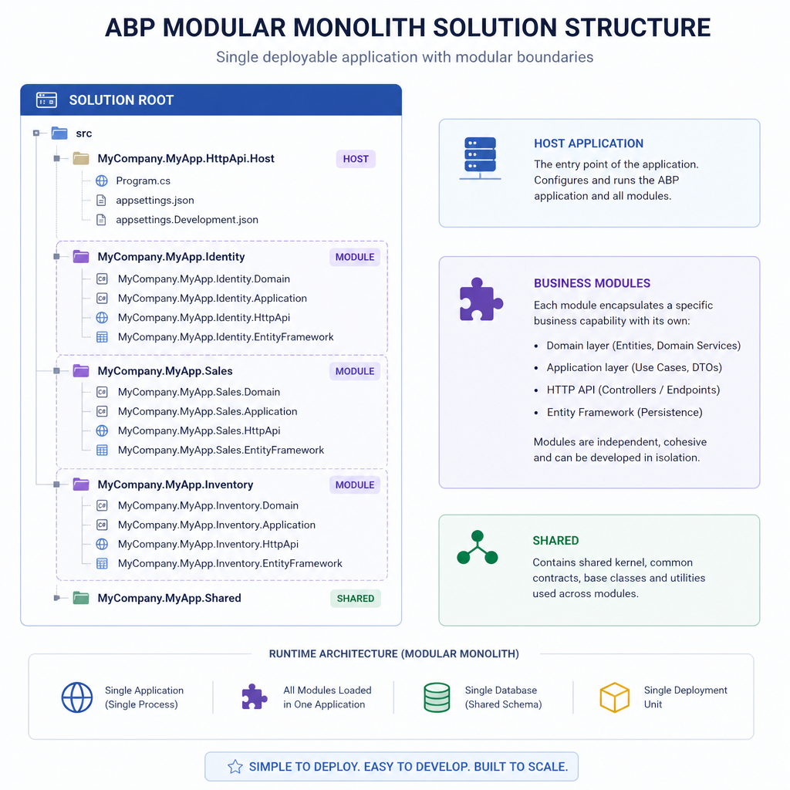
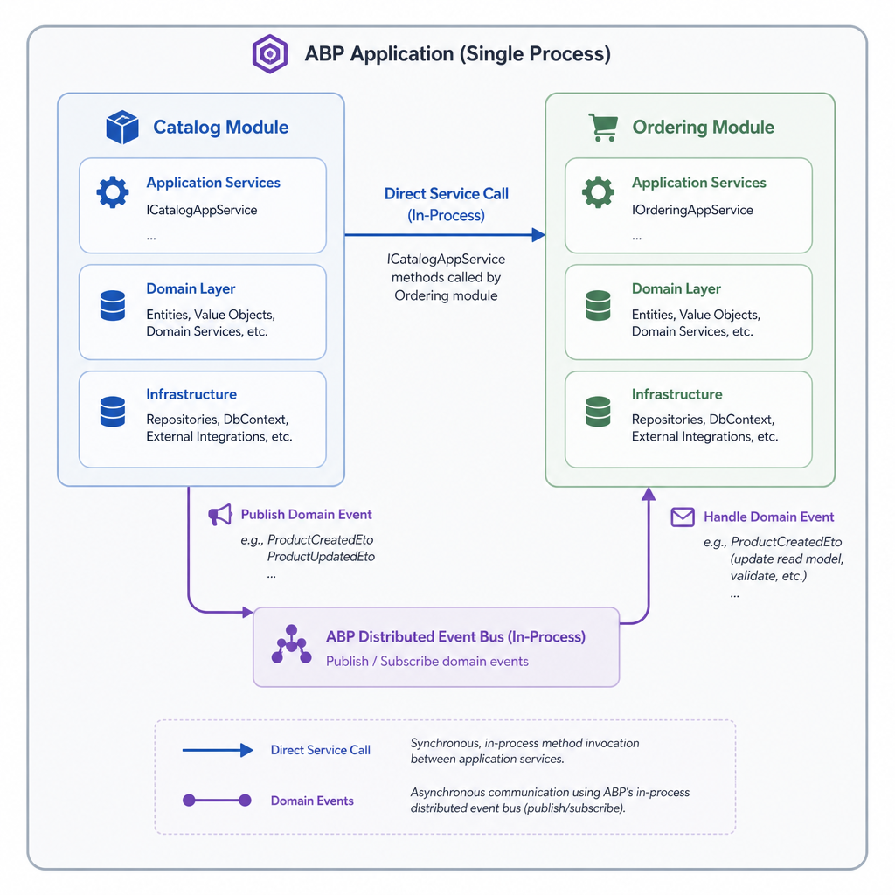
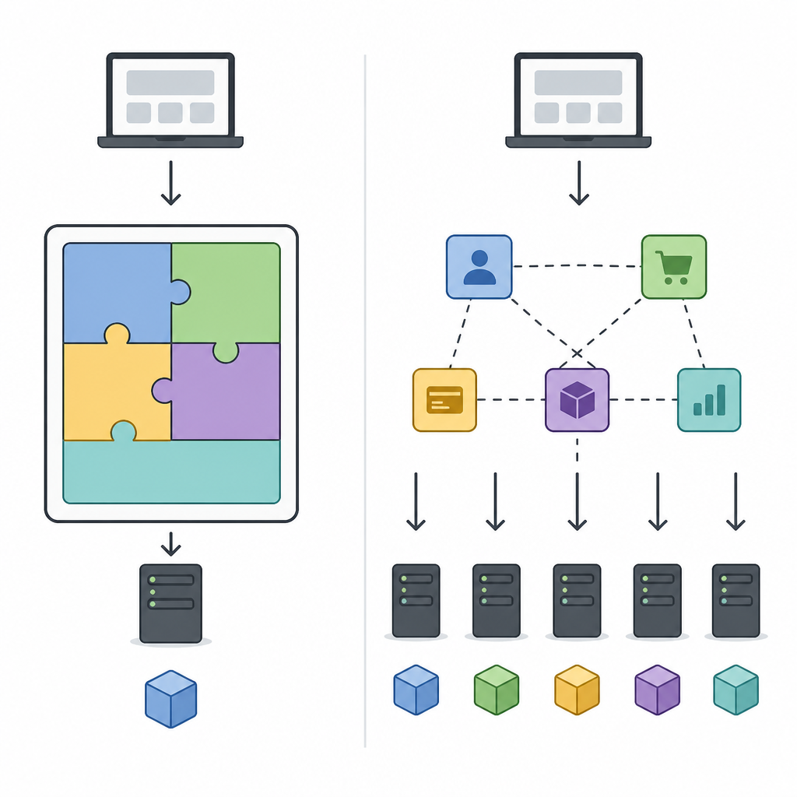

Most monoliths do not fail because they are monoliths. They fail because they become tangled.

That is exactly why the modular monolith is such a practical architecture for business applications. You keep the operational simplicity of a single deployment, but you organize the codebase around clear business boundaries. With ABP Studio, this approach is not an afterthought. It is built into the way you create and evolve a solution.

In this article, I will walk through how to build a modular monolith with ABP Studio, how ABP modules fit together, where teams usually get the boundaries wrong, and how to structure your solution so it stays maintainable as it grows.

If you are building a line-of-business app and want something more disciplined than a traditional monolith, but less expensive than microservices, this is one of the strongest options in the .NET ecosystem.

## Why a modular monolith fits many real projects

A modular monolith gives you:

- one deployable application
- one main runtime host
- clear module boundaries by business capability
- the option to evolve selected modules later
- less distributed systems overhead than microservices

That trade-off matters in real teams. Most products do not need network boundaries on day one. They need:

- faster delivery
- simpler debugging
- less infrastructure
- a codebase that does not collapse after six months

ABP Framework is designed around modularity. A module in ABP can own its own:

- domain model
- application services
- database integration
- API endpoints
- UI pieces
- tests

That makes ABP a natural fit for modular monolith architecture rather than a framework you have to bend into shape.

## What ABP Studio creates for a modular monolith

When you choose the Modular Monolith option in ABP Studio's New Solution Wizard, ABP creates a solution structure intended for a modern modular application.

At a high level, you typically get:

- `main/` for the main host application
- `modules/` for business modules
- `etc/` for shared infrastructure and configuration assets

This is a useful default because it separates the host from the business capabilities from the start.

A simplified layout looks like this:

```text
src/
  main/
    MyCompany.MyProduct.Web
    MyCompany.MyProduct.HttpApi.Host
  modules/
    Catalog/
      MyCompany.MyProduct.Catalog.Domain
      MyCompany.MyProduct.Catalog.Application
      MyCompany.MyProduct.Catalog.EntityFrameworkCore
      MyCompany.MyProduct.Catalog.HttpApi
      MyCompany.MyProduct.Catalog.Web
    Ordering/
      MyCompany.MyProduct.Ordering.Domain
      MyCompany.MyProduct.Ordering.Application
      MyCompany.MyProduct.Ordering.EntityFrameworkCore
      MyCompany.MyProduct.Ordering.HttpApi
      MyCompany.MyProduct.Ordering.Web
etc/
  docker/
  k8s/
  configs/
```

The exact projects depend on your choices, but the important idea is consistent: the host app lives in `main`, and business capabilities live under `modules`.

ABP Studio also lets you choose modules up front or add them later. That is important because most teams do not know their final module map on day one. You can start with a few strong boundaries and evolve from there.




## Understanding ABP modules in practice

In ABP, modules are first-class building blocks. They are not just folders.

A module typically declares dependencies using attributes such as `DependsOn`, which tells ABP how pieces should be initialized and wired together.

A minimal example looks like this:

```csharp
using Volo.Abp.Modularity;

[DependsOn(
    typeof(AbpDddDomainModule)
)]
public class CatalogDomainModule : AbpModule
{
}
```

That may look small, but it is central to the architecture. Dependencies are explicit, and the framework uses those module relationships during startup.

In practical terms, this gives you:

- a consistent module lifecycle
- explicit compile-time references
- less hidden coupling
- clearer ownership boundaries

ABP also distinguishes between framework modules and your application modules.

- Framework modules provide infrastructure features like validation, caching, permission management, and persistence integration.
- Application modules represent your business capabilities like Catalog, Ordering, Billing, or Support.

Structurally, they are similar. The difference is their role in the system.

## A practical module structure that scales

One of the most useful ABP practices is layered modules. Instead of throwing everything into a single project, you separate concerns inside each module.

A common structure is:

- Domain
- Application
- Infrastructure or provider-specific persistence
- HttpApi
- Web or UI
- Tests

For example, a Catalog module may look like this:

### Domain

This is where business rules live:

- entities
- value objects
- domain services
- domain events
- repository interfaces

Keep this layer focused on business behavior, not framework plumbing.

### Application

This layer orchestrates use cases:

- application services
- DTOs
- authorization checks
- transaction boundaries
- coordination across domain objects

This is usually where external callers interact with the module.

### EntityFrameworkCore or MongoDB

This layer handles persistence details:

- DbContext or Mongo collections
- repository implementations
- mappings
- migrations where relevant

ABP supports different providers, and a module can include the provider projects it actually needs.

### HttpApi

This exposes the module over HTTP when needed:

- controllers
- remote service contracts
- serialization-related setup

### Web

If your solution includes server-side or MVC-style UI integration, this is where UI pieces for the module can live.

### Tests

A solid module usually has separate tests for:

- domain logic
- application logic
- persistence integration

For EF Core, in-memory SQLite is a practical option for provider-level tests. For MongoDB, ephemeral test instances are a common approach.

## Step-by-step: creating a modular monolith with ABP Studio

The tooling matters because architecture tends to decay when it is inconvenient. ABP Studio reduces that friction.

A practical setup flow looks like this.

### 1. Create the solution with the Modular Monolith template

In ABP Studio:

- create a new solution
- choose the Modular Monolith template
- select your UI and database preferences
- decide which business modules you want to include initially

This gives you the host app under `main` and a `modules` area for business capabilities.

### 2. Start with business boundaries, not technical layers

Before adding modules, identify your real capabilities. Good early candidates are usually things like:

- Catalog
- Ordering
- Inventory
- Customer Management
- Billing

Bad module boundaries are usually technical buckets like:

- Utilities
- Common Business Logic
- Shared Services

Those become dumping grounds fast.

A simple rule helps: if a module name would make sense to a product owner, it is probably closer to the right boundary.

### 3. Add modules incrementally

You do not need to model the whole enterprise on day one.

Start with two or three meaningful modules. For example:

- Catalog manages products and pricing rules
- Ordering manages carts, orders, and order state
- Identity handles users and permissions via ABP's existing modules

This is enough to validate your architecture without over-designing it.

### 4. Keep each module independently understandable

A developer should be able to open `modules/Catalog` and understand:

- what the module owns
- what it exposes publicly
- what it depends on
- how it is tested

If the module constantly reaches into another module's internals, the boundary is already weak.

### 5. Wire modules through explicit dependencies

ABP's module system encourages declaring dependencies up front.

For example, an application layer may depend on its own domain layer and some framework modules:

```csharp
[DependsOn(
    typeof(CatalogDomainModule),
    typeof(AbpDddApplicationModule)
)]
public class CatalogApplicationModule : AbpModule
{
}
```

This is much healthier than hidden runtime coupling or random service lookups scattered across the codebase.




## How modules should communicate

This is where many modular monoliths either stay clean or slowly become a distributed mess inside one process.

In ABP, module communication generally falls into two categories:

- synchronous communication through interfaces or public application services
- asynchronous communication through events

Both are useful. The mistake is using one for everything.

### Option 1: synchronous calls for direct business workflows

Use direct service calls when:

- one module needs an immediate answer
- the workflow is naturally request-response
- the dependency is acceptable and explicit

Example:

- Ordering needs to verify product availability from Catalog before creating an order line.

In that case, a clear application service contract is often the simplest solution.

Benefits:

- easy to trace
- easier to debug
- strong flow control
- fewer hidden side effects

Costs:

- tighter coupling between modules
- dependency direction must be managed carefully

### Option 2: events for decoupled reactions

Use events when:

- a module publishes something that others may react to
- the publisher should not know all consumers
- eventual consistency is acceptable

Example:

- Ordering publishes `OrderPlaced`
- Inventory reserves stock
- Billing starts invoicing
- Notifications sends a confirmation

Benefits:

- lower direct coupling
- easier to add new consumers later
- better long-term separation

Costs:

- debugging is harder
- side effects are less obvious
- too many events can create implicit dependencies

A good default is simple:

- use direct calls for core request-response flows
- use events for reactions and cross-cutting side effects

## An example module interaction design

Imagine a small commerce system with Catalog and Ordering modules.

### Catalog owns

- products
- product pricing
- availability rules

### Ordering owns

- carts
- orders
- order state transitions

A clean interaction might look like this:

1. A user places an order through Ordering.
2. Ordering calls a public Catalog service to validate selected products.
3. Ordering creates the order in its own domain.
4. Ordering publishes an order-created event.
5. Other modules react as needed.

Notice what does not happen:

- Ordering does not directly query Catalog tables.
- Catalog does not modify Ordering aggregates.
- Shared internal entities are not passed around freely.

That discipline matters more than the fact that everything runs in one process.

## Database design in a modular monolith

A modular monolith does not force a single database strategy.

With ABP, you can support:

- a shared database for the whole application
- separate schemas per module
- module-specific databases in some cases

For most teams, the best starting point is a single database with clear ownership boundaries in code.

Why this is usually the right default:

- simpler operations
- easier local development
- straightforward transactions
- less infrastructure overhead

But even with one database, treat data ownership seriously.

That means:

- each module owns its own tables and mappings
- cross-module table access is avoided
- modules interact through services or events, not direct persistence shortcuts

If you later decide to extract a module into a separate service, this discipline will matter far more than whether you started with one database or three.




## When to use layered modules and when not to overdo them

ABP encourages a layered structure because it scales well, but you should still apply judgment.

### Use layered modules when

- the module has real business complexity
- multiple developers will work on it
- you want clear separation between domain, use cases, and persistence
- the module may grow into a reusable building block

### Do not over-layer when

- the module is tiny and stable
- the behavior is simple CRUD with little business logic
- extra projects would create more ceremony than clarity

There is no prize for turning a 300-line feature into six projects.

A useful practical rule:

- start simple, but not sloppy
- add more structure when the module earns it

ABP makes layered modules easy, but that does not mean every feature deserves the full treatment immediately.

## Testing strategy for a modular monolith

Modular architecture only pays off if modules can be tested with confidence.

A practical testing setup includes:

### Domain tests

Use these for pure business rules:

- invariants
- state transitions
- validation rules
- domain service behavior

These should be fast and framework-light.

### Application tests

Use these for use cases:

- application service behavior
- authorization checks
- DTO mapping expectations
- orchestration across domain objects

### Persistence tests

Use these for provider-specific concerns:

- EF Core mappings
- repository behavior
- query correctness
- migration-related assumptions

In ABP-based solutions, this usually means separate test projects per layer or concern. That keeps failures localized and makes refactoring safer.

## Common mistakes that break modular monoliths

The architecture is solid, but the failure modes are predictable.

### 1. Fake modules with real coupling

This is the most common problem. Teams create module folders, but the code still behaves like one giant application.

Symptoms:

- modules reference each other's internals
- shared entities leak everywhere
- services depend on concrete implementations across modules
- repositories are used across boundaries

If that is happening, you have namespaces, not modules.

### 2. A shared project that becomes a dumping ground

Be very careful with anything named:

- Common
- Shared
- Core
- Utilities

Some shared infrastructure is fine. Shared business logic is often a sign that boundaries are unclear.

Prefer:

- duplicated tiny code over premature shared abstractions
- explicit module contracts over giant common libraries

### 3. Overusing events

Events are powerful, but they can hide the system's real behavior.

If every use case fires multiple events that trigger more events, debugging becomes painful.

Use events deliberately for decoupled reactions, not as a replacement for clear application flows.

### 4. Choosing module boundaries by org chart or UI screens

A screen is not necessarily a module. Neither is a department name.

Choose boundaries based on business capability and ownership of rules and data.

### 5. Ignoring future extraction concerns entirely

You do not need to design for microservices from day one, but you should avoid decisions that make extraction impossible later.

Examples:

- direct table joins across module boundaries
- exposing internal entities everywhere
- no public contracts between modules

ABP's modular style helps here, but only if you actually respect it.

## Modular monolith vs microservices in ABP

ABP supports both styles, which makes the comparison especially relevant.

### Choose a modular monolith when

- your team is small to medium-sized
- you want fast delivery with lower ops cost
- business boundaries exist, but independent deployment is not yet needed
- you want a cleaner architecture than a traditional monolith

### Choose microservices when

- modules must be deployed independently
- scaling characteristics differ sharply by capability
- organizational ownership is strongly separated
- you can absorb the cost of distributed systems complexity

### When NOT to use a modular monolith

Do not use it if you already know that:

- teams need full autonomy over deployment cadence
- strict runtime isolation is required
- independent data ownership must be enforced operationally from the start

For many products, a modular monolith is the better first architecture because it preserves optionality. You can grow into more distribution later instead of paying for it before you need it.

## A practical path for future extraction

One of the best reasons to build a modular monolith with ABP is that the module shape is already compatible with a more distributed future.

That does not mean extraction is free. It never is. But you can make it realistic.

To keep that option open:

- keep public contracts narrow
- avoid direct database coupling across modules
- communicate through application services and events
- keep module-specific logic inside the module
- treat each module as owning its own data and rules

If one day Ordering needs to become its own service, the work becomes an architectural transition instead of a rescue mission.

## Recommended approach for a first real project

If I were starting a new ABP Studio solution today, I would keep it practical.

I would:

- create a modular monolith solution in ABP Studio
- start with 2 to 4 meaningful business modules
- use layered modules only where the complexity justifies it
- default to a single database
- enforce module boundaries in code review
- use direct service calls first, events second
- add tests per module from the beginning

I would avoid:

- designing ten modules before shipping one feature
- building a giant shared library
- using events for every interaction
- leaking persistence details across modules

That balance is usually what keeps the architecture alive after the first few sprints.

## TL;DR

- ABP Studio makes modular monolith architecture practical by separating the host app in `main` and business capabilities in `modules`.
- ABP modules should own their domain, application logic, persistence, APIs, and tests with explicit dependencies.
- Keep module communication intentional: direct calls for request-response flows, events for decoupled reactions.
- Start with a single deployment and usually a single database, but protect boundaries as if extraction may happen later.
- The biggest risk is not the monolith itself; it is weak module boundaries that turn the codebase back into a big ball of mud.