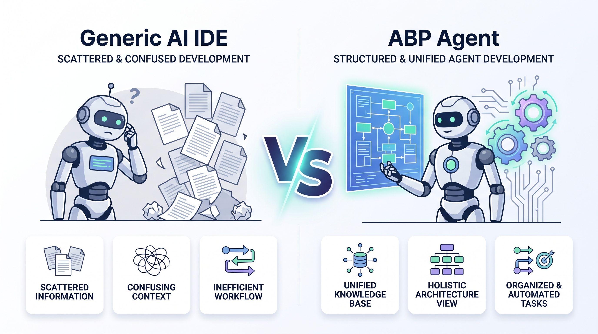

# ABP Studio vs .NET Aspire, AI IDEs, and CRUD generators

You already have an IDE. You might already have Aspire. You might already have Cursor. The remaining question is how those tools handle ABP solution structure, modules, run profiles, and generated application code.

Teams compare [ABP Studio](https://abp.io/studio) with three neighbors. This is not an “IDE replacement” debate.

1. .NET Aspire, for describing distributed resources as code and watching them on a dashboard.
2. Generic AI IDEs (Cursor, GitHub Copilot, Claude Code), for repo-wide chat and file edits.
3. CRUD scaffolders, such as `dotnet aspnet-codegenerator` and visual Blazor builders (for example Radzen).

Those tools are good. Keep Visual Studio, Rider, or VS Code. Studio can [open the solution in them](https://abp.io/docs/latest/studio/solution-explorer). This article is about what the ABP workflow brings together in one environment: templates, module graph, Solution Runner (Studio’s tool for starting, stopping, and inspecting applications), the ABP Agent, and [ABP Suite](https://abp.io/suite) (including React).

## TL;DR

Choose ABP Studio when the work is ABP: solution shape, module graph, Solution Runner, AI Agent, and Suite CRUD (including React on modern solutions).

Keep Visual Studio, Rider, or VS Code beside it for refactor, tests, and language services.

Add .NET Aspire when you want resource-as-code and the Aspire dashboard. Studio does not forbid it; microservice templates can wire Aspire in.

Use a generic AI IDE as an extra editor if the team already lives there. Prefer the ABP Agent when the change needs modules, migrations, proxies, or live run telemetry.

Tables in this article follow [official ABP documentation](https://abp.io/docs/latest).

## If the bottleneck is ABP, not the C# file

Studio may be a suitable choice when your team is (or will be) on the ABP Platform and you want one place to:

- Scaffold production templates (including React Modern and Classic MVC / Blazor / Angular).
- Run many services, containers, and UIs from a [Solution Runner](https://abp.io/docs/latest/studio/running-applications) profile (the set of applications and services started together).
- Ask, plan, and implement with AI against modules, packages, migrations, and live telemetry.
- Generate layered CRUD with ABP Suite for MVC, Blazor, Angular, and React.

If you only need a general editor, keep using your IDE. If you only need container orchestration and OpenTelemetry locally, Aspire may already be on the machine. Add Studio when the solution graph and ABP conventions are the bottleneck, not the C# file.

## What actually sits next to Studio

| Capability | ABP Studio + Agent | .NET Aspire | General AI IDEs (Cursor, Copilot, Claude Code, …) | Visual Studio / Rider / VS Code |
|---|---|---|---|---|
| Role | ABP solution lifecycle + AI coding in context | Cloud-native orchestration, service discovery, dashboard | Repo-wide AI edit / chat / agents | General-purpose IDE |
| ABP / DDD structure in context | Solution, modules, packages, run profiles in the [agent system context](https://abp.io/docs/latest/studio/ai-agent) | Unaware of ABP modules | Files and text; no ABP module graph | Solution explorer of projects, not ABP modules |
| ABP-shaped artifacts | Suite generates entity, app service, DTOs, repository, and UI; Agent follows those module conventions | No | Generic C# unless you prompt every ABP convention | Language services only |
| Production ABP templates | Layered, modular, microservice; Modern React or Classic UIs | Minimal host templates for Aspire | None | `dotnet new` / ABP CLI if you add it |
| Run + monitor | [Solution Runner](https://abp.io/docs/latest/studio/running-applications): start/stop apps and containers, HTTP requests, exceptions, logs, events, browse UI | Aspire dashboard: resources, logs, traces, metrics | Shell / terminal processes | Multi-project debug |
| AI that can build, migrate, generate proxies | Agent mode: files, shell, [Studio tools](https://abp.io/docs/latest/studio/ai-agent-built-in-capabilities) (`dotnet_build`, `start_applications`, `generate_csharp_proxies`, `get_exceptions`, …), MCP | Not an ABP coding agent | Shell-wrapped `dotnet` if you teach it | Copilot in the editor (generic) |
| Kubernetes | Studio Kubernetes integration for ABP solutions | Publish / deploy story for Aspire apps | No | No (unless you add tools) |
| Code edit / refactor | Agent writes code; Open with your IDE for deep refactor | Not an editor | Strong | Strongest language tooling |
| Use together? | Yes, open IDE from Studio; optional Aspire integration | Yes with ABP microservice template | Yes as an extra editor | Yes; Studio launches them |

How to read the table: these tools stack. Studio does not replace Rider's refactorings or Aspire's resource model. Its differentiated value is the ABP-aware workflow across solution structure, modules, run profiles, and agent tools.

Kubernetes. Studio’s Kubernetes integration is for developing against a cluster (browse and health using service names from the run profile). It is not Helm, GitOps, or your production deploy pipeline.

## The ABP Agent vs “just ask Cursor”

Cursor and Copilot are excellent at finishing a LINQ query or explaining a regex. That is not the argument.

Ask a generic AI IDE: "Add a Product entity, make it multi-tenant, add the EF Core migration, generate the React UI." A generic AI IDE can work effectively when it has sufficient repository context and explicit project conventions. ABP Studio's differentiated value is that solution, module, run-profile, and telemetry context are available through first-class Studio capabilities. For cross-layer ABP changes, this can reduce the amount of context and manual coordination the developer must provide.

[ABP Studio AI Agent](https://abp.io/docs/latest/studio/ai-agent) is not limited to the currently open text buffer. The session can use the solution, modules, packages, runnable apps, run profile, AI scope, and enabled tools. [ABP Suite](https://abp.io/suite) remains the CRUD generator, while the Agent is designed to work with the module graph, add a migration, start the profile, and inspect live exceptions.

Modes:

- Ask, read-only answers. Can search ABP documentation.
- Plan, read-only implementation plans.
- Agent, read/write files, shell, add migrations, run Studio tools, MCP, update plan steps.

The ABP Agent fits changes where module, solution, and runtime context should remain available throughout the work.

That is the difference versus a generic AI IDE:

| What you ask | ABP Agent | Generic AI IDE |
|---|---|---|
| “Add an app service following ABP layering” | Receives solution, module, and ABP documentation context through Studio | Works from the repository context and instructions provided to it |
| “Why did this HTTP call fail?” | `get_requests` / `get_exceptions` / `get_logs` on the running profile | You paste a log or attach a debugger |
| “Generate C# / Angular proxies” | First-class Studio tools | A shell command if the model guesses it |
| “Start the apps, then continue” | `start_applications` / `start_containers` | Terminal + wait |
| Scope | AI scopes limit which modules the agent may touch; `.abpignore` blocks secrets | Works from the repository context and instructions provided to it |

You still review the diff. Agent mode is execution with a permission boundary, not unsupervised production deploys.

The [privacy boundary](https://abp.io/docs/latest/studio/ai-agent) is the session you give it: files, prompts, Studio tool output, attachments, and allowed URLs. Privacy depends on the selected model, configured provider, accessible scope, and enabled tools. [`.abpignore`](https://abp.io/docs/latest/studio/ai-agent-configuration) prevents excluded files from entering the agent context.

## Why Aspire does not replace Studio (they stack)

[Solution Runner](https://abp.io/docs/latest/studio/running-applications) is how you run an ABP modular or microservice tree: profiles per team, folders for apps/gateways/services, C# hosts, CLI tasks (for example Angular), Docker containers, start/stop/build, browse, health, and live HTTP / exception / log / event views.

.NET Aspire is how many .NET teams describe distributed resources as code and watch them on a dashboard (OpenTelemetry, containers, connection strings).

Their responsibilities overlap around local orchestration, but their primary scopes are different. Aspire focuses on distributed resource orchestration, while ABP Studio adds ABP solution templates, module workflows, Suite, and the ABP Agent.

You do not have to pick one. ABP microservice templates can enable Aspire so AppHost starts infrastructure and services; you can still use Studio’s runner and Agent. See [Aspire integration](https://abp.io/docs/latest/solution-templates/microservice/aspire-integration).

Pairing ABP Studio with Aspire works well when ABP solution workflows and distributed resource orchestration are both needed.

## Suite: a CRUD slice, not a pretty grid

[ABP Suite](https://abp.io/docs/latest/suite) generates a CRUD slice of an ABP application from an entity: domain type, repository, application service, migration, UI, tests, navigation properties, multi-tenant flag, localization keys.

| | ABP Suite | `dotnet aspnet-codegenerator` / EF scaffolding | Visual Blazor app builders (for example Radzen) |
|---|---|---|---|
| Output | Entity through application layer + UI + optional tests | Controllers, Razor Pages, Blazor CRUD, or Minimal API endpoints against a DbContext | Blazor UI + data wiring from a database or REST source |
| UI stacks | MVC, Blazor (Blazorise or MudBlazor, detected), Angular, and React (modern solutions) | MVC views, Razor Pages, and Blazor components. No Angular. No React. | Blazor only (Server, WebAssembly, Auto) |
| ABP permissions, tenancy, audit base classes | Options on the entity ([CRUD generation](https://abp.io/docs/latest/suite/generating-crud-page)) | Does not use ABP permission and tenancy conventions | Does not use ABP permission and tenancy conventions |
| Custom code on regenerate | Customizable code [hook points](https://abp.io/docs/latest/suite/customizing-the-generated-code) for MVC, Blazor, and Angular; React pages require extra care when regenerated | Often requires manually preserving custom changes | Varies by product |
| React UI | Yes, template-based CRUD for modern React apps, including search, paging, validation, permissions, localization, and navigation properties. Registers routes and menu | No React generator in the official scaffolding set (`blazor`, `razorpage`, `view`, `controller`, `identity`, `minimalapi`) | Blazor-focused rather than React-based |

Suite supports the official web UI stacks, including React. [ABP Agent](https://abp.io/docs/latest/studio/ai-agent) is an extra path when you want AI to evolve those pages, not a substitute for Suite React output.

Suite is a fit when generated CRUD should follow the application's ABP layers, conventions, and selected UI stack.

## When Studio is the right tool in the stack

Choose ABP Studio when the work is ABP: new solution shape, module graph, run profiles, Kubernetes-connected browse, Agent that can migrate and generate proxies, Suite for CRUD.

Keep your IDE open beside it for refactor, tests, and language services. Studio expects that.

Add Aspire when you want resource-as-code and the Aspire dashboard. Studio does not forbid it.

Use a generic AI IDE as an extra editor if your team already lives there. Prefer Agent for ABP-structured changes so the model is not guessing module boundaries from filenames.

Studio works best when ABP-specific solution workflows complement your existing IDE.

## FAQ

### We already run .NET Aspire (AppHost + dashboard). What does Studio still do that Aspire does not?
Aspire models resources (projects, containers, connection strings, OpenTelemetry) as code. Studio models an ABP solution: modules, package installation, production templates, Suite, Kubernetes browse for ABP services, and an agent that can migrate and generate proxies. Their responsibilities overlap around local orchestration, but their primary scopes are different. You can keep AppHost; microservice templates can integrate Aspire. You do not need to replace Aspire with Studio.

### If the team already uses Cursor or Copilot on the same repo, when is ABP Agent the better tool for a task?
When the task needs ABP structure or a live run, not only a file edit: module/package scope, `generate_csharp_proxies` / `generate_angular_proxies`, `start_applications`, or `get_exceptions` / `get_requests` / `get_logs` against the [Solution Runner](https://abp.io/docs/latest/studio/running-applications) profile. Generic IDEs can work in the same repository when given the relevant context and conventions. Agent provides first-class access to module, run-profile, and Studio tool context for changes that coordinate ABP modules and running services.

### After Suite generates React CRUD, how should we customize the page?
For MVC, Blazor, and Angular, use Suite’s [customizable code](https://abp.io/docs/latest/suite/customizing-the-generated-code) hook points. React pages require extra care when regenerated, so keep additional React UI in files Suite does not generate or evolve it with [ABP Agent](https://abp.io/docs/latest/studio/ai-agent). Suite React generation itself is template-based, not AI.

### Can Agent start the microservice profile, then use real HTTP/exception data in the same session?
Yes, in Agent mode with a run profile: tools include `start_applications` / `start_containers` and then `get_requests`, `get_exceptions`, `get_logs`, `get_events` ([built-in capabilities](https://abp.io/docs/latest/studio/ai-agent-built-in-capabilities)). Ask/Plan cannot mutate or start apps. If nothing is running, those telemetry tools have nothing to read. That is why “AI that sees production-like local traffic” is a Studio and Runner loop, not a chat sidebar.

### Does Studio Kubernetes integration replace Helm, GitOps, or our cluster deploy pipeline?
No. It is for developing against a cluster (browse/health using Kubernetes service names from the run profile, manage connected services). Aspire’s publish story and your CI remain how you ship. Do not treat the Studio K8s panel as the production deployment product.

### Can one developer live in Rider and another in VS Code while sharing the same Studio solution?
Yes. Studio holds solution/run-profile metadata; [Open with](https://abp.io/docs/latest/studio/solution-explorer) launches whatever IDE is installed. Run profiles and Agent sessions are not tied to a single editor vendor. The constraint is ABP Studio itself on the machine, not a mandate to abandon Rider or VS.

## Next step

[Download ABP Studio](https://abp.io/studio) · [AI Agent docs](https://abp.io/docs/latest/studio/ai-agent) · [Generate a CRUD page](https://abp.io/docs/latest/suite/generating-crud-page) · [ABP Framework](https://abp.io/framework)

### Sources

- [ABP Studio overview](https://abp.io/docs/latest/studio)
- [AI Agent](https://abp.io/docs/latest/studio/ai-agent)
- [AI Agent built-in capabilities](https://abp.io/docs/latest/studio/ai-agent-built-in-capabilities)
- [Solution Runner](https://abp.io/docs/latest/studio/running-applications)
- [Solution Explorer / Open with IDE](https://abp.io/docs/latest/studio/solution-explorer)
- [ABP Suite](https://abp.io/docs/latest/suite)
- [Generating a CRUD page](https://abp.io/docs/latest/suite/generating-crud-page)
- [Customizing the generated code](https://abp.io/docs/latest/suite/customizing-the-generated-code)
- [ASP.NET Core `aspnet-codegenerator`](https://learn.microsoft.com/en-us/aspnet/core/fundamentals/tools/dotnet-aspnet-codegenerator)
- [.NET Aspire overview](https://learn.microsoft.com/en-us/dotnet/aspire/get-started/aspire-overview)
- [Radzen Blazor Studio](https://www.radzen.com/blazor-studio/)
- [Microservice Aspire integration](https://abp.io/docs/latest/solution-templates/microservice/aspire-integration)

Product names in this article belong to their owners. Mention is for identification in a technical comparison, not affiliation or endorsement.
