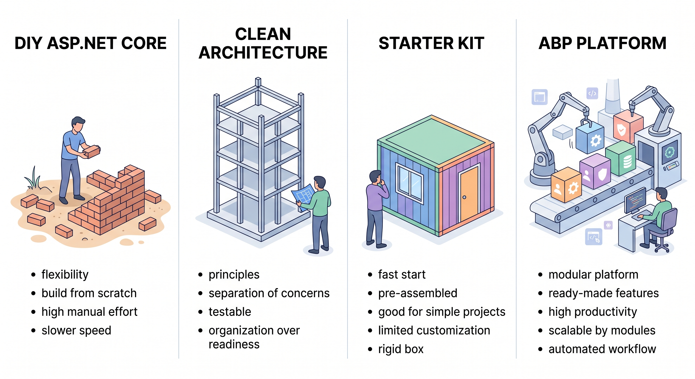

# ABP vs Clean Architecture templates, starter kits, and DIY ASP.NET Core

Every serious .NET team hits the same whiteboard sooner or later. Do we build the multi-tenant SaaS from scratch? Grab a starter kit? Adopt a platform?

Search “ABP vs …” and you will land on pages written by kits and tenancy libraries. Fair. Those pages exist because the question is real. They are not comparing two products of the same kind.

You are choosing among four shapes:

1. Build it yourself on ASP.NET Core, often with a tenancy library such as Finbuckle.MultiTenant.
2. A Clean Architecture template (Jason Taylor, Ardalis) that gives you folders, layers, and a sample feature.
3. A starter kit that copies a snapshot of production modules into your repo (fullstackhero, Brick, and similar kits).
4. A maintained application platform. Architecture, infrastructure, modules, and tools that keep moving.

ABP competes across several decision categories rather than against one uniform product set. Some teams compare it with Clean Architecture and DDD references or starter kits because they prefer to own and assemble the application foundation themselves. Others evaluate .NET application and service frameworks such as ServiceStack, model-driven RAD platforms such as DevExpress XAF, or cross-stack SaaS platforms and starter kits. Existing ASP.NET Boilerplate applications are usually a migration and adoption consideration rather than a same-generation alternative. The table below focuses on the architecture and application-foundation decision; these other categories can still enter the same broader technology discussion.

[ABP](https://abp.io) takes the application-platform approach. The rest of this article is about the things teams evaluate later: multi-tenancy, identity, permissions, modularity, UI (including React), and a path from modular monolith (one deployable application organized into independent modules) to microservices.

## TL;DR

Choose ABP when you are shipping a long-lived, multi-tenant, modular .NET product and want a maintained platform: tenancy, identity, modules, official UIs (including React), and Studio / Suite on the same stack.

Choose a Clean Architecture template (Jason Taylor, Ardalis) when the goal is to own every architectural decision from a well-named skeleton.

Choose a starter kit (fullstackhero, Brick, and similar) when you prefer a copy of modules in your repo on day one and you are willing to maintain that snapshot.

Choose Finbuckle (or custom tenant middleware) when tenant resolution is the only additional capability you need on an app you already own. ABP also connects tenancy with application concerns such as identity, permissions, and audit.

Tables in this article follow [official ABP documentation](https://abp.io/docs/latest).

## This is for the long haul

ABP is the recommended choice when you are building a long-lived, multi-tenant, modular .NET product. B2B SaaS. Line of business. A platform several teams will still be extending in a few years.

You want:

- Cross-cutting concerns (auth, tenancy, audit, jobs, localization) already solved and documented.
- Official UI options that match your team: React, Angular, Blazor, MVC, MAUI, or React Native.
- A way to add pre-built modules and, later, split a module into a service without rewriting the application code.
- Tooling (Studio, Suite, CLI) and, if you need it, commercial modules and support, without leaving the same platform.

Yes, ABP is opinionated. The initial learning cost is real: teams need to understand modules, application services, and unit of work conventions before those conventions become productive. Then, when a module needs to become a microservice, the contracts are already there. The conventions become team-wide standards so the next project does not invent a second way to do the same thing.

## Four shapes. One table.

| Capability | ABP Platform | DIY ASP.NET Core | Clean Architecture templates (Jason Taylor, Ardalis) | Starter kits (fullstackhero, Brick, and similar) |
|---|---|---|---|---|
| What you get | Maintained framework + modules + templates + tooling | Empty host and libraries you assemble | Layered/CQRS skeleton + a sample feature | A copy of modules in your repo on day one |
| Multi-tenancy | Native: [single database, database-per-tenant, or hybrid](https://abp.io/docs/latest/framework/architecture/multi-tenancy); identity and authentication/token infrastructure wired for tenants | You design isolation, filters, and cache keys, or add a library such as Finbuckle.MultiTenant | Not included | Often via a tenancy library you still own end-to-end |
| Identity, permissions, audit | Application modules + automatic tenant-data filtering, [audit logging](https://abp.io/docs/latest/framework/infrastructure/audit-logging), permission system | You compose Identity, policies, and audit yourself | Identity sample at most | Bundled in the kit; you maintain the fork |
| Modularity | First-class [module system](https://abp.io/docs/latest/framework/architecture/modularity/basics); install/uninstall packages | You invent module boundaries | Folders and layers, not a product module catalog | Modular folders; upgrades are merge/cherry-pick |
| UI | [React (Modern)](https://abp.io/docs/latest/framework/ui/react), MVC, Blazor, Angular, [React Native](https://abp.io/docs/latest/framework/ui/react-native), [MAUI](https://abp.io/docs/latest/framework/ui/maui) | You pick and integrate | Template-specific (often Angular/React/API) | Kit-specific (often one SPA) |
| Monolith → microservices | Same application contracts; HTTP/C# proxies replace in-process calls | You design the split | You design the split | Extract-a-module if the kit allows it |
| Tooling | [ABP Studio](https://abp.io/studio) (including AI Agent), [ABP Suite](https://abp.io/suite), CLI | `dotnet` CLI and your IDE | Template CLI + IDE | Kit CLI / Aspire host, varies |
| How it evolves | NuGet upgrades for the framework and modules, plus documented migrations | You upgrade every library | You copy the next template over your tree | You merge upstream into source you already customized |
| Support | Open-source core plus commercial extras and vendor support | Your team | Community | Community |

ABP may be a suitable fit when the application needs architecture, infrastructure modules, and development tooling to remain integrated and maintainable as the product grows.

How to read the table: templates teach structure. Starter kits give you a snapshot you own. ABP combines application architecture, infrastructure modules, and development tooling in one platform. Names in the headers are examples of the category, not a review of every repository.

Identity, permissions, and audit. ABP ships these as application modules: permission UI, automatic filtering of tenant data, and audit logging. On plain ASP.NET Core you compose Identity, policies, and audit yourself. A Clean Architecture template usually stops at an Identity sample. A starter kit may bundle them; you then maintain that copy.

How the stack evolves. When a customized starter kit is updated, identity and tenancy code may already contain local changes. Reconciling those changes across the files you now own can add significant maintenance work. That is a different upgrade model from updating framework packages.

ABP uses framework and module packages, together with documented migrations. A Clean Architecture template’s next version is something you copy forward. A kit’s next version is reconciled with the snapshot you already changed.

## Let’s be honest: what are you actually downloading?

### What you build yourself

ASP.NET Core is phenomenal. It is a foundation, not a complete application platform. Building from scratch gives teams maximum control, but also leaves tenant resolution, permission checks, audit logs, job plumbing, and module boundaries to the team.

That work is legitimate if the architecture is unique. For a standard business product, it is infrastructure before the first domain feature.

ABP sits on ASP.NET Core. You keep the Microsoft stack. ABP provides established conventions and modules for teams that prefer those decisions to be part of the platform. See [Why ABP Platform](https://abp.io/docs/latest/others/why-abp-platform).

ABP suits teams that want application infrastructure to remain integrated with the product as it grows.

### Clean Architecture templates

This category includes the templates most often compared with ABP: Jason Taylor’s Clean Architecture template and Ardalis’s Clean Architecture template. They provide a good classroom and a clean slate. Their focus is architectural structure and ownership rather than a built-in application module catalog or ABP-specific tooling.

Choose a Clean Architecture template when architectural ownership and a focused starting point matter most.

ABP is a fit when architectural conventions and application modules need to evolve together.

### Starter kits

A starter kit copies identity, tenancy, auditing, and a few domain modules into your repository. You own every line. That is a real preference for some teams.

Starter kits are another common option in this decision. fullstackhero is a copy-and-own MIT kit (identity, tenancy, React admin, modules in your repo). Other starter kits, such as Brick, can also provide a prebuilt starting point; the exact features, ownership model, and update process depend on the kit. They can provide a fast starting point, but long-term maintenance depends on how each kit handles updates to customized code.

With ABP, framework and module updates are distributed through packages and documented migrations. With a kit, teams have direct ownership of the source, while updates may require reconciling local changes with upstream code. These are different maintenance models.

Choose a starter kit when an existing set of application features and direct source ownership can accelerate your team.

Choose ABP when you want those application concerns, modules, and tooling to evolve as part of a maintained platform. ABP’s open-source core is yours to use; your business code lives in your repo. There is no separate proprietary runtime for that core. Commercial extras (themes, Pro modules, Suite, support) are optional layers on the same platform, not a rewrite.

Package-based framework and module updates may suit teams that prefer them to reconciling changes in an owned source snapshot.

## If you last looked a year ago: React is official

This is easy to miss if you last looked at ABP a year ago.

Official UI options ([ABP UI](https://abp.io/docs/latest/framework/ui)):

- React, in the [Modern template system](https://abp.io/docs/latest/solution-templates/modern-vs-classic) (ABP Studio or `abp new --modern`).
- MVC / Razor Pages, Blazor (WebAssembly, Server, WebApp), and Angular, on Classic templates.
- React Native and MAUI for mobile / hybrid.

[Modern vs Classic](https://abp.io/docs/latest/solution-templates/modern-vs-classic): Classic is not a deprecated track. It is the actively supported family with the broadest UI matrix (MVC, Angular, Blazor, MAUI) and the template-first Studio flow. Modern is the newer architecture-first Studio flow, React (or no UI), and the Admin Console / Low-Code path (metadata-driven screens configured through a designer). Choose Classic when the team’s UI is MVC, Angular, or Blazor. Choose Modern when the web UI is React.

One backend, the UI your team already knows.

## Multi-tenancy without a side project

ABP treats tenancy as infrastructure, not a feature you bolt on:

- Current tenant is resolved per request.
- Entities implementing `IMultiTenant` (ABP’s contract for separating tenant-owned data) are automatically filtered; new records get a `TenantId` identifying the tenant.
- You can use one database for all tenants, one database per tenant, or a hybrid.

That isolation also applies to cache and related concerns so business code stays mostly tenancy-agnostic. Details: [Multi-Tenancy](https://abp.io/docs/latest/framework/architecture/multi-tenancy).

A tenancy library on raw ASP.NET Core, including Finbuckle.MultiTenant, can resolve the tenant. It does not automatically give you permission UI, audit, jobs, Identity/OpenIddict authentication and token wiring for tenants, and module installs on the same model. That is the platform difference. Pages titled “Finbuckle vs ABP vs custom” are answering a library question. This article is answering the application-platform question.

ABP is worth considering when tenancy needs to stay connected to identity, permissions, data filtering, and the rest of the application model.

## Modularity that can become microservices

ABP modules are real packages (domain, application, HTTP API, UI) with documented dependency rules. You can start with a [modular monolith](https://abp.io/architecture/modular-monolith) and later replace in-process calls with HTTP using the same application service contracts and [client proxies](https://abp.io/docs/latest/framework/api-development/dynamic-csharp-clients) (typed clients that call application services over HTTP).

That path is the point. You do not throw away the monolith to “do microservices”; you change the hosting of a module that already had a boundary.

This approach fits teams that want modular boundaries to support both a modular monolith and a later service split.

## ABP Low-Code: admin screens inside the same app

[ABP Low-Code](https://abp.io/docs/latest/low-code) is a module in your ABP application (Team license or higher). You model entities, pages, forms, permissions, and scripts in the Admin Console. The runtime uses that metadata in the same app, with the same identity, audit, and EF Core model. There is no separate low-code database.

Designer, [Studio AI Agent](https://abp.io/docs/latest/studio/ai-agent), and hand-written C# / Script API land on one model.

The documented runtime UI is React. You can still keep MVC, Razor Pages, Angular, or Blazor as the main UI and host the React Low-Code runtime beside it ([non-React integration](https://abp.io/docs/latest/low-code/non-react-ui-integration)).

Docs still label the system Preview (APIs and designer may change before GA). That is a maturity label, not a missing product.

| | ABP Low-Code | External low-code platform | Hand-written CRUD every time |
|---|---|---|---|
| Where it runs | Inside your ABP app | Separate product / runtime | Your repo |
| Data and identity | Same database and ABP authorization | Often a parallel model | Whatever you build |
| Extend with code | C#, Script API, Agent | Platform limits | Always code |
| Screens | Grid, form, calendar, kanban, gallery, dashboard, import/export | Vendor widgets | Custom pages |
| How you enable it | Studio modern wizard (layered, single-layer, modular monolith + EF Core) or [add to an existing EF Core solution](https://abp.io/docs/latest/low-code/add-to-existing-solution) | Vendor onboarding | Always code |

Studio’s *new-solution wizard step* is omitted for microservice architecture and when MongoDB is selected, because runtime-managed tables use EF Core. Layered and modular-monolith EF Core solutions are the documented enablement path today.

Use Low-Code for the admin CRUD and metadata-driven screens. Keep distinctive product UX in normal ABP UI, including Suite-generated React CRUD on modern solutions.

## When this is the right call

Pick ABP when:

- The product will have tenants, roles, audit, and more than one team.
- You want React *or* Blazor *or* Angular *or* MVC on a shared backend.
- You expect to grow from modular monolith to services without a rewrite.
- You want Studio, Suite, and (optionally) Low-Code on the same stack.

A Clean Architecture template is a solid choice when architectural ownership and a focused starting point matter most.

A starter kit is a solid choice when an existing set of application features and direct source ownership can accelerate your team. ABP is a better fit when those application concerns, modules, and tooling should evolve as part of a maintained platform.

ASP.NET Boilerplate is the predecessor, not a same-generation starter kit. If that is the comparison, it is a migration to the current ABP platform, not a fork-and-own kit decision.

DevExpress XAF and similar commercial frameworks follow a model-driven RAD approach built around a vendor UI ecosystem. That approach can reduce application boilerplate and accelerate internal business applications, while also placing the application’s model and much of its UI experience within DevExpress conventions and controls. ABP is an application platform on ASP.NET Core, with an open-source core, modular architecture, and multiple UI options. It gives teams more direct control over the application layers and frontend choices, including MVC, Blazor, Angular, and React, while supporting a modular-monolith-to-microservices path. XAF may be the better fit when the priority is delivering a model-driven business application quickly within the DevExpress ecosystem. ABP may be the better fit when the product needs ASP.NET Core, a more customized frontend experience, multiple client options, or a modular architecture that can evolve toward services.

## FAQ

### Is ABP free or commercial?
ABP Framework has an open-source core. Some themes, modules, generators, Studio capabilities, support, and other commercial offerings require an appropriate commercial license. Exact availability depends on the product and license level.

### If we stop paying for commercial extras, or we leave ABP later, is the app a black box?
No. The application is still ASP.NET Core, your C#, and EF Core (or MongoDB). The [open-source framework](https://abp.io/docs/latest/others/why-abp-platform) stays in the solution as packages you already reference. Leaving ABP means replacing those packages the way you would replace any framework, not extracting code from a closed runtime. Suite output is source in your repo. Commercial modules, themes, and Suite itself are optional layers; dropping them does not delete your domain.

### If we already have a Clean Architecture or starter-kit repo (Jason Taylor, Ardalis, fullstackhero, Brick), can we “just add ABP” like a NuGet?
No. ABP’s module pipeline, interceptors, automatic tenant-data filters (which limit queries to the current tenant), and startup conventions assume it is the host. Teams adopt ABP on a new solution (or plan a migration), they do not drop `Volo.Abp.*` onto an existing CA template and keep the old composition root unchanged. That is the real cost versus a tenancy library you add to code you already own. See [Why ABP Platform](https://abp.io/docs/latest/others/why-abp-platform).

### We already use Finbuckle (or custom tenant middleware). What does ABP tenancy still do that that library does not?
A tenancy library resolves *who the tenant is*. ABP also isolates queries and inserts (`IMultiTenant` data filters), wires Identity and OpenIddict for tenants, and applies the same tenant context to cache and related infrastructure. That covers [single database, database-per-tenant, or hybrid](https://abp.io/docs/latest/framework/architecture/multi-tenancy). Permissions, audit, and jobs then run inside that model instead of each being a separate integration project.

### If we start Modern/React, can the same backend later serve a second UI (public MVC, partner Blazor, mobile)?
Yes. Application services and HTTP APIs are UI-agnostic. [Official UIs](https://abp.io/docs/latest/framework/ui) (React, Angular, Blazor, MVC, React Native, MAUI) are hosts on that backend. You choose Modern vs Classic at solution creation for the primary web app; extra clients consume the same APIs. You do not rewrite domain or application layers to add a second frontend.

### When we split a module into a microservice, do we rewrite application services as controllers?
Not as the default path. Module contracts stay; in-process calls become HTTP (or messaging) via [client proxies](https://abp.io/docs/latest/framework/api-development/dynamic-csharp-clients) against the same application-service interfaces. You change hosting, not the feature’s application API. That is the comparison point versus a starter kit whose “modules” are folders with no proxy story.

### For the same admin entity, should we use Suite-generated React CRUD or Low-Code pages?
[Suite](https://abp.io/docs/latest/suite) writes source into your layers (entity, app service, UI, tests) that you commit and customize, including React on modern solutions. [Low-Code](https://abp.io/docs/latest/low-code) keeps the entity in metadata (designer + runtime APIs/pages) without generating those classes for the standard flow. Use Suite when the screen will grow into product code; use Low-Code when the screen should stay designer-driven. They are not substitutes for each other.

### Can we keep MediatR / vertical-slice handlers for new features inside an ABP solution?
You can reference extra libraries, but ABP’s default application surface is [application services](https://abp.io/docs/latest/framework/architecture/domain-driven-design/application-services) with unit of work, validation, and authorization conventions. Comparison with CA templates is not “MediatR vs nothing”; it is whether the team standardizes on ABP’s application layer or on a handler-per-feature folder as the public API. Mixing both without a rule usually duplicates the same use case in two styles.

## Next step

Create a solution in [ABP Studio](https://abp.io/studio) and pick Modern (React) or Classic (MVC / Blazor / Angular). Then add only the modules you need.

[Create a free ABP solution](https://abp.io/studio) · [Read the framework overview](https://abp.io/framework) · [Why ABP Platform](https://abp.io/docs/latest/others/why-abp-platform)

### Sources

- [ABP UI options](https://abp.io/docs/latest/framework/ui)
- [Modern vs Classic templates](https://abp.io/docs/latest/solution-templates/modern-vs-classic)
- [React UI](https://abp.io/docs/latest/framework/ui/react)
- [Multi-tenancy](https://abp.io/docs/latest/framework/architecture/multi-tenancy)
- [Why ABP Platform](https://abp.io/docs/latest/others/why-abp-platform)
- [Low-Code System](https://abp.io/docs/latest/low-code)
- [Jason Taylor Clean Architecture template](https://github.com/jasontaylordev/CleanArchitecture)
- [Ardalis Clean Architecture template](https://github.com/ardalis/CleanArchitecture)
- [fullstackhero starter kit](https://github.com/fullstackhero/dotnet-starter-kit)
- [Finbuckle.MultiTenant documentation](https://www.finbuckle.com/MultiTenant/Docs)
- [ServiceStack documentation](https://docs.servicestack.net/why-servicestack)
- [DevExpress XAF overview](https://www.devexpress.com/products/net/application_framework/)

Product names in this article belong to their owners. Mention is for identification in a technical comparison, not affiliation or endorsement.
