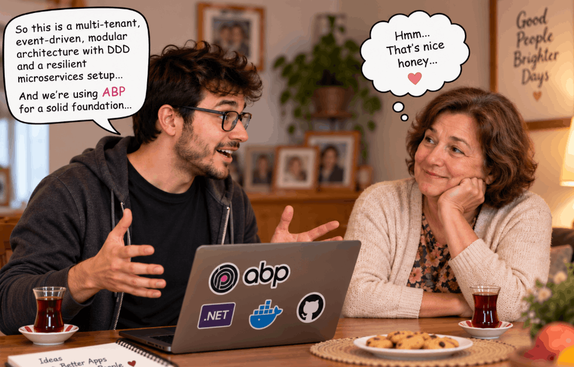
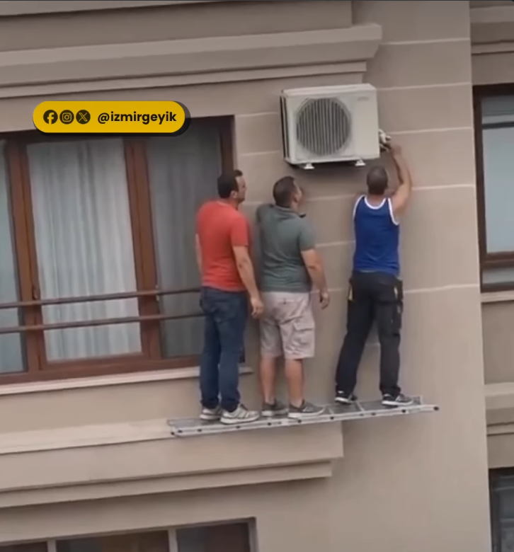
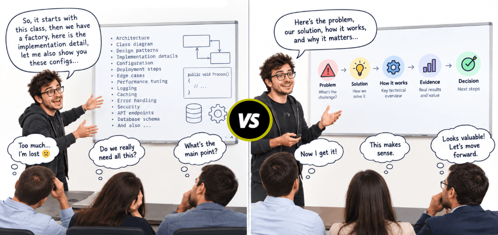
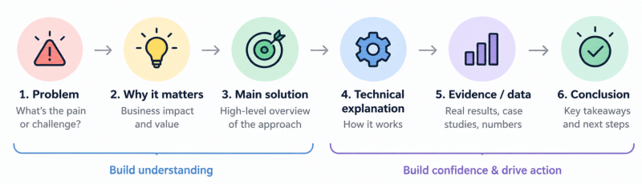

# How to Present  Your .NET Project To Your Mother?

**I'm writing this article while camping in the middle of the forest 🌲⛺.** I came here to get away from computers for a while... but apparently, I'm still thinking about software and how we explain it to people. You can see me in the cover image 😄

Hey there! I'm Alper, giving international conference talks and mostly I don't know the audience demography (knowledge level/position/tech stack etc...). And I need to be very careful how I present my talk. Recently I've been studying on this topic. My audience is mostly developers or IT guys. And when I explain a technical topic to those people, I'm very comfortable 🤠🤠 But, sometimes we need to explain what we do (our project) to our friends, mother or child. In other words; anyone who is not technical. Then things are getting a little bit different and harder 🤯

To have a strong technical knowledge does not automatically make someone a good communicator. 
For scientists, engineers, developers and technical leaders, the real challenge is not knowing the subject 👉 **deciding what the audience needs to know and how to make it meaningful for them.**

Empathy is very important in all our life steps. I wrote an article about [empathy in workspace](https://abp.io/community/articles/empathy-in-the-workplace-for-software-companies-wsjjw9we), please read it when you have time because it's also important for this topic. Imagine you are explaining your .NET project to an investor or customer, concepts which you use in your project might be simple for you, but feel that empathy (please) for a moment, **does that guy understand what you mean**? Before starting your presentation collect information about him so that you can adjust your sentences according to him. 

> AND TELL HIM ONLY WHAT WORKS FOR HIM.

No need to tell how the algorithm behind this project works! Tell him why it's good for him. From now on, when I tell "him/his" I mean the customer / investor / friend / father / son / non-IT guy.

---

## Don't Focus Too Much on the Details

We are all good software engineers and we want to show the art behind that work 👏 That's absolutely natural feeling 👍
We all want to show people the details how our project work because we are proud of it and that's a bad practise!!
Too much detail will definitely hide your main message!!! You are consuming his energy, focus and time with all those details. 
So what happens, your main goal is not being transferred to him 🤔..💭...🥺

Ok we know the problem, now how will you fix this? SIIMMPLEE: Before mentioning a topic, ask yourself: 

> Does he need this info to understand my idea or make his decision?

If not, please save it for yourself and don't mention about that. 
Maybe later, if he's very much interested in you can explain him (IF ONLY he asks 😄)

---

## Don't Make It Too Simple Also *-- are you kidding me!*

Well! Don't be angry 😡 at me. In the previous section I said *don't go in details* and now I'm telling **do not explain too simple** 🙃
While we are trying to not make it too complicated or detailed, we shouldn't make it inaccurate or treating the listener as idiot🐑 

Keep the science and technical meaning balanced. Let's reduce unnecessary software jargons. Use clear language, examples and familiar concepts when you explain something complex. 
**My technique is using analogies**, especially for my projects I often give a car example which is as simple as everybody can easily understand (*even my kid understands it*). 

> MAKE IT SIMPLE, but NOT OVER-SIMPLE!

---

## Start With Why It Matters

In Turkey, there are some street sellers... They stop you and say "Can I tell you something?". Actually I know he's a seller and probably he'll redirect me to a barber, cosmetic store or some shops which are upper floors in a passage. And I mostly say "NO!" and I'm walking my way... But imagine if he tells me first which benefit I'll get from what he sells, maybe I'll go to his shop. (*this paragraph is also explaining my topic in a simple way which I explained in the previous section so I'm still using these techniques in this article* 🤫)

One of the most common mistakes in technical presentations is starting with the technology itself. 

> Our project runs the Dijkstra algorithm with the multi-tenant and DDD architecture 🧑‍🔬

The above sentence doesn't mean anything to him. Tell it like this:

> Our project finds the shortest path efficiently, you can have many isolated customers with clean design and long years maintainable way.”

When people understand why your project matters, they'll have a reason to listen the next sections. 

So far, so good 💯 You did a good job reading until here 🙏 ᵗʰᵃᶰᵏᵧₒᵤ  ... Keep reading please ...👀...👇

---

## Think About What You Want Him to Remember

Your audience will not remember many technical points after your presentation. 
**They will remember 1-2 topics.** 
Decide what those points are 🎯 then build the presentation around them. 
Everything else must support those core messages. 

---

## Your Voice Tone Matters Too!

Imagine you did everything 👏 very good until here... but you are talking very monotonous way. Or you are talking quickly. Sorry, that's also not a good talk!  **Your emphasis, eye contact, body language, tone of voice are all important.** You can make small jokes to give him a relaxing break to understand your complex technical work. 

> COMMUNICATION IS NOT ONLY ABOUT WHAT YOU SAY but also HOW YOU SAY IT 🗣

Watch the [ShadeZahrai -very short- tiktok video](https://www.tiktok.com/@shadezahrai/video/7177549216464571650)

---

## Use Images to Make Your Subject Clear

Especially when you are presenting on slides, you should show some funny images related to your topic or you can show analogic images that explains the problem. 
For example to tell about a risky case which you covered in your project, you can use the below image :)
Yes, people will laugh at first but later they'll listen to you more carefully because you took their attention. (*I created another paradox here, I’m explaining this topic using a funny related image and I know you’re now reading my article more carefully*🤝)

---

## How to Handle Questions? 😡 Especially Which You Don't Like 

In technical presentations, people can ask aggressive or stupid questions or you may not like their questions 😡 
Don't immediately try to defend yourself by giving more and more technical details. Or don't try to show them it's a silly question.
If you don't know, tell it honestly. If that feature doesn't exist, tell that you took note and you'll evaluate it later. 
Even if it’s a stupid question, don’t shut him down. **Later, he will remember only that moment and all your efforts you’ve made will be lost.**

---

## Your Goal Is To Be Understandable 🫱🏽‍🫲🏻 Not Showing Everything You Know

Anddd again, we come back to empathy!

> The best technical explainer is not the person who gives the most information. 

Okay, you know a lot and you want to show that. But try to be empathetic again. Giving someone all the technical details doesn't mean they will understand your point.  **Good communication means sharing what matters in a way people can easily understand.**

> Don't tell people everything you know. Tell them what they need to know and please make sure they understand it.

---

## Explaining Something and Convincing Someone Are Not the Same 🙄

Providing accurate & correct information and persuading someone to take action are different. 
But in business life, **technical presentations often need to do both**. 
You need to explain how something works and also helping management approve a project.

YOU CAN USE THIS PATH WHEN PRESENTING YOUR PROJECT:

---

I appreciate you taking the time to read this article 🙏. 
I like to share what I learn which is the main reason I wrote this article.
By applying these techniques, we can become better presenters and communicate our ideas more effectively 👌. 
When we combine our technical strengths with strong soft skills, I believe we can make a greater impact, inspire others and grow together 🙌💪.

---

Alper Ebicoglu

Software architect since the early 2000s. Learning, inspiring, sharing, talking...

|||
| ------------------------------------------------------------ | ------------------------------------------------------------ |
|  | [linkedin.com/in/ebicoglu](https://www.linkedin.com/in/ebicoglu/) |
|  | [x.com/alperebicoglu](https://x.com/alperebicoglu)           |
|  | [alperonline.medium.com](https://alperonline.medium.com)    |
|  | [github.com/ebicoglu](https://github.com/ebicoglu)           |
|  | [abp.io/community/members/alper](https://abp.io/community/members/alper) |

