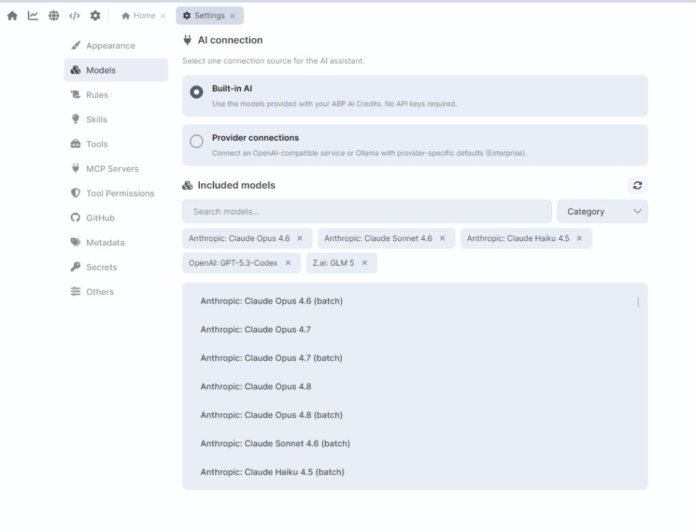
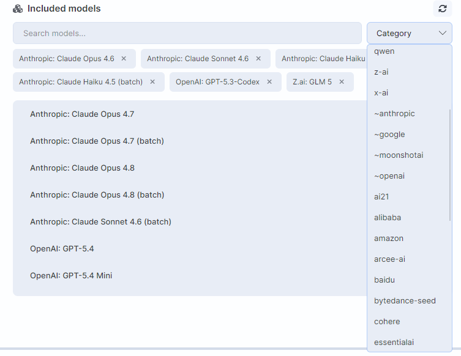

# BYOK: Use Your Own AI Models in ABP Studio

ABP Agent already lives inside ABP Studio and understands your solution: modules, permissions, DbContexts, run profiles, migrations, proxies, and runtime logs. Until now, it talked to models through **Built-in AI**; the catalog that comes with your ABP AI Credits. No API keys, no extra setup.

That is still the default, and it is still the fastest way to start.

Enterprise teams often cannot stop there. They already have an approved OpenAI, Azure OpenAI, or company gateway. They run Ollama on a developer machine. Their security policy says prompts and code context must stay on a private endpoint. They do not want a second AI bill on top of the one they already pay.

That is what **AI connection** is for. In **Settings → Models**, you choose one source for the assistant:

- **Built-in AI** ;models included with your ABP AI Credits. No API key required.
- **Provider connections** ;your own OpenAI-compatible service or Ollama, with your own keys (or no key at all for a local server).

Pick one. The agent then uses that connection for chat, tools, and the model picker at the bottom of the ABP Agent panel.



## Who can use this?

Using ABP Agent with **Built-in AI** is available on paid Studio editions where AI is enabled.

**Provider connections (bring your own LLM) is Enterprise-only.** Team, Business, Personal, Trial, and Community cannot activate it.

| License Type | Bring Your Own Key: Your own OpenAI / Ollama |
|---|---|
| Community | ❌ No |
| Team | ❌ No |
| Business | ❌ No |
| **Enterprise** | ✔ **Yes** |

On a Team (or any non-Enterprise) license, the Models page still shows Provider connections, but the option is locked. Clicking **Upgrade** opens the Enterprise upsell. If someone already saved a custom profile and later drops off Enterprise, Studio switches the active connection back to Built-in AI. Saved profiles are kept; they just cannot be the active connection until Enterprise is available again.

---

## How To Switch To The Bring Your Own Key Models

1. Open **File → Settings**.
2. Select **Models**.
3. Under **AI connection**, choose **Built-in AI** or **Provider connections**.

If you stay on Built-in AI, tick the models you want under **Included models**. Those are exactly the models offered in the chat picker. If the picker is empty, nothing is ticked here.

---

## Which LLMs can you use with Built-in AI?

Built-in AI does not require your own API keys. Studio loads a **live catalog** of coding-capable models, billed through **ABP AI Credits**. Use **Search models...**, the **Category** dropdown, and **Refresh models** to browse it.



Only a subset is ticked by default. Anything you tick here appears in the chat model picker. Models that fail coding-agent checks (too-small context, no tool support, expired, or over the price cap) are hidden.

### Shipped defaults

A fresh Built-in AI install pre-selects these models. **Claude Sonnet 5** is the default main model; **Claude Haiku 4.5** is the default for research, browser, and lightweight text processing.

| Model | Provider | Typical use |
|---|---|---|
| Claude Sonnet 5 | Anthropic | Default main model for Ask, Plan, and Agent |
| Claude Opus 5 | Anthropic | Stronger reasoning and careful review |
| Claude Fable 5 | Anthropic | Additional Claude 5-family option |
| Claude Haiku 4.5 | Anthropic | Fast research, docs search, and text processing |
| GPT-5.6 Sol | OpenAI | Strong GPT option for main or review work |
| GPT-5.6 Terra | OpenAI | Strong GPT option for main or review work |
| GPT-5.6 Luna | OpenAI | Strong GPT option for main or review work |
| GLM-5.2 | Z.ai | Text/code work; no image input |


### What else is in the catalog?

ABP Studio's built-in AI supports 600 different LLMs. I'll add a list of support models in the end of this article as of 14 September 2026. Every time a new model comes, the list will be automatically updated.

## Add your own provider

1. Select **Provider connections**.
2. Click **Add provider connection**.
3. Choose a **Provider type**:
   - **OpenAI Compatible** ;OpenAI, Azure OpenAI, company gateways, vLLM, LM Studio, or any service that speaks `/v1/chat/completions` and `/v1/models`.
   - **Ollama** ;defaults to `http://localhost:11434/v1` with keyless authentication.
4. Give the connection a name and set the **Base URL**.
5. Add at least one API key, or enable keyless auth for a local server.
6. Click **Discover models**, then tick the models you want under **Enabled models**.
7. Save. Select the connection card and pick the active API key if you added more than one.

After save, Studio switches the active AI connection to your provider. The Included models catalog is replaced by the Provider connections list. Enabled models show up in the chat model picker.

You can keep up to **3** provider profiles, **3** credentials per profile, and **10** custom request headers (for enterprise gateways that need extra auth). Keys and header values go into platform secure storage, not into the profile JSON.

### Common problems

- **Provider connections shows Upgrade.** Your license is below Enterprise. Built-in AI remains the only connection mode.
- **Discover models fails.** Check the base URL, API key, and network access to the endpoint. Ollama defaults to `http://localhost:11434/v1`.
- **Chat input says custom LLM is not configured.** Select the connection card, choose an API key, and ensure at least one model is enabled.
- **The chat says no model is selected.** You changed the connection but did not tick any model under **Included models** / **Enabled models**.

## What stays the same

The agent is still ABP Agent. Changing the connection does not turn Studio into a generic chat box.

- Agent / Plan / Ask modes still work.
- ABP-aware tools, solution context, Git snapshots, and scopes still work.
- You can still assign cheaper models to background jobs (research, text processing, git review, browser) under **Task models**.
- Workspace semantic search still needs an embedding model on the **active** connection. If your custom endpoint has no `/embeddings` API, configure an embedding override or accept that semantic code search stays off for that connection.

A few built-in behaviors are tied to Built-in AI on purpose:

- **Auto mode** (Studio picks the best model per message) requires the built-in connection. If you switch to a custom provider, Auto turns off.
- Web search and some managed extras may fall back to the built-in connection when your custom provider cannot perform them.

## Headless / CI

The same connection model works outside the desktop UI. With an Enterprise license, the agent daemon can take `ABP_STUDIO_LLM_*` environment variables and apply a custom LLM profile at startup ;the same settings manager the Settings window uses. External clients can see which path is live (`StudioManaged` vs `CustomLlm`).

## When to use which

**Stay on Built-in AI** when you want the current catalog, Auto mode, and no key management. That is the out-of-the-box experience.

**Switch to a provider connection** when:

- Your company already pays OpenAI / Azure / a private gateway and you want those keys in Studio.
- Code and prompts must stay on a self-hosted endpoint (Ollama, vLLM, LM Studio, internal OpenAI-compatible API).
- You need a specific model that is not in the built-in catalog.
- You are fine managing discovery, keys, and embeddings yourself.

You are not choosing a different assistant. You are choosing **where the same ABP Agent sends tokens**.

---

## ABP Studio's Supported LLMs as of September 14, 2026

*This list is automatically updated whenever a new model becomes available.*

````
inference-net/schematron-v2-turbo, inference-net/schematron-v2-small, ~openai/gpt-astra-latest, ~openai/gpt-sol-latest, ~openai/gpt-terra-latest, ~openai/gpt-luna-latest, sakana/fugu-ultra-v2, sakana/fugu-max, inclusionai/ling-3.0-flash-vl, inclusionai/ling-3.0-flash-vl:free, deepseek/deepseek-v4.1-flash, inception/mercury-2.5, nex-agi/nex-n2.5-mini:free, nex-agi/nex-n2.5-pro:free, openai/gpt-6-astra, openai/gpt-6-astra:batch, openai/gpt-6-astra-pro, openai/gpt-6-astra-pro:batch, inclusionai/ling-3.0-flash-sante:free, qwen/qwen3.8-max-0902, meta/muse-spark-1.3-contributor, meta/muse-spark-1.3, google/gemini-3.8-flash, google/gemini-3.8-flash:batch, anthropic/claude-fable-5.1, anthropic/claude-fable-5.1:batch, ibm-granite/granite-4.2-8b, tencent/hy4-preview, inclusionai/ling-3.0-flash-fin, inclusionai/ling-3.0-flash-fin:free, ~z-ai/glm-flash-latest, qwen/qwen3.8-flash, z-ai/glm-5.3-flash, z-ai/glm-5.3-flash:batch, meta/muse-spark-1.2-contributor, deepseek/deepseek-v4-flash-vision-exp, deepseek/deepseek-v4-flash-vision-exp:batch, tencent/hy-mt2-1.8b, tencent/hy-mt2-30b-a3b, ~z-ai/glm-latest, tencent/hy-mt2-7b, z-ai/glm-5.3, z-ai/glm-5.3:batch, qwen/qwen3.8-27b, dots-studio/dots-3-note-preview:free, google/gemini-3.7-flash, google/gemini-3.7-flash:batch, bytedance-seed/seed-2-1-turbo, qwen/qwen3.8-2.4t-a95b, qwen/qwen3.8-2.4t-a95b:batch, bytedance-seed/seed-2.0-code, deepseek/deepseek-v4-pro-0813, deepseek/deepseek-v4-pro-0813:batch, x-ai/grok-4.6, liquid/lfm-2.5-2.6b:free, nvidia/nemotron-3.5-lightning, nvidia/nemotron-3.5-lightning:free, sakana/sakana-namazu, upstage/solar-pro4, meta/muse-glimmer-30b, meta/muse-glimmer-30b:batch, meta/muse-spark-1.2, ~deepseek/deepseek-v4-flash-latest, deepseek/deepseek-v4-flash-0731, deepseek/deepseek-v4-flash-0731:batch, thinkingmachines/inkling-small, thinkingmachines/inkling-small:batch, thinkingmachines/inkling-small:free, qwen/qwen3.7-flash, anthropic/claude-opus-5, anthropic/claude-opus-5:batch, inclusionai/ling-3.0-flash, poolside/laguna-s-2.1, poolside/laguna-s-2.1:free, google/gemini-3.6-flash, google/gemini-3.6-flash:batch, google/gemini-3.5-flash-lite, google/gemini-3.5-flash-lite:batch, meituan/longcat-2.0, thinkingmachines/inkling, thinkingmachines/inkling:batch, thinkingmachines/inkling:free, openrouter/auto-beta, moonshotai/kimi-k3, moonshotai/kimi-k3:batch, meta/muse-spark-1.1, kwaipilot/kat-coder-pro-v2.5, openai/gpt-5.6-luna-pro, openai/gpt-5.6-luna-pro:batch, openai/gpt-5.6-luna, openai/gpt-5.6-luna:batch, openai/gpt-5.6-terra-pro, openai/gpt-5.6-terra-pro:batch, openai/gpt-5.6-terra, openai/gpt-5.6-terra:batch, openai/gpt-5.6-sol-pro, openai/gpt-5.6-sol-pro:batch, openai/gpt-5.6-sol, openai/gpt-5.6-sol:batch, x-ai/grok-4.5, ~x-ai/grok-latest, aion-labs/aion-3.0-mini, aion-labs/aion-3.0, tencent/hy3, poolside/laguna-xs-2.1, poolside/laguna-xs-2.1:free, anthropic/claude-sonnet-5, anthropic/claude-sonnet-5:batch, google/gemini-3.1-flash-lite-image, sakana/fugu-ultra, google/gemini-3.1-flash-image, google/gemini-3-pro-image, cohere/north-mini-code:free, z-ai/glm-5.2, z-ai/glm-5.2:batch, openrouter/fusion, moonshotai/kimi-k2.7-code, ~anthropic/claude-fable-latest, anthropic/claude-fable-5, anthropic/claude-fable-5:batch, nvidia/nemotron-3.5-content-safety, nvidia/nemotron-3.5-content-safety:free, nvidia/nemotron-3-ultra-550b-a55b, nvidia/nemotron-3-ultra-550b-a55b:free, qwen/qwen3.7-plus, minimax/minimax-m3, minimax/minimax-m3:batch, stepfun/step-3.7-flash, anthropic/claude-opus-4.8, anthropic/claude-opus-4.8:batch, qwen/qwen3.7-max, x-ai/grok-build-0.1, google/gemini-3.5-flash, google/gemini-3.5-flash:batch, perceptron/perceptron-mk1, google/gemini-3.1-flash-lite, google/gemini-3.1-flash-lite:batch, openai/gpt-chat-latest, x-ai/grok-4.3, x-ai/grok-4.3:batch, mistralai/mistral-medium-3-5, mistralai/mistral-medium-3-5:batch, nvidia/nemotron-3-nano-omni-30b-a3b-reasoning:free, ~anthropic/claude-haiku-latest, ~openai/gpt-mini-latest, ~google/gemini-pro-latest, ~moonshotai/kimi-latest, ~google/gemini-flash-latest, ~anthropic/claude-sonnet-latest, qwen/qwen3.5-plus-20260420, qwen/qwen3.6-flash, qwen/qwen3.6-35b-a3b, qwen/qwen3.6-max-preview, qwen/qwen3.6-27b, openai/gpt-5.5-pro, openai/gpt-5.5-pro:batch, openai/gpt-5.5, openai/gpt-5.5:batch, deepseek/deepseek-v4-pro, deepseek/deepseek-v4-flash, tencent/hy3-preview, xiaomi/mimo-v2.5-pro, xiaomi/mimo-v2.5, openai/gpt-5.4-image-2, ~anthropic/claude-opus-latest, openrouter/pareto-code, moonshotai/kimi-k2.6, anthropic/claude-opus-4.7, anthropic/claude-opus-4.7:batch, z-ai/glm-5.1, google/gemma-4-26b-a4b-it, google/gemma-4-26b-a4b-it:free, google/gemma-4-31b-it, google/gemma-4-31b-it:batch, google/gemma-4-31b-it:free, qwen/qwen3.6-plus, z-ai/glm-5v-turbo, arcee-ai/trinity-large-thinking, x-ai/grok-4.20-multi-agent, x-ai/grok-4.20, google/lyria-3-pro-preview, google/lyria-3-clip-preview, kwaipilot/kat-coder-pro-v2, rekaai/reka-edge, minimax/minimax-m2.7, openai/gpt-5.4-nano, openai/gpt-5.4-nano:batch, openai/gpt-5.4-mini, openai/gpt-5.4-mini:batch, mistralai/mistral-small-2603, mistralai/mistral-small-2603:batch, z-ai/glm-5-turbo, nvidia/nemotron-3-super-120b-a12b, nvidia/nemotron-3-super-120b-a12b:free, bytedance-seed/seed-2.0-lite, qwen/qwen3.5-9b, qwen/qwen3.5-9b:batch, openai/gpt-5.4-pro, openai/gpt-5.4-pro:batch, openai/gpt-5.4, openai/gpt-5.4:batch, inception/mercury-2, google/gemini-3.1-flash-lite-preview, bytedance-seed/seed-2.0-mini, google/gemini-3.1-flash-image-preview, qwen/qwen3.5-35b-a3b, qwen/qwen3.5-27b, qwen/qwen3.5-122b-a10b, qwen/qwen3.5-flash-02-23, google/gemini-3.1-pro-preview-customtools, openai/gpt-5.3-codex, aion-labs/aion-2.0, google/gemini-3.1-pro-preview, google/gemini-3.1-pro-preview:batch, anthropic/claude-sonnet-4.6, anthropic/claude-sonnet-4.6:batch, qwen/qwen3.5-plus-02-15, qwen/qwen3.5-397b-a17b, minimax/minimax-m2.5, z-ai/glm-5, qwen/qwen3-max-thinking, anthropic/claude-opus-4.6, anthropic/claude-opus-4.6:batch, qwen/qwen3-coder-next, openrouter/free, stepfun/step-3.5-flash, moonshotai/kimi-k2.5, upstage/solar-pro-3, minimax/minimax-m2-her, writer/palmyra-x5, openai/gpt-audio, openai/gpt-audio-mini, z-ai/glm-4.7-flash, openai/gpt-5.2-codex, bytedance-seed/seed-1.6-flash, bytedance-seed/seed-1.6, minimax/minimax-m2.1, z-ai/glm-4.7, google/gemini-3-flash-preview, google/gemini-3-flash-preview:batch, nvidia/nemotron-3-nano-30b-a3b, openai/gpt-5.2-chat, openai/gpt-5.2-pro, openai/gpt-5.2-pro:batch, openai/gpt-5.2, openai/gpt-5.2:batch, mistralai/devstral-2512, relace/relace-search, z-ai/glm-4.6v, openrouter/bodybuilder, openai/gpt-5.1-codex-max, amazon/nova-2-lite-v1, mistralai/ministral-14b-2512, mistralai/ministral-8b-2512, mistralai/ministral-8b-2512:batch, mistralai/ministral-3b-2512, mistralai/mistral-large-2512, mistralai/mistral-large-2512:batch, deepseek/deepseek-v3.2, anthropic/claude-opus-4.5, anthropic/claude-opus-4.5:batch, google/gemini-3-pro-image-preview, openai/gpt-5.1, openai/gpt-5.1:batch, openai/gpt-5.1-codex, openai/gpt-5.1-codex-mini, moonshotai/kimi-k2-thinking, amazon/nova-premier-v1, perplexity/sonar-pro-search, mistralai/voxtral-small-24b-2507, openai/gpt-oss-safeguard-20b, minimax/minimax-m2, qwen/qwen3-vl-32b-instruct, ibm-granite/granite-4.0-h-micro, openai/gpt-5-image-mini, anthropic/claude-haiku-4.5, anthropic/claude-haiku-4.5:batch, qwen/qwen3-vl-8b-thinking, qwen/qwen3-vl-8b-instruct, openai/gpt-5-image, google/gemini-2.5-flash-image, qwen/qwen3-vl-30b-a3b-thinking, qwen/qwen3-vl-30b-a3b-instruct, openai/gpt-5-pro, openai/gpt-5-pro:batch, z-ai/glm-4.6, anthropic/claude-sonnet-4.5, anthropic/claude-sonnet-4.5:batch, deepseek/deepseek-v3.2-exp, thedrummer/cydonia-24b-v4.1, relace/relace-apply-3, qwen/qwen3-vl-235b-a22b-thinking, qwen/qwen3-vl-235b-a22b-instruct, qwen/qwen3-max, qwen/qwen3-coder-plus, deepseek/deepseek-v3.1-terminus, qwen/qwen3-coder-flash, qwen/qwen3-next-80b-a3b-thinking, qwen/qwen3-next-80b-a3b-instruct, qwen/qwen-plus-2025-07-28, moonshotai/kimi-k2-0905, qwen/qwen3-30b-a3b-thinking-2507, nousresearch/hermes-4-405b, deepseek/deepseek-chat-v3.1, mistralai/mistral-medium-3.1, mistralai/mistral-medium-3.1:batch, z-ai/glm-4.5v, openai/gpt-5, openai/gpt-5:batch, openai/gpt-5-mini, openai/gpt-5-mini:batch, openai/gpt-5-nano, openai/gpt-5-nano:batch, openai/gpt-oss-120b, openai/gpt-oss-120b:batch, openai/gpt-oss-20b, openai/gpt-oss-20b:batch, anthropic/claude-opus-4.1, anthropic/claude-opus-4.1:batch, mistralai/codestral-2508, mistralai/codestral-2508:batch, qwen/qwen3-coder-30b-a3b-instruct, qwen/qwen3-30b-a3b-instruct-2507, z-ai/glm-4.5, z-ai/glm-4.5-air, qwen/qwen3-235b-a22b-thinking-2507, qwen/qwen3-coder, bytedance/ui-tars-1.5-7b, google/gemini-2.5-flash-lite, google/gemini-2.5-flash-lite:batch, qwen/qwen3-235b-a22b-2507, moonshotai/kimi-k2, cognitivecomputations/dolphin-mistral-24b-venice-edition, tencent/hunyuan-a13b-instruct, morph/morph-v3-large, morph/morph-v3-fast, baidu/ernie-4.5-vl-424b-a47b, mistralai/mistral-small-3.2-24b-instruct, minimax/minimax-m1, google/gemini-2.5-flash, google/gemini-2.5-flash:batch, google/gemini-2.5-pro, google/gemini-2.5-pro:batch, openai/o3-pro, google/gemini-2.5-pro-preview, deepseek/deepseek-r1-0528, anthropic/claude-opus-4, anthropic/claude-sonnet-4, mistralai/mistral-medium-3, google/gemini-2.5-pro-preview-05-06, meta-llama/llama-guard-4-12b, qwen/qwen3-30b-a3b, qwen/qwen3-8b, qwen/qwen3-14b, qwen/qwen3-32b, qwen/qwen3-235b-a22b, openai/o4-mini-high, openai/o3, openai/o3:batch, openai/o4-mini, openai/o4-mini:batch, openai/gpt-4.1, openai/gpt-4.1:batch, openai/gpt-4.1-mini, openai/gpt-4.1-mini:batch, openai/gpt-4.1-nano, openai/gpt-4.1-nano:batch, meta-llama/llama-4-maverick, meta-llama/llama-4-scout, deepseek/deepseek-chat-v3-0324, openai/o1-pro, mistralai/mistral-small-3.1-24b-instruct, google/gemma-3-4b-it, google/gemma-3-12b-it, cohere/command-a, rekaai/reka-flash-3, google/gemma-3-27b-it, thedrummer/skyfall-36b-v2, perplexity/sonar-reasoning-pro, perplexity/sonar-pro, perplexity/sonar-deep-research, mistralai/mistral-saba, openai/o3-mini-high, aion-labs/aion-rp-llama-3.1-8b, qwen/qwen2.5-vl-72b-instruct, qwen/qwen-plus, openai/o3-mini, openai/o3-mini:batch, mistralai/mistral-small-24b-instruct-2501, perplexity/sonar, deepseek/deepseek-r1-distill-llama-70b, deepseek/deepseek-r1, minimax/minimax-01, microsoft/phi-4, deepseek/deepseek-chat, sao10k/l3.3-euryale-70b, openai/o1, cohere/command-r7b-12-2024, meta-llama/llama-3.3-70b-instruct, amazon/nova-lite-v1, amazon/nova-micro-v1, amazon/nova-pro-v1, openai/gpt-4o-2024-11-20, mistralai/mistral-large-2407, qwen/qwen-2.5-coder-32b-instruct, thedrummer/unslopnemo-12b, anthracite-org/magnum-v4-72b, qwen/qwen-2.5-7b-instruct, meta-llama/llama-3.2-1b-instruct, meta-llama/llama-3.2-3b-instruct, qwen/qwen-2.5-72b-instruct, cohere/command-r-08-2024, cohere/command-r-plus-08-2024, sao10k/l3.1-euryale-70b, nousresearch/hermes-3-llama-3.1-70b, nousresearch/hermes-3-llama-3.1-405b, sao10k/l3-lunaris-8b, openai/gpt-4o-2024-08-06, meta-llama/llama-3.1-70b-instruct, meta-llama/llama-3.1-8b-instruct, mistralai/mistral-nemo, openai/gpt-4o-mini, openai/gpt-4o-mini-2024-07-18, openai/gpt-4o-mini:batch, google/gemma-2-27b-it, openai/gpt-4o, openai/gpt-4o-2024-05-13, openai/gpt-4o:batch, mistralai/mixtral-8x22b-instruct, microsoft/wizardlm-2-8x22b, openai/gpt-4-turbo, openai/gpt-4-turbo:batch, anthropic/claude-3-haiku, mistralai/mistral-large, openai/gpt-3.5-turbo-0613, openai/gpt-4-turbo-preview, openrouter/auto, openai/gpt-3.5-turbo-instruct, openai/gpt-3.5-turbo-16k, mancer/weaver, undi95/remm-slerp-l2-13b, gryphe/mythomax-l2-13b, openai/gpt-3.5-turbo, openai/gpt-3.5-turbo:batch, openai/gpt-4
````

