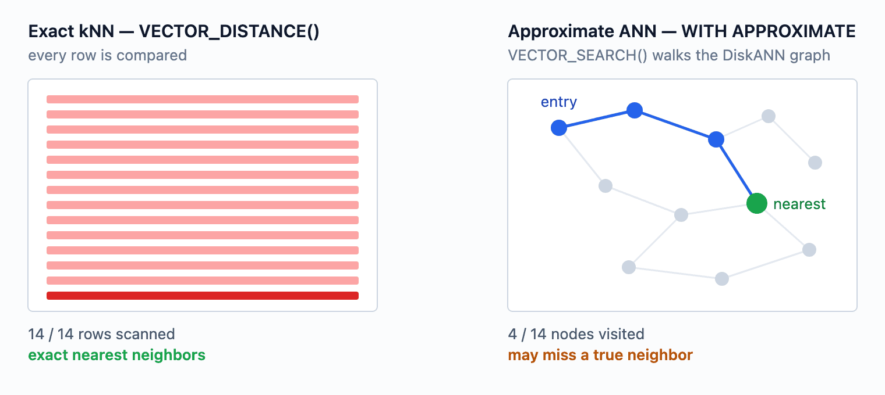
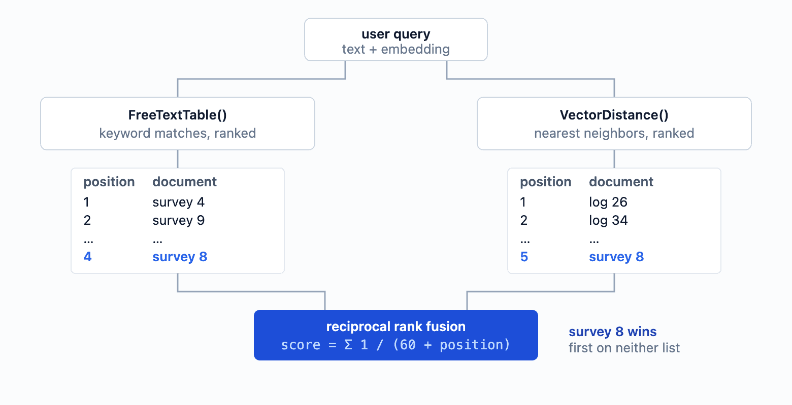
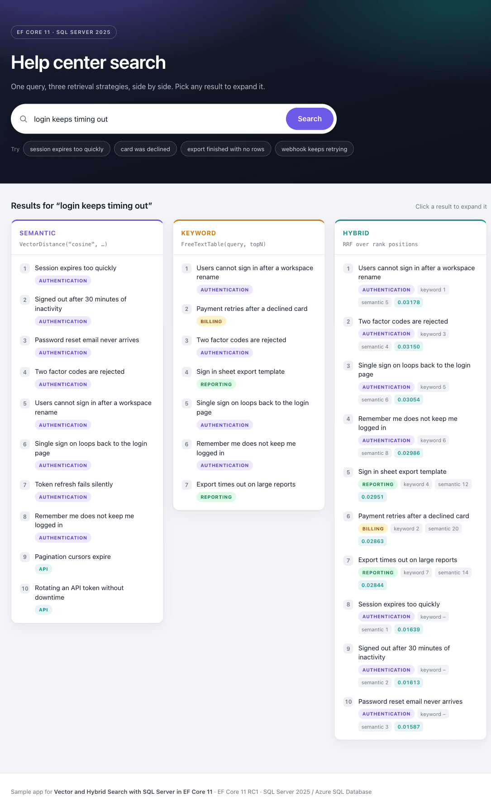
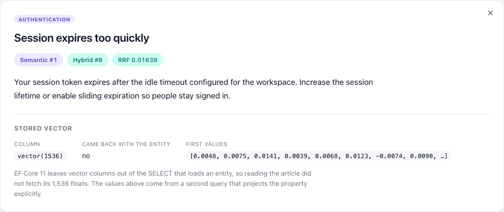

# Vector and Hybrid Search with SQL Server in EF Core 11

> Requires .NET 11 and EF Core 11. Verified against EF Core `11.0.0-rc.1.26425.128`.

A help center has a few thousand articles in SQL Server. Users type what went wrong in their own words — "login keeps timing out" — and the search returns nothing, because the article that answers them is titled "session expires too quickly" and shares no words with the query.

The usual fix is to put a vector database next to the application: pick one, sync the rows into it, keep the two stores consistent, and accept a second system to operate, back up, and secure. That is a lot of infrastructure for one feature, and the articles are already sitting in SQL Server.

SQL Server 2025 added a `vector` type, distance functions, and DiskANN vector indexes. EF Core 10 made the storage side usable from .NET. EF Core 11 adds the remaining query-side building blocks: approximate search over a vector index, full-text search table-valued functions, and translation for .NET 11's new `FullJoin` operator.

This article follows that help center from the first embedding to a working hybrid search, adding each feature at the point where the previous step stops being enough.

## Storing Embeddings Next to the Articles

Add a `SqlVector<float>` property and specify how many dimensions the column holds. The dimension count is mandatory; leaving it out fails model validation.

```csharp
public class Article
{
    public int Id { get; set; }
    public string Title { get; set; } = null!;
    public string Content { get; set; } = null!;

    [Column(TypeName = "vector(1536)")]
    public SqlVector<float> Embedding { get; set; }
}
```

Generating the embedding happens outside the database. [`Microsoft.Extensions.AI`](https://learn.microsoft.com/en-us/dotnet/ai/microsoft-extensions-ai) provides a provider-agnostic `IEmbeddingGenerator<string, Embedding<float>>`, so which model produces the vector stays a configuration decision:

```csharp
IEmbeddingGenerator<string, Embedding<float>> embeddingGenerator = /* your provider */;

article.Embedding = new SqlVector<float>(
    await embeddingGenerator.GenerateVectorAsync(article.Content));

await context.SaveChangesAsync();
```

The user's query goes through the same generator. That is not optional: distances are only meaningful between vectors from the same model, and a different dimension count will not fit the `vector(1536)` column at all.

Keeping the vectors in the same database removes the sync problem between two stores, but the embedding is still derived data with a lifecycle. Regenerate it whenever the source text changes, or the search keeps matching the old wording. Version the model and dimension count, because switching models means backfilling every row. And long articles usually need chunking rather than one vector for the whole `Content`.

```csharp
var query = new SqlVector<float>(
    await embeddingGenerator.GenerateVectorAsync(queryText));
```

## Searching by Meaning

With embeddings stored, the first working version of the search is an `OrderBy` on distance:

```csharp
var hits = await context.Articles
    .OrderBy(a => EF.Functions.VectorDistance("cosine", a.Embedding, query))
    .Select(a => new { a.Id, a.Title })
    .Take(5)
    .ToListAsync();
```

```sql
SELECT TOP(@p) [a].[Id], [a].[Title]
FROM [Articles] AS [a]
ORDER BY VECTOR_DISTANCE('cosine', [a].[Embedding], @query)
```

This is exact k-nearest-neighbor search. Every row is compared, so it returns the true nearest neighbors for the chosen metric. "login keeps timing out" now finds "session expires too quickly", and the help center ships.

The supported metrics are `cosine`, `euclidean`, and `dot`. Cosine is common for text embeddings, but use whichever the model's documentation recommends, and note whether it expects normalized vectors.

This is also where a lot of applications stop. Exact search stays reasonable up to roughly 50,000 vectors — or any table size, as long as a `WHERE` clause narrows the candidates first — and it is all stable EF Core 10 API.

## When the Scan Becomes the Bottleneck

The help center grows. Every search now computes a distance for every row, and the scan shows up in traces.

Vector indexes exist to avoid that. SQL Server uses [DiskANN](https://www.microsoft.com/en-us/research/publication/diskann-fast-accurate-billion-point-nearest-neighbor-search-on-a-single-node), a graph index built for vectors that do not fit in memory, and a search walks a small part of the graph instead of the whole table.

The trade-off is in the name: **approximate** nearest neighbor search can miss a true neighbor. That is usually acceptable for ranking, where a different item somewhere in the top-k changes nothing a user would notice — but it is worth measuring recall on your own corpus rather than assuming it.



Configure the index in the model:

```csharp
modelBuilder.Entity<Article>()
    .HasVectorIndex(a => a.Embedding)
    .HasMetric("cosine")
    .HasType("DiskANN");
```

`HasMetric` is required, and the metric configured here must match the one passed at query time or the index is not used. A vector index also covers exactly one column.

Note that the second argument to `HasVectorIndex` is the index name, not the metric — the [documentation](https://learn.microsoft.com/en-us/ef/core/providers/sql-server/vector-search#vector-indexes) currently passes `"cosine"` there. Written that way the index is called `"cosine"`, no metric is set, and model validation fails.

### Getting the Index Created at All

Deploying that index is harder than it looks. A vector index cannot be created on a table with fewer than 100 non-null vectors, and creating it too early fails with `Msg 42266`.

`UseSeeding` runs after the whole migration batch, so you cannot rely on it to prepare data for a later migration in the same update. Split the work into explicit ordered steps instead: create the table, write at least 100 non-null vectors with a data migration, then create the index in the migration after that.

Three more constraints are worth knowing before you design the deployment. The table must have a clustered primary key — and SQL Server 2025 is stricter than the limitations page reads: error 42217 asks for that key to be *a single 4 byte INT column*. Azure SQL Database, which carries the newer index version, accepted `bigint` and `uniqueidentifier` keys when I tried it, so this one is worth testing on your own target rather than assuming either way. `TRUNCATE TABLE` is blocked while a vector index exists. And vector indexes cannot be deployed through DacPac or BACPAC, because the import creates schema before loading data and therefore hits the 100-row rule — drop the index before exporting and recreate it after the import.

### Querying the Index

```csharp
var hits = await context.Articles
    .VectorSearch(a => a.Embedding, query, "cosine")
    .OrderBy(r => r.Distance)
    .Take(5)
    .WithApproximate()
    .ToListAsync();
```

```sql
SELECT TOP(@p1) WITH APPROXIMATE [a].[Id], [a].[Content], [a].[Title], [v].[Distance]
FROM VECTOR_SEARCH(
    TABLE = [Articles] AS [a],
    COLUMN = [Embedding],
    SIMILAR_TO = @p,
    METRIC = 'cosine'
) AS [v]
ORDER BY [v].[Distance]
```

`VectorSearch()` returns `IQueryable<VectorSearchResult<T>>`, which carries both the entity (`Value`) and the computed `Distance`. `WithApproximate()` must come after `Take()` — it is what turns `TOP(n)` into `TOP(n) WITH APPROXIMATE`. On the latest index version, a `Where()` placed before `Take()` is applied inside the search, so filters narrow the candidate set rather than trimming results afterwards.

The failure mode to guard against is forgetting `WithApproximate()`. On a platform that accepts the generated syntax at all — see the next section — the query still compiles, still runs, and still returns correct results, by scanning every row with the index unused. EF only warns in the log, so turn that warning into an error while developing:

```csharp
options.UseSqlServer(connectionString)
    .ConfigureWarnings(w => w.Throw(SqlServerEventId.VectorSearchWithoutApproximateIndexWarning));
```

## Where This Actually Runs

Before committing to that path, check that it runs on your target at all. The new approximate-search APIs — `VectorSearch()`, `WithApproximate()` and the vector index builder — carry `[Experimental("EF9105")]`, so your code does not compile until the diagnostic is acknowledged with `<NoWarn>$(NoWarn);EF9105</NoWarn>`. `VectorDistance()`, `FreeTextTable()`, `ContainsTable()` and the full-text modelling APIs are not marked.

The attribute itself only affects compilation. What decides whether a query runs is the server product, its region, and the version of the vector index.

| Capability | SQL Server 2025 container `17.0.5005.3` | Azure SQL Database |
|---|---|---|
| `vector` column, `SqlVector<float>` | ✅ | ✅ |
| `EF.Functions.VectorDistance()` | ✅ | ✅ |
| `CREATE VECTOR INDEX` from a migration | ✅ | ✅ |
| **`VectorSearch()` + `WithApproximate()`** | ❌ | ✅ |
| Full-text search | ❌ not installed in the image | ✅ |
| `PREVIEW_FEATURES` required for indexes and `VECTOR_SEARCH` | ✅ | ❌ |

The SQL Server 2025 column reports one tested build, the stock `mcr.microsoft.com/mssql/server:2025-latest` image. Full-text search is missing because that image does not ship the component, not because SQL Server 2025 lacks it.

On SQL Server 2025, `CREATE VECTOR INDEX` and `VECTOR_SEARCH` are documented as preview features that need the database scoped configuration turned on first:

```sql
ALTER DATABASE SCOPED CONFIGURATION SET PREVIEW_FEATURES = ON;
```

Azure SQL Database does not require it.

Even with that enabled, the generated query is rejected on the tested `17.0.5005.3` build with `Incorrect syntax near 'APPROXIMATE'`. Dropping `WithApproximate()` gives a more informative failure, `Incorrect syntax near 'TOP_N'`, even though the generated SQL contains no `TOP_N` anywhere.

That build requires `TOP_N` inside the function call, which is the older calling convention:

```sql
SELECT TOP(3) t.Id, s.distance
FROM VECTOR_SEARCH(TABLE = Articles AS t, COLUMN = Embedding, SIMILAR_TO = @qv,
                   METRIC = 'cosine', TOP_N = 3) AS s
ORDER BY s.distance;
```

That form runs. The server supports approximate search; it speaks the older dialect, and EF generates only the newer one, with no compatibility switch. On Azure SQL Database — and on SQL database in Microsoft Fabric, which also carries the latest index version — the EF query runs unchanged.

The two index versions differ in behaviour, not only in syntax. On the older version the table becomes read-only once the index exists. `ALLOW_STALE_VECTOR_INDEX` lifts that on Azure SQL Database and SQL database in Microsoft Fabric, but that database scoped configuration does not exist on SQL Server 2025, so on the build tested here there is no way back to a writable table. `WHERE` predicates are also applied after retrieval rather than during it, so `TOP_N` has to be widened by hand to survive filtering. The iterative filtering described above belongs to the latest index version.

Two more environment notes. As of September 2026, Azure SQL Database vector search is live in North Europe and UK South only, so check region availability before planning around it. And `SERVERPROPERTY('IsFullTextInstalled')` returns 0 on `mcr.microsoft.com/mssql/server:2025-latest`, so full-text search needs a derived image that installs `mssql-server-fts`.

## The Embeddings Come Back Empty

A bug report arrives: an admin edits an article's title, saves, and the search stops finding it — or a background job that re-reads embeddings gets nothing.

EF Core 11 excludes vector columns from the `SELECT` list by default when materializing entities:

```sql
SELECT TOP(@p) [a].[Id], [a].[Content], [a].[Title]
FROM [Articles] AS [a]
ORDER BY [a].[Id]
```

There is no `[Embedding]`, and the property comes back with a length of zero even though every row has a value.

The reasoning is sound. A 1,536-dimensional float vector is 6 KB per row, and embeddings are written rarely and searched against constantly but almost never read back. In a minimal benchmark, Microsoft measured roughly a 9x throughput improvement locally from not shipping them over the wire, and 22x against a remote Azure SQL database.

Vectors still work in `WHERE` and `ORDER BY`. Reading one requires an explicit projection:

```csharp
var embeddings = await context.Articles
    .Select(a => new { a.Id, a.Embedding })
    .ToListAsync();
```

So the title edit is safe: saving a tracked entity leaves the stored embedding untouched. That is correct here because the vector is generated from `Content` alone. The sample that ships with this article embeds the title as well, and there the same edit does leave a stale vector behind — which input feeds the embedding decides whether an edit invalidates it. What breaks is code that *reads* `Embedding` from a tracked entity: it gets an empty vector, and ordinary property access returns it without any warning. Check `context.Entry(article).Property(a => a.Embedding).IsLoaded` when it matters, or project the property explicitly.

## Exact Terms Still Fail

The next complaint is different. Users searching for an error number, a plan name, or a specific setting get articles that are thematically close and factually wrong. Vector search finds meaning and misses precision — that is what it is for.

EF Core has translated `EF.Functions.FreeText()` and `EF.Functions.Contains()` for years, but those are predicates: they filter without ranking, which is no help when you need a merged ordering later. EF Core 11 adds the table-valued versions, which return SQL Server's relevance score:

```csharp
var hits = await context.Articles
    .FreeTextTable<Article, int>("session expires too quickly", topN: 20)
    .Join(context.Articles, fts => fts.Key, a => a.Id, (fts, a) => new { a.Title, fts.Rank })
    .OrderByDescending(x => x.Rank)
    .ToListAsync();
```

`FullTextSearchResult<TKey>` exposes only `Key` and `Rank`, so the join back to the table is explicit, and both generic type arguments must be supplied explicitly because `TKey` cannot be inferred. `ContainsTable()` has the same shape but takes a search condition (`"nebula OR quasar"`, `NEAR`, prefix terms) instead of free text.

The catalog and index can be configured in the model as of EF Core 11:

```csharp
modelBuilder.HasFullTextCatalog("ftCatalog");

modelBuilder.Entity<Article>()
    .HasFullTextIndex(a => new { a.Title, a.Content })
    .UseKeyIndex("PK_Articles")
    .UseCatalog("ftCatalog");
```

`UseKeyIndex` has to name a unique, single-column, non-nullable index — SQL Server uses it as the full-text key, which is what `FullTextSearchResult<TKey>.Key` returns.

That configuration has a side effect in the table definition rather than the index. `HasFullTextIndex` is built on `HasIndex`, so EF applies its ordinary index key size limit to the string properties involved, and a `Content` property that should map to `nvarchar(max)` comes out as `nvarchar(450)` — truncating the column you most wanted to search. Set the column type explicitly to keep the full length:

```csharp
modelBuilder.Entity<Article>()
    .Property(a => a.Content)
    .HasColumnType("nvarchar(max)");
```

One more thing that looks like a bug in tests: full-text population is asynchronous. In a 120-row sample it took about 20 seconds to become searchable after `CREATE FULLTEXT INDEX`, so a seed routine that queries immediately gets an empty result. Wait until the indexed row count catches up:

```sql
SELECT OBJECTPROPERTYEX(OBJECT_ID('Articles'), 'TableFulltextItemCount');
```

Give that loop an interval and a timeout, and check `TableFulltextFailCount` as well — rows that fail indexing never arrive, so waiting for the count to reach the table total can hang forever. The catalog-level `FULLTEXTCATALOGPROPERTY('ftCatalog', 'PopulateStatus')` is the more obvious check, but Microsoft has marked that property for removal and advises against polling it in a tight loop.

## Merging the Two Rankings

Now the help center has two searches that each fail differently, and neither one alone is the product. They have to be merged.

The standard merge is Reciprocal Rank Fusion: each document scores `1 / (k + position)` for every list it appears in, where `k` is a smoothing constant, and the scores are summed. With suitable parameters, a document that both retrievers rank moderately well can beat one that a single retriever ranks first.



Evaluating a fusion needs a corpus where the two retrievers disagree. The one used here has 120 documents, a query text of `nebula quasar`, and an astronomy query vector: 12 documents match on both sides, 24 are semantically on topic but share no query words, 12 are lexical false friends — dessert menu items named *Nebula* and *Quasar*, embedded in a cooking topic — and 72 are unrelated. That corpus, and the console probe that produced every measurement below, are in the sample repository: [maliming/efcore11-vector-hybrid-search](https://github.com/maliming/efcore11-vector-hybrid-search).

Each retriever on its own:

```text
FreeTextTable    Deep sky survey 4 (484), 9 (447), 6 (269), 8 (269), 2 (189), …
VectorSearch     Observation log 26 (0.0112), 34 (0.0125), 18 (0.0134), 32 (0.0145), …
```

Both lists lead with one group each: full-text with documents the corpus makes match on both sides, vector search with the semantic-only ones. Neither puts a doubly-corroborated document first.

### The Documented Single-Query Shape

The documentation builds the fusion as a single query, joining the two retrievers with .NET 11's `FullJoin` and computing the score in the projection. As observed on `11.0.0-rc.1.26425.128`, that shape has three practical problems. Re-check the first two against GA before building on them.

The first stops the build. The sample compares `vs == null`, but `VectorSearchResult<T>` is a `readonly struct`, so that is `CS0019`. Projecting the vector side to a reference type first — `.Select(r => new { Article = r.Value, r.Distance })` — fixes it.

The second is materialization. Once the fused score is computed in the projection, reading back a result set that contains rows matched on one side only throws `InvalidOperationException: Nullable object must have a value`.

Projecting the same entity and nullable scalars without that score expression works, so it is the fused projection that breaks rather than the full join itself.

The third is the score, and it is wrong in two separate ways.

It inverts the full-text ranking. SQL Server's `RANK` is higher-is-better, so feeding it into `1 / (k + Rank)` gives the *least* relevant keyword matches the highest score. In the measured run, a document with `RANK` 119 scored above one with `RANK` 140.

It also turns vector membership into a flat bonus. Cosine distances sit near zero, so with the documented `k` of 20 the vector term is about `1 / 20 = 0.05` for anything in the vector list, while the entire full-text term spans roughly 0.002 to 0.007 across the ranks in this run. Simply appearing in the vector results is worth seven to twenty-five times more than any difference in keyword relevance.

Neither side uses rank positions, which is what RRF is defined over.

### Fusing on Rank Positions

Fetching the two ranked lists separately and applying RRF in memory avoids all three:

```csharp
const int candidateCount = 20;
const int rrfK = 60; // the constant from the original RRF paper

var lexical = await context.Articles
    .FreeTextTable<Article, int>(queryText, topN: candidateCount)
    .Join(context.Articles, fts => fts.Key, a => a.Id, (fts, a) => new { a.Id, a.Title, fts.Rank })
    .OrderByDescending(x => x.Rank)
    .ThenBy(x => x.Id)
    .ToListAsync();

var semantic = await context.Articles
    .OrderBy(a => EF.Functions.VectorDistance("cosine", a.Embedding, queryVector))
    .ThenBy(a => a.Id)
    .Select(a => new { a.Id, a.Title })
    .Take(candidateCount)
    .ToListAsync();

var lexicalPosition = lexical.Select((x, i) => (x.Id, Position: i + 1)).ToDictionary(x => x.Id, x => x.Position);
var semanticPosition = semantic.Select((x, i) => (x.Id, Position: i + 1)).ToDictionary(x => x.Id, x => x.Position);

var titles = lexical.Select(x => (x.Id, x.Title))
    .Concat(semantic.Select(x => (x.Id, x.Title)))
    .DistinctBy(x => x.Id)
    .ToDictionary(x => x.Id, x => x.Title);

var fused = titles.Keys
    .Select(id => new
    {
        Id = id,
        Title = titles[id],
        LexicalPosition = lexicalPosition.TryGetValue(id, out var l) ? l : (int?)null,
        SemanticPosition = semanticPosition.TryGetValue(id, out var s) ? s : (int?)null,
        Score = (lexicalPosition.TryGetValue(id, out var lp) ? 1.0 / (rrfK + lp) : 0.0)
              + (semanticPosition.TryGetValue(id, out var sp) ? 1.0 / (rrfK + sp) : 0.0)
    })
    .OrderByDescending(x => x.Score)
    .ThenBy(x => x.Id)
    .Take(10)
    .ToList();
```

The `ThenBy` calls matter at both levels. Full-text ranks tie often — two documents above share `RANK` 269 — and the positions those lists produce are what the score is built from, so an unstable input order moves the final score. Ties in the score itself are just as common: two pairs below land on exactly `0.01639` and `0.01613`.

The semantic list here comes from `VectorDistance()`, which keeps the whole pipeline on stable API and runs on any SQL Server 2025 instance. On Azure SQL Database in a supported region, swap that one query for the indexed version and nothing else changes:

```csharp
var semantic = await context.Articles
    .VectorSearch(a => a.Embedding, queryVector, "cosine")
    .OrderBy(r => r.Distance)
    .Take(candidateCount)
    .WithApproximate()
    .Select(r => new { r.Value.Id, r.Value.Title, r.Distance })
    .ToListAsync();

// VECTOR_SEARCH accepts a single ascending ordering on the distance, so the tie-break the
// exact query does in SQL has to happen here instead.
semantic = [.. semantic.OrderBy(x => x.Distance).ThenBy(x => x.Id)];
```

That last line is not decoration: `VECTOR_SEARCH` only takes one ordering key, so the approximate path cannot express the tie-break in SQL and has to apply it after the rows come back. Against this corpus both versions produce the same fused ranking, which is what you would hope for at 120 documents — the approximate path earns its keep at a scale where the exact scan hurts, not by changing the answer.

Two round trips instead of one, and the fusion itself is a dictionary lookup over at most `2 * candidateCount` rows:

```text
title                  lexical#  semantic#     score
Deep sky survey 8             4          5   0.03101
Deep sky survey 1             7         12   0.02881
Deep sky survey 10           10          9   0.02878
Deep sky survey 5             9         16   0.02765
Deep sky survey 3             8         19   0.02736
Deep sky survey 4             1          -   0.01639
Observation log 26            -          1   0.01639
Deep sky survey 9             2          -   0.01613
Observation log 34            -          2   0.01613
Deep sky survey 6             3          -   0.01587
```

`Deep sky survey 8` is ranked 4th by keywords and 5th by vectors — first by neither — and wins outright because both retrievers agree on it.

That ordering is a parameter choice, not a universal truth. With `rrfK = 60` and `candidateCount = 20`, the worst possible two-list score is `2 / (60 + 20) = 0.025` and the best possible one-list score is `1 / (60 + 1) = 0.0164`, so anything both retrievers return outranks anything only one of them found. For the help center that pushes keyword-only false positives down — but it would push down a correct error number just as hard, if the vector side happened to miss it. When exact identifiers matter, lower `rrfK`, widen the candidate lists, or add an explicit boost for exact matches.

The companion web application in that same repository puts all three strategies on one page. It ships the help center corpus from the opening — 32 articles, a separate set from the 120 documents used for the measurements above:



The opening query behaves as described. Semantic search returns *Session expires too quickly* first — a title that shares no words with the query. Keyword search mixes in *Sign in sheet export template* — a reporting article about attendance sheets — and a billing article about declined cards. The fused list puts four authentication articles on top and drops both false friends below them. *Session expires too quickly*, which only the vector side found, lands at 8: the trade-off from the paragraph above, on this sample corpus.

Clicking a result expands it:



`Came back with the entity: no` is the earlier section made visible — loading the article never fetched its 1,536 floats, and the values in the panel come from a second query that projects the property explicitly.

## What to Ship

Following that path end to end, the version worth deploying is smaller than the feature list suggests.

Store embeddings in a `vector` column and search with `VectorDistance()`. That API is stable, exact, runs on any SQL Server 2025 instance, and is fast enough for tens of thousands of candidate articles. Add a full-text index when exact terms matter, and fuse the two ranked lists on positions in application code. Both halves are non-experimental, and the fusion works with either vector retriever.

Reach for `VectorSearch()` and a vector index when profiling shows the scan is actually the bottleneck, and only on Azure SQL Database or SQL database in Microsoft Fabric in a region that supports it. Treat that path as preview on both sides.

## Summary

EF Core 11 lets you build semantic, lexical, and hybrid search on SQL Server without a separate vector database. Start with exact search, add full-text search when exact terms matter, and use approximate search only when scale justifies its preview constraints. And remember that vector columns are no longer loaded by default when materializing entities.

## References

- [What's New in EF Core 11](https://learn.microsoft.com/en-us/ef/core/what-is-new/ef-core-11.0/whatsnew)
- [Vector search in the SQL Server EF Core Provider](https://learn.microsoft.com/en-us/ef/core/providers/sql-server/vector-search)
- [Full-text search in the SQL Server EF Core Provider](https://learn.microsoft.com/en-us/ef/core/providers/sql-server/full-text-search)
- [Vector search and vector indexes in the SQL Database Engine](https://learn.microsoft.com/en-us/sql/sql-server/ai/vectors)
- [`VECTOR_SEARCH` (Transact-SQL)](https://learn.microsoft.com/en-us/sql/t-sql/functions/vector-search-transact-sql)
- [`CREATE VECTOR INDEX` (Transact-SQL)](https://learn.microsoft.com/en-us/sql/t-sql/statements/create-vector-index-transact-sql)
- [Azure SQL Database feature availability by region](https://learn.microsoft.com/en-us/azure/azure-sql/database/region-availability)
- [Microsoft.Extensions.AI](https://learn.microsoft.com/en-us/dotnet/ai/microsoft-extensions-ai)
- [Sample code for this article](https://github.com/maliming/efcore11-vector-hybrid-search) — the web application and the measurement probe
- [Reciprocal Rank Fusion outperforms Condorcet and individual rank learning methods](https://cormack.uwaterloo.ca/cormacksigir09-rrf.pdf) — the original RRF paper
