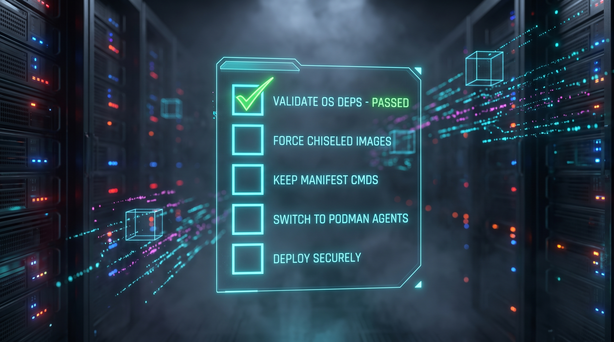

# .NET 11 Container Publishing: Hype, Hands-On Reality, and the DevOps Playbook

Shipping multi-platform, secure containers without maintaining complex `Dockerfile`s is the holy grail for platform engineering. With .NET 11 (Release Candidate 1), Microsoft heavily markets its built-in SDK container publishing as the solution. But marketing claims and CI/CD realities often clash.

After running the .NET 11 RC1 SDK through an isolated sandbox environment—testing everything from cross-compilation to rootless runtimes—here is the unvarnished DevOps breakdown of what actually works, what is overhyped, and how you should adapt your pipelines.

## 1. SDK-Driven Publishing and the Base Image Reality

The SDK natively understands your `.csproj` and generates an OCI-compliant image without a single Dockerfile command. Running a simple publish command works effortlessly:

```bash
dotnet publish /t:PublishContainer -p:ContainerRepository=my-registry.local/myapp -p:ContainerImageTag=1.0.0

```

The process takes roughly 6 to 11 seconds. However, contrary to the belief that the SDK defaults to "microscopic" secure images, the default base image pulled is the standard Debian-based `aspnet:11.0.0-rc.1`, resulting in a ~256MB footprint.

To achieve a minimal attack surface, you must explicitly opt into Ubuntu Chiseled images. In .NET 11, the correct chiseled tag family corresponds to Ubuntu 26.04 (Resolute) rather than Ubuntu 24.04 (Noble). If you rely on auto-inference during the preview/RC phase, the SDK might incorrectly target `noble-chiseled` and fail, so you must explicitly declare it:

```xml
<!-- Add this to your .csproj -->
<ContainerFamily>resolute-chiseled</ContainerFamily>

```

While marketing sometimes hints at sub-50MB footprints, sandbox testing shows a standard minimal API built on `resolute-chiseled` clocks in at **128MB uncompressed**—still an excellent 50% reduction with zero package managers or shells included.

## 2. Multi-Architecture: The Massive Win and the Critical Gotcha

Transitioning to ARM64 (like AWS Graviton) saves money, but configuring QEMU and Docker Buildx in CI pipelines is notoriously slow. .NET 11 handles this beautifully at the compiler level.

By passing `-r linux-arm64`, the SDK cross-compiles the Intermediate Language (IL) natively and constructs the ARM64 container layers on an x64 runner without ever invoking QEMU. This is a massive CI performance win.

**The Pipeline Gotcha:** You cannot rely on the SDK to build a true multi-architecture tag (a single `latest` tag that resolves correctly on both architectures). If you run consecutive publish commands for `linux-x64` and `linux-arm64` pointing to the same registry tag, the second push **completely overwrites** the first manifest.


---

To create a genuine multi-arch manifest list, your CI/CD pipeline still requires a manual step.


---

> **Key insight:** Build and push architecture-specific tags (`latest-amd64`, `latest-arm64`) with the SDK, then use `docker manifest create` or `buildah manifest` at the end of your pipeline to bind them together.

## 3. Daemonless CI/CD: Seamless Podman Integration

If your enterprise strictly enforces rootless, daemonless CI/CD agents, .NET 11 is a game changer. Historically, using Podman required brittle `DOCKER_HOST` socket mapping hacks.


In testing, completely removing Docker from the `PATH` and installing only Podman resulted in flawless execution. The SDK automatically detects Podman and pushes directly to its local image store. You can finally adopt rootless Podman on RHEL/Ubuntu GitHub Action runners without modifying your `dotnet publish` commands.

## 4. Supply-Chain Security: The Reproducibility Illusion

Software Supply Chain standards like SLSA emphasize reproducible builds—the guarantee that the same source code produces the exact same artifact digest.

While the .NET 11 compiler is perfectly deterministic (producing byte-for-byte identical DLLs on identical source code), the resulting container image digest (SHA256) **will still change** on every build. This occurs because the container packing step embeds the current wall-clock time (`mtime`) into the headers of the `tar` filesystem layers. Until the SDK provides a robust `SOURCE_DATE_EPOCH` injection mechanism, strict bit-for-bit image digest reproducibility requires external tooling.

## The DevOps Adoption Checklist

Before ripping out your `Dockerfile`s for .NET 11, evaluate your pipelines against these verified realities:

1. **Validate OS Dependencies:** No apt-get allowed.
The SDK cannot install OS-level packages (e.g., `ffmpeg`, `wkhtmltopdf`). If your app relies on them, stick to a `Dockerfile`.


2. **Force Chiseled Images:** Update your .csproj.
Add `<ContainerFamily>resolute-chiseled</ContainerFamily>` to halve your image size and eliminate shell-based CVE vectors.


3. **Keep Manifest Commands:** Don't trust the overwrite.
Continue using `docker manifest` in your pipeline to aggregate the lightning-fast, QEMU-free `linux-x64` and `linux-arm64` SDK builds into a single tag.


4. **Switch to Podman Agents:** Zero-config rootless builds.
Upgrade your self-hosted runners to Podman to immediately benefit from rootless container execution without updating build scripts.

