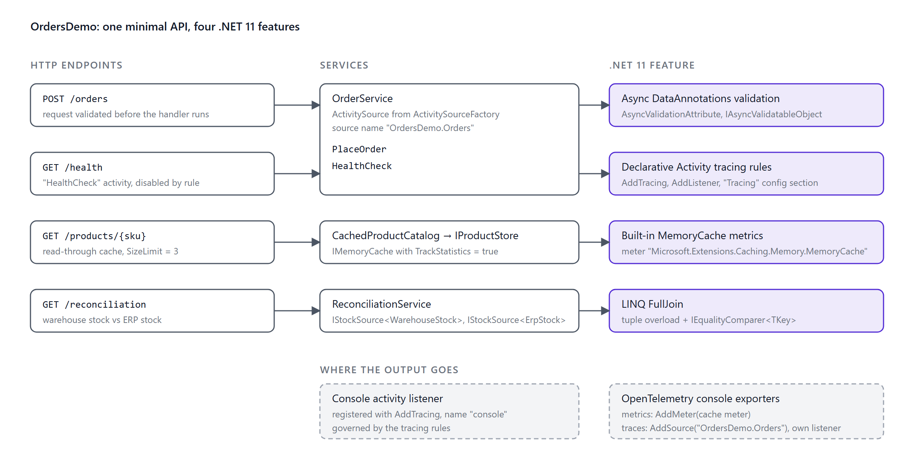
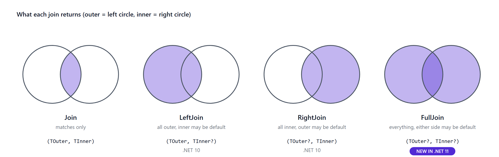
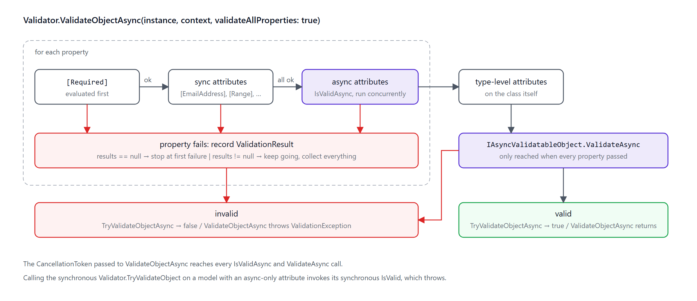
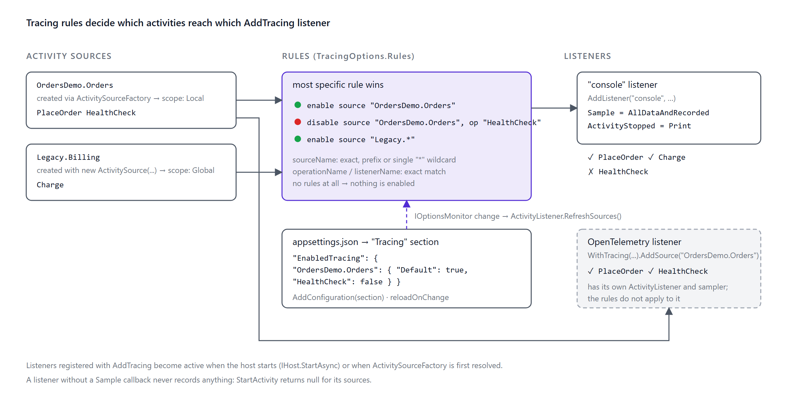

Every .NET release ships a long list of changes. Most of them matter to library authors or to people chasing the last few percent of throughput. This article is about four changes in .NET 11 that show up in ordinary application code: a LINQ operator you have probably hand-rolled more than once, validation rules that can finally `await`, cache metrics you no longer have to write yourself, and a way to turn distributed tracing on and off from configuration.

Each section covers the problem, the API, a runnable example with its output, and the caveats I hit while testing. Everything was run on .NET 11 RC1, and the complete sample application is on GitHub: [github.com/ahmetcelik05/dotnet11-features-demo](https://github.com/ahmetcelik05/dotnet11-features-demo).

> **Where .NET 11 stands today.** .NET 11 RC1 shipped on September 8, 2026 with a go-live license. General availability is planned for November 10, 2026, and .NET 11 is a Standard Term Support (STS) release, supported until November 9, 2028. The APIs below are in RC1, but as you will see in the cache metrics section, details can still move before GA.

Short on time? The whole article in one table:

| Feature | What is new in .NET 11 | The catch I found on RC1 |
|---|---|---|
| LINQ joins | `FullJoin`, plus `Join`/`GroupJoin` overloads without a result selector | `GroupJoin` returns `IGrouping`, not a tuple; value-type `default` hides "no match" |
| Async validation | `AsyncValidationAttribute`, `IAsyncValidatableObject`, `Validator.*Async` | Synchronous `Validator` calls on the same model throw |
| Cache metrics | `MemoryCache` publishes an OpenTelemetry meter when `TrackStatistics` is on | The hit/miss tag name is being renamed before GA |
| Tracing rules | `AddTracing` with rules from code or configuration, live reload | Nothing is enabled by default, `Sample` is mandatory, OpenTelemetry is unaffected |

## The sample application

The sample is a small minimal API called `OrdersDemo`. It has no UI; you drive it with `curl` and watch the console. Each endpoint exists to demonstrate one feature, and the features also interact: placing an order runs async validation and then produces a traced activity.



Each feature lives in its own folder under `Features` and registers itself through `Add...` and `Map...Endpoints` extensions, so `Program.cs` is only a composition root.

## 1. LINQ `FullJoin` and selector-less `Join`/`GroupJoin`

### The problem

.NET 10 added `LeftJoin` and `RightJoin`. A full outer join was still missing, so if you needed "everything from both sides, matched where possible" you wrote a left join, a right join, and a `Concat` or `Union`, or a `GroupJoin`/`SelectMany`/`DefaultIfEmpty` combination in each direction. Most of us have a `FullOuterJoin` extension method somewhere in a `Utils` folder, copied from a Stack Overflow answer. It works, right up until a reconciliation report is wrong.

A smaller annoyance: `Join` and `GroupJoin` always required a result selector. In most call sites that selector was `(a, b) => (a, b)`, typed for the hundredth time.

### The API

.NET 11 adds `FullJoin` and selector-less overloads of `Join` and `GroupJoin`. They exist on `Enumerable`, `Queryable`, and `AsyncEnumerable`. The new overloads take an optional `IEqualityComparer<TKey>` as a trailing parameter, and the same optional comparer is available on `LeftJoin` and `RightJoin`.

```csharp
// Full outer join, returning tuples
IEnumerable<(TOuter? Outer, TInner? Inner)> FullJoin<TOuter, TInner, TKey>(
    this IEnumerable<TOuter> outer, IEnumerable<TInner> inner,
    Func<TOuter, TKey> outerKeySelector, Func<TInner, TKey> innerKeySelector,
    IEqualityComparer<TKey>? comparer = null);

// Full outer join with your own projection
IEnumerable<TResult> FullJoin<TOuter, TInner, TKey, TResult>(
    this IEnumerable<TOuter> outer, IEnumerable<TInner> inner,
    Func<TOuter, TKey> outerKeySelector, Func<TInner, TKey> innerKeySelector,
    Func<TOuter?, TInner?, TResult> resultSelector,
    IEqualityComparer<TKey>? comparer = null);
```



### Example: reconciling two stock systems

The reconciliation endpoint compares stock levels reported by a warehouse and by an ERP system. A SKU can exist in either system or both, and when it exists in both the quantities may disagree. Three pair shapes, four statuses, one full outer join, and pattern matching on the tuple expresses all of it directly:

```csharp
internal sealed class ReconciliationService : IReconciliationService
{
    public IReadOnlyList<ReconciliationRow> Reconcile(IEnumerable<WarehouseStock> warehouse, IEnumerable<ErpStock> erp)
    {
        var pairs = warehouse.FullJoin(
            erp,
            w => w.Sku,
            e => e.Sku,
            StringComparer.OrdinalIgnoreCase);

        return [.. pairs.Select(ToRow)];
    }

    private static ReconciliationRow ToRow((WarehouseStock? Warehouse, ErpStock? Erp) pair) => pair switch
    {
        (null, { } erp) => new ReconciliationRow(erp.Sku, ReconciliationStatus.MissingInWarehouse, null, erp.Quantity),
        ({ } warehouse, null) => new ReconciliationRow(warehouse.Sku, ReconciliationStatus.MissingInErp, warehouse.Quantity, null),
        ({ } warehouse, { } erp) when warehouse.Quantity != erp.Quantity
            => new ReconciliationRow(warehouse.Sku, ReconciliationStatus.QuantityMismatch, warehouse.Quantity, erp.Quantity),
        ({ } warehouse, { } erp) => new ReconciliationRow(warehouse.Sku, ReconciliationStatus.Ok, warehouse.Quantity, erp.Quantity),
        (null, null) => throw new UnreachableException("FullJoin never yields an empty pair."),
    };
}
```

Calling `GET /reconciliation` with three warehouse rows (`LAPTOP-15`, `mouse-01`, `CHAIR-ERG`) and three ERP rows (`LAPTOP-15`, `MOUSE-01`, `DESK-STD`) returns four rows:

```json
[
  { "sku": "LAPTOP-15", "status": "Ok",                 "warehouseQuantity": 5,    "erpQuantity": 5 },
  { "sku": "mouse-01",  "status": "QuantityMismatch",   "warehouseQuantity": 0,    "erpQuantity": 3 },
  { "sku": "CHAIR-ERG", "status": "MissingInErp",       "warehouseQuantity": 7,    "erpQuantity": null },
  { "sku": "DESK-STD",  "status": "MissingInWarehouse", "warehouseQuantity": null, "erpQuantity": 2 }
]
```

Note the second row: `mouse-01` and `MOUSE-01` matched only because of the `StringComparer.OrdinalIgnoreCase` argument. Without it they would be two separate "missing" rows, which is exactly what happens in real life when two systems disagree on casing and nobody passes a comparer.

### What the tests showed about the semantics

The documentation describes the join operators but not their ordering or null behaviour, so I wrote tests against RC1 to pin down what you can observe today.

Output order follows the outer sequence, with unmatched inner elements appended at the end: for `outer = [1, 2, 3]` and `inner = [3, 4, 2]`, `FullJoin` yields `(1, 0), (2, 2), (3, 3), (0, 4)`. Treat that as an implementation detail, not a guarantee. Null keys never match each other; a `null` key on either side produces an unmatched row, the same way `NULL = NULL` is false in SQL.

Look at that `(1, 0)` again. It means "outer 1 had no partner", but `0` is also a perfectly valid inner value, and nothing in the tuple tells you which. When the element type is a struct, use nullable elements or the `resultSelector` overload so you can tell the two apart.

One more surprise: the selector-less `GroupJoin` does not return tuples. The "What's new" page calls the new overloads "tuple-returning", which is true for `Join`, but `GroupJoin` returns `IEnumerable<IGrouping<TOuter, TInner>>` with the outer element as the `Key` and the matching inner elements as the group.

```csharp
var grouped = customers
    .GroupJoin(orders, c => c.Id, o => o.CustomerId)
    .Select(group => (group.Key.Name, Count: group.Count()));
```

### When to use it

Use `FullJoin` whenever you need a reconciliation, a diff, or a "who did not show up on the other list" report over two in-memory sequences. Keep the memory profile in mind: the inner sequence is fully materialised into a lookup, so put the smaller sequence on the inner side. Against a database, EF Core 11 translates `Queryable.FullJoin` to `FULL JOIN` on SQL Server. EF Core 11 is still in preview at the time of writing, so check the provider you use before relying on it.

That covers combining data that is already in memory. The next feature is about the data on its way in: the order request that arrives at `POST /orders` and has to be checked against systems you can only reach asynchronously.

## 2. Asynchronous validation with DataAnnotations

### The problem

`ValidationAttribute.IsValid` is synchronous. Rules that need I/O, such as "is this e-mail registered", "does this VAT number exist in the tax registry", or "is there enough stock", either blocked a thread with `.GetAwaiter().GetResult()` or moved out of the validation layer entirely. Once they move, their error messages no longer flow through `ValidationResult` and `ValidationProblemDetails`, and every consumer of the model has to remember to call them. You know the result: `[Required]` failures arrive as a tidy 400 with a field name, "customer not found" arrives as a 500 from the service layer, and the front-end team asks why.

### The API

.NET 11 adds an async path to `System.ComponentModel.DataAnnotations` with three pieces:

- `AsyncValidationAttribute`, an abstract base class with `IsValidAsync(object?, ValidationContext, CancellationToken)` returning `Task<ValidationResult?>`.
- `IAsyncValidatableObject`, with `ValidateAsync(ValidationContext, CancellationToken)` returning `IAsyncEnumerable<ValidationResult>`.
- Async counterparts on `Validator`: `ValidateObjectAsync`, `TryValidateObjectAsync`, `ValidatePropertyAsync`, `TryValidatePropertyAsync`, `ValidateValueAsync`, and `TryValidateValueAsync`.



One design point matters before you write your first rule: the synchronous members are still required. `IsValid(object?, ValidationContext)` is abstract on `AsyncValidationAttribute`, and `IAsyncValidatableObject` inherits `IValidatableObject.Validate`. The framework samples throw from both so that accidental synchronous validation fails loudly instead of silently skipping the rule, and that is the approach I take below.

### Example: an async attribute and an async object rule

The order request in the sample uses both mechanisms. The attribute checks that the customer exists in a directory:

```csharp
[AttributeUsage(AttributeTargets.Property)]
public sealed class RegisteredCustomerAttribute : AsyncValidationAttribute
{
    protected override ValidationResult? IsValid(object? value, ValidationContext validationContext) =>
        throw new InvalidOperationException(
            $"{nameof(RegisteredCustomerAttribute)} only supports asynchronous validation. Use Validator.ValidateObjectAsync.");

    protected override async Task<ValidationResult?> IsValidAsync(
        object? value, ValidationContext validationContext, CancellationToken cancellationToken)
    {
        if (value is not string email || string.IsNullOrWhiteSpace(email))
        {
            return ValidationResult.Success; // [Required] owns the empty-value case
        }

        var directory = validationContext.GetRequiredService<ICustomerDirectory>();

        return await directory.ExistsAsync(email, cancellationToken)
            ? ValidationResult.Success
            : new ValidationResult($"'{email}' is not a registered customer.", [validationContext.MemberName!]);
    }
}
```

The model itself checks stock for every line, a rule that spans properties:

```csharp
public sealed class CreateOrderRequest : IAsyncValidatableObject
{
    [Required, EmailAddress, RegisteredCustomer]
    public string CustomerEmail { get; init; } = string.Empty;

    [MinLength(1)]
    public IReadOnlyList<OrderLine> Lines { get; init; } = [];

    public IEnumerable<ValidationResult> Validate(ValidationContext validationContext) =>
        throw new InvalidOperationException($"Validate {nameof(CreateOrderRequest)} with {nameof(ValidateAsync)}.");

    public async IAsyncEnumerable<ValidationResult> ValidateAsync(
        ValidationContext validationContext,
        [EnumeratorCancellation] CancellationToken cancellationToken = default)
    {
        var inventory = validationContext.GetRequiredService<IInventoryService>();

        foreach (var line in Lines)
        {
            var available = await inventory.GetAvailableQuantityAsync(line.Sku, cancellationToken);
            if (available < line.Quantity)
            {
                yield return new ValidationResult(
                    $"Only {available} unit(s) of '{line.Sku}' are in stock.", [nameof(Lines)]);
            }
        }
    }
}
```

Both rules resolve their dependencies from the `ValidationContext`, which means the context has to be created with a service provider. Minimal APIs do that for you; when you call `Validator` yourself, pass one in:

```csharp
var context = new ValidationContext(request, serviceProvider, items: null);
var results = new List<ValidationResult>();

var isValid = await Validator.TryValidateObjectAsync(
    request, context, results, validateAllProperties: true, cancellationToken);
```

### Running it through a minimal API

`builder.Services.AddValidation()` has been available since .NET 10; it makes minimal API endpoints validate their parameters before the handler runs. What is new in .NET 11 is that the same call now runs the async rules as well, concurrently where possible. Posting an unknown customer:

```bash
curl -X POST http://localhost:5028/orders -H "Content-Type: application/json" \
     -d '{"customerEmail":"nobody@example.com","lines":[{"sku":"MOUSE-01","quantity":2}]}'
```

```json
{
  "title": "One or more validation errors occurred.",
  "status": 400,
  "errors": { "CustomerEmail": ["'nobody@example.com' is not a registered customer."] }
}
```

Only the attribute error is reported. That is by design: object-level validation runs after all property rules pass, so the stock check never executed. Post the same order with a registered customer and you get the object-level message instead:

```json
{
  "title": "One or more validation errors occurred.",
  "status": 400,
  "errors": { "Lines": ["Only 0 unit(s) of 'MOUSE-01' are in stock."] }
}
```

### How the pipeline behaves

From reading `Validator` and confirming with tests, the async path works like this:

1. `[Required]` is evaluated first for each property and short-circuits that property on failure.
2. Synchronous attributes on a property run next. Async attributes run only if all synchronous ones pass, and they run concurrently.
3. Type-level attributes follow, then `IAsyncValidatableObject.ValidateAsync`.
4. Pass `null` for the results collection and validation stops at the first failure; pass a collection and it keeps going and collects everything.
5. The cancellation token flows into every async rule.

### The migration trap

So what happens when an older code path calls the synchronous `Validator.TryValidateObject` on a model that now carries an async attribute? Does it quietly skip the rule? No. It has no special handling for async attributes at all: it calls your synchronous `IsValid`, and if you followed the framework guidance, that throws:

```
System.InvalidOperationException: RegisteredCustomerAttribute only supports asynchronous validation. Use Validator.ValidateObjectAsync.
```

On purpose, and rightly so. But it makes adding an async attribute a breaking change for every caller that still validates synchronously, so find those callers before you decorate a shared model. Minimal APIs and Blazor forms use the async path in .NET 11; MVC controllers are not listed in the RC1 notes and the public design notes defer them to follow-up work, so treat MVC as a synchronous caller until the docs say otherwise.

Validation decides whether a request gets in. The next two features are about seeing what the application does once it is in, starting with the cache that every request touches.

## 3. Built-in OpenTelemetry metrics for `MemoryCache`

### The problem

`IMemoryCache` has had `GetCurrentStatistics()` for a while, but turning it into metrics meant polling it and publishing your own `Meter`. Every team wrote a slightly different decorator, and none of them agreed on instrument names. The decorator then quietly stopped being registered after a refactor, and the "cache hit ratio" panel on the dashboard showed a flat line for three weeks before anyone noticed.

### The API

Do you need an extra package or an adapter for this? No. In .NET 11, `MemoryCache` publishes a meter named `Microsoft.Extensions.Caching.Memory.MemoryCache` as soon as you opt in with `TrackStatistics = true`. The new `MemoryCacheOptions.Name` becomes a `dotnet.cache.name` tag so that multiple caches can share a process, and a new constructor overload accepts an `IMeterFactory` for per-instance meters. `MemoryCacheStatistics` gained `TotalEvictions` to back the new eviction counter.

RC1 publishes these four instruments, captured with a `MeterListener` in the test suite:

| Instrument | Type | Unit | Tags |
|---|---|---|---|
| `dotnet.cache.requests` | ObservableCounter | `{request}` | `dotnet.cache.request.type` = `hit` / `miss` |
| `dotnet.cache.evictions` | ObservableCounter | `{eviction}` | |
| `dotnet.cache.entries` | ObservableUpDownCounter | `{entry}` | |
| `dotnet.cache.estimated_size` | ObservableGauge | `By` | |

### Example: a read-through product catalog

In most applications the opt-in is a one-liner: `services.AddMemoryCache(options => options.TrackStatistics = true)`. In the demo the cache is configured through an `IConfigureOptions<MemoryCacheOptions>` instead, so that the demo-specific settings live next to the feature:

```csharp
public void Configure(MemoryCacheOptions options)
{
    options.TrackStatistics = true;        // opt-in: without this no instruments are published
    options.Name = CacheName;              // becomes the dotnet.cache.name tag
    options.SizeLimit = productCache.Value.SizeLimit;
    options.CompactionPercentage = productCache.Value.CompactionPercentage;
}
```

```csharp
internal sealed class CachedProductCatalog(IMemoryCache cache, IProductStore store) : IProductCatalog
{
    public Task<Product?> GetAsync(string sku, CancellationToken cancellationToken) =>
        cache.GetOrCreateAsync(sku, entry =>
        {
            entry.SetSize(1); // required when MemoryCacheOptions.SizeLimit is set
            entry.SetSlidingExpiration(TimeSpan.FromMinutes(5));
            return store.FindAsync(sku, cancellationToken);
        });
}
```

To export the meter, add it to your OpenTelemetry metrics pipeline:

```csharp
services.AddOpenTelemetry()
    .WithMetrics(metrics => metrics
        .AddMeter("Microsoft.Extensions.Caching.Memory.MemoryCache")
        .AddConsoleExporter());
```

After five requests for `LAPTOP-15` and one each for three other SKUs, the console exporter prints:

```
Metric Name: dotnet.cache.requests, Description: Total cache requests., Unit: {request}, Metric Type: LongSum
(...) dotnet.cache.name: products dotnet.cache.request.type: hit   Value: 4
(...) dotnet.cache.name: products dotnet.cache.request.type: miss  Value: 4

Metric Name: dotnet.cache.evictions, Description: Total cache evictions., Unit: {eviction}, Metric Type: LongSum
(...) dotnet.cache.name: products                                   Value: 1

Metric Name: dotnet.cache.entries, Description: Current number of cache entries., Unit: {entry}, Metric Type: LongSumNonMonotonic
(...) dotnet.cache.name: products                                   Value: 2

Metric Name: dotnet.cache.estimated_size, Description: Estimated size of the cache., Unit: By, Metric Type: LongGauge
(...) dotnet.cache.name: products                                   Value: 2
```

Four misses (one per SKU), four hits, and one eviction because the size limit is three. The hit ratio is `hit / (hit + miss)`, which you can compute in any backend that supports the tag.

A detail that cost me a few minutes (and a brief, unfair suspicion of the runtime): with the default `CompactionPercentage` of 5 %, a three-entry cache never evicts anything; it just refuses the fourth entry. The demo uses 50 % so the counter moves; real caches are large enough that the default is fine.

### Caveats

- **The tag name is changing.** RC1 emits `dotnet.cache.request.type` and unit `By`; the `release/11.0` branch already has `dotnet.cache.request.result` and unit `1`, because `SizeLimit` is an application-defined number, not bytes. Re-check any dashboard or alert that references the tag at GA.
- **`TrackStatistics` is not free.** It adds interlocked increments on every hit and miss. That is cheap, but measure it on a hot cache before enabling it everywhere.
- **All four instruments are observable.** The hot path only increments the counters it already kept for `GetCurrentStatistics()`; values are read when a collector asks. `MeterListener` users therefore have to call `RecordObservableInstruments()`. The same release moved the HTTP `open_connections` and `active_requests` metrics to observable instruments, so this applies to more than the cache.

Metrics tell you how often the cache is hit. They do not tell you what a single slow order did along the way. For that you need traces, and the last feature is about deciding which traces you actually want, without a redeploy.

## 4. Declarative `Activity` tracing rules

### The problem

`ActivitySource.StartActivity` returns `null` unless some `ActivityListener` has said it is interested in that source. Deciding which sources are interesting has always happened in code: either an `ActivityListener` with a `ShouldListenTo` callback, or OpenTelemetry's `AddSource`. Changing the decision meant a redeploy. If you have ever watched a noisy health-check span flood a trace backend because nobody could turn it off in production, you know the feeling. Logging solved the equivalent problem years ago with `Logging:LogLevel` in `appsettings.json`, and metrics got `MetricsBuilder.EnableMetrics` in .NET 8. Tracing had nothing.

### The API

`Microsoft.Extensions.Diagnostics` in .NET 11 adds a tracing builder with the same shape as the metrics one:

```csharp
services.AddTracing(tracing =>
{
    tracing.AddListener("console", listener => { /* ActivityListenerBuilder */ });
    tracing.EnableTracing(sourceName: "OrdersDemo.Orders");
    tracing.DisableTracing(sourceName: "OrdersDemo.Orders", operationName: "HealthCheck");
    tracing.AddConfiguration(configuration.GetSection("Tracing"));
});
```

- `AddListener(name, configure)` registers a named `ActivityListener`. The `ActivityListenerBuilder` exposes `Sample`, `SampleUsingParentId`, `ActivityStarted`, `ActivityStopped`, and `ExceptionRecorder`.
- `EnableTracing` / `DisableTracing` add a `TracingRule`. `sourceName` is an exact name, a prefix, or a pattern with a single `*`; `operationName` and `listenerName` are exact matches; `null` matches everything.
- `AddConfiguration` reads rules from an `IConfiguration` section and re-applies them when the configuration reloads.
- The same release adds `ActivitySourceFactory` for creating sources through DI and unseals `ActivitySource`.



The configuration shape mirrors logging. This is the sample's `appsettings.json`:

```json
{
  "Tracing": {
    "EnabledTracing": {
      "OrdersDemo.Orders": {
        "Default": true,
        "HealthCheck": false
      }
    }
  }
}
```

`EnabledTracing` applies to all listeners; `EnabledGlobalTracing` and `EnabledLocalTracing` target only sources created with `new ActivitySource(...)` or through `ActivitySourceFactory`, respectively; any other key under `Tracing` is a listener name with its own nested block. Inside a source, `Default` is the source-level rule, every other key is an operation name, and a bare boolean (`"OrdersDemo.*": true`) is shorthand for `Default`.

### Example: a console listener driven by configuration

In the demo there is one named listener, registered with `AddListener`, and the rules come from `AddConfiguration` alone, no code-based rules. The listener itself:

```csharp
internal static class ConsoleActivityListener
{
    public const string Name = "console";

    public static void Configure(ActivityListenerBuilder listener)
    {
        // The rules API makes no sampling decision for you: without Sample, StartActivity returns null.
        listener.Sample = static (ref _) => ActivitySamplingResult.AllDataAndRecorded;
        listener.ActivityStopped = Print;
    }

    private static void Print(Activity activity)
    {
        // Activity.Tags only yields string-valued tags; TagObjects includes numbers such as order.lines.
        var tags = string.Join(' ', activity.TagObjects.Select(tag => $"{tag.Key}={tag.Value}"));
        Console.WriteLine($"[trace] {activity.Source.Name}/{activity.OperationName} {activity.Duration.TotalMilliseconds:F1} ms {tags}");
    }
}
```

`OrderService` creates its source through `ActivitySourceFactory` and starts two activities, `PlaceOrder` and `HealthCheck`:

```csharp
private readonly ActivitySource _activitySource =
    activitySourceFactory.Create(new ActivitySourceOptions("OrdersDemo.Orders"));

// in PlaceOrderAsync
using var activity = _activitySource.StartActivity("PlaceOrder");   // enabled by rule

// in CheckHealthAsync
using var activity = _activitySource.StartActivity("HealthCheck");  // disabled by rule
```

Place an order and call the health endpoint. Only the order shows up:

```
[trace] OrdersDemo.Orders/PlaceOrder 10.2 ms order.customer=ada@example.com order.lines=1 order.id=ORD-6067
```

Now change `"HealthCheck": false` to `true` in `appsettings.json` while the app is running. The configuration reloads, the listener refreshes its filters, and the next two health calls print:

```
[trace] OrdersDemo.Orders/HealthCheck 16.0 ms
[trace] OrdersDemo.Orders/HealthCheck 6.6 ms
```

Set it back to `false` and the lines stop. No restart, no redeploy.

### What I learned by running it

The documentation for this feature is currently one paragraph and a five-line snippet, so most of the following comes from the source and from tests:

- **Nothing is enabled by default.** `AddTracing()` without rules enables no source.
- **You must set `Sample`.** A listener without a sampling callback never records anything, and `StartActivity` returns `null` for its sources. The snippet in the release notes omits this, which is why my first attempt produced no output at all.
- **Listeners activate when the host starts.** Rules are wired up during `IHost.StartAsync` (or when `ActivitySourceFactory` is first resolved). Building the service provider is not enough, which matters for tests and for tools that never start a host.
- **Rules cover sources created with `new ActivitySource(...)` too.** Those are "global" scope; factory-created sources are "local". A rule for `Legacy.*` picks up activities from a plain `new ActivitySource("Legacy.Billing")`.
- **Rules resolve like CSS selectors.** The most specific one wins: a listener name beats none, a longer source pattern beats a shorter one, an operation name beats none. Between equally specific rules the last one registered wins; avoid overlapping rules rather than relying on that.

### Rules and OpenTelemetry

The question everyone asks first: does `AddTracing` replace OpenTelemetry's `AddSource`? No. OpenTelemetry registers its own `ActivityListener`, and the rules only govern listeners registered through `AddTracing`. I confirmed this with an OpenTelemetry `TracerProvider` and a rule that disables `HealthCheck`: OpenTelemetry still received `HealthCheck`, and the rule-driven listener did not.

There is one interaction worth knowing about. ASP.NET Core's hosting layer creates a request activity even when no listener samples it, so that parent is unrecorded, and OpenTelemetry's default `ParentBased(AlwaysOn)` sampler follows the parent and drops the child spans. Sampling decisions are combined across listeners with the most permissive winning, so in my first run the rule-driven listener's `AllDataAndRecorded` decision is what got `PlaceOrder` exported, while `HealthCheck` looked as if the rule had suppressed it in OpenTelemetry too. It had not; the sampler had. The demo uses `SetSampler(new AlwaysOnSampler())` to keep the two mechanisms independent; in production, ASP.NET Core instrumentation samples the parent properly.

So where does this API fit? Use it for listeners you own: a console or file listener for local debugging, an in-process collector, a diagnostic listener you want operators to toggle in a running service. Keep your OpenTelemetry pipeline as it is.

Four features down. Here is how to run the application and the tests behind them yourself.

## Running the sample

The repository pins the SDK in `global.json` (`11.0.100-rc.1.26425.128`); the README shows how to install RC1 into a private folder without making it your machine's default SDK. Then, from the repository root:

```bash
dotnet test
dotnet run --project src/OrdersDemo   # listens on http://localhost:5028 (from launchSettings.json)
```

The test project uses xUnit v3 on Microsoft.Testing.Platform, and the run I used for this article looked like this:

```
OrdersDemo.Tests.dll (net11.0|x64) passed [+28/x0/?0] (1s 461ms)
Test run summary: Passed!
  failed: 0
  skipped: 0
  duration: 1s 896ms
```

Every observed behaviour listed in the feature sections above is backed by a test with a matching name.

## Preview and RC caveats

- **RC1 is go-live, not GA.** Names and units can still change; the cache tag rename (`request.type` → `request.result`, unit `By` → `1`) is already merged for release/11.0.
- **Async validation in MVC controllers** is not covered by the RC1 documentation; assume synchronous validation there.
- **Tracing rules have minimal documentation.** The behaviours above were verified against RC1 source and tests, not a specification; re-verify against the GA docs. EF Core 11's `FullJoin` translation is likewise still in preview.

## Adoption checklist

1. Target `net11.0`, pin the SDK in `global.json` with `rollForward: latestFeature`.
2. Replace hand-written full outer joins with `FullJoin`; test null keys and decide how value types represent "no match".
3. Convert `(a, b) => (a, b)` selectors to the selector-less `Join`/`GroupJoin` overloads; remember `GroupJoin` returns `IGrouping`.
4. Move I/O-bound rules to `AsyncValidationAttribute` or `IAsyncValidatableObject`; decide whether the synchronous members throw or fall back.
5. Find every synchronous caller of those models (`Validator.*`, MVC model binding, custom pipelines) and switch it, or keep async attributes off shared models.
6. Call `AddValidation()` in minimal API projects and pass `HttpContext.RequestAborted` through.
7. Enable `TrackStatistics`, set `MemoryCacheOptions.Name`, add the meter to OpenTelemetry, build a hit-ratio panel; re-check the tag name at GA.
8. If you use `MeterListener`, call `RecordObservableInstruments()` on your collection interval.
9. Move custom `ActivityListener` code to `AddTracing` with a named listener and a `Tracing` section; always set `Sample`; leave OpenTelemetry's `AddSource` alone.
10. Prefer `ActivitySourceFactory` over static `ActivitySource` fields in new code.

## Closing thoughts

None of these four features will headline the .NET 11 launch keynote, and that is exactly why they are worth knowing: they are the changes you will use on a Tuesday afternoon, not the ones you will benchmark. Good luck with the upgrade, keep the tests from this article close, and treat every "it obviously works like this" moment with a little suspicion until GA. Hit a surprise I did not cover? The sample repository is the place to open an issue.

## References

- [What's new in .NET 11](https://learn.microsoft.com/en-us/dotnet/core/whats-new/dotnet-11/overview)
- [What's new in .NET libraries for .NET 11](https://learn.microsoft.com/en-us/dotnet/core/whats-new/dotnet-11/libraries) (LINQ joins, async validation, cache metrics, tracing configuration)
- [What's new in ASP.NET Core for .NET 11](https://learn.microsoft.com/en-us/aspnet/core/release-notes/aspnetcore-11) (async validation in minimal APIs and Blazor)
- [.NET diagnostics overview](https://learn.microsoft.com/en-us/dotnet/core/diagnostics/) and [Collect a distributed trace](https://learn.microsoft.com/en-us/dotnet/core/diagnostics/distributed-tracing-collection-walkthroughs)
- [Announcing .NET 11 Release Candidate 1](https://devblogs.microsoft.com/dotnet/dotnet-11-rc-1/)
- [dotnet/runtime #100317: Tracing configuration API proposal](https://github.com/dotnet/runtime/issues/100317) and [PR #129380](https://github.com/dotnet/runtime/pull/129380)
- [dotnet/runtime #124140: Metrics for MemoryCache API proposal](https://github.com/dotnet/runtime/issues/124140) and [PR #133151: tag and unit fix](https://github.com/dotnet/runtime/pull/133151)
- [Async validation design notes (dotnet/aspnetcore)](https://gist.github.com/halter73/f4d0974da579fb78d17bd2e6d9f78173) (MVC support deferred)
- [What's new in EF Core 11](https://learn.microsoft.com/en-us/ef/core/what-is-new/ef-core-11.0/whatsnew) (FullJoin translation)
